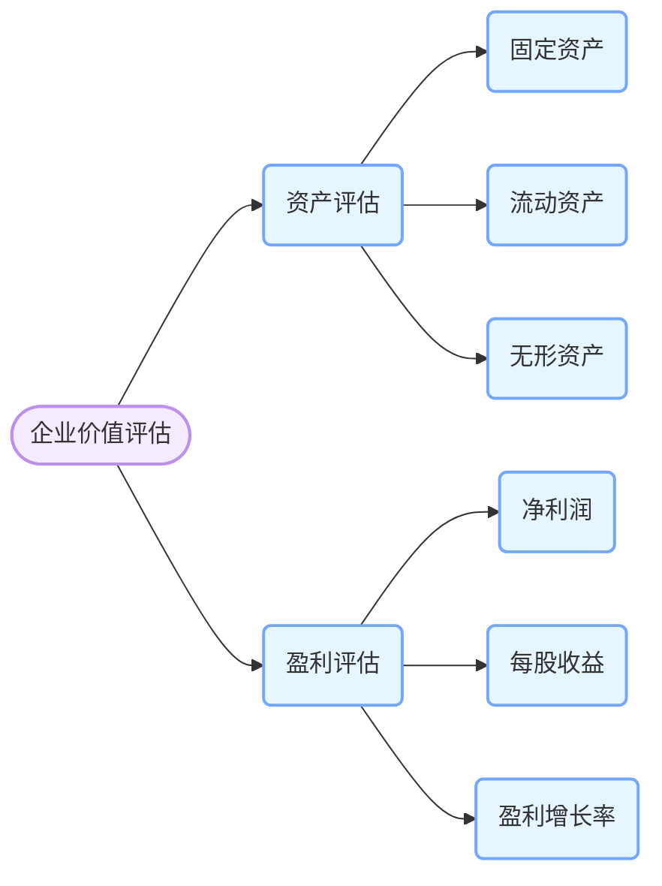

# 格雷厄姆的企业价值评估方法：资产还是盈利？

> 关键词：格雷厄姆、企业价值评估、资产评估、盈利评估、价值投资

> 摘要：本文深入探讨了格雷厄姆的企业价值评估方法，聚焦于资产和盈利在评估中的作用。首先介绍了相关背景知识，包括目的、预期读者等内容。接着阐述了核心概念，通过文本示意图和Mermaid流程图展示了资产和盈利评估的联系。详细讲解了核心算法原理，并给出Python源代码示例。同时，运用数学模型和公式对评估方法进行解读，辅以实际例子加深理解。通过项目实战，搭建开发环境，实现并解读源代码。分析了该评估方法在不同场景的实际应用，推荐了学习、开发相关的工具和资源，包括书籍、在线课程、开发工具等。最后总结了未来发展趋势与挑战，解答了常见问题，并提供了扩展阅读和参考资料，旨在为读者全面剖析格雷厄姆的企业价值评估方法。

## 1. 背景介绍 
### 1.1 目的和范围
在投资领域，准确评估企业价值是做出明智投资决策的关键。格雷厄姆作为价值投资的鼻祖，其企业价值评估方法对投资者有着深远的影响。本文的目的在于深入剖析格雷厄姆的企业价值评估方法，探讨在评估过程中资产和盈利各自的地位和作用。我们将涵盖该评估方法的核心概念、算法原理、数学模型，通过实际案例展示其应用，并分析在不同场景下的适用性，同时为读者提供学习和实践该方法的相关资源。

### 1.2 预期读者
本文预期读者包括对价值投资感兴趣的投资者，无论是专业的金融从业者还是个人投资者，都能从本文中获得关于企业价值评估的深入理解。同时，也适合金融专业的学生、研究人员，为他们的学习和研究提供有价值的参考。对于正在学习投资分析、财务管理等相关课程的人士，本文能够帮助他们将理论知识与实际应用相结合。

### 1.3 文档结构概述
本文将按照以下结构展开：首先介绍格雷厄姆企业价值评估方法的背景信息，包括目的、读者对象和文档结构等。接着阐述核心概念，展示资产和盈利评估之间的联系。然后详细讲解核心算法原理，并给出Python代码实现。运用数学模型和公式进一步解读评估方法，并举例说明。通过项目实战，从开发环境搭建到源代码实现和解读，展示该方法的实际应用。分析该评估方法在不同场景下的应用，推荐学习和开发所需的工具和资源。最后总结未来发展趋势与挑战，解答常见问题，并提供扩展阅读和参考资料。

### 1.4 术语表
#### 1.4.1 核心术语定义
- **企业价值评估**：指对企业整体经济价值进行评定和估算的过程，旨在确定企业在特定时间点的内在价值。
- **资产评估**：对企业所拥有的各种资产，如固定资产、流动资产等进行评估，以确定其市场价值或账面价值。
- **盈利评估**：通过分析企业的盈利能力，如净利润、每股收益等指标，来评估企业的价值。
- **价值投资**：一种投资策略，强调寻找被低估的股票，基于企业的内在价值进行投资。

#### 1.4.2 相关概念解释
- **账面价值**：指企业资产负债表上所记录的资产价值，通常是资产的原始成本减去累计折旧或摊销后的金额。
- **市场价值**：指资产在市场上的交易价格，反映了市场对资产的供需关系和预期。
- **内在价值**：企业的真实价值，基于其未来的盈利能力、资产状况等因素进行评估。

#### 1.4.3 缩略词列表
- **EPS**：Earnings Per Share，每股收益，反映企业每股普通股所获得的利润。
- **P/E**：Price-to-Earnings Ratio，市盈率，衡量股票价格与每股收益之间的比率。
- **BVPS**：Book Value Per Share，每股账面价值，指每股股票所代表的公司净资产价值。

## 2. 核心概念与联系 
格雷厄姆的企业价值评估方法主要围绕资产和盈利两个核心要素。资产评估关注企业所拥有的实物资产和金融资产的价值，而盈利评估则侧重于企业未来的盈利能力。这两个要素相互关联，共同影响着企业的内在价值。

### 文本示意图
```plaintext
企业价值评估
├── 资产评估
│   ├── 固定资产
│   ├── 流动资产
│   └── 无形资产
├── 盈利评估
│   ├── 净利润
│   ├── 每股收益
│   └── 盈利增长率
```

### Mermaid 流程图


从上述示意图和流程图可以看出，资产评估和盈利评估是企业价值评估的两个重要组成部分。资产是企业运营的基础，而盈利则是企业持续发展的动力。在评估企业价值时，需要综合考虑这两个方面的因素。

## 3. 核心算法原理 & 具体操作步骤 
### 核心算法原理
格雷厄姆提出了一些简单而有效的公式来评估企业价值。其中一个经典公式是：

企业价值 = 流动资产 - 总负债 + 预期盈利的现值

这个公式的核心思想是，首先考虑企业的流动资产减去总负债，得到企业的净流动资产价值。然后，将企业未来的预期盈利进行折现，得到预期盈利的现值。两者相加即为企业的价值。

### 具体操作步骤
1. **计算净流动资产价值**：
    - 确定企业的流动资产，包括现金、应收账款、存货等。
    - 确定企业的总负债，包括短期负债和长期负债。
    - 计算净流动资产价值 = 流动资产 - 总负债。

2. **计算预期盈利的现值**：
    - 预测企业未来的盈利情况，可以采用历史盈利数据进行分析，结合行业趋势和企业发展战略进行调整。
    - 选择合适的折现率，折现率反映了资金的时间价值和投资风险。
    - 计算预期盈利的现值，可采用以下公式：

$$PV = \sum_{t=1}^{n} \frac{E_t}{(1 + r)^t}$$

其中，$PV$ 表示预期盈利的现值，$E_t$ 表示第 $t$ 期的预期盈利，$r$ 表示折现率，$n$ 表示预测期数。

3. **计算企业价值**：
    - 将净流动资产价值和预期盈利的现值相加，得到企业的价值。

### Python源代码示例
```python
import numpy as np

def calculate_net_current_assets(current_assets, total_liabilities):
    """
    计算净流动资产价值
    :param current_assets: 流动资产
    :param total_liabilities: 总负债
    :return: 净流动资产价值
    """
    return current_assets - total_liabilities

def calculate_present_value_of_earnings(expected_earnings, discount_rate):
    """
    计算预期盈利的现值
    :param expected_earnings: 预期盈利列表
    :param discount_rate: 折现率
    :return: 预期盈利的现值
    """
    n = len(expected_earnings)
    periods = np.arange(1, n + 1)
    present_values = expected_earnings / (1 + discount_rate) ** periods
    return present_values.sum()

def calculate_enterprise_value(current_assets, total_liabilities, expected_earnings, discount_rate):
    """
    计算企业价值
    :param current_assets: 流动资产
    :param total_liabilities: 总负债
    :param expected_earnings: 预期盈利列表
    :param discount_rate: 折现率
    :return: 企业价值
    """
    net_current_assets = calculate_net_current_assets(current_assets, total_liabilities)
    present_value_of_earnings = calculate_present_value_of_earnings(expected_earnings, discount_rate)
    return net_current_assets + present_value_of_earnings

# 示例数据
current_assets = 1000000
total_liabilities = 500000
expected_earnings = np.array([100000, 120000, 150000])
discount_rate = 0.1

# 计算企业价值
enterprise_value = calculate_enterprise_value(current_assets, total_liabilities, expected_earnings, discount_rate)
print(f"企业价值: {enterprise_value}")
```

在上述代码中，我们定义了三个函数：`calculate_net_current_assets` 用于计算净流动资产价值，`calculate_present_value_of_earnings` 用于计算预期盈利的现值，`calculate_enterprise_value` 用于计算企业价值。最后，我们使用示例数据调用 `calculate_enterprise_value` 函数，输出企业价值。

## 4. 数学模型和公式 & 详细讲解 & 举例说明 
### 数学模型和公式
#### 净流动资产价值
净流动资产价值（Net Current Assets Value，NCV）的计算公式为：

$$NCV = CA - TL$$

其中，$CA$ 表示流动资产，$TL$ 表示总负债。

#### 预期盈利的现值
预期盈利的现值（Present Value of Earnings，PVE）的计算公式为：

$$PVE = \sum_{t=1}^{n} \frac{E_t}{(1 + r)^t}$$

其中，$E_t$ 表示第 $t$ 期的预期盈利，$r$ 表示折现率，$n$ 表示预测期数。

#### 企业价值
企业价值（Enterprise Value，EV）的计算公式为：

$$EV = NCV + PVE$$

### 详细讲解
- **净流动资产价值**：净流动资产价值反映了企业在短期内能够变现的资产净值。流动资产包括现金、应收账款、存货等，这些资产可以在较短时间内转化为现金。总负债则包括企业的短期负债和长期负债。通过计算净流动资产价值，我们可以了解企业在扣除负债后，其流动资产的实际价值。

- **预期盈利的现值**：预期盈利的现值考虑了企业未来盈利的时间价值。由于未来的盈利具有不确定性，我们需要将其折现到当前时刻，以反映其真实价值。折现率 $r$ 反映了资金的时间价值和投资风险，折现率越高，未来盈利的现值越低。

- **企业价值**：企业价值是净流动资产价值和预期盈利的现值之和。它综合考虑了企业的资产状况和未来盈利能力，是评估企业内在价值的重要指标。

### 举例说明
假设一家企业的流动资产为 $1000$ 万元，总负债为 $500$ 万元。预计未来三年的盈利分别为 $100$ 万元、$120$ 万元和 $150$ 万元，折现率为 $10\%$。

1. **计算净流动资产价值**：
$$NCV = CA - TL = 1000 - 500 = 500 \text{（万元）}$$

2. **计算预期盈利的现值**：
$$PVE = \frac{100}{(1 + 0.1)^1} + \frac{120}{(1 + 0.1)^2} + \frac{150}{(1 + 0.1)^3}$$
$$PVE = \frac{100}{1.1} + \frac{120}{1.21} + \frac{150}{1.331}$$
$$PVE \approx 90.91 + 99.17 + 112.69 = 302.77 \text{（万元）}$$

3. **计算企业价值**：
$$EV = NCV + PVE = 500 + 302.77 = 802.77 \text{（万元）}$$

通过上述计算，我们可以得出该企业的价值约为 $802.77$ 万元。

## 5. 项目实战：代码实际案例和详细解释说明 
### 5.1  开发环境搭建
#### 安装Python
首先，确保你已经安装了Python。可以从Python官方网站（https://www.python.org/downloads/）下载适合你操作系统的Python版本。建议安装Python 3.6及以上版本。

#### 安装必要的库
在本项目中，我们使用了 `numpy` 库来进行数值计算。可以使用以下命令安装 `numpy`：

```sh
pip install numpy
```

### 5.2  源代码详细实现和代码解读
```python
import numpy as np

def calculate_net_current_assets(current_assets, total_liabilities):
    """
    计算净流动资产价值
    :param current_assets: 流动资产
    :param total_liabilities: 总负债
    :return: 净流动资产价值
    """
    return current_assets - total_liabilities

def calculate_present_value_of_earnings(expected_earnings, discount_rate):
    """
    计算预期盈利的现值
    :param expected_earnings: 预期盈利列表
    :param discount_rate: 折现率
    :return: 预期盈利的现值
    """
    n = len(expected_earnings)
    periods = np.arange(1, n + 1)
    present_values = expected_earnings / (1 + discount_rate) ** periods
    return present_values.sum()

def calculate_enterprise_value(current_assets, total_liabilities, expected_earnings, discount_rate):
    """
    计算企业价值
    :param current_assets: 流动资产
    :param total_liabilities: 总负债
    :param expected_earnings: 预期盈利列表
    :param discount_rate: 折现率
    :return: 企业价值
    """
    net_current_assets = calculate_net_current_assets(current_assets, total_liabilities)
    present_value_of_earnings = calculate_present_value_of_earnings(expected_earnings, discount_rate)
    return net_current_assets + present_value_of_earnings

# 示例数据
current_assets = 1000000
total_liabilities = 500000
expected_earnings = np.array([100000, 120000, 150000])
discount_rate = 0.1

# 计算企业价值
enterprise_value = calculate_enterprise_value(current_assets, total_liabilities, expected_earnings, discount_rate)
print(f"企业价值: {enterprise_value}")
```

### 代码解读与分析
#### 函数定义
- `calculate_net_current_assets` 函数：该函数接受流动资产和总负债作为输入，返回净流动资产价值。其实现逻辑非常简单，直接用流动资产减去总负债。

- `calculate_present_value_of_earnings` 函数：该函数接受预期盈利列表和折现率作为输入，返回预期盈利的现值。首先，通过 `np.arange` 函数生成一个从 $1$ 到 $n$ 的数组，表示期数。然后，使用公式 $\frac{E_t}{(1 + r)^t}$ 计算每期盈利的现值，并将它们相加得到总现值。

- `calculate_enterprise_value` 函数：该函数接受流动资产、总负债、预期盈利列表和折现率作为输入，返回企业价值。它调用了 `calculate_net_current_assets` 和 `calculate_present_value_of_earnings` 函数，将净流动资产价值和预期盈利的现值相加得到企业价值。

#### 示例数据和计算
在代码的最后部分，我们定义了示例数据，包括流动资产、总负债、预期盈利列表和折现率。然后调用 `calculate_enterprise_value` 函数计算企业价值，并将结果打印输出。

通过这个项目实战，我们可以看到如何使用Python实现格雷厄姆的企业价值评估方法。同时，我们也可以根据实际情况修改示例数据，对不同企业进行价值评估。

## 6. 实际应用场景 
### 股票投资
在股票投资领域，格雷厄姆的企业价值评估方法可以帮助投资者筛选出被低估的股票。投资者可以通过分析企业的资产和盈利情况，计算出企业的内在价值，并与股票的市场价格进行比较。如果股票的市场价格低于其内在价值，那么该股票可能被低估，具有投资价值。

### 企业并购
在企业并购过程中，准确评估目标企业的价值是至关重要的。格雷厄姆的评估方法可以为并购方提供一个客观的价值参考。通过评估目标企业的资产和盈利，并购方可以确定合理的收购价格，避免支付过高的价格。

### 企业财务分析
企业内部的财务分析人员可以使用格雷厄姆的评估方法来评估企业的价值和财务状况。通过分析企业的资产和盈利，财务分析人员可以发现企业的优势和不足，为企业的战略决策提供依据。

### 风险投资
风险投资机构在选择投资项目时，也可以运用格雷厄姆的评估方法。通过评估创业企业的资产和盈利潜力，风险投资机构可以判断项目的投资价值和风险程度，从而做出合理的投资决策。

## 7. 工具和资源推荐
### 7.1 学习资源推荐
#### 7.1.1 书籍推荐
- 《聪明的投资者》（The Intelligent Investor）：格雷厄姆的经典著作，被誉为投资界的圣经。书中详细介绍了价值投资的理念和方法，包括企业价值评估的技巧。
- 《证券分析》（Security Analysis）：同样是格雷厄姆的重要著作，对证券分析和企业价值评估进行了系统的阐述。
- 《财务报表分析》（Financial Statement Analysis）：帮助读者了解如何分析企业的财务报表，获取评估企业价值所需的信息。

#### 7.1.2 在线课程
- Coursera上的“投资学原理”（Principles of Investing）课程：由知名教授授课，涵盖了投资的基本原理和企业价值评估的方法。
- edX上的“财务分析与估值”（Financial Analysis and Valuation）课程：提供了深入的财务分析和企业估值的知识。

#### 7.1.3 技术博客和网站
- Seeking Alpha（https://seekingalpha.com/）：一个提供金融分析和投资建议的网站，有很多关于企业价值评估的文章和研究报告。
- Investopedia（https://www.investopedia.com/）：一个专业的金融知识学习网站，提供了丰富的投资术语解释和企业价值评估的教程。

### 7.2 开发工具框架推荐
#### 7.2.1 IDE和编辑器
- PyCharm：一款功能强大的Python集成开发环境，提供了代码编辑、调试、版本控制等功能，适合Python开发者使用。
- Jupyter Notebook：一个交互式的开发环境，支持Python代码的编写和运行，同时可以方便地展示代码和结果，适合数据分析师和研究人员使用。

#### 7.2.2 调试和性能分析工具
- pdb：Python自带的调试工具，可以帮助开发者定位代码中的错误。
- cProfile：Python的性能分析工具，可以分析代码的运行时间和资源消耗情况，帮助开发者优化代码性能。

#### 7.2.3 相关框架和库
- Pandas：一个强大的数据分析库，提供了数据结构和数据分析工具，方便处理和分析企业的财务数据。
- Scikit-learn：一个机器学习库，提供了各种机器学习算法和工具，可以用于预测企业的盈利情况。

### 7.3 相关论文著作推荐
#### 7.3.1 经典论文
- “The Theory of Investment Value” by John Burr Williams：提出了现金流折现模型，对企业价值评估产生了深远的影响。
- “Security Analysis” by Benjamin Graham and David Dodd：奠定了价值投资的理论基础，对企业价值评估进行了系统的研究。

#### 7.3.2 最新研究成果
- 可以关注《Journal of Finance》、《Review of Financial Studies》等金融领域的顶级学术期刊，了解企业价值评估的最新研究进展。

#### 7.3.3 应用案例分析
- 可以参考一些知名投资机构的研究报告，了解他们在实际投资中如何运用企业价值评估方法。例如，巴菲特的伯克希尔·哈撒韦公司的年报中就包含了很多关于企业价值评估和投资决策的案例分析。

## 8. 总结：未来发展趋势与挑战
### 未来发展趋势
- **数据驱动的评估方法**：随着大数据和人工智能技术的发展，未来的企业价值评估方法将更加依赖于数据。通过收集和分析大量的企业数据，包括财务数据、市场数据、社交媒体数据等，可以更准确地评估企业的价值。
- **综合评估模型的应用**：单一的资产或盈利评估方法可能无法全面反映企业的价值。未来，将出现更多的综合评估模型，结合资产、盈利、市场竞争力、创新能力等多个因素，对企业进行更全面、准确的评估。
- **国际化评估标准的统一**：随着全球经济一体化的发展，企业的跨国并购和投资活动日益频繁。未来，国际间的企业价值评估标准将逐渐统一，提高评估结果的可比性和可信度。

### 挑战
- **数据质量和可靠性**：数据是企业价值评估的基础，但数据的质量和可靠性往往难以保证。例如，企业的财务报表可能存在造假行为，市场数据可能存在误差。因此，如何获取准确、可靠的数据是企业价值评估面临的一个重要挑战。
- **不确定性和风险评估**：企业的未来盈利和发展受到多种因素的影响，如市场竞争、技术创新、政策变化等，具有很大的不确定性。如何准确评估这些不确定性和风险，是企业价值评估的另一个挑战。
- **新兴行业的评估难题**：随着科技的不断发展，新兴行业如人工智能、区块链、生物技术等不断涌现。这些行业的企业具有独特的商业模式和发展特点，传统的企业价值评估方法可能无法适用。如何建立适合新兴行业的评估方法，是未来需要解决的问题。

## 9. 附录：常见问题与解答
### 问题1：如何确定折现率？
折现率的确定需要考虑多个因素，包括无风险利率、市场风险溢价、企业特定风险等。一般来说，可以参考国债收益率作为无风险利率，市场风险溢价可以根据历史数据进行估算，企业特定风险则需要根据企业的行业特点、财务状况、经营风险等因素进行评估。在实际应用中，折现率的确定往往具有一定的主观性，需要投资者根据自己的判断和经验进行选择。

### 问题2：预期盈利的预测方法有哪些？
预期盈利的预测方法有很多种，常见的方法包括历史数据分析法、行业比较法、趋势分析法等。历史数据分析法是通过分析企业过去的盈利数据，找出其变化规律，从而预测未来的盈利情况。行业比较法是将企业的盈利情况与同行业的其他企业进行比较，根据行业平均水平和企业的竞争力来预测未来的盈利。趋势分析法是根据企业的发展趋势和市场环境的变化，对未来的盈利进行预测。

### 问题3：资产评估和盈利评估哪个更重要？
资产评估和盈利评估都非常重要，它们从不同的角度反映了企业的价值。资产是企业运营的基础，资产评估可以帮助我们了解企业的家底和实力。盈利是企业持续发展的动力，盈利评估可以帮助我们预测企业的未来发展潜力。在实际评估中，需要综合考虑资产和盈利两个方面的因素，不能片面地强调某一个方面。

### 问题4：格雷厄姆的企业价值评估方法适用于所有企业吗？
格雷厄姆的企业价值评估方法并不是适用于所有企业。该方法更适用于传统行业的企业，这些企业的资产和盈利相对稳定，容易进行评估。对于新兴行业的企业，如互联网、科技等行业，由于其商业模式和发展特点与传统行业不同，可能需要采用更适合的评估方法。

## 10. 扩展阅读 & 参考资料
### 扩展阅读
- 《巴菲特致股东的信：股份公司教程》（Letters to Shareholders of Berkshire Hathaway）：巴菲特的信件中包含了很多关于投资和企业价值评估的宝贵经验和见解。
- 《穷查理宝典：查理·芒格的智慧箴言录》（Poor Charlie's Almanack: The Wit and Wisdom of Charles T. Munger）：查理·芒格是巴菲特的长期合作伙伴，他的思想和观点对价值投资有着重要的影响。

### 参考资料
- Graham, Benjamin. The Intelligent Investor. HarperBusiness, 2003.
- Graham, Benjamin, and David Dodd. Security Analysis. McGraw-Hill, 1934.
- Williams, John Burr. The Theory of Investment Value. Harvard University Press, 1938.

作者：AI天才研究院/AI Genius Institute & 禅与计算机程序设计艺术 /Zen And The Art of Computer Programming