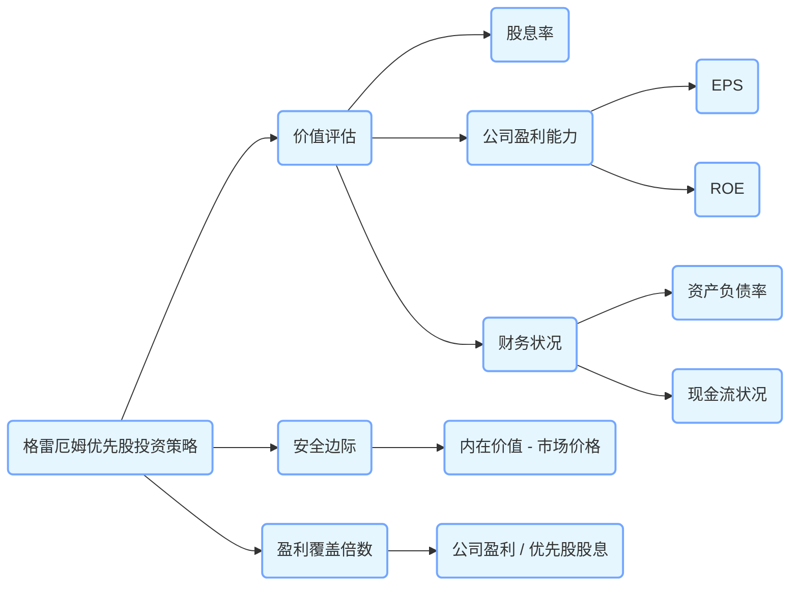

# 格雷厄姆的优先股投资策略

> 关键词：格雷厄姆、优先股、投资策略、价值分析、财务指标

> 摘要：本文深入探讨了格雷厄姆的优先股投资策略。首先介绍了该策略产生的背景，包括目的、预期读者、文档结构和相关术语。接着阐述了优先股投资的核心概念及它们之间的联系，通过文本示意图和Mermaid流程图进行直观展示。详细讲解了核心算法原理和具体操作步骤，并用Python代码进行了实现。分析了相关的数学模型和公式，并举例说明。通过项目实战，展示了代码实际案例并进行详细解释。探讨了该策略的实际应用场景，推荐了学习资源、开发工具框架和相关论文著作。最后总结了未来发展趋势与挑战，提供了常见问题解答和扩展阅读参考资料，旨在为投资者理解和运用格雷厄姆的优先股投资策略提供全面而深入的指导。

## 1. 背景介绍 
### 1.1 目的和范围
格雷厄姆作为价值投资的鼻祖，其投资理念和策略对金融市场产生了深远的影响。本文的目的在于深入剖析格雷厄姆的优先股投资策略，详细阐述其核心原理、操作步骤和应用场景。通过对该策略的研究，投资者可以更好地理解如何在优先股市场中寻找具有投资价值的标的，提高投资决策的科学性和准确性。本文的范围涵盖了优先股投资策略的各个方面，包括核心概念、算法原理、数学模型、实际案例以及相关的工具和资源推荐。

### 1.2 预期读者
本文的预期读者主要包括对价值投资感兴趣的个人投资者、金融专业人士、投资机构的分析师和研究员等。对于那些希望学习和应用格雷厄姆投资思想的人来说，本文将提供有价值的参考和指导。同时，对于从事金融教学和研究的人员，本文也可以作为深入探讨优先股投资策略的学术资料。

### 1.3 文档结构概述
本文将按照以下结构进行阐述：首先介绍背景信息，包括目的、读者和文档结构；接着讲解核心概念与联系，通过文本示意图和流程图直观展示；然后详细阐述核心算法原理和具体操作步骤，并用Python代码实现；分析相关的数学模型和公式，并举例说明；通过项目实战展示代码实际案例并进行详细解释；探讨实际应用场景；推荐学习资源、开发工具框架和相关论文著作；最后总结未来发展趋势与挑战，提供常见问题解答和扩展阅读参考资料。

### 1.4 术语表
#### 1.4.1 核心术语定义
- **优先股**：是指在利润分红及剩余财产分配的权利方面，优先于普通股的股份。优先股股东一般没有选举权和被选举权，对公司的经营没有参与权，优先股股东不能退股，只能通过优先股的赎回条款被公司赎回。
- **股息率**：是指优先股每年获得的股息与优先股面值的比率，它是衡量优先股收益的重要指标。
- **安全边际**：是指股票的内在价值与市场价格之间的差值，安全边际越大，投资的风险越低。
- **盈利覆盖倍数**：是指公司的盈利能够覆盖优先股股息的倍数，反映了公司支付优先股股息的能力。

#### 1.4.2 相关概念解释
- **价值投资**：是一种基于对股票内在价值的分析，寻找被低估的股票进行投资的策略。格雷厄姆是价值投资的创始人，他强调通过对公司财务报表和基本面的分析来确定股票的内在价值。
- **固定收益证券**：是指能够提供固定现金流的证券，优先股属于固定收益证券的一种，其股息通常是固定的。

#### 1.4.3 缩略词列表
- **EPS**：Earnings Per Share，每股收益，是指公司净利润与发行在外普通股股数的比值。
- **ROE**：Return on Equity，净资产收益率，是指公司净利润与股东权益的比率，反映了公司运用自有资本的效率。

## 2. 核心概念与联系 
### 核心概念原理
格雷厄姆的优先股投资策略基于价值投资的理念，其核心原理是通过对优先股的内在价值进行评估，寻找具有安全边际的投资机会。优先股的内在价值主要取决于其股息率、公司的盈利能力和财务状况等因素。

股息率是优先股投资的重要收益来源，较高的股息率意味着投资者可以获得更高的回报。然而，仅仅关注股息率是不够的，还需要考虑公司的盈利能力和财务状况。如果公司的盈利能力较弱，可能无法按时支付优先股股息，从而导致投资风险增加。

安全边际是格雷厄姆投资策略的重要概念之一。在优先股投资中，安全边际可以通过比较优先股的内在价值和市场价格来确定。如果优先股的市场价格低于其内在价值，那么就存在安全边际，投资者可以在一定程度上抵御市场波动的风险。

盈利覆盖倍数也是评估优先股投资价值的重要指标。它反映了公司的盈利能够覆盖优先股股息的倍数，盈利覆盖倍数越高，说明公司支付优先股股息的能力越强，投资风险越低。

### 文本示意图
```plaintext
格雷厄姆优先股投资策略
|-- 价值评估
|   |-- 股息率
|   |-- 公司盈利能力
|   |   |-- EPS
|   |   |-- ROE
|   |-- 财务状况
|       |-- 资产负债率
|       |-- 现金流状况
|-- 安全边际
|   |-- 内在价值 - 市场价格
|-- 盈利覆盖倍数
|   |-- 公司盈利 / 优先股股息
```

### Mermaid流程图


## 3. 核心算法原理 & 具体操作步骤 
### 核心算法原理
格雷厄姆的优先股投资策略的核心算法原理主要包括以下几个方面：
1. **股息率计算**：股息率的计算公式为：$股息率 = \frac{优先股股息}{优先股面值} \times 100\%$。通过计算股息率，可以评估优先股的收益水平。
2. **内在价值评估**：优先股的内在价值可以通过股息贴现模型进行评估。假设优先股的股息是固定的，且公司能够持续支付股息，那么优先股的内在价值计算公式为：$V = \frac{D}{r}$，其中 $V$ 表示优先股的内在价值，$D$ 表示每年的优先股股息，$r$ 表示投资者要求的必要收益率。
3. **安全边际计算**：安全边际的计算公式为：$安全边际 = 内在价值 - 市场价格$。安全边际越大，说明投资的风险越低。
4. **盈利覆盖倍数计算**：盈利覆盖倍数的计算公式为：$盈利覆盖倍数 = \frac{公司盈利}{优先股股息}$。盈利覆盖倍数越高，说明公司支付优先股股息的能力越强。

### 具体操作步骤
1. **筛选优先股**：根据股息率、公司规模、行业等条件筛选出符合要求的优先股。
2. **收集数据**：收集优先股的相关数据，包括股息率、面值、市场价格、公司的财务报表等。
3. **计算内在价值**：使用股息贴现模型计算优先股的内在价值。
4. **计算安全边际**：根据内在价值和市场价格计算安全边际。
5. **计算盈利覆盖倍数**：根据公司的盈利和优先股股息计算盈利覆盖倍数。
6. **评估投资价值**：根据安全边际和盈利覆盖倍数评估优先股的投资价值。如果安全边际较大且盈利覆盖倍数较高，那么该优先股具有较高的投资价值。
7. **做出投资决策**：根据评估结果做出投资决策，选择具有投资价值的优先股进行投资。

### Python源代码实现
```python
# 定义股息率计算函数
def calculate_dividend_yield(dividend, face_value):
    """
    计算股息率
    :param dividend: 优先股股息
    :param face_value: 优先股面值
    :return: 股息率
    """
    return (dividend / face_value) * 100

# 定义内在价值计算函数
def calculate_intrinsic_value(dividend, required_return):
    """
    计算优先股的内在价值
    :param dividend: 每年的优先股股息
    :param required_return: 投资者要求的必要收益率
    :return: 优先股的内在价值
    """
    return dividend / required_return

# 定义安全边际计算函数
def calculate_margin_of_safety(intrinsic_value, market_price):
    """
    计算安全边际
    :param intrinsic_value: 优先股的内在价值
    :param market_price: 优先股的市场价格
    :return: 安全边际
    """
    return intrinsic_value - market_price

# 定义盈利覆盖倍数计算函数
def calculate_earnings_coverage_ratio(company_earnings, preferred_dividend):
    """
    计算盈利覆盖倍数
    :param company_earnings: 公司的盈利
    :param preferred_dividend: 优先股股息
    :return: 盈利覆盖倍数
    """
    return company_earnings / preferred_dividend

# 示例数据
dividend = 5  # 优先股股息
face_value = 100  # 优先股面值
required_return = 0.06  # 投资者要求的必要收益率
market_price = 80  # 优先股的市场价格
company_earnings = 20  # 公司的盈利

# 计算股息率
dividend_yield = calculate_dividend_yield(dividend, face_value)
print(f"股息率: {dividend_yield}%")

# 计算内在价值
intrinsic_value = calculate_intrinsic_value(dividend, required_return)
print(f"内在价值: {intrinsic_value}")

# 计算安全边际
margin_of_safety = calculate_margin_of_safety(intrinsic_value, market_price)
print(f"安全边际: {margin_of_safety}")

# 计算盈利覆盖倍数
earnings_coverage_ratio = calculate_earnings_coverage_ratio(company_earnings, dividend)
print(f"盈利覆盖倍数: {earnings_coverage_ratio}")
```

## 4. 数学模型和公式 & 详细讲解 & 举例说明 
### 股息率计算公式
$股息率 = \frac{优先股股息}{优先股面值} \times 100\%$

详细讲解：股息率反映了优先股每年的股息收益与面值的比例关系。它是衡量优先股收益水平的重要指标，股息率越高，说明投资者每年获得的股息收益越高。

举例说明：假设某优先股的面值为100元，每年的股息为5元，那么该优先股的股息率为：$\frac{5}{100} \times 100\% = 5\%$。

### 股息贴现模型计算公式
$V = \frac{D}{r}$

详细讲解：该公式用于评估优先股的内在价值。其中，$V$ 表示优先股的内在价值，$D$ 表示每年的优先股股息，$r$ 表示投资者要求的必要收益率。该公式的原理是将未来每年的股息按照投资者要求的必要收益率进行贴现，得到优先股的现值，即内在价值。

举例说明：假设某优先股每年的股息为5元，投资者要求的必要收益率为6%，那么该优先股的内在价值为：$V = \frac{5}{0.06} \approx 83.33$（元）。

### 安全边际计算公式
$安全边际 = 内在价值 - 市场价格$

详细讲解：安全边际反映了优先股的内在价值与市场价格之间的差值。安全边际越大，说明优先股的市场价格相对其内在价值越低，投资的风险越小。

举例说明：假设某优先股的内在价值为83.33元，市场价格为80元，那么该优先股的安全边际为：$83.33 - 80 = 3.33$（元）。

### 盈利覆盖倍数计算公式
$盈利覆盖倍数 = \frac{公司盈利}{优先股股息}$

详细讲解：盈利覆盖倍数反映了公司的盈利能够覆盖优先股股息的倍数。盈利覆盖倍数越高，说明公司支付优先股股息的能力越强，投资风险越低。

举例说明：假设某公司的盈利为20元，优先股股息为5元，那么该优先股的盈利覆盖倍数为：$\frac{20}{5} = 4$。

## 5. 项目实战：代码实际案例和详细解释说明 
### 5.1 开发环境搭建
在进行项目实战之前，需要搭建相应的开发环境。以下是具体的搭建步骤：
1. **安装Python**：可以从Python官方网站（https://www.python.org/downloads/）下载并安装Python 3.x版本。
2. **安装开发工具**：推荐使用PyCharm作为开发工具，它是一款功能强大的Python集成开发环境（IDE）。可以从JetBrains官方网站（https://www.jetbrains.com/pycharm/download/）下载并安装PyCharm Community Edition（免费版）。
3. **安装必要的库**：在项目中需要使用到一些Python库，如`pandas`、`numpy`等。可以使用以下命令进行安装：
```sh
pip install pandas numpy
```

### 5.2 源代码详细实现和代码解读
```python
import pandas as pd

# 定义优先股数据类
class PreferredStock:
    def __init__(self, face_value, dividend, market_price, company_earnings, required_return):
        """
        初始化优先股数据
        :param face_value: 优先股面值
        :param dividend: 优先股股息
        :param market_price: 优先股市场价格
        :param company_earnings: 公司盈利
        :param required_return: 投资者要求的必要收益率
        """
        self.face_value = face_value
        self.dividend = dividend
        self.market_price = market_price
        self.company_earnings = company_earnings
        self.required_return = required_return

    def calculate_dividend_yield(self):
        """
        计算股息率
        :return: 股息率
        """
        return (self.dividend / self.face_value) * 100

    def calculate_intrinsic_value(self):
        """
        计算优先股的内在价值
        :return: 优先股的内在价值
        """
        return self.dividend / self.required_return

    def calculate_margin_of_safety(self):
        """
        计算安全边际
        :return: 安全边际
        """
        intrinsic_value = self.calculate_intrinsic_value()
        return intrinsic_value - self.market_price

    def calculate_earnings_coverage_ratio(self):
        """
        计算盈利覆盖倍数
        :return: 盈利覆盖倍数
        """
        return self.company_earnings / self.dividend

    def evaluate_investment_value(self):
        """
        评估优先股的投资价值
        :return: 投资价值评估结果
        """
        margin_of_safety = self.calculate_margin_of_safety()
        earnings_coverage_ratio = self.calculate_earnings_coverage_ratio()
        if margin_of_safety > 0 and earnings_coverage_ratio > 2:
            return "具有较高投资价值"
        else:
            return "投资价值较低"

# 示例数据
data = {
    "face_value": [100, 100, 100],
    "dividend": [5, 6, 4],
    "market_price": [80, 85, 90],
    "company_earnings": [20, 25, 15],
    "required_return": [0.06, 0.06, 0.06]
}

df = pd.DataFrame(data)

# 评估每只优先股的投资价值
results = []
for index, row in df.iterrows():
    stock = PreferredStock(
        face_value=row["face_value"],
        dividend=row["dividend"],
        market_price=row["market_price"],
        company_earnings=row["company_earnings"],
        required_return=row["required_return"]
    )
    dividend_yield = stock.calculate_dividend_yield()
    intrinsic_value = stock.calculate_intrinsic_value()
    margin_of_safety = stock.calculate_margin_of_safety()
    earnings_coverage_ratio = stock.calculate_earnings_coverage_ratio()
    investment_value = stock.evaluate_investment_value()
    result = {
        "股息率": dividend_yield,
        "内在价值": intrinsic_value,
        "安全边际": margin_of_safety,
        "盈利覆盖倍数": earnings_coverage_ratio,
        "投资价值评估": investment_value
    }
    results.append(result)

# 将评估结果转换为DataFrame
result_df = pd.DataFrame(results)

# 输出评估结果
print(result_df)
```

### 代码解读与分析
1. **PreferredStock类**：定义了一个`PreferredStock`类，用于表示优先股。该类包含了优先股的基本信息，如面值、股息、市场价格、公司盈利和投资者要求的必要收益率。同时，该类还提供了计算股息率、内在价值、安全边际、盈利覆盖倍数和评估投资价值的方法。
2. **数据准备**：使用`pandas`库创建了一个包含多只优先股数据的DataFrame。
3. **评估投资价值**：遍历DataFrame中的每一行数据，创建`PreferredStock`对象，并调用其方法计算各项指标和评估投资价值。
4. **结果输出**：将评估结果存储在一个列表中，并转换为DataFrame进行输出。

通过以上代码，我们可以对多只优先股的投资价值进行评估，为投资决策提供参考。

## 6. 实际应用场景 
### 个人投资者
对于个人投资者来说，格雷厄姆的优先股投资策略可以帮助他们在优先股市场中寻找具有投资价值的标的。个人投资者可以根据股息率、安全边际和盈利覆盖倍数等指标筛选出符合要求的优先股，进行长期投资。这种策略可以在一定程度上降低投资风险，获得稳定的股息收益。

### 投资机构
投资机构可以将格雷厄姆的优先股投资策略应用于资产配置中。通过对优先股的深入分析和评估，投资机构可以选择具有较高投资价值的优先股纳入投资组合，以提高组合的收益稳定性和抗风险能力。同时，投资机构还可以利用该策略进行风险管理，避免投资于高风险的优先股。

### 公司财务决策
对于发行优先股的公司来说，了解格雷厄姆的优先股投资策略可以帮助他们制定合理的股息政策和融资策略。公司可以通过提高盈利水平和财务状况，提高优先股的投资价值，吸引更多的投资者。同时，公司还可以根据市场情况和投资者需求，合理确定优先股的股息率和发行价格。

## 7. 工具和资源推荐
### 7.1 学习资源推荐
#### 7.1.1 书籍推荐
- 《聪明的投资者》（The Intelligent Investor）：格雷厄姆的经典著作，详细阐述了价值投资的理念和方法，包括优先股投资策略。
- 《证券分析》（Security Analysis）：也是格雷厄姆的重要著作，对证券的分析和评估方法进行了系统的介绍。
- 《价值投资实战手册》：作者唐朝，结合实际案例，深入浅出地讲解了价值投资的原理和方法。

#### 7.1.2 在线课程
- Coursera上的“投资学原理”（Principles of Investment）课程：由知名教授授课，涵盖了投资学的各个方面，包括优先股投资。
- 网易云课堂上的“价值投资入门与实战”课程：系统介绍了价值投资的理论和实践，适合初学者学习。

#### 7.1.3 技术博客和网站
- 雪球网：是一个投资者交流社区，上面有很多关于优先股投资的讨论和分析文章。
- 价值投资论坛：专注于价值投资领域，提供了丰富的投资知识和经验分享。

### 7.2 开发工具框架推荐
#### 7.2.1 IDE和编辑器
- PyCharm：功能强大的Python集成开发环境，适合进行Python代码的开发和调试。
- Jupyter Notebook：交互式的开发环境，适合进行数据分析和模型验证。

#### 7.2.2 调试和性能分析工具
- pdb：Python自带的调试工具，可以帮助开发者定位代码中的问题。
- cProfile：Python的性能分析工具，可以分析代码的运行时间和性能瓶颈。

#### 7.2.3 相关框架和库
- pandas：用于数据处理和分析的Python库，提供了丰富的数据结构和数据操作方法。
- numpy：用于科学计算的Python库，提供了高效的数组和矩阵运算功能。

### 7.3 相关论文著作推荐
#### 7.3.1 经典论文
- Graham, Benjamin, and David L. Dodd. "Security Analysis." McGraw-Hill, 1934. 这篇经典论文奠定了价值投资的理论基础，对优先股投资策略也有深入的探讨。
- Graham, Benjamin. "The Intelligent Investor." Harper & Brothers, 1949. 详细阐述了价值投资的理念和方法，对投资者具有重要的指导意义。

#### 7.3.2 最新研究成果
- 可以通过学术数据库如IEEE Xplore、ACM Digital Library等搜索关于优先股投资策略的最新研究成果。

#### 7.3.3 应用案例分析
- 一些金融研究机构和投资公司会发布关于优先股投资的应用案例分析报告，可以通过他们的官方网站获取相关资料。

## 8. 总结：未来发展趋势与挑战
### 未来发展趋势
- **数字化和智能化**：随着科技的不断发展，优先股投资策略将越来越多地借助数字化和智能化工具。例如，利用大数据分析和人工智能算法可以更准确地评估优先股的投资价值，提高投资决策的效率和准确性。
- **多元化投资**：投资者将越来越倾向于多元化投资，优先股作为一种具有固定收益和优先分配权的投资品种，将在多元化投资组合中发挥越来越重要的作用。
- **国际化投资**：随着全球金融市场的一体化，投资者将有更多的机会参与国际优先股市场的投资。这将促使投资者更加关注不同国家和地区的优先股市场，了解其投资环境和投资机会。

### 挑战
- **市场不确定性**：金融市场充满了不确定性，优先股市场也不例外。宏观经济环境的变化、政策法规的调整等因素都可能对优先股市场产生影响，增加投资风险。
- **信息不对称**：在优先股投资中，投资者可能面临信息不对称的问题。公司管理层可能掌握更多的内部信息，而投资者只能通过公开信息进行分析和决策。这可能导致投资者做出不准确的投资决策。
- **竞争加剧**：随着优先股市场的发展，越来越多的投资者和投资机构将进入该市场，竞争将日益激烈。投资者需要不断提高自己的投资能力和分析水平，才能在竞争中脱颖而出。

## 9. 附录：常见问题与解答
### 1. 优先股和普通股有什么区别？
- 优先股在利润分红及剩余财产分配的权利方面优先于普通股，但优先股股东一般没有选举权和被选举权，对公司的经营没有参与权。
- 普通股的股息是不固定的，取决于公司的盈利情况；而优先股的股息通常是固定的。

### 2. 如何确定投资者要求的必要收益率？
- 投资者要求的必要收益率可以根据市场利率、投资风险等因素来确定。一般来说，市场利率越高，投资者要求的必要收益率也越高；投资风险越大，投资者要求的必要收益率也越高。

### 3. 安全边际是不是越大越好？
- 一般来说，安全边际越大，投资的风险越低。但安全边际过大也可能意味着市场对该优先股存在过度低估，需要进一步分析原因。投资者应该综合考虑安全边际和其他因素，做出合理的投资决策。

### 4. 盈利覆盖倍数的合理范围是多少？
- 一般来说，盈利覆盖倍数大于2被认为是比较合理的。这意味着公司的盈利能够至少两倍覆盖优先股股息，说明公司支付优先股股息的能力较强。但不同行业和公司的情况可能有所不同，需要具体情况具体分析。

## 10. 扩展阅读 & 参考资料
### 扩展阅读
- 《巴菲特致股东的信：股份公司教程》：巴菲特在信中分享了他的投资理念和经验，对理解格雷厄姆的投资思想有很大的帮助。
- 《财务报表分析与股票估值》：详细介绍了如何通过财务报表分析评估股票的投资价值，对于优先股投资也有一定的参考价值。

### 参考资料
- Graham, Benjamin. "The Intelligent Investor." Harper & Brothers, 1949.
- Graham, Benjamin, and David L. Dodd. "Security Analysis." McGraw-Hill, 1934.
- 唐朝. 《价值投资实战手册》. 机械工业出版社, 2019.

作者：AI天才研究院/AI Genius Institute & 禅与计算机程序设计艺术 /Zen And The Art of Computer Programming