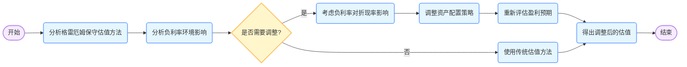

# 格雷厄姆的保守估值方法：在负利率环境中的调整

> 关键词：格雷厄姆保守估值方法、负利率环境、估值调整、股票估值、财务分析

> 摘要：本文聚焦于格雷厄姆的保守估值方法在负利率环境下的调整。首先介绍了格雷厄姆保守估值方法的背景和基本原理，接着分析负利率环境对传统估值方法的影响。通过阐述核心概念与联系，详细讲解核心算法原理及具体操作步骤，并给出相应的数学模型和公式。结合项目实战，给出代码实际案例和详细解释。探讨了该估值方法在不同场景下的实际应用，推荐了相关的学习资源、开发工具框架和论文著作。最后总结未来发展趋势与挑战，解答常见问题，并提供扩展阅读和参考资料，旨在为投资者和金融从业者在负利率环境下运用格雷厄姆保守估值方法提供全面的指导。

## 1. 背景介绍 
### 1.1 目的和范围
本文章的目的是深入探讨格雷厄姆的保守估值方法在负利率环境下的适应性和调整策略。格雷厄姆作为价值投资的先驱，其保守估值方法在传统金融环境中被广泛应用。然而，随着全球经济形势的变化，负利率现象逐渐出现并成为一种新的金融常态。这种新环境对传统的估值方法提出了挑战，需要对其进行相应的调整。本文将涵盖从理论原理到实际应用的各个方面，包括核心概念的解释、算法原理的阐述、数学模型的推导、实际案例的分析以及相关工具和资源的推荐。

### 1.2 预期读者
本文预期读者主要包括金融投资者、证券分析师、金融研究员以及对价值投资和金融估值方法感兴趣的专业人士和学生。对于那些希望在负利率环境下运用格雷厄姆保守估值方法进行股票投资决策、财务分析的读者来说，本文将提供有价值的参考和指导。

### 1.3 文档结构概述
本文将按照以下结构进行组织：首先介绍格雷厄姆保守估值方法的背景和相关术语，为后续的讨论奠定基础。然后详细阐述核心概念与联系，通过文本示意图和 Mermaid 流程图展示其原理和架构。接着讲解核心算法原理和具体操作步骤，并用 Python 代码进行详细阐述。之后给出数学模型和公式，并进行详细讲解和举例说明。通过项目实战，展示代码实际案例并进行详细解释。探讨该估值方法在实际应用场景中的应用。推荐相关的学习资源、开发工具框架和论文著作。最后总结未来发展趋势与挑战，解答常见问题，并提供扩展阅读和参考资料。

### 1.4 术语表
#### 1.4.1 核心术语定义
- **格雷厄姆保守估值方法**：由本杰明·格雷厄姆提出的一种基于公司基本面分析的股票估值方法，强调安全边际和内在价值的计算，通过考虑公司的盈利、资产等因素来评估股票的合理价格。
- **负利率环境**：指市场利率为负数的经济环境，通常表现为存款利率为负，即存款人需要向银行支付费用来存放资金，这种情况可能会对金融市场和资产估值产生重大影响。
- **内在价值**：指股票所代表的公司的真实价值，是基于公司的财务状况、盈利能力、资产质量等因素综合评估得出的价值，与股票的市场价格相对。
- **安全边际**：指股票的内在价值与市场价格之间的差额，格雷厄姆认为投资者应该在内在价值显著高于市场价格时买入股票，以降低投资风险。

#### 1.4.2 相关概念解释
- **市盈率（P/E）**：指股票价格与每股盈利的比率，是衡量股票估值的常用指标之一。在格雷厄姆的估值方法中，市盈率是一个重要的考虑因素。
- **市净率（P/B）**：指股票价格与每股净资产的比率，反映了市场对公司资产价值的认可程度。
- **股息率**：指股息与股票价格的比率，是衡量股票投资收益的一个指标，对于注重股息收益的投资者来说具有重要意义。

#### 1.4.3 缩略词列表
- **P/E**：Price-to-Earnings Ratio，市盈率
- **P/B**：Price-to-Book Ratio，市净率

## 2. 核心概念与联系 
### 格雷厄姆保守估值方法的基本原理
格雷厄姆保守估值方法的核心思想是通过对公司的基本面进行深入分析，确定股票的内在价值，并在内在价值显著高于市场价格时进行投资，以获取安全边际。该方法主要考虑以下几个方面的因素：
- **盈利因素**：公司的盈利能力是估值的重要基础。格雷厄姆通常会关注公司的过去盈利情况和预期盈利增长，使用市盈率等指标来评估股票的估值水平。
- **资产因素**：公司的资产价值也是估值的重要组成部分。市净率是衡量公司资产价值的常用指标，格雷厄姆认为股票的市净率应该处于合理水平。
- **股息因素**：对于一些稳定分红的公司，股息率也是估值的考虑因素之一。较高的股息率可以为投资者提供一定的现金流回报。

### 负利率环境对传统估值方法的影响
在负利率环境下，传统的格雷厄姆保守估值方法面临着一些挑战。主要体现在以下几个方面：
- **利率因素**：传统的估值方法通常会使用市场利率作为折现率来计算股票的内在价值。在负利率环境下，市场利率为负数，这会导致折现率的计算变得复杂，传统的折现模型可能不再适用。
- **资产配置**：负利率环境会影响投资者的资产配置决策。由于存款利率为负，投资者可能会更倾向于将资金投入到股票等风险资产中，从而导致股票市场的估值水平上升。
- **盈利预期**：负利率环境可能会对公司的盈利产生影响。一方面，低利率可能会降低公司的融资成本，有利于公司的盈利增长；另一方面，负利率也可能反映了经济增长的乏力，从而对公司的盈利前景产生负面影响。

### 核心概念的联系
格雷厄姆保守估值方法的各个核心概念之间存在着密切的联系。例如，市盈率和市净率都是衡量股票估值的重要指标，它们之间相互影响。较高的市盈率可能意味着市场对公司的盈利增长预期较高，但也可能导致市净率上升，从而增加投资风险。股息率与市盈率和市净率也存在一定的关系，较高的股息率可能会降低股票的市盈率，但也可能反映了公司的盈利增长乏力。在负利率环境下，这些核心概念的联系会更加复杂，需要综合考虑各种因素来进行估值调整。

### 文本示意图
```plaintext
格雷厄姆保守估值方法
|-- 盈利因素
|   |-- 过去盈利情况
|   |-- 预期盈利增长
|   |-- 市盈率
|-- 资产因素
|   |-- 资产价值
|   |-- 市净率
|-- 股息因素
|   |-- 股息率

负利率环境
|-- 利率因素
|-- 资产配置
|-- 盈利预期

格雷厄姆保守估值方法在负利率环境下的调整
|-- 考虑负利率对折现率的影响
|-- 调整资产配置策略
|-- 重新评估盈利预期
```

### Mermaid 流程图


## 3. 核心算法原理 & 具体操作步骤 
### 传统格雷厄姆保守估值方法的核心算法原理
传统的格雷厄姆保守估值方法主要基于以下两个公式：
- **基于市盈率的估值公式**：
  股票的内在价值 $V_{PE} = EPS \times P/E_{合理}$
  其中，$EPS$ 是每股盈利，$P/E_{合理}$ 是合理的市盈率。合理的市盈率通常根据公司的行业特点、盈利稳定性等因素来确定。

- **基于市净率的估值公式**：
  股票的内在价值 $V_{PB} = BVPS \times P/B_{合理}$
  其中，$BVPS$ 是每股净资产，$P/B_{合理}$ 是合理的市净率。

最终的内在价值 $V$ 可以取 $V_{PE}$ 和 $V_{PB}$ 中的较小值，以保证估值的保守性。

### 负利率环境下的算法调整
在负利率环境下，需要对传统的算法进行调整。主要体现在以下几个方面：
- **折现率的调整**：传统的折现率通常使用市场利率。在负利率环境下，可以考虑使用一个经过调整的折现率，例如将市场利率加上一个风险溢价。假设市场利率为 $r_{市场}$，风险溢价为 $r_{溢价}$，则调整后的折现率 $r = r_{市场} + r_{溢价}$。
- **盈利预期的调整**：由于负利率环境可能会对公司的盈利产生影响，需要重新评估公司的盈利预期。可以考虑使用一个调整后的每股盈利 $EPS_{调整}$，例如根据宏观经济数据和行业趋势对 $EPS$ 进行调整。

### 具体操作步骤
#### 步骤 1：收集数据
收集公司的财务数据，包括每股盈利 $EPS$、每股净资产 $BVPS$，以及市场利率 $r_{市场}$、行业平均市盈率 $P/E_{行业}$ 和市净率 $P/B_{行业}$ 等数据。

#### 步骤 2：确定合理的市盈率和市净率
根据公司的行业特点、盈利稳定性等因素，参考行业平均市盈率和市净率，确定合理的市盈率 $P/E_{合理}$ 和市净率 $P/B_{合理}$。

#### 步骤 3：调整折现率
根据市场利率和风险溢价，计算调整后的折现率 $r$。

#### 步骤 4：调整盈利预期
根据宏观经济数据和行业趋势，对每股盈利进行调整，得到调整后的每股盈利 $EPS_{调整}$。

#### 步骤 5：计算内在价值
使用调整后的每股盈利和合理的市盈率、市净率，计算基于市盈率的内在价值 $V_{PE} = EPS_{调整} \times P/E_{合理}$ 和基于市净率的内在价值 $V_{PB} = BVPS \times P/B_{合理}$。

#### 步骤 6：确定最终内在价值
取 $V_{PE}$ 和 $V_{PB}$ 中的较小值作为最终的内在价值 $V$。

### Python 代码实现
```python
# 步骤 1：收集数据
EPS = 2.0  # 每股盈利
BVPS = 10.0  # 每股净资产
r_market = -0.01  # 市场利率
r_premium = 0.03  # 风险溢价
P_E_industry = 15  # 行业平均市盈率
P_B_industry = 2  # 行业平均市净率

# 步骤 2：确定合理的市盈率和市净率
P_E_reasonable = P_E_industry * 0.8  # 假设合理市盈率为行业平均的 80%
P_B_reasonable = P_B_industry * 0.9  # 假设合理市净率为行业平均的 90%

# 步骤 3：调整折现率
r = r_market + r_premium

# 步骤 4：调整盈利预期
# 假设根据宏观经济数据和行业趋势，每股盈利调整为原来的 1.1 倍
EPS_adjusted = EPS * 1.1

# 步骤 5：计算内在价值
V_PE = EPS_adjusted * P_E_reasonable
V_PB = BVPS * P_B_reasonable

# 步骤 6：确定最终内在价值
V = min(V_PE, V_PB)

print(f"基于市盈率的内在价值: {V_PE}")
print(f"基于市净率的内在价值: {V_PB}")
print(f"最终内在价值: {V}")
```

## 4. 数学模型和公式 & 详细讲解 & 举例说明 
### 传统格雷厄姆保守估值方法的数学模型和公式
#### 基于市盈率的估值模型
股票的内在价值 $V_{PE}$ 可以表示为：
$$V_{PE} = EPS \times P/E_{合理}$$
其中，$EPS$ 是每股盈利，$P/E_{合理}$ 是合理的市盈率。合理的市盈率通常根据公司的行业特点、盈利稳定性等因素来确定。例如，对于一个盈利稳定的消费类公司，合理的市盈率可能为 15 倍；而对于一个高增长的科技类公司，合理的市盈率可能会更高。

#### 基于市净率的估值模型
股票的内在价值 $V_{PB}$ 可以表示为：
$$V_{PB} = BVPS \times P/B_{合理}$$
其中，$BVPS$ 是每股净资产，$P/B_{合理}$ 是合理的市净率。合理的市净率也会受到公司行业特点的影响。例如，对于一个重资产的制造业公司，合理的市净率可能为 1.5 倍；而对于一个轻资产的互联网公司，合理的市净率可能会更高。

### 负利率环境下的数学模型调整
#### 折现率的调整
在传统的折现现金流模型中，股票的内在价值可以表示为未来现金流的现值之和：
$$V = \sum_{t=1}^{n} \frac{CF_t}{(1 + r)^t}$$
其中，$CF_t$ 是第 $t$ 期的现金流，$r$ 是折现率。在负利率环境下，市场利率 $r_{市场}$ 为负数，需要对折现率进行调整。调整后的折现率 $r$ 可以表示为：
$$r = r_{市场} + r_{溢价}$$
其中，$r_{溢价}$ 是风险溢价，用于补偿投资者在负利率环境下承担的额外风险。

#### 盈利预期的调整
由于负利率环境可能会对公司的盈利产生影响，需要对每股盈利进行调整。假设调整后的每股盈利为 $EPS_{调整}$，可以表示为：
$$EPS_{调整} = EPS \times k$$
其中，$k$ 是调整系数，根据宏观经济数据和行业趋势来确定。例如，如果预计宏观经济形势向好，行业发展前景乐观，$k$ 可能大于 1；反之，$k$ 可能小于 1。

### 举例说明
假设一家公司的每股盈利 $EPS = 2$ 元，每股净资产 $BVPS = 10$ 元，市场利率 $r_{市场} = -0.01$，风险溢价 $r_{溢价} = 0.03$，行业平均市盈率 $P/E_{行业} = 15$，行业平均市净率 $P/B_{行业} = 2$。

#### 步骤 1：确定合理的市盈率和市净率
假设合理市盈率为行业平均的 80%，合理市净率为行业平均的 90%，则：
$P/E_{合理} = 15 \times 0.8 = 12$
$P/B_{合理} = 2 \times 0.9 = 1.8$

#### 步骤 2：调整折现率
调整后的折现率 $r = -0.01 + 0.03 = 0.02$

#### 步骤 3：调整盈利预期
假设根据宏观经济数据和行业趋势，调整系数 $k = 1.1$，则调整后的每股盈利 $EPS_{调整} = 2 \times 1.1 = 2.2$ 元。

#### 步骤 4：计算内在价值
基于市盈率的内在价值 $V_{PE} = EPS_{调整} \times P/E_{合理} = 2.2 \times 12 = 26.4$ 元
基于市净率的内在价值 $V_{PB} = BVPS \times P/B_{合理} = 10 \times 1.8 = 18$ 元

#### 步骤 5：确定最终内在价值
取 $V_{PE}$ 和 $V_{PB}$ 中的较小值，最终内在价值 $V = 18$ 元。

## 5. 项目实战：代码实际案例和详细解释说明 
### 5.1  开发环境搭建
#### 安装 Python
首先，需要安装 Python 编程语言。可以从 Python 官方网站（https://www.python.org/downloads/） 下载适合自己操作系统的 Python 版本，并按照安装向导进行安装。

#### 安装必要的库
在本项目中，主要使用 Python 的基本库进行数据处理和计算。如果需要进行数据可视化等操作，可以安装 `matplotlib` 库。可以使用以下命令安装 `matplotlib`：
```sh
pip install matplotlib
```

### 5.2  源代码详细实现和代码解读
```python
import matplotlib.pyplot as plt

# 步骤 1：收集数据
# 假设我们有以下数据
EPS = [1.5, 1.8, 2.0, 2.2, 2.5]  # 过去 5 年的每股盈利
BVPS = 12.0  # 每股净资产
r_market = -0.005  # 市场利率
r_premium = 0.025  # 风险溢价
P_E_industry = 16  # 行业平均市盈率
P_B_industry = 2.2  # 行业平均市净率

# 步骤 2：确定合理的市盈率和市净率
P_E_reasonable = P_E_industry * 0.85  # 假设合理市盈率为行业平均的 85%
P_B_reasonable = P_B_industry * 0.9  # 假设合理市净率为行业平均的 90%

# 步骤 3：调整折现率
r = r_market + r_premium

# 步骤 4：调整盈利预期
# 计算过去 5 年的平均每股盈利
EPS_avg = sum(EPS) / len(EPS)
# 假设根据宏观经济数据和行业趋势，每股盈利调整为平均每股盈利的 1.1 倍
EPS_adjusted = EPS_avg * 1.1

# 步骤 5：计算内在价值
V_PE = EPS_adjusted * P_E_reasonable
V_PB = BVPS * P_B_reasonable

# 步骤 6：确定最终内在价值
V = min(V_PE, V_PB)

print(f"基于市盈率的内在价值: {V_PE}")
print(f"基于市净率的内在价值: {V_PB}")
print(f"最终内在价值: {V}")

# 数据可视化
years = [i for i in range(1, len(EPS) + 1)]
plt.plot(years, EPS, marker='o')
plt.xlabel('Year')
plt.ylabel('EPS')
plt.title('Earnings Per Share over the Past 5 Years')
plt.grid(True)
plt.show()
```

### 5.3  代码解读与分析
#### 数据收集
代码中首先定义了过去 5 年的每股盈利 `EPS`、每股净资产 `BVPS`、市场利率 `r_market`、风险溢价 `r_premium`、行业平均市盈率 `P_E_industry` 和行业平均市净率 `P_B_industry`。这些数据是进行估值计算的基础。

#### 确定合理的市盈率和市净率
根据行业平均市盈率和市净率，乘以一定的系数得到合理的市盈率和市净率。这里假设合理市盈率为行业平均的 85%，合理市净率为行业平均的 90%。

#### 调整折现率
将市场利率和风险溢价相加，得到调整后的折现率。

#### 调整盈利预期
计算过去 5 年的平均每股盈利，并根据宏观经济数据和行业趋势对其进行调整。这里假设调整系数为 1.1。

#### 计算内在价值
使用调整后的每股盈利和合理的市盈率、市净率，分别计算基于市盈率和市净率的内在价值。

#### 确定最终内在价值
取基于市盈率和市净率的内在价值中的较小值作为最终的内在价值。

#### 数据可视化
使用 `matplotlib` 库绘制过去 5 年每股盈利的折线图，帮助用户直观地了解公司的盈利趋势。

## 6. 实际应用场景 
### 股票投资决策
在负利率环境下，投资者可以使用调整后的格雷厄姆保守估值方法来评估股票的内在价值，从而做出投资决策。当股票的市场价格低于其内在价值时，说明股票被低估，投资者可以考虑买入；反之，当股票的市场价格高于其内在价值时，说明股票被高估，投资者可以考虑卖出或避免买入。

### 投资组合管理
对于投资组合管理者来说，调整后的格雷厄姆保守估值方法可以用于评估投资组合中各个股票的估值水平，帮助优化投资组合。通过将资金分配到被低估的股票上，可以提高投资组合的整体收益和风险调整后的回报。

### 公司财务分析
公司管理层可以使用该估值方法来评估公司的价值，了解公司在市场中的地位和竞争力。同时，也可以通过分析影响公司内在价值的因素，如盈利增长、资产质量等，制定相应的战略和决策，以提高公司的价值。

### 金融研究和教学
在金融研究领域，调整后的格雷厄姆保守估值方法可以作为研究负利率环境下股票估值的一个重要工具，帮助学者深入了解金融市场的变化和规律。在金融教学中，该方法可以作为一个经典案例，帮助学生理解价值投资的理念和方法。

## 7. 工具和资源推荐
### 7.1 学习资源推荐
#### 7.1.1 书籍推荐
- 《聪明的投资者》（The Intelligent Investor）：本杰明·格雷厄姆的经典著作，详细阐述了价值投资的理念和方法，是学习格雷厄姆保守估值方法的必读之书。
- 《证券分析》（Security Analysis）：同样是格雷厄姆的著作，对证券分析的理论和实践进行了系统的介绍，为投资者提供了深入的基本面分析方法。
- 《价值投资实战手册》：作者唐朝，结合中国市场的实际情况，对价值投资的理念和方法进行了详细的讲解和案例分析，具有很强的实用性。

#### 7.1.2 在线课程
- Coursera 上的“Financial Markets”课程：由耶鲁大学的罗伯特·席勒教授主讲，涵盖了金融市场的各个方面，包括股票估值、投资组合管理等内容。
- edX 上的“Introduction to Financial Accounting”课程：帮助学习者掌握财务会计的基本原理和方法，为进行股票估值和财务分析打下基础。

#### 7.1.3 技术博客和网站
- 雪球网：一个专注于投资交流的社区，用户可以在上面分享投资经验、讨论股票估值等问题，同时还可以获取丰富的金融资讯和研究报告。
- 东方财富网：提供全面的金融数据和信息，包括股票行情、财务报表、行业分析等，是投资者进行研究和分析的重要工具。

### 7.2 开发工具框架推荐
#### 7.2.1 IDE和编辑器
- PyCharm：一款专业的 Python 集成开发环境，提供了丰富的代码编辑、调试、版本控制等功能，适合进行 Python 代码的开发和调试。
- Jupyter Notebook：一个交互式的开发环境，支持 Python、R 等多种编程语言，方便用户进行数据处理、分析和可视化。

#### 7.2.2 调试和性能分析工具
- pdb：Python 自带的调试器，可以帮助用户定位代码中的错误和问题。
- cProfile：Python 的性能分析工具，可以帮助用户分析代码的运行时间和资源消耗情况，优化代码性能。

#### 7.2.3 相关框架和库
- pandas：一个强大的数据处理和分析库，提供了高效的数据结构和数据操作方法，适合进行财务数据的处理和分析。
- numpy：一个用于科学计算的基础库，提供了高效的数组操作和数学函数，为金融计算提供了有力的支持。

### 7.3 相关论文著作推荐
#### 7.3.1 经典论文
- Graham, Benjamin, and David L. Dodd. "Security Analysis." McGraw-Hill, 1934. 该论文是价值投资领域的经典之作，详细阐述了证券分析的理论和方法，对格雷厄姆保守估值方法的发展产生了深远的影响。
- Fama, Eugene F., and Kenneth R. French. "The Cross-Section of Expected Stock Returns." Journal of Finance 47, no. 2 (1992): 427-465. 该论文提出了著名的 Fama-French 三因子模型，为股票估值和投资组合管理提供了新的理论框架。

#### 7.3.2 最新研究成果
- 可以关注《Journal of Financial Economics》、《Review of Financial Studies》等顶级金融学术期刊，获取关于负利率环境下股票估值和投资策略的最新研究成果。

#### 7.3.3 应用案例分析
- 可以参考一些专业的金融研究报告和案例集，了解如何在实际应用中运用格雷厄姆保守估值方法进行股票投资决策和投资组合管理。

## 8. 总结：未来发展趋势与挑战
### 未来发展趋势
- **数字化和智能化**：随着科技的不断发展，金融领域的数字化和智能化趋势将越来越明显。未来，可能会出现更多基于大数据、人工智能等技术的估值模型和工具，帮助投资者更准确地评估股票的内在价值。
- **全球化和多元化**：全球经济的一体化和金融市场的多元化将继续发展。投资者需要考虑更多的因素，如国际经济形势、汇率波动等，来调整格雷厄姆保守估值方法，以适应不同市场和环境的需求。
- **社会责任投资**：越来越多的投资者开始关注企业的社会责任和可持续发展。未来的估值方法可能会将企业的环境、社会和治理（ESG）因素纳入考虑范围，以更全面地评估企业的价值。

### 挑战
- **数据质量和可靠性**：准确的估值需要高质量的数据支持。然而，在实际应用中，数据的质量和可靠性可能会受到多种因素的影响，如财务报表的真实性、数据的时效性等。如何获取准确、可靠的数据是一个挑战。
- **模型的复杂性和适应性**：随着金融市场的不断变化和发展，传统的估值模型可能需要不断地进行调整和改进。如何构建一个既复杂又具有适应性的估值模型，以应对不同的市场环境和投资需求，是一个需要解决的问题。
- **投资者情绪和市场非理性**：金融市场往往受到投资者情绪和市场非理性因素的影响。在负利率环境下，市场的不确定性增加，投资者情绪可能更加波动。如何在估值过程中考虑这些因素的影响，是一个挑战。

## 9. 附录：常见问题与解答
### 问题 1：在负利率环境下，如何确定合理的风险溢价？
解答：合理的风险溢价需要综合考虑多种因素，如宏观经济形势、市场波动性、行业风险等。一般来说，可以参考历史数据和市场经验，结合当前的市场情况来确定。例如，可以分析过去在类似经济环境下的风险溢价水平，并根据当前的市场风险状况进行适当的调整。

### 问题 2：如果公司的盈利不稳定，如何使用格雷厄姆保守估值方法？
解答：如果公司的盈利不稳定，可以考虑使用更长期的平均盈利数据来进行估值。例如，可以计算过去 5 年或 10 年的平均每股盈利，并根据宏观经济数据和行业趋势对其进行调整。同时，也可以结合其他估值指标，如市净率、股息率等，来综合评估公司的价值。

### 问题 3：调整后的格雷厄姆保守估值方法是否适用于所有行业？
解答：调整后的格雷厄姆保守估值方法可以适用于大多数行业，但不同行业的特点和估值方法可能会有所不同。例如，对于一些新兴行业，如科技行业，可能需要更多地考虑公司的创新能力和未来增长潜力；而对于一些传统行业，如制造业，可能更注重公司的资产质量和盈利稳定性。因此，在使用该估值方法时，需要根据行业特点进行适当的调整。

## 10. 扩展阅读 & 参考资料
### 扩展阅读
- 《金融炼金术》（The Alchemy of Finance）：乔治·索罗斯的著作，探讨了金融市场的反身性理论，对投资者理解市场的运行机制和投资策略有很大的启发。
- 《漫步华尔街》（A Random Walk Down Wall Street）：伯顿·马尔基尔的著作，介绍了有效市场假说和随机漫步理论，对投资者的投资理念和方法提出了挑战。

### 参考资料
- Graham, Benjamin. "The Intelligent Investor." HarperBusiness, 2003.
- Fama, Eugene F., and Kenneth R. French. "Common Risk Factors in the Returns on Stocks and Bonds." Journal of Financial Economics 33, no. 1 (1993): 3-56.
- Damodaran, Aswath. "Investment Valuation: Tools and Techniques for Determining the Value of Any Asset." Wiley, 2012.

作者：AI天才研究院/AI Genius Institute & 禅与计算机程序设计艺术 /Zen And The Art of Computer Programming