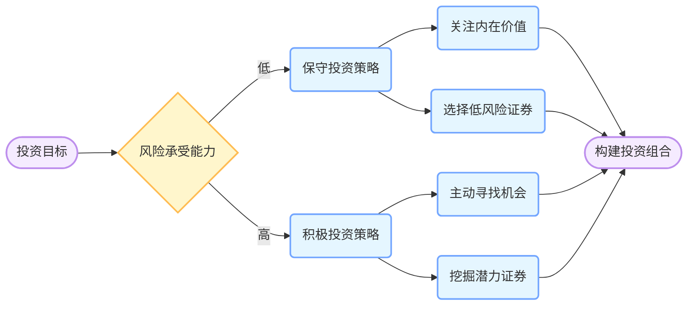

# 格雷厄姆的保守投资策略vs积极投资策略

> 关键词：格雷厄姆、保守投资策略、积极投资策略、投资分析、风险收益

> 摘要：本文深入探讨了格雷厄姆所提出的保守投资策略和积极投资策略。详细介绍了两种策略的背景、核心概念、算法原理、数学模型，通过项目实战案例进行了分析，阐述了它们在不同实际应用场景中的表现。同时推荐了相关的学习资源、开发工具和论文著作，最后总结了两种策略的未来发展趋势与挑战，并解答了常见问题，为投资者提供了全面且深入的投资策略参考。

## 1. 背景介绍 
### 1.1 目的和范围
本文章旨在全面、深入地对比格雷厄姆的保守投资策略和积极投资策略。通过剖析两种策略的原理、特点、适用场景以及风险收益特征，帮助投资者更好地理解并根据自身情况选择合适的投资策略。范围涵盖了从基本概念的介绍到实际应用案例的分析，以及对未来发展趋势的探讨。

### 1.2 预期读者
预期读者包括对投资领域感兴趣的初学者，希望通过了解不同投资策略来构建自己投资理念的投资者，以及从事金融研究、投资分析等相关专业的人士。

### 1.3 文档结构概述
本文首先介绍背景信息，包括目的、预期读者和文档结构。接着阐述保守投资策略和积极投资策略的核心概念及其联系，给出相应的原理和架构示意图。然后详细讲解核心算法原理，并结合 Python 代码说明具体操作步骤。随后介绍相关的数学模型和公式，并举例说明。通过项目实战展示两种策略在实际中的应用，包括开发环境搭建、源代码实现和代码解读。之后探讨两种策略的实际应用场景。推荐相关的学习资源、开发工具和论文著作。最后总结未来发展趋势与挑战，解答常见问题，并提供扩展阅读和参考资料。

### 1.4 术语表
#### 1.4.1 核心术语定义
- **保守投资策略**：由格雷厄姆提出，强调投资的安全性和稳定性，注重选择价值被低估、财务状况良好、股息稳定的证券，以降低投资风险。
- **积极投资策略**：同样源于格雷厄姆的理论，更倾向于主动寻找市场中的投资机会，通过深入分析和研究，承担一定风险以追求更高的投资回报。
- **安全边际**：指证券的内在价值与市场价格之间的差值，是保守投资策略中的重要概念，用于衡量投资的安全性。
- **内在价值**：根据公司的财务状况、盈利能力、资产等因素估算出的证券的真实价值。

#### 1.4.2 相关概念解释
- **股息**：公司向股东分配的利润，是投资者获得收益的一种方式，保守投资策略通常偏好股息稳定的公司。
- **市场波动**：证券市场价格随时间的上下变动，积极投资策略需要应对市场波动以寻找投资机会。
- **估值方法**：用于估算证券内在价值的方法，如市盈率法、市净率法等。

#### 1.4.3 缩略词列表
- **PE**：市盈率（Price-to-Earnings Ratio），是股票价格除以每股收益的比率，用于衡量股票的估值水平。
- **PB**：市净率（Price-to-Book Ratio），是股票价格与每股净资产的比率，也是常用的估值指标。

## 2. 核心概念与联系 

### 保守投资策略核心概念
保守投资策略的核心在于追求投资的安全性和稳定性。格雷厄姆认为，投资者应该关注证券的内在价值，选择那些价格低于内在价值的证券进行投资，以获得安全边际。这种策略通常偏好大型、成熟、财务状况良好的公司，这些公司具有稳定的股息支付和较低的财务风险。

### 积极投资策略核心概念
积极投资策略则更注重主动出击，寻找市场中的投资机会。投资者需要通过深入的研究和分析，挖掘那些具有潜在增长潜力但尚未被市场充分认识的证券。这种策略可能会涉及到更多的风险，但也有可能带来更高的回报。

### 两者联系
保守投资策略和积极投资策略并非完全对立，而是在一定程度上相互补充。积极投资策略可以在市场中寻找具有潜力的投资标的，而保守投资策略则可以为投资组合提供稳定性和安全性。投资者可以根据自己的风险承受能力和投资目标，将两种策略结合使用。

### 原理和架构示意图


## 3. 核心算法原理 & 具体操作步骤 

### 保守投资策略核心算法原理
保守投资策略的核心是估算证券的内在价值，并与市场价格进行比较。常用的估值方法之一是股息贴现模型（Dividend Discount Model, DDM）。该模型认为，股票的内在价值等于其未来股息的现值之和。

#### 股息贴现模型公式
假设股票每年的股息增长率为 $g$，投资者要求的回报率为 $r$，第 1 年的股息为 $D_1$，则股票的内在价值 $V$ 可以表示为：
$$V = \frac{D_1}{r - g}$$

#### Python 代码实现
```python
def ddm_valuation(D1, r, g):
    """
    股息贴现模型计算股票内在价值
    :param D1: 第1年的股息
    :param r: 投资者要求的回报率
    :param g: 股息增长率
    :return: 股票内在价值
    """
    if r <= g:
        raise ValueError("投资者要求的回报率必须大于股息增长率")
    return D1 / (r - g)

# 示例
D1 = 2  # 第1年的股息为2元
r = 0.1  # 投资者要求的回报率为10%
g = 0.05  # 股息增长率为5%
intrinsic_value = ddm_valuation(D1, r, g)
print(f"股票的内在价值为: {intrinsic_value} 元")
```

### 积极投资策略核心算法原理
积极投资策略通常需要对公司的财务报表进行深入分析，以评估其盈利能力和增长潜力。常用的指标包括市盈率（PE）、市净率（PB）等。

#### 市盈率法
市盈率是股票价格与每股收益的比率，反映了市场对公司盈利的预期。较低的市盈率可能意味着股票被低估，具有投资价值。

#### Python 代码实现
```python
def pe_valuation(price, earnings_per_share):
    """
    计算市盈率
    :param price: 股票价格
    :param earnings_per_share: 每股收益
    :return: 市盈率
    """
    return price / earnings_per_share

# 示例
price = 50  # 股票价格为50元
earnings_per_share = 5  # 每股收益为5元
pe_ratio = pe_valuation(price, earnings_per_share)
print(f"股票的市盈率为: {pe_ratio}")
```

### 具体操作步骤
#### 保守投资策略操作步骤
1. **筛选公司**：选择大型、成熟、财务状况良好的公司。
2. **估算内在价值**：使用股息贴现模型等方法估算股票的内在价值。
3. **比较价格**：将内在价值与市场价格进行比较，选择价格低于内在价值的股票。
4. **构建投资组合**：将筛选出的股票组合成投资组合，以分散风险。

#### 积极投资策略操作步骤
1. **研究市场**：关注市场动态，寻找具有潜在增长潜力的行业和公司。
2. **分析财务报表**：对目标公司的财务报表进行深入分析，评估其盈利能力和增长潜力。
3. **计算估值指标**：使用市盈率、市净率等指标评估股票的估值水平。
4. **做出投资决策**：根据分析结果，选择具有投资价值的股票进行投资。

## 4. 数学模型和公式 & 详细讲解 & 举例说明 

### 股息贴现模型（DDM）
#### 详细讲解
股息贴现模型基于这样一个假设：股票的价值取决于其未来股息的现值。该模型适用于那些股息稳定增长的公司。在公式 $V = \frac{D_1}{r - g}$ 中，$D_1$ 表示第 1 年的股息，$r$ 表示投资者要求的回报率，$g$ 表示股息增长率。

#### 举例说明
假设一家公司预计明年的股息为 2 元，股息增长率为 5%，投资者要求的回报率为 10%。则该公司股票的内在价值为：
$$V = \frac{2}{0.1 - 0.05} = 40$$（元）
如果该股票的市场价格低于 40 元，则根据股息贴现模型，该股票被低估，具有投资价值。

### 市盈率（PE）模型
#### 详细讲解
市盈率是衡量股票估值水平的常用指标。它反映了投资者为了获得公司每股收益而愿意支付的价格。较低的市盈率可能意味着股票被低估，但也可能反映了市场对公司未来盈利能力的担忧。

#### 举例说明
假设一家公司的股票价格为 50 元，每股收益为 5 元，则该公司的市盈率为：
$$PE = \frac{50}{5} = 10$$
如果该行业的平均市盈率为 15，则该公司的股票可能被低估。

### 市净率（PB）模型
#### 详细讲解
市净率是股票价格与每股净资产的比率，反映了市场对公司净资产的估值。较低的市净率可能意味着股票被低估，但也需要考虑公司的资产质量和盈利能力。

#### 公式
$$PB = \frac{P}{B}$$
其中，$P$ 表示股票价格，$B$ 表示每股净资产。

#### 举例说明
假设一家公司的股票价格为 30 元，每股净资产为 10 元，则该公司的市净率为：
$$PB = \frac{30}{10} = 3$$
如果该行业的平均市净率为 4，则该公司的股票可能被低估。

## 5. 项目实战：代码实际案例和详细解释说明 

### 5.1  开发环境搭建
#### 编程语言
本项目使用 Python 进行开发，Python 具有丰富的数据分析和金融计算库，适合用于投资策略的实现。

#### 库安装
需要安装以下库：
- `pandas`：用于数据处理和分析。
- `numpy`：用于数值计算。
- `yfinance`：用于获取股票数据。

可以使用以下命令进行安装：
```sh
pip install pandas numpy yfinance
```

### 5.2  源代码详细实现和代码解读

#### 保守投资策略代码实现
```python
import yfinance as yf
import pandas as pd

def conservative_investment_strategy(tickers, D1, r, g):
    """
    保守投资策略实现
    :param tickers: 股票代码列表
    :param D1: 第1年的股息
    :param r: 投资者要求的回报率
    :param g: 股息增长率
    :return: 具有投资价值的股票列表
    """
    valuable_stocks = []
    for ticker in tickers:
        try:
            stock = yf.Ticker(ticker)
            current_price = stock.history(period="1d")['Close'].iloc[0]
            intrinsic_value = ddm_valuation(D1, r, g)
            if current_price < intrinsic_value:
                valuable_stocks.append(ticker)
        except Exception as e:
            print(f"处理 {ticker} 时出现错误: {e}")
    return valuable_stocks

# 示例
tickers = ['AAPL', 'MSFT', 'GOOG']
D1 = 2
r = 0.1
g = 0.05
valuable_stocks = conservative_investment_strategy(tickers, D1, r, g)
print("具有投资价值的股票列表:", valuable_stocks)
```

#### 代码解读
1. **导入库**：导入 `yfinance` 用于获取股票数据，`pandas` 用于数据处理。
2. **定义函数**：`conservative_investment_strategy` 函数接受股票代码列表、第 1 年的股息、投资者要求的回报率和股息增长率作为参数。
3. **遍历股票**：对于每个股票，获取其当前价格，并使用股息贴现模型计算其内在价值。
4. **比较价格**：如果当前价格低于内在价值，则将该股票添加到具有投资价值的股票列表中。
5. **返回结果**：返回具有投资价值的股票列表。

#### 积极投资策略代码实现
```python
import yfinance as yf
import pandas as pd

def active_investment_strategy(tickers):
    """
    积极投资策略实现
    :param tickers: 股票代码列表
    :return: 具有投资价值的股票列表
    """
    valuable_stocks = []
    for ticker in tickers:
        try:
            stock = yf.Ticker(ticker)
            financials = stock.financials
            earnings_per_share = financials.loc['Net Income'].iloc[0] / stock.info['sharesOutstanding']
            price = stock.history(period="1d")['Close'].iloc[0]
            pe_ratio = pe_valuation(price, earnings_per_share)
            industry_pe = 15  # 假设行业平均市盈率为15
            if pe_ratio < industry_pe:
                valuable_stocks.append(ticker)
        except Exception as e:
            print(f"处理 {ticker} 时出现错误: {e}")
    return valuable_stocks

# 示例
tickers = ['AAPL', 'MSFT', 'GOOG']
valuable_stocks = active_investment_strategy(tickers)
print("具有投资价值的股票列表:", valuable_stocks)
```

#### 代码解读
1. **导入库**：导入 `yfinance` 用于获取股票数据，`pandas` 用于数据处理。
2. **定义函数**：`active_investment_strategy` 函数接受股票代码列表作为参数。
3. **遍历股票**：对于每个股票，获取其财务报表和当前价格，计算每股收益和市盈率。
4. **比较市盈率**：将该股票的市盈率与行业平均市盈率进行比较，如果低于行业平均市盈率，则将该股票添加到具有投资价值的股票列表中。
5. **返回结果**：返回具有投资价值的股票列表。

### 5.3  代码解读与分析
#### 保守投资策略代码分析
- **优点**：代码简单易懂，通过股息贴现模型筛选出价格低于内在价值的股票，符合保守投资策略的核心思想。
- **缺点**：股息贴现模型的假设较为理想化，实际中股息增长率和投资者要求的回报率难以准确估计。

#### 积极投资策略代码分析
- **优点**：通过市盈率指标筛选出被低估的股票，考虑了市场对公司盈利的预期，具有一定的合理性。
- **缺点**：行业平均市盈率的确定具有主观性，不同的统计方法和样本可能会导致不同的结果。

## 6. 实际应用场景 
### 保守投资策略应用场景
- **风险承受能力低的投资者**：对于那些风险承受能力较低、追求资产稳定增值的投资者，如退休人员、保守型投资者等，保守投资策略是一个不错的选择。他们更注重投资的安全性，愿意接受较低的回报以换取资产的稳定。
- **市场不稳定时期**：在市场波动较大、不确定性较高的时期，如经济衰退、金融危机等，保守投资策略可以帮助投资者降低风险，保护资产。

### 积极投资策略应用场景
- **风险承受能力高的投资者**：对于那些风险承受能力较高、追求高回报的投资者，如年轻的投资者、激进型投资者等，积极投资策略可能更适合他们。他们愿意承担一定的风险，通过主动寻找投资机会来获取更高的收益。
- **市场上升期**：在市场处于上升趋势、经济形势较好的时期，积极投资策略可以帮助投资者抓住市场机会，获得更高的回报。

## 7. 工具和资源推荐
### 7.1 学习资源推荐
#### 7.1.1 书籍推荐
- 《聪明的投资者》（The Intelligent Investor）：格雷厄姆的经典著作，详细阐述了保守投资策略和积极投资策略的原理和方法。
- 《证券分析》（Security Analysis）：同样是格雷厄姆的重要著作，对证券的分析和估值方法进行了深入探讨。
- 《财务报表分析与证券定价》（Financial Statement Analysis and Security Valuation）：帮助读者了解如何通过财务报表分析评估公司的价值。

#### 7.1.2 在线课程
- Coursera 上的“投资学原理”课程：系统介绍了投资学的基本原理和方法。
- edX 上的“金融市场”课程：涵盖了金融市场的各个方面，包括投资策略。

#### 7.1.3 技术博客和网站
- 雪球网：提供了丰富的股票分析和投资策略讨论。
- 东方财富网：提供了全面的金融数据和市场资讯。

### 7.2 开发工具框架推荐
#### 7.2.1 IDE和编辑器
- PyCharm：功能强大的 Python 集成开发环境，适合用于开发投资策略相关的代码。
- Jupyter Notebook：交互式的开发环境，方便进行数据分析和代码演示。

#### 7.2.2 调试和性能分析工具
- pdb：Python 自带的调试工具，用于调试代码。
- cProfile：用于分析 Python 代码的性能，找出性能瓶颈。

#### 7.2.3 相关框架和库
- `pandas`：用于数据处理和分析。
- `numpy`：用于数值计算。
- `yfinance`：用于获取股票数据。

### 7.3 相关论文著作推荐
#### 7.3.1 经典论文
- Benjamin Graham and David Dodd, "Security Analysis" (1934)：奠定了价值投资的理论基础。
- Eugene F. Fama and Kenneth R. French, "The Cross-Section of Expected Stock Returns" (1992)：提出了著名的 Fama-French 三因子模型。

#### 7.3.2 最新研究成果
- 关注顶级金融学术期刊，如《Journal of Finance》、《Review of Financial Studies》等，了解投资策略领域的最新研究进展。

#### 7.3.3 应用案例分析
- 研究一些成功的投资案例，如巴菲特的投资策略，分析其在实际应用中的方法和技巧。

## 8. 总结：未来发展趋势与挑战
### 未来发展趋势
- **量化投资的融合**：随着科技的发展，量化投资将与格雷厄姆的投资策略进一步融合。通过大数据分析、机器学习等技术，可以更准确地筛选投资标的，优化投资组合。
- **全球市场的拓展**：投资者将更加关注全球市场，寻找不同地区的投资机会。保守投资策略和积极投资策略将在全球范围内得到更广泛的应用。
- **社会责任投资的兴起**：越来越多的投资者开始关注企业的社会责任，将环境、社会和治理（ESG）因素纳入投资决策中。两种投资策略也需要适应这一趋势。

### 挑战
- **市场环境的变化**：市场环境日益复杂，不确定性增加，如宏观经济政策的变化、地缘政治风险等，给投资策略的实施带来了挑战。
- **数据质量和可靠性**：量化投资依赖于大量的数据，数据的质量和可靠性直接影响投资决策的准确性。如何获取准确、及时的数据是一个重要的挑战。
- **投资者情绪的影响**：投资者情绪往往会导致市场的非理性波动，增加了投资策略的实施难度。如何在市场情绪波动的情况下保持理性的投资决策是投资者需要面对的问题。

## 9. 附录：常见问题与解答
### 保守投资策略一定能保证投资安全吗？
保守投资策略虽然注重投资的安全性，但并不能完全保证投资安全。市场环境是复杂多变的，即使是财务状况良好的公司也可能面临各种风险，如行业竞争加剧、宏观经济环境变化等。因此，投资者在采用保守投资策略时，仍然需要进行充分的研究和风险评估。

### 积极投资策略的风险如何控制？
积极投资策略需要承担一定的风险，可以通过以下方式进行风险控制：
- **分散投资**：将资金分散投资于不同的行业、不同的公司，降低单一投资的风险。
- **设定止损点**：在投资前设定止损点，当投资损失达到一定程度时，及时卖出股票，避免损失进一步扩大。
- **深入研究**：对投资标的进行深入的研究和分析，了解其基本面和市场情况，降低投资的盲目性。

### 如何确定投资者要求的回报率和股息增长率？
投资者要求的回报率和股息增长率是股息贴现模型中的重要参数，确定这些参数需要考虑多个因素：
- **投资者要求的回报率**：可以参考市场无风险利率、风险溢价等因素。市场无风险利率通常可以用国债收益率来表示，风险溢价则需要根据投资者的风险承受能力和投资标的的风险程度来确定。
- **股息增长率**：可以通过分析公司的历史股息数据、财务报表和行业发展趋势来估计。同时，还需要考虑公司的盈利能力、发展战略等因素。

## 10. 扩展阅读 & 参考资料
### 扩展阅读
- 《巴菲特之道》（The Warren Buffett Way）：介绍了巴菲特的投资理念和方法，与格雷厄姆的投资策略有一定的关联。
- 《漫步华尔街》（A Random Walk Down Wall Street）：对投资理论和市场有效性进行了深入探讨。

### 参考资料
- Graham, Benjamin. The Intelligent Investor. HarperBusiness, 2003.
- Graham, Benjamin, and David L. Dodd. Security Analysis. McGraw-Hill, 1934.
- Fama, Eugene F., and Kenneth R. French. "The Cross-Section of Expected Stock Returns." The Journal of Finance, vol. 47, no. 2, 1992, pp. 427-465.

作者：AI天才研究院/AI Genius Institute & 禅与计算机程序设计艺术 /Zen And The Art of Computer Programming