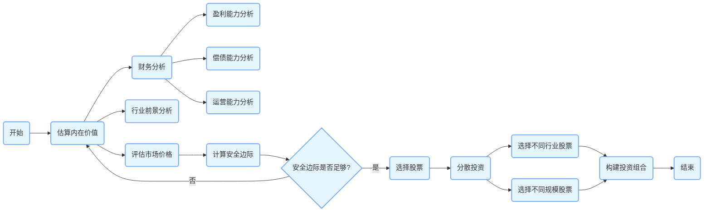

# 格雷厄姆的保守投资者策略

> 关键词：格雷厄姆、保守投资者策略、价值投资、安全边际、财务分析

> 摘要：本文深入探讨了格雷厄姆的保守投资者策略。本杰明·格雷厄姆作为价值投资的鼻祖，其保守投资者策略对金融市场产生了深远影响。文章首先介绍了该策略提出的背景，包括目的、预期读者等信息；接着阐述了核心概念与联系，如安全边际、内在价值等；详细讲解了核心算法原理及具体操作步骤，并结合数学模型和公式进行说明；通过项目实战给出代码实际案例和解读；分析了该策略的实际应用场景；推荐了相关的学习资源、开发工具框架以及论文著作；最后总结了该策略的未来发展趋势与挑战，同时提供了常见问题的解答和扩展阅读的参考资料，旨在帮助投资者全面理解和运用格雷厄姆的保守投资者策略。

## 1. 背景介绍 
### 1.1 目的和范围
格雷厄姆的保守投资者策略旨在为投资者提供一种稳健、低风险的投资方法，帮助投资者在复杂多变的金融市场中实现资产的保值和增值。该策略主要适用于股票投资领域，但其中的一些原则也可以应用于其他金融资产的投资。其范围涵盖了对上市公司的财务分析、估值方法、投资组合的构建等多个方面，通过系统的方法筛选出具有投资价值的股票，避免投资者陷入高风险的投机行为。

### 1.2 预期读者
本文的预期读者主要包括以下几类人群：
- 初级投资者：对股票投资有兴趣但缺乏经验的新手，希望通过学习格雷厄姆的保守投资者策略，建立正确的投资理念和方法。
- 业余投资者：有一定投资经验，但希望进一步优化自己的投资策略，降低投资风险的业余投资者。
- 专业投资者：对价值投资理论有深入研究，希望从格雷厄姆的经典策略中获取新的灵感和思路的专业投资人士。
- 金融从业者：包括证券分析师、基金经理等，通过了解该策略，为客户提供更专业的投资建议。

### 1.3 文档结构概述
本文将按照以下结构进行阐述：
- 核心概念与联系：介绍格雷厄姆保守投资者策略中的核心概念，如安全边际、内在价值等，并说明它们之间的联系。
- 核心算法原理 & 具体操作步骤：讲解该策略的核心算法原理，并用Python代码详细阐述具体的操作步骤。
- 数学模型和公式 & 详细讲解 & 举例说明：给出相关的数学模型和公式，并进行详细讲解和举例说明。
- 项目实战：代码实际案例和详细解释说明：通过实际的代码案例，展示如何运用该策略进行股票投资分析。
- 实际应用场景：分析该策略在不同市场环境下的实际应用场景。
- 工具和资源推荐：推荐相关的学习资源、开发工具框架以及论文著作。
- 总结：未来发展趋势与挑战：总结该策略的未来发展趋势和可能面临的挑战。
- 附录：常见问题与解答：解答读者在学习和应用该策略过程中可能遇到的常见问题。
- 扩展阅读 & 参考资料：提供相关的扩展阅读资料和参考书目。

### 1.4 术语表
#### 1.4.1 核心术语定义
- **安全边际**：是指股票的内在价值与市场价格之间的差距。安全边际越大，意味着投资风险越低，潜在收益越高。
- **内在价值**：是指股票所代表的公司的真实价值，通常通过对公司的财务状况、盈利能力、行业前景等因素进行综合分析来估算。
- **保守投资者**：是指那些注重资产安全，追求稳健回报，避免高风险投资的投资者。
- **价值投资**：是一种投资理念，强调通过分析公司的基本面，寻找被市场低估的股票进行投资，以获取长期的投资回报。

#### 1.4.2 相关概念解释
- **市盈率（P/E）**：是指股票价格与每股收益的比率，反映了市场对公司盈利能力的预期。市盈率越低，通常意味着股票越具有投资价值。
- **市净率（P/B）**：是指股票价格与每股净资产的比率，反映了市场对公司净资产的估值。市净率越低，通常意味着股票越具有投资价值。
- **股息率**：是指股息与股票价格的比率，反映了公司向股东分配利润的能力。股息率越高，通常意味着股票越具有投资价值。

#### 1.4.3 缩略词列表
- **P/E**：Price-to-Earnings Ratio，市盈率
- **P/B**：Price-to-Book Ratio，市净率
- **EPS**：Earnings Per Share，每股收益
- **ROE**：Return on Equity，净资产收益率

## 2. 核心概念与联系 
### 核心概念原理
格雷厄姆的保守投资者策略基于以下几个核心概念：
- **安全边际**：安全边际是该策略的核心思想之一。格雷厄姆认为，投资者应该在股票的内在价值和市场价格之间留出足够的安全边际，以应对市场的不确定性和风险。只有当股票的市场价格低于其内在价值一定比例时，才值得投资。例如，如果一只股票的内在价值为100元，而市场价格为80元，那么安全边际就是20%。
- **内在价值**：内在价值是指股票所代表的公司的真实价值。格雷厄姆认为，内在价值可以通过对公司的财务状况、盈利能力、行业前景等因素进行综合分析来估算。常用的估算方法包括股息折现模型、盈利资本化模型等。
- **分散投资**：分散投资是降低投资风险的重要手段。格雷厄姆建议投资者将资金分散投资于多只股票，以避免因个别股票的波动而导致整个投资组合的大幅损失。一般来说，投资者可以选择不同行业、不同规模的股票进行投资。

### 架构的文本示意图
```plaintext
格雷厄姆的保守投资者策略
|-- 安全边际
|   |-- 内在价值估算
|   |   |-- 财务分析
|   |   |   |-- 盈利能力分析
|   |   |   |-- 偿债能力分析
|   |   |   |-- 运营能力分析
|   |   |-- 行业前景分析
|   |-- 市场价格评估
|-- 分散投资
|   |-- 股票选择
|   |   |-- 不同行业
|   |   |-- 不同规模
|   |-- 投资组合构建
```

### Mermaid 流程图


## 3. 核心算法原理 & 具体操作步骤 
### 核心算法原理
格雷厄姆的保守投资者策略的核心算法原理主要包括以下几个方面：
- **内在价值估算**：通过对公司的财务报表进行分析，估算公司的内在价值。常用的方法包括股息折现模型、盈利资本化模型等。例如，股息折现模型的公式为：$V = \frac{D_1}{r - g}$，其中$V$表示股票的内在价值，$D_1$表示下一年的股息，$r$表示必要收益率，$g$表示股息增长率。
- **安全边际计算**：安全边际是指股票的内在价值与市场价格之间的差距。安全边际的计算公式为：$安全边际 = \frac{内在价值 - 市场价格}{内在价值} \times 100\%$。只有当安全边际大于一定比例时，才值得投资。
- **分散投资组合构建**：根据股票的内在价值、安全边际等因素，选择多只股票构建投资组合。投资组合的构建原则是分散风险，选择不同行业、不同规模的股票进行投资。

### 具体操作步骤
以下是运用格雷厄姆的保守投资者策略进行股票投资分析的具体操作步骤：
1. **数据收集**：收集上市公司的财务报表、行业数据等信息。可以通过证券交易所网站、财经媒体等渠道获取相关数据。
2. **财务分析**：对上市公司的财务报表进行分析，评估公司的盈利能力、偿债能力、运营能力等。常用的财务指标包括市盈率、市净率、股息率、净资产收益率等。
3. **内在价值估算**：根据财务分析的结果，选择合适的方法估算公司的内在价值。例如，可以使用股息折现模型、盈利资本化模型等方法。
4. **安全边际计算**：计算股票的安全边际，判断是否值得投资。一般来说，安全边际大于20%时，才值得投资。
5. **股票选择**：根据安全边际的计算结果，选择安全边际较大的股票进行投资。同时，要考虑股票的行业分布、规模等因素，进行分散投资。
6. **投资组合构建**：将选择的股票按照一定的比例构建投资组合。投资组合的比例可以根据投资者的风险偏好、投资目标等因素进行调整。

### Python源代码详细阐述
以下是一个使用Python实现格雷厄姆保守投资者策略的示例代码：
```python
import pandas as pd

# 定义股票类
class Stock:
    def __init__(self, symbol, price, eps, book_value, dividend):
        self.symbol = symbol
        self.price = price
        self.eps = eps
        self.book_value = book_value
        self.dividend = dividend

    # 计算市盈率
    def calculate_pe_ratio(self):
        return self.price / self.eps

    # 计算市净率
    def calculate_pb_ratio(self):
        return self.price / self.book_value

    # 计算股息率
    def calculate_dividend_yield(self):
        return self.dividend / self.price

    # 估算内在价值（简单示例，使用盈利资本化模型）
    def estimate_intrinsic_value(self, growth_rate, required_return):
        return self.eps * (1 + growth_rate) / (required_return - growth_rate)

    # 计算安全边际
    def calculate_margin_of_safety(self, intrinsic_value):
        return (intrinsic_value - self.price) / intrinsic_value

# 示例股票数据
stocks = [
    Stock('AAPL', 150, 5, 20, 2),
    Stock('GOOG', 2000, 100, 500, 10),
    Stock('MSFT', 300, 10, 50, 3)
]

# 设定必要收益率和股息增长率
required_return = 0.1
growth_rate = 0.05

# 筛选符合条件的股票
selected_stocks = []
for stock in stocks:
    pe_ratio = stock.calculate_pe_ratio()
    pb_ratio = stock.calculate_pb_ratio()
    dividend_yield = stock.calculate_dividend_yield()
    intrinsic_value = stock.estimate_intrinsic_value(growth_rate, required_return)
    margin_of_safety = stock.calculate_margin_of_safety(intrinsic_value)

    # 筛选条件：市盈率小于20，市净率小于2，股息率大于2%，安全边际大于20%
    if pe_ratio < 20 and pb_ratio < 2 and dividend_yield > 0.02 and margin_of_safety > 0.2:
        selected_stocks.append(stock)

# 输出筛选结果
if len(selected_stocks) > 0:
    print("符合条件的股票：")
    for stock in selected_stocks:
        print(f"股票代码：{stock.symbol}，价格：{stock.price}，市盈率：{stock.calculate_pe_ratio()}，市净率：{stock.calculate_pb_ratio()}，股息率：{stock.calculate_dividend_yield()}，安全边际：{stock.calculate_margin_of_safety(stock.estimate_intrinsic_value(growth_rate, required_return))}")
else:
    print("没有符合条件的股票。")
```
### 代码解释
1. **定义股票类**：定义了一个`Stock`类，用于表示股票的基本信息，包括股票代码、价格、每股收益、每股净资产和股息。
2. **计算财务指标**：在`Stock`类中定义了计算市盈率、市净率、股息率的方法。
3. **估算内在价值**：使用盈利资本化模型估算股票的内在价值。
4. **计算安全边际**：根据内在价值和市场价格计算股票的安全边际。
5. **筛选股票**：设定筛选条件，如市盈率小于20，市净率小于2，股息率大于2%，安全边际大于20%，筛选出符合条件的股票。
6. **输出结果**：输出筛选结果，包括股票代码、价格、市盈率、市净率、股息率和安全边际。

## 4. 数学模型和公式 & 详细讲解 & 举例说明 
### 股息折现模型
股息折现模型（Dividend Discount Model，DDM）是一种常用的估算股票内在价值的方法。该模型的基本思想是，股票的内在价值等于其未来股息的现值之和。

#### 公式
- **零增长模型**：当股息增长率为零时，股息折现模型的公式为：$V = \frac{D}{r}$，其中$V$表示股票的内在价值，$D$表示每年的股息，$r$表示必要收益率。
- **固定增长模型**：当股息以固定增长率$g$增长时，股息折现模型的公式为：$V = \frac{D_1}{r - g}$，其中$V$表示股票的内在价值，$D_1$表示下一年的股息，$r$表示必要收益率，$g$表示股息增长率。

#### 详细讲解
- **零增长模型**：适用于股息稳定不变的公司。例如，一家公司每年的股息为2元，必要收益率为10%，则该公司股票的内在价值为：$V = \frac{2}{0.1} = 20$（元）。
- **固定增长模型**：适用于股息以固定增长率增长的公司。例如，一家公司下一年的股息为2元，股息增长率为5%，必要收益率为10%，则该公司股票的内在价值为：$V = \frac{2}{0.1 - 0.05} = 40$（元）。

### 盈利资本化模型
盈利资本化模型（Earnings Capitalization Model）是另一种常用的估算股票内在价值的方法。该模型的基本思想是，股票的内在价值等于其未来盈利的现值之和。

#### 公式
$V = \frac{EPS}{r}$，其中$V$表示股票的内在价值，$EPS$表示每股收益，$r$表示必要收益率。

#### 详细讲解
例如，一家公司的每股收益为5元，必要收益率为10%，则该公司股票的内在价值为：$V = \frac{5}{0.1} = 50$（元）。

### 安全边际公式
安全边际是指股票的内在价值与市场价格之间的差距。安全边际的计算公式为：$安全边际 = \frac{内在价值 - 市场价格}{内在价值} \times 100\%$。

#### 详细讲解
例如，一只股票的内在价值为100元，市场价格为80元，则该股票的安全边际为：$安全边际 = \frac{100 - 80}{100} \times 100\% = 20\%$。

### 举例说明
假设我们要分析一只股票的投资价值，已知该股票的每股收益为3元，股息增长率为3%，必要收益率为8%，市场价格为40元。

1. **使用股息折现模型估算内在价值**：
假设下一年的股息为每股1元，则根据固定增长模型，该股票的内在价值为：$V = \frac{1}{0.08 - 0.03} = 20$（元）。
2. **计算安全边际**：
安全边际为：$安全边际 = \frac{20 - 40}{20} \times 100\% = -100\%$。
由于安全边际为负数，说明该股票的市场价格高于其内在价值，不具有投资价值。

## 5. 项目实战：代码实际案例和详细解释说明 
### 5.1  开发环境搭建
#### 安装Python
首先，需要安装Python编程语言。可以从Python官方网站（https://www.python.org/downloads/）下载适合自己操作系统的Python版本，并按照安装向导进行安装。

#### 安装必要的库
在本项目中，需要使用`pandas`库进行数据处理。可以使用以下命令安装`pandas`库：
```sh
pip install pandas
```

### 5.2  源代码详细实现和代码解读
以下是一个更完整的使用Python实现格雷厄姆保守投资者策略的代码示例：
```python
import pandas as pd

# 定义股票类
class Stock:
    def __init__(self, symbol, price, eps, book_value, dividend):
        self.symbol = symbol
        self.price = price
        self.eps = eps
        self.book_value = book_value
        self.dividend = dividend

    # 计算市盈率
    def calculate_pe_ratio(self):
        return self.price / self.eps

    # 计算市净率
    def calculate_pb_ratio(self):
        return self.price / self.book_value

    # 计算股息率
    def calculate_dividend_yield(self):
        return self.dividend / self.price

    # 估算内在价值（简单示例，使用盈利资本化模型）
    def estimate_intrinsic_value(self, required_return):
        return self.eps / required_return

    # 计算安全边际
    def calculate_margin_of_safety(self, intrinsic_value):
        return (intrinsic_value - self.price) / intrinsic_value

# 示例股票数据
stocks_data = {
    'symbol': ['AAPL', 'GOOG', 'MSFT'],
    'price': [150, 2000, 300],
    'eps': [5, 100, 10],
    'book_value': [20, 500, 50],
    'dividend': [2, 10, 3]
}
stocks_df = pd.DataFrame(stocks_data)

# 设定必要收益率
required_return = 0.1

# 筛选符合条件的股票
selected_stocks = []
for index, row in stocks_df.iterrows():
    stock = Stock(row['symbol'], row['price'], row['eps'], row['book_value'], row['dividend'])
    pe_ratio = stock.calculate_pe_ratio()
    pb_ratio = stock.calculate_pb_ratio()
    dividend_yield = stock.calculate_dividend_yield()
    intrinsic_value = stock.estimate_intrinsic_value(required_return)
    margin_of_safety = stock.calculate_margin_of_safety(intrinsic_value)

    # 筛选条件：市盈率小于20，市净率小于2，股息率大于2%，安全边际大于20%
    if pe_ratio < 20 and pb_ratio < 2 and dividend_yield > 0.02 and margin_of_safety > 0.2:
        selected_stocks.append(stock)

# 输出筛选结果
if len(selected_stocks) > 0:
    print("符合条件的股票：")
    for stock in selected_stocks:
        print(f"股票代码：{stock.symbol}，价格：{stock.price}，市盈率：{stock.calculate_pe_ratio()}，市净率：{stock.calculate_pb_ratio()}，股息率：{stock.calculate_dividend_yield()}，安全边际：{stock.calculate_margin_of_safety(stock.estimate_intrinsic_value(required_return))}")
else:
    print("没有符合条件的股票。")
```
### 代码解读
1. **定义股票类**：定义了一个`Stock`类，用于表示股票的基本信息和计算相关的财务指标。
2. **数据准备**：使用`pandas`库创建一个包含股票信息的DataFrame对象。
3. **设定必要收益率**：设定必要收益率为10%。
4. **筛选股票**：遍历DataFrame中的每一行，创建`Stock`对象，计算相关的财务指标和安全边际，根据筛选条件筛选出符合条件的股票。
5. **输出结果**：输出筛选结果，包括股票代码、价格、市盈率、市净率、股息率和安全边际。

### 5.3  代码解读与分析
- **优点**：
    - 代码结构清晰，将股票的基本信息和计算方法封装在`Stock`类中，提高了代码的可维护性和可扩展性。
    - 使用`pandas`库进行数据处理，方便对大量股票数据进行分析。
    - 筛选条件明确，根据市盈率、市净率、股息率和安全边际等指标筛选股票，符合格雷厄姆的保守投资者策略。
- **缺点**：
    - 内在价值的估算方法较为简单，只使用了盈利资本化模型，没有考虑股息增长率等因素。
    - 代码中使用的示例数据是硬编码的，实际应用中需要从数据源（如证券交易所网站、财经媒体等）获取真实的股票数据。

## 6. 实际应用场景 
### 熊市行情
在熊市行情中，市场整体下跌，投资者情绪悲观。格雷厄姆的保守投资者策略可以帮助投资者在这种市场环境中寻找被低估的股票。通过计算股票的内在价值和安全边际，投资者可以筛选出那些具有较高安全边际的股票进行投资，从而降低投资风险。例如，在2008年全球金融危机期间，许多股票的价格大幅下跌，一些遵循格雷厄姆保守投资者策略的投资者通过深入分析公司的基本面，选择了一些被低估的优质股票，在市场复苏后获得了丰厚的回报。

### 震荡行情
在震荡行情中，市场波动较大，缺乏明显的趋势。格雷厄姆的保守投资者策略可以帮助投资者在这种市场环境中保持冷静，避免盲目跟风。通过关注股票的内在价值和安全边际，投资者可以在股票价格下跌到具有吸引力的水平时买入，在股票价格上涨到高估水平时卖出，从而实现低买高卖的投资目标。例如，在一些行业周期波动较大的市场中，如钢铁、煤炭等行业，投资者可以运用该策略在行业低谷时买入相关股票，在行业高峰时卖出。

### 长期投资
格雷厄姆的保守投资者策略非常适合长期投资。该策略强调对公司基本面的深入分析，寻找具有长期投资价值的股票。通过分散投资，投资者可以降低个别股票的风险，实现资产的稳健增值。例如，一些投资者长期持有遵循格雷厄姆保守投资者策略筛选出的优质股票，如可口可乐、强生等，在几十年的时间里获得了巨大的投资回报。

### 养老投资
对于养老投资来说，安全性是首要考虑的因素。格雷厄姆的保守投资者策略可以帮助投资者构建一个安全稳健的投资组合。通过选择具有较高安全边际、稳定股息收益的股票，投资者可以在保证资产安全的前提下，获得一定的投资回报，为养老生活提供保障。例如，一些投资者将一部分养老资金投资于公用事业、消费等防御性行业的股票，这些股票通常具有稳定的现金流和股息分配，符合保守投资者的需求。

## 7. 工具和资源推荐
### 7.1 学习资源推荐
#### 7.1.1 书籍推荐
- 《聪明的投资者》（The Intelligent Investor）：本杰明·格雷厄姆的经典著作，被誉为投资界的“圣经”。书中详细阐述了格雷厄姆的保守投资者策略和价值投资理念，是投资者必读的书籍之一。
- 《证券分析》（Security Analysis）：同样是本杰明·格雷厄姆的著作，是价值投资领域的奠基之作。该书对证券分析的基本原理、方法和技巧进行了系统的阐述，为投资者提供了深入分析公司基本面的方法。
- 《怎样选择成长股》（Common Stocks and Uncommon Profits）：菲利普·费雪的经典著作，提出了成长股投资的理念和方法。该书与格雷厄姆的价值投资理念相互补充，为投资者提供了更全面的投资思路。

#### 7.1.2 在线课程
- Coursera上的“投资学原理”（Principles of Investing）：由宾夕法尼亚大学沃顿商学院的教授授课，课程内容涵盖了投资学的基本原理、股票投资、债券投资等方面的知识，适合初学者学习。
- edX上的“价值投资基础”（Foundations of Value Investing）：由哥伦比亚大学商学院的教授授课，课程重点讲解了价值投资的理念和方法，包括如何分析公司的财务报表、估算内在价值等内容。
- 网易云课堂上的“股票投资实战教程”：由国内资深投资专家授课，课程结合实际案例，讲解了股票投资的基本技巧和策略，适合有一定投资经验的投资者学习。

#### 7.1.3 技术博客和网站
- Seeking Alpha（https://seekingalpha.com/）：一个知名的财经博客和投资研究平台，提供了大量的股票分析、投资策略、市场评论等内容。许多专业投资者和分析师会在该平台上分享自己的观点和研究成果。
- 雪球（https://xueqiu.com/）：国内知名的投资社交平台，聚集了大量的投资者和投资专家。用户可以在该平台上交流投资经验、分享投资心得、查看股票行情等。
- 东方财富网（https://www.eastmoney.com/）：国内领先的财经网站，提供了丰富的财经资讯、股票行情、财务报表等信息。投资者可以通过该网站获取最新的市场动态和公司信息。

### 7.2 开发工具框架推荐
#### 7.2.1 IDE和编辑器
- PyCharm：一款专业的Python集成开发环境（IDE），提供了丰富的代码编辑、调试、测试等功能，适合Python开发者使用。
- Jupyter Notebook：一个基于Web的交互式计算环境，支持多种编程语言，包括Python。Jupyter Notebook可以将代码、文本、图表等内容整合在一起，方便进行数据分析和可视化。
- Visual Studio Code：一款轻量级的代码编辑器，支持多种编程语言和插件扩展。Visual Studio Code具有丰富的代码编辑功能和强大的调试功能，适合初学者和专业开发者使用。

#### 7.2.2 调试和性能分析工具
- PDB：Python自带的调试工具，可以帮助开发者在代码中设置断点、单步执行代码、查看变量值等，方便进行代码调试。
- cProfile：Python标准库中的性能分析工具，可以帮助开发者分析代码的运行时间和性能瓶颈，优化代码性能。
- Py-Spy：一个用于分析Python程序性能的工具，可以实时监控Python程序的CPU使用率、函数调用情况等，帮助开发者快速定位性能问题。

#### 7.2.3 相关框架和库
- Pandas：一个强大的数据处理和分析库，提供了高效的数据结构和数据操作方法，适合处理和分析股票数据。
- Numpy：一个用于科学计算的Python库，提供了高效的数组和矩阵运算功能，可用于股票数据的数值计算。
- Matplotlib：一个用于数据可视化的Python库，提供了丰富的绘图功能，可用于绘制股票价格走势图、财务指标分析图等。

### 7.3 相关论文著作推荐
#### 7.3.1 经典论文
- “The Superinvestors of Graham-and-Doddsville”：沃伦·巴菲特撰写的经典论文，介绍了一群遵循格雷厄姆价值投资理念的投资者的成功案例，证明了格雷厄姆保守投资者策略的有效性。
- “Security Analysis: Principles and Technique”：本杰明·格雷厄姆和戴维·多德撰写的经典论文，是《证券分析》一书的理论基础，对证券分析的基本原理和方法进行了深入探讨。

#### 7.3.2 最新研究成果
- 近年来，学术界对价值投资理论进行了不断的研究和发展。一些研究成果探讨了如何在新的市场环境下应用格雷厄姆的保守投资者策略，以及如何结合其他投资理论和方法提高投资绩效。例如，一些研究提出了基于机器学习算法的价值投资策略，通过对大量历史数据的分析和学习，筛选出具有投资价值的股票。

#### 7.3.3 应用案例分析
- 许多金融机构和投资公司会发布关于价值投资策略的应用案例分析报告。这些报告通过实际案例，展示了如何运用格雷厄姆的保守投资者策略进行股票投资，以及在不同市场环境下的投资效果。投资者可以通过阅读这些报告，学习实际应用中的经验和技巧。

## 8. 总结：未来发展趋势与挑战
### 未来发展趋势
#### 与科技融合
随着科技的不断发展，格雷厄姆的保守投资者策略将与大数据、人工智能等技术深度融合。通过运用大数据技术，投资者可以获取更全面、更准确的公司信息和市场数据，提高内在价值估算的准确性。人工智能算法可以帮助投资者快速筛选出符合条件的股票，优化投资组合。例如，一些量化投资机构已经开始运用机器学习算法来构建价值投资模型，提高投资决策的效率和准确性。

#### 多元化投资
未来，格雷厄姆的保守投资者策略将不仅仅局限于股票投资，还将向其他金融资产领域拓展。投资者可以将该策略应用于债券、基金、房地产等领域，实现多元化投资，降低投资风险。例如，在债券投资中，投资者可以通过分析债券的信用评级、票面利率、到期收益率等因素，估算债券的内在价值，选择具有安全边际的债券进行投资。

#### 全球投资
随着全球经济一体化的发展，投资者的投资视野将更加全球化。格雷厄姆的保守投资者策略可以帮助投资者在全球范围内寻找被低估的投资机会。投资者可以关注不同国家和地区的经济发展状况、行业前景、政策环境等因素，选择具有投资价值的股票进行投资。例如，一些投资者会关注新兴市场国家的股票市场，寻找那些具有高增长潜力、被市场低估的股票。

### 挑战
#### 市场有效性增强
随着金融市场的不断发展和完善，市场的有效性逐渐增强。这意味着股票价格更能反映公司的内在价值，寻找被低估股票的难度加大。投资者需要更加深入地分析公司的基本面，运用更复杂的估值方法，才能找到具有安全边际的投资机会。

#### 宏观经济环境变化
宏观经济环境的变化对股票市场的影响较大。经济增长放缓、通货膨胀、利率波动等因素都会影响公司的盈利能力和股票的估值。投资者需要密切关注宏观经济环境的变化，及时调整投资策略，以应对市场风险。

#### 新兴行业估值困难
随着科技的不断进步，新兴行业如人工智能、生物技术、新能源等不断涌现。这些行业的公司通常具有高增长潜力，但也面临着较大的不确定性和风险。传统的估值方法可能无法准确估算这些公司的内在价值，投资者需要探索新的估值方法和投资策略。

## 9. 附录：常见问题与解答
### 问题1：如何准确估算股票的内在价值？
解答：估算股票的内在价值是一个复杂的过程，需要综合考虑多个因素。常用的方法包括股息折现模型、盈利资本化模型等。在实际应用中，需要对公司的财务报表进行深入分析，了解公司的盈利能力、偿债能力、运营能力等。同时，还需要考虑行业前景、宏观经济环境等因素。此外，可以参考同行业其他公司的估值水平，进行比较和分析。

### 问题2：安全边际的比例应该设置为多少合适？
解答：安全边际的比例没有一个固定的标准，通常建议设置为20%以上。安全边际的比例越高，投资风险越低，但同时也可能错过一些投资机会。投资者可以根据自己的风险偏好、投资目标和市场环境等因素，灵活调整安全边际的比例。

### 问题3：如何选择合适的股票进行分散投资？
解答：选择合适的股票进行分散投资需要考虑多个因素。首先，要选择不同行业的股票，以降低行业风险。例如，可以选择金融、消费、科技、医疗等不同行业的股票。其次，要选择不同规模的股票，包括大盘股、中盘股和小盘股。大盘股通常具有稳定性和流动性好的特点，小盘股则可能具有较高的增长潜力。此外，还可以考虑股票的估值水平、股息率等因素。

### 问题4：格雷厄姆的保守投资者策略适用于短期投资吗？
解答：格雷厄姆的保守投资者策略更适合长期投资。该策略强调对公司基本面的深入分析，寻找具有长期投资价值的股票。短期市场波动较大，股票价格可能受到多种因素的影响，难以准确反映公司的内在价值。而长期来看，股票价格会逐渐回归其内在价值。因此，运用该策略进行投资需要有耐心，长期持有股票，才能获得稳定的投资回报。

## 10. 扩展阅读 & 参考资料
### 扩展阅读
- 《巴菲特致股东的信：股份公司教程》（The Essays of Warren Buffett: Lessons for Corporate America）：沃伦·巴菲特撰写的书信集，其中包含了许多关于价值投资的观点和经验，对理解格雷厄姆的保守投资者策略有很大的帮助。
- 《金融炼金术》（The Alchemy of Finance）：乔治·索罗斯的著作，提出了反身性理论，对金融市场的运行机制进行了深入探讨。虽然索罗斯的投资策略与格雷厄姆有所不同，但阅读该书可以拓宽投资者的视野，加深对金融市场的理解。
- 《黑天鹅：如何应对不可预知的未来》（The Black Swan: The Impact of the Highly Improbable）：纳西姆·尼古拉斯·塔勒布的著作，探讨了极端事件对金融市场的影响。投资者在运用格雷厄姆的保守投资者策略时，需要考虑到黑天鹅事件的可能性，做好风险防范。

### 参考资料
- 《聪明的投资者》（The Intelligent Investor），本杰明·格雷厄姆著
- 《证券分析》（Security Analysis），本杰明·格雷厄姆、戴维·多德著
- 《怎样选择成长股》（Common Stocks and Uncommon Profits），菲利普·费雪著
- 各大证券交易所网站，如上海证券交易所（https://www.sse.com.cn/）、深圳证券交易所（https://www.szse.cn/）、纽约证券交易所（https://www.nyse.com/）等
- 财经媒体网站，如新浪财经（https://finance.sina.com.cn/）、腾讯财经（https://finance.qq.com/）、华尔街日报（https://www.wsj.com/）等

作者：AI天才研究院/AI Genius Institute & 禅与计算机程序设计艺术 /Zen And The Art of Computer Programming