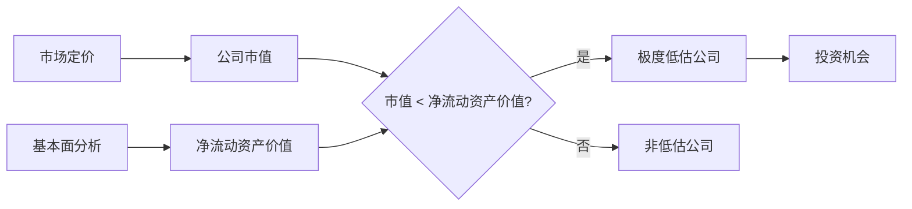

# 格雷厄姆的净净股票策略：寻找极度低估的公司

> 关键词：格雷厄姆、净净股票策略、极度低估公司、价值投资、财务分析

> 摘要：本文深入探讨了格雷厄姆的净净股票策略，旨在帮助投资者寻找市场中极度低估的公司。从背景介绍入手，阐述该策略的目的、适用读者、文档结构和相关术语。详细讲解核心概念、算法原理及操作步骤，结合数学模型和公式进行分析，并通过实际案例展示策略的应用。同时介绍了该策略的实际应用场景、推荐相关工具和资源，最后总结其未来发展趋势与挑战，还提供了常见问题解答和扩展阅读参考资料。

## 1. 背景介绍 
### 1.1 目的和范围
本文章的主要目的是全面且深入地介绍格雷厄姆的净净股票策略。通过详细剖析这一策略的原理、操作步骤、数学模型以及实际应用案例，让读者能够清晰地理解如何运用该策略在股票市场中寻找极度低估的公司。范围涵盖了从理论知识到实际操作的各个方面，包括策略的核心概念、算法实现、实际应用场景，以及与之相关的工具和资源推荐等内容。

### 1.2 预期读者
本文预期读者包括对价值投资感兴趣的个人投资者、金融专业学生、股票市场研究人员以及从事资产管理的专业人士。无论是初学者希望了解基本的价值投资策略，还是有一定经验的投资者寻求更深入的投资方法，都能从本文中获得有价值的信息。

### 1.3 文档结构概述
本文将按照以下结构进行阐述：首先介绍背景信息，包括目的、预期读者、文档结构概述和术语表；接着讲解核心概念与联系，通过文本示意图和 Mermaid 流程图展示；然后详细阐述核心算法原理和具体操作步骤，并用 Python 源代码进行说明；之后介绍数学模型和公式，并举例说明；再通过项目实战展示代码实际案例和详细解释；接着探讨实际应用场景；推荐相关的工具和资源；最后总结未来发展趋势与挑战，提供常见问题解答和扩展阅读参考资料。

### 1.4 术语表
#### 1.4.1 核心术语定义
- **净净股票策略**：由本杰明·格雷厄姆提出的一种价值投资策略，该策略通过计算公司的净流动资产价值（Net Current Asset Value，NCAV），并与公司的市值进行比较，寻找市值低于净流动资产价值的公司，认为这类公司被市场极度低估，具有投资价值。
- **净流动资产价值（NCAV）**：公司的流动资产减去全部负债后的价值。计算公式为：$NCAV = 流动资产 - 全部负债$。
- **市值**：指一家上市公司的发行股份按市场价格计算出来的股票总价值，其计算方法为每股股票的市场价格乘以发行总股数。

#### 1.4.2 相关概念解释
- **价值投资**：一种投资理念，强调通过对公司基本面的分析，寻找被市场低估的股票，以低于其内在价值的价格买入，并长期持有，等待市场对其价值进行重新评估，从而获得投资收益。
- **流动资产**：企业在一年内或者超过一年的一个营业周期内能够变现或者运用的资产，包括现金、应收账款、存货等。
- **负债**：企业过去的交易或者事项形成的、预期会导致经济利益流出企业的现时义务，包括短期负债和长期负债。

#### 1.4.3 缩略词列表
- **NCAV**：Net Current Asset Value，净流动资产价值

## 2. 核心概念与联系 
### 核心概念原理
格雷厄姆的净净股票策略基于价值投资的基本理念，认为市场有时会出现定价错误，导致某些公司的市值低于其实际的净流动资产价值。当一家公司的市值低于其净流动资产价值时，意味着投资者可以以低于公司清算价值的价格购买该公司的股票。即使公司立即停止运营并进行清算，股东也有可能获得超过其购买股票成本的回报。

### 架构的文本示意图
```plaintext
市场定价 -----> 公司市值
           |
           v
基本面分析 -----> 净流动资产价值
           |
           v
比较：市值 < 净流动资产价值 -----> 极度低估公司 -----> 投资机会
```

### Mermaid 流程图


## 3. 核心算法原理 & 具体操作步骤 
### 核心算法原理
净净股票策略的核心算法是计算公司的净流动资产价值（NCAV），并将其与公司的市值进行比较。如果市值低于 NCAV，则认为该公司被极度低估，可能是一个潜在的投资机会。

### 具体操作步骤
1. **获取公司财务数据**：从公司的财务报表中获取流动资产和全部负债的数据。
2. **计算净流动资产价值（NCAV）**：使用公式 $NCAV = 流动资产 - 全部负债$ 计算 NCAV。
3. **获取公司市值**：通过股票市场获取公司的每股价格和发行总股数，计算市值（市值 = 每股价格 × 发行总股数）。
4. **比较市值和 NCAV**：如果市值低于 NCAV，则标记该公司为潜在的投资对象。

### Python 源代码实现
```python
import pandas as pd

def calculate_ncav(current_assets, total_liabilities):
    """
    计算净流动资产价值（NCAV）
    :param current_assets: 流动资产
    :param total_liabilities: 全部负债
    :return: NCAV
    """
    return current_assets - total_liabilities

def is_undervalued(market_cap, ncav):
    """
    判断公司是否被低估
    :param market_cap: 市值
    :param ncav: 净流动资产价值
    :return: True 或 False
    """
    return market_cap < ncav

# 示例数据
data = {
    '公司名称': ['公司A', '公司B', '公司C'],
    '流动资产': [1000000, 2000000, 1500000],
    '全部负债': [500000, 1200000, 800000],
    '每股价格': [10, 20, 15],
    '发行总股数': [50000, 80000, 60000]
}

df = pd.DataFrame(data)

# 计算 NCAV
df['NCAV'] = df.apply(lambda row: calculate_ncav(row['流动资产'], row['全部负债']), axis=1)

# 计算市值
df['市值'] = df['每股价格'] * df['发行总股数']

# 判断是否被低估
df['是否低估'] = df.apply(lambda row: is_undervalued(row['市值'], row['NCAV']), axis=1)

print(df)
```

## 4. 数学模型和公式 & 详细讲解 & 举例说明 
### 数学模型和公式
净净股票策略的核心数学模型是计算净流动资产价值（NCAV）和比较市值与 NCAV。具体公式如下：
- **净流动资产价值（NCAV）计算公式**：
$$NCAV = 流动资产 - 全部负债$$
- **市值计算公式**：
$$市值 = 每股价格 \times 发行总股数$$
- **判断公司是否被低估的条件**：
$$市值 < NCAV$$

### 详细讲解
- **净流动资产价值（NCAV）**：NCAV 反映了公司在清算情况下，股东可能获得的剩余价值。流动资产是公司短期内能够变现的资产，而负债是公司需要偿还的债务。通过减去全部负债，得到的 NCAV 表示公司在偿还所有债务后，流动资产剩余的价值。
- **市值**：市值是市场对公司的估值，它反映了投资者对公司未来盈利能力和发展前景的预期。当市值低于 NCAV 时，意味着市场对公司的估值过低，可能存在投资机会。

### 举例说明
假设公司 X 的财务数据如下：
- 流动资产：$2000$ 万元
- 全部负债：$1000$ 万元
- 每股价格：$5$ 元
- 发行总股数：$150$ 万股

首先，计算 NCAV：
$$NCAV = 2000 - 1000 = 1000（万元）$$

然后，计算市值：
$$市值 = 5 \times 150 = 750（万元）$$

由于市值（$750$ 万元）低于 NCAV（$1000$ 万元），根据净净股票策略，公司 X 被认为是一个潜在的极度低估公司，可能具有投资价值。

## 5. 项目实战：代码实际案例和详细解释说明 
### 5.1  开发环境搭建
为了实现净净股票策略的代码，我们需要搭建一个 Python 开发环境。以下是具体步骤：
1. **安装 Python**：从 Python 官方网站（https://www.python.org/downloads/）下载并安装 Python 3.x 版本。
2. **安装必要的库**：我们需要使用 `pandas` 库来处理数据。可以使用以下命令安装：
```sh
pip install pandas
```

### 5.2  源代码详细实现和代码解读
```python
import pandas as pd

def calculate_ncav(current_assets, total_liabilities):
    """
    计算净流动资产价值（NCAV）
    :param current_assets: 流动资产
    :param total_liabilities: 全部负债
    :return: NCAV
    """
    return current_assets - total_liabilities

def is_undervalued(market_cap, ncav):
    """
    判断公司是否被低估
    :param market_cap: 市值
    :param ncav: 净流动资产价值
    :return: True 或 False
    """
    return market_cap < ncav

# 示例数据
data = {
    '公司名称': ['公司A', '公司B', '公司C'],
    '流动资产': [1000000, 2000000, 1500000],
    '全部负债': [500000, 1200000, 800000],
    '每股价格': [10, 20, 15],
    '发行总股数': [50000, 80000, 60000]
}

df = pd.DataFrame(data)

# 计算 NCAV
df['NCAV'] = df.apply(lambda row: calculate_ncav(row['流动资产'], row['全部负债']), axis=1)

# 计算市值
df['市值'] = df['每股价格'] * df['发行总股数']

# 判断是否被低估
df['是否低估'] = df.apply(lambda row: is_undervalued(row['市值'], row['NCAV']), axis=1)

print(df)
```

### 代码解读与分析
1. **导入必要的库**：
```python
import pandas as pd
```
导入 `pandas` 库，用于数据处理和分析。

2. **定义计算 NCAV 的函数**：
```python
def calculate_ncav(current_assets, total_liabilities):
    return current_assets - total_liabilities
```
该函数接受流动资产和全部负债作为参数，返回 NCAV。

3. **定义判断公司是否被低估的函数**：
```python
def is_undervalued(market_cap, ncav):
    return market_cap < ncav
```
该函数接受市值和 NCAV 作为参数，返回一个布尔值，表示公司是否被低估。

4. **创建示例数据**：
```python
data = {
    '公司名称': ['公司A', '公司B', '公司C'],
    '流动资产': [1000000, 2000000, 1500000],
    '全部负债': [500000, 1200000, 800000],
    '每股价格': [10, 20, 15],
    '发行总股数': [50000, 80000, 60000]
}

df = pd.DataFrame(data)
```
创建一个包含公司财务数据的字典，并使用 `pandas` 的 `DataFrame` 类将其转换为数据框。

5. **计算 NCAV、市值和判断是否被低估**：
```python
df['NCAV'] = df.apply(lambda row: calculate_ncav(row['流动资产'], row['全部负债']), axis=1)
df['市值'] = df['每股价格'] * df['发行总股数']
df['是否低估'] = df.apply(lambda row: is_undervalued(row['市值'], row['NCAV']), axis=1)
```
使用 `apply` 方法对数据框的每一行应用相应的函数，计算 NCAV、市值和判断公司是否被低估，并将结果添加到数据框中。

6. **打印结果**：
```python
print(df)
```
打印包含计算结果的数据框。

## 6. 实际应用场景 
### 个人投资者
对于个人投资者来说，净净股票策略可以作为一种寻找低风险投资机会的方法。通过筛选出市值低于净流动资产价值的公司，投资者可以以较低的价格买入股票，即使公司经营不善，也有可能在清算时获得一定的回报。同时，该策略也符合价值投资的理念，注重公司的基本面分析，有助于投资者避免盲目跟风和投机行为。

### 专业投资机构
专业投资机构可以利用净净股票策略进行资产配置和投资组合管理。通过批量筛选符合条件的公司，构建投资组合，可以分散风险，提高投资收益。此外，该策略还可以作为一种辅助工具，与其他投资策略相结合，提高投资决策的准确性。

### 研究机构和学者
研究机构和学者可以使用净净股票策略进行学术研究和市场分析。通过对历史数据的回测和分析，可以验证该策略的有效性和适用性，探讨其在不同市场环境下的表现和影响因素。同时，研究结果也可以为投资者和市场监管机构提供参考。

## 7. 工具和资源推荐
### 7.1 学习资源推荐
#### 7.1.1 书籍推荐
- 《聪明的投资者》（The Intelligent Investor）：本杰明·格雷厄姆的经典著作，详细阐述了价值投资的理念和方法，包括净净股票策略。
- 《证券分析》（Security Analysis）：同样是格雷厄姆的著作，是价值投资领域的权威书籍，对公司基本面分析和估值方法进行了深入探讨。
- 《价值投资实战手册》：唐朝所著，结合中国股市实际情况，介绍了价值投资的基本原理和实战技巧。

#### 7.1.2 在线课程
- Coursera 上的“投资学原理”课程：由知名教授授课，涵盖了投资学的基本理论和方法，包括价值投资和股票分析。
- 网易云课堂上的“价值投资入门与实战”课程：适合初学者，系统介绍了价值投资的理念、方法和实战技巧。

#### 7.1.3 技术博客和网站
- 雪球网：国内知名的投资交流平台，有大量的投资者分享投资经验和研究成果，包括对净净股票策略的讨论。
- 价值投资博客：一些专业的价值投资博客，会定期发布关于价值投资策略和公司分析的文章。

### 7.2 开发工具框架推荐
#### 7.2.1 IDE和编辑器
- PyCharm：一款专业的 Python 集成开发环境，具有代码编辑、调试、版本控制等功能，适合开发 Python 程序。
- Jupyter Notebook：一种交互式的开发环境，支持代码、文本、图表等多种形式的展示，适合数据处理和分析。

#### 7.2.2 调试和性能分析工具
- PDB：Python 自带的调试工具，可以帮助开发者定位和解决代码中的问题。
- cProfile：Python 的性能分析工具，可以分析代码的运行时间和内存使用情况，帮助开发者优化代码性能。

#### 7.2.3 相关框架和库
- Pandas：用于数据处理和分析的 Python 库，提供了高效的数据结构和数据操作方法。
- NumPy：用于科学计算的 Python 库，提供了多维数组和数学函数，有助于进行数值计算。

### 7.3 相关论文著作推荐
#### 7.3.1 经典论文
- 《The Margin of Safety: Risk-Averse Value Investing Strategies for the Thoughtful Investor》：详细阐述了价值投资中的安全边际概念，与净净股票策略密切相关。
- 《Value Investing: The Use of Historical Financial Statement Information to Separate Winners from Losers》：研究了如何利用历史财务报表信息筛选出有投资价值的股票，为净净股票策略提供了理论支持。

#### 7.3.2 最新研究成果
- 一些学术期刊上发表的关于价值投资和净净股票策略的最新研究论文，如《Journal of Financial Economics》《The Review of Financial Studies》等。

#### 7.3.3 应用案例分析
- 一些专业的投资研究报告和案例分析，会详细介绍净净股票策略在实际投资中的应用和效果。

## 8. 总结：未来发展趋势与挑战
### 未来发展趋势
- **与量化投资结合**：随着金融科技的发展，净净股票策略可能会与量化投资技术相结合，通过大数据分析和机器学习算法，更高效地筛选出符合条件的公司，提高投资决策的准确性和效率。
- **全球化应用**：该策略可能会在全球范围内得到更广泛的应用，投资者可以利用该策略在不同国家和地区的股票市场中寻找投资机会，实现资产的全球化配置。
- **与其他投资策略融合**：净净股票策略可能会与其他投资策略，如成长投资、股息投资等相结合，形成更加多元化的投资组合，以适应不同市场环境和投资者需求。

### 挑战
- **数据质量和可靠性**：净净股票策略依赖于公司的财务数据，数据的质量和可靠性直接影响到策略的有效性。在实际应用中，可能会遇到财务数据造假、数据更新不及时等问题，需要投资者具备较强的数据甄别能力。
- **市场环境变化**：市场环境是不断变化的，当市场处于牛市时，符合净净股票策略的公司可能会减少；而在熊市时，虽然可能会出现更多的低估公司，但市场整体风险也会增加。因此，投资者需要根据市场环境的变化灵活调整投资策略。
- **行业差异**：不同行业的公司具有不同的财务特征和经营模式，净净股票策略在不同行业的适用性可能会有所不同。例如，一些重资产行业的公司，其流动资产占比相对较低，可能不太适合使用该策略。投资者需要对不同行业进行深入研究，了解其特点和规律，才能更好地应用该策略。

## 9. 附录：常见问题与解答
### 问题 1：净净股票策略一定能获得投资收益吗？
答：净净股票策略并不能保证一定能获得投资收益。虽然该策略基于价值投资的理念，寻找被市场低估的公司，但市场是复杂多变的，公司的经营状况也可能会发生变化。即使公司的市值低于净流动资产价值，也可能存在一些潜在的风险，如行业竞争加剧、管理层决策失误等，导致公司的价值进一步下降。因此，投资者在使用该策略时，需要进行充分的研究和分析，结合其他因素进行综合判断。

### 问题 2：如何获取准确的公司财务数据？
答：可以通过以下途径获取准确的公司财务数据：
- 公司官方网站：大多数上市公司会在其官方网站上公布定期的财务报告，包括年度报告、半年度报告和季度报告等。
- 证券交易所网站：证券交易所会对上市公司的信息披露进行监管，投资者可以在证券交易所的网站上查询公司的财务数据和公告。
- 金融数据提供商：如 Wind、东方财富 Choice 等，这些数据提供商收集和整理了大量的金融数据，提供了方便快捷的数据查询和分析服务。

### 问题 3：净净股票策略适合短期投资还是长期投资？
答：净净股票策略更适合长期投资。该策略的核心是寻找被市场低估的公司，等待市场对其价值进行重新评估。市场对公司价值的发现和修正通常需要一定的时间，因此投资者需要有足够的耐心持有股票。此外，长期投资还可以避免短期市场波动对投资收益的影响，更好地实现价值投资的目标。

## 10. 扩展阅读 & 参考资料
### 扩展阅读
- 《巴菲特致股东的信：投资者和公司高管教程》：巴菲特的信件中包含了许多关于价值投资的思想和实践经验，对理解净净股票策略有一定的帮助。
- 《金融炼金术》：乔治·索罗斯的著作，探讨了金融市场的运行规律和投资哲学，为投资者提供了不同的视角。

### 参考资料
- 本杰明·格雷厄姆. 《聪明的投资者》. 人民邮电出版社.
- 本杰明·格雷厄姆, 戴维·多德. 《证券分析》. 海南出版社.
- 唐朝. 《价值投资实战手册》. 机械工业出版社.

作者：AI天才研究院/AI Genius Institute & 禅与计算机程序设计艺术 /Zen And The Art of Computer Programming