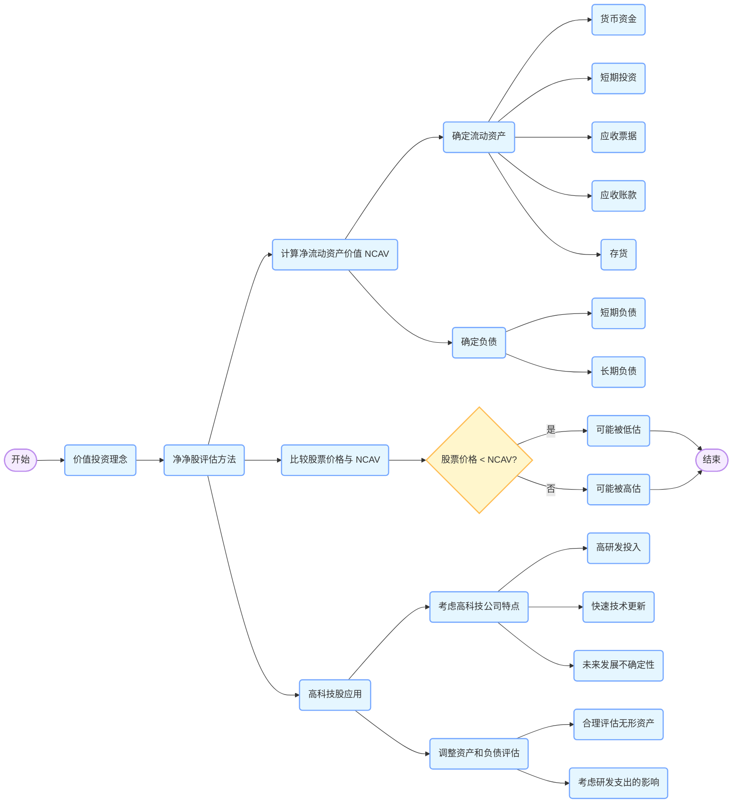

# 格雷厄姆的净净股策略：在高科技股中寻找价值

> 关键词：格雷厄姆、净净股策略、高科技股、价值投资、财务分析、股票估值、投资策略

> 摘要：本文聚焦于格雷厄姆的净净股策略，并探讨如何将其应用于高科技股领域以寻找价值。首先介绍净净股策略的背景和基本概念，深入剖析其核心原理与架构。接着详细阐述该策略涉及的核心算法，通过 Python 代码进行实现和解释。同时，给出相关的数学模型和公式，并举例说明其应用。在项目实战部分，通过具体的代码案例展示如何运用净净股策略分析高科技股，包括开发环境搭建、源代码实现及代码解读。此外，还探讨了该策略在实际中的应用场景，推荐了相关的学习资源、开发工具和论文著作。最后，总结净净股策略在高科技股领域的未来发展趋势与挑战，并对常见问题进行解答，为投资者在高科技股中运用净净股策略寻找价值提供全面的参考。

## 1. 背景介绍 
### 1.1 目的和范围
本文章的目的在于深入探讨格雷厄姆的净净股策略，并将其应用于高科技股投资领域。通过对净净股策略的详细解析和在高科技股中的实践应用，帮助投资者更好地理解和运用该策略，在充满变化和不确定性的高科技股市场中寻找具有投资价值的股票。范围涵盖净净股策略的理论基础、算法实现、数学模型、实际案例分析以及相关资源推荐等多个方面，旨在为投资者提供一个全面且深入的投资参考框架。

### 1.2 预期读者
本文预期读者主要包括对价值投资感兴趣的投资者、金融分析师、股票研究人员以及相关领域的学生和学者。对于那些希望在高科技股投资中运用价值投资理念，寻找被低估股票的投资者，本文将提供实用的方法和策略；对于金融分析师和股票研究人员，本文的深入分析和案例研究将有助于他们拓展研究思路和方法；对于学生和学者，本文将为他们提供一个理论与实践相结合的学习案例，加深对价值投资和高科技股投资的理解。

### 1.3 文档结构概述
本文将按照以下结构进行阐述：首先介绍净净股策略的背景信息，包括目的、预期读者和文档结构概述等；接着深入探讨净净股策略的核心概念与联系，通过文本示意图和 Mermaid 流程图进行清晰展示；然后详细讲解核心算法原理和具体操作步骤，并用 Python 代码进行实现；随后给出相关的数学模型和公式，并进行详细讲解和举例说明；在项目实战部分，通过具体的代码案例展示如何运用净净股策略分析高科技股，包括开发环境搭建、源代码实现及代码解读；之后探讨该策略在实际中的应用场景；推荐相关的学习资源、开发工具和论文著作；最后总结净净股策略在高科技股领域的未来发展趋势与挑战，对常见问题进行解答，并提供扩展阅读和参考资料。

### 1.4 术语表
#### 1.4.1 核心术语定义
- **格雷厄姆**：本杰明·格雷厄姆（Benjamin Graham）是价值投资理论的奠基人，被誉为“华尔街教父”。他的投资理念和方法对现代投资界产生了深远的影响，其代表作《证券分析》和《聪明的投资者》是价值投资领域的经典著作。
- **净净股策略**：是格雷厄姆提出的一种股票估值和投资策略。该策略认为，当股票价格低于公司的净流动资产价值（Net Current Asset Value，NCAV）时，股票可能被低估，具有投资价值。净流动资产价值是指公司的流动资产减去全部负债后的价值。
- **高科技股**：指那些从事高科技领域研发、生产和销售的公司股票。高科技领域通常包括信息技术、生物技术、新能源、新材料等新兴产业，这些公司具有高成长性、高创新性和高风险性等特点。
- **价值投资**：一种投资理念，强调通过对公司基本面的分析，寻找被市场低估的股票，以低于其内在价值的价格买入，并长期持有，等待股票价格回归其内在价值，从而获得投资收益。

#### 1.4.2 相关概念解释
- **流动资产**：指企业可以在一年或者超过一年的一个营业周期内变现或者运用的资产，包括货币资金、短期投资、应收票据、应收账款和存货等。
- **负债**：指企业过去的交易或者事项形成的、预期会导致经济利益流出企业的现时义务，包括短期负债和长期负债。
- **内在价值**：指公司未来预期现金流的现值，是股票的真实价值。内在价值的评估通常需要考虑公司的财务状况、经营业绩、行业前景等多个因素。

#### 1.4.3 缩略词列表
- **NCAV**：Net Current Asset Value，净流动资产价值

## 2. 核心概念与联系 

### 核心概念原理
格雷厄姆的净净股策略基于价值投资的基本理念，认为市场有时会对股票价格做出错误的定价，导致一些股票的价格低于其内在价值。净净股策略通过计算公司的净流动资产价值（NCAV）来评估股票的内在价值。具体来说，净流动资产价值是指公司的流动资产减去全部负债后的价值。如果股票价格低于公司的 NCAV，那么该股票可能被低估，具有投资价值。

在高科技股领域运用净净股策略，需要考虑高科技公司的特点。高科技公司通常具有较高的研发投入、快速的技术更新和不确定性较高的未来发展前景。因此，在评估高科技公司的净流动资产价值时，需要对其资产和负债进行合理的调整和分析，以更准确地反映公司的真实价值。

### 架构的文本示意图
```plaintext
净净股策略架构
|-- 价值投资理念
|   |-- 寻找被低估的股票
|   |-- 基于公司基本面分析
|-- 净净股评估方法
|   |-- 计算净流动资产价值（NCAV）
|   |   |-- 确定流动资产
|   |   |   |-- 货币资金
|   |   |   |-- 短期投资
|   |   |   |-- 应收票据
|   |   |   |-- 应收账款
|   |   |   |-- 存货
|   |   |-- 确定负债
|   |   |   |-- 短期负债
|   |   |   |-- 长期负债
|   |-- 比较股票价格与 NCAV
|       |-- 股票价格 < NCAV：可能被低估
|       |-- 股票价格 > NCAV：可能被高估
|-- 高科技股应用
|   |-- 考虑高科技公司特点
|   |   |-- 高研发投入
|   |   |-- 快速技术更新
|   |   |-- 未来发展不确定性
|   |-- 调整资产和负债评估
|   |   |-- 合理评估无形资产
|   |   |-- 考虑研发支出的影响
```

### Mermaid 流程图


## 3. 核心算法原理 & 具体操作步骤 

### 核心算法原理
净净股策略的核心算法是计算公司的净流动资产价值（NCAV），并将其与股票价格进行比较。具体步骤如下：
1. **确定流动资产**：收集公司的财务报表，确定其流动资产的构成，包括货币资金、短期投资、应收票据、应收账款和存货等。
2. **确定负债**：同样从财务报表中确定公司的负债，包括短期负债和长期负债。
3. **计算 NCAV**：NCAV = 流动资产 - 全部负债。
4. **比较股票价格与 NCAV**：如果股票价格低于 NCAV，则认为该股票可能被低估；如果股票价格高于 NCAV，则认为该股票可能被高估。

### 具体操作步骤
1. **数据收集**：收集公司的财务报表，包括资产负债表和利润表。可以从公司的官方网站、证券交易所网站或金融数据提供商处获取这些数据。
2. **数据整理**：将收集到的财务数据进行整理，提取出所需的流动资产和负债信息。
3. **计算 NCAV**：根据上述公式计算公司的 NCAV。
4. **获取股票价格**：从证券交易所或金融数据提供商处获取公司的股票价格。
5. **比较分析**：将股票价格与 NCAV 进行比较，判断股票是否被低估或高估。

### Python 源代码实现
```python
# 定义计算 NCAV 的函数
def calculate_ncav(current_assets, total_liabilities):
    """
    计算净流动资产价值（NCAV）
    :param current_assets: 流动资产
    :param total_liabilities: 全部负债
    :return: NCAV
    """
    return current_assets - total_liabilities

# 定义判断股票是否被低估的函数
def is_undervalued(stock_price, ncav):
    """
    判断股票是否被低估
    :param stock_price: 股票价格
    :param ncav: 净流动资产价值
    :return: True 表示被低估，False 表示未被低估
    """
    return stock_price < ncav

# 示例数据
current_assets = 1000000  # 流动资产
total_liabilities = 500000  # 全部负债
stock_price = 400000  # 股票价格

# 计算 NCAV
ncav = calculate_ncav(current_assets, total_liabilities)

# 判断股票是否被低估
undervalued = is_undervalued(stock_price, ncav)

# 输出结果
print(f"净流动资产价值（NCAV）: {ncav}")
if undervalued:
    print("该股票可能被低估。")
else:
    print("该股票可能未被低估。")
```

### 代码解释
1. **calculate_ncav 函数**：该函数接受流动资产和全部负债作为输入，返回净流动资产价值（NCAV）。
2. **is_undervalued 函数**：该函数接受股票价格和 NCAV 作为输入，判断股票是否被低估。如果股票价格低于 NCAV，则返回 True，否则返回 False。
3. **示例数据**：定义了示例的流动资产、全部负债和股票价格。
4. **计算 NCAV**：调用 `calculate_ncav` 函数计算 NCAV。
5. **判断股票是否被低估**：调用 `is_undervalued` 函数判断股票是否被低估。
6. **输出结果**：打印 NCAV 和判断结果。

## 4. 数学模型和公式 & 详细讲解 & 举例说明 

### 数学模型和公式
净净股策略的核心数学公式为：
$$NCAV = CA - TL$$
其中，$NCAV$ 表示净流动资产价值（Net Current Asset Value），$CA$ 表示流动资产（Current Assets），$TL$ 表示全部负债（Total Liabilities）。

### 详细讲解
该公式的含义是，公司的净流动资产价值等于其流动资产减去全部负债。流动资产是公司可以在短期内变现或运用的资产，包括货币资金、短期投资、应收票据、应收账款和存货等。负债是公司过去的交易或事项形成的、预期会导致经济利益流出企业的现时义务，包括短期负债和长期负债。通过计算 NCAV，可以评估公司在扣除所有负债后，其流动资产的剩余价值。如果股票价格低于 NCAV，说明市场对公司的估值过低，股票可能被低估，具有投资价值。

### 举例说明
假设某高科技公司的财务报表显示，其流动资产为 5000 万元，全部负债为 3000 万元。则该公司的净流动资产价值为：
$$NCAV = 5000 - 3000 = 2000 \text{（万元）}$$
如果该公司的股票总市值为 1500 万元，即股票价格低于 NCAV，根据净净股策略，该股票可能被低估，具有投资价值。

再假设另一家高科技公司的流动资产为 8000 万元，全部负债为 6000 万元，则其净流动资产价值为：
$$NCAV = 8000 - 6000 = 2000 \text{（万元）}$$
而该公司的股票总市值为 2500 万元，即股票价格高于 NCAV，根据净净股策略，该股票可能被高估，投资风险相对较高。

## 5. 项目实战：代码实际案例和详细解释说明 

### 5.1  开发环境搭建
#### 操作系统
可以选择 Windows、Mac OS 或 Linux 操作系统。建议使用最新版本的操作系统，以确保系统的稳定性和安全性。

#### Python 环境
安装 Python 3.7 或更高版本。可以从 Python 官方网站（https://www.python.org/downloads/） 下载并安装 Python。安装完成后，确保将 Python 的安装路径添加到系统的环境变量中，以便在命令行中可以直接使用 Python 命令。

#### 依赖库安装
在项目中，我们需要使用一些 Python 库来处理财务数据和获取股票价格。可以使用以下命令安装这些库：
```sh
pip install pandas yfinance
```
- **pandas**：用于数据处理和分析，提供了强大的数据结构和数据操作功能。
- **yfinance**：用于从雅虎财经获取股票数据，包括股票价格、财务报表等。

### 5.2  源代码详细实现和代码解读
```python
import pandas as pd
import yfinance as yf

def get_financial_data(ticker):
    """
    获取公司的财务数据
    :param ticker: 股票代码
    :return: 流动资产和全部负债
    """
    # 获取公司的财务报表
    stock = yf.Ticker(ticker)
    balance_sheet = stock.balance_sheet

    # 提取流动资产和全部负债
    current_assets = balance_sheet.loc['Total Current Assets'].iloc[0]
    total_liabilities = balance_sheet.loc['Total Liab'].iloc[0]

    return current_assets, total_liabilities

def get_stock_price(ticker):
    """
    获取股票价格
    :param ticker: 股票代码
    :return: 股票价格
    """
    # 获取股票的历史数据
    stock = yf.Ticker(ticker)
    history = stock.history(period='1d')

    # 提取最新的股票价格
    stock_price = history['Close'].iloc[-1]

    return stock_price

def calculate_ncav(current_assets, total_liabilities):
    """
    计算净流动资产价值（NCAV）
    :param current_assets: 流动资产
    :param total_liabilities: 全部负债
    :return: NCAV
    """
    return current_assets - total_liabilities

def is_undervalued(stock_price, ncav):
    """
    判断股票是否被低估
    :param stock_price: 股票价格
    :param ncav: 净流动资产价值
    :return: True 表示被低估，False 表示未被低估
    """
    return stock_price < ncav

# 示例股票代码
ticker = 'AAPL'

# 获取财务数据
current_assets, total_liabilities = get_financial_data(ticker)

# 获取股票价格
stock_price = get_stock_price(ticker)

# 计算 NCAV
ncav = calculate_ncav(current_assets, total_liabilities)

# 判断股票是否被低估
undervalued = is_undervalued(stock_price, ncav)

# 输出结果
print(f"股票代码: {ticker}")
print(f"流动资产: {current_assets}")
print(f"全部负债: {total_liabilities}")
print(f"净流动资产价值（NCAV）: {ncav}")
print(f"股票价格: {stock_price}")
if undervalued:
    print("该股票可能被低估。")
else:
    print("该股票可能未被低估。")
```

### 5.3  代码解读与分析
1. **get_financial_data 函数**：该函数接受股票代码作为输入，使用 `yfinance` 库获取公司的财务报表，然后提取流动资产和全部负债。
2. **get_stock_price 函数**：该函数接受股票代码作为输入，使用 `yfinance` 库获取股票的历史数据，然后提取最新的股票价格。
3. **calculate_ncav 函数**：该函数接受流动资产和全部负债作为输入，计算净流动资产价值（NCAV）。
4. **is_undervalued 函数**：该函数接受股票价格和 NCAV 作为输入，判断股票是否被低估。
5. **示例股票代码**：定义了示例股票代码 `AAPL`（苹果公司）。
6. **获取财务数据和股票价格**：调用 `get_financial_data` 和 `get_stock_price` 函数获取公司的财务数据和股票价格。
7. **计算 NCAV 并判断股票是否被低估**：调用 `calculate_ncav` 和 `is_undervalued` 函数计算 NCAV 并判断股票是否被低估。
8. **输出结果**：打印股票代码、流动资产、全部负债、NCAV、股票价格和判断结果。

需要注意的是，该代码只是一个简单的示例，实际应用中可能需要对数据进行更复杂的处理和分析，例如考虑不同会计政策的影响、对无形资产进行合理评估等。

## 6. 实际应用场景 
### 价值投资选股
投资者可以使用格雷厄姆的净净股策略在高科技股中筛选出可能被低估的股票。通过计算公司的净流动资产价值，并与股票价格进行比较，选择那些股票价格低于 NCAV 的高科技股进行投资。这种方法可以帮助投资者在高科技股市场中寻找具有安全边际的投资机会，降低投资风险。

### 投资组合优化
在构建投资组合时，投资者可以将净净股策略应用于高科技股的选择。将被低估的高科技股纳入投资组合中，可以提高投资组合的整体价值和收益潜力。同时，由于高科技股具有较高的成长性和波动性，与其他类型的股票进行合理配置，可以实现投资组合的风险分散。

### 风险评估
净净股策略可以作为一种风险评估工具，帮助投资者评估高科技股的投资风险。如果股票价格高于 NCAV，说明市场对公司的估值较高，投资风险相对较大；如果股票价格低于 NCAV，说明公司可能被低估，投资风险相对较小。投资者可以根据 NCAV 与股票价格的关系，调整对高科技股的投资比例和风险偏好。

### 企业并购分析
在企业并购活动中，净净股策略可以用于评估目标高科技公司的价值。收购方可以通过计算目标公司的净流动资产价值，判断其是否被低估。如果目标公司的股票价格低于 NCAV，收购方可以以较低的成本收购该公司，从而获得潜在的投资收益。

## 7. 工具和资源推荐
### 7.1 学习资源推荐
#### 7.1.1 书籍推荐
- 《证券分析》（Security Analysis）：本杰明·格雷厄姆和戴维·多德著，是价值投资领域的经典著作，详细阐述了价值投资的理论和方法，包括净净股策略的相关内容。
- 《聪明的投资者》（The Intelligent Investor）：本杰明·格雷厄姆著，是一本面向普通投资者的价值投资指南，以通俗易懂的语言介绍了价值投资的原则和策略，对净净股策略也有一定的讲解。
- 《怎样选择成长股》（Common Stocks and Uncommon Profits）：菲利普·费雪著，介绍了如何寻找具有成长潜力的股票，对于在高科技股中寻找价值有一定的参考价值。

#### 7.1.2 在线课程
- Coursera 上的“投资学原理”（Principles of Investing）课程：由知名教授授课，系统介绍了投资学的基本原理和方法，包括价值投资和股票估值等内容。
- edX 上的“金融市场”（Financial Markets）课程：由耶鲁大学教授罗伯特·席勒（Robert Shiller）授课，深入探讨了金融市场的运行机制和投资策略，对理解净净股策略的市场环境有帮助。

#### 7.1.3 技术博客和网站
- Seeking Alpha（https://seekingalpha.com/）：是一个知名的金融投资博客平台，提供大量的股票分析和投资研究文章，包括对高科技股和净净股策略的讨论。
- ValueInvestorsClub（https://www.valueinvestorsclub.com/）：是一个专注于价值投资的社区，会员可以分享自己的投资研究和分析，对于学习净净股策略和价值投资有很大的帮助。

### 7.2 开发工具框架推荐
#### 7.2.1 IDE和编辑器
- PyCharm：是一款专业的 Python 集成开发环境（IDE），提供了丰富的代码编辑、调试和项目管理功能，适合开发和调试与净净股策略相关的 Python 代码。
- Visual Studio Code：是一款轻量级的代码编辑器，支持多种编程语言和插件扩展，具有强大的代码编辑和调试功能，也可以用于开发和调试 Python 代码。

#### 7.2.2 调试和性能分析工具
- PDB：Python 内置的调试器，可以帮助开发者在代码执行过程中进行调试，查看变量的值和程序的执行流程。
- cProfile：Python 标准库中的性能分析工具，可以帮助开发者分析代码的性能瓶颈，优化代码的执行效率。

#### 7.2.3 相关框架和库
- Pandas：用于数据处理和分析，提供了强大的数据结构和数据操作功能，在处理财务数据和股票数据时非常有用。
- NumPy：用于科学计算，提供了高效的数组和矩阵运算功能，在进行数学计算和数据分析时可以提高代码的执行效率。
- Matplotlib：用于数据可视化，提供了丰富的绘图功能，可以将财务数据和股票数据以直观的图表形式展示出来。

### 7.3 相关论文著作推荐
#### 7.3.1 经典论文
- Graham, Benjamin, and David Dodd. "Security Analysis." (1934). 该论文是价值投资领域的经典之作，详细阐述了价值投资的理论和方法，包括净净股策略的基本原理。
- Fama, Eugene F., and Kenneth R. French. "The Cross-Section of Expected Stock Returns." Journal of Finance 47.2 (1992): 427-465. 该论文提出了著名的 Fama-French 三因子模型，对股票的预期收益率进行了深入研究，对于理解股票估值和投资策略有重要的参考价值。

#### 7.3.2 最新研究成果
- Asness, Clifford S., et al. "Quality Minus Junk." The Journal of Financial Economics 123.1 (2017): 1-22. 该论文提出了“质量减去垃圾”（Quality Minus Junk）的投资策略，对股票的质量进行了量化分析，对于在高科技股中寻找高质量的投资标的有一定的启示。
- Harvey, Campbell R., Yan Liu, and Heqing Zhu. "… and the Cross-Section of Expected Returns." The Review of Financial Studies 29.1 (2016): 5-68. 该论文对股票预期收益率的影响因素进行了全面的研究，探讨了多种因素对股票收益的影响，对于优化净净股策略有一定的参考意义。

#### 7.3.3 应用案例分析
- Greenblatt, Joel. "The Little Book That Beats the Market." John Wiley & Sons, 2005. 该书中介绍了作者的投资方法和实际应用案例，通过具体的案例分析展示了如何运用价值投资策略在股票市场中获得超额收益，对于理解净净股策略的实际应用有很大的帮助。

## 8. 总结：未来发展趋势与挑战
### 未来发展趋势
#### 与科技发展的融合
随着科技的不断进步，高科技行业的发展速度越来越快，新的技术和商业模式不断涌现。净净股策略在高科技股中的应用也将不断创新和发展。例如，随着人工智能、大数据、区块链等技术的发展，投资者可以利用这些技术更准确地评估高科技公司的价值，挖掘被低估的股票。

#### 全球化投资
随着全球经济的一体化，投资者的投资范围越来越广泛。净净股策略可以应用于全球范围内的高科技股投资，帮助投资者在不同国家和地区的高科技股市场中寻找价值。同时，全球化投资也将促进不同国家和地区的投资者之间的交流和合作，推动净净股策略的不断完善和发展。

#### 多策略融合
未来，净净股策略可能会与其他投资策略进行融合，形成更加多元化和个性化的投资策略。例如，将净净股策略与成长投资策略、动量投资策略等相结合，可以在寻找被低估股票的同时，捕捉高科技股的成长机会和市场趋势，提高投资收益。

### 挑战
#### 高科技公司估值难度大
高科技公司通常具有较高的研发投入、快速的技术更新和不确定性较高的未来发展前景，这使得对高科技公司的估值难度较大。传统的净净股策略主要基于公司的财务报表数据进行估值，可能无法充分反映高科技公司的技术创新能力和未来发展潜力。因此，如何准确地评估高科技公司的价值，是净净股策略在高科技股应用中面临的一个重要挑战。

#### 市场波动风险
高科技股市场具有较高的波动性，股票价格容易受到市场情绪、行业政策、技术创新等因素的影响。净净股策略虽然可以帮助投资者寻找被低估的股票，但并不能完全消除市场波动风险。在市场波动较大的情况下，被低估的高科技股可能会继续下跌，给投资者带来损失。因此，如何在市场波动中有效地控制风险，是净净股策略在高科技股应用中需要解决的另一个重要问题。

#### 数据质量和时效性
净净股策略的实施需要大量的财务数据和股票市场数据，数据的质量和时效性直接影响到策略的有效性。在实际应用中，可能会存在数据不准确、不完整或更新不及时等问题，这会给投资者的决策带来困难。因此，如何获取高质量、及时准确的数据，是净净股策略在高科技股应用中需要面对的又一个挑战。

## 9. 附录：常见问题与解答
### 问题 1：净净股策略适用于所有高科技股吗？
答：净净股策略并不适用于所有高科技股。高科技行业具有多样性，不同的高科技公司在业务模式、技术创新能力、市场竞争力等方面存在很大差异。一些处于快速发展阶段的高科技公司可能会将大量资金投入到研发和市场拓展中，导致其净流动资产价值较低甚至为负。对于这些公司，净净股策略可能无法准确评估其价值。因此，在应用净净股策略时，需要结合高科技公司的特点，对其资产和负债进行合理的调整和分析，以更准确地反映公司的真实价值。

### 问题 2：如何确定高科技公司的无形资产价值？
答：确定高科技公司的无形资产价值是一个复杂的问题。无形资产包括专利、商标、技术秘密、品牌价值等，这些资产的价值往往难以直接衡量。一种方法是采用市场比较法，通过比较同行业类似公司的无形资产价值，来估算目标公司的无形资产价值。另一种方法是采用收益法，通过预测无形资产未来可能带来的收益，将其折现到当前，来估算无形资产的价值。此外，还可以参考专业评估机构的评估报告，获取更准确的无形资产价值信息。

### 问题 3：净净股策略在高科技股中的投资周期一般是多久？
答：净净股策略在高科技股中的投资周期没有固定的标准，取决于多种因素。一般来说，价值投资强调长期持有，等待股票价格回归其内在价值。对于高科技股，由于其行业发展速度较快，技术更新换代频繁，投资周期可能相对较短。投资者可以根据公司的基本面变化、行业发展趋势和市场情况等因素，灵活调整投资周期。如果公司的基本面持续改善，行业前景良好，投资者可以长期持有；如果公司的基本面出现恶化，或者市场环境发生重大变化，投资者可以考虑及时卖出股票。

### 问题 4：如何应对高科技股市场的高波动性？
答：应对高科技股市场的高波动性可以采取以下措施：
1. **分散投资**：将资金分散投资于不同的高科技股和其他类型的资产，降低单一股票的风险。
2. **设置止损点**：在投资前设置合理的止损点，当股票价格下跌到一定程度时，及时卖出股票，控制损失。
3. **关注基本面**：关注高科技公司的基本面变化，选择具有良好基本面和发展前景的股票进行投资，提高投资的安全性。
4. **长期投资**：采用长期投资的策略，避免短期市场波动的影响，等待股票价格回归其内在价值。

### 问题 5：净净股策略与其他投资策略有什么区别？
答：净净股策略与其他投资策略存在一些区别。与成长投资策略相比，净净股策略更注重股票的估值，寻找被低估的股票；而成长投资策略更注重公司的成长性，寻找具有高成长潜力的股票。与动量投资策略相比，净净股策略基于公司的基本面分析，而动量投资策略基于股票的价格走势和市场趋势。与指数投资策略相比，净净股策略是一种主动投资策略，需要投资者进行深入的研究和分析；而指数投资策略是一种被动投资策略，通过跟踪指数来获取市场平均收益。

## 10. 扩展阅读 & 参考资料
1. Graham, Benjamin. "The Intelligent Investor." HarperBusiness, 2003.
2. Fama, Eugene F., and Kenneth R. French. "Common Risk Factors in the Returns on Stocks and Bonds." Journal of Financial Economics 33.1 (1993): 3-56.
3. Damodaran, Aswath. "Investment Fables." FT Press, 2006.
4. Siegel, Jeremy J. "Stocks for the Long Run." McGraw-Hill Education, 2014.
5. Seeking Alpha. https://seekingalpha.com/
6. Yahoo Finance. https://finance.yahoo.com/
7. Morningstar. https://www.morningstar.com/

作者：AI天才研究院/AI Genius Institute & 禅与计算机程序设计艺术 /Zen And The Art of Computer Programming