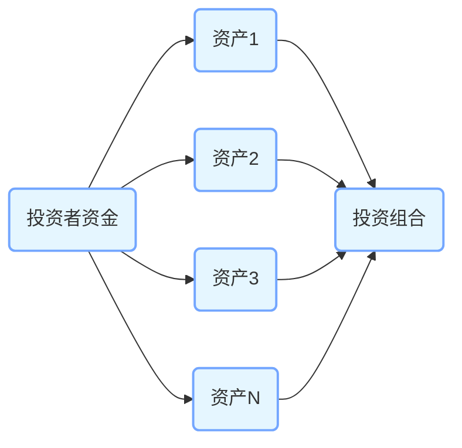
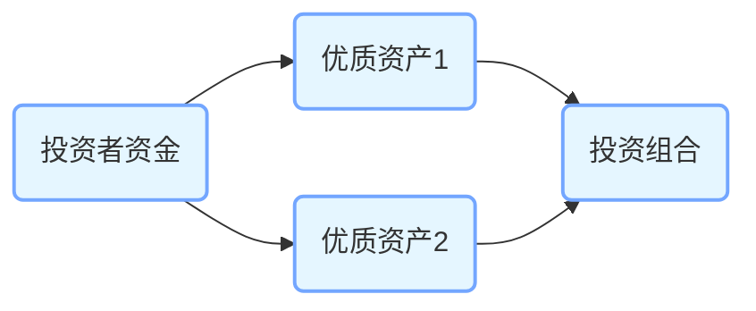

# 格雷厄姆的分散投资vs集中投资

> 关键词：格雷厄姆、分散投资、集中投资、投资策略、风险控制、收益最大化、投资组合

> 摘要：本文深入探讨了格雷厄姆的分散投资与集中投资两种策略。详细介绍了这两种投资策略的核心概念、原理、数学模型以及操作步骤。通过项目实战案例，展示了两种策略在实际应用中的表现和特点。分析了它们各自适用的实际应用场景，同时推荐了相关的学习资源、开发工具框架和论文著作。最后总结了这两种投资策略的未来发展趋势与挑战，并对常见问题进行了解答。旨在帮助投资者更全面地理解这两种投资策略，以便在投资决策中做出更合适的选择。

## 1. 背景介绍 
### 1.1 目的和范围
投资是金融领域的重要活动，投资者的目标通常是在控制风险的前提下实现收益最大化。格雷厄姆作为投资领域的大师，其提出的分散投资和集中投资策略对投资界产生了深远影响。本文的目的是深入研究这两种投资策略，对比它们的优缺点、适用场景等，范围涵盖了从理论原理到实际应用的各个方面，帮助投资者更好地理解和运用这两种策略。

### 1.2 预期读者
本文预期读者包括对投资领域感兴趣的初学者，希望系统了解不同投资策略的原理和应用；有一定投资经验的投资者，希望通过对比分析优化自己的投资组合；金融专业的学生和研究人员，用于学术研究和知识拓展。

### 1.3 文档结构概述
本文首先介绍背景信息，包括目的、预期读者和文档结构。接着阐述核心概念与联系，展示相关的原理和架构示意图。然后详细讲解核心算法原理和具体操作步骤，给出Python源代码。再介绍数学模型和公式，并举例说明。通过项目实战展示代码实际案例和详细解释。分析实际应用场景，推荐相关的工具和资源。最后总结未来发展趋势与挑战，解答常见问题，并提供扩展阅读和参考资料。

### 1.4 术语表
#### 1.4.1 核心术语定义
- **分散投资**：将资金分散投资于多个不同的资产或投资标的，以降低单一资产波动对整体投资组合的影响。
- **集中投资**：将大部分资金集中投资于少数几个经过深入研究和分析的优质资产。
- **投资组合**：由多种资产组成的集合，投资者通过调整资产的种类和比例来实现特定的投资目标。
- **风险**：投资过程中可能面临的损失或不确定性。
- **收益**：投资获得的回报，通常用收益率来衡量。

#### 1.4.2 相关概念解释
- **资产配置**：根据投资者的风险承受能力、投资目标等因素，将资金分配到不同类型的资产中，如股票、债券、现金等。
- **多元化**：分散投资的一种方式，通过投资于不同行业、不同地区、不同类型的资产来实现投资组合的多元化，降低风险。
- **安全边际**：格雷厄姆提出的概念，指股票的市场价格低于其内在价值的部分，是一种投资保护机制。

#### 1.4.3 缩略词列表
- **ROI**：Return on Investment，投资回报率
- **VAR**：Value at Risk，风险价值

## 2. 核心概念与联系 

### 分散投资的原理和架构
分散投资的核心原理是通过投资多个不同的资产，降低单一资产波动对整体投资组合的影响。因为不同资产的价格波动往往不完全相关，当某些资产价格下跌时，其他资产可能价格上涨，从而在一定程度上平衡投资组合的收益。

以下是分散投资的架构示意图：

在这个架构中，投资者的资金被分散投入到多个资产中，这些资产共同构成了投资组合。

### 集中投资的原理和架构
集中投资的原理是通过深入研究和分析，挑选出少数几个具有高增长潜力和内在价值的优质资产，将大部分资金集中投资于这些资产，以获取更高的收益。集中投资相信通过对少数资产的深入了解和精准把握，可以更好地抓住投资机会。

以下是集中投资的架构示意图：

在这个架构中，投资者将资金集中投入到少数几个优质资产中，形成投资组合。

### 两者的联系
分散投资和集中投资并不是完全对立的，它们都是为了实现投资者的投资目标。在实际投资中，投资者可以根据自己的风险承受能力、投资经验、市场环境等因素，灵活运用这两种策略。例如，投资者可以将一部分资金进行分散投资，以降低整体风险，同时将另一部分资金进行集中投资，以追求更高的收益。

## 3. 核心算法原理 & 具体操作步骤 

### 分散投资的核心算法原理和操作步骤
#### 原理
分散投资的核心是通过计算资产之间的相关性，选择相关性较低的资产进行组合，以降低投资组合的风险。假设我们有 $n$ 种资产，每种资产的收益率为 $r_i$，投资比例为 $w_i$，投资组合的收益率 $R_p$ 可以表示为：
$R_p=\sum_{i = 1}^{n}w_ir_i$

投资组合的风险可以用方差 $\sigma_p^2$ 来衡量：
$\sigma_p^2=\sum_{i = 1}^{n}\sum_{j = 1}^{n}w_iw_j\sigma_{ij}$
其中，$\sigma_{ij}$ 是资产 $i$ 和资产 $j$ 的协方差。

#### 操作步骤
1. **资产选择**：选择多种不同类型、不同行业、不同地区的资产，如股票、债券、基金等。
2. **数据收集**：收集所选资产的历史收益率数据。
3. **计算相关性**：根据历史收益率数据，计算资产之间的相关性矩阵。
4. **确定投资比例**：根据相关性矩阵和投资者的风险偏好，确定每种资产的投资比例。
5. **构建投资组合**：按照确定的投资比例，将资金分配到不同的资产中。

以下是使用Python实现分散投资组合构建的示例代码：
```python
import numpy as np
import pandas as pd
from scipy.optimize import minimize

# 假设有3种资产的历史收益率数据
returns = pd.DataFrame({
    'Asset1': [0.05, 0.03, 0.02, 0.04, 0.06],
    'Asset2': [0.03, 0.02, 0.01, 0.03, 0.05],
    'Asset3': [0.04, 0.03, 0.02, 0.04, 0.06]
})

# 计算资产的预期收益率
expected_returns = returns.mean()

# 计算资产的协方差矩阵
cov_matrix = returns.cov()

# 定义目标函数：最小化投资组合的方差
def portfolio_variance(weights, cov_matrix):
    return np.dot(weights.T, np.dot(cov_matrix, weights))

# 约束条件：投资比例之和为1
constraints = ({'type': 'eq', 'fun': lambda x: np.sum(x) - 1})

# 投资比例的范围
bounds = [(0, 1) for _ in range(len(expected_returns))]

# 初始投资比例
initial_weights = np.ones(len(expected_returns)) / len(expected_returns)

# 最小化投资组合的方差
result = minimize(portfolio_variance, initial_weights, args=(cov_matrix,),
                  method='SLSQP', bounds=bounds, constraints=constraints)

# 最优投资比例
optimal_weights = result.x

print("最优投资比例：", optimal_weights)
```

### 集中投资的核心算法原理和操作步骤
#### 原理
集中投资的核心是通过对资产的基本面分析，评估资产的内在价值，选择内在价值被低估且具有高增长潜力的资产进行投资。常用的估值方法包括市盈率（PE）、市净率（PB）、现金流折现法（DCF）等。

#### 操作步骤
1. **资产筛选**：根据投资者的投资标准，筛选出符合条件的资产。
2. **基本面分析**：对筛选出的资产进行深入的基本面分析，包括财务报表分析、行业前景分析、管理层评估等。
3. **估值计算**：使用合适的估值方法，计算资产的内在价值。
4. **比较分析**：将资产的市场价格与内在价值进行比较，选择被低估的资产。
5. **确定投资比例**：根据资产的潜在收益和风险，确定投资比例。
6. **构建投资组合**：将资金集中投资于选定的资产。

以下是一个简单的使用市盈率（PE）进行资产筛选的Python示例代码：
```python
# 假设有5只股票的相关数据
stocks = pd.DataFrame({
    'Stock': ['A', 'B', 'C', 'D', 'E'],
    'Price': [100, 120, 80, 90, 110],
    'Earnings': [10, 12, 8, 9, 11],
    'GrowthRate': [0.1, 0.12, 0.08, 0.09, 0.11]
})

# 计算市盈率
stocks['PE'] = stocks['Price'] / stocks['Earnings']

# 筛选出市盈率低于行业平均水平且增长潜力较高的股票
industry_avg_pe = 10
selected_stocks = stocks[(stocks['PE'] < industry_avg_pe) & (stocks['GrowthRate'] > 0.1)]

print("筛选出的股票：", selected_stocks)
```

## 4. 数学模型和公式 & 详细讲解 & 举例说明 

### 分散投资的数学模型和公式
#### 投资组合的收益率
如前面所述，投资组合的收益率 $R_p$ 可以表示为：
$$R_p=\sum_{i = 1}^{n}w_ir_i$$
其中，$w_i$ 是第 $i$ 种资产的投资比例，$r_i$ 是第 $i$ 种资产的收益率。

**举例说明**：假设投资者将资金分别以 0.3、0.4、0.3 的比例投资于三只股票，这三只股票的收益率分别为 0.05、0.06、0.04，则投资组合的收益率为：
$R_p = 0.3\times0.05 + 0.4\times0.06 + 0.3\times0.04 = 0.051$

#### 投资组合的风险（方差）
投资组合的方差 $\sigma_p^2$ 可以表示为：
$$\sigma_p^2=\sum_{i = 1}^{n}\sum_{j = 1}^{n}w_iw_j\sigma_{ij}$$
其中，$\sigma_{ij}$ 是资产 $i$ 和资产 $j$ 的协方差。当 $i = j$ 时，$\sigma_{ii}$ 就是资产 $i$ 的方差。

**举例说明**：假设有两只股票，投资比例分别为 0.5 和 0.5，它们的方差分别为 0.04 和 0.09，协方差为 0.02，则投资组合的方差为：
$\sigma_p^2 = 0.5^2\times0.04 + 0.5^2\times0.09 + 2\times0.5\times0.5\times0.02 = 0.0325$

### 集中投资的数学模型和公式
#### 市盈率（PE）估值模型
市盈率（PE）是最常用的估值指标之一，计算公式为：
$$PE=\frac{P}{E}$$
其中，$P$ 是股票的市场价格，$E$ 是每股收益。

**举例说明**：某股票的市场价格为 50 元，每股收益为 5 元，则该股票的市盈率为：
$PE = \frac{50}{5} = 10$

#### 现金流折现法（DCF）估值模型
现金流折现法是通过预测资产未来的现金流，并将其折现到当前时刻来计算资产的内在价值。假设资产在未来 $n$ 期的现金流为 $CF_t$，折现率为 $r$，则资产的内在价值 $V$ 可以表示为：
$$V=\sum_{t = 1}^{n}\frac{CF_t}{(1 + r)^t}$$

**举例说明**：某公司预计未来三年的现金流分别为 100 万元、120 万元、150 万元，折现率为 10%，则该公司的内在价值为：
$V=\frac{100}{(1 + 0.1)^1}+\frac{120}{(1 + 0.1)^2}+\frac{150}{(1 + 0.1)^3}\approx295.87$（万元）

## 5. 项目实战：代码实际案例和详细解释说明 

### 5.1  开发环境搭建
- **Python 环境**：安装 Python 3.x 版本，可以从 Python 官方网站（https://www.python.org/downloads/） 下载安装。
- **必要的库**：安装 `pandas`、`numpy`、`scipy` 等库，可以使用以下命令进行安装：
```sh
pip install pandas numpy scipy
```

### 5.2  源代码详细实现和代码解读
#### 分散投资组合优化代码
```python
import numpy as np
import pandas as pd
from scipy.optimize import minimize

# 假设有4种资产的历史收益率数据
returns = pd.DataFrame({
    'Asset1': [0.06, 0.04, 0.03, 0.05, 0.07],
    'Asset2': [0.04, 0.03, 0.02, 0.04, 0.06],
    'Asset3': [0.05, 0.04, 0.03, 0.05, 0.07],
    'Asset4': [0.03, 0.02, 0.01, 0.03, 0.05]
})

# 计算资产的预期收益率
expected_returns = returns.mean()

# 计算资产的协方差矩阵
cov_matrix = returns.cov()

# 定义目标函数：最小化投资组合的方差
def portfolio_variance(weights, cov_matrix):
    return np.dot(weights.T, np.dot(cov_matrix, weights))

# 约束条件：投资比例之和为1
constraints = ({'type': 'eq', 'fun': lambda x: np.sum(x) - 1})

# 投资比例的范围
bounds = [(0, 1) for _ in range(len(expected_returns))]

# 初始投资比例
initial_weights = np.ones(len(expected_returns)) / len(expected_returns)

# 最小化投资组合的方差
result = minimize(portfolio_variance, initial_weights, args=(cov_matrix,),
                  method='SLSQP', bounds=bounds, constraints=constraints)

# 最优投资比例
optimal_weights = result.x

print("最优投资比例：", optimal_weights)
```
**代码解读**：
1. **数据准备**：使用 `pandas` 生成一个包含 4 种资产历史收益率的 DataFrame。
2. **计算预期收益率和协方差矩阵**：使用 `mean()` 方法计算每种资产的预期收益率，使用 `cov()` 方法计算资产之间的协方差矩阵。
3. **定义目标函数**：`portfolio_variance` 函数用于计算投资组合的方差，这是我们要最小化的目标。
4. **设置约束条件和投资比例范围**：约束条件要求投资比例之和为 1，投资比例范围在 0 到 1 之间。
5. **初始投资比例**：将初始投资比例设置为平均分配。
6. **最小化投资组合的方差**：使用 `scipy.optimize.minimize` 函数进行优化，找到最优的投资比例。

#### 集中投资资产筛选代码
```python
# 假设有6只股票的相关数据
stocks = pd.DataFrame({
    'Stock': ['A', 'B', 'C', 'D', 'E', 'F'],
    'Price': [110, 130, 90, 100, 120, 140],
    'Earnings': [10, 12, 8, 9, 11, 13],
    'GrowthRate': [0.12, 0.14, 0.1, 0.11, 0.13, 0.15]
})

# 计算市盈率
stocks['PE'] = stocks['Price'] / stocks['Earnings']

# 筛选出市盈率低于行业平均水平且增长潜力较高的