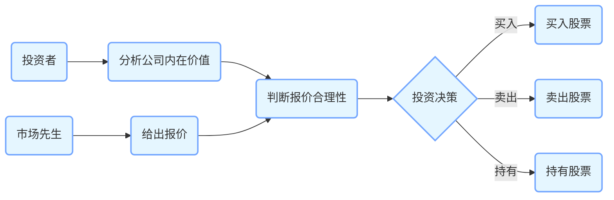

# 格雷厄姆的市场先生比喻

> 关键词：格雷厄姆、市场先生比喻、价值投资、市场情绪、投资决策

> 摘要：本文深入探讨了格雷厄姆提出的市场先生比喻这一重要概念。从其背景介绍入手，阐述目的、预期读者等内容。详细解析市场先生比喻的核心概念、算法原理、数学模型等。通过项目实战展示如何在实际投资中应用该比喻，分析其实际应用场景。同时推荐相关学习资源、开发工具和论文著作。最后总结其未来发展趋势与挑战，并对常见问题进行解答，还提供了扩展阅读和参考资料，旨在帮助投资者更好地理解市场波动，运用价值投资理念做出明智决策。

## 1. 背景介绍 
### 1.1 目的和范围
本文章的主要目的是深入剖析格雷厄姆的市场先生比喻，揭示其背后的投资哲学和实际应用价值。通过详细的讲解和案例分析，帮助投资者理解市场的非理性行为，掌握基于价值投资的决策方法。文章的范围涵盖市场先生比喻的核心概念、算法原理、数学模型、实际应用场景以及相关的学习资源和未来发展趋势等方面。

### 1.2 预期读者
本文预期读者主要包括对价值投资感兴趣的个人投资者、金融专业学生、投资领域的从业者以及希望深入了解市场运行机制的人士。无论您是投资新手还是有一定经验的投资者，都能从本文中获得有价值的信息和启示。

### 1.3 文档结构概述
本文将按照以下结构进行阐述：首先介绍背景信息，包括目的、预期读者和文档结构概述等；接着深入解析市场先生比喻的核心概念和联系，通过文本示意图和Mermaid流程图进行展示；然后讲解核心算法原理和具体操作步骤，并用Python源代码进行详细阐述；随后介绍相关的数学模型和公式，并举例说明；通过项目实战展示代码实际案例和详细解释；分析实际应用场景；推荐相关的工具和资源；总结未来发展趋势与挑战；提供附录解答常见问题；最后给出扩展阅读和参考资料。

### 1.4 术语表
#### 1.4.1 核心术语定义
- **格雷厄姆**：本杰明·格雷厄姆（Benjamin Graham）是价值投资理论的奠基人，被誉为“华尔街教父”，他的投资理念对后世产生了深远影响。
- **市场先生比喻**：格雷厄姆提出的一个形象比喻，将市场拟人化为“市场先生”，用来描述市场的非理性波动和投资者与市场的关系。
- **价值投资**：一种投资策略，强调通过分析公司的内在价值，寻找被低估的股票进行投资，以获得长期稳定的回报。
- **内在价值**：公司的真实价值，由公司的资产、盈利能力、现金流等因素决定。

#### 1.4.2 相关概念解释
- **市场情绪**：投资者对市场的整体心理状态和情感倾向，会影响市场的价格波动。
- **非理性行为**：投资者在决策过程中受到情绪、心理等因素的影响，做出不符合理性分析的行为。
- **安全边际**：股票的市场价格低于其内在价值的幅度，为投资者提供一定的风险缓冲。

#### 1.4.3 缩略词列表
- **PE**：市盈率（Price-to-Earnings Ratio），衡量股票价格相对公司盈利水平的指标。
- **PB**：市净率（Price-to-Book Ratio），衡量股票价格相对公司净资产的指标。

## 2. 核心概念与联系 
### 核心概念原理
格雷厄姆的市场先生比喻是一种形象的方式来描述股票市场的行为。想象有一个名叫“市场先生”的人，他是你的商业伙伴，每天都会来到你面前，给出一个他愿意购买你的股份或将他的股份卖给你的价格。市场先生的情绪极不稳定，有时他非常乐观，会给出一个很高的价格；而有时他又非常悲观，会给出一个很低的价格。

市场先生的报价反映了市场的情绪和短期的供求关系，而不是公司的内在价值。投资者的任务是根据公司的内在价值来判断市场先生的报价是否合理，而不是被市场先生的情绪所左右。

### 文本示意图
```plaintext
投资者 <-- 分析内在价值 --> 市场先生报价
                      |
                      v
         做出投资决策（买入/卖出/持有）
```

### Mermaid 流程图


## 3. 核心算法原理 & 具体操作步骤 
### 核心算法原理
在基于市场先生比喻的投资决策中，核心算法是评估公司的内在价值，并将其与市场先生的报价进行比较。常用的评估内在价值的方法有现金流折现法（DCF）、相对估值法等。

### 现金流折现法（DCF）原理
现金流折现法的基本思想是将公司未来的现金流折现到当前，以得到公司的内在价值。其公式为：

$$V = \sum_{t=1}^{n} \frac{CF_t}{(1 + r)^t}$$

其中，$V$ 是公司的内在价值，$CF_t$ 是第 $t$ 期的现金流，$r$ 是折现率，$n$ 是预测期数。

### Python 代码实现
```python
def dcf_valuation(cash_flows, discount_rate):
    """
    现金流折现法计算公司内在价值
    :param cash_flows: 未来各期现金流列表
    :param discount_rate: 折现率
    :return: 公司内在价值
    """
    intrinsic_value = 0
    for t, cf in enumerate(cash_flows, start=1):
        intrinsic_value += cf / ((1 + discount_rate) ** t)
    return intrinsic_value

# 示例数据
cash_flows = [100, 120, 150, 180, 200]
discount_rate = 0.1

# 计算内在价值
intrinsic_value = dcf_valuation(cash_flows, discount_rate)
print(f"公司内在价值: {intrinsic_value}")
```

### 具体操作步骤
1. **收集数据**：收集公司的财务报表、行业数据等信息，以便进行现金流预测和折现率确定。
2. **预测现金流**：根据公司的历史数据和行业趋势，预测未来各期的现金流。
3. **确定折现率**：折现率反映了投资的风险和机会成本，通常可以使用资本资产定价模型（CAPM）来确定。
4. **计算内在价值**：使用现金流折现法或其他估值方法计算公司的内在价值。
5. **比较报价**：将公司的内在价值与市场先生的报价（股票市场价格）进行比较。
6. **做出决策**：如果市场价格低于内在价值，且有足够的安全边际，则考虑买入；如果市场价格高于内在价值，则考虑卖出或持有。

## 4. 数学模型和公式 & 详细讲解 & 举例说明 
### 现金流折现法（DCF）公式
$$V = \sum_{t=1}^{n} \frac{CF_t}{(1 + r)^t}$$

### 详细讲解
- $V$：公司的内在价值，即公司未来现金流的现值之和。
- $CF_t$：第 $t$ 期的现金流，通常是预测的公司在该期的净现金流入。
- $r$：折现率，反映了投资的风险和机会成本。折现率越高，未来现金流的现值越低。
- $n$：预测期数，即预测未来现金流的期限。

### 举例说明
假设一家公司未来 5 年的现金流分别为 $100$ 万元、$120$ 万元、$150$ 万元、$180$ 万元和 $200$ 万元，折现率为 $10\%$。则该公司的内在价值计算如下：

第 1 年现金流的现值：$\frac{100}{(1 + 0.1)^1} = 90.91$（万元）

第 2 年现金流的现值：$\frac{120}{(1 + 0.1)^2} = 99.17$（万元）

第 3 年现金流的现值：$\frac{150}{(1 + 0.1)^3} = 112.69$（万元）

第 4 年现金流的现值：$\frac{180}{(1 + 0.1)^4} = 122.94$（万元）

第 5 年现金流的现值：$\frac{200}{(1 + 0.1)^5} = 124.18$（万元）

公司内在价值：$90.91 + 99.17 + 112.69 + 122.94 + 124.18 = 549.89$（万元）

### 相对估值法
相对估值法是通过比较同行业其他公司的估值指标来评估目标公司的价值。常用的估值指标有市盈率（PE）、市净率（PB）等。

#### 市盈率法
市盈率法的公式为：

$$V = EPS \times PE$$

其中，$V$ 是公司的内在价值，$EPS$ 是每股收益，$PE$ 是市盈率。

#### 举例说明
假设一家公司的每股收益为 $2$ 元，同行业平均市盈率为 $15$ 倍。则该公司的内在价值为：

$V = 2 \times 15 = 30$（元/股）

## 5. 项目实战：代码实际案例和详细解释说明 
### 5.1  开发环境搭建
- **编程语言**：Python
- **开发工具**：Jupyter Notebook 或 PyCharm
- **所需库**：pandas、numpy、matplotlib

安装所需库的命令：
```sh
pip install pandas numpy matplotlib
```

### 5.2  源代码详细实现和代码解读
```python
import pandas as pd
import numpy as np
import matplotlib.pyplot as plt

# 假设我们有一家公司过去 5 年的净利润数据
net_profits = [100, 120, 150, 180, 200]
years = [2016, 2017, 2018, 2019, 2020]

# 创建 DataFrame
data = pd.DataFrame({'Year': years, 'Net Profit': net_profits})

# 计算净利润增长率
data['Growth Rate'] = data['Net Profit'].pct_change()

# 预测未来 5 年的净利润
last_profit = data['Net Profit'].iloc[-1]
average_growth_rate = data['Growth Rate'].mean()
future_years = [2021, 2022, 2023, 2024, 2025]
future_profits = []
for _ in range(5):
    last_profit = last_profit * (1 + average_growth_rate)
    future_profits.append(last_profit)

# 假设折现率为 10%
discount_rate = 0.1

# 计算未来现金流的现值
present_values = []
for i, profit in enumerate(future_profits, start=1):
    present_value = profit / ((1 + discount_rate) ** i)
    present_values.append(present_value)

# 计算公司内在价值
intrinsic_value = sum(present_values)

# 打印结果
print(f"公司未来 5 年的预测净利润: {future_profits}")
print(f"公司内在价值: {intrinsic_value}")

# 绘制净利润增长图
plt.figure(figsize=(10, 6))
plt.plot(data['Year'], data['Net Profit'], marker='o', label='Historical Net Profit')
plt.plot(future_years, future_profits, marker='o', label='Predicted Net Profit')
plt.xlabel('Year')
plt.ylabel('Net Profit')
plt.title('Company Net Profit Growth')
plt.legend()
plt.grid(True)
plt.show()
```

### 代码解读与分析
1. **数据准备**：使用 `pandas` 库创建一个包含公司过去 5 年净利润数据的 DataFrame，并计算净利润增长率。
2. **未来净利润预测**：根据过去的净利润增长率，预测未来 5 年的净利润。
3. **现金流折现**：使用折现率计算未来现金流的现值，并求和得到公司的内在价值。
4. **结果展示**：打印未来 5 年的预测净利润和公司内在价值，并使用 `matplotlib` 库绘制净利润增长图。

## 6. 实际应用场景 
### 股票投资决策
投资者可以使用市场先生比喻和价值投资理念来选择股票。当市场先生给出的报价低于公司的内在价值时，投资者可以考虑买入；当市场先生给出的报价高于公司的内在价值时，投资者可以考虑卖出或持有。

### 投资组合管理
在构建投资组合时，投资者可以根据市场先生的报价和公司的内在价值，选择不同的股票进行组合，以实现风险分散和收益最大化。

### 企业并购评估
在企业并购中，收购方可以使用市场先生比喻和价值投资理念来评估目标企业的价值，以确定合理的收购价格。

### 长期投资规划
对于长期投资者来说，市场先生的短期波动并不重要，重要的是公司的内在价值是否能够持续增长。投资者可以根据公司的内在价值进行长期投资规划，避免被市场情绪所左右。

## 7. 工具和资源推荐
### 7.1 学习资源推荐
#### 7.1.1 书籍推荐
- 《聪明的投资者》（The Intelligent Investor）：本杰明·格雷厄姆的经典著作，详细阐述了价值投资的理念和方法。
- 《证券分析》（Security Analysis）：同样是格雷厄姆的著作，是价值投资领域的权威教材。
- 《巴菲特致股东的信》（Letters to Shareholders of Berkshire Hathaway）：沃伦·巴菲特每年写给股东的信，包含了丰富的投资智慧和经验。

#### 7.1.2 在线课程
- Coursera 上的“Investment Management Specialization”：由哥伦比亚大学教授授课，涵盖了投资管理的各个方面。
- edX 上的“Financial Markets”：由耶鲁大学教授罗伯特·席勒（Robert Shiller）授课，介绍了金融市场的基本原理和投资策略。

#### 7.1.3 技术博客和网站
- Seeking Alpha：提供股票分析、投资策略和市场评论等内容。
- ValueWalk：专注于价值投资领域，分享价值投资者的观点和研究成果。

### 7.2 开发工具框架推荐
#### 7.2.1 IDE和编辑器
- PyCharm：一款专业的 Python 集成开发环境，提供丰富的代码编辑、调试和分析功能。
- Jupyter Notebook：一个交互式的开发环境，适合进行数据分析和可视化。

#### 7.2.2 调试和性能分析工具
- pdb：Python 内置的调试器，可用于调试 Python 代码。
- cProfile：Python 内置的性能分析工具，可用于分析代码的运行时间和性能瓶颈。

#### 7.2.3 相关框架和库
- pandas：用于数据处理和分析的 Python 库，提供了丰富的数据结构和数据分析工具。
- numpy：用于科学计算的 Python 库，提供了高效的数组操作和数学函数。
- matplotlib：用于数据可视化的 Python 库，可绘制各种类型的图表和图形。

### 7.3 相关论文著作推荐
#### 7.3.1 经典论文
- “The Theory of Investment Value” by John Burr Williams：提出了现金流折现法的基本思想。
- “Security Analysis” by Benjamin Graham and David Dodd：奠定了价值投资的理论基础。

#### 7.3.2 最新研究成果
- 关注顶级金融学术期刊，如 the Journal of Finance、the Review of Financial Studies 等，获取最新的投资研究成果。

#### 7.3.3 应用案例分析
- 研究巴菲特、芒格等投资大师的投资案例，学习他们如何运用价值投资理念进行投资决策。

## 8. 总结：未来发展趋势与挑战
### 未来发展趋势
- **数字化和智能化**：随着科技的发展，投资领域将越来越数字化和智能化。投资者可以使用大数据、人工智能等技术来分析市场和公司数据，提高投资决策的准确性和效率。
- **全球一体化**：全球金融市场的一体化趋势将继续加强，投资者可以更加容易地进行跨国投资。同时，全球经济和政治的变化也将对投资市场产生更大的影响。
- **可持续投资**：越来越多的投资者开始关注环境、社会和治理（ESG）因素，可持续投资将成为未来投资的重要方向。

### 挑战
- **市场不确定性**：市场先生的情绪和行为难以预测，市场的不确定性增加了投资决策的难度。投资者需要具备更强的风险管理能力和心理素质。
- **信息过载**：在数字化时代，投资者面临着海量的信息。如何筛选和分析有价值的信息，成为投资者面临的一大挑战。
- **竞争加剧**：随着投资市场的发展，越来越多的投资者和机构进入市场，竞争加剧。投资者需要不断提升自己的投资能力和专业知识，才能在市场中取得优势。

## 9. 附录：常见问题与解答
### 问题 1：如何准确评估公司的内在价值？
答：评估公司的内在价值是一个复杂的过程，需要综合考虑公司的财务状况、行业前景、竞争优势等因素。常用的评估方法有现金流折现法、相对估值法等。同时，投资者还需要对公司进行深入的研究和分析，以提高评估的准确性。

### 问题 2：市场先生的报价一定是不合理的吗？
答：市场先生的报价并不一定是不合理的。在某些情况下，市场先生的报价可能反映了公司的真实价值。但由于市场情绪和短期供求关系的影响，市场先生的报价往往会出现波动，偏离公司的内在价值。投资者需要通过分析内在价值来判断市场先生的报价是否合理。

### 问题 3：价值投资适合所有投资者吗？
答：价值投资并不适合所有投资者。价值投资需要投资者具备一定的财务知识和分析能力，能够对公司的内在价值进行评估。同时，价值投资是一种长期投资策略，需要投资者具备耐心和定力，能够忍受市场的短期波动。对于那些追求短期收益、缺乏耐心的投资者来说，价值投资可能并不适合。

## 10. 扩展阅读 & 参考资料
### 扩展阅读
- 《金融炼金术》（The Alchemy of Finance）：乔治·索罗斯（George Soros）的著作，介绍了他的投资哲学和交易策略。
- 《漫步华尔街》（A Random Walk Down Wall Street）：伯顿·马尔基尔（Burton Malkiel）的著作，探讨了股票市场的有效性和投资策略。

### 参考资料
- Graham, Benjamin. The Intelligent Investor. Harper Business, 2003.
- Graham, Benjamin, and David Dodd. Security Analysis. McGraw-Hill, 1934.
- Buffett, Warren. Letters to Shareholders of Berkshire Hathaway. Berkshire Hathaway Inc., various years.

作者：AI天才研究院/AI Genius Institute & 禅与计算机程序设计艺术 /Zen And The Art of Computer Programming