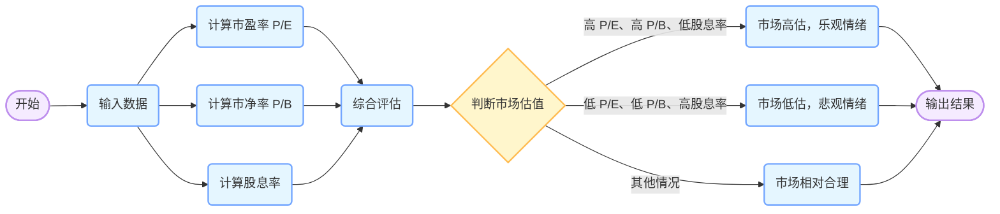

# 格雷厄姆的市场情绪指标

> 关键词：格雷厄姆、市场情绪指标、价值投资、市场分析、股票估值

> 摘要：本文围绕格雷厄姆的市场情绪指标展开深入探讨。首先介绍了该指标提出的背景、目的和适用范围，明确预期读者群体。接着阐述了核心概念，包括其原理和架构，并通过示意图与流程图直观展示。详细讲解了核心算法原理，给出 Python 代码实现及具体操作步骤。从数学角度剖析了相关模型和公式，并举例说明。结合项目实战，提供开发环境搭建、源代码实现及解读。探讨了该指标在实际市场中的应用场景，推荐了学习资源、开发工具框架以及相关论文著作。最后总结未来发展趋势与挑战，解答常见问题，并列出扩展阅读和参考资料，旨在帮助读者全面理解和运用格雷厄姆的市场情绪指标进行市场分析和投资决策。

## 1. 背景介绍 
### 1.1 目的和范围
本杰明·格雷厄姆（Benjamin Graham）作为价值投资理论的奠基人，其提出的市场情绪指标旨在帮助投资者更好地理解市场的整体情绪状态，进而为投资决策提供有力依据。该指标的核心目的是衡量市场的乐观或悲观程度，通过对市场中各种因素的综合分析，判断市场是否处于高估或低估的状态。

其范围主要涵盖股票市场，特别是针对那些具有一定规模和流动性的上市公司股票。通过对这些股票的价格、盈利、股息等数据进行分析，构建出反映市场情绪的指标体系。然而，该指标并非仅仅局限于单一市场，在一定程度上也可以应用于不同国家和地区的股票市场，为全球范围内的投资者提供参考。

### 1.2 预期读者
本文的预期读者主要包括以下几类人群：
- **投资者**：无论是个人投资者还是机构投资者，都可以通过了解格雷厄姆的市场情绪指标，更好地把握市场趋势，优化投资组合，提高投资收益。
- **金融分析师**：该指标为金融分析师提供了一种新的分析视角和工具，有助于他们更准确地评估市场风险和价值，为客户提供更专业的投资建议。
- **学者和研究人员**：对于从事金融市场研究的学者和研究人员来说，格雷厄姆的市场情绪指标是一个重要的研究对象，可以为相关领域的学术研究提供有价值的参考。
- **金融从业者**：包括证券经纪人、基金经理等金融从业者，掌握该指标可以提升他们的专业素养和业务能力，更好地服务客户。

### 1.3 文档结构概述
本文将按照以下结构进行详细阐述：
- **核心概念与联系**：介绍格雷厄姆市场情绪指标的核心概念，包括其原理和架构，并通过文本示意图和 Mermaid 流程图进行直观展示。
- **核心算法原理 & 具体操作步骤**：深入讲解该指标的核心算法原理，并给出 Python 源代码实现及具体操作步骤。
- **数学模型和公式 & 详细讲解 & 举例说明**：从数学角度剖析该指标的模型和公式，并通过具体例子进行详细说明。
- **项目实战：代码实际案例和详细解释说明**：结合实际项目，介绍开发环境搭建、源代码实现及代码解读，帮助读者更好地理解和应用该指标。
- **实际应用场景**：探讨格雷厄姆的市场情绪指标在实际市场中的应用场景，为读者提供实践指导。
- **工具和资源推荐**：推荐学习该指标所需的相关书籍、在线课程、技术博客和网站，以及开发工具框架和相关论文著作。
- **总结：未来发展趋势与挑战**：总结该指标的发展趋势和面临的挑战，为读者提供前瞻性的思考。
- **附录：常见问题与解答**：解答读者在学习和应用该指标过程中常见的问题。
- **扩展阅读 & 参考资料**：提供相关的扩展阅读材料和参考资料，方便读者进一步深入研究。

### 1.4 术语表
#### 1.4.1 核心术语定义
- **格雷厄姆的市场情绪指标**：由本杰明·格雷厄姆提出的，用于衡量股票市场整体情绪状态的指标体系，通过对市场中多个因素的综合分析，判断市场是否处于高估或低估状态。
- **价值投资**：一种投资策略，强调通过分析股票的内在价值，寻找被低估的股票进行投资，以获取长期稳定的收益。
- **市盈率（P/E）**：股票价格与每股盈利的比率，是衡量股票估值的重要指标之一。
- **市净率（P/B）**：股票价格与每股净资产的比率，反映了市场对公司资产价值的认可程度。
- **股息率**：股息与股票价格的比率，是衡量股票投资收益的重要指标之一。

#### 1.4.2 相关概念解释
- **市场情绪**：指投资者对市场的整体看法和预期，包括乐观、悲观等不同情绪状态。市场情绪会影响投资者的行为和决策，进而对市场价格产生影响。
- **内在价值**：指股票的真实价值，是基于公司的基本面因素，如盈利、资产、现金流等计算得出的价值。价值投资的核心就是寻找股票的内在价值，并与市场价格进行比较。
- **安全边际**：指股票的市场价格低于其内在价值的部分。格雷厄姆认为，投资者应该在具有足够安全边际的情况下进行投资，以降低投资风险。

#### 1.4.3 缩略词列表
- **P/E**：市盈率（Price-to-Earnings Ratio）
- **P/B**：市净率（Price-to-Book Ratio）

## 2. 核心概念与联系 

### 核心概念原理
格雷厄姆的市场情绪指标的核心原理基于价值投资理论，认为市场价格会围绕股票的内在价值波动，而市场情绪会影响这种波动的幅度和方向。当市场情绪乐观时，投资者往往会高估股票的价值，导致市场价格高于内在价值；反之，当市场情绪悲观时，投资者会低估股票的价值，使市场价格低于内在价值。

该指标通过综合考虑多个因素，如市盈率、市净率、股息率等，来衡量市场的整体估值水平，进而判断市场情绪的状态。具体来说，当市盈率和市净率较高，股息率较低时，说明市场处于高估状态，投资者情绪较为乐观；反之，当市盈率和市净率较低，股息率较高时，说明市场处于低估状态，投资者情绪较为悲观。

### 架构的文本示意图
```plaintext
格雷厄姆的市场情绪指标
|
|-- 输入数据
|   |-- 股票价格
|   |-- 每股盈利
|   |-- 每股净资产
|   |-- 股息
|
|-- 计算指标
|   |-- 市盈率（P/E） = 股票价格 / 每股盈利
|   |-- 市净率（P/B） = 股票价格 / 每股净资产
|   |-- 股息率 = 股息 / 股票价格
|
|-- 综合评估
|   |-- 根据 P/E、P/B 和股息率判断市场估值
|   |   |-- 高 P/E、高 P/B、低股息率：市场高估，乐观情绪
|   |   |-- 低 P/E、低 P/B、高股息率：市场低估，悲观情绪
|   |   |-- 其他情况：市场相对合理
|
|-- 输出结果
|   |-- 市场情绪状态（乐观、悲观、合理）
```

### Mermaid 流程图


## 3. 核心算法原理 & 具体操作步骤 

### 核心算法原理
格雷厄姆的市场情绪指标的核心算法主要包括三个步骤：计算市盈率（P/E）、市净率（P/B）和股息率，然后根据这些指标的数值综合评估市场的估值水平，从而判断市场情绪的状态。

#### 计算市盈率（P/E）
市盈率是股票价格与每股盈利的比率，计算公式为：
$$P/E = \frac{股票价格}{每股盈利}$$
市盈率反映了投资者为获取每一元盈利所愿意支付的价格，是衡量股票估值的重要指标之一。一般来说，较高的市盈率意味着市场对该股票的预期较高，可能存在高估的风险；较低的市盈率则可能表示股票被低估。

#### 计算市净率（P/B）
市净率是股票价格与每股净资产的比率，计算公式为：
$$P/B = \frac{股票价格}{每股净资产}$$
市净率反映了市场对公司资产价值的认可程度。如果市净率大于 1，说明市场价格高于公司的净资产价值；如果市净率小于 1，则说明市场价格低于公司的净资产价值。

#### 计算股息率
股息率是股息与股票价格的比率，计算公式为：
$$股息率 = \frac{股息}{股票价格} \times 100\%$$
股息率反映了股票的分红水平，是衡量股票投资收益的重要指标之一。较高的股息率意味着投资者可以获得更多的分红收益，通常被认为是股票具有投资价值的一个重要标志。

#### 综合评估
根据计算得到的市盈率、市净率和股息率的数值，综合评估市场的估值水平，判断市场情绪的状态：
- **市场高估，乐观情绪**：当市盈率和市净率较高，股息率较低时，说明市场对股票的预期过高，投资者情绪较为乐观，市场可能存在高估的风险。
- **市场低估，悲观情绪**：当市盈率和市净率较低，股息率较高时，说明市场对股票的预期过低，投资者情绪较为悲观，市场可能存在低估的机会。
- **市场相对合理**：当市盈率、市净率和股息率处于相对合理的范围内时，说明市场估值较为合理，投资者情绪相对稳定。

### 具体操作步骤
以下是使用 Python 实现格雷厄姆的市场情绪指标的具体操作步骤：

```python
# 步骤 1：定义股票数据
stock_price = 100  # 股票价格
earnings_per_share = 5  # 每股盈利
book_value_per_share = 20  # 每股净资产
dividend = 2  # 股息

# 步骤 2：计算市盈率（P/E）
pe_ratio = stock_price / earnings_per_share

# 步骤 3：计算市净率（P/B）
pb_ratio = stock_price / book_value_per_share

# 步骤 4：计算股息率
dividend_yield = (dividend / stock_price) * 100

# 步骤 5：综合评估市场情绪
if pe_ratio > 20 and pb_ratio > 2 and dividend_yield < 2:
    market_sentiment = "市场高估，乐观情绪"
elif pe_ratio < 10 and pb_ratio < 1 and dividend_yield > 5:
    market_sentiment = "市场低估，悲观情绪"
else:
    market_sentiment = "市场相对合理"

# 步骤 6：输出结果
print(f"市盈率（P/E）: {pe_ratio}")
print(f"市净率（P/B）: {pb_ratio}")
print(f"股息率: {dividend_yield}%")
print(f"市场情绪状态: {market_sentiment}")
```

### 代码解释
1. **定义股票数据**：首先定义了股票的价格、每股盈利、每股净资产和股息等数据。
2. **计算市盈率（P/E）**：通过股票价格除以每股盈利得到市盈率。
3. **计算市净率（P/B）**：通过股票价格除以每股净资产得到市净率。
4. **计算股息率**：通过股息除以股票价格并乘以 100 得到股息率。
5. **综合评估市场情绪**：根据市盈率、市净率和股息率的数值，使用条件判断语句判断市场情绪的状态。
6. **输出结果**：打印计算得到的市盈率、市净率、股息率和市场情绪状态。

## 4. 数学模型和公式 & 详细讲解 & 举例说明 

### 数学模型和公式
格雷厄姆的市场情绪指标主要基于以下三个数学公式：

#### 市盈率（P/E）
$$P/E = \frac{股票价格}{每股盈利}$$

#### 市净率（P/B）
$$P/B = \frac{股票价格}{每股净资产}$$

#### 股息率
$$股息率 = \frac{股息}{股票价格} \times 100\%$$

### 详细讲解
- **市盈率（P/E）**：市盈率反映了投资者为获取每一元盈利所愿意支付的价格。较高的市盈率意味着投资者对该股票的未来盈利增长预期较高，愿意支付更高的价格；较低的市盈率则可能表示股票的盈利增长前景不佳，或者市场对该股票存在过度悲观的情绪。然而，市盈率也受到行业、市场环境等因素的影响，不同行业的市盈率水平可能存在较大差异。
- **市净率（P/B）**：市净率反映了市场对公司资产价值的认可程度。市净率大于 1 表示市场价格高于公司的净资产价值，可能意味着市场对公司的未来发展前景较为乐观；市净率小于 1 则表示市场价格低于公司的净资产价值，可能存在公司资产被低估的情况。但市净率也不能单独作为判断股票投资价值的依据，还需要结合公司的盈利能力、行业特点等因素进行综合分析。
- **股息率**：股息率反映了股票的分红水平，是衡量股票投资收益的重要指标之一。较高的股息率意味着投资者可以获得更多的分红收益，通常被认为是股票具有投资价值的一个重要标志。但股息率也受到公司盈利状况、分红政策等因素的影响，有些公司可能更倾向于将盈利用于再投资，而不是分红。

### 举例说明
假设我们有两家公司 A 和 B，其相关数据如下表所示：

| 公司 | 股票价格（元） | 每股盈利（元） | 每股净资产（元） | 股息（元） |
| ---- | ---- | ---- | ---- | ---- |
| A | 50 | 5 | 20 | 2 |
| B | 100 | 10 | 50 | 1 |

#### 计算市盈率（P/E）
- 公司 A 的市盈率：$P/E_A = \frac{50}{5} = 10$
- 公司 B 的市盈率：$P/E_B = \frac{100}{10} = 10$

#### 计算市净率（P/B）
- 公司 A 的市净率：$P/B_A = \frac{50}{20} = 2.5$
- 公司 B 的市净率：$P/B_B = \frac{100}{50} = 2$

#### 计算股息率
- 公司 A 的股息率：$股息率_A = \frac{2}{50} \times 100\% = 4\%$
- 公司 B 的股息率：$股息率_B = \frac{1}{100} \times 100\% = 1\%$

#### 综合评估
- 公司 A：市盈率为 10，市净率为 2.5，股息率为 4%。从数据来看，市盈率处于相对合理的范围，市净率略高于 2，股息率较高，整体市场估值相对合理，投资者情绪较为稳定。
- 公司 B：市盈率为 10，市净率为 2，股息率为 1%。虽然市盈率和市净率与公司 A 相近，但股息率较低，可能表示市场对公司 B 的未来盈利增长预期较高，投资者情绪较为乐观，但也可能存在一定的高估风险。

通过以上例子可以看出，格雷厄姆的市场情绪指标可以帮助投资者综合考虑多个因素，对股票的估值水平和市场情绪进行评估，从而为投资决策提供参考。

## 5. 项目实战：代码实际案例和详细解释说明 

### 5.1  开发环境搭建
在进行格雷厄姆的市场情绪指标的项目实战之前，需要搭建相应的开发环境。以下是具体的搭建步骤：

#### 安装 Python
Python 是一种广泛使用的编程语言，具有丰富的库和工具。可以从 Python 官方网站（https://www.python.org/downloads/）下载并安装适合自己操作系统的 Python 版本。建议安装 Python 3.6 及以上版本。

#### 安装必要的库
在 Python 中，我们可以使用一些第三方库来简化数据处理和分析的过程。以下是需要安装的主要库：
- **pandas**：用于数据处理和分析。
- **numpy**：用于数值计算。

可以使用以下命令来安装这些库：
```sh
pip install pandas numpy
```

#### 选择开发工具
可以选择使用集成开发环境（IDE）或文本编辑器来编写和运行 Python 代码。常见的 IDE 包括 PyCharm、Jupyter Notebook 等，文本编辑器可以选择 Visual Studio Code、Sublime Text 等。

### 5.2  源代码详细实现和代码解读
以下是一个完整的 Python 代码示例，用于计算多只股票的格雷厄姆市场情绪指标，并输出结果：

```python
import pandas as pd
import numpy as np

# 定义股票数据
data = {
    '股票名称': ['股票 A', '股票 B', '股票 C'],
    '股票价格': [50, 100, 80],
    '每股盈利': [5, 10, 8],
    '每股净资产': [20, 50, 40],
    '股息': [2, 1, 3]
}

# 创建 DataFrame
df = pd.DataFrame(data)

# 计算市盈率（P/E）
df['市盈率（P/E）'] = df['股票价格'] / df['每股盈利']

# 计算市净率（P/B）
df['市净率（P/B）'] = df['股票价格'] / df['每股净资产']

# 计算股息率
df['股息率'] = (df['股息'] / df['股票价格']) * 100

# 定义市场情绪判断函数
def judge_market_sentiment(row):
    if row['市盈率（P/E）'] > 20 and row['市净率（P/B）'] > 2 and row['股息率'] < 2:
        return "市场高估，乐观情绪"
    elif row['市盈率（P/E）'] < 10 and row['市净率（P/B）'] < 1 and row['股息率'] > 5:
        return "市场低估，悲观情绪"
    else:
        return "市场相对合理"

# 应用市场情绪判断函数
df['市场情绪状态'] = df.apply(judge_market_sentiment, axis=1)

# 输出结果
print(df)
```

### 5.3  代码解读与分析
1. **导入必要的库**：导入 `pandas` 和 `numpy` 库，用于数据处理和数值计算。
2. **定义股票数据**：使用字典 `data` 定义多只股票的相关数据，包括股票名称、股票价格、每股盈利、每股净资产和股息。
3. **创建 DataFrame**：使用 `pandas` 的 `DataFrame` 函数将字典数据转换为数据框，方便进行数据处理和分析。
4. **计算市盈率（P/E）**：通过将股票价格除以每股盈利，计算每只股票的市盈率，并将结果添加到数据框中。
5. **计算市净率（P/B）**：通过将股票价格除以每股净资产，计算每只股票的市净率，并将结果添加到数据框中。
6. **计算股息率**：通过将股息除以股票价格并乘以 100，计算每只股票的股息率，并将结果添加到数据框中。
7. **定义市场情绪判断函数**：定义一个名为 `judge_market_sentiment` 的函数，根据市盈率、市净率和股息率的数值判断市场情绪的状态。
8. **应用市场情绪判断函数**：使用 `apply` 方法将市场情绪判断函数应用到数据框的每一行，将判断结果添加到数据框中。
9. **输出结果**：打印包含所有计算结果和市场情绪状态的数据框。

通过以上代码，我们可以方便地计算多只股票的格雷厄姆市场情绪指标，并对市场情绪状态进行评估。

## 6. 实际应用场景 
格雷厄姆的市场情绪指标在实际投资和市场分析中具有广泛的应用场景，以下是一些常见的应用场景：

### 投资决策
投资者可以使用该指标来判断市场的整体估值水平和情绪状态，从而做出合理的投资决策。当市场处于高估状态，投资者情绪较为乐观时，应谨慎投资，避免追高买入；当市场处于低估状态，投资者情绪较为悲观时，可以寻找被低估的股票进行投资，以获取长期的投资回报。例如，在 2008 年全球金融危机期间，市场情绪极度悲观，许多股票的市盈率和市净率大幅下降，股息率上升，此时一些价值投资者根据格雷厄姆的市场情绪指标，大量买入被低估的股票，在随后的市场反弹中获得了丰厚的收益。

### 资产配置
该指标可以帮助投资者进行资产配置，合理分配资金在不同资产之间的比例。当市场处于高估状态时，可以适当减少股票投资的比例，增加债券、现金等防御性资产的配置；当市场处于低估状态时，可以增加股票投资的比例，提高资产的收益潜力。例如，一些机构投资者会根据市场情绪指标的变化，动态调整其投资组合中股票和债券的比例，以实现资产的稳健增值。

### 市场趋势分析
通过对格雷厄姆市场情绪指标的长期跟踪和分析，可以了解市场的趋势变化和投资者情绪的波动情况。当指标持续显示市场处于高估状态时，可能预示着市场即将出现调整；当指标持续显示市场处于低估状态时，可能意味着市场即将迎来反弹。例如，分析师可以通过观察该指标的变化，提前预测市场的走势，为投资者提供投资建议。

### 行业比较
该指标还可以用于不同行业之间的比较，帮助投资者发现被低估或高估的行业。不同行业的市盈率、市净率和股息率水平可能存在较大差异，通过比较各行业的指标数值，可以找出相对具有投资价值的行业。例如，在某些时期，一些传统行业的市盈率和市净率较低，股息率较高，而新兴行业的市盈率和市净率较高，股息率较低。投资者可以根据自己的风险偏好和投资目标，选择适合自己的行业进行投资。

## 7. 工具和资源推荐
### 7.1 学习资源推荐
#### 7.1.1 书籍推荐
- 《聪明的投资者》（The Intelligent Investor）：本杰明·格雷厄姆的经典著作，被誉为投资界的“圣经”。书中详细阐述了价值投资的理念和方法，包括格雷厄姆的市场情绪指标的相关内容，是投资者必读的书籍之一。
- 《证券分析》（Security Analysis）：同样是本杰明·格雷厄姆的著作，是价值投资理论的奠基之作。该书对股票和债券的分析方法进行了系统的阐述，为投资者提供了深入的理论指导。
- 《怎样选择成长股》（Common Stocks and Uncommon Profits）：菲利普·费雪（Philip Fisher）的经典著作，介绍了如何通过分析公司的基本面和成长潜力，选择具有长期投资价值的股票。该书与格雷厄姆的价值投资理论相互补充，对投资者具有重要的参考价值。

#### 7.1.2 在线课程
- Coursera 上的“投资学原理”（Principles of Investing）课程：由知名教授授课，涵盖了投资学的基本原理和方法，包括股票估值、市场分析等内容，对学习格雷厄姆的市场情绪指标有很大的帮助。
- edX 上的“金融市场”（Financial Markets）课程：由耶鲁大学教授罗伯特·席勒（Robert Shiller）主讲，深入探讨了金融市场的运行机制和投资者行为，对理解市场情绪的形成和影响具有重要的启示作用。

#### 7.1.3 技术博客和网站
- Seeking Alpha（https://seekingalpha.com/）：一个专业的金融投资网站，提供大量的股票分析、市场评论和投资策略等内容。网站上有许多关于价值投资和格雷厄姆理论的文章，对投资者具有很高的参考价值。
- 雪球（https://xueqiu.com/）：国内知名的投资社交平台，汇聚了众多投资者和金融专家。用户可以在平台上分享投资经验、交流投资心得，同时也能获取到最新的市场信息和分析报告。

### 7.2 开发工具框架推荐
#### 7.2.1 IDE和编辑器
- PyCharm：一款专业的 Python 集成开发环境，具有强大的代码编辑、调试和项目管理功能，适合开发各种 Python 项目，包括使用格雷厄姆市场情绪指标进行数据分析和投资决策的项目。
- Jupyter Notebook：一种交互式的开发环境，支持 Python 等多种编程语言。它以笔记本的形式呈现代码和结果，方便用户进行数据探索、分析和可视化，非常适合用于快速验证和展示格雷厄姆市场情绪指标的计算结果。

#### 7.2.2 调试和性能分析工具
- Py-Spy：一个轻量级的 Python 性能分析工具，可以实时监测 Python 程序的 CPU 使用率和函数调用情况，帮助开发者找出程序中的性能瓶颈。
- PDB：Python 自带的调试器，可以在代码中设置断点，逐行执行代码，查看变量的值和程序的执行流程，方便开发者调试代码。

#### 7.2.3 相关框架和库
- pandas：一个强大的数据处理和分析库，提供了丰富的数据结构和函数，方便用户进行数据清洗、转换和分析，是使用格雷厄姆市场情绪指标进行数据分析的必备工具。
- numpy：一个用于数值计算的库，提供了高效的多维数组对象和各种数学函数，能够加速数据处理和计算的过程。
- matplotlib：一个用于数据可视化的库，可以绘制各种类型的图表，如折线图、柱状图、散点图等，帮助用户直观地展示格雷厄姆市场情绪指标的计算结果。

### 7.3 相关论文著作推荐
#### 7.3.1 经典论文
- Benjamin Graham and David Dodd, "Security Analysis" (1934): 这是价值投资理论的经典论文，详细阐述了股票和债券的分析方法，包括如何通过财务报表和市场数据评估股票的内在价值，对格雷厄姆的市场情绪指标的形成具有重要的影响。
- Eugene F. Fama and Kenneth R. French, "The Cross-Section of Expected Stock Returns" (1992): 该论文提出了著名的 Fama-French 三因子模型，对股票的预期收益率进行了深入的研究。虽然该模型与格雷厄姆的市场情绪指标有所不同，但可以为投资者提供另一种分析市场和股票的视角。

#### 7.3.2 最新研究成果
- 近年来，随着金融科技的发展，越来越多的研究开始关注如何利用大数据和人工智能技术来改进格雷厄姆的市场情绪指标。例如，一些研究通过分析社交媒体数据和新闻资讯，挖掘投资者的情绪信息，以更准确地判断市场情绪的状态。
- 还有一些研究探讨了格雷厄姆市场情绪指标在不同市场环境下的有效性和局限性，为投资者提供了更深入的理论和实践指导。

#### 7.3.3 应用案例分析
- 一些金融机构和投资公司会定期发布关于格雷厄姆市场情绪指标的应用案例分析报告，通过实际案例展示如何运用该指标进行投资决策和资产配置。这些报告可以帮助投资者更好地理解和应用该指标，提高投资收益。

## 8. 总结：未来发展趋势与挑战
### 未来发展趋势
- **与大数据和人工智能的融合**：随着大数据和人工智能技术的不断发展，格雷厄姆的市场情绪指标有望与这些技术深度融合。通过分析海量的市场数据、社交媒体数据和新闻资讯等，可以更准确地捕捉投资者的情绪信息，提高指标的预测准确性。例如，利用自然语言处理技术对新闻文章和社交媒体评论进行情感分析，将投资者的情绪量化并纳入市场情绪指标的计算中。
- **跨市场和跨资产类别的应用**：目前，格雷厄姆的市场情绪指标主要应用于股票市场。未来，该指标有望扩展到其他金融市场和资产类别，如债券市场、期货市场、外汇市场等。通过综合考虑不同市场和资产类别的情绪指标，可以为投资者提供更全面的市场分析和投资建议。
- **个性化投资策略的制定**：随着投资者对个性化投资的需求不断增加，格雷厄姆的市场情绪指标可以与投资者的风险偏好、投资目标等因素相结合，为投资者制定个性化的投资策略。例如，根据投资者的风险承受能力和投资期限，调整市场情绪指标的阈值，为不同类型的投资者提供定制化的投资建议。

### 挑战
- **数据质量和可靠性**：格雷厄姆的市场情绪指标的计算依赖于大量的市场数据和财务数据，数据的质量和可靠性直接影响指标的准确性。在实际应用中，可能会遇到数据缺失、数据错误等问题，需要对数据进行清洗和预处理，以提高数据的质量。
- **市场环境的变化**：金融市场是一个复杂多变的系统，市场环境会受到宏观经济、政策法规、国际形势等多种因素的影响。格雷厄姆的市场情绪指标是基于历史数据和经验总结出来的，在市场环境发生重大变化时，指标的有效性可能会受到挑战。例如，在金融危机、重大政策调整等特殊时期，市场情绪可能会出现异常波动，传统的指标计算方法可能无法准确反映市场的真实情况。
- **投资者情绪的复杂性**：投资者情绪是一个复杂的心理现象，受到多种因素的影响，如个人心理、群体心理、市场传闻等。准确捕捉和量化投资者情绪是一个具有挑战性的任务，目前的技术和方法还存在一定的局限性。例如，社交媒体上的言论可能存在虚假信息和情绪化表达，如何从中筛选出有价值的信息并准确判断投资者的情绪是一个亟待解决的问题。

## 9. 附录：常见问题与解答
### 问题 1：格雷厄姆的市场情绪指标适用于所有市场吗？
解答：格雷厄姆的市场情绪指标主要是基于股票市场的特点和规律提出的，虽然其基本原理可以在一定程度上应用于其他金融市场，但不同市场的特点和影响因素存在差异，因此该指标在不同市场的适用性可能会有所不同。在应用该指标时，需要结合具体市场的情况进行适当的调整和修正。

### 问题 2：如何确定市盈率、市净率和股息率的合理范围？
解答：市盈率、市净率和股息率的合理范围会受到行业、市场环境、经济周期等多种因素的影响，没有一个固定的标准。一般来说，可以参考历史数据、同行业平均水平以及市场的整体估值情况来确定合理范围。例如，对于一些稳定增长的行业，市盈率可能在 15-25 之间较为合理；对于一些高增长的新兴行业，市盈率可能会更高。同时，还需要结合公司的基本面和未来发展前景进行综合判断。

### 问题 3：格雷厄姆的市场情绪指标与其他市场分析方法有什么区别？
解答：格雷厄姆的市场情绪指标主要侧重于从市场估值和投资者情绪的角度来分析市场，通过综合考虑市盈率、市净率和股息率等因素，判断市场的高估或低估状态。而其他市场分析方法，如技术分析、基本面分析等，可能会从不同的角度和层面来分析市场。技术分析主要通过研究市场的价格走势和成交量等数据，预测市场的未来走势；基本面分析则主要关注公司的财务状况、经营业绩、行业前景等因素，评估公司的内在价值。这些方法可以相互补充，投资者可以根据自己的需求和投资风格选择合适的分析方法。

### 问题 4：该指标可以准确预测市场的走势吗？
解答：虽然格雷厄姆的市场情绪指标可以在一定程度上反映市场的估值水平和投资者情绪状态，但市场是复杂多变的，受到多种因素的影响，因此该指标不能准确预测市场的走势。它只能为投资者提供一个参考，帮助投资者更好地理解市场的情况，做出更合理的投资决策。投资者在使用该指标时，还需要结合其他信息和分析方法进行综合判断。

## 10. 扩展阅读 & 参考资料
### 扩展阅读
- 《战胜华尔街》（One Up On Wall Street）：彼得·林奇（Peter Lynch）的著作，分享了他在投资领域的成功经验和选股策略，对投资者具有很大的启发作用。
- 《金融炼金术》（The Alchemy of Finance）：乔治·索罗斯（George Soros）的著作，介绍了他的反身性理论和投资哲学，对理解金融市场的运行机制和投资者行为具有重要的意义。
- 《非理性繁荣》（Irrational Exuberance）：罗伯特·席勒（Robert Shiller）的著作，探讨了金融市场中的泡沫现象和投资者的非理性行为，对研究市场情绪和市场波动具有重要的参考价值。

### 参考资料
- Benjamin Graham, "The Intelligent Investor", HarperBusiness, 1949.
- Benjamin Graham and David Dodd, "Security Analysis", McGraw-Hill, 1934.
- Eugene F. Fama and Kenneth R. French, "The Cross-Section of Expected Stock Returns", Journal of Finance, 1992.
- Robert J. Shiller, "Irrational Exuberance", Princeton University Press, 2000.

作者：AI天才研究院/AI Genius Institute & 禅与计算机程序设计艺术 /Zen And The Art of Computer Programming