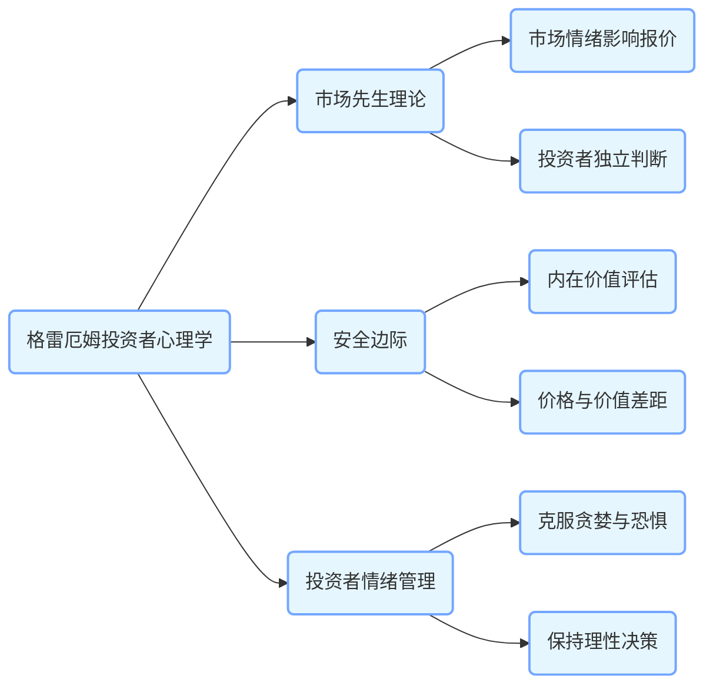

# 格雷厄姆的投资者心理学

> 关键词：格雷厄姆、投资者心理学、价值投资、市场情绪、理性决策

> 摘要：本文深入探讨了格雷厄姆的投资者心理学。本杰明·格雷厄姆作为价值投资的先驱，其投资者心理学对于投资者理解市场和自身行为有着重要意义。文章从背景介绍入手，阐述了研究目的、预期读者等内容。接着详细剖析了格雷厄姆投资者心理学的核心概念与联系，包括市场先生理论等。通过核心算法原理和具体操作步骤，结合Python代码示例，帮助读者从量化角度理解。同时给出相关数学模型和公式，并举例说明。在项目实战部分，以股票投资为例进行代码实现和解读。还介绍了该理论在实际投资场景中的应用，推荐了相关学习资源、开发工具框架以及论文著作。最后总结了未来发展趋势与挑战，解答了常见问题，并提供了扩展阅读和参考资料，旨在为投资者提供全面深入的格雷厄姆投资者心理学知识体系。

## 1. 背景介绍 
### 1.1 目的和范围
本文章旨在全面且深入地探讨格雷厄姆的投资者心理学。具体目的包括：帮助投资者理解格雷厄姆所提出的投资者心理相关理论，掌握如何运用这些理论来指导投资决策；剖析市场情绪对投资者的影响机制，使投资者能够在复杂的市场环境中保持理性；通过实际案例和代码示例，展示如何将理论应用于实际投资项目中。范围涵盖了格雷厄姆投资者心理学的核心概念、算法原理、数学模型、实际应用场景等多个方面。

### 1.2 预期读者
预期读者主要包括各类投资者，无论是初入投资领域的新手，还是有一定投资经验的专业人士。对于新手投资者，文章可以作为入门指南，帮助他们建立正确的投资心理和理念；对于专业投资者，文章中的深入分析和实际案例可能会为他们提供新的思考角度和投资策略。此外，金融专业的学生、研究人员以及对投资心理学感兴趣的人士也可以从本文中获取有价值的信息。

### 1.3 文档结构概述
本文将按照以下结构进行阐述：首先介绍核心概念与联系，明确格雷厄姆投资者心理学的关键概念和它们之间的关系，并通过文本示意图和Mermaid流程图进行直观展示；接着讲解核心算法原理和具体操作步骤，结合Python代码详细说明如何量化和应用这些原理；然后给出相关的数学模型和公式，并举例说明其在投资中的应用；在项目实战部分，以实际投资案例为基础，进行开发环境搭建、源代码实现和代码解读；之后介绍该理论在实际投资场景中的应用；再推荐相关的学习资源、开发工具框架和论文著作；最后总结未来发展趋势与挑战，解答常见问题，并提供扩展阅读和参考资料。

### 1.4 术语表
#### 1.4.1 核心术语定义
- **价值投资**：由格雷厄姆开创的一种投资策略，强调通过分析公司的基本面，寻找被市场低估的股票，以合理的价格买入并长期持有，从而获得投资回报。
- **市场先生**：格雷厄姆提出的一个概念，将市场拟人化为“市场先生”，它每天都会出现，为投资者提供买卖股票的报价，但这个报价可能会受到情绪等因素的影响，不一定反映股票的真实价值。
- **安全边际**：指股票的内在价值与市场价格之间的差距。投资者在购买股票时，应选择具有足够安全边际的股票，以降低投资风险。

#### 1.4.2 相关概念解释
- **投资者情绪**：投资者在投资过程中所表现出的心理状态和情感倾向，如乐观、悲观、恐惧、贪婪等。这些情绪会影响投资者的决策和市场的走势。
- **羊群效应**：在投资市场中，投资者往往会受到其他投资者的影响，跟随大多数人的投资行为，而忽略了自己的独立判断。这种现象就像羊群跟随头羊行动一样，容易导致市场的过度波动。

#### 1.4.3 缩略词列表
- **PE**：市盈率（Price-to-Earnings Ratio），是股票价格与每股收益的比率，用于衡量股票的估值水平。
- **PB**：市净率（Price-to-Book Ratio），是股票价格与每股净资产的比率，反映了股票的市场价格相对于其账面价值的高低。

## 2. 核心概念与联系 
### 核心概念原理
格雷厄姆的投资者心理学基于几个核心概念，其中最著名的是“市场先生”理论。市场先生是一个非常情绪化的人，他每天都会来到投资者面前，给出一个股票的买卖报价。有时候，市场先生会因为乐观而给出过高的报价；有时候，又会因为悲观而给出过低的报价。投资者的任务就是要认识到市场先生的情绪波动，不要被他的报价所左右，而是要根据股票的内在价值来做出投资决策。

另一个重要概念是“安全边际”。格雷厄姆认为，投资者在购买股票时，应该为自己留出足够的安全边际。也就是说，要以低于股票内在价值的价格买入股票，这样即使市场出现不利变化，投资者也能减少损失。安全边际的大小取决于多种因素，如公司的财务状况、行业前景、宏观经济环境等。

### 架构的文本示意图
```plaintext
格雷厄姆投资者心理学
|-- 市场先生理论
|   |-- 市场情绪影响报价
|   |-- 投资者独立判断
|-- 安全边际
|   |-- 内在价值评估
|   |-- 价格与价值差距
|-- 投资者情绪管理
|   |-- 克服贪婪与恐惧
|   |-- 保持理性决策
```

### Mermaid流程图


## 3. 核心算法原理 & 具体操作步骤 
### 核心算法原理
在量化格雷厄姆的投资者心理学时，我们可以从评估股票的内在价值和判断市场情绪两个方面入手。对于内在价值的评估，常用的方法是基于公司的财务数据，如盈利、净资产等。一种简单的方法是使用市盈率（PE）和市净率（PB）来估算股票的价值。

假设我们使用以下公式来估算股票的内在价值 $V$：

$V = EPS \times PE_{合理} + BV \times PB_{合理}$

其中，$EPS$ 是每股收益，$PE_{合理}$ 是合理的市盈率，$BV$ 是每股净资产，$PB_{合理}$ 是合理的市净率。

对于市场情绪的判断，我们可以通过分析股票价格的波动情况来进行。如果股票价格短期内大幅上涨或下跌，可能意味着市场情绪处于极端状态。

### 具体操作步骤
1. **收集数据**：收集目标公司的财务报表，获取每股收益（EPS）、每股净资产（BV）等数据。同时，收集该股票的历史价格数据。
2. **确定合理的市盈率和市净率**：参考同行业其他公司的平均市盈率和市净率，结合目标公司的基本面情况，确定合理的 $PE_{合理}$ 和 $PB_{合理}$。
3. **计算内在价值**：根据上述公式计算股票的内在价值 $V$。
4. **分析市场情绪**：计算股票价格的波动率，如标准差等。如果波动率较大，说明市场情绪可能不稳定。
5. **做出投资决策**：比较股票的市场价格 $P$ 和内在价值 $V$。如果 $P < V$ 且市场情绪相对稳定，说明该股票具有投资价值，可以考虑买入；如果 $P > V$ 且市场情绪处于极端状态，建议谨慎操作或卖出。

### Python源代码详细阐述
```python
import pandas as pd
import numpy as np

# 收集的数据示例
eps = 2.0  # 每股收益
bv = 10.0  # 每股净资产
pe_reasonable = 15  # 合理的市盈率
pb_reasonable = 2  # 合理的市净率
historical_prices = [50, 52, 55, 53, 51, 49, 47, 48, 50, 52]  # 历史价格数据

# 计算内在价值
def calculate_intrinsic_value(eps, pe_reasonable, bv, pb_reasonable):
    return eps * pe_reasonable + bv * pb_reasonable

intrinsic_value = calculate_intrinsic_value(eps, pe_reasonable, bv, pb_reasonable)
print(f"股票的内在价值为: {intrinsic_value}")

# 分析市场情绪（计算价格波动率）
price_series = pd.Series(historical_prices)
volatility = price_series.std()
print(f"股票价格的波动率为: {volatility}")

# 模拟当前市场价格
current_price = 45

# 做出投资决策
if current_price < intrinsic_value and volatility < 3:  # 假设波动率小于3表示市场情绪相对稳定
    print("该股票具有投资价值，可以考虑买入。")
elif current_price > intrinsic_value and volatility > 5:  # 假设波动率大于5表示市场情绪处于极端状态
    print("建议谨慎操作或卖出。")
else:
    print("建议继续观察。")
```

## 4. 数学模型和公式 & 详细讲解 & 举例说明 
### 数学模型和公式
#### 内在价值计算公式
$V = EPS \times PE_{合理} + BV \times PB_{合理}$

详细讲解：这个公式综合考虑了公司的盈利和净资产情况。$EPS \times PE_{合理}$ 部分反映了公司基于盈利的价值，而 $BV \times PB_{合理}$ 部分反映了公司基于净资产的价值。通过将这两部分相加，可以得到一个相对合理的股票内在价值估计。

#### 价格波动率计算公式
$\sigma = \sqrt{\frac{1}{n} \sum_{i=1}^{n} (P_i - \bar{P})^2}$

其中，$\sigma$ 是价格波动率（标准差），$P_i$ 是第 $i$ 个时间点的股票价格，$\bar{P}$ 是平均价格，$n$ 是样本数量。

详细讲解：价格波动率衡量了股票价格的波动程度。标准差越大，说明价格波动越剧烈，市场情绪可能越不稳定；标准差越小，说明价格相对稳定，市场情绪可能较为平稳。

### 举例说明
假设一家公司的每股收益 $EPS = 3$ 元，每股净资产 $BV = 15$ 元。同行业类似公司的平均市盈率 $PE_{合理} = 18$，平均市净率 $PB_{合理} = 2.5$。

根据内在价值计算公式可得：

$V = 3 \times 18 + 15 \times 2.5$
$= 54 + 37.5$
$= 91.5$（元）

这意味着该股票的内在价值约为 91.5 元。

假设该股票过去 10 天的价格分别为：[90, 92, 95, 93, 91, 89, 87, 88, 90, 92]。

首先计算平均价格 $\bar{P}$：

$\bar{P} = \frac{90 + 92 + 95 + 93 + 91 + 89 + 87 + 88 + 90 + 92}{10} = 90.7$（元）

然后计算价格波动率 $\sigma$：

$\sigma = \sqrt{\frac{(90 - 90.7)^2 + (92 - 90.7)^2 + (95 - 90.7)^2 + (93 - 90.7)^2 + (91 - 90.7)^2 + (89 - 90.7)^2 + (87 - 90.7)^2 + (88 - 90.7)^2 + (90 - 90.7)^2 + (92 - 90.7)^2}{10}}$

$= \sqrt{\frac{(-0.7)^2 + 1.3^2 + 4.3^2 + 2.3^2 + 0.3^2 + (-1.7)^2 + (-3.7)^2 + (-2.7)^2 + (-0.7)^2 + 1.3^2}{10}}$

$= \sqrt{\frac{0.49 + 1.69 + 18.49 + 5.29 + 0.09 + 2.89 + 13.69 + 7.29 + 0.49 + 1.69}{10}}$

$= \sqrt{\frac{51.1}{10}} \approx 2.26$

如果当前股票市场价格为 85 元，由于 $85 < 91.5$ 且波动率 $2.26 < 3$（假设 3 为市场情绪相对稳定的阈值），根据我们的投资决策规则，该股票具有投资价值，可以考虑买入。

## 5. 项目实战：代码实际案例和详细解释说明 
### 5.1  开发环境搭建
#### 安装Python
首先，需要安装Python编程语言。可以从Python官方网站（https://www.python.org/downloads/）下载适合自己操作系统的Python版本。建议选择Python 3.6及以上版本。

#### 安装必要的库
在命令行中使用以下命令安装所需的库：
```sh
pip install pandas numpy
```
`pandas` 库用于数据处理和分析，`numpy` 库用于数值计算。

### 5.2  源代码详细实现和代码解读
```python
import pandas as pd
import numpy as np

# 定义一个函数来收集数据（这里为了简化，直接使用模拟数据）
def collect_data():
    eps = 2.5  # 每股收益
    bv = 12.0  # 每股净资产
    pe_reasonable = 16  # 合理的市盈率
    pb_reasonable = 2.2  # 合理的市净率
    historical_prices = [60, 62, 65, 63, 61, 59, 57, 58, 60, 62]  # 历史价格数据
    return eps, bv, pe_reasonable, pb_reasonable, historical_prices

# 计算内在价值
def calculate_intrinsic_value(eps, pe_reasonable, bv, pb_reasonable):
    return eps * pe_reasonable + bv * pb_reasonable

# 分析市场情绪（计算价格波动率）
def analyze_market_sentiment(historical_prices):
    price_series = pd.Series(historical_prices)
    volatility = price_series.std()
    return volatility

# 做出投资决策
def make_investment_decision(current_price, intrinsic_value, volatility):
    if current_price < intrinsic_value and volatility < 3:
        return "该股票具有投资价值，可以考虑买入。"
    elif current_price > intrinsic_value and volatility > 5:
        return "建议谨慎操作或卖出。"
    else:
        return "建议继续观察。"

# 主函数
def main():
    eps, bv, pe_reasonable, pb_reasonable, historical_prices = collect_data()
    intrinsic_value = calculate_intrinsic_value(eps, pe_reasonable, bv, pb_reasonable)
    print(f"股票的内在价值为: {intrinsic_value}")
    volatility = analyze_market_sentiment(historical_prices)
    print(f"股票价格的波动率为: {volatility}")
    current_price = 55
    decision = make_investment_decision(current_price, intrinsic_value, volatility)
    print(decision)

if __name__ == "__main__":
    main()
```

### 代码解读与分析
1. **数据收集**：`collect_data` 函数模拟了数据收集的过程，返回每股收益、每股净资产、合理的市盈率、合理的市净率和历史价格数据。
2. **内在价值计算**：`calculate_intrinsic_value` 函数根据前面介绍的公式计算股票的内在价值。
3. **市场情绪分析**：`analyze_market_sentiment` 函数使用 `pandas` 库计算历史价格的波动率，以此来判断市场情绪。
4. **投资决策**：`make_investment_decision` 函数根据当前市场价格、内在价值和波动率做出投资决策。
5. **主函数**：`main` 函数调用上述函数，完成数据收集、内在价值计算、市场情绪分析和投资决策，并输出结果。

## 6. 实际应用场景 
### 股票投资
在股票投资中，格雷厄姆的投资者心理学有着广泛的应用。投资者可以运用市场先生理论，不被市场的短期波动所左右，而是通过分析公司的基本面，确定股票的内在价值。当市场先生给出过低的报价时，投资者可以以较低的价格买入具有足够安全边际的股票；当市场先生给出过高的报价时，投资者可以考虑卖出股票。例如，在2008年金融危机期间，许多股票价格大幅下跌，市场情绪极度悲观。但一些遵循格雷厄姆投资理念的投资者，通过深入分析公司的财务状况，发现了一些被低估的优质股票，并在低价时买入，最终获得了丰厚的回报。

### 基金投资
对于基金投资者来说，也可以借鉴格雷厄姆的投资者心理学。当市场整体上涨，投资者情绪高涨时，基金的净值可能会被高估；当市场下跌，投资者情绪恐慌时，基金的净值可能会被低估。投资者可以通过分析基金所投资的标的资产的内在价值，以及市场情绪的变化，来选择合适的投资时机。例如，当市场处于熊市末期，投资者普遍悲观时，一些优质基金的净值可能已经被低估，此时投资者可以适当增加对这些基金的投资。

### 债券投资
在债券投资中，同样需要考虑市场情绪和债券的内在价值。当市场利率上升时，债券价格通常会下跌，投资者可能会产生恐慌情绪；当市场利率下降时，债券价格会上涨，投资者可能会变得过于乐观。投资者可以根据债券的票面利率、到期收益率等因素，计算债券的内在价值，并结合市场情绪的变化，做出合理的投资决策。例如，当市场利率大幅上升，债券价格大幅下跌时，如果债券的内在价值仍然较高，投资者可以考虑买入债券。

## 7. 工具和资源推荐
### 7.1 学习资源推荐
#### 7.1.1 书籍推荐
- 《聪明的投资者》（The Intelligent Investor）：本杰明·格雷厄姆的经典著作，被誉为投资界的“圣经”。书中详细阐述了格雷厄姆的投资理念和方法，包括投资者心理学、价值投资等内容。
- 《证券分析》（Security Analysis）：也是格雷厄姆的重要著作，对证券的分析方法和估值理论进行了深入探讨，为投资者提供了系统的投资分析框架。
- 《金融心理学》（Psychology of Financial Markets）：作者是拉斯·特维德，该书从心理学的角度分析了金融市场中的各种现象和投资者的行为，有助于投资者更好地理解市场情绪和自身的心理弱点。

#### 7.1.2 在线课程
- Coursera上的“投资学原理”（Principles of Investing）：该课程由知名大学的教授授课，涵盖了投资的基本概念、理论和方法，包括价值投资和投资者心理学等内容。
- edX上的“金融市场与投资”（Financial Markets and Investments）：课程内容丰富，涉及金融市场的各个方面，对投资者理解市场和掌握投资技巧有很大帮助。

#### 7.1.3 技术博客和网站
- 雪球网（https://xueqiu.com/）：国内知名的投资社区，聚集了大量的投资者和投资专家。在雪球网上，投资者可以分享自己的投资经验和观点，学习他人的投资策略，同时还可以获取最新的市场信息和研究报告。
- Seeking Alpha（https://seekingalpha.com/）：国际知名的金融投资网站，提供了丰富的股票分析、投资研究和市场评论等内容。投资者可以在这里找到不同视角的投资分析和建议。

### 7.2 开发工具框架推荐
#### 7.2.1 IDE和编辑器
- PyCharm：一款专业的Python集成开发环境（IDE），具有代码编辑、调试、自动补全、代码分析等功能，适合Python开发者进行投资相关的数据分析和算法实现。
- Jupyter Notebook：一种交互式的开发环境，支持Python等多种编程语言。它以笔记本的形式展示代码和运行结果，非常适合进行数据探索、模型验证和可视化分析，在投资领域的数据分析和建模中应用广泛。

#### 7.2.2 调试和性能分析工具
- pdb：Python自带的调试工具，可以帮助开发者在代码中设置断点，逐步执行代码，查看变量的值和程序的执行流程，方便调试投资算法和数据分析代码。
- cProfile：Python的性能分析工具，可以统计代码中各个函数的执行时间和调用次数，帮助开发者找出代码中的性能瓶颈，优化投资算法的性能。

#### 7.2.3 相关框架和库
- Pandas：用于数据处理和分析的Python库，提供了高效的数据结构和数据操作方法，如数据读取、清洗、转换、统计分析等，在投资领域的数据处理和分析中应用广泛。
- NumPy：用于数值计算的Python库，提供了多维数组对象和各种数学函数，能够高效地进行数值计算和矩阵运算，是投资算法实现的基础库之一。
- Matplotlib：用于数据可视化的Python库，可以绘制各种类型的图表，如折线图、柱状图、散点图等，帮助投资者直观地展示投资数据和分析结果。

### 7.3 相关论文著作推荐
#### 7.3.1 经典论文
- 《The Capital Asset Pricing Model: Theory and Evidence》：该论文对资本资产定价模型进行了深入的研究和探讨，是现代金融理论的重要基石之一，对于理解投资风险和收益的关系具有重要意义。
- 《Efficient Capital Markets: A Review of Theory and Empirical Work》：这篇论文提出了有效市场假说，对金融市场的效率和信息传递机制进行了分析，为投资者理解市场的有效性和投资策略的选择提供了理论依据。

#### 7.3.2 最新研究成果
- 近年来，随着行为金融学的发展，关于投资者心理和行为的研究不断涌现。例如，一些研究通过实验和实证分析，揭示了投资者在决策过程中的认知偏差和情绪影响，为投资者心理学的研究提供了新的视角和方法。
- 关于人工智能在投资领域的应用研究也逐渐增多，如使用机器学习算法进行股票价格预测、投资组合优化等。这些研究成果为投资者提供了新的投资工具和策略。

#### 7.3.3 应用案例分析
- 一些金融机构和投资公司会发布关于投资策略和案例分析的报告。例如，高盛、摩根大通等国际知名金融机构会定期发布市场研究报告和投资策略建议，其中包含了大量的实际投资案例分析，投资者可以从中学习到不同市场环境下的投资方法和策略。

## 8. 总结：未来发展趋势与挑战
### 未来发展趋势
#### 与人工智能的融合
随着人工智能技术的不断发展，格雷厄姆的投资者心理学可能会与人工智能技术更加紧密地结合。例如，使用机器学习算法对大量的市场数据和投资者行为数据进行分析，挖掘投资者的心理模式和行为规律，从而更准确地预测市场情绪和投资者的决策。同时，人工智能还可以帮助投资者进行自动化的投资决策，根据投资者的风险偏好和投资目标，自动选择合适的投资组合。

#### 跨学科研究的深入
投资者心理学本身就是一个跨学科的领域，涉及金融学、心理学、社会学等多个学科。未来，跨学科研究可能会更加深入，结合神经科学、行为经济学等学科的研究成果，进一步揭示投资者的心理机制和行为规律。例如，通过神经科学的研究方法，了解投资者在决策过程中的大脑活动，为投资者心理学的研究提供更微观的视角。

#### 全球化的影响
随着全球金融市场的日益一体化，投资者心理学的研究和应用也将受到全球化的影响。不同国家和地区的投资者具有不同的文化背景、投资习惯和心理特征，未来需要考虑这些因素，开展跨国和跨文化的投资者心理学研究，为全球投资者提供更具针对性的投资建议和策略。

### 挑战
#### 数据的准确性和可靠性
在运用人工智能和大数据分析投资者心理时，数据的准确性和可靠性是关键。市场数据和投资者行为数据可能存在噪声、偏差和缺失等问题，如何处理这些问题，提高数据的质量，是一个挑战。此外，数据的隐私和安全问题也需要引起重视，确保投资者的个人信息不被泄露。

#### 市场的复杂性和不确定性
金融市场是一个复杂的系统，受到多种因素的影响，如宏观经济环境、政策变化、突发事件等。这些因素的复杂性和不确定性增加了投资者心理分析和预测的难度。即使使用先进的技术和方法，也难以完全准确地预测市场情绪和投资者的决策。

#### 投资者教育和普及
虽然格雷厄姆的投资者心理学具有重要的价值，但目前很多投资者对其了解还不够深入。如何加强投资者教育，普及投资者心理学的知识和理念，提高投资者的心理素质和投资能力，是一个长期而艰巨的任务。

## 9. 附录：常见问题与解答
### 问题1：如何确定合理的市盈率和市净率？
解答：确定合理的市盈率和市净率可以参考同行业其他公司的平均水平。可以通过金融数据网站、证券研究报告等渠道获取同行业公司的市盈率和市净率数据。同时，还需要考虑目标公司的基本面情况，如公司的盈利能力、成长潜力、行业地位等。如果目标公司的基本面优于同行业平均水平，可以适当提高其合理的市盈率和市净率；反之，则应降低。

### 问题2：市场情绪的判断标准是否固定？
解答：市场情绪的判断标准不是固定的，它会受到多种因素的影响，如市场环境、行业特点、宏观经济形势等。在不同的市场环境下，市场情绪的波动范围和表现形式可能会有所不同。因此，投资者需要根据具体情况灵活调整判断标准，结合多种指标和方法进行综合判断。

### 问题3：格雷厄姆的投资者心理学是否适用于所有类型的投资？
解答：格雷厄姆的投资者心理学适用于大多数类型的投资，包括股票、基金、债券等。其核心思想是强调投资者要保持理性，根据资产的内在价值进行投资决策，避免被市场情绪所左右。但不同类型的投资具有不同的特点和风险特征，在应用时需要结合具体情况进行适当的调整和补充。

## 10. 扩展阅读 & 参考资料
### 扩展阅读
- 《非理性繁荣》（Irrational Exuberance）：作者是罗伯特·席勒，该书探讨了金融市场中的泡沫现象和投资者的非理性行为，与格雷厄姆的投资者心理学相互补充，有助于投资者更全面地理解市场和自身行为。
- 《思考，快与慢》（Thinking, Fast and Slow）：作者是丹尼尔·卡尼曼，书中介绍了人类思维的两种模式——快思考和慢思考，并分析了它们在决策过程中的影响，对投资者理解自己的决策机制和避免认知偏差具有重要意义。

### 参考资料
- 本杰明·格雷厄姆. 《聪明的投资者》. 人民邮电出版社.
- 本杰明·格雷厄姆, 戴维·多德. 《证券分析》. 海南出版社.
- 拉斯·特维德. 《金融心理学》. 中信出版社.
- 罗伯特·席勒. 《非理性繁荣》. 中国人民大学出版社.
- 丹尼尔·卡尼曼. 《思考，快与慢》. 中信出版社.

作者：AI天才研究院/AI Genius Institute & 禅与计算机程序设计艺术 /Zen And The Art of Computer Programming