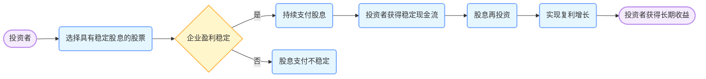

# 格雷厄姆的股息投资理念：稳定现金流的重要性

> 关键词：格雷厄姆、股息投资理念、稳定现金流、价值投资、股票估值

> 摘要：本文深入探讨了格雷厄姆的股息投资理念中稳定现金流的重要性。从格雷厄姆价值投资理论的背景出发，详细阐述了股息投资理念的核心概念、相关算法原理以及数学模型。通过实际的项目实战案例，展示了如何运用该理念进行投资决策。同时，分析了股息投资理念在不同实际场景中的应用，推荐了相关的学习资源、开发工具和研究论文。最后，对该理念的未来发展趋势与挑战进行了总结，并解答了常见问题，为投资者理解和应用格雷厄姆的股息投资理念提供了全面而深入的指导。

## 1. 背景介绍 
### 1.1 目的和范围
本文旨在全面剖析格雷厄姆的股息投资理念，重点强调稳定现金流在这一理念中的关键地位。通过对相关理论、算法、数学模型的讲解，结合实际案例分析，帮助投资者深入理解该理念，并将其应用于投资实践中。同时，探讨该理念在不同市场环境下的适用性和局限性，为投资者提供更全面的投资视角。

### 1.2 预期读者
本文适合对价值投资感兴趣的投资者、金融从业者、财经专业学生以及希望深入了解格雷厄姆投资思想的人士阅读。无论是初涉投资领域的新手，还是有一定投资经验的专业人士，都能从本文中获取有价值的信息和启示。

### 1.3 文档结构概述
本文共分为十个部分。首先是背景介绍，阐述了文章的目的、预期读者和文档结构。接着介绍了核心概念与联系，包括格雷厄姆股息投资理念的基本原理和架构。然后详细讲解了核心算法原理和具体操作步骤，并用Python代码进行了说明。随后介绍了相关的数学模型和公式，并举例说明。项目实战部分通过实际案例展示了如何运用该理念进行投资决策。之后分析了实际应用场景，推荐了相关的工具和资源。最后对未来发展趋势与挑战进行了总结，解答了常见问题，并提供了扩展阅读和参考资料。

### 1.4 术语表
#### 1.4.1 核心术语定义
- **格雷厄姆的股息投资理念**：由投资大师本杰明·格雷厄姆提出的一种投资策略，强调通过投资具有稳定股息支付的股票来获取长期收益。
- **稳定现金流**：指企业在一定时期内持续产生的、可预测的现金流入，通常表现为稳定的股息支付。
- **股息率**：股息与股票价格的比率，是衡量股票投资收益的重要指标之一。
- **价值投资**：一种投资策略，强调通过分析股票的内在价值，寻找被低估的股票进行投资。

#### 1.4.2 相关概念解释
- **内在价值**：股票的真实价值，由企业的基本面因素决定，如盈利能力、资产状况、现金流等。
- **安全边际**：股票的市场价格与内在价值之间的差距，是价值投资的重要原则之一。
- **股息再投资**：将股息收入再次投资于股票，以实现复利增长。

#### 1.4.3 缩略词列表
- **PE**：市盈率，指股票价格与每股盈利的比率。
- **PB**：市净率，指股票价格与每股净资产的比率。

## 2. 核心概念与联系 

### 格雷厄姆股息投资理念的核心原理
格雷厄姆认为，股票投资的本质是分享企业的经营成果，而股息是企业向股东分配利润的重要方式。稳定的股息支付不仅反映了企业的盈利能力和财务健康状况，还为投资者提供了稳定的现金流。通过投资具有稳定股息支付的股票，投资者可以在获得股息收益的同时，享受股票价格上涨带来的资本增值。

### 架构示意图


该流程图展示了格雷厄姆股息投资理念的核心流程。投资者首先选择具有稳定股息的股票，然后关注企业的盈利状况。如果企业盈利稳定，将持续支付股息，投资者获得稳定现金流。投资者可以将股息进行再投资，实现复利增长，最终获得长期收益。

## 3. 核心算法原理 & 具体操作步骤 

### 股息率计算算法
股息率是衡量股票股息收益的重要指标，其计算公式为：

```python
def dividend_yield(dividend_per_share, stock_price):
    """
    计算股息率
    :param dividend_per_share: 每股股息
    :param stock_price: 股票价格
    :return: 股息率
    """
    return (dividend_per_share / stock_price) * 100

# 示例
dividend = 2.0  # 每股股息为2元
price = 50.0    # 股票价格为50元
yield_rate = dividend_yield(dividend, price)
print(f"股息率为: {yield_rate}%")
```

### 具体操作步骤
1. **筛选具有稳定股息历史的股票**：通过查阅公司的财务报表和历史股息记录，筛选出连续多年支付股息且股息增长率稳定的股票。
2. **计算股息率**：根据上述公式计算股票的股息率，选择股息率较高的股票。
3. **评估企业的盈利能力和财务健康状况**：分析企业的财务报表，关注营业收入、净利润、资产负债率等指标，确保企业有足够的盈利能力和财务实力来持续支付股息。
4. **确定安全边际**：通过对企业内在价值的评估，确定股票的安全边际。当股票价格低于内在价值时，具有较高的投资价值。
5. **构建投资组合**：根据上述筛选和评估结果，选择多只具有稳定股息的股票构建投资组合，以分散风险。

## 4. 数学模型和公式 & 详细讲解 & 举例说明 

### 股息贴现模型（DDM）
股息贴现模型是一种基于股息的股票估值模型，其基本原理是将股票的未来股息现金流贴现到当前时刻，以确定股票的内在价值。该模型的公式为：

$$V = \frac{D_1}{(1 + r)^1} + \frac{D_2}{(1 + r)^2} + \cdots + \frac{D_n}{(1 + r)^n}$$

其中，$V$ 表示股票的内在价值，$D_i$ 表示第 $i$ 期的股息，$r$ 表示贴现率。

### 详细讲解
股息贴现模型的核心思想是，股票的价值取决于其未来股息的现值。贴现率 $r$ 反映了投资者对股票投资的预期收益率，通常可以用无风险利率加上风险溢价来表示。

### 举例说明
假设某股票预计未来三年的股息分别为 $D_1 = 1$ 元、$D_2 = 1.1$ 元、$D_3 = 1.2$ 元，投资者要求的贴现率为 $r = 10\%$。则该股票的内在价值为：

$$V = \frac{1}{(1 + 0.1)^1} + \frac{1.1}{(1 + 0.1)^2} + \frac{1.2}{(1 + 0.1)^3}$$

```python
import math

d1 = 1
d2 = 1.1
d3 = 1.2
r = 0.1

v = d1 / math.pow(1 + r, 1) + d2 / math.pow(1 + r, 2) + d3 / math.pow(1 + r, 3)
print(f"股票的内在价值为: {v} 元")
```

## 5. 项目实战：代码实际案例和详细解释说明 

### 5.1  开发环境搭建
- **Python 环境**：建议使用 Python 3.7 及以上版本。
- **第三方库**：需要安装 `pandas`、`numpy`、`yfinance` 等库，用于数据获取和处理。可以使用以下命令进行安装：
```sh
pip install pandas numpy yfinance
```

### 5.2  源代码详细实现和代码解读
```python
import yfinance as yf
import pandas as pd

# 定义股票列表
stock_list = ['AAPL', 'MSFT', 'JNJ', 'PG']

# 获取股票数据
data = yf.download(stock_list, start='2010-01-01', end='2023-12-31')

# 提取股息数据
dividends = data['Dividends']

# 计算每年的股息总额
annual_dividends = dividends.groupby(dividends.index.year).sum()

# 计算股息率
stock_prices = data['Close'].iloc[-1]  # 取最后一天的收盘价
dividend_yields = (annual_dividends.iloc[-1] / stock_prices) * 100

# 输出结果
print("各股票的股息率:")
print(dividend_yields)
```

### 代码解读与分析
1. **导入必要的库**：`yfinance` 用于获取股票数据，`pandas` 用于数据处理。
2. **定义股票列表**：选择要分析的股票，这里选择了苹果（AAPL）、微软（MSFT）、强生（JNJ）和宝洁（PG）。
3. **获取股票数据**：使用 `yfinance` 的 `download` 函数获取指定时间段内的股票数据，包括股息和收盘价。
4. **提取股息数据**：从获取的数据中提取股息数据。
5. **计算每年的股息总额**：使用 `groupby` 方法按年份对股息数据进行分组，并计算每年的股息总额。
6. **计算股息率**：取最后一天的收盘价，用最后一年的股息总额除以收盘价，得到股息率。
7. **输出结果**：打印各股票的股息率。

## 6. 实际应用场景 
### 长期投资
对于长期投资者来说，格雷厄姆的股息投资理念非常适用。通过投资具有稳定股息支付的股票，投资者可以获得稳定的现金流，同时享受股票价格上涨带来的资本增值。在长期投资过程中，股息再投资可以实现复利增长，显著提高投资收益。

### 养老投资
养老投资的目标是在保证资金安全的前提下，实现资产的稳定增值。格雷厄姆的股息投资理念强调投资具有稳定现金流的股票，符合养老投资的需求。投资者可以选择一些业绩稳定、股息率较高的蓝筹股进行投资，为养老生活提供稳定的收入来源。

### 资产配置
在资产配置中，股息投资可以作为一种重要的投资策略。通过将一部分资金投资于具有稳定股息的股票，可以降低投资组合的风险，提高投资组合的稳定性。同时，股息收入可以为投资者提供一定的现金流，满足日常开支需求。

## 7. 工具和资源推荐
### 7.1 学习资源推荐
#### 7.1.1 书籍推荐
- 《聪明的投资者》（The Intelligent Investor）：本杰明·格雷厄姆的经典著作，详细阐述了价值投资的理念和方法，包括股息投资策略。
- 《证券分析》（Security Analysis）：同样是格雷厄姆的代表作，对股票和债券的分析方法进行了深入探讨。
- 《股息投资策略》（Dividend Investing Strategies）：专门介绍股息投资的书籍，提供了丰富的案例和实用的投资技巧。

#### 7.1.2 在线课程
- Coursera 上的“投资学原理”课程：涵盖了价值投资、股息投资等多种投资策略的讲解。
- edX 上的“金融市场”课程：对金融市场的基本原理和投资方法进行了系统介绍。

#### 7.1.3 技术博客和网站
- Seeking Alpha：提供专业的金融分析和投资建议，包括股息投资相关的文章和研究报告。
- Dividend.com：专注于股息投资的网站，提供股息数据、分析工具和投资策略。

### 7.2 开发工具框架推荐
#### 7.2.1 IDE和编辑器
- PyCharm：功能强大的 Python 集成开发环境，适合进行数据分析和投资策略开发。
- Jupyter Notebook：交互式的开发环境，方便进行数据探索和可视化。

#### 7.2.2 调试和性能分析工具
- Py-Spy：用于分析 Python 代码的性能瓶颈。
- PDB：Python 内置的调试器，可帮助开发者定位和解决代码中的问题。

#### 7.2.3 相关框架和库
- Pandas：用于数据处理和分析的 Python 库，提供了丰富的数据结构和操作方法。
- Numpy：高性能的数值计算库，可用于数学模型的实现。
- Scikit-learn：机器学习库，可用于股票预测和投资策略优化。

### 7.3 相关论文著作推荐
#### 7.3.1 经典论文
- Graham, Benjamin, and David Dodd. "Security Analysis." McGraw-Hill, 1934. 格雷厄姆和多德的经典著作，奠定了价值投资的理论基础。
- Fama, Eugene F., and Kenneth R. French. "The Cross-Section of Expected Stock Returns." Journal of Finance 47, no. 2 (1992): 427-465. 提出了著名的 Fama-French 三因子模型，对股票收益的影响因素进行了深入分析。

#### 7.3.2 最新研究成果
- 近年来，关于股息投资的研究主要集中在股息率与股票收益的关系、股息政策的影响因素等方面。可以通过学术数据库如 Google Scholar、IEEE Xplore 等搜索相关的最新研究论文。

#### 7.3.3 应用案例分析
- 许多金融机构和投资公司会发布关于股息投资的应用案例分析报告。可以关注这些报告，了解股息投资策略在实际应用中的效果和经验教训。

## 8. 总结：未来发展趋势与挑战
### 未来发展趋势
- **数字化和智能化**：随着科技的发展，股息投资将越来越多地借助数字化和智能化工具。投资者可以利用大数据、人工智能等技术进行股票筛选、风险评估和投资决策，提高投资效率和准确性。
- **全球化**：全球金融市场的一体化趋势将使得股息投资的范围更加广泛。投资者可以通过投资海外股票，获取更多的投资机会和收益。
- **社会责任投资**：越来越多的投资者开始关注企业的社会责任表现，将股息投资与社会责任投资相结合。具有良好社会责任记录的企业往往更具有长期投资价值，也更容易获得投资者的青睐。

### 挑战
- **市场波动**：股票市场的波动是股息投资面临的主要挑战之一。市场的不确定性可能导致股票价格大幅下跌，影响投资者的资本增值和股息收益。
- **企业经营风险**：企业的经营状况可能会发生变化，导致股息支付不稳定或减少。投资者需要密切关注企业的基本面变化，及时调整投资组合。
- **利率变动**：利率的变动会影响股息投资的吸引力。当利率上升时，债券等固定收益产品的收益率增加，可能会导致投资者减少对股票的投资，从而影响股票价格和股息率。

## 9. 附录：常见问题与解答
### 问题1：股息率越高的股票是否越值得投资？
答：股息率是衡量股票股息收益的重要指标之一，但不能单纯以股息率高低来判断股票是否值得投资。高股息率可能是由于股票价格下跌导致的，也可能是企业面临经营困境，通过高股息来吸引投资者。投资者还需要综合考虑企业的盈利能力、财务健康状况、行业前景等因素。

### 问题2：股息再投资有什么好处？
答：股息再投资可以实现复利增长，显著提高投资收益。通过将股息收入再次投资于股票，投资者可以购买更多的股票，从而在未来获得更多的股息收入和资本增值。长期来看，复利的效果非常显著。

### 问题3：如何选择具有稳定股息的股票？
答：可以从以下几个方面选择具有稳定股息的股票：
1. **查看历史股息记录**：选择连续多年支付股息且股息增长率稳定的股票。
2. **评估企业的盈利能力**：关注企业的营业收入、净利润等指标，确保企业有足够的盈利能力来持续支付股息。
3. **分析财务健康状况**：查看企业的资产负债率、现金流等指标，确保企业的财务状况良好。
4. **考虑行业前景**：选择处于稳定发展行业的股票，避免投资于周期性较强或面临重大挑战的行业。

## 10. 扩展阅读 & 参考资料
- 格雷厄姆, 多德. 《证券分析》. 中国人民大学出版社.
- 格雷厄姆. 《聪明的投资者》. 人民邮电出版社.
- Fama, Eugene F., and Kenneth R. French. "The Cross-Section of Expected Stock Returns." Journal of Finance 47, no. 2 (1992): 427-465.
- Seeking Alpha. [https://seekingalpha.com/](https://seekingalpha.com/)
- Dividend.com. [https://dividend.com/](https://dividend.com/)

作者：AI天才研究院/AI Genius Institute & 禅与计算机程序设计艺术 /Zen And The Art of Computer Programming