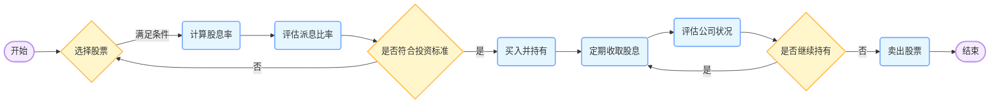

# 格雷厄姆的股息投资策略：稳定收益的来源

> 关键词：格雷厄姆、股息投资策略、稳定收益、价值投资、股票分析

> 摘要：本文深入探讨了格雷厄姆的股息投资策略，旨在揭示其作为稳定收益来源的原理和应用方法。从背景介绍入手，阐述了该策略的目的、适用读者以及文档结构。详细讲解了核心概念，包括股息、股息率等，并给出了相关的架构示意图和流程图。通过Python代码对核心算法原理进行了阐述，同时运用数学模型和公式深入分析。结合项目实战，提供了代码实际案例及详细解释。介绍了该策略在不同场景下的实际应用，推荐了相关的学习资源、开发工具和论文著作。最后总结了未来发展趋势与挑战，并对常见问题进行了解答，为投资者理解和运用格雷厄姆的股息投资策略提供了全面且深入的指导。

## 1. 背景介绍 
### 1.1 目的和范围
格雷厄姆作为价值投资的先驱，其股息投资策略旨在为投资者提供一种获取稳定收益的方法。本文章的目的在于深入剖析这一策略，揭示其背后的原理和逻辑，帮助投资者理解如何运用该策略在股票市场中实现稳定的股息收入。范围涵盖了股息投资策略的核心概念、算法原理、数学模型、实际应用以及相关的工具和资源等方面。

### 1.2 预期读者
本文预期读者主要包括对价值投资感兴趣的个人投资者、金融从业者以及相关领域的研究人员。无论是初学者希望了解股息投资的基础知识，还是有一定经验的投资者想要深入研究格雷厄姆的策略，都能从本文中获得有价值的信息。

### 1.3 文档结构概述
本文将按照以下结构进行阐述：首先介绍核心概念与联系，明确股息投资相关的基本概念及其相互关系；接着讲解核心算法原理和具体操作步骤，通过Python代码进行详细说明；然后给出数学模型和公式，并结合实际例子进行讲解；再通过项目实战展示代码的实际应用和详细解读；之后介绍该策略的实际应用场景；推荐相关的工具和资源；最后总结未来发展趋势与挑战，解答常见问题，并提供扩展阅读和参考资料。

### 1.4 术语表
#### 1.4.1 核心术语定义
- **股息（Dividend）**：是指股份公司从提取了公积金、公益金的税后利润中按照股息率派发给股东的收益。简单来说，就是公司赚了钱后分给股东的一部分。
- **股息率（Dividend Yield）**：是股息与股票价格之间的比率，通常以百分比表示。它反映了投资者以当前股价买入股票后，每年通过股息获得的收益比例。计算公式为：$股息率 = \frac{年度股息}{股票当前价格} \times 100\%$。
- **派息比率（Payout Ratio）**：是指公司派发的股息占净利润的比例，反映了公司将利润分配给股东的程度。计算公式为：$派息比率 = \frac{年度股息}{年度净利润} \times 100\%$。

#### 1.4.2 相关概念解释
- **价值投资（Value Investing）**：是一种投资策略，强调寻找被市场低估的股票，通过长期持有来获得价值回归带来的收益。格雷厄姆是价值投资的奠基人，股息投资策略是其价值投资理念的重要组成部分。
- **稳定收益（Stable Income）**：在股息投资中，稳定收益是指投资者通过持有具有稳定股息支付记录的股票，定期获得股息收入，这种收入相对较为稳定，不受股票价格短期波动的影响。

#### 1.4.3 缩略词列表
- **EPS（Earnings Per Share）**：每股收益，是指公司净利润除以发行在外的普通股股数，反映了每股股票的盈利水平。

## 2. 核心概念与联系 
### 核心概念原理
#### 股息
股息是公司向股东分配利润的一种方式。公司在盈利后，会根据董事会的决定，将一部分利润以现金或股票的形式派发给股东。股息的发放通常有固定的周期，如季度、半年或年度。股息的大小取决于公司的盈利状况、财务政策以及发展战略等因素。

#### 股息率
股息率是衡量股票股息收益的重要指标。较高的股息率意味着投资者以当前股价买入股票后，能获得相对较高的股息回报。然而，股息率并不是越高越好，过高的股息率可能意味着公司面临经营困境，为了吸引投资者而提高股息发放，或者公司的股价被过度低估。

#### 派息比率
派息比率反映了公司对股东的利润分配意愿。较高的派息比率表明公司更倾向于将利润分配给股东，而较低的派息比率则可能意味着公司将更多的利润用于再投资，以支持未来的发展。投资者需要综合考虑公司的发展阶段和财务状况来评估派息比率的合理性。

### 架构的文本示意图
```plaintext
股息投资策略
|-- 核心概念
|   |-- 股息
|   |-- 股息率
|   |-- 派息比率
|-- 影响因素
|   |-- 公司盈利状况
|   |-- 财务政策
|   |-- 行业竞争
|-- 投资目标
|   |-- 稳定收益
|   |-- 长期资本增值
```

### Mermaid 流程图


## 3. 核心算法原理 & 具体操作步骤 
### 核心算法原理
格雷厄姆的股息投资策略核心在于筛选出具有稳定股息支付能力和合理股息率的股票。主要步骤包括计算股息率和评估派息比率，通过设定一定的标准来筛选符合投资要求的股票。

### 具体操作步骤
#### 步骤1：数据收集
收集股票的相关数据，包括年度股息、股票当前价格、年度净利润等。这些数据可以从金融网站、证券交易所或公司的财务报表中获取。

#### 步骤2：计算股息率
根据股息率的计算公式 $股息率 = \frac{年度股息}{股票当前价格} \times 100\%$，使用Python代码实现如下：
```python
def calculate_dividend_yield(annual_dividend, stock_price):
    """
    计算股息率
    :param annual_dividend: 年度股息
    :param stock_price: 股票当前价格
    :return: 股息率
    """
    return (annual_dividend / stock_price) * 100

# 示例数据
annual_dividend = 2.0
stock_price = 50.0
dividend_yield = calculate_dividend_yield(annual_dividend, stock_price)
print(f"股息率: {dividend_yield:.2f}%")
```

#### 步骤3：评估派息比率
根据派息比率的计算公式 $派息比率 = \frac{年度股息}{年度净利润} \times 100\%$，使用Python代码实现如下：
```python
def calculate_payout_ratio(annual_dividend, annual_net_income):
    """
    计算派息比率
    :param annual_dividend: 年度股息
    :param annual_net_income: 年度净利润
    :return: 派息比率
    """
    return (annual_dividend / annual_net_income) * 100

# 示例数据
annual_dividend = 2.0
annual_net_income = 5.0
payout_ratio = calculate_payout_ratio(annual_dividend, annual_net_income)
print(f"派息比率: {payout_ratio:.2f}%")
```

#### 步骤4：筛选股票
根据设定的股息率和派息比率标准，筛选出符合要求的股票。例如，设定股息率不低于 3%，派息比率在 30% - 70% 之间，Python代码实现如下：
```python
# 示例股票数据列表，每个元素为 (股票代码, 年度股息, 股票当前价格, 年度净利润)
stocks = [
    ('AAPL', 2.0, 50.0, 5.0),
    ('GOOG', 1.0, 80.0, 6.0),
    ('MSFT', 1.5, 60.0, 4.0)
]

# 设定筛选标准
min_dividend_yield = 3.0
min_payout_ratio = 30.0
max_payout_ratio = 70.0

selected_stocks = []
for stock in stocks:
    symbol, annual_dividend, stock_price, annual_net_income = stock
    dividend_yield = calculate_dividend_yield(annual_dividend, stock_price)
    payout_ratio = calculate_payout_ratio(annual_dividend, annual_net_income)
    if dividend_yield >= min_dividend_yield and min_payout_ratio <= payout_ratio <= max_payout_ratio:
        selected_stocks.append(symbol)

print("筛选出的股票: ", selected_stocks)
```

## 4. 数学模型和公式 & 详细讲解 & 举例说明 
### 股息率公式
$股息率 = \frac{年度股息}{股票当前价格} \times 100\%$

#### 详细讲解
股息率反映了投资者以当前股价买入股票后，每年通过股息获得的收益比例。它是衡量股票股息收益的重要指标，对于追求稳定收益的投资者来说具有重要意义。

#### 举例说明
假设某股票的年度股息为 2 元，当前股价为 50 元，则该股票的股息率为：
$股息率 = \frac{2}{50} \times 100\% = 4\%$
这意味着投资者以 50 元的价格买入该股票，每年能获得 4% 的股息收益。

### 派息比率公式
$派息比率 = \frac{年度股息}{年度净利润} \times 100\%$

#### 详细讲解
派息比率反映了公司将利润分配给股东的程度。较高的派息比率表明公司更倾向于将利润分配给股东，而较低的派息比率则可能意味着公司将更多的利润用于再投资，以支持未来的发展。

#### 举例说明
假设某公司的年度股息为 2 亿元，年度净利润为 5 亿元，则该公司的派息比率为：
$派息比率 = \frac{2}{5} \times 100\% = 40\%$
这意味着该公司将 40% 的净利润用于派发股息，剩余 60% 的利润用于再投资或其他用途。

### 股息增长模型（Gordon Growth Model）
$P = \frac{D_1}{r - g}$

其中：
- $P$ 为股票的内在价值
- $D_1$ 为下一期预计股息
- $r$ 为投资者要求的回报率
- $g$ 为股息的固定增长率

#### 详细讲解
股息增长模型假设股息以固定的增长率 $g$ 持续增长。该模型通过预测未来股息的现金流，并将其折现到当前，来计算股票的内在价值。当股票的市场价格低于其内在价值时，说明股票被低估，具有投资价值。

#### 举例说明
假设某股票下一期预计股息 $D_1$ 为 2 元，投资者要求的回报率 $r$ 为 10%，股息的固定增长率 $g$ 为 5%，则该股票的内在价值为：
$P = \frac{2}{0.1 - 0.05} = \frac{2}{0.05} = 40$（元）
如果该股票的市场价格低于 40 元，则可以认为该股票被低估，具有投资价值。

## 5. 项目实战：代码实际案例和详细解释说明 
### 5.1  开发环境搭建
#### 安装 Python
首先需要安装 Python 环境，建议使用 Python 3.7 及以上版本。可以从 Python 官方网站（https://www.python.org/downloads/）下载并安装。

#### 安装必要的库
在本项目中，需要使用 `pandas` 库来处理数据，`yfinance` 库来获取股票数据。可以使用以下命令进行安装：
```sh
pip install pandas yfinance
```

### 5.2  源代码详细实现和代码解读
```python
import yfinance as yf
import pandas as pd

# 定义要分析的股票列表
tickers = ['AAPL', 'GOOG', 'MSFT', 'JPM', 'PG']

# 定义筛选标准
min_dividend_yield = 2.0
min_payout_ratio = 20.0
max_payout_ratio = 60.0

# 创建一个空列表来存储筛选结果
selected_stocks = []

# 遍历每个股票
for ticker in tickers:
    try:
        # 使用 yfinance 获取股票数据
        stock = yf.Ticker(ticker)
        
        # 获取年度股息
        dividends = stock.dividends
        if not dividends.empty:
            annual_dividend = dividends[-1] * 4  # 假设按季度分红
        
            # 获取股票当前价格
            info = stock.info
            stock_price = info['currentPrice']
            
            # 计算股息率
            dividend_yield = (annual_dividend / stock_price) * 100
            
            # 获取年度净利润
            financials = stock.financials
            if 'Net Income' in financials.index:
                annual_net_income = financials.loc['Net Income'][0]
                
                # 计算派息比率
                payout_ratio = (annual_dividend / annual_net_income) * 100
                
                # 检查是否符合筛选标准
                if dividend_yield >= min_dividend_yield and min_payout_ratio <= payout_ratio <= max_payout_ratio:
                    selected_stocks.append((ticker, dividend_yield, payout_ratio))
    
    except Exception as e:
        print(f"处理 {ticker} 时出现错误: {e}")

# 将筛选结果转换为 DataFrame
result_df = pd.DataFrame(selected_stocks, columns=['股票代码', '股息率', '派息比率'])

# 打印筛选结果
print(result_df)
```

### 5.3  代码解读与分析
#### 代码功能概述
这段代码的主要功能是使用格雷厄姆的股息投资策略，对指定的股票列表进行筛选，找出符合股息率和派息比率要求的股票。

#### 代码详细解读
1. **导入必要的库**：导入 `yfinance` 库用于获取股票数据，`pandas` 库用于数据处理。
2. **定义要分析的股票列表和筛选标准**：定义了要分析的股票列表 `tickers`，以及股息率和派息比率的筛选标准。
3. **遍历每个股票**：使用 `for` 循环遍历每个股票，通过 `yfinance` 库获取股票的相关数据。
4. **计算股息率和派息比率**：根据获取的年度股息、股票当前价格和年度净利润，计算股息率和派息比率。
5. **筛选符合标准的股票**：检查计算得到的股息率和派息比率是否符合筛选标准，如果符合则将该股票添加到 `selected_stocks` 列表中。
6. **处理异常**：使用 `try-except` 语句捕获并处理可能出现的异常，确保程序的稳定性。
7. **输出筛选结果**：将筛选结果转换为 `pandas` 的 `DataFrame` 并打印输出。

## 6. 实际应用场景 
### 退休养老规划
对于即将退休或已经退休的投资者来说，稳定的现金流是非常重要的。格雷厄姆的股息投资策略可以帮助他们选择具有稳定股息支付记录的股票，通过定期收取股息来满足日常生活开支。这些股息收入相对稳定，不受股票价格短期波动的影响，为退休生活提供了可靠的经济保障。

### 长期投资组合构建
在构建长期投资组合时，股息投资策略可以作为一种重要的组成部分。将一部分资金投资于股息稳定的股票，可以降低整个投资组合的风险，同时提供稳定的收益。与其他投资策略（如成长型投资）相结合，可以实现投资组合的多元化，提高投资组合的整体表现。

### 机构投资者资产配置
机构投资者（如养老基金、保险公司等）通常需要进行大规模的资产配置，以实现资产的保值增值和风险控制。格雷厄姆的股息投资策略可以为机构投资者提供一种稳健的投资选择，通过投资于股息稳定的蓝筹股，获取稳定的股息收入，并在一定程度上抵御市场波动的影响。

## 7. 工具和资源推荐
### 7.1 学习资源推荐
#### 7.1.1 书籍推荐
- 《聪明的投资者》（The Intelligent Investor）：格雷厄姆的经典著作，详细阐述了价值投资的理念和方法，其中包括股息投资策略的相关内容。
- 《证券分析》（Security Analysis）：同样是格雷厄姆的重要著作，对股票和债券的分析方法进行了深入探讨，为投资者提供了全面的投资分析框架。
- 《股息投资策略》（Dividend Investing Strategies）：专门介绍股息投资的书籍，涵盖了股息投资的原理、策略和实践案例等方面的内容。

#### 7.1.2 在线课程
- Coursera 上的“投资学原理”（Principles of Investing）：该课程由知名大学的教授授课，系统地介绍了投资学的基本原理和方法，包括股息投资策略的相关知识。
- Udemy 上的“股息投资实战”（Dividend Investing in Practice）：通过实际案例和操作演示，帮助学习者掌握股息投资的技巧和方法。

#### 7.1.3 技术博客和网站
- Seeking Alpha（https://seekingalpha.com/）：提供大量的金融分析文章和投资建议，其中包括对股息股票的分析和推荐。
- Dividend.com（https://www.dividend.com/）：专注于股息投资的网站，提供股息股票的筛选工具、股息历史数据和相关的分析报告。

### 7.2 开发工具框架推荐
#### 7.2.1 IDE和编辑器
- PyCharm：功能强大的 Python 集成开发环境，提供代码编辑、调试、版本控制等功能，适合开发和调试股息投资相关的 Python 代码。
- Jupyter Notebook：交互式的开发环境，适合进行数据分析和可视化，方便对股票数据进行探索和分析。

#### 7.2.2 调试和性能分析工具
- PDB（Python Debugger）：Python 自带的调试工具，可以帮助开发者定位和解决代码中的问题。
- cProfile：Python 的性能分析工具，可以分析代码的执行时间和资源消耗情况，帮助开发者优化代码性能。

#### 7.2.3 相关框架和库
- yfinance：用于获取股票数据的 Python 库，支持从雅虎财经获取股票的历史数据、财务数据等。
- pandas：强大的数据处理和分析库，提供了丰富的数据结构和函数，方便对股票数据进行清洗、转换和分析。

### 7.3 相关论文著作推荐
#### 7.3.1 经典论文
- “The Dividend Puzzle”（《股息之谜》）：探讨了股息政策的相关问题，对理解股息的发放机制和影响因素具有重要意义。
- “Dividend Policy, Growth, and the Valuation of Shares”（《股息政策、增长与股票估值》）：研究了股息政策与股票估值之间的关系，为股息投资策略提供了理论支持。

#### 7.3.2 最新研究成果
- 关注金融领域的顶级学术期刊，如《Journal of Finance》、《Review of Financial Studies》等，这些期刊会发表关于股息投资和价值投资的最新研究成果。

#### 7.3.3 应用案例分析
- 一些金融研究机构和咨询公司会发布关于股息投资的应用案例分析报告，这些报告可以帮助投资者了解股息投资策略在实际应用中的效果和经验教训。

## 8. 总结：未来发展趋势与挑战
### 未来发展趋势
#### 科技股股息发放增加
随着科技行业的成熟和盈利能力的提升，越来越多的科技公司开始重视股息发放。未来，科技股可能会成为股息投资的重要组成部分，为投资者提供更多的选择。

#### 可持续股息投资兴起
投资者对环境、社会和治理（ESG）因素的关注度不断提高，未来可持续股息投资可能会成为一种趋势。投资者会更加倾向于投资那些具有良好 ESG 表现的公司，这些公司通常具有更稳定的经营和更好的长期发展前景。

#### 智能投顾与股息投资结合
智能投顾技术的发展将为股息投资带来新的机遇。智能投顾可以根据投资者的风险偏好和投资目标，自动筛选和推荐符合要求的股息股票，提高投资效率和准确性。

### 挑战
#### 经济不确定性
宏观经济环境的不确定性会对公司的盈利和股息发放产生影响。经济衰退、利率波动等因素可能导致公司盈利下降，从而减少股息发放，给股息投资带来风险。

#### 行业竞争加剧
某些行业的竞争加剧可能会影响公司的市场份额和盈利能力，进而影响股息的稳定性。投资者需要更加深入地研究行业和公司的基本面，以识别具有可持续股息支付能力的公司。

#### 数据质量和可靠性
股息投资策略依赖于准确的股票数据，如股息、净利润等。然而，数据的质量和可靠性可能存在问题，如数据错误、延迟等，这可能会影响投资者的决策。

## 9. 附录：常见问题与解答
### 问题1：股息率越高的股票越好吗？
答：不一定。虽然较高的股息率意味着投资者能获得更高的股息回报，但过高的股息率可能意味着公司面临经营困境，为了吸引投资者而提高股息发放，或者公司的股价被过度低估。投资者需要综合考虑公司的盈利状况、财务政策和发展前景等因素来评估股息率的合理性。

### 问题2：派息比率过高或过低有什么影响？
答：派息比率过高可能意味着公司将大部分利润用于派发股息，而没有足够的资金用于再投资，这可能会影响公司的未来发展。派息比率过低则可能表明公司对股东的回报不足，或者公司将过多的利润用于再投资，但投资效果不一定理想。投资者需要根据公司的发展阶段和行业特点来评估派息比率的合理性。

### 问题3：如何判断公司的股息是否稳定？
答：可以从以下几个方面来判断公司的股息是否稳定：一是查看公司的股息历史记录，了解其过去是否有稳定的股息发放；二是分析公司的盈利状况和现金流，稳定的盈利和充足的现金流是股息稳定的基础；三是关注公司的财务政策和发展战略，了解公司对股息发放的态度和规划。

### 问题4：股息投资适合短期投资吗？
答：股息投资更适合长期投资。股息投资的核心在于通过长期持有具有稳定股息支付能力的股票，获得稳定的股息收入和资本增值。短期投资可能会受到股票价格波动的影响，难以充分体现股息投资的优势。

## 10. 扩展阅读 & 参考资料
### 扩展阅读
- 《巴菲特之道》（The Warren Buffett Way）：介绍了巴菲特的投资理念和方法，其中很多内容与格雷厄姆的价值投资理念相关，可以帮助读者进一步深入理解股息投资策略。
- 《漫步华尔街》（A Random Walk Down Wall Street）：探讨了股票市场的有效性和投资策略，对股息投资和其他投资策略进行了比较和分析。

### 参考资料
- Graham, Benjamin. The Intelligent Investor. HarperBusiness, 2003.
- Graham, Benjamin, and David Dodd. Security Analysis. McGraw-Hill, 1934.
- Damodaran, Aswath. Investment Valuation: Tools and Techniques for Determining the Value of Any Asset. Wiley, 2012.

作者：AI天才研究院/AI Genius Institute & 禅与计算机程序设计艺术 /Zen And The Art of Computer Programming