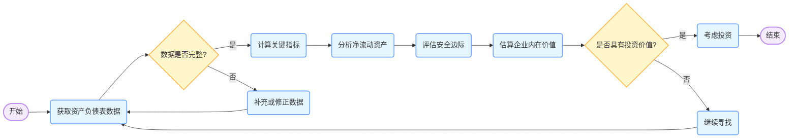

# 格雷厄姆的资产负债表分析技巧

> 关键词：格雷厄姆、资产负债表、分析技巧、价值投资、财务分析、企业估值、投资决策

> 摘要：本文围绕格雷厄姆的资产负债表分析技巧展开，深入探讨其核心概念、算法原理、数学模型等内容。详细介绍了资产负债表分析在价值投资中的重要性，以及格雷厄姆所采用的具体分析方法和策略。通过项目实战案例，展示如何运用这些技巧进行实际的财务分析和投资决策。同时，列举了相关的工具和资源，帮助读者进一步学习和实践。最后总结了未来发展趋势与挑战，旨在为投资者和财务分析人员提供全面、深入的资产负债表分析知识和实用技巧。

## 1. 背景介绍 
### 1.1 目的和范围
本文的目的在于深入介绍格雷厄姆的资产负债表分析技巧，为投资者和财务分析人员提供系统的知识和实用的方法。我们将探讨格雷厄姆的投资理念如何应用于资产负债表分析，以及这些技巧在现代投资决策中的价值和局限性。范围涵盖了资产负债表的基本概念、格雷厄姆的核心分析方法、相关的数学模型和公式，以及实际应用案例和未来发展趋势。

### 1.2 预期读者
本文预期读者包括对价值投资感兴趣的投资者、财务分析人员、金融专业学生以及任何希望深入了解企业财务状况和投资决策的人士。无论您是初学者还是有一定经验的专业人士，都能从本文中获得有价值的信息和启示。

### 1.3 文档结构概述
本文将按照以下结构进行阐述：首先介绍核心概念与联系，包括资产负债表的基本原理和格雷厄姆分析方法的架构；接着详细讲解核心算法原理和具体操作步骤，并通过 Python 源代码进行说明；然后介绍相关的数学模型和公式，并举例说明其应用；再通过项目实战案例展示如何运用这些技巧进行实际的财务分析；之后探讨实际应用场景；接着推荐相关的工具和资源；最后总结未来发展趋势与挑战，并提供常见问题与解答和扩展阅读参考资料。

### 1.4 术语表
#### 1.4.1 核心术语定义
- **资产负债表**：反映企业在某一特定日期财务状况的会计报表，它展示了企业的资产、负债和所有者权益的状况。
- **价值投资**：由格雷厄姆创立的一种投资理念，强调通过分析企业的内在价值来选择投资标的，而不是仅仅关注市场价格波动。
- **净流动资产**：指企业的流动资产减去流动负债后的余额，反映了企业短期内可用于偿债和运营的资金。
- **安全边际**：格雷厄姆提出的概念，指股票的市场价格低于其内在价值的差额，为投资提供了一定的保护。

#### 1.4.2 相关概念解释
- **流动资产**：指企业在一年内或一个营业周期内能够变现或耗用的资产，包括现金、应收账款、存货等。
- **流动负债**：指企业在一年内或一个营业周期内需要偿还的债务，包括短期借款、应付账款等。
- **固定资产**：指企业为生产商品、提供劳务、出租或经营管理而持有的，使用寿命超过一个会计年度的有形资产，如房屋、机器设备等。
- **长期负债**：指企业偿还期限在一年以上或超过一个营业周期的债务，如长期借款、应付债券等。

#### 1.4.3 缩略词列表
- **GAAP**：Generally Accepted Accounting Principles，公认会计原则。
- **EPS**：Earnings Per Share，每股收益。
- **P/E**：Price-to-Earnings Ratio，市盈率。

## 2. 核心概念与联系 

### 2.1 资产负债表的基本原理
资产负债表基于会计恒等式：$资产 = 负债 + 所有者权益$。这个等式反映了企业的资金来源和资金运用的平衡关系。资产代表了企业拥有或控制的经济资源，负债是企业对外所欠的债务，所有者权益则是企业所有者对企业净资产的所有权。

资产负债表通常分为资产和负债及所有者权益两大部分。资产部分按照流动性从高到低排列，包括流动资产和非流动资产。负债部分按照偿还期限的长短分为流动负债和长期负债。所有者权益部分包括实收资本、资本公积、盈余公积和未分配利润等。

### 2.2 格雷厄姆的资产负债表分析理念
格雷厄姆认为，资产负债表是评估企业内在价值的重要工具。他强调通过分析资产负债表中的各项数据，来判断企业的财务状况和偿债能力。格雷厄姆尤其关注企业的净流动资产，认为当股票价格低于企业的净流动资产时，该股票可能具有投资价值，因为即使企业破产清算，投资者也可能获得一定的回报。

### 2.3 核心概念的联系
资产负债表中的各项数据相互关联，共同反映了企业的财务状况。例如，流动资产和流动负债的关系反映了企业的短期偿债能力；固定资产和长期负债的关系反映了企业的长期财务稳定性。格雷厄姆的分析方法就是基于这些数据之间的关系，通过计算和比较相关指标，来评估企业的价值和投资风险。

### 2.4 文本示意图
资产负债表分析的核心概念联系可以用以下文本示意图表示：

资产负债表
|-- 资产
|   |-- 流动资产
|   |   |-- 现金
|   |   |-- 应收账款
|   |   |-- 存货
|   |-- 非流动资产
|       |-- 固定资产
|       |-- 无形资产
|-- 负债及所有者权益
|   |-- 负债
|   |   |-- 流动负债
|   |   |   |-- 短期借款
|   |   |   |-- 应付账款
|   |   |-- 长期负债
|   |       |-- 长期借款
|   |       |-- 应付债券
|   |-- 所有者权益
|       |-- 实收资本
|       |-- 资本公积
|       |-- 盈余公积
|       |-- 未分配利润

格雷厄姆分析方法
|-- 净流动资产分析
|-- 安全边际评估
|-- 企业内在价值估算

### 2.5 Mermaid 流程图


## 3. 核心算法原理 & 具体操作步骤 

### 3.1 净流动资产的计算
净流动资产（Net Current Assets，NCA）的计算公式为：

$NCA = 流动资产 - 流动负债$

净流动资产反映了企业短期内可用于偿债和运营的资金。当股票价格低于企业的净流动资产时，根据格雷厄姆的理论，该股票可能被低估。

### 3.2 安全边际的评估
安全边际（Margin of Safety，MOS）的计算公式为：

$MOS = \frac{内在价值 - 市场价格}{内在价值} \times 100\%$

其中，内在价值的估算方法有多种，格雷厄姆常用的方法是基于资产负债表和盈利情况进行估算。安全边际越高，投资的风险越低。

### 3.3 具体操作步骤
#### 步骤 1：获取资产负债表数据
从企业的财务报表中获取流动资产、流动负债等相关数据。可以通过企业的官方网站、证券交易所网站或专业的金融数据库获取这些数据。

#### 步骤 2：计算关键指标
根据获取的数据，计算净流动资产和安全边际等关键指标。

#### 步骤 3：分析净流动资产
比较股票价格和净流动资产的大小。如果股票价格低于净流动资产，进一步分析企业的财务状况和经营前景。

#### 步骤 4：评估安全边际
根据估算的内在价值和市场价格，计算安全边际。安全边际越高，投资的吸引力越大。

#### 步骤 5：做出投资决策
综合考虑净流动资产、安全边际等因素，以及企业的行业前景、竞争优势等，做出投资决策。

### 3.4 Python 源代码实现
```python
# 定义净流动资产计算函数
def calculate_nca(current_assets, current_liabilities):
    return current_assets - current_liabilities

# 定义安全边际计算函数
def calculate_mos(intrinsic_value, market_price):
    if intrinsic_value == 0:
        return 0
    return ((intrinsic_value - market_price) / intrinsic_value) * 100

# 示例数据
current_assets = 1000000
current_liabilities = 500000
market_price = 300000
intrinsic_value = 500000

# 计算净流动资产
nca = calculate_nca(current_assets, current_liabilities)
print(f"净流动资产: {nca}")

# 计算安全边际
mos = calculate_mos(intrinsic_value, market_price)
print(f"安全边际: {mos}%")
```

## 4. 数学模型和公式 & 详细讲解 & 举例说明 

### 4.1 净流动资产模型
净流动资产的数学模型为：

$NCA = \sum_{i=1}^{n} 流动资产_i - \sum_{j=1}^{m} 流动负债_j$

其中，$n$ 为流动资产的项目数，$m$ 为流动负债的项目数。

### 4.2 安全边际模型
安全边际的数学模型为：

$MOS = \frac{V - P}{V} \times 100\%$

其中，$V$ 为内在价值，$P$ 为市场价格。

### 4.3 内在价值估算模型
格雷厄姆提出了一个简单的内在价值估算公式：

$V = EPS \times (8.5 + 2g)$

其中，$EPS$ 为每股收益，$g$ 为预期增长率。

### 4.4 详细讲解
#### 净流动资产模型
净流动资产模型反映了企业短期内的财务实力。流动资产包括现金、应收账款、存货等，这些资产可以在短期内变现。流动负债包括短期借款、应付账款等，需要在短期内偿还。净流动资产为正，说明企业在短期内有足够的资金来偿还债务和维持运营。

#### 安全边际模型
安全边际模型为投资提供了一定的保护。当安全边际较高时，即使企业的实际价值低于预期，投资者也可能不会遭受太大的损失。安全边际的大小取决于内在价值和市场价格的差距。

#### 内在价值估算模型
内在价值估算模型是基于企业的盈利情况和预期增长率来估算企业的价值。每股收益反映了企业的盈利能力，预期增长率反映了企业的发展前景。通过这个公式，可以大致估算出企业的内在价值。

### 4.5 举例说明
假设某企业的流动资产为 2000 万元，流动负债为 1000 万元，每股收益为 2 元，预期增长率为 10%，市场价格为 20 元。

#### 计算净流动资产
$NCA = 2000 - 1000 = 1000$（万元）

#### 估算内在价值
$V = 2 \times (8.5 + 2 \times 10) = 2 \times 28.5 = 57$（元）

#### 计算安全边际
$MOS = \frac{57 - 20}{57} \times 100\% \approx 66.7\%$

从计算结果来看，该企业的净流动资产为正，安全边际较高，可能具有投资价值。

## 5. 项目实战：代码实际案例和详细解释说明 

### 5.1 开发环境搭建
#### 安装 Python
首先，需要安装 Python 环境。可以从 Python 官方网站（https://www.python.org/downloads/）下载适合自己操作系统的 Python 版本，并按照安装向导进行安装。

#### 安装必要的库
在项目中，我们需要使用 `pandas` 库来处理财务数据。可以使用以下命令安装：

```sh
pip install pandas
```

### 5.2 源代码详细实现和代码解读
```python
import pandas as pd

# 定义函数来读取资产负债表数据
def read_balance_sheet(file_path):
    df = pd.read_excel(file_path)
    return df

# 定义函数来计算净流动资产
def calculate_nca_from_df(df):
    current_assets = df[df['项目'] == '流动资产合计']['金额'].values[0]
    current_liabilities = df[df['项目'] == '流动负债合计']['金额'].values[0]
    return current_assets - current_liabilities

# 定义函数来估算内在价值
def estimate_intrinsic_value(eps, growth_rate):
    return eps * (8.5 + 2 * growth_rate)

# 定义函数来计算安全边际
def calculate_mos(intrinsic_value, market_price):
    if intrinsic_value == 0:
        return 0
    return ((intrinsic_value - market_price) / intrinsic_value) * 100

# 示例数据文件路径
file_path = 'balance_sheet.xlsx'

# 读取资产负债表数据
balance_sheet_df = read_balance_sheet(file_path)

# 计算净流动资产
nca = calculate_nca_from_df(balance_sheet_df)
print(f"净流动资产: {nca}")

# 示例每股收益和预期增长率
eps = 3
growth_rate = 0.1

# 估算内在价值
intrinsic_value = estimate_intrinsic_value(eps, growth_rate)
print(f"内在价值: {intrinsic_value}")

# 示例市场价格
market_price = 30

# 计算安全边际
mos = calculate_mos(intrinsic_value, market_price)
print(f"安全边际: {mos}%")
```

### 5.3 代码解读与分析
#### `read_balance_sheet` 函数
该函数用于读取资产负债表数据。它使用 `pandas` 库的 `read_excel` 函数来读取 Excel 文件，并返回一个 DataFrame 对象。

#### `calculate_nca_from_df` 函数
该函数从 DataFrame 中提取流动资产合计和流动负债合计的数据，并计算净流动资产。

#### `estimate_intrinsic_value` 函数
该函数根据每股收益和预期增长率估算企业的内在价值，使用了格雷厄姆的内在价值估算公式。

#### `calculate_mos` 函数
该函数根据内在价值和市场价格计算安全边际。

#### 主程序
主程序首先读取资产负债表数据，然后计算净流动资产、内在价值和安全边际，并输出结果。

## 6. 实际应用场景 
### 6.1 价值投资决策
投资者可以运用格雷厄姆的资产负债表分析技巧，筛选出被低估的股票。通过分析净流动资产和安全边际，判断股票的投资价值，从而做出合理的投资决策。

### 6.2 企业财务评估
企业管理者可以使用这些分析技巧，评估企业的财务状况和偿债能力。通过对资产负债表的深入分析，发现企业存在的问题，采取相应的措施进行改进。

### 6.3 并购重组分析
在企业并购重组过程中，投资者和管理者可以通过分析目标企业的资产负债表，了解其财务状况和潜在价值。这有助于评估并购重组的可行性和风险，制定合理的交易方案。

### 6.4 信贷风险评估
银行和其他金融机构在进行信贷业务时，可以运用资产负债表分析技巧，评估借款人的偿债能力和信用风险。通过对借款人资产负债表的分析，确定贷款额度和贷款利率，降低信贷风险。

## 7. 工具和资源推荐
### 7.1 学习资源推荐
#### 7.1.1 书籍推荐
- 《聪明的投资者》（The Intelligent Investor），本杰明·格雷厄姆著，这本书是价值投资的经典之作，详细介绍了格雷厄姆的投资理念和方法。
- 《证券分析》（Security Analysis），本杰明·格雷厄姆和戴维·多德著，是价值投资领域的权威著作，对资产负债表分析等内容进行了深入探讨。

#### 7.1.2 在线课程
- Coursera 上的“Financial Markets”课程，由耶鲁大学教授罗伯特·席勒（Robert Shiller）主讲，介绍了金融市场的基本原理和分析方法。
- edX 上的“Financial Accounting”课程，帮助学习者掌握财务会计的基本知识和技能，包括资产负债表的编制和分析。

#### 7.1.3 技术博客和网站
- Seeking Alpha（https://seekingalpha.com/）：提供了大量的金融分析文章和投资观点，包括对资产负债表分析的深入讨论。
- Investopedia（https://www.investopedia.com/）：是一个专业的金融知识学习网站，有丰富的关于资产负债表分析的教程和解释。

### 7.2 开发工具框架推荐
#### 7.2.1 IDE和编辑器
- PyCharm：是一款专门为 Python 开发设计的集成开发环境，具有强大的代码编辑、调试和