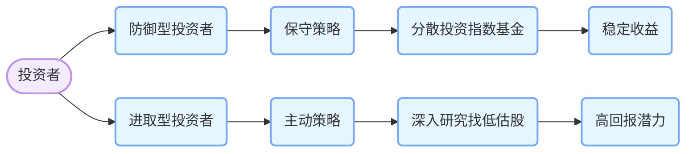

# 格雷厄姆的防御型与进取型投资者区分

> 关键词：格雷厄姆、防御型投资者、进取型投资者、投资策略、证券分析

> 摘要：本文深入探讨了格雷厄姆提出的防御型与进取型投资者的区分。首先介绍了相关背景，包括目的范围、预期读者等内容。接着阐述了防御型和进取型投资者的核心概念及其联系，并给出了相应的原理和架构示意图与流程图。详细讲解了涉及的核心算法原理和具体操作步骤，通过 Python 代码进行示例。同时给出了相关的数学模型和公式，并举例说明。在项目实战部分，提供了开发环境搭建、源代码实现及解读。还分析了两种投资者类型的实际应用场景，推荐了学习、开发等方面的工具和资源。最后总结了未来发展趋势与挑战，解答了常见问题并列出了参考资料，旨在帮助投资者清晰认识自身类型，选择合适的投资策略。

## 1. 背景介绍 
### 1.1 目的和范围
本文章的主要目的是深入剖析格雷厄姆所提出的防御型与进取型投资者的区分理论。通过对这两种投资者类型的详细解读，帮助投资者更好地认识自己的投资风格和风险承受能力，从而选择适合自己的投资策略。文章的范围涵盖了防御型与进取型投资者的核心概念、投资策略、相关算法原理、实际应用场景等方面，并提供了具体的代码示例和工具资源推荐。

### 1.2 预期读者
本文预期读者包括对投资领域感兴趣的初学者，希望通过了解格雷厄姆的投资理论来建立正确的投资观念；有一定投资经验但希望进一步优化投资策略的投资者，能够借助本文对防御型和进取型投资的分析，调整自己的投资组合；以及金融专业的学生和研究人员，可将本文作为研究格雷厄姆投资思想的参考资料。

### 1.3 文档结构概述
本文将按照以下结构进行阐述：首先介绍相关背景信息，包括目的、预期读者和文档结构等；接着讲解防御型与进取型投资者的核心概念及其联系，并用示意图和流程图进行说明；然后详细阐述核心算法原理和具体操作步骤，同时给出 Python 代码示例；再介绍相关的数学模型和公式，并举例说明；之后通过项目实战展示代码的实际应用和解读；分析实际应用场景；推荐学习、开发等方面的工具和资源；总结未来发展趋势与挑战；解答常见问题；最后列出扩展阅读和参考资料。

### 1.4 术语表
#### 1.4.1 核心术语定义
- **防御型投资者**：是指那些主要关注资本安全和稳定收益，愿意接受相对较低的投资回报，以避免过度风险的投资者。他们通常采用较为保守的投资策略，注重资产的分散化和长期稳定性。
- **进取型投资者**：这类投资者更愿意承担较高的风险，以追求更高的投资回报。他们积极寻找被低估的资产，敢于进行主动的投资决策，对市场趋势和公司基本面有更深入的研究。
- **安全边际**：是指股票的市场价格低于其内在价值的差额。格雷厄姆认为，投资者在购买股票时应留出足够的安全边际，以降低投资风险。

#### 1.4.2 相关概念解释
- **投资组合**：是指投资者将资金分散投资于不同的资产，如股票、债券、基金等，以降低单一资产波动对整体资产的影响。
- **内在价值**：是指股票所代表的公司的真实价值，通常通过对公司的财务状况、盈利能力、行业前景等因素进行分析来评估。

#### 1.4.3 缩略词列表
- **P/E**：市盈率（Price-to-Earnings Ratio），是指股票价格与每股盈利的比率，用于衡量股票的估值水平。
- **P/B**：市净率（Price-to-Book Ratio），是指股票价格与每股净资产的比率，反映了股票价格相对于公司净资产的倍数。

## 2. 核心概念与联系 

### 核心概念原理
#### 防御型投资者
防御型投资者的核心原理是将资本安全放在首位，追求稳定的收益。他们通常会选择投资于大型、知名、财务状况良好的公司股票，以及高质量的债券。由于这类投资者不具备专业的投资知识和时间进行深入的研究，他们更倾向于采用被动的投资策略，如定期定额投资指数基金。通过分散投资，防御型投资者可以降低单一资产波动对投资组合的影响，从而实现资产的稳健增长。

#### 进取型投资者
进取型投资者则以追求高回报为主要目标，愿意承担较高的风险。他们会花费大量的时间和精力对市场和公司进行深入研究，寻找被低估的股票。进取型投资者相信，通过深入的基本面分析和市场判断，可以发现那些具有潜在增长价值的公司，从而获得超额收益。他们的投资策略更加主动，可能会集中投资于少数几只股票，并且会根据市场变化及时调整投资组合。

### 架构的文本示意图
```plaintext
               投资者
             /           \
  防御型投资者       进取型投资者
    |                   |
  保守策略            主动策略
    |                   |
分散投资指数基金    深入研究找低估股
    |                   |
  稳定收益            高回报潜力
```

### Mermaid 流程图


## 3. 核心算法原理 & 具体操作步骤 

### 防御型投资者的核心算法原理
防御型投资者主要关注资产的分散化和长期稳定性，其核心算法原理可以通过构建一个基于指数基金的投资组合来实现。假设我们要构建一个包含多种指数基金的投资组合，以下是具体的 Python 代码示例：

```python
import numpy as np

# 假设我们有三种指数基金，分别为基金 A、基金 B 和基金 C
# 每种基金的预期收益率和标准差（风险）
expected_returns = np.array([0.08, 0.1, 0.12])
std_deviations = np.array([0.15, 0.2, 0.25])

# 定义投资组合的权重，这里假设平均分配
weights = np.array([1/3, 1/3, 1/3])

# 计算投资组合的预期收益率
portfolio_expected_return = np.dot(weights, expected_returns)

# 计算投资组合的标准差（风险）
# 假设三种基金之间的相关系数矩阵
correlation_matrix = np.array([[1, 0.5, 0.3],
                               [0.5, 1, 0.4],
                               [0.3, 0.4, 1]])
covariance_matrix = np.diag(std_deviations) @ correlation_matrix @ np.diag(std_deviations)
portfolio_std_deviation = np.sqrt(weights.T @ covariance_matrix @ weights)

print(f"投资组合的预期收益率: {portfolio_expected_return:.2%}")
print(f"投资组合的标准差（风险）: {portfolio_std_deviation:.2%}")
```

### 具体操作步骤
1. **确定投资范围**：选择市场上常见的指数基金，如沪深 300 指数基金、中证 500 指数基金等。
2. **收集数据**：获取每种指数基金的历史收益率和标准差，以及它们之间的相关系数。
3. **确定权重**：根据自己的风险承受能力和投资目标，确定每种指数基金在投资组合中的权重。
4. **计算投资组合的预期收益率和风险**：使用上述代码中的公式进行计算。
5. **定期调整**：根据市场变化和自己的投资目标，定期调整投资组合的权重。

### 进取型投资者的核心算法原理
进取型投资者主要关注寻找被低估的股票，其核心算法原理可以通过计算股票的内在价值来实现。以下是一个简单的使用股息贴现模型（Dividend Discount Model, DDM）计算股票内在价值的 Python 代码示例：

```python
# 假设某股票每年的股息增长率为 g，必要收益率为 r，当前股息为 D0
g = 0.05
r = 0.1
D0 = 2

# 计算下一年的股息 D1
D1 = D0 * (1 + g)

# 使用股息贴现模型计算股票的内在价值 V
V = D1 / (r - g)

print(f"股票的内在价值: {V:.2f}")
```

### 具体操作步骤
1. **选择股票**：通过基本面分析和市场研究，选择具有潜在增长价值的股票。
2. **收集数据**：获取股票的历史股息数据、股息增长率、必要收益率等信息。
3. **计算内在价值**：使用股息贴现模型或其他估值模型计算股票的内在价值。
4. **比较价格**：将计算得到的内在价值与股票的市场价格进行比较，如果内在价值大于市场价格，则认为该股票被低估，可以考虑买入。
5. **持续跟踪**：持续跟踪股票的基本面和市场情况，及时调整投资决策。

## 4. 数学模型和公式 & 详细讲解 & 举例说明 

### 防御型投资者 - 投资组合理论
#### 数学模型和公式
投资组合的预期收益率 $E(R_p)$ 可以通过以下公式计算：

$$E(R_p) = \sum_{i=1}^{n} w_i E(R_i)$$

其中，$w_i$ 是第 $i$ 种资产在投资组合中的权重，$E(R_i)$ 是第 $i$ 种资产的预期收益率，$n$ 是投资组合中资产的数量。

投资组合的标准差（风险） $\sigma_p$ 可以通过以下公式计算：

$$\sigma_p = \sqrt{\sum_{i=1}^{n} \sum_{j=1}^{n} w_i w_j \sigma_{ij}}$$

其中，$\sigma_{ij}$ 是第 $i$ 种资产和第 $j$ 种资产的协方差。

#### 详细讲解
投资组合理论的核心思想是通过分散投资来降低风险。不同资产之间的收益率可能存在一定的相关性，通过合理配置资产的权重，可以在不降低预期收益率的情况下，降低投资组合的风险。

#### 举例说明
假设我们有两种资产 A 和 B，资产 A 的预期收益率为 $E(R_A) = 0.1$，标准差为 $\sigma_A = 0.2$；资产 B 的预期收益率为 $E(R_B) = 0.15$，标准差为 $\sigma_B = 0.3$。两种资产之间的相关系数为 $\rho_{AB} = 0.5$。我们将资金按照 $w_A = 0.6$ 和 $w_B = 0.4$ 的比例分配到资产 A 和资产 B 上。

首先计算投资组合的预期收益率：

$$E(R_p) = w_A E(R_A) + w_B E(R_B) = 0.6 \times 0.1 + 0.4 \times 0.15 = 0.12$$

然后计算投资组合的标准差：

$$\sigma_{AB} = \rho_{AB} \sigma_A \sigma_B = 0.5 \times 0.2 \times 0.3 = 0.03$$

$$\sigma_p = \sqrt{w_A^2 \sigma_A^2 + w_B^2 \sigma_B^2 + 2 w_A w_B \sigma_{AB}}$$

$$= \sqrt{0.6^2 \times 0.2^2 + 0.4^2 \times 0.3^2 + 2 \times 0.6 \times 0.4 \times 0.03}$$

$$\approx 0.18$$

### 进取型投资者 - 股息贴现模型
#### 数学模型和公式
股息贴现模型（DDM）的基本公式为：

$$V = \frac{D_1}{r - g}$$

其中，$V$ 是股票的内在价值，$D_1$ 是下一年的股息，$r$ 是必要收益率，$g$ 是股息增长率。

#### 详细讲解
股息贴现模型的基本思想是，股票的价值等于其未来所有股息的现值之和。在假设股息以固定增长率 $g$ 增长的情况下，可以推导出上述公式。必要收益率 $r$ 反映了投资者对该股票的风险要求，股息增长率 $g$ 反映了公司的盈利能力和发展前景。

#### 举例说明
假设某股票当前的股息 $D_0 = 2$ 元，股息增长率 $g = 0.05$，必要收益率 $r = 0.1$。

首先计算下一年的股息 $D_1$：

$$D_1 = D_0 \times (1 + g) = 2 \times (1 + 0.05) = 2.1$$

然后计算股票的内在价值 $V$：

$$V = \frac{D_1}{r - g} = \frac{2.1}{0.1 - 0.05} = 42$$

如果该股票的市场价格低于 42 元，则认为该股票被低估，可以考虑买入。

## 5. 项目实战：代码实际案例和详细解释说明 

### 5.1  开发环境搭建
#### 安装 Python
首先，需要安装 Python 环境。可以从 Python 官方网站（https://www.python.org/downloads/）下载适合自己操作系统的 Python 安装包，并按照安装向导进行安装。

#### 安装必要的库
在项目中，我们需要使用一些 Python 库，如 `numpy`、`pandas` 等。可以使用以下命令进行安装：

```sh
pip install numpy pandas
```

### 5.2  源代码详细实现和代码解读
#### 防御型投资者 - 指数基金投资组合优化
```python
import numpy as np
import pandas as pd

# 假设我们有四种指数基金，历史收益率数据存储在 CSV 文件中
data = pd.read_csv('index_funds_returns.csv')

# 计算每种基金的平均收益率和协方差矩阵
returns = data.pct_change().dropna()
expected_returns = returns.mean()
covariance_matrix = returns.cov()

# 定义投资组合优化的目标函数
def portfolio_volatility(weights, cov_matrix):
    return np.sqrt(weights.T @ cov_matrix @ weights)

# 定义约束条件
def portfolio_weights_constraint(weights):
    return np.sum(weights) - 1

# 初始权重
num_assets = len(expected_returns)
initial_weights = np.ones(num_assets) / num_assets

# 边界条件
bounds = [(0, 1) for _ in range(num_assets)]

# 约束条件列表
constraints = [{'type': 'eq', 'fun': portfolio_weights_constraint}]

# 使用 scipy.optimize.minimize 进行优化
from scipy.optimize import minimize
result = minimize(portfolio_volatility, initial_weights, args=(covariance_matrix,),
                  method='SLSQP', bounds=bounds, constraints=constraints)

optimal_weights = result.x
optimal_volatility = result.fun
optimal_return = np.dot(optimal_weights, expected_returns)

print(f"最优权重: {optimal_weights}")
print(f"最优波动率: {optimal_volatility:.2%}")
print(f"最优预期收益率: {optimal_return:.2%}")
```

#### 代码解读
1. **数据读取**：使用 `pandas` 库读取存储指数基金历史收益率数据的 CSV 文件。
2. **计算统计量**：计算每种基金的平均收益率和协方差矩阵。
3. **定义目标函数**：定义投资组合的波动率作为目标函数，我们的目标是最小化波动率。
4. **定义约束条件**：投资组合的权重之和必须等于 1。
5. **初始权重和边界条件**：初始权重设为平均分配，每个权重的取值范围在 0 到 1 之间。
6. **优化求解**：使用 `scipy.optimize.minimize` 函数进行优化求解，得到最优权重。
7. **输出结果**：输出最优权重、最优波动率和最优预期收益率。

#### 进取型投资者 - 股票筛选
```python
import pandas as pd

# 假设我们有一个包含股票基本面数据的 CSV 文件
data = pd.read_csv('stock_fundamentals.csv')

# 计算市盈率（P/E）和市净率（P/B）
data['P/E'] = data['Price'] / data['Earnings_Per_Share']
data['P/B'] = data['Price'] / data['Book_Value_Per_Share']

# 筛选被低估的股票
undervalued_stocks = data[(data['P/E'] < 15) & (data['P/B'] < 1)]

print("被低估的股票:")
print(undervalued_stocks[['Stock_Symbol', 'P/E', 'P/B']])
```

#### 代码解读
1. **数据读取**：使用 `pandas` 库读取存储股票基本面数据的 CSV 文件。
2. **计算指标**：计算每只股票的市盈率（P/E）和市净率（P/B）。
3. **筛选条件**：设定市盈率小于 15 且市净率小于 1 的股票为被低估的股票。
4. **输出结果**：输出被低估的股票的代码、市盈率和市净率。

### 5.3  代码解读与分析
#### 防御型投资者代码分析
通过优化投资组合的权重，我们可以在降低风险的同时，保持一定的预期收益率。这种方法适用于那些追求稳定收益、风险承受能力较低的防御型投资者。代码中使用的优化算法可以帮助投资者找到最优的投资组合配置，从而实现资产的稳健增长。

#### 进取型投资者代码分析
通过计算市盈率和市净率等指标，我们可以筛选出被低估的股票。这种方法适用于那些愿意承担较高风险、追求高回报的进取型投资者。代码中使用的筛选条件可以帮助投资者快速找到具有潜在投资价值的股票，但需要注意的是，这些指标只是参考，还需要结合其他因素进行综合分析。

## 6. 实际应用场景 
### 防御型投资者的实际应用场景
#### 养老基金投资
对于即将退休或已经退休的投资者来说，他们更关注资产的安全和稳定收益，以保障自己的晚年生活。防御型投资策略可以通过投资于指数基金、债券等资产，实现资产的稳健增长，同时降低市场波动对资产的影响。

#### 教育基金投资
为子女储备教育资金的投资者通常希望在保障资金安全的前提下，实现一定的增值。防御型投资策略可以帮助他们分散投资风险，确保资金在未来能够满足子女的教育需求。

### 进取型投资者的实际应用场景
#### 年轻投资者的财富积累
年轻投资者通常具有较长的投资期限和较高的风险承受能力，他们希望通过投资获得较高的回报，实现财富的快速积累。进取型投资策略可以让他们有机会投资于具有高增长潜力的股票，从而获得超额收益。

#### 专业投资者的套利机会
专业投资者通常具有丰富的投资经验和专业知识，他们能够敏锐地捕捉市场中的套利机会。进取型投资策略可以让他们更加主动地进行投资决策，通过深入研究和分析，发现被低估的资产，实现套利收益。

## 7. 工具和资源推荐
### 7.1 学习资源推荐
#### 7.1.1 书籍推荐
- 《聪明的投资者》（The Intelligent Investor）：本杰明·格雷厄姆的经典著作，详细阐述了防御型和进取型投资者的投资策略和方法。
- 《证券分析》（Security Analysis）：同样是格雷厄姆的著作，被誉为投资领域的圣经，对股票和债券的分析方法进行了深入探讨。
- 《漫步华尔街》（A Random Walk Down Wall Street）：作者伯顿·马尔基尔通过大量的实证研究，介绍了各种投资策略和市场理论，帮助投资者建立正确的投资观念。

#### 7.1.2 在线课程
- Coursera 上的“投资学原理”（Principles of Investing）：由知名大学教授授课，系统介绍了投资的基本原理和方法。
- edX 上的“金融市场”（Financial Markets）：耶鲁大学教授罗伯特·席勒主讲，深入分析了金融市场的运行机制和投资策略。

#### 7.1.3 技术博客和网站
- 雪球网（https://xueqiu.com/）：国内知名的投资社区，提供股票、基金等投资产品的行情、分析和讨论。
- 价值投资网（https://www.valueinvestorsclub.com/）：专注于价值投资领域，分享专业的投资分析和研究报告。

### 7.2 开发工具框架推荐
#### 7.2.1 IDE和编辑器
- PyCharm：功能强大的 Python 集成开发环境，提供代码编辑、调试、版本控制等功能。
- Jupyter Notebook：交互式的开发环境，适合进行数据分析和模型开发，支持 Python、R 等多种编程语言。

#### 7.2.2 调试和性能分析工具
- `pdb`：Python 内置的调试工具，可以帮助开发者定位和解决代码中的问题。
- `cProfile`：Python 标准库中的性能分析工具，可以分析代码的运行时间和函数调用情况。

#### 7.2.3 相关框架和库
- `numpy`：用于科学计算的 Python 库，提供了高效的数组操作和数学函数。
- `pandas`：用于数据处理和分析的 Python 库，提供了丰富的数据结构和数据处理方法。
- `scikit-learn`：用于机器学习的 Python 库，提供了各种机器学习算法和工具。

### 7.3 相关论文著作推荐
#### 7.3.1 经典论文
- “The Capital Asset Pricing Model: Theory and Evidence”：由威廉·夏普等人提出的资本资产定价模型（CAPM）的经典论文，对投资组合理论和资产定价进行了深入研究。
- “Efficient Capital Markets: A Review of Theory and Empirical Work”：由尤金·法玛发表的关于有效市场假说的经典论文，对市场效率和投资策略产生了深远影响。

#### 7.3.2 最新研究成果
- 定期关注《金融研究》、《管理世界》等国内金融领域的顶级期刊，以及 The Journal of Finance、The Review of Financial Studies 等国际知名金融期刊，了解最新的投资研究成果。

#### 7.3.3 应用案例分析
- 《投资案例分析》：通过实际案例分析，介绍了不同投资策略的应用和效果，帮助读者更好地理解和应用投资理论。

## 8. 总结：未来发展趋势与挑战
### 未来发展趋势
#### 数字化投资
随着科技的不断发展，数字化投资将成为未来的发展趋势。投资者可以通过在线平台进行投资交易，使用智能投顾等工具进行投资决策。数字化投资将提高投资的效率和便利性，降低投资成本。

#### 可持续投资
越来越多的投资者开始关注企业的社会责任和环境影响，可持续投资将成为未来的重要投资方向。投资者将更加倾向于投资那些具有良好社会形象和环境绩效的企业，推动企业实现可持续发展。

#### 全球资产配置
随着全球经济的一体化，投资者将更加注重全球资产配置。通过投资于不同国家和地区的资产，可以降低单一市场的风险，实现资产的多元化和稳定增长。

### 挑战
#### 市场不确定性增加
全球政治、经济形势的不确定性增加，如贸易摩擦、地缘政治冲突等，将给投资市场带来更大的波动和风险。投资者需要更加谨慎地进行投资决策，提高风险管理能力。

#### 技术变革带来的挑战
科技的快速发展也给投资领域带来了新的挑战。例如，人工智能、大数据等技术的应用可能会改变市场的运行机制和投资策略，投资者需要不断学习和适应新的技术环境。

#### 投资者教育不足
目前，我国投资者教育还存在不足，很多投资者缺乏基本的投资知识和风险意识。这可能导致投资者在投资过程中做出错误的决策，遭受不必要的损失。因此，加强投资者教育是提高投资者素质和投资市场稳定性的重要任务。

## 9. 附录：常见问题与解答
### 问题 1：如何确定自己是防御型投资者还是进取型投资者？
解答：可以从以下几个方面来确定自己的投资者类型：一是风险承受能力，防御型投资者更注重资本安全，风险承受能力较低；进取型投资者愿意承担较高的风险，以追求更高的回报。二是投资目标，防御型投资者的目标通常是实现资产的稳定增长；进取型投资者的目标是获得超额收益。三是投资经验和时间，防御型投资者通常缺乏专业的投资知识和时间进行深入研究；进取型投资者有更丰富的投资经验，愿意花费时间和精力进行市场分析和研究。

### 问题 2：防御型投资策略是否意味着放弃高回报？
解答：防御型投资策略并不意味着完全放弃高回报，而是在保障资本安全的前提下，追求合理的回报。通过分散投资和长期持有，防御型投资者可以在降低风险的同时，实现资产的稳健增长。虽然防御型投资策略可能无法获得像进取型投资策略那样的高回报，但它可以提供更稳定的收益，适合那些风险承受能力较低的投资者。

### 问题 3：进取型投资策略的风险如何控制？
解答：进取型投资策略的风险控制可以从以下几个方面入手：一是进行充分的研究和分析，在投资前对市场和公司进行深入研究，了解其基本面和发展前景，降低投资风险。二是分散投资，虽然进取型投资者可能会集中投资于少数几只股票，但也应该注意分散投资于不同行业和领域的股票，以降低单一股票的风险。三是设定止损点，当股票价格下跌到一定程度时，及时卖出股票，避免损失进一步扩大。四是定期调整投资组合，根据市场变化和公司基本面的变化，及时调整投资组合的结构。

## 10. 扩展阅读 & 参考资料
### 扩展阅读
- 《金融炼金术》（The Alchemy of Finance）：乔治·索罗斯的著作，介绍了他的投资哲学和市场分析方法。
- 《穷查理宝典》（Poor Charlie's Almanack）：收录了查理·芒格的演讲和文章，展示了他的多元思维模型和投资智慧。

### 参考资料
- Graham, B., & Dodd, D. L. (1934). Security Analysis. McGraw-Hill.
- Graham, B. (1949). The Intelligent Investor. HarperBusiness.
- Fama, E. F. (1970). Efficient capital markets: A review of theory and empirical work. The Journal of Finance, 25(2), 383-417.

作者：AI天才研究院/AI Genius Institute & 禅与计算机程序设计艺术 /Zen And The Art of Computer Programming