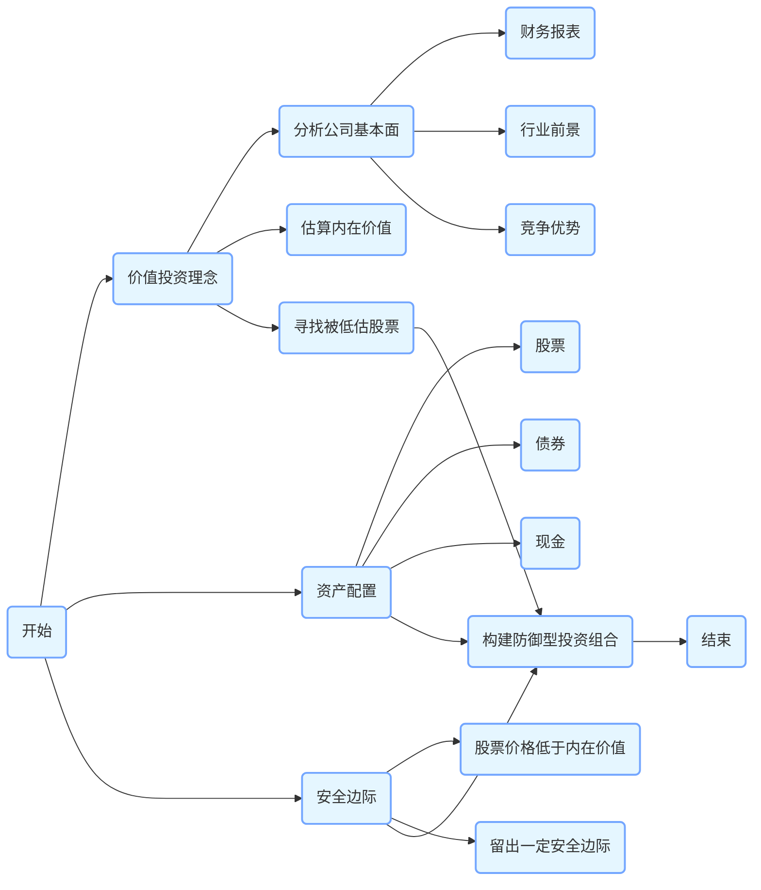

# 格雷厄姆的防御型投资组合构建

> 关键词：格雷厄姆、防御型投资组合、价值投资、风险控制、资产配置

> 摘要：本文围绕格雷厄姆的防御型投资组合构建展开，深入探讨其核心概念、算法原理、数学模型等内容。通过详细的代码案例和实际应用场景分析，为投资者提供构建防御型投资组合的理论和实践指导。同时，推荐了相关的学习资源、开发工具和论文著作，最后对防御型投资组合的未来发展趋势与挑战进行总结，并解答常见问题，帮助读者全面了解和运用格雷厄姆的投资理念。

## 1. 背景介绍 
### 1.1 目的和范围
本文章旨在深入剖析格雷厄姆的防御型投资组合构建方法，为投资者提供系统的理论和实践指导。通过详细讲解核心概念、算法原理、数学模型以及实际案例，帮助投资者理解如何运用格雷厄姆的投资理念构建适合自己的防御型投资组合，降低投资风险，实现资产的稳健增值。文章的范围涵盖了防御型投资组合的各个方面，包括理论基础、构建步骤、实际应用以及未来发展趋势等。

### 1.2 预期读者
本文预期读者包括对投资领域感兴趣的初学者、有一定投资经验但希望进一步优化投资组合的投资者、金融专业的学生以及从事金融研究和投资分析的专业人士。无论您是刚刚接触投资，还是希望深入了解格雷厄姆投资理念的专业人士，都能从本文中获得有价值的信息和启示。

### 1.3 文档结构概述
本文将按照以下结构进行组织：首先介绍格雷厄姆防御型投资组合构建的背景信息，包括目的、预期读者和文档结构概述等内容；接着阐述核心概念与联系，通过文本示意图和 Mermaid 流程图帮助读者理解相关概念；然后详细讲解核心算法原理和具体操作步骤，并使用 Python 源代码进行阐述；之后介绍数学模型和公式，并通过举例说明加深读者的理解；再通过项目实战部分，展示代码实际案例并进行详细解释；随后探讨实际应用场景；接着推荐相关的工具和资源，包括学习资源、开发工具框架和相关论文著作；最后对防御型投资组合的未来发展趋势与挑战进行总结，解答常见问题，并提供扩展阅读和参考资料。

### 1.4 术语表
#### 1.4.1 核心术语定义
- **防御型投资组合**：由格雷厄姆提出的一种投资组合策略，旨在通过合理的资产配置和选股标准，降低投资风险，实现资产的稳健增长。防御型投资组合注重投资的安全性和稳定性，适合风险承受能力较低的投资者。
- **价值投资**：一种投资理念，强调通过分析公司的基本面，寻找被市场低估的股票进行投资。价值投资者认为，股票的内在价值是决定其价格的基础，当股票价格低于其内在价值时，就存在投资机会。
- **资产配置**：指投资者将资金分配到不同的资产类别中，如股票、债券、现金等，以实现风险分散和收益最大化的目标。合理的资产配置可以降低投资组合的整体风险，提高投资的稳定性。
- **安全边际**：格雷厄姆提出的一个重要概念，指股票的市场价格与内在价值之间的差距。安全边际越大，投资的风险就越低，潜在的收益就越高。

#### 1.4.2 相关概念解释
- **内在价值**：公司的内在价值是指其未来现金流的现值。内在价值是一个相对稳定的概念，不受市场短期波动的影响。投资者可以通过分析公司的财务报表、行业前景、竞争优势等因素，估算公司的内在价值。
- **市盈率（PE）**：指股票价格与每股收益的比率，是衡量股票估值的常用指标之一。市盈率越低，说明股票的估值越低，投资价值相对较高。
- **市净率（PB）**：指股票价格与每股净资产的比率，也是衡量股票估值的重要指标之一。市净率越低，说明股票的估值越低，投资价值相对较高。

#### 1.4.3 缩略词列表
- **PE**：Price-to-Earnings Ratio，市盈率
- **PB**：Price-to-Book Ratio，市净率
- **ROE**：Return on Equity，净资产收益率

## 2. 核心概念与联系 
### 核心概念原理
格雷厄姆的防御型投资组合构建基于价值投资理念，强调通过合理的资产配置和选股标准，降低投资风险，实现资产的稳健增长。其核心原理包括以下几个方面：
- **价值投资**：格雷厄姆认为，股票的内在价值是决定其价格的基础，投资者应该寻找被市场低估的股票进行投资。通过分析公司的基本面，如财务报表、行业前景、竞争优势等，估算公司的内在价值，当股票价格低于其内在价值时，就存在投资机会。
- **资产配置**：防御型投资组合注重资产的分散化，通过将资金分配到不同的资产类别中，如股票、债券、现金等，降低投资组合的整体风险。合理的资产配置可以根据投资者的风险承受能力和投资目标进行调整。
- **安全边际**：格雷厄姆提出了安全边际的概念，认为投资者应该在股票价格低于其内在价值的基础上，再留出一定的安全边际，以降低投资风险。安全边际越大，投资的风险就越低，潜在的收益就越高。

### 架构的文本示意图
```plaintext
格雷厄姆的防御型投资组合构建
|-- 价值投资理念
|   |-- 分析公司基本面
|   |   |-- 财务报表
|   |   |-- 行业前景
|   |   |-- 竞争优势
|   |-- 估算内在价值
|   |-- 寻找被低估股票
|-- 资产配置
|   |-- 股票
|   |-- 债券
|   |-- 现金
|-- 安全边际
|   |-- 股票价格低于内在价值
|   |-- 留出一定安全边际
```

### Mermaid 流程图


## 3. 核心算法原理 & 具体操作步骤 
### 核心算法原理
格雷厄姆的防御型投资组合构建的核心算法原理主要包括选股算法和资产配置算法。

#### 选股算法
选股算法的核心是寻找被市场低估的股票，具体步骤如下：
1. **筛选股票**：根据一定的标准筛选出符合要求的股票，如市盈率、市净率、股息率等。
2. **估算内在价值**：通过分析公司的基本面，如财务报表、行业前景、竞争优势等，估算公司的内在价值。
3. **计算安全边际**：计算股票的市场价格与内在价值之间的差距，即安全边际。
4. **选择股票**：选择安全边际较大的股票纳入投资组合。

#### 资产配置算法
资产配置算法的核心是根据投资者的风险承受能力和投资目标，将资金分配到不同的资产类别中，具体步骤如下：
1. **确定风险承受能力**：通过问卷调查等方式，了解投资者的风险承受能力。
2. **确定投资目标**：根据投资者的风险承受能力和投资目标，确定投资组合的预期收益率和风险水平。
3. **选择资产类别**：根据投资目标和市场情况，选择适合的资产类别，如股票、债券、现金等。
4. **确定资产配置比例**：根据投资目标和风险承受能力，确定不同资产类别的配置比例。

### 具体操作步骤
#### 选股步骤
```python
import pandas as pd

# 假设我们有一个包含股票信息的 DataFrame，列名包括 'PE', 'PB', 'Dividend_Yield'
stock_data = pd.DataFrame({
    'Stock_Name': ['Stock1', 'Stock2', 'Stock3', 'Stock4', 'Stock5'],
    'PE': [10, 15, 20, 8, 12],
    'PB': [1.2, 1.5, 1.8, 1.0, 1.3],
    'Dividend_Yield': [0.03, 0.02, 0.01, 0.04, 0.025]
})

# 筛选条件
pe_threshold = 15
pb_threshold = 1.5
dividend_yield_threshold = 0.02

# 筛选股票
filtered_stocks = stock_data[(stock_data['PE'] <= pe_threshold) & 
                             (stock_data['PB'] <= pb_threshold) & 
                             (stock_data['Dividend_Yield'] >= dividend_yield_threshold)]

print("筛选后的股票：")
print(filtered_stocks)
```

#### 资产配置步骤
```python
# 假设投资者的风险承受能力为中等，预期收益率为 8%
risk_tolerance = '中等'
expected_return = 0.08

# 不同风险承受能力对应的资产配置比例
asset_allocation = {
    '低': {'股票': 30, '债券': 60, '现金': 10},
    '中等': {'股票': 50, '债券': 40, '现金': 10},
    '高': {'股票': 70, '债券': 20, '现金': 10}
}

# 根据风险承受能力确定资产配置比例
allocation_ratio = asset_allocation[risk_tolerance]

print("资产配置比例：")
print(allocation_ratio)
```

## 4. 数学模型和公式 & 详细讲解 & 举例说明 
### 内在价值估算模型
格雷厄姆提出了一种简单的内在价值估算公式：
$$V = EPS \times (8.5 + 2g)$$
其中，$V$ 表示股票的内在价值，$EPS$ 表示每股收益，$g$ 表示公司的预期增长率。

### 安全边际计算
安全边际的计算公式为：
$$安全边际 = \frac{内在价值 - 市场价格}{内在价值} \times 100\%$$

### 举例说明
假设某公司的每股收益为 $2$ 元，预期增长率为 $5\%$，则该公司股票的内在价值为：
$$V = 2 \times (8.5 + 2 \times 5) = 2 \times (8.5 + 10) = 2 \times 18.5 = 37$$（元）

如果该股票的市场价格为 $30$ 元，则安全边际为：
$$安全边际 = \frac{37 - 30}{37} \times 100\% \approx 18.92\%$$

这意味着该股票的市场价格低于其内在价值，具有一定的安全边际，投资风险相对较低。

## 5. 项目实战：代码实际案例和详细解释说明 
### 5.1  开发环境搭建
#### 安装 Python
首先，需要安装 Python 编程语言。可以从 Python 官方网站（https://www.python.org/downloads/）下载适合自己操作系统的 Python 安装包，并按照安装向导进行安装。

#### 安装必要的库
在构建防御型投资组合的项目中，需要使用一些 Python 库，如 `pandas`、`numpy` 等。可以使用以下命令进行安装：
```sh
pip install pandas numpy
```

### 5.2  源代码详细实现和代码解读
#### 选股代码实现
```python
import pandas as pd

# 模拟从数据源获取股票数据
def get_stock_data():
    data = {
        'Stock_Name': ['StockA', 'StockB', 'StockC', 'StockD', 'StockE'],
        'PE': [12, 18, 10, 15, 8],
        'PB': [1.3, 1.6, 1.1, 1.4, 0.9],
        'Dividend_Yield': [0.025, 0.015, 0.03, 0.02, 0.035]
    }
    return pd.DataFrame(data)

# 选股函数
def select_stocks(stock_data, pe_threshold=15, pb_threshold=1.5, dividend_yield_threshold=0.02):
    filtered_stocks = stock_data[(stock_data['PE'] <= pe_threshold) & 
                                 (stock_data['PB'] <= pb_threshold) & 
                                 (stock_data['Dividend_Yield'] >= dividend_yield_threshold)]
    return filtered_stocks

# 主函数
def main():
    stock_data = get_stock_data()
    selected_stocks = select_stocks(stock_data)
    print("筛选后的股票：")
    print(selected_stocks)

if __name__ == "__main__":
    main()
```

#### 代码解读
- `get_stock_data` 函数：模拟从数据源获取股票数据，返回一个包含股票信息的 `DataFrame`。
- `select_stocks` 函数：根据给定的选股标准，筛选出符合要求的股票。
- `main` 函数：调用 `get_stock_data` 函数获取股票数据，然后调用 `select_stocks` 函数进行选股，并打印筛选后的股票信息。

#### 资产配置代码实现
```python
# 不同风险承受能力对应的资产配置比例
asset_allocation = {
    '低': {'股票': 30, '债券': 60, '现金': 10},
    '中等': {'股票': 50, '债券': 40, '现金': 10},
    '高': {'股票': 70, '债券': 20, '现金': 10}
}

# 资产配置函数
def asset_allocation_function(risk_tolerance):
    return asset_allocation[risk_tolerance]

# 主函数
def main():
    risk_tolerance = '中等'
    allocation_ratio = asset_allocation_function(risk_tolerance)
    print("资产配置比例：")
    print(allocation_ratio)

if __name__ == "__main__":
    main()
```

#### 代码解读
- `asset_allocation` 字典：存储不同风险承受能力对应的资产配置比例。
- `asset_allocation_function` 函数：根据投资者的风险承受能力，返回相应的资产配置比例。
- `main` 函数：设置投资者的风险承受能力为“中等”，调用 `asset_allocation_function` 函数获取资产配置比例，并打印结果。

### 5.3  代码解读与分析
通过上述代码，我们可以看到如何使用 Python 实现格雷厄姆的防御型投资组合构建。选股代码根据市盈率、市净率和股息率等指标筛选出符合要求的股票，资产配置代码根据投资者的风险承受能力确定不同资产类别的配置比例。这些代码简单易懂，易于扩展和修改，可以根据实际情况调整选股标准和资产配置比例。

## 6. 实际应用场景 
### 个人投资者
对于个人投资者来说，格雷厄姆的防御型投资组合构建方法可以帮助他们降低投资风险，实现资产的稳健增长。个人投资者可以根据自己的风险承受能力和投资目标，选择适合自己的股票和资产配置比例，构建自己的防御型投资组合。例如，风险承受能力较低的个人投资者可以增加债券和现金的配置比例，减少股票的配置比例；而风险承受能力较高的个人投资者可以适当增加股票的配置比例，以获取更高的收益。

### 机构投资者
机构投资者如基金公司、保险公司等，也可以运用格雷厄姆的防御型投资组合构建方法，优化投资组合，提高投资绩效。机构投资者可以通过大规模的数据分析和研究，筛选出更多符合要求的股票，并根据市场情况和投资者需求，灵活调整资产配置比例。例如，在市场行情不稳定时，机构投资者可以增加债券和现金的配置比例，降低股票的配置比例，以减少投资组合的波动；而在市场行情较好时，机构投资者可以适当增加股票的配置比例，以获取更高的收益。

### 养老基金管理
养老基金管理需要保证资金的安全性和稳定性，以确保退休人员的生活质量。格雷厄姆的防御型投资组合构建方法非常适合养老基金管理。养老基金可以通过合理的资产配置和选股标准，降低投资风险，实现资产的稳健增长。例如，养老基金可以将大部分资金配置到债券和现金等低风险资产中，同时选择一些具有稳定股息收益和较低估值的股票进行投资，以获取一定的收益。

## 7. 工具和资源推荐
### 7.1 学习资源推荐
#### 7.1.1 书籍推荐
- 《聪明的投资者》（The Intelligent Investor）：本杰明·格雷厄姆的经典著作，被誉为投资领域的圣经。书中详细阐述了格雷厄姆的投资理念和方法，包括防御型投资组合构建、价值投资等内容。
- 《证券分析》（Security Analysis）：同样是本杰明·格雷厄姆的著作，是价值投资的奠基之作。该书深入分析了证券的价值评估方法和投资策略，对投资者具有重要的指导意义。
- 《漫步华尔街》（A Random Walk Down Wall Street）：作者伯顿·马尔基尔通过大量的实证研究，阐述了股票市场的随机性和有效性。书中介绍了一些投资策略和资产配置方法，对投资者有一定的启发。

#### 7.1.2 在线课程
- Coursera 上的“投资学原理”（Principles of Investing）课程：由宾夕法尼亚大学的教授授课，系统介绍了投资学的基本原理和方法，包括资产定价、投资组合理论等内容。
- edX 上的“金融市场”（Financial Markets）课程：由耶鲁大学的教授授课，深入探讨了金融市场的运行机制和投资策略，对投资者理解金融市场和构建投资组合有很大帮助。

#### 7.1.3 技术博客和网站
- 雪球网（https://xueqiu.com/）：国内知名的投资社区，提供股票、基金等投资品种的实时行情、分析报告和投资者交流平台。投资者可以在雪球网上学习其他投资者的经验和策略，了解市场动态。
- 价值投资网（https://www.value-investing.net/）：专注于价值投资领域的网站，提供价值投资的理论知识、案例分析和研究报告。投资者可以在该网站上深入学习格雷厄姆的投资理念和方法。

### 7.2 开发工具框架推荐
#### 7.2.1 IDE和编辑器
- PyCharm：一款专业的 Python 集成开发环境，具有强大的代码编辑、调试和分析功能。PyCharm 可以帮助开发者提高开发效率，快速实现投资组合构建的代码。
- Jupyter Notebook：一种交互式的开发环境，支持 Python、R 等多种编程语言。Jupyter Notebook 可以将代码、文本、图表等内容集成在一起，方便开发者进行数据分析和可视化。

#### 7.2.2 调试和性能分析工具
- PDB：Python 自带的调试工具，可以帮助开发者在代码中设置断点，逐步执行代码，查看变量的值和程序的执行流程。
- cProfile：Python 的性能分析工具，可以统计代码中各个函数的执行时间和调用次数，帮助开发者找出代码中的性能瓶颈。

#### 7.2.3 相关框架和库
- Pandas：一个强大的数据分析库，提供了 DataFrame 等数据结构，方便开发者进行数据处理和分析。在投资组合构建中，Pandas 可以用于处理股票数据、计算指标等。
- NumPy：一个用于科学计算的库，提供了高效的数组操作和数学函数。在投资组合构建中，NumPy 可以用于计算投资组合的收益率、风险等指标。

### 7.3 相关论文著作推荐
#### 7.3.1 经典论文
- 《证券分析的理论与实践》（The Theory and Practice of Security Analysis）：本杰明·格雷厄姆和戴维·多德的经典论文，阐述了价值投资的基本原理和方法，对投资领域产生了深远的影响。
- 《资本资产定价模型：理论与实证》（Capital Asset Pricing Model: Theory and Empirical Evidence）：威廉·夏普的论文，提出了资本资产定价模型（CAPM），为投资组合理论和资产定价提供了重要的理论基础。

#### 7.3.2 最新研究成果
- 《行为金融学与投资决策》（Behavioral Finance and Investment Decision Making）：探讨了投资者的心理和行为对投资决策的影响，为投资者提供了新的视角和思路。
- 《量化投资策略的优化与应用》（Optimization and Application of Quantitative Investment Strategies）：研究了量化投资策略的优化方法和应用场景，对投资者构建量化投资组合有一定的参考价值。

#### 7.3.3 应用案例分析
- 《某基金公司防御型投资组合的构建与绩效评估》：分析了某基金公司如何运用格雷厄姆的防御型投资组合构建方法，构建投资组合并评估其绩效，为投资者提供了实际案例参考。
- 《养老基金的资产配置策略与实践》：探讨了养老基金的资产配置策略和实践经验，对养老基金管理具有重要的借鉴意义。

## 8. 总结：未来发展趋势与挑战
### 未来发展趋势
#### 智能化与量化投资结合
随着人工智能和机器学习技术的不断发展，防御型投资组合构建将越来越多地与智能化和量化投资相结合。通过运用大数据分析、深度学习等技术，可以更准确地筛选股票、评估风险和优化资产配置，提高投资组合的绩效。

#### 多元化资产配置
未来的防御型投资组合将更加注重多元化资产配置，不仅包括传统的股票、债券和现金，还将涵盖更多的资产类别，如房地产、大宗商品、私募股权等。多元化资产配置可以进一步降低投资组合的风险，提高投资的稳定性。

#### 社会责任投资兴起
随着社会对环境保护、社会责任和公司治理（ESG）的关注度不断提高，社会责任投资将逐渐成为防御型投资组合的重要组成部分。投资者将更加关注企业的 ESG 表现，选择符合 ESG 标准的股票和资产进行投资，以实现经济、社会和环境的可持续发展。

### 挑战
#### 市场不确定性增加
全球经济形势的不确定性、政治风险和地缘政治冲突等因素，将增加市场的波动性和不确定性，给防御型投资组合的构建带来挑战。投资者需要更加灵活地调整资产配置，以应对市场的变化。

#### 数据质量和隐私问题
在智能化和量化投资的过程中，数据的质量和隐私问题至关重要。不准确或不完整的数据可能导致投资决策的失误，而数据隐私泄露则可能给投资者带来损失。因此，如何保证数据的质量和安全，是防御型投资组合构建面临的重要挑战之一。

#### 投资者教育不足
虽然格雷厄姆的投资理念已经被广泛传播，但仍有很多投资者对防御型投资组合构建的方法和原理缺乏深入的了解。投资者教育不足可能导致投资者在构建投资组合时做出错误的决策，增加投资风险。因此，加强投资者教育，提高投资者的投资素养，是推动防御型投资组合发展的关键。

## 9. 附录：常见问题与解答
### 1. 防御型投资组合适合所有投资者吗？
防御型投资组合注重投资的安全性和稳定性，适合风险承受能力较低、追求资产稳健增长的投资者。但对于风险承受能力较高、追求高收益的投资者来说，防御型投资组合可能无法满足他们的需求。投资者应根据自己的风险承受能力和投资目标，选择适合自己的投资组合。

### 2. 如何确定股票的内在价值？
确定股票的内在价值需要综合考虑多个因素，如公司的财务报表、行业前景、竞争优势等。可以使用一些估值模型，如格雷厄姆的内在价值估算公式、现金流折现模型等，来估算股票的内在价值。但需要注意的是，这些估值模型都有一定的局限性，投资者应结合自己的判断和分析，进行综合评估。

### 3. 资产配置比例可以随意调整吗？
资产配置比例应根据投资者的风险承受能力、投资目标和市场情况等因素进行调整，但不建议随意调整。频繁调整资产配置比例可能会增加交易成本，同时也可能导致投资决策的失误。投资者应制定合理的资产配置计划，并在市场发生重大变化时，适时进行调整。

### 4. 防御型投资组合能完全避免投资风险吗？
防御型投资组合可以通过合理的资产配置和选股标准，降低投资风险，但不能完全避免投资风险。市场是复杂多变的，任何投资都存在一定的风险。投资者应正确认识投资风险，做好风险防范措施。

## 10. 扩展阅读 & 参考资料
### 扩展阅读
- 《金融炼金术》（The Alchemy of Finance）：乔治·索罗斯的著作，探讨了金融市场的反身性原理和投资策略，对投资者理解金融市场的运行机制有很大帮助。
- 《黑天鹅：如何应对不可预知的未来》（The Black Swan: The Impact of the Highly Improbable）：纳西姆·尼古拉斯·塔勒布的著作，分析了黑天鹅事件对金融市场和投资决策的影响，提醒投资者要做好应对不确定性的准备。

### 参考资料
- Graham, B., & Dodd, D. L. (1934). Security Analysis. McGraw-Hill.
- Graham, B. (1949). The Intelligent Investor. Harper & Brothers.
- Sharpe, W. F. (1964). Capital asset prices: A theory of market equilibrium under conditions of risk. The Journal of Finance, 19(3), 425-442.

作者：AI天才研究院/AI Genius Institute & 禅与计算机程序设计艺术 /Zen And The Art of Computer Programming