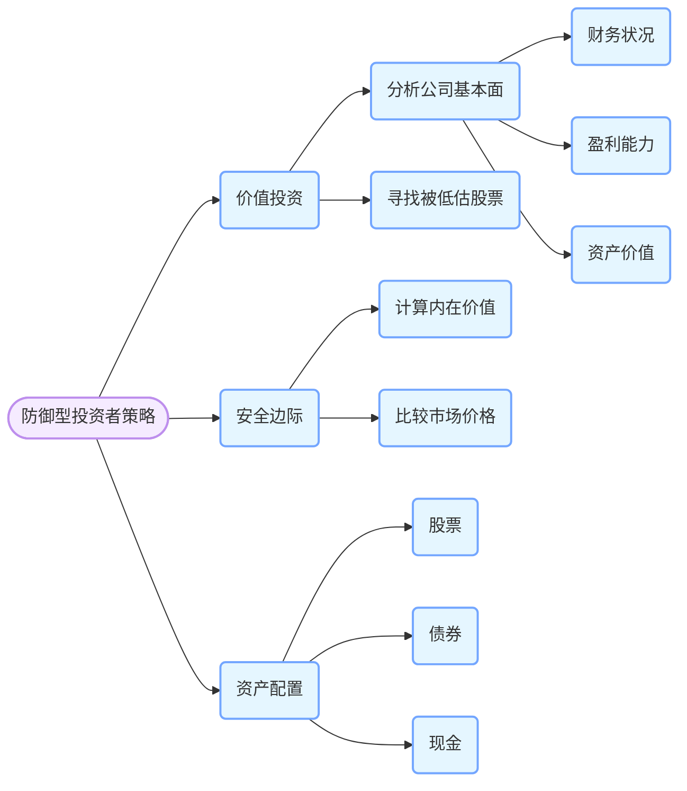

# 格雷厄姆的防御型投资者策略

> 关键词：格雷厄姆、防御型投资者策略、价值投资、财务分析、资产配置

> 摘要：本文深入探讨了格雷厄姆的防御型投资者策略。详细介绍了该策略的背景、核心概念、算法原理、数学模型，通过项目实战案例展示其具体应用，分析了实际应用场景，并推荐了相关的学习资源、开发工具和论文著作。旨在帮助投资者理解并运用这一经典策略，在投资中实现稳健收益，同时探讨其未来发展趋势与可能面临的挑战。

## 1. 背景介绍 
### 1.1 目的和范围
本部分旨在全面深入地介绍格雷厄姆的防御型投资者策略，涵盖该策略的理论基础、实际操作方法、应用场景以及未来发展趋势等方面。通过详细阐述，帮助投资者，尤其是防御型投资者理解和运用这一策略，在投资市场中实现资产的稳健增值。我们将从格雷厄姆的投资理念出发，逐步分析策略的各个要素，结合实际案例和相关数据，为投资者提供具有可操作性的指导。

### 1.2 预期读者
本文主要面向对投资领域感兴趣的人群，尤其是防御型投资者。这些投资者通常更注重资产的安全性和稳定性，希望在风险可控的前提下获得合理的投资回报。同时，对于投资新手，本文可以作为入门指南，帮助他们了解基本的投资理念和策略；对于有一定投资经验的专业人士，也可以作为参考，进一步深入研究格雷厄姆的投资思想。

### 1.3 文档结构概述
本文将按照以下结构进行阐述：首先介绍格雷厄姆防御型投资者策略的背景信息，包括目的、预期读者和文档结构概述等；接着详细讲解核心概念与联系，通过文本示意图和 Mermaid 流程图展示策略的原理和架构；然后阐述核心算法原理和具体操作步骤，并使用 Python 源代码进行详细说明；再介绍相关的数学模型和公式，通过举例进行详细讲解；之后通过项目实战，展示代码实际案例并进行详细解释说明；随后分析该策略的实际应用场景；接着推荐相关的工具和资源，包括学习资源、开发工具框架和论文著作等；最后总结该策略的未来发展趋势与挑战，提供常见问题与解答，并列出扩展阅读和参考资料。

### 1.4 术语表
#### 1.4.1 核心术语定义
- **防御型投资者**：指那些更注重资产安全性和稳定性，追求长期稳健回报，避免过度风险的投资者。他们通常不愿意花费大量时间和精力进行深入的市场研究和个股分析，更倾向于采用相对简单、保守的投资策略。
- **价值投资**：由格雷厄姆提出的一种投资理念，强调通过分析公司的基本面，如财务状况、盈利能力、资产价值等，寻找被市场低估的股票进行投资，以获取长期的投资回报。
- **安全边际**：指股票的内在价值与市场价格之间的差距。当股票的市场价格低于其内在价值时，就存在安全边际，这为投资者提供了一定的风险缓冲。

#### 1.4.2 相关概念解释
- **资产配置**：指投资者将资金分配到不同类型的资产上，如股票、债券、现金等，以实现风险分散和收益最大化的目标。防御型投资者通常会根据自己的风险承受能力和投资目标，合理配置资产。
- **股息率**：指股票每年的股息与股票价格的比率，是衡量股票投资收益的一个重要指标。防御型投资者通常更倾向于投资股息率较高的股票，以获取稳定的现金流。

#### 1.4.3 缩略词列表
- **PE**：市盈率，指股票价格与每股收益的比率，反映了市场对公司未来盈利的预期。
- **PB**：市净率，指股票价格与每股净资产的比率，反映了市场对公司资产价值的评估。

## 2. 核心概念与联系 
格雷厄姆的防御型投资者策略核心在于通过合理的资产配置和对股票基本面的分析，实现资产的稳健增值。其主要核心概念包括价值投资、安全边际、资产配置等，它们之间相互关联，共同构成了防御型投资者策略的理论基础。

### 文本示意图
```plaintext
防御型投资者策略
|
|-- 价值投资
|   |-- 分析公司基本面
|   |   |-- 财务状况
|   |   |-- 盈利能力
|   |   |-- 资产价值
|   |-- 寻找被低估股票
|
|-- 安全边际
|   |-- 计算内在价值
|   |-- 比较市场价格
|
|-- 资产配置
|   |-- 股票
|   |-- 债券
|   |-- 现金
```

### Mermaid 流程图


从流程图可以看出，防御型投资者策略围绕价值投资、安全边际和资产配置三个核心概念展开。价值投资是基础，通过对公司基本面的分析寻找被低估的股票；安全边际是保障，通过计算内在价值和比较市场价格，确保投资具有一定的风险缓冲；资产配置是手段，通过合理分配资金到不同类型的资产上，实现风险分散和收益最大化的目标。

## 3. 核心算法原理 & 具体操作步骤 
### 核心算法原理
格雷厄姆的防御型投资者策略主要基于以下几个核心算法原理：
- **价值评估算法**：通过分析公司的财务报表，计算公司的内在价值。常用的方法包括股息折现模型（DDM）、现金流折现模型（DCF）等。以股息折现模型为例，其基本公式为：
$V = \frac{D_1}{r - g}$
其中，$V$ 表示股票的内在价值，$D_1$ 表示下一年的股息，$r$ 表示必要收益率，$g$ 表示股息增长率。
- **安全边际计算算法**：安全边际可以通过计算股票的内在价值与市场价格之间的差值来确定。安全边际率的计算公式为：
$安全边际率 = \frac{内在价值 - 市场价格}{内在价值} \times 100\%$
当安全边际率较高时，说明股票的投资价值较高，风险较低。

### 具体操作步骤
#### 步骤 1：资产配置
防御型投资者通常会将资金分配到股票、债券和现金等不同类型的资产上。一般来说，股票的比例不宜过高，以降低市场波动对资产的影响。例如，可以将资金按照 60%的债券、30%的股票和 10%的现金进行配置。

#### 步骤 2：筛选股票
在选择股票时，防御型投资者会关注以下几个方面：
- **财务状况**：选择财务状况良好的公司，如资产负债率较低、现金流充足等。
- **盈利能力**：选择具有稳定盈利能力的公司，如净利润增长率较高、股息率较高等。
- **估值水平**：选择估值合理的公司，如市盈率、市净率较低等。

#### 步骤 3：计算安全边际
对于筛选出的股票，计算其内在价值和安全边际率。只有当安全边际率达到一定水平时，才考虑买入该股票。

#### 步骤 4：定期调整资产配置
随着市场行情的变化和公司基本面的变化，定期调整资产配置，以确保投资组合的风险和收益达到平衡。

### Python 源代码实现
```python
import pandas as pd

# 假设我们有一个包含股票信息的 DataFrame
data = {
    '股票代码': ['000001', '000002', '000003'],
    '市场价格': [10, 20, 30],
    '下一年股息': [1, 2, 3],
    '必要收益率': [0.1, 0.1, 0.1],
    '股息增长率': [0.05, 0.05, 0.05]
}
df = pd.DataFrame(data)

# 定义股息折现模型计算内在价值的函数
def calculate_intrinsic_value(D1, r, g):
    return D1 / (r - g)

# 计算内在价值
df['内在价值'] = df.apply(lambda row: calculate_intrinsic_value(row['下一年股息'], row['必要收益率'], row['股息增长率']), axis=1)

# 计算安全边际率
df['安全边际率'] = (df['内在价值'] - df['市场价格']) / df['内在价值'] * 100

# 筛选安全边际率大于 20%的股票
selected_stocks = df[df['安全边际率'] > 20]

print(selected_stocks)
```

在上述代码中，我们首先创建了一个包含股票信息的 DataFrame，然后定义了一个计算内在价值的函数 `calculate_intrinsic_value`，使用该函数计算每只股票的内在价值。接着，计算每只股票的安全边际率，并筛选出安全边际率大于 20%的股票。

## 4. 数学模型和公式 & 详细讲解 & 举例说明 
### 股息折现模型（DDM）
#### 公式
$V = \frac{D_1}{r - g}$
其中：
- $V$ 表示股票的内在价值
- $D_1$ 表示下一年的股息
- $r$ 表示必要收益率
- $g$ 表示股息增长率

#### 详细讲解
股息折现模型的基本思想是，股票的价值等于其未来股息的现值之和。在假设股息以固定增长率 $g$ 增长的情况下，可以推导出上述公式。必要收益率 $r$ 是投资者要求的最低回报率，通常可以根据市场利率、股票的风险等因素来确定。股息增长率 $g$ 可以通过分析公司的历史股息数据和未来发展前景来估计。

#### 举例说明
假设某公司下一年的股息 $D_1$ 为 2 元，必要收益率 $r$ 为 0.1，股息增长率 $g$ 为 0.05。则该股票的内在价值为：
$V = \frac{2}{0.1 - 0.05} = 40$（元）
如果该股票的市场价格为 30 元，则安全边际率为：
$安全边际率 = \frac{40 - 30}{40} \times 100\% = 25\%$

### 市盈率（PE）和市净率（PB）模型
#### 公式
- 市盈率（PE）：$PE = \frac{股票价格}{每股收益}$
- 市净率（PB）：$PB = \frac{股票价格}{每股净资产}$

#### 详细讲解
市盈率反映了市场对公司未来盈利的预期，市盈率较低的股票通常被认为是被低估的。市净率反映了市场对公司资产价值的评估，市净率较低的股票通常具有较高的安全边际。

#### 举例说明
假设某公司的股票价格为 20 元，每股收益为 2 元，每股净资产为 10 元。则该公司的市盈率为：
$PE = \frac{20}{2} = 10$
市净率为：
$PB = \frac{20}{10} = 2$

## 5. 项目实战：代码实际案例和详细解释说明 
### 5.1  开发环境搭建
在进行项目实战之前，需要搭建相应的开发环境。以下是具体步骤：
- **安装 Python**：可以从 Python 官方网站（https://www.python.org/downloads/）下载并安装最新版本的 Python。
- **安装必要的库**：使用 `pip` 命令安装所需的库，如 `pandas`、`numpy` 等。
```sh
pip install pandas numpy
```
- **选择开发工具**：可以选择使用 Jupyter Notebook、PyCharm 等开发工具。这里以 Jupyter Notebook 为例，安装命令如下：
```sh
pip install jupyter
```
安装完成后，在命令行中输入 `jupyter notebook` 启动 Jupyter Notebook。

### 5.2  源代码详细实现和代码解读
以下是一个完整的项目实战代码示例，用于筛选符合格雷厄姆防御型投资者策略的股票：

```python
import pandas as pd
import yfinance as yf

# 定义筛选股票的函数
def select_stocks():
    # 下载股票数据
    tickers = ['AAPL', 'MSFT', 'GOOG', 'AMZN', 'FB']
    data = yf.download(tickers, start='2020-01-01', end='2021-01-01')
    
    # 计算市盈率和市净率
    pe_ratios = {}
    pb_ratios = {}
    for ticker in tickers:
        stock = yf.Ticker(ticker)
        info = stock.info
        pe_ratios[ticker] = info.get('trailingPE', None)
        pb_ratios[ticker] = info.get('priceToBook', None)
    
    # 创建 DataFrame
    df = pd.DataFrame({
        '股票代码': tickers,
        '市盈率': pe_ratios.values(),
        '市净率': pb_ratios.values()
    })
    
    # 筛选市盈率小于 15 且市净率小于 1.5 的股票
    selected_stocks = df[(df['市盈率'] < 15) & (df['市净率'] < 1.5)]
    
    return selected_stocks

# 调用函数筛选股票
result = select_stocks()
print(result)
```

### 代码解读与分析
#### 代码功能概述
该代码的主要功能是筛选出符合格雷厄姆防御型投资者策略的股票。具体步骤包括下载股票数据、计算市盈率和市净率、筛选出市盈率小于 15 且市净率小于 1.5 的股票。

#### 代码详细解读
1. **导入必要的库**：导入 `pandas` 和 `yfinance` 库，分别用于数据处理和下载股票数据。
2. **定义筛选股票的函数 `select_stocks`**：
    - 下载指定股票的历史数据。
    - 计算每只股票的市盈率和市净率。
    - 创建一个包含股票代码、市盈率和市净率的 DataFrame。
    - 筛选出市盈率小于 15 且市净率小于 1.5 的股票。
3. **调用函数筛选股票并打印结果**：调用 `select_stocks` 函数筛选股票，并将结果打印输出。

#### 代码分析
通过该代码，我们可以快速筛选出符合格雷厄姆防御型投资者策略的股票。市盈率和市净率是衡量股票估值水平的重要指标，市盈率小于 15 且市净率小于 1.5 的股票通常被认为是具有投资价值的。在实际应用中，可以根据自己的需求调整筛选条件，以适应不同的市场环境和投资目标。

## 6. 实际应用场景 
### 个人投资者的资产配置
对于个人投资者来说，格雷厄姆的防御型投资者策略可以帮助他们实现资产的稳健增值。个人投资者通常没有专业的投资知识和丰富的投资经验，更注重资产的安全性和稳定性。通过采用防御型投资者策略，将资金合理分配到股票、债券和现金等不同类型的资产上，并筛选出具有投资价值的股票进行投资，可以降低投资风险，获得稳定的投资回报。

### 养老基金的投资管理
养老基金是为了保障退休人员的生活而设立的基金，其投资目标是在保证资金安全的前提下，实现资产的长期增值。格雷厄姆的防御型投资者策略非常适合养老基金的投资管理。养老基金可以通过资产配置，将大部分资金投资于债券等固定收益类资产，以确保资金的安全性；同时，将小部分资金投资于具有投资价值的股票，以获取较高的投资回报。

### 保险公司的资金运用
保险公司需要将大量的保费收入进行投资，以实现资金的保值增值。由于保险公司的资金具有长期性和稳定性的特点，因此更适合采用防御型投资者策略。保险公司可以通过合理的资产配置，将资金投资于债券、股票等不同类型的资产上，并注重股票的基本面分析和估值水平，以降低投资风险，提高投资收益。

## 7. 工具和资源推荐
### 7.1 学习资源推荐
#### 7.1.1 书籍推荐
- 《聪明的投资者》（The Intelligent Investor）：作者是本杰明·格雷厄姆，这是一本投资领域的经典著作，详细介绍了格雷厄姆的投资理念和防御型投资者策略。
- 《证券分析》（Security Analysis）：同样是本杰明·格雷厄姆的著作，被誉为投资领域的“圣经”，对价值投资理论进行了系统的阐述。

#### 7.1.2 在线课程
- Coursera 上的“投资学原理”（Principles of Investing）课程，由知名教授授课，涵盖了投资领域的基本概念和方法。
- edX 上的“价值投资基础”（Foundations of Value Investing）课程，深入讲解了价值投资的理论和实践。

#### 7.1.3 技术博客和网站
- 雪球网（https://xueqiu.com/）：一个专业的投资交流社区，提供了丰富的股票分析、投资策略等内容。
- 东方财富网（https://www.eastmoney.com/）：国内知名的财经网站，提供了全面的金融信息和投资分析工具。

### 7.2 开发工具框架推荐
#### 7.2.1 IDE和编辑器
- PyCharm：一款专业的 Python 集成开发环境，提供了丰富的代码编辑、调试和分析功能。
- Jupyter Notebook：一个交互式的开发环境，适合进行数据分析和代码演示。

#### 7.2.2 调试和性能分析工具
- PDB：Python 自带的调试工具，可以帮助开发者定位代码中的问题。
- cProfile：Python 标准库中的性能分析工具，可以分析代码的运行时间和性能瓶颈。

#### 7.2.3 相关框架和库
- Pandas：一个强大的数据处理和分析库，提供了丰富的数据结构和函数，方便进行数据清洗、分析和可视化。
- Numpy：一个用于科学计算的 Python 库，提供了高效的数组操作和数学函数。

### 7.3 相关论文著作推荐
#### 7.3.1 经典论文
- Graham, Benjamin, and David Dodd. "Security Analysis." McGraw-Hill, 1934. 这篇论文奠定了价值投资的理论基础，对投资领域产生了深远的影响。
- Fama, Eugene F., and Kenneth R. French. "The Cross-Section of Expected Stock Returns." Journal of Finance 47, no. 2 (1992): 427-465. 该论文提出了著名的 Fama-French 三因子模型，对股票收益的影响因素进行了深入分析。

#### 7.3.2 最新研究成果
- Asness, Clifford S., Andrea Frazzini, and Lasse H. Pedersen. "Quality Minus Junk." The Journal of Financial Economics 123, no. 1 (2017): 1-22. 该研究提出了“质量减去垃圾”（Quality Minus Junk）的投资策略，对防御型投资者策略的发展具有重要的参考价值。

#### 7.3.3 应用案例分析
- Buffett, Warren E. "The Superinvestors of Graham-and-Doddsville." Hermes 17, no. 1 (1984): 4-24. 这篇文章介绍了巴菲特等投资大师如何运用格雷厄姆的投资理念取得了巨大的成功，为防御型投资者策略的实际应用提供了经典案例。

## 8. 总结：未来发展趋势与挑战
### 未来发展趋势
- **智能化和自动化**：随着人工智能和机器学习技术的不断发展，防御型投资者策略将越来越多地应用智能化和自动化的方法。例如，通过机器学习算法对大量的财务数据和市场数据进行分析，筛选出具有投资价值的股票；利用自动化交易系统实现投资组合的自动调整。
- **多元化资产配置**：未来，防御型投资者将更加注重多元化资产配置，不仅会投资于传统的股票、债券和现金等资产，还会增加对房地产、大宗商品、数字货币等另类资产的投资，以进一步降低投资风险，提高投资收益。
- **社会责任投资**：随着社会对环境保护、社会责任和公司治理（ESG）的关注度不断提高，防御型投资者将越来越倾向于选择具有良好 ESG 表现的公司进行投资。这不仅有助于实现投资的社会价值，还可以降低投资风险，提高投资回报。

### 挑战
- **市场环境变化**：金融市场是复杂多变的，宏观经济形势、政策法规、行业竞争等因素都会对市场产生影响。防御型投资者需要及时关注市场环境的变化，调整投资策略，以适应市场的变化。
- **数据质量和分析能力**：防御型投资者策略需要大量的财务数据和市场数据进行分析，数据的质量和准确性直接影响到投资决策的正确性。同时，投资者需要具备较强的数据分析能力，才能从海量的数据中提取有价值的信息。
- **投资者情绪和行为偏差**：投资者的情绪和行为偏差往往会影响投资决策的合理性。例如，投资者在市场上涨时容易过度乐观，追高买入；在市场下跌时容易过度恐慌，抛售股票。防御型投资者需要克服这些情绪和行为偏差，保持理性和冷静。

## 9. 附录：常见问题与解答
### 问题 1：防御型投资者策略适合所有投资者吗？
解答：防御型投资者策略主要适合那些更注重资产安全性和稳定性，追求长期稳健回报，不愿意承担过高风险的投资者。对于那些风险承受能力较高，追求高收益的投资者来说，可能需要采用更加激进的投资策略。

### 问题 2：如何确定股票的内在价值？
解答：确定股票的内在价值可以采用多种方法，如股息折现模型（DDM）、现金流折现模型（DCF）、市盈率（PE）和市净率（PB）等。不同的方法适用于不同的情况，投资者可以根据自己的需求和实际情况选择合适的方法。

### 问题 3：资产配置的比例应该如何确定？
解答：资产配置的比例应该根据投资者的风险承受能力、投资目标和投资期限等因素来确定。一般来说，风险承受能力较低的投资者可以适当增加债券和现金的比例；风险承受能力较高的投资者可以适当增加股票的比例。同时，投资者还需要根据市场行情的变化定期调整资产配置的比例。

## 10. 扩展阅读 & 参考资料
### 扩展阅读
- 《巴菲特致股东的信：投资者和公司高管教程》（The Essays of Warren Buffett: Lessons for Corporate America）：作者是沃伦·巴菲特，书中收录了巴菲特历年致股东的信，详细阐述了他的投资理念和方法。
- 《穷查理宝典：查理·芒格的智慧箴言录》（Poor Charlie's Almanack: The Wit and Wisdom of Charles T. Munger）：作者是查理·芒格，这本书介绍了芒格的投资哲学和生活智慧，对投资者具有重要的启示作用。

### 参考资料
- Graham, Benjamin. "The Intelligent Investor." HarperBusiness, 2003.
- Buffett, Warren E. "The Superinvestors of Graham-and-Doddsville." Hermes 17, no. 1 (1984): 4-24.
- Fama, Eugene F., and Kenneth R. French. "The Cross-Section of Expected Stock Returns." Journal of Finance 47, no. 2 (1992): 427-465.

作者：AI天才研究院/AI Genius Institute & 禅与计算机程序设计艺术 /Zen And The Art of Computer Programming