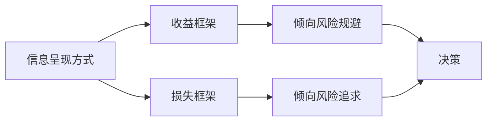

# 框架效应：信息呈现方式如何影响风险感知

> 关键词：框架效应、信息呈现方式、风险感知、决策、心理学、行为经济学

> 摘要：本文深入探讨了框架效应这一重要概念，即信息呈现方式对人们风险感知的影响。通过对核心概念的剖析、算法原理的阐述、数学模型的构建，结合实际案例和应用场景分析，揭示了框架效应在决策过程中的作用机制。同时，提供了相关的学习资源、开发工具和研究论文推荐，最后对框架效应的未来发展趋势与挑战进行了总结，并解答了常见问题。旨在帮助读者全面理解框架效应，提升在决策中应对信息呈现的能力。

## 1. 背景介绍 
### 1.1 目的和范围
本文章的目的在于全面且深入地探讨框架效应，即信息呈现方式如何影响人们对风险的感知。我们将研究不同信息呈现方式下，人们在决策过程中如何评估风险和做出选择。范围涵盖了框架效应的理论基础、数学模型、实际应用场景以及未来发展趋势等多个方面。通过对这些内容的研究，我们希望能够帮助读者更好地理解人类决策行为中的这一重要现象，并为相关领域的研究和实践提供有价值的参考。

### 1.2 预期读者
本文预期读者包括心理学、行为经济学、市场营销、决策科学等领域的研究人员和学者，他们可以从文章中获取关于框架效应的最新研究成果和理论知识，为自己的研究提供新的思路和方法。同时，对于从事商业决策、金融投资、公共政策制定等实际工作的人员，本文也具有一定的指导意义，帮助他们在工作中更好地利用或应对框架效应，做出更明智的决策。此外，对人类决策行为和心理现象感兴趣的普通读者也可以通过阅读本文，了解框架效应的基本概念和应用，提升自己的认知水平。

### 1.3 文档结构概述
本文将按照以下结构进行组织：首先介绍框架效应的背景信息，包括目的、预期读者和文档结构概述等内容；接着阐述框架效应的核心概念与联系，通过文本示意图和 Mermaid 流程图展示其原理和架构；然后详细讲解框架效应的核心算法原理和具体操作步骤，并使用 Python 源代码进行阐述；随后介绍相关的数学模型和公式，并通过举例进行详细说明；再通过项目实战，展示代码实际案例并进行详细解释；之后分析框架效应的实际应用场景；接着推荐相关的工具和资源，包括学习资源、开发工具框架和研究论文等；最后对框架效应的未来发展趋势与挑战进行总结，并解答常见问题，同时提供扩展阅读和参考资料。

### 1.4 术语表
#### 1.4.1 核心术语定义
- **框架效应（Framing Effect）**：指人们对一个客观上相同问题的不同描述导致了不同的决策判断。也就是说，信息的呈现方式会影响人们对问题的感知和决策。
- **风险感知（Risk Perception）**：个体对风险的认识、感受和判断，它受到多种因素的影响，包括信息呈现方式、个人经验、文化背景等。
- **决策（Decision Making）**：在多个可供选择的方案中，根据一定的标准和目标，选择一个最优或最满意的方案的过程。

#### 1.4.2 相关概念解释
- **收益框架（Gain Frame）**：信息以强调收益的方式呈现，例如“采用这种方案，有 80%的机会获得收益”。
- **损失框架（Loss Frame）**：信息以强调损失的方式呈现，例如“不采用这种方案，有 80%的机会遭受损失”。
- **风险偏好（Risk Preference）**：个体在面对风险时的态度，包括风险规避（Risk Aversion）、风险中立（Risk Neutrality）和风险追求（Risk Seeking）。

#### 1.4.3 缩略词列表
目前在本文中未涉及缩略词。

## 2. 核心概念与联系 
### 核心概念原理
框架效应的核心原理在于人类的认知和决策过程并非完全理性，而是受到信息呈现方式的影响。当信息以不同的框架呈现时，人们会对相同的问题产生不同的风险感知和决策偏好。

例如，在一个经典的实验中，研究人员向两组参与者描述了一个疾病防控方案：
- 对于第一组参与者，信息以收益框架呈现：“如果采用方案 A，有 200 人将获救；如果采用方案 B，有 1/3 的概率 600 人全部获救，2/3 的概率无人获救。”
- 对于第二组参与者，信息以损失框架呈现：“如果采用方案 A，有 400 人将死亡；如果采用方案 B，有 1/3 的概率无人死亡，2/3 的概率 600 人全部死亡。”

结果发现，在收益框架下，大多数参与者选择了方案 A；而在损失框架下，大多数参与者选择了方案 B。这表明，信息的呈现方式（收益或损失框架）改变了人们对风险的感知和决策。

### 架构的文本示意图
```plaintext
信息呈现方式
├── 收益框架
│   └── 影响风险感知（倾向风险规避）
│       └── 影响决策
├── 损失框架
│   └── 影响风险感知（倾向风险追求）
│       └── 影响决策
```

### Mermaid 流程图


## 3. 核心算法原理 & 具体操作步骤 
### 算法原理讲解
在研究框架效应时，我们可以使用期望效用理论来解释人们的决策过程。期望效用理论认为，人们在决策时会考虑每个方案的预期效用，即每个结果的效用乘以其发生的概率之和。

设 $x_i$ 表示第 $i$ 个结果，$p_i$ 表示第 $i$ 个结果发生的概率，$u(x_i)$ 表示第 $i$ 个结果的效用，则方案的期望效用 $EU$ 可以表示为：

$$EU = \sum_{i=1}^{n} p_i u(x_i)$$

在框架效应中，信息的呈现方式会影响人们对结果的效用评估。例如，在收益框架下，人们更倾向于规避风险，对确定的收益赋予更高的效用；而在损失框架下，人们更倾向于追求风险，对可能避免的损失赋予更高的效用。

### Python 源代码详细阐述
```python
# 定义一个函数来计算期望效用
def expected_utility(probabilities, utilities):
    """
    计算期望效用
    :param probabilities: 每个结果发生的概率列表
    :param utilities: 每个结果的效用列表
    :return: 期望效用
    """
    if len(probabilities)!= len(utilities):
        raise ValueError("概率列表和效用列表的长度必须相同")
    eu = 0
    for p, u in zip(probabilities, utilities):
        eu += p * u
    return eu

# 示例：收益框架下的决策
# 方案 A：有 100% 的概率获得 200 元
probabilities_a_gain = [1.0]
utilities_a_gain = [200]
eu_a_gain = expected_utility(probabilities_a_gain, utilities_a_gain)

# 方案 B：有 50% 的概率获得 400 元，50% 的概率获得 0 元
probabilities_b_gain = [0.5, 0.5]
utilities_b_gain = [400, 0]
eu_b_gain = expected_utility(probabilities_b_gain, utilities_b_gain)

print("收益框架下，方案 A 的期望效用:", eu_a_gain)
print("收益框架下，方案 B 的期望效用:", eu_b_gain)

# 示例：损失框架下的决策
# 方案 A：有 100% 的概率损失 200 元
probabilities_a_loss = [1.0]
utilities_a_loss = [-200]
eu_a_loss = expected_utility(probabilities_a_loss, utilities_a_loss)

# 方案 B：有 50% 的概率损失 400 元，50% 的概率损失 0 元
probabilities_b_loss = [0.5, 0.5]
utilities_b_loss = [-400, 0]
eu_b_loss = expected_utility(probabilities_b_loss, utilities_b_loss)

print("损失框架下，方案 A 的期望效用:", eu_a_loss)
print("损失框架下，方案 B 的期望效用:", eu_b_loss)
```

### 具体操作步骤
1. **确定决策方案**：明确需要进行决策的各个方案。
2. **确定结果和概率**：对于每个方案，确定可能出现的结果以及每个结果发生的概率。
3. **评估效用**：根据信息呈现方式（收益或损失框架），评估每个结果的效用。在收益框架下，对确定的收益赋予较高的效用；在损失框架下，对可能避免的损失赋予较高的效用。
4. **计算期望效用**：使用上述的期望效用公式，计算每个方案的期望效用。
5. **做出决策**：选择期望效用最高的方案。

## 4. 数学模型和公式 & 详细讲解 & 举例说明 
### 数学模型和公式
#### 期望效用理论公式
如前文所述，期望效用 $EU$ 的计算公式为：

$$EU = \sum_{i=1}^{n} p_i u(x_i)$$

其中，$n$ 表示结果的数量，$p_i$ 表示第 $i$ 个结果发生的概率，$u(x_i)$ 表示第 $i$ 个结果的效用。

#### 前景理论公式
前景理论是对期望效用理论的改进，它考虑了人们在决策时对收益和损失的不同心理反应。前景理论的价值函数 $v(x)$ 可以表示为：

$$v(x) = \begin{cases}
x^{\alpha} & \text{if } x \geq 0 \\
-\lambda (-x)^{\beta} & \text{if } x < 0
\end{cases}$$

其中，$x$ 表示结果的价值，$\alpha$ 和 $\beta$ 是风险偏好参数，通常 $\alpha, \beta \in (0, 1)$，$\lambda$ 是损失厌恶系数，通常 $\lambda > 1$。

### 详细讲解
#### 期望效用理论
期望效用理论假设人们在决策时是理性的，会根据每个方案的期望效用来做出选择。然而，在实际决策中，人们往往会受到框架效应的影响，导致决策偏离期望效用理论的预测。

#### 前景理论
前景理论认为，人们在决策时会对收益和损失进行不同的评估。在收益领域，人们是风险规避的，即更倾向于选择确定的收益；在损失领域，人们是风险追求的，即更倾向于选择可能避免损失的方案。价值函数的形状反映了这种心理特征，在收益部分是凹函数，在损失部分是凸函数，且损失部分的斜率更大，反映了人们的损失厌恶心理。

### 举例说明
#### 期望效用理论举例
假设你面临两个投资方案：
- 方案 A：有 80% 的概率获得 1000 元，20% 的概率获得 0 元。
- 方案 B：有 100% 的概率获得 600 元。

使用期望效用理论计算：
- 方案 A 的期望效用：$EU_A = 0.8 \times 1000 + 0.2 \times 0 = 800$
- 方案 B 的期望效用：$EU_B = 1.0 \times 600 = 600$

根据期望效用理论，应该选择方案 A。

#### 前景理论举例
假设 $\alpha = 0.88$，$\beta = 0.88$，$\lambda = 2.25$。对于上述投资方案：
- 方案 A：
    - 获得 1000 元的价值：$v(1000) = 1000^{0.88} \approx 379.7$
    - 获得 0 元的价值：$v(0) = 0$
    - 方案 A 的期望价值：$EV_A = 0.8 \times 379.7 + 0.2 \times 0 \approx 303.8$
- 方案 B：
    - 获得 600 元的价值：$v(600) = 600^{0.88} \approx 271.4$
    - 方案 B 的期望价值：$EV_B = 1.0 \times 271.4 = 271.4$

根据前景理论，仍然应该选择方案 A。但如果考虑到框架效应，信息呈现方式可能会改变人们对价值的评估，从而影响决策。

## 5. 项目实战：代码实际案例和详细解释说明 
### 5.1  开发环境搭建
为了运行本文中的 Python 代码，你需要搭建以下开发环境：
1. **Python 安装**：建议安装 Python 3.7 及以上版本。你可以从 Python 官方网站（https://www.python.org/downloads/）下载并安装适合你操作系统的 Python 版本。
2. **集成开发环境（IDE）**：可以选择使用 PyCharm、VS Code 等 IDE 来编写和运行 Python 代码。这里以 VS Code 为例，你可以从 VS Code 官方网站（https://code.visualstudio.com/）下载并安装。安装完成后，在 VS Code 中安装 Python 扩展，以便支持 Python 代码的编写和调试。

### 5.2  源代码详细实现和代码解读
以下是一个更复杂的代码示例，模拟了不同框架效应下的决策过程：

```python
import numpy as np

# 定义前景理论的价值函数
def value_function(x, alpha=0.88, beta=0.88, lambda_=2.25):
    """
    前景理论的价值函数
    :param x: 结果的价值
    :param alpha: 收益领域的风险偏好参数
    :param beta: 损失领域的风险偏好参数
    :param lambda_: 损失厌恶系数
    :return: 价值函数的值
    """
    if x >= 0:
        return x ** alpha
    else:
        return -lambda_ * (-x) ** beta

# 定义一个函数来计算前景理论下的期望价值
def prospect_value(probabilities, values, alpha=0.88, beta=0.88, lambda_=2.25):
    """
    计算前景理论下的期望价值
    :param probabilities: 每个结果发生的概率列表
    :param values: 每个结果的价值列表
    :param alpha: 收益领域的风险偏好参数
    :param beta: 损失领域的风险偏好参数
    :param lambda_: 损失厌恶系数
    :return: 前景理论下的期望价值
    """
    if len(probabilities)!= len(values):
        raise ValueError("概率列表和价值列表的长度必须相同")
    pv = 0
    for p, v in zip(probabilities, values):
        pv += p * value_function(v, alpha, beta, lambda_)
    return pv

# 示例：收益框架和损失框架下的决策
# 方案 A：有 100% 的概率获得 200 元（收益框架）或损失 200 元（损失框架）
probabilities_a = [1.0]
values_a_gain = [200]
values_a_loss = [-200]

# 方案 B：有 50% 的概率获得 400 元，50% 的概率获得 0 元（收益框架）
# 或有 50% 的概率损失 400 元，50% 的概率损失 0 元（损失框架）
probabilities_b = [0.5, 0.5]
values_b_gain = [400, 0]
values_b_loss = [-400, 0]

# 计算收益框架下的前景理论期望价值
pv_a_gain = prospect_value(probabilities_a, values_a_gain)
pv_b_gain = prospect_value(probabilities_b, values_b_gain)

# 计算损失框架下的前景理论期望价值
pv_a_loss = prospect_value(probabilities_a, values_a_loss)
pv_b_loss = prospect_value(probabilities_b, values_b_loss)

print("收益框架下，方案 A 的前景理论期望价值:", pv_a_gain)
print("收益框架下，方案 B 的前景理论期望价值:", pv_b_gain)
print("损失框架下，方案 A 的前景理论期望价值:", pv_a_loss)
print("损失框架下，方案 B 的前景理论期望价值:", pv_b_loss)

# 根据前景理论期望价值做出决策
if pv_a_gain > pv_b_gain:
    print("收益框架下，选择方案 A")
else:
    print("收益框架下，选择方案 B")

if pv_a_loss > pv_b_loss:
    print("损失框架下，选择方案 A")
else:
    print("损失框架下，选择方案 B")
```

### 代码解读与分析
1. **价值函数 `value_function`**：实现了前景理论的价值函数，根据输入的结果价值 $x$ 以及风险偏好参数 $\alpha$、$\beta$ 和损失厌恶系数 $\lambda$，计算价值函数的值。
2. **前景理论期望价值函数 `prospect_value`**：根据输入的概率列表和价值列表，计算前景理论下的期望价值。
3. **示例决策**：定义了两个方案 A 和 B，分别在收益框架和损失框架下计算它们的前景理论期望价值，并根据期望价值做出决策。

通过这个代码示例，我们可以看到不同框架效应下，人们的决策可能会发生变化，这与实际中的框架效应现象相符合。

## 6. 实际应用场景 
### 市场营销
在市场营销中，框架效应可以用于产品宣传和促销活动。例如，商家可以采用收益框架来宣传产品的优点，如“使用我们的产品，你将获得 20%的效率提升”；也可以采用损失框架来制造紧迫感，如“错过这次促销活动，你将损失 30%的优惠”。通过不同的信息呈现方式，影响消费者的风险感知和购买决策。

### 金融投资
在金融投资领域，框架效应也起着重要作用。投资顾问可以通过不同的信息呈现方式，影响投资者对投资产品的风险感知。例如，在介绍股票时，可以采用收益框架：“这只股票有 70%的概率在未来一年上涨 20%”；也可以采用损失框架：“这只股票有 30%的概率在未来一年下跌 10%”。不同的框架可能会导致投资者做出不同的投资决策。

### 公共政策制定
在公共政策制定中，框架效应可以用于引导公众对政策的接受度。例如，在推广节能减排政策时，可以采用收益框架：“采用节能措施，你将为环境保护做出贡献，同时每年节省 500 元的能源费用”；也可以采用损失框架：“不采用节能措施，你将加剧环境污染，并且每年多花费 500 元的能源费用”。通过不同的信息呈现方式，提高公众对政策的支持率。

### 医疗决策
在医疗决策中，框架效应会影响患者对治疗方案的选择。医生可以采用收益框架：“这种治疗方法有 80%的成功率，可以有效缓解你的症状”；也可以采用损失框架：“不采用这种治疗方法，你有 20%的概率病情恶化”。不同的框架可能会导致患者对治疗方案的风险感知不同，从而影响他们的决策。

## 7. 工具和资源推荐
### 7.1 学习资源推荐
#### 7.1.1 书籍推荐
- 《思考，快与慢》（*Thinking, Fast and Slow*）：作者丹尼尔·卡尼曼（Daniel Kahneman）是行为经济学领域的著名学者，本书介绍了人类思维的两种模式：快思考和慢思考，并深入探讨了各种认知偏差，包括框架效应。
- 《助推：如何做出有关健康、财富与幸福的最佳决策》（*Nudge: Improving Decisions About Health, Wealth, and Happiness*）：作者理查德·泰勒（Richard Thaler）和卡斯·桑斯坦（Cass Sunstein）介绍了如何通过设计选择环境来影响人们的决策，其中涉及到框架效应等相关内容。
- 《决策与判断》（*Decision Making and Judgment*）：本书系统地介绍了决策和判断的理论和方法，包括框架效应、启发式和偏差等内容。

#### 7.1.2 在线课程
- Coursera 上的“行为经济学”课程：由知名大学的教授授课，介绍了行为经济学的基本理论和应用，包括框架效应等内容。
- edX 上的“决策科学”课程：涵盖了决策的各个方面，包括风险感知、框架效应等内容，通过案例分析和实践项目帮助学生掌握相关知识和技能。

#### 7.1.3 技术博客和网站
- BehavioralEconomics.com：提供了行为经济学领域的最新研究成果和案例分析，包括框架效应的相关内容。
- PsyBlog：该博客关注心理学和行为科学的研究，会不定期发布关于框架效应等认知偏差的文章。

### 7.2 开发工具框架推荐
#### 7.2.1 IDE和编辑器
- PyCharm：一款专业的 Python 集成开发环境，提供了丰富的代码编辑、调试和项目管理功能，适合开发和研究与框架效应相关的 Python 代码。
- VS Code：一款轻量级的代码编辑器，支持多种编程语言，通过安装 Python 扩展可以方便地进行 Python 代码的编写和调试。

#### 7.2.2 调试和性能分析工具
- Py-Spy：一个用于分析 Python 程序性能的工具，可以帮助你找出代码中的性能瓶颈。
- PDB：Python 内置的调试器，可以帮助你在代码中设置断点、单步执行等，方便调试代码。

#### 7.2.3 相关框架和库
- NumPy：一个用于科学计算的 Python 库，提供了高效的数组操作和数学函数，在计算期望效用和前景理论期望价值时可以使用。
- Pandas：一个用于数据处理和分析的 Python 库，可以帮助你处理和分析与框架效应相关的实验数据。

### 7.3 相关论文著作推荐
#### 7.3.1 经典论文
- “Prospect Theory: An Analysis of Decision under Risk”（《前景理论：风险决策分析》）：由丹尼尔·卡尼曼（Daniel Kahneman）和阿莫斯·特沃斯基（Amos Tversky）发表，提出了前景理论，是行为经济学领域的经典论文，对框架效应的研究有重要影响。
- “The Framing of Decisions and the Psychology of Choice”（《决策框架与选择心理学》）：同样由卡尼曼和特沃斯基发表，详细探讨了框架效应的概念和影响。

#### 7.3.2 最新研究成果
- 可以通过学术数据库如 Google Scholar、Web of Science 等搜索关于框架效应的最新研究论文，了解该领域的前沿动态。

#### 7.3.3 应用案例分析
- 一些商业和管理领域的学术期刊会发表关于框架效应在实际应用中的案例分析，如《Journal of Marketing》《Management Science》等，可以从中获取相关的应用案例和经验。

## 8. 总结：未来发展趋势与挑战
### 未来发展趋势
- **跨学科研究**：框架效应的研究将越来越多地与神经科学、认知心理学、社会学等学科相结合，从多个角度深入探讨其产生的机制和影响因素。
- **个性化应用**：随着大数据和人工智能技术的发展，未来可以根据个体的特征和偏好，实现个性化的信息呈现方式，从而更精准地影响人们的决策。
- **政策应用拓展**：框架效应在公共政策制定中的应用将不断拓展，政府和社会组织可以利用这一效应更好地引导公众行为，促进社会的可持续发展。

### 挑战
- **伦理问题**：在利用框架效应影响人们决策时，可能会涉及到伦理问题，如是否侵犯了人们的自主选择权等。需要制定相应的伦理准则和规范，确保其合理应用。
- **个体差异**：不同个体对框架效应的敏感程度可能存在差异，如何准确地把握个体差异并进行有效的信息呈现是一个挑战。
- **信息过载**：在信息爆炸的时代，人们面临着大量的信息，如何在众多信息中突出框架效应的作用，提高信息的影响力也是一个需要解决的问题。

## 9. 附录：常见问题与解答
### 问题 1：框架效应是否总是会导致不理性的决策？
解答：框架效应并不总是导致不理性的决策。虽然框架效应会影响人们的风险感知和决策偏好，但在某些情况下，这种影响可能是合理的。例如，在某些紧急情况下，损失框架可能会促使人们采取更积极的行动，从而避免更大的损失。然而，在大多数情况下，框架效应可能会导致人们的决策偏离理性的期望效用理论，需要我们在决策时保持警惕。

### 问题 2：如何避免框架效应的影响？
解答：要避免框架效应的影响，可以采取以下措施：
- **多角度思考**：在面对决策时，尝试从不同的角度去思考问题，分析信息的本质，而不是仅仅被信息的呈现方式所左右。
- **了解框架效应**：通过学习和了解框架效应的原理和影响，提高自己对其的认知和敏感度，从而在决策时能够识别出可能存在的框架效应。
- **寻求客观信息**：尽量获取更多的客观信息，避免只依赖单一的信息来源，以减少框架效应的影响。

### 问题 3：框架效应在不同文化背景下是否存在差异？
解答：框架效应在不同文化背景下可能存在差异。文化因素会影响人们的价值观、思维方式和决策习惯，从而导致对框架效应的敏感程度和反应方式不同。例如，一些研究表明，集体主义文化背景下的人们可能对损失框架更为敏感，而个人主义文化背景下的人们可能对收益框架更为关注。但具体的差异还需要更多的研究来证实。

## 10. 扩展阅读 & 参考资料
### 扩展阅读
- 《影响力》（*Influence: The Psychology of Persuasion*）：作者罗伯特·西奥迪尼（Robert Cialdini）介绍了影响人们决策和行为的各种因素，包括框架效应等认知偏差。
- 《不确定世界的理性选择：判断与决策心理学》（*Rational Choice in an Uncertain World: The Psychology of Judgment and Decision Making*）：本书系统地介绍了决策心理学的理论和方法，对框架效应等内容进行了深入探讨。

### 参考资料
- Kahneman, D., & Tversky, A. (1979). Prospect theory: An analysis of decision under risk. *Econometrica*, 47(2), 263 - 291.
- Tversky, A., & Kahneman, D. (1981). The framing of decisions and the psychology of choice. *Science*, 211(4481), 453 - 458.

作者：AI天才研究院/AI Genius Institute & 禅与计算机程序设计艺术 /Zen And The Art of Computer Programming