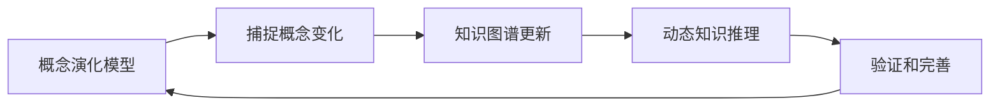

# 概念演化模型在动态知识推理中的研究

> 关键词：概念演化模型、动态知识推理、知识图谱、机器学习、语义表示

> 摘要：本文聚焦于概念演化模型在动态知识推理中的应用与研究。随着知识的不断更新和变化，传统的静态知识推理方法已难以满足实际需求。概念演化模型能够捕捉概念随时间的变化规律，为动态知识推理提供更准确和有效的支持。文章详细介绍了概念演化模型的核心概念、算法原理、数学模型，通过项目实战展示其具体应用，探讨了实际应用场景，并推荐了相关的工具和资源。最后，对概念演化模型在动态知识推理领域的未来发展趋势与挑战进行了总结。

## 1. 背景介绍 
### 1.1 目的和范围
本研究的目的在于深入探索概念演化模型在动态知识推理中的作用和应用。随着信息时代的发展，知识处于不断的更新和变化之中，如科技领域的新发现、社会事件的动态变化等。传统的知识推理方法大多基于静态的知识图谱，无法及时反映知识的动态演化。因此，研究概念演化模型，以实现更准确、高效的动态知识推理具有重要的现实意义。

本研究的范围涵盖了概念演化模型的基本原理、相关算法、数学模型，以及在不同领域的实际应用案例。同时，还对相关的工具和资源进行了推荐，为后续的研究和实践提供参考。

### 1.2 预期读者
本文预期读者包括从事人工智能、知识工程、自然语言处理等领域的研究人员、工程师和学生。对于希望深入了解动态知识推理技术，以及探索概念演化模型应用的专业人士具有一定的参考价值。

### 1.3 文档结构概述
本文将按照以下结构进行组织：
- 核心概念与联系：介绍概念演化模型和动态知识推理的核心概念，以及它们之间的联系，并通过示意图和流程图进行直观展示。
- 核心算法原理 & 具体操作步骤：详细阐述概念演化模型的核心算法原理，并使用 Python 代码进行实现和解释。
- 数学模型和公式 & 详细讲解 & 举例说明：给出概念演化模型的数学模型和相关公式，并通过具体例子进行详细讲解。
- 项目实战：代码实际案例和详细解释说明：通过一个具体的项目实战，展示概念演化模型在动态知识推理中的应用，包括开发环境搭建、源代码实现和代码解读。
- 实际应用场景：探讨概念演化模型在不同领域的实际应用场景。
- 工具和资源推荐：推荐相关的学习资源、开发工具框架和论文著作。
- 总结：未来发展趋势与挑战：对概念演化模型在动态知识推理领域的未来发展趋势和面临的挑战进行总结。
- 附录：常见问题与解答：解答读者在阅读过程中可能遇到的常见问题。
- 扩展阅读 & 参考资料：提供相关的扩展阅读材料和参考资料。

### 1.4 术语表
#### 1.4.1 核心术语定义
- **概念演化模型**：用于描述和捕捉概念随时间变化规律的模型，通过对概念的语义、属性等方面的动态分析，实现对概念演化的建模。
- **动态知识推理**：在知识不断变化的环境中，根据已有的知识和新的信息，推导出新的知识或结论的过程。
- **知识图谱**：一种以图的形式表示知识的结构化数据模型，由实体、关系和属性组成，用于存储和表示大量的知识。
- **语义表示**：将自然语言或其他形式的信息转换为计算机能够理解和处理的语义形式的过程。

#### 1.4.2 相关概念解释
- **概念漂移**：指概念的特征或分布随时间发生变化的现象，是概念演化的一种具体表现形式。
- **知识更新**：在知识图谱中，对已有知识进行修改、添加或删除的操作，以反映知识的动态变化。
- **推理规则**：用于从已有知识推导出新的知识的规则，在动态知识推理中起着重要的作用。

#### 1.4.3 缩略词列表
- **KG**：Knowledge Graph，知识图谱
- **NLP**：Natural Language Processing，自然语言处理
- **ML**：Machine Learning，机器学习

## 2. 核心概念与联系 

### 概念演化模型原理
概念演化模型旨在捕捉概念在不同时间点的变化。概念可以用多种特征来描述，如语义、属性、关联等。随着时间的推移，这些特征会发生改变，概念演化模型通过对这些变化的分析和建模，来预测概念的未来状态。

例如，在科技领域，“人工智能”这个概念的内涵和外延随着技术的发展不断变化。早期，人工智能主要关注规则推理和专家系统；而现在，深度学习、强化学习等成为了人工智能的核心技术。概念演化模型可以通过对相关文献、新闻等数据的分析，捕捉到这种变化。

### 动态知识推理原理
动态知识推理是在知识不断更新的环境中进行推理的过程。传统的知识推理基于静态的知识图谱，而动态知识推理需要考虑知识的动态变化。它通过不断更新知识图谱，并利用新的知识进行推理，以得到更准确的结论。

例如，在股票市场中，公司的财务状况、市场竞争情况等信息会不断变化。动态知识推理可以根据这些变化的信息，预测股票价格的走势。

### 概念演化模型与动态知识推理的联系
概念演化模型为动态知识推理提供了基础。通过对概念的演化进行建模，可以更准确地更新知识图谱，从而提高动态知识推理的准确性。

动态知识推理则可以反过来验证和完善概念演化模型。在推理过程中，如果发现某些概念的演化不符合实际情况，可以对概念演化模型进行调整。

### 文本示意图
```plaintext
概念演化模型
    |
    | 捕捉概念变化
    v
知识图谱更新
    |
    | 作为推理基础
    v
动态知识推理
    |
    | 验证和完善
    v
概念演化模型
```

### Mermaid 流程图


## 3. 核心算法原理 & 具体操作步骤 

### 核心算法原理
我们采用基于机器学习的方法来构建概念演化模型。具体来说，使用循环神经网络（RNN）来处理时间序列数据，以捕捉概念的演化趋势。

RNN 是一种具有记忆功能的神经网络，它可以处理序列数据。在概念演化模型中，我们将每个时间点的概念特征作为输入，通过 RNN 网络学习概念的演化规律。

### 具体操作步骤
1. **数据收集**：收集与概念相关的历史数据，如新闻文章、学术论文等。对数据进行预处理，提取概念的特征，如关键词、语义向量等。
2. **特征表示**：将提取的特征转换为数值向量，以便输入到 RNN 网络中。可以使用词嵌入技术，如 Word2Vec 或 GloVe，将文本特征转换为向量表示。
3. **模型训练**：使用收集到的数据对 RNN 模型进行训练。在训练过程中，调整模型的参数，使得模型能够准确地预测概念的未来状态。
4. **知识图谱更新**：根据训练好的概念演化模型，更新知识图谱中的概念信息。
5. **动态知识推理**：使用更新后的知识图谱进行动态知识推理，根据新的信息推导出新的结论。

### Python 源代码实现
```python
import numpy as np
import tensorflow as tf
from tensorflow.keras.models import Sequential
from tensorflow.keras.layers import SimpleRNN, Dense

# 生成示例数据
# 假设每个时间点的概念特征维度为 10
# 共有 100 个时间点的数据
data = np.random.rand(100, 10)
# 生成对应的标签，假设标签维度为 1
labels = np.random.rand(100, 1)

# 划分训练集和测试集
train_data = data[:80]
train_labels = labels[:80]
test_data = data[80:]
test_labels = labels[80:]

# 构建 RNN 模型
model = Sequential()
model.add(SimpleRNN(32, input_shape=(None, 10)))
model.add(Dense(1))

# 编译模型
model.compile(optimizer='adam', loss='mse')

# 训练模型
model.fit(train_data.reshape(-1, 1, 10), train_labels, epochs=10, batch_size=16)

# 评估模型
test_loss = model.evaluate(test_data.reshape(-1, 1, 10), test_labels)
print(f"Test loss: {test_loss}")

# 使用模型进行预测
predictions = model.predict(test_data.reshape(-1, 1, 10))
print(predictions)
```

### 代码解释
1. **数据生成**：使用 `np.random.rand` 生成示例数据和标签。
2. **数据划分**：将数据划分为训练集和测试集。
3. **模型构建**：使用 `Sequential` 构建一个简单的 RNN 模型，包含一个 `SimpleRNN` 层和一个 `Dense` 层。
4. **模型编译**：使用 `adam` 优化器和均方误差损失函数编译模型。
5. **模型训练**：使用 `fit` 方法对模型进行训练。
6. **模型评估**：使用 `evaluate` 方法评估模型在测试集上的性能。
7. **模型预测**：使用 `predict` 方法对测试数据进行预测。

## 4. 数学模型和公式 & 详细讲解 & 举例说明 

### 数学模型
假设我们有一个概念 $C$，在时间点 $t$ 的特征向量表示为 $\mathbf{x}_t \in \mathbb{R}^n$，其中 $n$ 是特征的维度。我们使用 RNN 来建模概念的演化，RNN 的隐藏状态 $\mathbf{h}_t \in \mathbb{R}^m$ 可以通过以下公式计算：

$$\mathbf{h}_t = \tanh(\mathbf{W}_{xh} \mathbf{x}_t + \mathbf{W}_{hh} \mathbf{h}_{t-1} + \mathbf{b}_h)$$

其中，$\mathbf{W}_{xh} \in \mathbb{R}^{m \times n}$ 是输入到隐藏层的权重矩阵，$\mathbf{W}_{hh} \in \mathbb{R}^{m \times m}$ 是隐藏层到隐藏层的权重矩阵，$\mathbf{b}_h \in \mathbb{R}^m$ 是隐藏层的偏置向量，$\tanh$ 是激活函数。

输出层的输出 $\mathbf{y}_t \in \mathbb{R}^k$ 可以通过以下公式计算：

$$\mathbf{y}_t = \mathbf{W}_{hy} \mathbf{h}_t + \mathbf{b}_y$$

其中，$\mathbf{W}_{hy} \in \mathbb{R}^{k \times m}$ 是隐藏层到输出层的权重矩阵，$\mathbf{b}_y \in \mathbb{R}^k$ 是输出层的偏置向量。

### 详细讲解
- **输入层**：输入层接收每个时间点的概念特征向量 $\mathbf{x}_t$。
- **隐藏层**：隐藏层通过 RNN 单元计算隐藏状态 $\mathbf{h}_t$，它不仅考虑了当前时间点的输入 $\mathbf{x}_t$，还考虑了上一个时间点的隐藏状态 $\mathbf{h}_{t-1}$，从而实现了对序列数据的处理。
- **输出层**：输出层根据隐藏状态 $\mathbf{h}_t$ 计算输出 $\mathbf{y}_t$，可以用于预测概念的未来状态。

### 举例说明
假设我们要预测股票价格的走势，概念 $C$ 就是股票的价格。每个时间点的特征向量 $\mathbf{x}_t$ 可以包含股票的开盘价、收盘价、成交量等信息。通过训练 RNN 模型，我们可以根据历史的股票数据预测未来的股票价格。

例如，在时间点 $t$，股票的特征向量 $\mathbf{x}_t = [100, 102, 10000]$，表示开盘价为 100，收盘价为 102，成交量为 10000。通过 RNN 模型计算隐藏状态 $\mathbf{h}_t$，并最终得到输出 $\mathbf{y}_t$，表示预测的下一个时间点的股票价格。

## 5. 项目实战：代码实际案例和详细解释说明 

### 5.1  开发环境搭建
- **操作系统**：Windows、Linux 或 macOS
- **Python 版本**：Python 3.7 及以上
- **深度学习框架**：TensorFlow 2.x
- **依赖库**：NumPy、Pandas 等

可以使用以下命令安装所需的库：
```sh
pip install tensorflow numpy pandas
```

### 5.2  源代码详细实现和代码解读
以下是一个更完整的项目实战代码，用于预测股票价格的走势：

```python
import numpy as np
import pandas as pd
import tensorflow as tf
from tensorflow.keras.models import Sequential
from tensorflow.keras.layers import SimpleRNN, Dense
from sklearn.preprocessing import MinMaxScaler

# 读取股票数据
data = pd.read_csv('stock_data.csv')
# 提取收盘价作为特征
close_prices = data['Close'].values.reshape(-1, 1)

# 数据归一化
scaler = MinMaxScaler()
scaled_prices = scaler.fit_transform(close_prices)

# 划分训练集和测试集
train_size = int(len(scaled_prices) * 0.8)
train_data = scaled_prices[:train_size]
test_data = scaled_prices[train_size:]

# 准备训练数据
def create_sequences(data, seq_length):
    xs = []
    ys = []
    for i in range(len(data) - seq_length):
        x = data[i:i+seq_length]
        y = data[i+seq_length]
        xs.append(x)
        ys.append(y)
    return np.array(xs), np.array(ys)

seq_length = 10
train_x, train_y = create_sequences(train_data, seq_length)
test_x, test_y = create_sequences(test_data, seq_length)

# 构建 RNN 模型
model = Sequential()
model.add(SimpleRNN(32, input_shape=(seq_length, 1)))
model.add(Dense(1))

# 编译模型
model.compile(optimizer='adam', loss='mse')

# 训练模型
model.fit(train_x, train_y, epochs=10, batch_size=16)

# 评估模型
test_loss = model.evaluate(test_x, test_y)
print(f"Test loss: {test_loss}")

# 预测未来股票价格
predictions = model.predict(test_x)
# 反归一化
predictions = scaler.inverse_transform(predictions)
test_y = scaler.inverse_transform(test_y)

import matplotlib.pyplot as plt
plt.plot(test_y, label='Actual Prices')
plt.plot(predictions, label='Predicted Prices')
plt.legend()
plt.show()
```

### 代码解读与分析
1. **数据读取和预处理**：使用 `pandas` 读取股票数据，并提取收盘价作为特征。使用 `MinMaxScaler` 对数据进行归一化处理，将数据缩放到 [0, 1] 范围内。
2. **数据划分和序列生成**：将数据划分为训练集和测试集，并使用 `create_sequences` 函数将数据转换为适合 RNN 输入的序列形式。
3. **模型构建和编译**：构建一个简单的 RNN 模型，包含一个 `SimpleRNN` 层和一个 `Dense` 层。使用 `adam` 优化器和均方误差损失函数编译模型。
4. **模型训练和评估**：使用 `fit` 方法对模型进行训练，并使用 `evaluate` 方法评估模型在测试集上的性能。
5. **预测和可视化**：使用训练好的模型对测试数据进行预测，并将预测结果反归一化。最后，使用 `matplotlib` 绘制实际价格和预测价格的对比图。

## 6. 实际应用场景 
### 金融领域
在金融领域，概念演化模型和动态知识推理可以用于股票价格预测、风险评估等。通过对金融市场的动态信息进行分析，如公司财报、宏观经济数据等，可以及时调整投资策略，降低风险。

### 医疗领域
在医疗领域，概念演化模型可以用于疾病的诊断和治疗方案的推荐。随着医学研究的不断发展，疾病的诊断标准和治疗方法也在不断更新。通过对医学文献和临床数据的分析，动态知识推理可以为医生提供更准确的诊断和治疗建议。

### 科技领域
在科技领域，概念演化模型可以用于技术趋势预测和创新机会发现。通过对科技文献、专利数据等的分析，捕捉技术概念的演化趋势，帮助企业和研究机构提前布局，抓住创新机会。

### 社交网络领域
在社交网络领域，概念演化模型和动态知识推理可以用于用户行为分析和信息推荐。通过对用户的社交行为、兴趣爱好等信息的分析，及时调整推荐策略，提高用户体验。

## 7. 工具和资源推荐
### 7.1 学习资源推荐
#### 7.1.1 书籍推荐
- 《深度学习》（Deep Learning）：由 Ian Goodfellow、Yoshua Bengio 和 Aaron Courville 编写，是深度学习领域的经典教材。
- 《Python 深度学习》（Deep Learning with Python）：由 Francois Chollet 编写，介绍了如何使用 Python 和 Keras 进行深度学习开发。
- 《知识图谱：方法、实践与应用》：详细介绍了知识图谱的构建、推理和应用。

#### 7.1.2 在线课程
- Coursera 上的“深度学习专项课程”（Deep Learning Specialization）：由 Andrew Ng 教授授课，涵盖了深度学习的各个方面。
- edX 上的“人工智能基础”（Fundamentals of Artificial Intelligence）：介绍了人工智能的基本概念和方法。
- 中国大学 MOOC 上的“自然语言处理”课程：由国内知名高校的教授授课，讲解自然语言处理的理论和实践。

#### 7.1.3 技术博客和网站
- Medium 上的 Towards Data Science：分享了大量的数据科学和机器学习相关的文章。
- arXiv.org：提供了最新的学术论文，包括人工智能、机器学习等领域。
- 开源中国（OSChina）：关注开源技术的发展，提供了很多实用的技术文章和项目案例。

### 7.2 开发工具框架推荐
#### 7.2.1 IDE和编辑器
- PyCharm：一款专业的 Python 集成开发环境，提供了丰富的代码编辑、调试和项目管理功能。
- Jupyter Notebook：一个交互式的开发环境，适合进行数据分析和模型实验。
- Visual Studio Code：一款轻量级的代码编辑器，支持多种编程语言和插件扩展。

#### 7.2.2 调试和性能分析工具
- TensorBoard：TensorFlow 提供的可视化工具，用于监控模型的训练过程和性能指标。
- Py-Spy：一个用于分析 Python 代码性能的工具，可以帮助找出代码中的性能瓶颈。
- PDB：Python 自带的调试器，用于调试 Python 代码。

#### 7.2.3 相关框架和库
- TensorFlow：一个开源的深度学习框架，提供了丰富的工具和接口，用于构建和训练深度学习模型。
- PyTorch：另一个流行的深度学习框架，具有动态图和易于使用的特点。
- SpaCy：一个用于自然语言处理的 Python 库，提供了高效的文本处理和分析功能。

### 7.3 相关论文著作推荐
#### 7.3.1 经典论文
- “Long Short-Term Memory”：由 Sepp Hochreiter 和 Jürgen Schmidhuber 发表，介绍了长短期记忆网络（LSTM）的原理和应用。
- “Knowledge Graph Embedding: A Survey of Approaches and Applications”：对知识图谱嵌入的方法和应用进行了全面的综述。
- “Dynamic Knowledge Graph Embeddings for Link Prediction”：研究了动态知识图谱嵌入在链接预测中的应用。

#### 7.3.2 最新研究成果
- 在 NeurIPS、ICML、ACL 等顶级学术会议上搜索关于概念演化模型和动态知识推理的最新研究成果。
- 关注知名学术期刊，如 Journal of Artificial Intelligence Research（JAIR）、Artificial Intelligence 等。

#### 7.3.3 应用案例分析
- 可以在 IEEE Xplore、ACM Digital Library 等数据库中搜索相关的应用案例分析论文，了解概念演化模型和动态知识推理在不同领域的实际应用。

## 8. 总结：未来发展趋势与挑战
### 未来发展趋势
- **多模态融合**：将文本、图像、视频等多模态数据融合到概念演化模型中，以更全面地捕捉概念的变化。
- **强化学习与知识推理的结合**：使用强化学习方法优化动态知识推理过程，提高推理的效率和准确性。
- **跨领域应用**：将概念演化模型和动态知识推理应用到更多的领域，如交通、能源等，解决实际问题。

### 挑战
- **数据质量和多样性**：高质量和多样化的数据是构建准确的概念演化模型的基础。然而，实际应用中数据往往存在噪声、缺失等问题，需要解决数据质量和多样性的问题。
- **模型可解释性**：深度学习模型通常是黑盒模型，难以解释其决策过程。在动态知识推理中，模型的可解释性非常重要，需要研究如何提高模型的可解释性。
- **计算资源和效率**：随着数据量的增加和模型复杂度的提高，计算资源和效率成为了一个挑战。需要研究如何优化模型结构和算法，提高计算效率。

## 9. 附录：常见问题与解答
### 问题 1：概念演化模型和传统的机器学习模型有什么区别？
概念演化模型主要关注概念随时间的变化，而传统的机器学习模型通常假设数据是静态的。概念演化模型需要处理时间序列数据，考虑数据的动态性，而传统的机器学习模型更侧重于对静态数据的分类和回归。

### 问题 2：如何选择合适的特征来构建概念演化模型？
选择合适的特征需要考虑概念的本质和应用场景。可以从多个方面提取特征，如语义、属性、关联等。同时，还可以使用特征选择方法，如相关性分析、主成分分析等，来筛选出最重要的特征。

### 问题 3：动态知识推理的准确性如何保证？
动态知识推理的准确性受到多种因素的影响，如知识图谱的质量、推理规则的合理性、概念演化模型的准确性等。为了保证推理的准确性，需要不断更新和完善知识图谱，优化推理规则，提高概念演化模型的性能。

### 问题 4：概念演化模型可以处理大规模数据吗？
概念演化模型可以处理大规模数据，但需要考虑计算资源和效率的问题。可以采用分布式计算、并行计算等技术来提高模型的处理能力。同时，还可以对数据进行采样和降维处理，减少数据量。

## 10. 扩展阅读 & 参考资料
- 《人工智能：一种现代的方法》（Artificial Intelligence: A Modern Approach）
- 《深度学习入门：基于 Python 的理论与实现》
- 李开复、王咏刚著《人工智能》
- 相关的学术论文和研究报告

作者：AI天才研究院/AI Genius Institute & 禅与计算机程序设计艺术 /Zen And The Art of Computer Programming