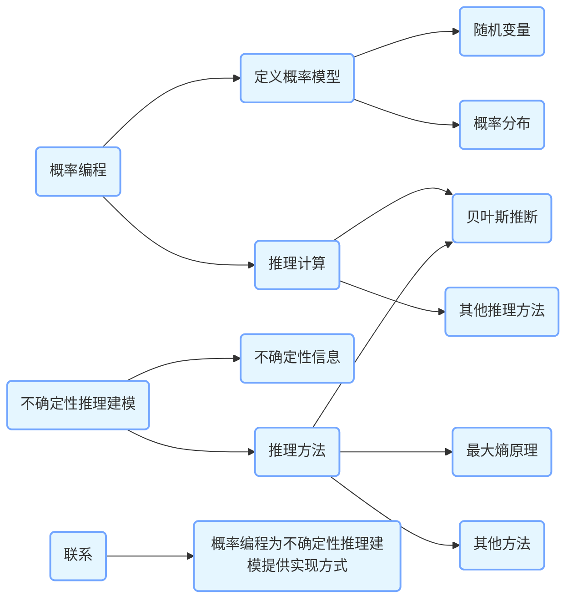

# 概率编程在不确定性推理建模中的应用

> 关键词：概率编程、不确定性推理建模、贝叶斯推断、概率模型、马尔可夫链蒙特卡罗方法

> 摘要：本文深入探讨了概率编程在不确定性推理建模中的应用。首先介绍了概率编程和不确定性推理建模的背景知识，包括目的、预期读者、文档结构和相关术语。接着阐述了概率编程的核心概念与联系，通过文本示意图和 Mermaid 流程图进行直观展示。详细讲解了核心算法原理，使用 Python 源代码进行说明，并给出了数学模型和公式以及具体的举例。通过项目实战，展示了概率编程在实际中的代码实现和详细解读。分析了概率编程在不同领域的实际应用场景，推荐了相关的学习资源、开发工具框架和论文著作。最后总结了概率编程的未来发展趋势与挑战，并提供了常见问题的解答和扩展阅读参考资料。

## 1. 背景介绍 
### 1.1 目的和范围
在现实世界中，许多问题都存在不确定性。例如，在医疗诊断中，医生很难仅凭症状就确定患者一定患有某种疾病；在金融市场预测中，股票价格的走势受到众多复杂因素的影响，难以准确预测。不确定性推理建模就是为了处理这些不确定信息，而概率编程则为这种建模提供了强大的工具。

本文的目的是全面介绍概率编程在不确定性推理建模中的应用，包括核心概念、算法原理、数学模型、实际案例等方面。范围涵盖了概率编程的基础知识、常见的算法实现、在不同领域的应用场景以及相关的学习资源和工具推荐。

### 1.2 预期读者
本文预期读者包括对人工智能、机器学习、统计学等领域感兴趣的研究人员、开发者和学生。对于那些希望了解如何使用概率编程来处理不确定性问题的专业人士，以及想要深入学习概率建模和推理的初学者来说，本文都具有一定的参考价值。

### 1.3 文档结构概述
本文将按照以下结构进行组织：
- 核心概念与联系：介绍概率编程和不确定性推理建模的基本概念，以及它们之间的联系。
- 核心算法原理 & 具体操作步骤：讲解概率编程中常用的算法原理，并使用 Python 代码进行详细阐述。
- 数学模型和公式 & 详细讲解 & 举例说明：给出概率编程中的数学模型和公式，并通过具体例子进行说明。
- 项目实战：通过一个实际的项目案例，展示概率编程在不确定性推理建模中的应用，包括开发环境搭建、源代码实现和代码解读。
- 实际应用场景：分析概率编程在不同领域的实际应用场景。
- 工具和资源推荐：推荐相关的学习资源、开发工具框架和论文著作。
- 总结：总结概率编程的未来发展趋势与挑战。
- 附录：提供常见问题的解答。
- 扩展阅读 & 参考资料：列出相关的扩展阅读材料和参考资料。

### 1.4 术语表
#### 1.4.1 核心术语定义
- **概率编程**：是一种将概率模型的表示和推理过程结合在一起的编程范式，允许程序员使用编程语言来描述概率模型，并自动进行推理计算。
- **不确定性推理建模**：是指在存在不确定性信息的情况下，建立数学模型来描述和处理这些不确定性，从而进行推理和决策。
- **贝叶斯推断**：是一种基于贝叶斯定理的统计推断方法，通过结合先验知识和观测数据来更新对未知参数的概率分布。
- **马尔可夫链蒙特卡罗方法（MCMC）**：是一类用于从概率分布中采样的算法，通过构造马尔可夫链来生成样本，从而估计概率分布的参数。

#### 1.4.2 相关概念解释
- **概率模型**：是对随机现象的数学描述，通常用概率分布来表示。在概率编程中，概率模型可以使用编程语言来定义。
- **推理**：是指根据已知的信息和概率模型，计算未知参数的概率分布或进行预测的过程。
- **先验分布**：是在观测数据之前对未知参数的概率分布的估计，反映了我们的先验知识。
- **后验分布**：是在观测数据之后，根据贝叶斯定理更新得到的对未知参数的概率分布。

#### 1.4.3 缩略词列表
- **MCMC**：马尔可夫链蒙特卡罗方法（Markov Chain Monte Carlo）
- **HMC**：哈密顿蒙特卡罗方法（Hamiltonian Monte Carlo）
- **NUTS**：无回旋采样器（No-U-Turn Sampler）

## 2. 核心概念与联系 

### 概率编程的核心概念
概率编程的核心思想是将概率模型的表示和推理过程统一起来。在传统的编程中，程序的执行是确定性的，而在概率编程中，程序可以包含随机变量和概率分布。通过使用概率编程，我们可以方便地定义复杂的概率模型，并自动进行推理计算。

例如，我们可以使用概率编程来定义一个简单的抛硬币模型：
```python
import pymc3 as pm

# 定义模型
with pm.Model() as coin_model:
    # 定义硬币正面朝上的概率，使用均匀分布作为先验
    p = pm.Uniform('p', lower=0, upper=1)
    # 定义观测数据，假设抛了 10 次硬币，其中有 6 次正面朝上
    data = [1] * 6 + [0] * 4
    # 定义二项分布作为似然函数
    y = pm.Binomial('y', n=10, p=p, observed=data)
```
在这个例子中，我们使用 PyMC3 库来定义一个概率模型。`p` 是一个随机变量，表示硬币正面朝上的概率，使用均匀分布作为先验。`y` 是一个观测变量，表示抛硬币的结果，使用二项分布作为似然函数。

### 不确定性推理建模的核心概念
不确定性推理建模的目的是在存在不确定性信息的情况下，进行合理的推理和决策。常见的不确定性推理方法包括贝叶斯推断、最大熵原理等。

贝叶斯推断是一种基于贝叶斯定理的统计推断方法，其基本公式为：
$$P(\theta|D) = \frac{P(D|\theta)P(\theta)}{P(D)}$$
其中，$P(\theta|D)$ 是后验分布，表示在观测数据 $D$ 下，未知参数 $\theta$ 的概率分布；$P(D|\theta)$ 是似然函数，表示在参数 $\theta$ 下，观测数据 $D$ 的概率分布；$P(\theta)$ 是先验分布，表示在观测数据之前，对参数 $\theta$ 的概率分布的估计；$P(D)$ 是证据，是一个归一化常数。

### 概率编程与不确定性推理建模的联系
概率编程为不确定性推理建模提供了一种方便的实现方式。通过使用概率编程，我们可以使用编程语言来定义复杂的概率模型，并自动进行贝叶斯推断等不确定性推理计算。

例如，在上面的抛硬币模型中，我们可以使用 PyMC3 库的 `sample` 函数来进行贝叶斯推断：
```python
# 进行采样
with coin_model:
    trace = pm.sample(1000, tune=1000)

# 查看后验分布
pm.plot_trace(trace)
```
在这个例子中，我们使用 `sample` 函数从后验分布中采样，得到一组样本。然后使用 `plot_trace` 函数绘制后验分布的轨迹图，直观地展示后验分布的情况。

### 文本示意图
```plaintext
概率编程
|-- 定义概率模型
|   |-- 随机变量
|   |-- 概率分布
|-- 推理计算
    |-- 贝叶斯推断
    |-- 其他推理方法

不确定性推理建模
|-- 不确定性信息
|-- 推理方法
    |-- 贝叶斯推断
    |-- 最大熵原理
    |-- 其他方法

联系：概率编程为不确定性推理建模提供实现方式
```

### Mermaid 流程图


## 3. 核心算法原理 & 具体操作步骤 

### 贝叶斯推断的核心算法原理
贝叶斯推断的核心是根据贝叶斯定理更新后验分布。在实际应用中，由于后验分布的计算通常比较复杂，我们需要使用一些采样算法来从后验分布中采样，从而估计后验分布的参数。

常见的采样算法包括马尔可夫链蒙特卡罗方法（MCMC）和变分推断等。下面我们将重点介绍 MCMC 方法。

#### 马尔可夫链蒙特卡罗方法（MCMC）
MCMC 方法是一类用于从概率分布中采样的算法，其基本思想是构造一个马尔可夫链，使得该马尔可夫链的平稳分布就是我们要采样的目标分布。

MCMC 方法的具体步骤如下：
1. 初始化一个初始状态 $x_0$。
2. 在第 $t$ 步，根据当前状态 $x_t$，使用一个转移核 $T(x_{t+1}|x_t)$ 生成一个候选状态 $x_{t+1}'$。
3. 计算接受概率 $\alpha(x_t, x_{t+1}')$，并以概率 $\alpha(x_t, x_{t+1}')$ 接受候选状态 $x_{t+1}'$，否则保持当前状态 $x_t$ 不变。
4. 重复步骤 2 和 3，直到达到指定的采样次数。

#### 哈密顿蒙特卡罗方法（HMC）
HMC 是一种基于哈密顿力学的 MCMC 方法，它通过引入一个辅助的动量变量，使得采样过程更加高效。

HMC 方法的具体步骤如下：
1. 初始化一个初始状态 $x_0$ 和一个初始动量 $p_0$。
2. 在第 $t$ 步，根据当前状态 $x_t$ 和动量 $p_t$，使用哈密顿动力学方程进行模拟，生成一个候选状态 $x_{t+1}'$ 和候选动量 $p_{t+1}'$。
3. 计算接受概率 $\alpha(x_t, p_t, x_{t+1}', p_{t+1}')$，并以概率 $\alpha(x_t, p_t, x_{t+1}', p_{t+1}')$ 接受候选状态 $x_{t+1}'$ 和候选动量 $p_{t+1}'$，否则保持当前状态 $x_t$ 和动量 $p_t$ 不变。
4. 重复步骤 2 和 3，直到达到指定的采样次数。

### Python 源代码实现
下面我们使用 PyMC3 库来实现一个简单的贝叶斯推断示例，使用 HMC 方法进行采样：
```python
import pymc3 as pm
import numpy as np
import matplotlib.pyplot as plt

# 生成一些观测数据
np.random.seed(123)
true_mu = 5
true_sigma = 2
data = np.random.normal(true_mu, true_sigma, 100)

# 定义概率模型
with pm.Model() as model:
    # 定义均值和标准差的先验分布
    mu = pm.Normal('mu', mu=0, sd=10)
    sigma = pm.HalfNormal('sigma', sd=10)
    # 定义似然函数
    y = pm.Normal('y', mu=mu, sd=sigma, observed=data)

    # 进行采样
    trace = pm.sample(1000, tune=1000, cores=2)

# 绘制后验分布
pm.plot_trace(trace)
plt.show()
```
在这个例子中，我们首先生成了一些观测数据，然后使用 PyMC3 库定义了一个概率模型。在模型中，我们使用正态分布作为均值和标准差的先验分布，使用正态分布作为似然函数。最后，我们使用 `sample` 函数进行采样，并使用 `plot_trace` 函数绘制后验分布的轨迹图。

### 具体操作步骤
1. **安装 PyMC3 库**：可以使用 `pip install pymc3` 命令来安装 PyMC3 库。
2. **定义概率模型**：使用 PyMC3 库的 `Model` 类来定义一个概率模型，在模型中定义随机变量和概率分布。
3. **进行采样**：使用 `sample` 函数进行采样，指定采样次数和调优次数等参数。
4. **分析结果**：使用 `plot_trace` 函数绘制后验分布的轨迹图，分析后验分布的情况。

## 4. 数学模型和公式 & 详细讲解 & 举例说明 

### 贝叶斯定理
贝叶斯定理是贝叶斯推断的核心公式，其数学表达式为：
$$P(\theta|D) = \frac{P(D|\theta)P(\theta)}{P(D)}$$
其中，$P(\theta|D)$ 是后验分布，表示在观测数据 $D$ 下，未知参数 $\theta$ 的概率分布；$P(D|\theta)$ 是似然函数，表示在参数 $\theta$ 下，观测数据 $D$ 的概率分布；$P(\theta)$ 是先验分布，表示在观测数据之前，对参数 $\theta$ 的概率分布的估计；$P(D)$ 是证据，是一个归一化常数，可以通过积分计算得到：
$$P(D) = \int P(D|\theta)P(\theta)d\theta$$

### 详细讲解
贝叶斯定理的核心思想是通过结合先验知识和观测数据来更新对未知参数的概率分布。先验分布 $P(\theta)$ 反映了我们在观测数据之前对参数 $\theta$ 的认识，似然函数 $P(D|\theta)$ 反映了观测数据对参数 $\theta$ 的支持程度，后验分布 $P(\theta|D)$ 则是在观测数据之后，我们对参数 $\theta$ 的最新认识。

### 举例说明
假设我们有一个硬币，我们不知道这个硬币正面朝上的概率 $p$ 是多少。我们可以先假设 $p$ 服从均匀分布 $U(0, 1)$，这就是先验分布 $P(p)$。然后我们进行了 10 次抛硬币实验，得到了 6 次正面朝上的结果，这就是观测数据 $D$。

根据二项分布的概率公式，似然函数 $P(D|p)$ 可以表示为：
$$P(D|p) = \binom{10}{6}p^6(1 - p)^4$$
其中，$\binom{10}{6}$ 是组合数，表示从 10 次实验中选择 6 次正面朝上的方案数。

根据贝叶斯定理，后验分布 $P(p|D)$ 可以表示为：
$$P(p|D) = \frac{P(D|p)P(p)}{P(D)}$$
由于 $P(p)$ 是均匀分布，所以 $P(p) = 1$（在 $[0, 1]$ 区间内）。$P(D)$ 是一个归一化常数，可以通过积分计算得到：
$$P(D) = \int_0^1 P(D|p)P(p)dp = \int_0^1 \binom{10}{6}p^6(1 - p)^4dp$$
通过计算积分，我们可以得到 $P(D)$ 的值，进而得到后验分布 $P(p|D)$ 的具体表达式。

### Python 代码实现
```python
import numpy as np
import scipy.integrate as integrate

# 定义似然函数
def likelihood(p):
    from scipy.special import comb
    return comb(10, 6) * p**6 * (1 - p)**4

# 计算证据
evidence, _ = integrate.quad(likelihood, 0, 1)

# 定义后验分布
def posterior(p):
    return likelihood(p) / evidence

# 绘制后验分布
p_values = np.linspace(0, 1, 100)
posterior_values = [posterior(p) for p in p_values]

import matplotlib.pyplot as plt
plt.plot(p_values, posterior_values)
plt.xlabel('p')
plt.ylabel('Posterior Probability')
plt.title('Posterior Distribution of Coin Toss Probability')
plt.show()
```
在这个例子中，我们首先定义了似然函数 `likelihood`，然后使用 `scipy.integrate.quad` 函数计算了证据 $P(D)$。接着定义了后验分布 `posterior`，并绘制了后验分布的图像。

## 5. 项目实战：代码实际案例和详细解释说明 

### 5.1  开发环境搭建
在进行概率编程项目实战之前，我们需要搭建开发环境。以下是具体步骤：

#### 安装 Python
首先，确保你已经安装了 Python 3.6 或更高版本。你可以从 Python 官方网站（https://www.python.org/downloads/）下载并安装 Python。

#### 安装必要的库
我们需要安装一些必要的库，包括 PyMC3、NumPy、Matplotlib 等。可以使用以下命令来安装这些库：
```sh
pip install pymc3 numpy matplotlib
```

### 5.2  源代码详细实现和代码解读
我们以一个简单的线性回归问题为例，展示概率编程在不确定性推理建模中的应用。

```python
import pymc3 as pm
import numpy as np
import matplotlib.pyplot as plt

# 生成一些模拟数据
np.random.seed(123)
true_slope = 2
true_intercept = 1
x = np.linspace(0, 10, 100)
y_true = true_slope * x + true_intercept
y = y_true + np.random.normal(0, 1, size=len(x))

# 定义概率模型
with pm.Model() as linear_regression_model:
    # 定义斜率和截距的先验分布
    slope = pm.Normal('slope', mu=0, sd=10)
    intercept = pm.Normal('intercept', mu=0, sd=10)
    # 定义噪声的标准差的先验分布
    sigma = pm.HalfNormal('sigma', sd=10)
    # 定义线性回归模型
    mu = slope * x + intercept
    # 定义似然函数
    y_obs = pm.Normal('y_obs', mu=mu, sd=sigma, observed=y)

    # 进行采样
    trace = pm.sample(1000, tune=1000, cores=2)

# 绘制后验分布
pm.plot_trace(trace)
plt.show()

# 绘制回归直线
plt.scatter(x, y, label='Data')
for i in range(100):
    slope_sample = trace['slope'][i]
    intercept_sample = trace['intercept'][i]
    y_pred = slope_sample * x + intercept_sample
    plt.plot(x, y_pred, color='red', alpha=0.1)
plt.xlabel('x')
plt.ylabel('y')
plt.title('Linear Regression with Uncertainty')
plt.legend()
plt.show()
```

### 代码解读
1. **数据生成**：
    - 我们首先生成了一些模拟数据，包括自变量 $x$ 和因变量 $y$。$y$ 是由线性关系 $y = \text{true_slope} \cdot x + \text{true_intercept}$ 加上一些高斯噪声得到的。

2. **概率模型定义**：
    - 在 `linear_regression_model` 中，我们定义了斜率 `slope`、截距 `intercept` 和噪声标准差 `sigma` 的先验分布。这里我们使用正态分布作为斜率和截距的先验分布，使用半正态分布作为噪声标准差的先验分布。
    - 然后我们定义了线性回归模型 $\mu = \text{slope} \cdot x + \text{intercept}$，并使用正态分布作为似然函数，表示观测数据 $y$ 服从以 $\mu$ 为均值、$\sigma$ 为标准差的正态分布。

3. **采样**：
    - 使用 `pm.sample` 函数进行采样，得到后验分布的样本。`tune` 参数表示调优次数，`cores` 参数表示使用的 CPU 核心数。

4. **结果可视化**：
    - 使用 `pm.plot_trace` 函数绘制后验分布的轨迹图，直观地展示后验分布的情况。
    - 最后，我们从后验分布中随机选取 100 个样本，绘制对应的回归直线，展示回归直线的不确定性。

### 5.3  代码解读与分析
通过这个项目实战，我们可以看到概率编程的强大之处。在传统的线性回归中，我们通常只能得到一个确定的回归直线，而在概率编程中，我们可以得到回归直线的后验分布，从而量化回归直线的不确定性。

从后验分布的轨迹图中，我们可以分析斜率、截距和噪声标准差的分布情况。例如，如果某个参数的轨迹图在某个值附近波动，说明该参数的后验分布集中在这个值附近。

通过绘制回归直线的不确定性，我们可以更直观地看到模型的不确定性。在实际应用中，这种不确定性信息对于决策非常重要。例如，在预测股票价格时，我们不仅需要知道预测的价格，还需要知道预测的不确定性，以便做出更合理的投资决策。

## 6. 实际应用场景 
概率编程在许多领域都有广泛的应用，以下是一些常见的应用场景：

### 医疗诊断
在医疗诊断中，医生通常需要根据患者的症状、检查结果等信息来判断患者是否患有某种疾病。由于这些信息往往存在不确定性，概率编程可以用于构建不确定性推理模型，帮助医生进行更准确的诊断。

例如，我们可以使用概率编程来构建一个疾病诊断模型。模型中可以包含患者的症状、检查结果等观测变量，以及疾病的类型等未知变量。通过贝叶斯推断，我们可以根据观测数据更新对疾病类型的概率分布，从而为医生提供更准确的诊断建议。

### 金融市场预测
金融市场的价格走势受到众多复杂因素的影响，如宏观经济数据、公司财务报表、政策变化等，因此具有很大的不确定性。概率编程可以用于构建金融市场预测模型，帮助投资者进行更合理的投资决策。

例如，我们可以使用概率编程来构建一个股票价格预测模型。模型中可以包含股票的历史价格、交易量、宏观经济数据等观测变量，以及股票价格的未来走势等未知变量。通过贝叶斯推断，我们可以根据观测数据更新对股票价格未来走势的概率分布，从而为投资者提供更准确的投资建议。

### 自然语言处理
在自然语言处理中，许多任务都存在不确定性，如文本分类、情感分析、机器翻译等。概率编程可以用于构建不确定性推理模型，帮助提高自然语言处理任务的性能。

例如，在文本分类任务中，我们可以使用概率编程来构建一个文本分类模型。模型中可以包含文本的特征、类别标签等观测变量，以及文本属于每个类别的概率等未知变量。通过贝叶斯推断，我们可以根据观测数据更新对文本属于每个类别的概率分布，从而提高文本分类的准确性。

### 机器人导航
在机器人导航中，机器人需要根据传感器数据来判断自己的位置和周围环境，由于传感器数据存在噪声和不确定性，概率编程可以用于构建不确定性推理模型，帮助机器人进行更准确的导航。

例如，我们可以使用概率编程来构建一个机器人定位模型。模型中可以包含机器人的传感器数据、地图信息等观测变量，以及机器人的位置等未知变量。通过贝叶斯推断，我们可以根据观测数据更新对机器人位置的概率分布，从而帮助机器人更准确地定位自己。

## 7. 工具和资源推荐
### 7.1 学习资源推荐
#### 7.1.1 书籍推荐
- 《Probabilistic Programming and Bayesian Methods for Hackers》：这本书通过大量的实际例子介绍了概率编程和贝叶斯方法的基本概念和应用，非常适合初学者。
- 《Bayesian Data Analysis》：这是一本经典的贝叶斯数据分析教材，详细介绍了贝叶斯推断的理论和方法，适合有一定统计学基础的读者。

#### 7.1.2 在线课程
- Coursera 上的《Probabilistic Graphical Models》：这门课程介绍了概率图模型的基本概念和算法，包括贝叶斯网络、马尔可夫网络等。
- edX 上的《Probability-The Science of Uncertainty and Data》：这门课程介绍了概率论的基本概念和方法，以及如何将概率论应用于数据分析。

#### 7.1.3 技术博客和网站
- [PyMC3 官方文档](https://docs.pymc.io/)：PyMC3 是一个常用的概率编程库，官方文档提供了详细的使用说明和示例代码。
- [Edward 官方网站](http://edwardlib.org/)：Edward 是一个用于概率建模和推理的深度学习库，官方网站提供了相关的文档和教程。

### 7.2 开发工具框架推荐
#### 7.2.1 IDE和编辑器
- Jupyter Notebook：是一个交互式的开发环境，非常适合进行数据分析和概率编程。
- PyCharm：是一个功能强大的 Python IDE，提供了代码编辑、调试、版本控制等功能。

#### 7.2.2 调试和性能分析工具
- Py-Spy：是一个用于 Python 代码性能分析的工具，可以帮助我们找出代码中的性能瓶颈。
- cProfile：是 Python 标准库中的一个性能分析工具，可以统计代码中各个函数的执行时间。

#### 7.2.3 相关框架和库
- PyMC3：是一个用于概率编程的 Python 库，提供了丰富的概率分布和推理算法。
- TensorFlow Probability：是 TensorFlow 的一个扩展库，用于构建概率模型和进行概率推理。
- Pyro：是一个基于 PyTorch 的概率编程库，提供了灵活的概率模型定义和推理功能。

### 7.3 相关论文著作推荐
#### 7.3.1 经典论文
- 《Bayesian Inference in Statistical Analysis》：这篇论文是贝叶斯推断领域的经典论文，介绍了贝叶斯推断的基本思想和方法。
- 《Markov Chain Monte Carlo in Practice》：这篇论文介绍了马尔可夫链蒙特卡罗方法的基本原理和应用。

#### 7.3.2 最新研究成果
- 《Automatic Differentiation Variational Inference》：这篇论文提出了一种基于自动微分的变分推断方法，提高了变分推断的效率。
- 《No-U-Turn Sampler: Adaptively Setting Path Lengths in Hamiltonian Monte Carlo》：这篇论文提出了无回旋采样器（NUTS），是一种高效的哈密顿蒙特卡罗采样算法。

#### 7.3.3 应用案例分析
- 《Probabilistic Programming for Healthcare: A Review》：这篇论文介绍了概率编程在医疗保健领域的应用案例和研究进展。
- 《Probabilistic Programming in Finance: Applications and Challenges》：这篇论文介绍了概率编程在金融领域的应用案例和面临的挑战。

## 8. 总结：未来发展趋势与挑战
### 未来发展趋势
- **与深度学习的融合**：概率编程和深度学习是人工智能领域的两个重要分支，未来两者的融合将是一个重要的发展趋势。通过将概率编程和深度学习相结合，可以构建更加强大的模型，处理更加复杂的不确定性问题。
- **自动化推理**：目前，概率编程中的推理过程通常需要人工干预，未来将朝着自动化推理的方向发展。通过开发更加高效的推理算法和工具，可以实现概率模型的自动推理，提高推理的效率和准确性。
- **应用领域的拓展**：概率编程已经在医疗诊断、金融市场预测、自然语言处理等领域得到了广泛的应用，未来将拓展到更多的领域，如自动驾驶、智能家居、工业制造等。

### 挑战
- **计算复杂度**：概率编程中的推理计算通常具有较高的计算复杂度，尤其是在处理大规模数据和复杂模型时，计算时间和内存消耗会成为瓶颈。因此，如何提高推理计算的效率是一个亟待解决的问题。
- **模型可解释性**：虽然概率编程可以提供模型的不确定性信息，但在一些应用场景中，模型的可解释性仍然是一个重要的问题。如何设计具有良好可解释性的概率模型，是概率编程领域需要解决的一个挑战。
- **数据质量和数量**：概率编程的性能很大程度上依赖于数据的质量和数量。在实际应用中，数据往往存在噪声、缺失值等问题，如何处理这些数据问题，以及如何在数据有限的情况下构建有效的概率模型，是概率编程领域需要面对的挑战。

## 9. 附录：常见问题与解答
### 1. 概率编程和传统编程有什么区别？
传统编程的执行是确定性的，而概率编程可以包含随机变量和概率分布，允许程序员使用编程语言来描述概率模型，并自动进行推理计算。概率编程更适合处理存在不确定性信息的问题。

### 2. 为什么要使用贝叶斯推断？
贝叶斯推断可以结合先验知识和观测数据来更新对未知参数的概率分布，从而提供更加合理的推断结果。在存在不确定性信息的情况下，贝叶斯推断可以更好地处理这些不确定性。

### 3. MCMC 方法的收敛性如何判断？
可以使用一些收敛诊断工具来判断 MCMC 方法的收敛性，如 Gelman-Rubin 统计量、有效样本大小等。如果这些统计量的值满足一定的条件，则说明 MCMC 方法已经收敛。

### 4. 概率编程在实际应用中有哪些局限性？
概率编程的局限性主要包括计算复杂度高、模型可解释性差、对数据质量和数量要求高等。在实际应用中，需要根据具体问题选择合适的方法和模型。

## 10. 扩展阅读 & 参考资料
### 扩展阅读
- 《Probabilistic Machine Learning: An Introduction》：这本书介绍了概率机器学习的基本概念和方法，包括概率模型、贝叶斯推断、马尔可夫链蒙特卡罗方法等。
- 《Statistical Rethinking: A Bayesian Course with Examples in R and Stan》：这本书通过大量的实际例子介绍了贝叶斯统计的基本概念和方法，以及如何使用 R 和 Stan 进行贝叶斯建模和推理。

### 参考资料
- [PyMC3 官方文档](https://docs.pymc.io/)
- [TensorFlow Probability 官方文档](https://www.tensorflow.org/probability)
- [Pyro 官方文档](http://docs.pyro.ai/)

作者：AI天才研究院/AI Genius Institute & 禅与计算机程序设计艺术 /Zen And The Art of Computer Programming