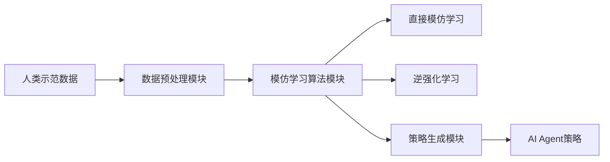

# 模仿学习：从人类示范中学习的AI Agent

> 关键词：模仿学习、AI Agent、人类示范、机器学习、策略学习

> 摘要：本文围绕模仿学习这一核心主题，深入探讨了从人类示范中学习的AI Agent相关技术。详细介绍了模仿学习的背景知识，包括其目的、预期读者、文档结构等内容。阐述了模仿学习的核心概念、算法原理、数学模型，通过Python代码给出具体实现和案例分析。还介绍了模仿学习在实际中的应用场景，推荐了相关的学习资源、开发工具和论文著作。最后总结了模仿学习的未来发展趋势与挑战，并对常见问题进行了解答。

## 1. 背景介绍 
### 1.1 目的和范围
模仿学习作为机器学习领域的一个重要分支，旨在让AI Agent能够从人类的示范中学习到有效的行为策略。本文章的目的是全面深入地介绍模仿学习的相关知识，包括其核心概念、算法原理、数学模型以及实际应用等方面。范围涵盖了从理论基础到实际项目的整个流程，旨在帮助读者系统地掌握模仿学习技术，能够在实际场景中应用和开发基于模仿学习的AI Agent。

### 1.2 预期读者
本文预期读者包括对人工智能、机器学习领域感兴趣的研究人员、开发者、学生等。对于有一定编程基础和机器学习知识的读者，本文可以帮助他们深入了解模仿学习的原理和实现方法；对于初学者，通过本文的逐步讲解和案例分析，也能够建立起对模仿学习的基本认识。

### 1.3 文档结构概述
本文将按照以下结构进行组织：首先介绍模仿学习的背景知识，包括目的、预期读者和文档结构等；接着阐述模仿学习的核心概念和它们之间的联系，并通过文本示意图和Mermaid流程图进行直观展示；然后详细讲解核心算法原理和具体操作步骤，同时使用Python源代码进行说明；再介绍模仿学习的数学模型和公式，并给出详细讲解和举例；之后通过项目实战，展示代码实际案例并进行详细解释；接着探讨模仿学习的实际应用场景；推荐相关的学习资源、开发工具和论文著作；最后总结模仿学习的未来发展趋势与挑战，解答常见问题，并提供扩展阅读和参考资料。

### 1.4 术语表
#### 1.4.1 核心术语定义
- **模仿学习（Imitation Learning）**：是一种机器学习方法，让智能体（Agent）通过观察人类或其他智能体的示范行为来学习执行任务的策略。
- **AI Agent**：具有感知环境、做出决策和执行动作能力的人工智能实体。
- **策略（Policy）**：智能体在不同状态下选择动作的规则。
- **状态（State）**：描述环境当前情况的一组变量。
- **动作（Action）**：智能体在某一状态下可以执行的操作。

#### 1.4.2 相关概念解释
- **直接模仿学习（Behavior Cloning）**：直接从示范数据中学习一个策略，使得智能体在给定状态下的动作输出尽可能接近示范动作。
- **逆强化学习（Inverse Reinforcement Learning）**：通过观察示范行为来推断奖励函数，然后基于推断出的奖励函数进行强化学习。
- **示范数据（Demonstration Data）**：由人类或其他智能体在执行任务过程中产生的状态 - 动作对序列。

#### 1.4.3 缩略词列表
- **IL**：Imitation Learning（模仿学习）
- **BC**：Behavior Cloning（直接模仿学习）
- **IRL**：Inverse Reinforcement Learning（逆强化学习）

## 2. 核心概念与联系 

### 核心概念原理
模仿学习的核心思想是让AI Agent从人类的示范中学习到如何执行任务。主要有两种常见的方法：直接模仿学习和逆强化学习。

直接模仿学习（Behavior Cloning）的原理是将示范数据看作一个监督学习问题。给定一组示范数据 $\{(s_i, a_i)\}_{i=1}^N$，其中 $s_i$ 是状态，$a_i$ 是对应的示范动作，我们的目标是学习一个策略 $\pi(a|s)$，使得对于任意状态 $s$，策略输出的动作 $a$ 尽可能接近示范动作。通常使用神经网络等模型来拟合这个策略，通过最小化预测动作和示范动作之间的损失函数来训练模型。

逆强化学习（Inverse Reinforcement Learning）则是通过观察示范行为来推断奖励函数。假设示范者的行为是为了最大化某个未知的奖励函数，我们的目标是从示范数据中推断出这个奖励函数。一旦得到奖励函数，就可以使用传统的强化学习方法来学习最优策略。

### 架构的文本示意图
```plaintext
            人类示范数据
                 |
                 v
      +-----------------+
      | 数据预处理模块 |
      +-----------------+
                 |
                 v
      +-----------------+
      | 模仿学习算法模块 |
      |  - 直接模仿学习  |
      |  - 逆强化学习    |
      +-----------------+
                 |
                 v
      +-----------------+
      | 策略生成模块    |
      +-----------------+
                 |
                 v
            AI Agent策略
```

### Mermaid流程图


## 3. 核心算法原理 & 具体操作步骤 

### 直接模仿学习（Behavior Cloning）算法原理
直接模仿学习可以看作是一个监督学习问题，我们的目标是学习一个策略 $\pi(a|s)$，使得对于给定的状态 $s$，策略输出的动作 $a$ 尽可能接近示范动作。通常使用神经网络作为策略模型，损失函数可以选择均方误差（MSE）或交叉熵损失（对于离散动作空间）。

#### Python源代码实现
```python
import torch
import torch.nn as nn
import torch.optim as optim
import numpy as np

# 定义一个简单的神经网络策略模型
class PolicyNetwork(nn.Module):
    def __init__(self, input_dim, output_dim):
        super(PolicyNetwork, self).__init__()
        self.fc1 = nn.Linear(input_dim, 64)
        self.fc2 = nn.Linear(64, output_dim)

    def forward(self, x):
        x = torch.relu(self.fc1(x))
        x = self.fc2(x)
        return x

# 生成一些示范数据
num_samples = 1000
input_dim = 10
output_dim = 2
states = np.random.randn(num_samples, input_dim)
actions = np.random.randn(num_samples, output_dim)

# 转换为PyTorch张量
states = torch.tensor(states, dtype=torch.float32)
actions = torch.tensor(actions, dtype=torch.float32)

# 初始化策略网络和优化器
policy = PolicyNetwork(input_dim, output_dim)
optimizer = optim.Adam(policy.parameters(), lr=0.001)
criterion = nn.MSELoss()

# 训练策略网络
num_epochs = 100
for epoch in range(num_epochs):
    optimizer.zero_grad()
    predicted_actions = policy(states)
    loss = criterion(predicted_actions, actions)
    loss.backward()
    optimizer.step()
    if (epoch + 1) % 10 == 0:
        print(f'Epoch [{epoch+1}/{num_epochs}], Loss: {loss.item():.4f}')

# 使用训练好的策略进行预测
test_state = torch.tensor(np.random.randn(1, input_dim), dtype=torch.float32)
predicted_action = policy(test_state)
print(f'Predicted action: {predicted_action.detach().numpy()}')
```

### 具体操作步骤
1. **数据收集**：收集人类示范数据，包括状态和对应的动作。
2. **数据预处理**：对数据进行清洗、归一化等处理，以提高模型的训练效果。
3. **模型定义**：定义一个策略模型，如神经网络。
4. **损失函数选择**：根据动作空间的类型选择合适的损失函数，如均方误差或交叉熵损失。
5. **模型训练**：使用优化器对模型进行训练，最小化损失函数。
6. **模型评估**：使用测试数据评估模型的性能。
7. **模型应用**：使用训练好的模型进行预测和决策。

## 4. 数学模型和公式 & 详细讲解 & 举例说明 

### 直接模仿学习的数学模型
在直接模仿学习中，我们的目标是学习一个策略 $\pi(a|s)$，使得对于给定的状态 $s$，策略输出的动作 $a$ 尽可能接近示范动作。假设我们有一组示范数据 $\{(s_i, a_i)\}_{i=1}^N$，我们可以定义一个损失函数 $L$ 来衡量策略输出的动作和示范动作之间的差异。

对于连续动作空间，常用的损失函数是均方误差（MSE）：
$$L(\theta) = \frac{1}{N} \sum_{i=1}^N ||\pi(s_i; \theta) - a_i||^2$$
其中 $\theta$ 是策略模型的参数，$\pi(s_i; \theta)$ 是策略模型在状态 $s_i$ 下输出的动作。

对于离散动作空间，常用的损失函数是交叉熵损失：
$$L(\theta) = -\frac{1}{N} \sum_{i=1}^N \log(\pi(a_i|s_i; \theta))$$

### 详细讲解
均方误差损失函数衡量的是策略输出的动作和示范动作之间的欧几里得距离的平方的平均值。通过最小化均方误差损失，我们可以让策略输出的动作尽可能接近示范动作。

交叉熵损失函数则是基于概率分布的概念。对于离散动作空间，策略 $\pi(a|s; \theta)$ 可以看作是在状态 $s$ 下选择每个动作的概率分布。交叉熵损失衡量的是策略输出的概率分布和示范动作的真实概率分布之间的差异。通过最小化交叉熵损失，我们可以让策略输出的动作概率分布尽可能接近示范动作的真实概率分布。

### 举例说明
假设我们有一个简单的连续动作空间的任务，状态空间是一维的，动作空间也是一维的。我们收集了一组示范数据 $\{(s_1, a_1), (s_2, a_2), (s_3, a_3)\} = \{(1, 2), (2, 4), (3, 6)\}$。我们使用一个简单的线性模型 $\pi(s; \theta) = \theta_0 + \theta_1 s$ 作为策略模型。

均方误差损失函数为：
$$L(\theta) = \frac{1}{3} \left[ (\theta_0 + \theta_1 \times 1 - 2)^2 + (\theta_0 + \theta_1 \times 2 - 4)^2 + (\theta_0 + \theta_1 \times 3 - 6)^2 \right]$$

我们的目标是找到一组参数 $\theta = (\theta_0, \theta_1)$，使得 $L(\theta)$ 最小。可以使用梯度下降等优化算法来求解这个问题。

## 5. 项目实战：代码实际案例和详细解释说明 

### 5.1  开发环境搭建
为了实现模仿学习的项目，我们需要搭建一个合适的开发环境。以下是具体的步骤：

#### 安装Python
首先，确保你已经安装了Python 3.x版本。可以从Python官方网站（https://www.python.org/downloads/）下载并安装。

#### 安装必要的库
我们需要安装一些常用的Python库，如PyTorch、NumPy等。可以使用以下命令进行安装：
```bash
pip install torch numpy
```

### 5.2  源代码详细实现和代码解读
我们以一个简单的机器人导航任务为例，展示如何使用直接模仿学习来训练一个AI Agent。

```python
import torch
import torch.nn as nn
import torch.optim as optim
import numpy as np

# 定义一个简单的神经网络策略模型
class PolicyNetwork(nn.Module):
    def __init__(self, input_dim, output_dim):
        super(PolicyNetwork, self).__init__()
        self.fc1 = nn.Linear(input_dim, 64)
        self.fc2 = nn.Linear(64, output_dim)

    def forward(self, x):
        x = torch.relu(self.fc1(x))
        x = self.fc2(x)
        return x

# 生成一些示范数据
num_samples = 1000
input_dim = 5  # 状态维度
output_dim = 2  # 动作维度
states = np.random.randn(num_samples, input_dim)
actions = np.random.randn(num_samples, output_dim)

# 转换为PyTorch张量
states = torch.tensor(states, dtype=torch.float32)
actions = torch.tensor(actions, dtype=torch.float32)

# 初始化策略网络和优化器
policy = PolicyNetwork(input_dim, output_dim)
optimizer = optim.Adam(policy.parameters(), lr=0.001)
criterion = nn.MSELoss()

# 训练策略网络
num_epochs = 100
for epoch in range(num_epochs):
    optimizer.zero_grad()
    predicted_actions = policy(states)
    loss = criterion(predicted_actions, actions)
    loss.backward()
    optimizer.step()
    if (epoch + 1) % 10 == 0:
        print(f'Epoch [{epoch+1}/{num_epochs}], Loss: {loss.item():.4f}')

# 使用训练好的策略进行预测
test_state = torch.tensor(np.random.randn(1, input_dim), dtype=torch.float32)
predicted_action = policy(test_state)
print(f'Predicted action: {predicted_action.detach().numpy()}')
```

### 代码解读与分析
1. **策略网络定义**：`PolicyNetwork` 类定义了一个简单的两层神经网络，用于学习策略。输入层的维度为 `input_dim`，输出层的维度为 `output_dim`。
2. **示范数据生成**：使用 `np.random.randn` 函数生成一些随机的状态和动作作为示范数据。
3. **数据转换**：将NumPy数组转换为PyTorch张量，以便在PyTorch中进行计算。
4. **模型初始化**：初始化策略网络和优化器，选择均方误差损失函数。
5. **模型训练**：使用循环进行多个epoch的训练，每个epoch中计算预测动作和示范动作之间的损失，然后使用反向传播更新模型参数。
6. **模型预测**：使用训练好的模型对一个随机的测试状态进行预测，并输出预测动作。

## 6. 实际应用场景 
模仿学习在许多实际场景中都有广泛的应用，以下是一些常见的应用场景：

### 机器人控制
在机器人领域，模仿学习可以让机器人从人类操作员的示范中学习到如何执行各种任务，如抓取物体、导航、操作工具等。通过观察人类的示范动作，机器人可以快速学习到有效的策略，减少了手动编程的工作量。

### 自动驾驶
在自动驾驶领域，模仿学习可以用于学习人类驾驶员的驾驶行为。通过收集大量的人类驾驶数据，训练一个AI Agent来模仿人类驾驶员的决策过程，从而实现自动驾驶。

### 游戏AI
在游戏开发中，模仿学习可以用于创建智能的游戏AI。通过观察人类玩家的游戏操作，训练一个AI Agent来模仿人类玩家的策略，提高游戏的趣味性和挑战性。

### 医疗领域
在医疗领域，模仿学习可以用于辅助医生进行诊断和治疗。例如，通过观察专家医生的诊断过程，训练一个AI Agent来模仿医生的决策，为初级医生提供参考。

## 7. 工具和资源推荐
### 7.1 学习资源推荐
#### 7.1.1 书籍推荐
- 《Reinforcement Learning: An Introduction》：这本书是强化学习领域的经典教材，其中也包含了一些关于模仿学习的内容。
- 《Deep Learning》：由Ian Goodfellow、Yoshua Bengio和Aaron Courville撰写，介绍了深度学习的基本原理和方法，对于理解模仿学习中的神经网络模型有很大帮助。

#### 7.1.2 在线课程
- Coursera上的“Reinforcement Learning Specialization”：由University of Alberta的Richard S. Sutton教授等授课，系统地介绍了强化学习的理论和实践，其中也包含了模仿学习的相关内容。
- edX上的“Deep Learning MicroMasters Program”：提供了深度学习的全面课程，对于学习模仿学习中的深度学习模型有很大帮助。

#### 7.1.3 技术博客和网站
- OpenAI Blog：OpenAI发布的最新研究成果和技术文章，其中包含了许多关于模仿学习和强化学习的内容。
- Medium上的Towards Data Science：有许多关于机器学习和人工智能的高质量文章，包括模仿学习的实践案例和技术分析。

### 7.2 开发工具框架推荐
#### 7.2.1 IDE和编辑器
- PyCharm：是一款专业的Python集成开发环境，提供了丰富的代码编辑、调试和项目管理功能。
- Jupyter Notebook：是一个交互式的开发环境，适合进行数据探索、模型实验和代码演示。

#### 7.2.2 调试和性能分析工具
- TensorBoard：是TensorFlow提供的可视化工具，可以用于监控模型的训练过程、可视化损失函数和模型结构等。
- Py-Spy：是一个轻量级的Python性能分析工具，可以帮助我们找出代码中的性能瓶颈。

#### 7.2.3 相关框架和库
- PyTorch：是一个开源的深度学习框架，提供了丰富的神经网络模型和优化算法，适合进行模仿学习的开发。
- OpenAI Gym：是一个开源的强化学习环境库，提供了许多标准的强化学习任务和环境，方便我们进行模仿学习的实验和测试。

### 7.3 相关论文著作推荐
#### 7.3.1 经典论文
- “Learning from Demonstrations”：这篇论文是模仿学习领域的经典之作，介绍了模仿学习的基本概念和方法。
- “Algorithmic Information Theory”：虽然不是专门关于模仿学习的论文，但它提供了信息论的基础，对于理解模仿学习中的一些理论问题有很大帮助。

#### 7.3.2 最新研究成果
- “Generative Adversarial Imitation Learning”：提出了一种基于生成对抗网络的模仿学习方法，取得了很好的实验效果。
- “Guided Cost Learning: Deep Inverse Optimal Control via Policy Optimization”：介绍了一种基于逆最优控制的模仿学习方法，具有较高的理论和实践价值。

#### 7.3.3 应用案例分析
- “Imitation Learning for Autonomous Driving”：分析了模仿学习在自动驾驶领域的应用案例，介绍了如何使用模仿学习来训练自动驾驶模型。
- “Robot Manipulation Learning from Human Demonstrations”：探讨了模仿学习在机器人操作领域的应用，展示了如何让机器人从人类示范中学习到操作技能。

## 8. 总结：未来发展趋势与挑战
### 未来发展趋势
- **结合其他技术**：模仿学习将与其他技术如强化学习、深度学习、计算机视觉等更加紧密地结合，以提高AI Agent的学习能力和性能。例如，将模仿学习与强化学习相结合，可以在示范数据有限的情况下，让AI Agent通过强化学习进一步优化策略。
- **多模态示范学习**：未来的模仿学习将不仅仅局限于状态 - 动作对的示范数据，还将考虑多模态的示范信息，如视觉、听觉、触觉等。通过综合利用多种模态的信息，AI Agent可以学习到更加复杂和准确的策略。
- **可解释性模仿学习**：随着AI技术的广泛应用，对AI模型的可解释性要求越来越高。未来的模仿学习研究将更加注重模型的可解释性，使得人们能够理解AI Agent为什么做出这样的决策。

### 挑战
- **示范数据的质量和数量**：模仿学习的性能很大程度上依赖于示范数据的质量和数量。获取高质量、大规模的示范数据是一个挑战，特别是在一些复杂的任务中。
- **环境的动态变化**：在实际应用中，环境往往是动态变化的。AI Agent需要能够适应环境的变化，而现有的模仿学习方法在处理动态环境时还存在一定的局限性。
- **泛化能力**：模仿学习模型需要具有良好的泛化能力，能够在未见过的状态下做出合理的决策。然而，目前的模型在泛化能力方面还存在不足，需要进一步研究和改进。

## 9. 附录：常见问题与解答
### 问题1：模仿学习和强化学习有什么区别？
模仿学习是让AI Agent从人类的示范中学习策略，而强化学习是让AI Agent通过与环境的交互，根据奖励信号来学习最优策略。模仿学习更侧重于利用已有的示范数据，而强化学习更侧重于自主探索和学习。

### 问题2：直接模仿学习有什么缺点？
直接模仿学习的一个主要缺点是它假设示范数据是完美的，并且没有考虑到环境的动态变化。如果示范数据存在噪声或偏差，或者环境发生了变化，直接模仿学习的效果可能会受到影响。此外，直接模仿学习的泛化能力相对较弱，在未见过的状态下可能表现不佳。

### 问题3：逆强化学习的计算复杂度高吗？
逆强化学习的计算复杂度通常较高，特别是在复杂的环境中。这是因为逆强化学习需要推断奖励函数，而奖励函数的推断通常是一个复杂的优化问题。为了降低计算复杂度，研究人员提出了许多近似算法和优化方法。

## 10. 扩展阅读 & 参考资料
- 扩展阅读可以进一步深入研究模仿学习的相关领域，如模仿学习在不同行业的应用案例、最新的研究成果等。可以关注相关的学术期刊和会议，如Journal of Artificial Intelligence Research、Neural Information Processing Systems (NeurIPS)等。
- 参考资料包括本文中引用的书籍、论文、网站等，以及其他相关的技术文档和开源代码。在实际应用中，可以参考这些资料来深入学习和实现模仿学习算法。

作者：AI天才研究院/AI Genius Institute & 禅与计算机程序设计艺术 /Zen And The Art of Computer Programming