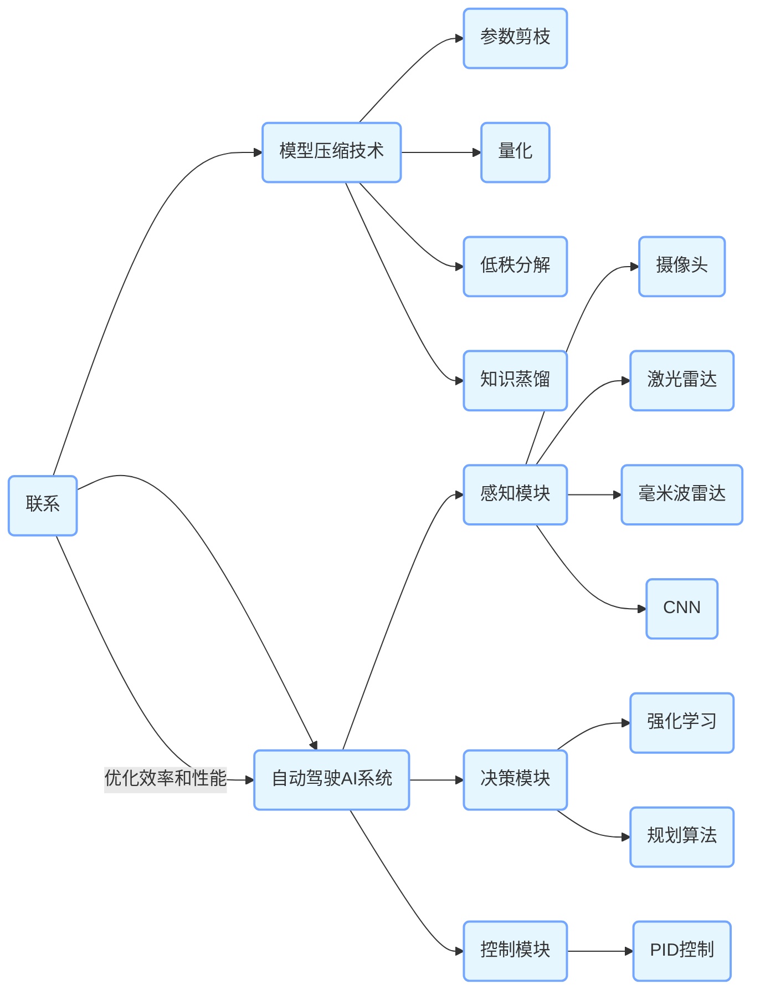

# 模型压缩技术在自动驾驶AI系统中的优化

> 关键词：模型压缩技术、自动驾驶AI系统、优化、深度学习、计算资源

> 摘要：本文聚焦于模型压缩技术在自动驾驶AI系统中的优化应用。详细阐述了模型压缩技术的核心概念、算法原理、数学模型等内容，通过实际项目案例展示了其在自动驾驶场景中的具体实现。同时探讨了该技术在自动驾驶领域的实际应用场景，推荐了相关的学习资源、开发工具和论文著作。最后总结了未来发展趋势与挑战，并对常见问题进行了解答。旨在为相关领域的研究者和开发者提供全面且深入的参考，以推动自动驾驶AI系统的高效发展。

## 1. 背景介绍 
### 1.1 目的和范围
随着自动驾驶技术的飞速发展，AI系统在其中扮演着至关重要的角色。然而，现有的深度学习模型通常具有庞大的参数和复杂的结构，这对自动驾驶车辆的计算资源、存储容量和功耗提出了极高的要求。模型压缩技术旨在通过减少模型的参数数量、降低计算复杂度等方式，在不显著损失模型性能的前提下，优化自动驾驶AI系统的效率和性能。本文的范围将涵盖模型压缩技术的核心原理、具体实现方法、在自动驾驶场景中的应用案例以及相关的工具和资源推荐等方面。

### 1.2 预期读者
本文预期读者包括自动驾驶领域的研究者、开发者、工程师，以及对深度学习和模型压缩技术感兴趣的相关专业人士。同时，也适合计算机科学、人工智能等专业的学生作为学习参考资料。

### 1.3 文档结构概述
本文将按照以下结构进行组织：首先介绍模型压缩技术和自动驾驶AI系统的核心概念及其联系；接着详细阐述核心算法原理和具体操作步骤，并结合Python源代码进行说明；然后给出相关的数学模型和公式，并举例讲解；通过实际项目案例展示模型压缩技术在自动驾驶中的具体应用；探讨其在自动驾驶中的实际应用场景；推荐相关的学习资源、开发工具和论文著作；最后总结未来发展趋势与挑战，解答常见问题，并提供扩展阅读和参考资料。

### 1.4 术语表
#### 1.4.1 核心术语定义
- **模型压缩技术**：指通过一系列方法减少深度学习模型的参数数量、计算复杂度和存储需求，同时尽量保持模型性能的技术。
- **自动驾驶AI系统**：利用人工智能技术实现车辆自主驾驶的系统，包括感知、决策和控制等多个模块。
- **深度学习模型**：基于人工神经网络的机器学习模型，具有多层结构，能够自动从大量数据中学习特征和模式。
- **参数剪枝**：一种模型压缩方法，通过去除模型中对性能影响较小的参数来减少模型的复杂度。
- **量化**：将模型中的浮点参数转换为低精度表示，以减少存储和计算需求。

#### 1.4.2 相关概念解释
- **稀疏性**：在模型中，稀疏性指的是大部分参数为零的特性。参数剪枝可以增加模型的稀疏性，从而减少计算量。
- **低秩分解**：一种矩阵分解技术，通过将高维矩阵分解为低秩矩阵的乘积来减少模型的参数数量。
- **知识蒸馏**：一种模型压缩方法，通过让一个小模型学习一个大模型的输出，从而使小模型具有与大模型相近的性能。

#### 1.4.3 缩略词列表
- **CNN**：Convolutional Neural Network，卷积神经网络
- **DNN**：Deep Neural Network，深度神经网络
- **RNN**：Recurrent Neural Network，循环神经网络
- **FP32**：32位浮点数
- **INT8**：8位整数

## 2. 核心概念与联系 
### 2.1 模型压缩技术核心概念
模型压缩技术主要包括参数剪枝、量化、低秩分解和知识蒸馏等方法。

#### 参数剪枝
参数剪枝是通过去除模型中对性能影响较小的参数来减少模型的复杂度。具体来说，可以根据参数的绝对值大小、梯度信息等指标来判断参数的重要性，将不重要的参数置为零。例如，在一个全连接层中，如果某个神经元的权重绝对值非常小，那么可以认为该神经元对模型的输出影响不大，可以将其权重置为零。

#### 量化
量化是将模型中的浮点参数转换为低精度表示，如8位整数（INT8）或16位浮点数（FP16）。量化可以显著减少模型的存储需求和计算量。例如，一个32位浮点数（FP32）的参数可以转换为8位整数表示，这样存储需求可以减少为原来的四分之一。

#### 低秩分解
低秩分解是一种矩阵分解技术，通过将高维矩阵分解为低秩矩阵的乘积来减少模型的参数数量。例如，在卷积层中，可以将卷积核矩阵分解为两个低秩矩阵的乘积，从而减少卷积操作的计算量。

#### 知识蒸馏
知识蒸馏是一种模型压缩方法，通过让一个小模型（学生模型）学习一个大模型（教师模型）的输出，从而使小模型具有与大模型相近的性能。具体来说，教师模型在训练数据上进行训练，得到一个复杂的模型。然后，学生模型在相同的训练数据上进行训练，同时以教师模型的输出作为软标签，引导学生模型的学习。

### 2.2 自动驾驶AI系统核心概念
自动驾驶AI系统主要包括感知、决策和控制三个模块。

#### 感知模块
感知模块负责获取车辆周围的环境信息，如道路、交通标志、其他车辆和行人等。常用的传感器包括摄像头、激光雷达、毫米波雷达等。感知模块通常使用深度学习模型，如卷积神经网络（CNN），来对传感器数据进行处理和分析，以识别和定位目标物体。

#### 决策模块
决策模块根据感知模块提供的环境信息，制定车辆的行驶策略。决策模块通常使用强化学习、规划算法等技术来实现。例如，在遇到交通堵塞时，决策模块可以根据实时交通信息和车辆的目的地，选择一条最优的行驶路线。

#### 控制模块
控制模块根据决策模块制定的行驶策略，控制车辆的动力系统、转向系统和制动系统等，实现车辆的自主驾驶。控制模块通常使用反馈控制算法，如PID控制，来确保车辆的行驶稳定性和安全性。

### 2.3 模型压缩技术与自动驾驶AI系统的联系
模型压缩技术在自动驾驶AI系统中具有重要的应用价值。由于自动驾驶车辆的计算资源和存储容量有限，而深度学习模型通常具有庞大的参数和复杂的结构，因此需要对模型进行压缩以提高系统的效率和性能。具体来说，模型压缩技术可以减少模型的存储需求，降低计算复杂度，从而提高模型的推理速度和实时性。同时，模型压缩技术还可以减少车辆的功耗，延长电池续航时间。

### 2.4 文本示意图
```plaintext
模型压缩技术
|-- 参数剪枝
|-- 量化
|-- 低秩分解
|-- 知识蒸馏

自动驾驶AI系统
|-- 感知模块
|   |-- 摄像头
|   |-- 激光雷达
|   |-- 毫米波雷达
|   |-- CNN
|-- 决策模块
|   |-- 强化学习
|   |-- 规划算法
|-- 控制模块
|   |-- PID控制

联系：模型压缩技术优化自动驾驶AI系统的效率和性能
```

### 2.5 Mermaid流程图


## 3. 核心算法原理 & 具体操作步骤 
### 3.1 参数剪枝算法原理及Python实现
#### 算法原理
参数剪枝的基本思想是根据参数的重要性对模型的参数进行排序，然后将不重要的参数置为零。常用的参数重要性指标包括参数的绝对值大小、梯度信息等。一种简单的参数剪枝方法是基于阈值的剪枝，即设置一个阈值，将绝对值小于该阈值的参数置为零。

#### Python实现
```python
import torch
import torch.nn as nn

# 定义一个简单的神经网络模型
class SimpleNet(nn.Module):
    def __init__(self):
        super(SimpleNet, self).__init__()
        self.fc1 = nn.Linear(10, 20)
        self.fc2 = nn.Linear(20, 1)

    def forward(self, x):
        x = torch.relu(self.fc1(x))
        x = self.fc2(x)
        return x

# 创建模型实例
model = SimpleNet()

# 定义剪枝阈值
threshold = 0.1

# 遍历模型的所有参数
for name, param in model.named_parameters():
    if 'weight' in name:  # 只对权重参数进行剪枝
        mask = torch.abs(param) > threshold
        param.data *= mask.float()

# 打印剪枝后的模型参数
for name, param in model.named_parameters():
    print(f'{name}: {param.data}')
```

### 3.2 量化算法原理及Python实现
#### 算法原理
量化的基本思想是将浮点参数映射到一个有限的整数范围内。常见的量化方法包括线性量化和非线性量化。线性量化是将浮点参数通过线性变换映射到整数范围内，其公式为：

$$q = \text{round}\left(\frac{x - z}{s}\right)$$

其中，$x$ 是浮点参数，$q$ 是量化后的整数，$s$ 是缩放因子，$z$ 是零点。

#### Python实现
```python
import torch
import torch.nn as nn

# 定义一个简单的神经网络模型
class SimpleNet(nn.Module):
    def __init__(self):
        super(SimpleNet, self).__init__()
        self.fc1 = nn.Linear(10, 20)
        self.fc2 = nn.Linear(20, 1)

    def forward(self, x):
        x = torch.relu(self.fc1(x))
        x = self.fc2(x)
        return x

# 创建模型实例
model = SimpleNet()

# 定义量化参数
scale = 0.1
zero_point = 0

# 量化模型的权重参数
for name, param in model.named_parameters():
    if 'weight' in name:
        q_param = torch.round((param - zero_point) / scale)
        param.data = q_param * scale + zero_point

# 打印量化后的模型参数
for name, param in model.named_parameters():
    print(f'{name}: {param.data}')
```

### 3.3 低秩分解算法原理及Python实现
#### 算法原理
低秩分解的基本思想是将高维矩阵分解为低秩矩阵的乘积。在卷积层中，可以将卷积核矩阵分解为两个低秩矩阵的乘积，从而减少卷积操作的计算量。常见的低秩分解方法包括奇异值分解（SVD）。

#### Python实现
```python
import torch
import torch.nn as nn
import torch.linalg as linalg

# 定义一个简单的卷积层
conv_layer = nn.Conv2d(3, 16, kernel_size=3, padding=1)

# 获取卷积核权重
weight = conv_layer.weight.data

# 进行奇异值分解
U, S, Vh = linalg.svd(weight.view(weight.size(0), -1))

# 选择前k个奇异值
k = 8
U_k = U[:, :k]
S_k = torch.diag(S[:k])
Vh_k = Vh[:k, :]

# 重构卷积核权重
weight_reconstructed = torch.matmul(U_k, torch.matmul(S_k, Vh_k)).view(weight.size())

# 更新卷积层的权重
conv_layer.weight.data = weight_reconstructed

# 打印重构后的卷积核权重
print(f'Reconstructed weight: {conv_layer.weight.data}')
```

### 3.4 知识蒸馏算法原理及Python实现
#### 算法原理
知识蒸馏的基本思想是让一个小模型（学生模型）学习一个大模型（教师模型）的输出。具体来说，教师模型在训练数据上进行训练，得到一个复杂的模型。然后，学生模型在相同的训练数据上进行训练，同时以教师模型的输出作为软标签，引导学生模型的学习。知识蒸馏的损失函数通常由两部分组成：一部分是学生模型的预测结果与真实标签之间的交叉熵损失，另一部分是学生模型的预测结果与教师模型的输出之间的软标签损失。

#### Python实现
```python
import torch
import torch.nn as nn
import torch.optim as optim

# 定义教师模型
class TeacherNet(nn.Module):
    def __init__(self):
        super(TeacherNet, self).__init__()
        self.fc1 = nn.Linear(10, 20)
        self.fc2 = nn.Linear(20, 1)

    def forward(self, x):
        x = torch.relu(self.fc1(x))
        x = self.fc2(x)
        return x

# 定义学生模型
class StudentNet(nn.Module):
    def __init__(self):
        super(StudentNet, self).__init__()
        self.fc1 = nn.Linear(10, 10)
        self.fc2 = nn.Linear(10, 1)

    def forward(self, x):
        x = torch.relu(self.fc1(x))
        x = self.fc2(x)
        return x

# 创建教师模型和学生模型实例
teacher_model = TeacherNet()
student_model = StudentNet()

# 定义损失函数和优化器
criterion_ce = nn.CrossEntropyLoss()
criterion_kd = nn.KLDivLoss()
optimizer = optim.Adam(student_model.parameters(), lr=0.001)

# 定义温度参数
T = 2

# 模拟训练数据
x = torch.randn(10, 10)
y = torch.randint(0, 1, (10,))

# 训练学生模型
for epoch in range(100):
    # 教师模型的输出
    teacher_output = teacher_model(x)

    # 学生模型的输出
    student_output = student_model(x)

    # 计算交叉熵损失
    loss_ce = criterion_ce(student_output, y)

    # 计算软标签损失
    loss_kd = criterion_kd(torch.log_softmax(student_output / T, dim=1),
                           torch.softmax(teacher_output / T, dim=1))

    # 总损失
    loss = loss_ce + loss_kd

    # 反向传播和优化
    optimizer.zero_grad()
    loss.backward()
    optimizer.step()

    if (epoch + 1) % 10 == 0:
        print(f'Epoch {epoch + 1}, Loss: {loss.item()}')
```

## 4. 数学模型和公式 & 详细讲解 & 举例说明 
### 4.1 参数剪枝的数学模型和公式
#### 数学模型
参数剪枝可以看作是一个优化问题，其目标是在减少模型参数数量的同时，尽量保持模型的性能。设 $W$ 是模型的参数矩阵，$L(W)$ 是模型的损失函数，$|W|_0$ 是参数矩阵 $W$ 的零范数（即非零元素的个数）。参数剪枝的优化问题可以表示为：

$$\min_{W} L(W) + \lambda |W|_0$$

其中，$\lambda$ 是一个正则化参数，用于平衡模型的性能和参数数量。

#### 详细讲解
由于零范数 $|W|_0$ 是非凸的，求解上述优化问题是一个NP难问题。因此，通常采用近似方法，如基于阈值的剪枝。基于阈值的剪枝方法可以表示为：

$$W_{ij} = \begin{cases}
W_{ij}, & |W_{ij}| \geq \theta \\
0, & |W_{ij}| < \theta
\end{cases}$$

其中，$\theta$ 是剪枝阈值。

#### 举例说明
假设我们有一个简单的参数矩阵 $W$：

$$W = \begin{bmatrix}
0.1 & 0.2 & -0.05 \\
-0.3 & 0.02 & 0.15
\end{bmatrix}$$

如果我们设置剪枝阈值 $\theta = 0.1$，则剪枝后的参数矩阵为：

$$W' = \begin{bmatrix}
0.1 & 0.2 & 0 \\
-0.3 & 0 & 0.15
\end{bmatrix}$$

### 4.2 量化的数学模型和公式
#### 数学模型
线性量化的数学模型可以表示为：

$$q = \text{round}\left(\frac{x - z}{s}\right)$$

$$x' = s \cdot q + z$$

其中，$x$ 是浮点参数，$q$ 是量化后的整数，$s$ 是缩放因子，$z$ 是零点，$x'$ 是反量化后的浮点参数。

#### 详细讲解
缩放因子 $s$ 和零点 $z$ 的计算方法通常有两种：对称量化和非对称量化。对称量化的缩放因子和零点的计算公式为：

$$s = \frac{\max(|x|)}{\text{Q}_{max}}$$

$$z = 0$$

其中，$\text{Q}_{max}$ 是量化整数的最大值。非对称量化的缩放因子和零点的计算公式为：

$$s = \frac{\max(x) - \min(x)}{\text{Q}_{max} - \text{Q}_{min}}$$

$$z = \text{round}\left(\text{Q}_{min} - \frac{\min(x)}{s}\right)$$

其中，$\text{Q}_{min}$ 是量化整数的最小值。

#### 举例说明
假设我们要将浮点参数 $x = [0.1, 0.2, -0.05]$ 量化为8位整数（$\text{Q}_{min} = -128$，$\text{Q}_{max} = 127$）。采用对称量化方法，首先计算缩放因子：

$$s = \frac{\max(|x|)}{\text{Q}_{max}} = \frac{0.2}{127} \approx 0.00157$$

然后计算量化后的整数：

$$q = \text{round}\left(\frac{x}{s}\right) = \text{round}\left(\frac{[0.1, 0.2, -0.05]}{0.00157}\right) \approx [64, 127, -32]$$

最后进行反量化：

$$x' = s \cdot q = 0.00157 \cdot [64, 127, -32] \approx [0.1, 0.2, -0.05]$$

### 4.3 低秩分解的数学模型和公式
#### 数学模型
奇异值分解（SVD）是一种常用的低秩分解方法。对于一个矩阵 $A \in \mathbb{R}^{m \times n}$，其奇异值分解可以表示为：

$$A = U \Sigma V^T$$

其中，$U \in \mathbb{R}^{m \times m}$ 是左奇异矩阵，$\Sigma \in \mathbb{R}^{m \times n}$ 是对角矩阵，其对角元素为奇异值，$V \in \mathbb{R}^{n \times n}$ 是右奇异矩阵。

#### 详细讲解
在低秩分解中，我们可以选择前 $k$ 个奇异值和对应的奇异向量来重构矩阵 $A$，即：

$$A_k = U_k \Sigma_k V_k^T$$

其中，$U_k \in \mathbb{R}^{m \times k}$，$\Sigma_k \in \mathbb{R}^{k \times k}$，$V_k \in \mathbb{R}^{n \times k}$。通过选择合适的 $k$ 值，可以在一定程度上减少矩阵 $A$ 的参数数量。

#### 举例说明
假设我们有一个矩阵 $A$：

$$A = \begin{bmatrix}
1 & 2 & 3 \\
4 & 5 & 6 \\
7 & 8 & 9
\end{bmatrix}$$

对矩阵 $A$ 进行奇异值分解，得到：

$$U = \begin{bmatrix}
-0.2148 & -0.8872 & -0.4082 \\
-0.5206 & -0.2496 & 0.8165 \\
-0.8263 & 0.3879 & -0.4082
\end{bmatrix}$$

$$\Sigma = \begin{bmatrix}
16.8481 & 0 & 0 \\
0 & 1.0684 & 0 \\
0 & 0 & 0
\end{bmatrix}$$

$$V = \begin{bmatrix}
-0.4797 & -0.7767 & -0.4082 \\
-0.5724 & -0.0757 & 0.8165 \\
-0.6651 & 0.6253 & -0.4082
\end{bmatrix}$$

如果我们选择前 $k = 2$ 个奇异值和对应的奇异向量来重构矩阵 $A$，则：

$$U_2 = \begin{bmatrix}
-0.2148 & -0.8872 \\
-0.5206 & -0.2496 \\
-0.8263 & 0.3879
\end{bmatrix}$$

$$\Sigma_2 = \begin{bmatrix}
16.8481 & 0 \\
0 & 1.0684
\end{bmatrix}$$

$$V_2 = \begin{bmatrix}
-0.4797 & -0.7767 \\
-0.5724 & -0.0757 \\
-0.6651 & 0.6253
\end{bmatrix}$$

重构后的矩阵 $A_2$ 为：

$$A_2 = U_2 \Sigma_2 V_2^T \approx \begin{bmatrix}
1 & 2 & 3 \\
4 & 5 & 6 \\
7 & 8 & 9
\end{bmatrix}$$

### 4.4 知识蒸馏的数学模型和公式
#### 数学模型
知识蒸馏的损失函数通常由两部分组成：交叉熵损失和软标签损失。设 $y$ 是真实标签，$\hat{y}_s$ 是学生模型的预测结果，$\hat{y}_t$ 是教师模型的输出，$T$ 是温度参数。知识蒸馏的损失函数可以表示为：

$$L = \alpha \cdot \text{CE}(\hat{y}_s, y) + (1 - \alpha) \cdot T^2 \cdot \text{KL}\left(\text{softmax}\left(\frac{\hat{y}_s}{T}\right), \text{softmax}\left(\frac{\hat{y}_t}{T}\right)\right)$$

其中，$\text{CE}$ 是交叉熵损失函数，$\text{KL}$ 是KL散度损失函数，$\alpha$ 是一个权重参数，用于平衡交叉熵损失和软标签损失。

#### 详细讲解
交叉熵损失函数用于衡量学生模型的预测结果与真实标签之间的差异，软标签损失函数用于衡量学生模型的预测结果与教师模型的输出之间的差异。温度参数 $T$ 用于控制软标签的平滑程度，当 $T$ 较大时，软标签更加平滑，能够提供更多的知识信息。

#### 举例说明
假设我们有一个二分类问题，真实标签 $y = [1, 0]$，学生模型的预测结果 $\hat{y}_s = [0.8, 0.2]$，教师模型的输出 $\hat{y}_t = [0.9, 0.1]$，温度参数 $T = 2$，权重参数 $\alpha = 0.5$。

首先计算交叉熵损失：

$$\text{CE}(\hat{y}_s, y) = -\sum_{i=1}^2 y_i \log(\hat{y}_{s_i}) = - (1 \cdot \log(0.8) + 0 \cdot \log(0.2)) \approx 0.2231$$

然后计算软标签损失：

$$\text{softmax}\left(\frac{\hat{y}_s}{T}\right) = \text{softmax}\left(\frac{[0.8, 0.2]}{2}\right) \approx [0.6225, 0.3775]$$

$$\text{softmax}\left(\frac{\hat{y}_t}{T}\right) = \text{softmax}\left(\frac{[0.9, 0.1]}{2}\right) \approx [0.6457, 0.3543]$$

$$\text{KL}\left(\text{softmax}\left(\frac{\hat{y}_s}{T}\right), \text{softmax}\left(\frac{\hat{y}_t}{T}\right)\right) \approx 0.0112$$

最后计算总损失：

$$L = 0.5 \cdot 0.2231 + (1 - 0.5) \cdot 2^2 \cdot 0.0112 \approx 0.1373$$

## 5. 项目实战：代码实际案例和详细解释说明 
### 5.1  开发环境搭建
#### 安装Python
首先需要安装Python环境，建议使用Python 3.7及以上版本。可以从Python官方网站（https://www.python.org/downloads/） 下载并安装。

#### 安装深度学习框架
本文使用PyTorch作为深度学习框架，可以通过以下命令安装：

```bash
pip install torch torchvision
```

#### 安装其他依赖库
还需要安装一些其他的依赖库，如NumPy、Matplotlib等，可以通过以下命令安装：

```bash
pip install numpy matplotlib
```

### 5.2  源代码详细实现和代码解读
#### 项目背景
我们将实现一个简单的自动驾驶目标检测模型，并使用模型压缩技术对其进行优化。目标检测模型使用Faster R-CNN，数据集使用PASCAL VOC 2007。

#### 代码实现

```python
import torch
import torchvision
from torchvision.models.detection import fasterrcnn_resnet50_fpn
from torchvision.transforms import functional as F
from torch.utils.data import DataLoader
from torchvision.datasets import VOCDetection
import torch.optim as optim
import torch.nn as nn

# 定义数据集和数据加载器
def get_dataset():
    train_dataset = VOCDetection(root='./data', year='2007', image_set='train', download=True)
    test_dataset = VOCDetection(root='./data', year='2007', image_set='test', download=True)
    return train_dataset, test_dataset

def get_dataloader(train_dataset, test_dataset):
    train_dataloader = DataLoader(train_dataset, batch_size=4, shuffle=True)
    test_dataloader = DataLoader(test_dataset, batch_size=4, shuffle=False)
    return train_dataloader, test_dataloader

# 定义模型
def get_model():
    model = fasterrcnn_resnet50_fpn(pretrained=True)
    num_classes = 21  # PASCAL VOC有20个类别加上背景
    in_features = model.roi_heads.box_predictor.cls_score.in_features
    model.roi_heads.box_predictor = torchvision.models.detection.faster_rcnn.FastRCNNPredictor(in_features, num_classes)
    return model

# 训练模型
def train_model(model, train_dataloader, test_dataloader, num_epochs=10):
    device = torch.device('cuda' if torch.cuda.is_available() else 'cpu')
    model.to(device)

    params = [p for p in model.parameters() if p.requires_grad]
    optimizer = optim.SGD(params, lr=0.005, momentum=0.9, weight_decay=0.0005)

    for epoch in range(num_epochs):
        model.train()
        for images, targets in train_dataloader:
            images = list(F.to_tensor(img).to(device) for img in images)
            targets = [{k: v.to(device) for k, v in t.items()} for t in targets]

            loss_dict = model(images, targets)
            losses = sum(loss for loss in loss_dict.values())

            optimizer.zero_grad()
            losses.backward()
            optimizer.step()

        print(f'Epoch {epoch + 1}/{num_epochs}, Loss: {losses.item()}')

    return model

# 模型压缩 - 参数剪枝
def prune_model(model, threshold=0.1):
    for name, param in model.named_parameters():
        if 'weight' in name:
            mask = torch.abs(param) > threshold
            param.data *= mask.float()
    return model

# 主函数
def main():
    train_dataset, test_dataset = get_dataset()
    train_dataloader, test_dataloader = get_dataloader(train_dataset, test_dataset)
    model = get_model()
    model = train_model(model, train_dataloader, test_dataloader)
    pruned_model = prune_model(model)

    # 可以在这里对剪枝后的模型进行评估
    #...

if __name__ == '__main__':
    main()
```

#### 代码解读
1. **数据集和数据加载器**：使用`torchvision.datasets.VOCDetection`加载PASCAL VOC 2007数据集，并使用`torch.utils.data.DataLoader`创建数据加载器。
2. **模型定义**：使用`torchvision.models.detection.fasterrcnn_resnet50_fpn`定义Faster R-CNN模型，并根据PASCAL VOC数据集的类别数调整模型的输出层。
3. **模型训练**：使用随机梯度下降（SGD）优化器对模型进行训练，训练过程中计算损失并进行反向传播和参数更新。
4. **模型压缩**：使用参数剪枝方法对训练好的模型进行压缩，将绝对值小于阈值的参数置为零。

### 5.3  代码解读与分析
#### 代码优点
- **简洁易懂**：代码结构清晰，每个函数的功能明确，易于理解和修改。
- **可扩展性强**：可以很容易地添加其他模型压缩方法，如量化、低秩分解和知识蒸馏等。
- **使用了预训练模型**：使用预训练的Faster R-CNN模型可以加快模型的训练速度，提高模型的性能。

#### 代码缺点
- **缺乏评估部分**：代码中没有对剪枝后的模型进行评估，无法直观地了解模型压缩对性能的影响。
- **参数调优不足**：模型训练和压缩的参数（如学习率、剪枝阈值等）都是固定的，没有进行调优，可能无法达到最佳的性能。

#### 改进建议
- **添加评估部分**：在模型压缩后，添加对模型的评估代码，如计算准确率、召回率等指标，以评估模型压缩对性能的影响。
- **参数调优**：使用网格搜索、随机搜索等方法对模型训练和压缩的参数进行调优，以找到最佳的参数组合。

## 6. 实际应用场景 
### 6.1 目标检测与识别
在自动驾驶中，目标检测与识别是感知模块的重要任务。通过使用模型压缩技术，可以减少目标检测模型的参数数量和计算复杂度，从而提高模型的推理速度和实时性。例如，在车辆行驶过程中，需要实时检测和识别道路上的交通标志、其他车辆和行人等目标物体。使用压缩后的目标检测模型可以更快地完成检测任务，为决策模块提供及时的信息。

### 6.2 场景理解与语义分割
场景理解与语义分割是自动驾驶中的另一个重要任务，它可以帮助车辆理解周围的环境，为决策模块提供更全面的信息。模型压缩技术可以应用于语义分割模型，减少模型的存储需求和计算量，提高模型的效率。例如，在复杂的城市环境中，语义分割模型可以将图像中的不同物体（如道路、建筑物、树木等）进行分类和分割，为车辆提供更准确的环境信息。

### 6.3 路径规划与决策
路径规划与决策是自动驾驶的核心任务之一，它需要根据感知模块提供的环境信息，制定车辆的行驶策略。模型压缩技术可以应用于路径规划和决策模型，减少模型的计算复杂度，提高决策的速度和准确性。例如，在遇到交通堵塞时，路径规划模型可以根据实时交通信息和车辆的目的地，选择一条最优的行驶路线。

### 6.4 传感器融合
在自动驾驶中，通常需要使用多种传感器（如摄像头、激光雷达、毫米波雷达等）来获取车辆周围的环境信息。传感器融合技术可以将不同传感器的数据进行融合，提高环境感知的准确性和可靠性。模型压缩技术可以应用于传感器融合模型，减少模型的计算量和存储需求，提高融合的效率。例如，将摄像头和激光雷达的数据进行融合，可以更准确地检测和识别目标物体。

## 7. 工具和资源推荐
### 7.1 学习资源推荐
#### 7.1.1 书籍推荐
- 《深度学习》（Deep Learning）：由Ian Goodfellow、Yoshua Bengio和Aaron Courville所著，是深度学习领域的经典教材，涵盖了深度学习的基本原理、算法和应用。
- 《动手学深度学习》（Dive into Deep Learning）：由 Aston Zhang、Zachary C. Lipton、Mu Li和Alexander J. Smola所著，提供了丰富的代码示例和实践项目，适合初学者快速上手深度学习。
- 《自动驾驶：技术、法律和社会影响》（Autonomous Vehicles: Technology, Law, and Society）：由Ryan Calo和Bryant Walker Smith所著，介绍了自动驾驶技术的发展现状、法律和社会影响等方面的内容。

#### 7.1.2 在线课程
- Coursera上的“深度学习专项课程”（Deep Learning Specialization）：由Andrew Ng教授授课，包括五门课程，涵盖了深度学习的各个方面，是学习深度学习的优质课程。
- edX上的“自动驾驶基础”（Fundamentals of Self-Driving Cars）：由Udacity和Waymo联合提供，介绍了自动驾驶技术的基本原理和关键技术。
- 中国大学MOOC上的“人工智能基础”（Fundamentals of Artificial Intelligence）：由清华大学的朱军教授授课，讲解了人工智能的基本概念、算法和应用。

#### 7.1.3 技术博客和网站
- Medium上的Towards Data Science：是一个专注于数据科学和机器学习的技术博客，提供了大量的技术文章和案例分析。
- arXiv：是一个预印本数据库，收录了大量的计算机科学、数学、物理学等领域的研究论文，是获取最新研究成果的重要渠道。
- OpenAI博客：OpenAI的官方博客，发布了许多关于人工智能的研究成果和技术进展。

### 7.2 开发工具框架推荐
#### 7.2.1 IDE和编辑器
- PyCharm：是一款专门为Python开发设计的集成开发环境（IDE），提供了丰富的功能和插件，适合开发深度学习项目。
- Jupyter Notebook：是一个交互式的开发环境，支持Python、R等多种编程语言，适合进行数据分析和模型实验。
- Visual Studio Code：是一款轻量级的代码编辑器，支持多种编程语言和插件，适合快速开发和调试代码。

#### 7.2.2 调试和性能分析工具
- PyTorch Profiler：是PyTorch提供的性能分析工具，可以帮助开发者分析模型的性能瓶颈，优化模型的计算效率。
- TensorBoard：是TensorFlow提供的可视化工具，也可以与PyTorch结合使用，用于可视化模型的训练过程和性能指标。
- NVIDIA Nsight Systems：是NVIDIA提供的性能分析工具，专门用于分析GPU计算性能，可以帮助开发者优化深度学习模型在GPU上的运行效率。

#### 7.2.3 相关框架和库
- PyTorch：是一个开源的深度学习框架，提供了丰富的神经网络层和优化算法，易于使用和扩展。
- TensorFlow：是另一个广泛使用的深度学习框架，提供了分布式训练、模型部署等功能，适合大规模的深度学习项目。
- OpenCV：是一个开源的计算机视觉库，提供了丰富的图像处理和计算机视觉算法，可用于自动驾驶中的图像和视频处理。

### 7.3 相关论文著作推荐
#### 7.3.1 经典论文
- “Deep Residual Learning for Image Recognition”（Kaiming He等，2015）：提出了残差网络（ResNet），解决了深度神经网络训练中的梯度消失问题，是深度学习领域的经典论文。
- “Faster R-CNN: Towards Real-Time Object Detection with Region Proposal Networks”（Shaoqing Ren等，2015）：提出了Faster R-CNN目标检测模型，实现了目标检测的实时性，是目标检测领域的重要论文。
- “Distilling the Knowledge in a Neural Network”（Geoffrey Hinton等，2015）：提出了知识蒸馏的概念，为模型压缩提供了一种有效的方法。

#### 7.3.2 最新研究成果
- 关注arXiv上的最新研究论文，特别是关于模型压缩、自动驾驶等领域的论文。例如，一些研究提出了新的模型压缩方法，如基于注意力机制的剪枝方法、自适应量化方法等。
- 参加相关的学术会议，如CVPR（计算机视觉与模式识别会议）、ICCV（国际计算机视觉会议）、NeurIPS（神经信息处理系统大会）等，了解最新的研究动态和成果。

#### 7.3.3 应用案例分析
- 阅读一些自动驾驶公司的技术博客和报告，了解他们在模型压缩和自动驾驶技术应用方面的经验和案例。例如，特斯拉、Waymo等公司会发布一些关于自动驾驶技术的研究和应用成果。
- 参考一些开源的自动驾驶项目，如Autoware、Apollo等，学习他们的代码实现和技术方案。

## 8. 总结：未来发展趋势与挑战
### 8.1 未来发展趋势
#### 更高效的模型压缩方法
未来，研究人员将继续探索更高效的模型压缩方法，以进一步减少模型的参数数量和计算复杂度。例如，结合多种压缩方法的混合压缩技术、基于强化学习的自适应压缩方法等。

#### 与硬件的深度融合
模型压缩技术将与硬件进行更深度的融合，以充分发挥硬件的性能优势。例如，针对特定的硬件平台（如GPU、FPGA等）设计优化的压缩算法，提高模型在硬件上的运行效率。

#### 端到端的自动驾驶系统优化
未来的研究将更加注重端到端的自动驾驶系统优化，将模型压缩技术应用于整个自动驾驶系统的各个模块，实现系统级的性能提升。

#### 跨领域的应用拓展
模型压缩技术不仅可以应用于自动驾驶领域，还可以拓展到其他领域，如智能安防、医疗影像诊断等。未来，模型压缩技术将在更多领域发挥重要作用。

### 8.2 挑战
#### 性能损失与压缩率的平衡
在进行模型压缩时，需要在减少模型参数数量和计算复杂度的同时，尽量保持模型的性能。如何找到性能损失与压缩率之间的最佳平衡点，是模型压缩技术面临的一个重要挑战。

#### 数据隐私和安全问题
在自动驾驶中，车辆收集的大量数据包含了用户的隐私信息。模型压缩过程中需要处理这些数据，如何保证数据的隐私和安全是一个亟待解决的问题。

#### 硬件兼容性问题
不同的硬件平台具有不同的计算能力和存储容量，模型压缩算法需要考虑硬件的兼容性。如何设计出能够在多种硬件平台上高效运行的压缩算法，是一个挑战。

#### 实时性要求
自动驾驶系统对实时性要求非常高，模型压缩后的推理速度需要满足实时性要求。如何在保证模型性能的前提下，进一步提高模型的推理速度，是模型压缩技术在自动驾驶领域面临的一个挑战。

## 9. 附录：常见问题与解答
### 9.1 模型压缩会导致模型性能大幅下降吗？
模型压缩在一定程度上会导致模型性能的下降，但通过合理选择压缩方法和参数，可以在减少模型复杂度的同时，尽量保持模型的性能。例如，在参数剪枝中，可以通过设置合适的剪枝阈值，去除对模型性能影响较小的参数，从而减少模型的参数数量，同时不会显著降低模型的性能。

### 9.2 模型压缩技术适用于所有类型的深度学习模型吗？
模型压缩技术适用于大多数类型的深度学习模型，包括卷积神经网络（CNN）、循环神经网络（RNN）、深度神经网络（DNN）等。不同的压缩方法对不同类型的模型可能有不同的效果，需要根据具体的模型和应用场景选择合适的压缩方法。

### 9.3 如何评估模型压缩的效果？
可以从多个方面评估模型压缩的效果，包括模型的参数数量、计算复杂度、推理速度、准确率、召回率等指标。通过比较压缩前后模型的这些指标，可以评估模型压缩的效果。例如，如果压缩后模型的参数数量显著减少，推理速度明显提高，同时准确率和召回率没有显著下降，则说明模型压缩的效果较好。

### 9.4 模型压缩技术与模型加速技术有什么区别？
模型压缩技术主要是通过减少模型的参数数量和计算复杂度来优化模型，而模型加速技术则是通过优化模型的计算过程、利用硬件加速等方式来提高模型的推理速度。模型压缩技术可以为模型加速技术提供更好的基础，减少模型的计算量，从而进一步提高模型的加速效果。

## 10. 扩展阅读 & 参考资料
### 扩展阅读
- 《人工智能：现代方法》（Artificial Intelligence: A Modern Approach）：由Stuart Russell和Peter Norvig所著，是人工智能领域的经典教材，涵盖了人工智能的各个方面，包括搜索算法、机器学习、自然语言处理等。
- 《计算机视觉：算法与应用》（Computer Vision: Algorithms and Applications）：由Richard Szeliski所著，介绍了计算机视觉的基本原理、算法和应用，包括图像滤波、特征提取、目标检测等内容。
- 《强化学习：原理与Python实现》（Reinforcement Learning: Principles and Python Implementation）：由Satoshi Sato所著，详细介绍了强化学习的基本原理和算法，并提供了Python代码实现。

### 参考资料
- PyTorch官方文档：https://pytorch.org/docs/stable/index.html
- TensorFlow官方文档：https://www.tensorflow.org/api_docs
- OpenCV官方文档：https://docs.opencv.org/
- arXiv：https://arxiv.org/

作者：AI天才研究院/AI Genius Institute & 禅与计算机程序设计艺术 /Zen And The Art of Computer Programming