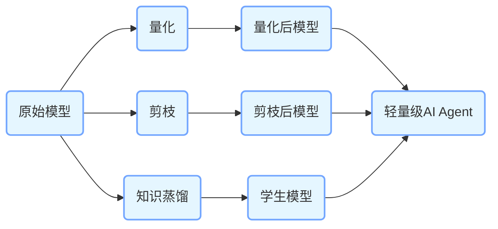

# 模型压缩：在边缘设备部署轻量级AI Agent

> 关键词：模型压缩、边缘设备、轻量级AI Agent、深度学习、资源优化

> 摘要：本文围绕模型压缩技术在边缘设备部署轻量级AI Agent展开深入探讨。详细介绍了模型压缩的背景和重要性，阐述了核心概念、算法原理、数学模型等基础知识。通过项目实战案例，展示了如何在实际中应用模型压缩技术。同时，分析了模型压缩在不同场景下的应用，推荐了相关的学习资源、开发工具和论文著作。最后，总结了模型压缩的未来发展趋势与挑战，并对常见问题进行了解答。旨在为读者提供全面且深入的关于模型压缩及在边缘设备部署轻量级AI Agent的知识体系。

## 1. 背景介绍 
### 1.1 目的和范围
随着人工智能技术的飞速发展，深度学习模型在各个领域取得了显著的成果。然而，这些模型通常具有庞大的参数数量和复杂的计算结构，对计算资源和存储资源的需求极高。边缘设备，如智能手机、智能摄像头、物联网设备等，由于其资源有限，难以直接部署和运行这些复杂的模型。因此，模型压缩技术应运而生，其目的是在不显著损失模型性能的前提下，减少模型的参数数量和计算量，从而实现轻量级AI Agent在边缘设备上的高效部署。

本文的范围涵盖了模型压缩的基本概念、核心算法原理、数学模型、项目实战案例、实际应用场景以及相关的工具和资源推荐等方面，旨在为读者提供一个全面且深入的关于模型压缩及在边缘设备部署轻量级AI Agent的知识体系。

### 1.2 预期读者
本文预期读者包括人工智能领域的研究人员、开发者、工程师，以及对模型压缩和边缘计算感兴趣的技术爱好者。对于正在从事深度学习模型在边缘设备上部署相关工作的人员，本文将提供实用的技术指导和案例参考；对于初学者，本文将帮助他们建立起对模型压缩和轻量级AI Agent的基本概念和理解。

### 1.3 文档结构概述
本文将按照以下结构进行组织：
1. **背景介绍**：阐述模型压缩的目的和范围、预期读者以及文档结构概述，并给出相关术语的定义和解释。
2. **核心概念与联系**：介绍模型压缩的核心概念，包括量化、剪枝、知识蒸馏等，并通过文本示意图和Mermaid流程图展示它们之间的关系。
3. **核心算法原理 & 具体操作步骤**：详细讲解模型压缩的核心算法原理，并使用Python源代码进行具体操作步骤的阐述。
4. **数学模型和公式 & 详细讲解 & 举例说明**：给出模型压缩相关的数学模型和公式，并进行详细讲解和举例说明。
5. **项目实战：代码实际案例和详细解释说明**：通过一个实际的项目案例，展示如何在边缘设备上部署轻量级AI Agent，并对代码进行详细的解释和分析。
6. **实际应用场景**：分析模型压缩在不同领域的实际应用场景，如智能安防、智能家居、智能医疗等。
7. **工具和资源推荐**：推荐相关的学习资源、开发工具和论文著作，帮助读者进一步深入学习和研究模型压缩技术。
8. **总结：未来发展趋势与挑战**：总结模型压缩技术的未来发展趋势，并分析面临的挑战。
9. **附录：常见问题与解答**：对读者可能遇到的常见问题进行解答。
10. **扩展阅读 & 参考资料**：提供相关的扩展阅读材料和参考资料，方便读者进一步探索。

### 1.4 术语表
#### 1.4.1 核心术语定义
- **模型压缩（Model Compression）**：指在不显著损失模型性能的前提下，通过减少模型的参数数量、计算量或存储需求，来降低模型的复杂度和资源消耗的技术。
- **轻量级AI Agent**：指经过模型压缩后，能够在边缘设备上高效运行的人工智能模型，它具有较小的体积和较低的计算成本。
- **边缘设备（Edge Device）**：指位于网络边缘的设备，如智能手机、智能摄像头、物联网传感器等，这些设备通常具有有限的计算资源和存储能力。
- **量化（Quantization）**：将模型中的浮点数参数转换为低精度的整数或定点数表示，从而减少模型的存储需求和计算量。
- **剪枝（Pruning）**：通过去除模型中对性能影响较小的参数或连接，来减少模型的参数数量和计算量。
- **知识蒸馏（Knowledge Distillation）**：将一个复杂的教师模型的知识传递给一个简单的学生模型，使学生模型在保持较小规模的同时，能够达到与教师模型相近的性能。

#### 1.4.2 相关概念解释
- **深度学习模型**：一种基于人工神经网络的机器学习模型，通过多层神经元的非线性变换来学习数据的特征和模式。
- **计算资源**：指设备的计算能力，通常用CPU、GPU的运算速度和内存大小来衡量。
- **存储资源**：指设备的存储空间，用于存储模型的参数和中间计算结果。
- **模型性能**：通常用模型在测试数据集上的准确率、召回率、F1值等指标来衡量。

#### 1.4.3 缩略词列表
- **AI**：Artificial Intelligence，人工智能
- **CNN**：Convolutional Neural Network，卷积神经网络
- **RNN**：Recurrent Neural Network，循环神经网络
- **GPU**：Graphics Processing Unit，图形处理单元
- **CPU**：Central Processing Unit，中央处理单元

## 2. 核心概念与联系 

### 核心概念原理
#### 量化
量化是一种将模型中的浮点数参数转换为低精度表示的技术。在深度学习模型中，参数通常以32位浮点数（FP32）的形式存储和计算，这会占用大量的存储和计算资源。量化通过将FP32参数转换为8位整数（INT8）或更低精度的表示，可以显著减少模型的存储需求和计算量。

量化的基本原理是将浮点数参数映射到一个有限的整数范围内。例如，对于8位量化，参数值会被映射到[-128, 127]的整数范围内。在推理过程中，模型使用量化后的整数参数进行计算，从而提高计算效率。

#### 剪枝
剪枝是通过去除模型中对性能影响较小的参数或连接，来减少模型的参数数量和计算量的技术。在深度学习模型中，存在大量对模型性能贡献较小的参数，这些参数可以被安全地删除而不会显著影响模型的准确性。

剪枝的基本原理是根据参数的重要性对其进行评估，然后删除重要性较低的参数。常见的剪枝方法包括基于幅度的剪枝、基于梯度的剪枝等。

#### 知识蒸馏
知识蒸馏是将一个复杂的教师模型的知识传递给一个简单的学生模型的技术。教师模型通常是一个大型的、性能良好的模型，而学生模型则是一个小型的、轻量级的模型。通过知识蒸馏，学生模型可以在保持较小规模的同时，达到与教师模型相近的性能。

知识蒸馏的基本原理是让学生模型学习教师模型的输出分布。在训练过程中，学生模型不仅要学习真实标签，还要学习教师模型的软标签（即教师模型的输出概率分布）。通过这种方式，学生模型可以从教师模型中获取更多的知识，从而提高自身的性能。

### 架构的文本示意图
```plaintext
模型压缩
├── 量化
│   ├── 8位量化
│   ├── 4位量化
│   └── 更低精度量化
├── 剪枝
│   ├── 基于幅度的剪枝
│   ├── 基于梯度的剪枝
│   └── 结构化剪枝
└── 知识蒸馏
    ├── 软标签学习
    └── 中间层特征学习
```

### Mermaid流程图


这个流程图展示了模型压缩的主要方法（量化、剪枝、知识蒸馏）以及它们如何从原始模型得到轻量级AI Agent。原始模型分别经过量化、剪枝和知识蒸馏处理，得到量化后模型、剪枝后模型和学生模型，最终这些处理后的模型都可以用于构建轻量级AI Agent。

## 3. 核心算法原理 & 具体操作步骤 

### 量化算法原理及Python代码实现
#### 算法原理
量化的核心思想是将浮点数参数映射到一个有限的整数范围内。以8位量化为例，我们需要确定一个缩放因子（scale）和零点（zero_point），将浮点数参数转换为8位整数。

假设我们有一个浮点数参数 $x$，缩放因子为 $s$，零点为 $z$，则量化后的整数 $q$ 可以通过以下公式计算：

$q = \text{round}(\frac{x}{s}) + z$

在推理过程中，我们需要将量化后的整数参数反量化为浮点数，以便进行计算。反量化的公式为：

$x = s \times (q - z)$

#### Python代码实现
```python
import numpy as np

def quantize(x, num_bits=8):
    """
    量化函数
    :param x: 输入的浮点数数组
    :param num_bits: 量化位数，默认为8位
    :return: 量化后的整数数组、缩放因子和零点
    """
    min_val = np.min(x)
    max_val = np.max(x)
    qmax = 2**num_bits - 1
    qmin = 0
    
    # 计算缩放因子和零点
    scale = (max_val - min_val) / (qmax - qmin)
    zero_point = qmin - np.round(min_val / scale)
    
    # 量化
    qx = np.round(x / scale) + zero_point
    qx = np.clip(qx, qmin, qmax).astype(np.int8)
    
    return qx, scale, zero_point

def dequantize(qx, scale, zero_point):
    """
    反量化函数
    :param qx: 量化后的整数数组
    :param scale: 缩放因子
    :param zero_point: 零点
    :return: 反量化后的浮点数数组
    """
    return scale * (qx - zero_point)

# 示例
x = np.random.randn(10)  # 生成随机浮点数数组
qx, scale, zero_point = quantize(x)
dx = dequantize(qx, scale, zero_point)

print("Original values:", x)
print("Quantized values:", qx)
print("Dequantized values:", dx)
```

### 剪枝算法原理及Python代码实现
#### 算法原理
基于幅度的剪枝是一种简单而有效的剪枝方法。其基本思想是根据参数的绝对值大小来判断其重要性，绝对值较小的参数被认为对模型性能的贡献较小，可以被删除。

具体步骤如下：
1. 计算模型中每个参数的绝对值。
2. 根据绝对值对参数进行排序。
3. 选择绝对值较小的一定比例的参数进行删除。

#### Python代码实现
```python
import torch
import torch.nn as nn

def prune_model(model, pruning_ratio):
    """
    基于幅度的剪枝函数
    :param model: 输入的模型
    :param pruning_ratio: 剪枝比例
    :return: 剪枝后的模型
    """
    for name, param in model.named_parameters():
        if 'weight' in name:
            # 计算参数的绝对值
            abs_param = torch.abs(param)
            # 确定剪枝阈值
            threshold = torch.quantile(abs_param.flatten(), pruning_ratio)
            # 创建掩码
            mask = (abs_param > threshold).float()
            # 应用掩码
            param.data *= mask
    
    return model

# 示例
model = nn.Linear(10, 10)
pruned_model = prune_model(model, 0.2)
print("Original model:", model)
print("Pruned model:", pruned_model)
```

### 知识蒸馏算法原理及Python代码实现
#### 算法原理
知识蒸馏的核心思想是让学生模型学习教师模型的输出分布。在训练过程中，学生模型的损失函数由两部分组成：一部分是传统的交叉熵损失，用于学习真实标签；另一部分是蒸馏损失，用于学习教师模型的软标签。

蒸馏损失通常使用KL散度（Kullback-Leibler divergence）来计算，其公式为：

$L_{distill} = \text{KL}(p_{teacher}, p_{student})$

其中，$p_{teacher}$ 是教师模型的输出概率分布，$p_{student}$ 是学生模型的输出概率分布。

#### Python代码实现
```python
import torch
import torch.nn as nn
import torch.optim as optim

# 定义教师模型和学生模型
class TeacherModel(nn.Module):
    def __init__(self):
        super(TeacherModel, self).__init__()
        self.fc1 = nn.Linear(10, 20)
        self.fc2 = nn.Linear(20, 10)
    
    def forward(self, x):
        x = torch.relu(self.fc1(x))
        x = self.fc2(x)
        return x

class StudentModel(nn.Module):
    def __init__(self):
        super(StudentModel, self).__init__()
        self.fc = nn.Linear(10, 10)
    
    def forward(self, x):
        x = self.fc(x)
        return x

# 定义知识蒸馏损失函数
def knowledge_distillation_loss(y_student, y_teacher, y_true, alpha=0.5, temperature=2.0):
    """
    知识蒸馏损失函数
    :param y_student: 学生模型的输出
    :param y_teacher: 教师模型的输出
    :param y_true: 真实标签
    :param alpha: 蒸馏损失的权重
    :param temperature: 温度参数
    :return: 知识蒸馏损失
    """
    ce_loss = nn.CrossEntropyLoss()(y_student, y_true)
    kl_loss = nn.KLDivLoss(reduction='batchmean')(
        nn.functional.log_softmax(y_student / temperature, dim=1),
        nn.functional.softmax(y_teacher / temperature, dim=1)
    ) * (temperature**2)
    
    return alpha * kl_loss + (1 - alpha) * ce_loss

# 训练过程
teacher_model = TeacherModel()
student_model = StudentModel()
optimizer = optim.Adam(student_model.parameters(), lr=0.001)

# 模拟数据
x = torch.randn(32, 10)
y_true = torch.randint(0, 10, (32,))

# 教师模型前向传播
with torch.no_grad():
    y_teacher = teacher_model(x)

# 训练学生模型
for epoch in range(100):
    optimizer.zero_grad()
    y_student = student_model(x)
    loss = knowledge_distillation_loss(y_student, y_teacher, y_true)
    loss.backward()
    optimizer.step()

    if (epoch + 1) % 10 == 0:
        print(f'Epoch {epoch + 1}, Loss: {loss.item()}')
```

## 4. 数学模型和公式 & 详细讲解 & 举例说明 

### 量化的数学模型和公式
#### 量化公式
如前面所述，量化的公式为：

$q = \text{round}(\frac{x}{s}) + z$

其中，$x$ 是原始的浮点数参数，$s$ 是缩放因子，$z$ 是零点，$q$ 是量化后的整数参数。

#### 反量化公式
反量化的公式为：

$x = s \times (q - z)$

#### 详细讲解
缩放因子 $s$ 和零点 $z$ 的作用是将浮点数参数映射到一个有限的整数范围内。缩放因子决定了浮点数和整数之间的比例关系，零点则决定了整数范围的偏移量。

例如，假设我们有一个浮点数参数 $x$ 的取值范围是 $[0, 1]$，我们要将其量化为8位整数（范围是 $[0, 255]$）。则缩放因子 $s = \frac{1 - 0}{255 - 0} = \frac{1}{255}$，零点 $z = 0$。对于一个具体的浮点数 $x = 0.5$，量化后的整数 $q = \text{round}(\frac{0.5}{\frac{1}{255}}) + 0 = \text{round}(127.5) = 128$。

### 剪枝的数学模型和公式
#### 基于幅度的剪枝公式
基于幅度的剪枝是根据参数的绝对值大小来判断其重要性。假设我们有一个参数矩阵 $W$，其元素为 $w_{ij}$。我们首先计算每个元素的绝对值 $|w_{ij}|$，然后根据这些绝对值对元素进行排序。设排序后的绝对值数组为 $|w|_{(1)} \leq |w|_{(2)} \leq \cdots \leq |w|_{(n)}$，其中 $n$ 是参数的总数。

如果我们要剪枝的比例为 $r$，则剪枝阈值 $t$ 可以通过以下公式计算：

$t = |w|_{(\lfloor r \times n \rfloor)}$

其中，$\lfloor \cdot \rfloor$ 表示向下取整。

#### 详细讲解
剪枝阈值 $t$ 确定了哪些参数应该被删除。如果 $|w_{ij}| \leq t$，则参数 $w_{ij}$ 被认为是不重要的，可以被删除。通过设置不同的剪枝比例 $r$，我们可以控制剪枝的程度。

例如，假设我们有一个参数矩阵 $W$ 有100个元素，我们要剪枝的比例为 $r = 0.2$，则 $\lfloor r \times n \rfloor = \lfloor 0.2 \times 100 \rfloor = 20$。我们将参数的绝对值进行排序，取第20个元素的值作为剪枝阈值 $t$。所有绝对值小于等于 $t$ 的参数将被删除。

### 知识蒸馏的数学模型和公式
#### KL散度公式
知识蒸馏中常用的蒸馏损失是KL散度，其公式为：

$KL(p || q) = \sum_{i} p_i \log(\frac{p_i}{q_i})$

其中，$p$ 和 $q$ 是两个概率分布，$p_i$ 和 $q_i$ 分别是它们的第 $i$ 个元素。

#### 知识蒸馏损失公式
知识蒸馏损失函数由两部分组成：

$L_{distill} = \alpha \times KL(p_{teacher}, p_{student}) + (1 - \alpha) \times L_{CE}(p_{student}, y_{true})$

其中，$\alpha$ 是蒸馏损失的权重，$p_{teacher}$ 是教师模型的输出概率分布，$p_{student}$ 是学生模型的输出概率分布，$L_{CE}$ 是交叉熵损失函数，$y_{true}$ 是真实标签。

#### 详细讲解
KL散度衡量了两个概率分布之间的差异。在知识蒸馏中，我们希望学生模型的输出概率分布 $p_{student}$ 尽可能接近教师模型的输出概率分布 $p_{teacher}$，因此使用KL散度作为蒸馏损失。

交叉熵损失 $L_{CE}$ 用于让学生模型学习真实标签。通过调整权重 $\alpha$，我们可以控制蒸馏损失和交叉熵损失的相对重要性。

例如，假设我们有一个分类问题，有3个类别。教师模型的输出概率分布 $p_{teacher} = [0.1, 0.2, 0.7]$，学生模型的输出概率分布 $p_{student} = [0.2, 0.3, 0.5]$，真实标签 $y_{true} = [0, 0, 1]$。

首先计算KL散度：

$KL(p_{teacher} || p_{student}) = 0.1 \log(\frac{0.1}{0.2}) + 0.2 \log(\frac{0.2}{0.3}) + 0.7 \log(\frac{0.7}{0.5}) \approx 0.08$

然后计算交叉熵损失：

$L_{CE}(p_{student}, y_{true}) = - \log(0.5) \approx 0.69$

假设 $\alpha = 0.5$，则知识蒸馏损失为：

$L_{distill} = 0.5 \times 0.08 + 0.5 \times 0.69 = 0.385$

## 5. 项目实战：代码实际案例和详细解释说明 

### 5.1  开发环境搭建
#### 硬件环境
- 边缘设备：可以选择一款具有一定计算能力的边缘设备，如树莓派（Raspberry Pi）、Jetson Nano等。
- 开发主机：一台配置较好的计算机，用于模型训练和代码开发。

#### 软件环境
- 操作系统：开发主机可以使用Windows、Linux或macOS，边缘设备根据其硬件支持选择相应的操作系统，如树莓派可以使用Raspbian，Jetson Nano可以使用JetPack。
- 深度学习框架：选择PyTorch或TensorFlow作为深度学习框架，本文以PyTorch为例。
- 安装依赖库：使用pip或conda安装必要的依赖库，如numpy、torchvision等。

```bash
# 安装PyTorch和torchvision
pip install torch torchvision
```

### 5.2  源代码详细实现和代码解读
#### 数据准备
我们以MNIST手写数字识别数据集为例，使用PyTorch的torchvision库来加载数据。

```python
import torch
import torchvision
import torchvision.transforms as transforms

# 定义数据预处理
transform = transforms.Compose([
    transforms.ToTensor(),
    transforms.Normalize((0.1307,), (0.3081,))
])

# 加载训练集和测试集
trainset = torchvision.datasets.MNIST(root='./data', train=True,
                                      download=True, transform=transform)
trainloader = torch.utils.data.DataLoader(trainset, batch_size=64,
                                          shuffle=True)

testset = torchvision.datasets.MNIST(root='./data', train=False,
                                     download=True, transform=transform)
testloader = torch.utils.data.DataLoader(testset, batch_size=64,
                                         shuffle=False)
```

#### 定义原始模型
我们定义一个简单的卷积神经网络作为原始模型。

```python
import torch.nn as nn
import torch.nn.functional as F

class Net(nn.Module):
    def __init__(self):
        super(Net, self).__init__()
        self.conv1 = nn.Conv2d(1, 10, kernel_size=5)
        self.conv2 = nn.Conv2d(10, 20, kernel_size=5)
        self.fc1 = nn.Linear(320, 50)
        self.fc2 = nn.Linear(50, 10)

    def forward(self, x):
        x = F.relu(F.max_pool2d(self.conv1(x), 2))
        x = F.relu(F.max_pool2d(self.conv2(x), 2))
        x = x.view(-1, 320)
        x = F.relu(self.fc1(x))
        x = self.fc2(x)
        return x

model = Net()
```

#### 训练原始模型
使用交叉熵损失函数和随机梯度下降（SGD）优化器来训练原始模型。

```python
import torch.optim as optim

criterion = nn.CrossEntropyLoss()
optimizer = optim.SGD(model.parameters(), lr=0.001, momentum=0.9)

for epoch in range(5):  # 训练5个epoch
    running_loss = 0.0
    for i, data in enumerate(trainloader, 0):
        inputs, labels = data
        optimizer.zero_grad()

        outputs = model(inputs)
        loss = criterion(outputs, labels)
        loss.backward()
        optimizer.step()

        running_loss += loss.item()
        if i % 200 == 199:
            print(f'[{epoch + 1}, {i + 1}] loss: {running_loss / 200:.3f}')
            running_loss = 0.0

print('Finished Training')
```

#### 模型压缩
我们使用前面介绍的量化和剪枝方法对模型进行压缩。

```python
# 量化
def quantize_model(model):
    import torch.quantization
    model.qconfig = torch.quantization.get_default_qconfig('fbgemm')
    model = torch.quantization.prepare(model)
    model = torch.quantization.convert(model)
    return model

quantized_model = quantize_model(model)

# 剪枝
pruned_model = prune_model(model, 0.2)
```

#### 在边缘设备上部署
将压缩后的模型保存到文件，并将文件传输到边缘设备上。在边缘设备上加载模型并进行推理。

```python
# 保存模型
torch.save(quantized_model.state_dict(), 'quantized_model.pth')
torch.save(pruned_model.state_dict(), 'pruned_model.pth')

# 在边缘设备上加载模型
import torch
import torch.nn as nn
import torch.nn.functional as F

class Net(nn.Module):
    def __init__(self):
        super(Net, self).__init__()
        self.conv1 = nn.Conv2d(1, 10, kernel_size=5)
        self.conv2 = nn.Conv2d(10, 20, kernel_size=5)
        self.fc1 = nn.Linear(320, 50)
        self.fc2 = nn.Linear(50, 10)

    def forward(self, x):
        x = F.relu(F.max_pool2d(self.conv1(x), 2))
        x = F.relu(F.max_pool2d(self.conv2(x), 2))
        x = x.view(-1, 320)
        x = F.relu(self.fc1(x))
        x = self.fc2(x)
        return x

# 加载量化模型
quantized_model = Net()
quantized_model.load_state_dict(torch.load('quantized_model.pth'))

# 加载剪枝模型
pruned_model = Net()
pruned_model.load_state_dict(torch.load('pruned_model.pth'))

# 进行推理
import torchvision.transforms as transforms
from PIL import Image

# 加载测试图像
image = Image.open('test_image.png').convert('L')
transform = transforms.Compose([
    transforms.ToTensor(),
    transforms.Normalize((0.1307,), (0.3081,))
])
input_tensor = transform(image).unsqueeze(0)

# 量化模型推理
output_quantized = quantized_model(input_tensor)
_, predicted_quantized = torch.max(output_quantized.data, 1)
print('Quantized model prediction:', predicted_quantized.item())

# 剪枝模型推理
output_pruned = pruned_model(input_tensor)
_, predicted_pruned = torch.max(output_pruned.data, 1)
print('Pruned model prediction:', predicted_pruned.item())
```

### 5.3  代码解读与分析
#### 数据准备部分
使用torchvision库加载MNIST数据集，并进行数据预处理。`transforms.ToTensor()` 将图像转换为张量，`transforms.Normalize()` 对图像进行归一化处理。

#### 模型定义部分
定义了一个简单的卷积神经网络 `Net`，包含两个卷积层和两个全连接层。

#### 模型训练部分
使用交叉熵损失函数和随机梯度下降（SGD）优化器来训练模型。在每个epoch中，遍历训练集的所有样本，计算损失并进行反向传播更新模型参数。

#### 模型压缩部分
- **量化**：使用PyTorch的量化工具对模型进行量化。首先设置量化配置，然后准备模型进行量化，最后将模型转换为量化模型。
- **剪枝**：使用前面定义的 `prune_model` 函数对模型进行剪枝，设置剪枝比例为0.2。

#### 边缘设备部署部分
将压缩后的模型保存到文件，并在边缘设备上加载模型进行推理。加载测试图像，进行预处理后输入到模型中，得到预测结果。

通过这个项目实战，我们展示了如何使用模型压缩技术在边缘设备上部署轻量级AI Agent。量化和剪枝可以显著减少模型的存储需求和计算量，从而提高模型在边缘设备上的运行效率。

## 6. 实际应用场景 
### 智能安防
在智能安防领域，边缘设备如智能摄像头需要实时处理大量的视频数据，对目标进行检测和识别。由于边缘设备的计算资源有限，传统的大型深度学习模型难以直接部署。通过模型压缩技术，可以将复杂的目标检测和识别模型压缩成轻量级AI Agent，在边缘设备上实现高效的实时处理。例如，在公共场所的监控摄像头中，轻量级AI Agent可以实时检测人员的行为、识别车辆的车牌等，及时发现异常情况并报警。

### 智能家居
智能家居系统中包含大量的边缘设备，如智能门锁、智能音箱、智能家电等。这些设备需要具备一定的智能交互能力，如语音识别、图像识别等。模型压缩技术可以将相关的深度学习模型压缩后部署到这些边缘设备上，使它们能够在本地完成智能处理，减少与云端的通信延迟和数据传输量。例如，智能门锁可以通过轻量级的人脸识别模型实现快速准确的身份识别，提高家居的安全性。

### 智能医疗
在智能医疗领域，边缘设备如可穿戴设备、便携式医疗监测设备等可以实时采集患者的生理数据，如心率、血压、血糖等。通过模型压缩技术，可以将疾病诊断和预测模型压缩成轻量级AI Agent，部署到这些边缘设备上，实现实时的健康监测和预警。例如，可穿戴设备可以通过轻量级的心电图分析模型实时检测心律失常等疾病，为患者提供及时的医疗建议。

### 智能交通
智能交通系统中，边缘设备如交通摄像头、车载智能终端等需要对交通流量、车辆行为等进行实时监测和分析。模型压缩技术可以将交通目标检测、行为分析等模型压缩后部署到这些边缘设备上，提高交通管理的效率和智能化水平。例如，交通摄像头可以通过轻量级的车辆检测和跟踪模型实时统计车流量，为交通调度提供数据支持。

### 工业物联网
在工业物联网领域，边缘设备如工业传感器、机器人等需要对生产过程中的数据进行实时处理和分析，以实现智能化的生产控制和质量检测。模型压缩技术可以将工业故障诊断、质量预测等模型压缩成轻量级AI Agent，部署到这些边缘设备上，提高工业生产的效率和可靠性。例如，工业机器人可以通过轻量级的视觉识别模型实时检测产品的质量缺陷，及时进行调整和修复。

## 7. 工具和资源推荐
### 7.1 学习资源推荐
#### 7.1.1 书籍推荐
- 《深度学习》（Deep Learning）：由Ian Goodfellow、Yoshua Bengio和Aaron Courville撰写，是深度学习领域的经典教材，涵盖了深度学习的基本原理、算法和应用。
- 《Python深度学习》（Deep Learning with Python）：由Francois Chollet撰写，以Python和Keras为工具，介绍了深度学习的基本概念和实践方法。
- 《动手学深度学习》（Dive into Deep Learning）：由李沐、Aston Zhang等撰写，提供了丰富的代码示例和实验，适合初学者快速上手深度学习。

#### 7.1.2 在线课程
- Coursera上的“深度学习专项课程”（Deep Learning Specialization）：由Andrew Ng教授授课，包括深度学习的基础、卷积神经网络、循环神经网络等多个模块。
- edX上的“强化学习”（Reinforcement Learning）：介绍了强化学习的基本概念、算法和应用。
- 哔哩哔哩上的“李宏毅机器学习课程”：以生动有趣的方式讲解机器学习和深度学习的知识。

#### 7.1.3 技术博客和网站
- Medium：有许多深度学习和模型压缩领域的优秀博客文章，如Towards Data Science、Machine Learning Mastery等。
- arXiv：是一个预印本数据库，提供了大量的最新研究论文，包括模型压缩、边缘计算等领域的研究成果。
- 机器之心：专注于人工智能领域的技术资讯和深度报道，提供了丰富的模型压缩相关的技术文章和案例分析。

### 7.2 开发工具框架推荐
#### 7.2.1 IDE和编辑器
- PyCharm：是一款专门为Python开发设计的集成开发环境，提供了丰富的代码编辑、调试和版本控制功能。
- Jupyter Notebook：是一个交互式的开发环境，适合进行数据分析、模型训练和实验验证。
- Visual Studio Code：是一款轻量级的代码编辑器，支持多种编程语言和插件扩展，可用于深度学习模型的开发和调试。

#### 7.2.2 调试和性能分析工具
- TensorBoard：是TensorFlow提供的可视化工具，可以用于监控模型的训练过程、可视化模型结构和性能指标等。
- PyTorch Profiler：是PyTorch提供的性能分析工具，可以帮助开发者分析模型的计算性能和内存使用情况。
- NVIDIA Nsight Systems：是NVIDIA提供的性能分析工具，可用于分析GPU加速的深度学习模型的性能。

#### 7.2.3 相关框架和库
- PyTorch：是一个开源的深度学习框架，提供了丰富的神经网络层和优化算法，支持模型压缩和量化。
- TensorFlow：是另一个广泛使用的深度学习框架，提供了模型压缩和量化的工具和接口。
- NNI（Neural Network Intelligence）：是微软开源的自动机器学习工具，支持模型压缩、超参数调优等功能。

### 7.3 相关论文著作推荐
#### 7.3.1 经典论文
- 《Deep Compression: Compressing Deep Neural Networks with Pruning, Trained Quantization and Huffman Coding》：提出了一种综合的模型压缩方法，包括剪枝、量化和霍夫曼编码。
- 《Distilling the Knowledge in a Neural Network》：首次提出了知识蒸馏的概念，将教师模型的知识传递给学生模型。
- 《Learning both Weights and Connections for Efficient Neural Networks》：介绍了基于幅度的剪枝方法，通过去除不重要的连接来减少模型的参数数量。

#### 7.3.2 最新研究成果
- 《Model Compression via Pruning and Quantization for Mobile Devices》：研究了在移动设备上进行模型压缩的方法，结合剪枝和量化技术，提高模型在移动设备上的运行效率。
- 《Efficient Neural Network Compression via Knowledge Distillation with Adversarial Training》：提出了一种基于对抗训练的知识蒸馏方法，进一步提高了学生模型的性能。
- 《AutoML for Model Compression: A Survey》：对自动机器学习在模型压缩领域的应用进行了综述，介绍了各种自动模型压缩的方法和技术。

#### 7.3.3 应用案例分析
- 《Deploying Deep Learning Models on Edge Devices: A Case Study》：通过一个实际案例，展示了如何在边缘设备上部署深度学习模型，并介绍了模型压缩和优化的方法。
- 《Model Compression for Real-Time Object Detection in Smart Surveillance Systems》：研究了在智能安防系统中进行实时目标检测的模型压缩方法，提高了系统的实时性和性能。
- 《Lightweight AI Agents for Healthcare Monitoring on Wearable Devices》：探讨了在可穿戴设备上部署轻量级AI Agent进行医疗监测的应用案例，介绍了模型压缩和优化的技术。

## 8. 总结：未来发展趋势与挑战
### 未来发展趋势
#### 自动化模型压缩
随着深度学习模型的复杂度不断增加，手动进行模型压缩变得越来越困难。未来，自动化模型压缩技术将得到更广泛的应用。通过自动机器学习（AutoML）的方法，可以自动搜索最优的模型压缩策略，减少人工干预，提高模型压缩的效率和效果。

#### 联合优化
目前的模型压缩方法主要集中在单一的技术上，如量化、剪枝或知识蒸馏。未来，联合优化不同的模型压缩技术将成为趋势。例如，将量化和剪枝相结合，同时利用知识蒸馏进行模型训练，可以进一步提高模型的压缩率和性能。

#### 与硬件的深度融合
模型压缩的效果不仅取决于算法本身，还与硬件的特性密切相关。未来，模型压缩技术将与硬件进行更深度的融合，根据不同硬件的架构和性能特点，设计专门的模型压缩方法，以充分发挥硬件的优势，提高模型在边缘设备上的运行效率。

#### 面向新应用场景的模型压缩
随着人工智能技术的不断发展，新的应用场景不断涌现，如自动驾驶、智能医疗等。这些应用场景对模型的性能和实时性要求更高。未来，模型压缩技术将针对这些新应用场景的特点，开发专门的模型压缩方法，以满足其需求。

### 挑战
#### 性能损失与压缩率的平衡
在模型压缩过程中，如何在保证模型性能损失最小的前提下，实现最大的压缩率是一个关键挑战。不同的模型压缩方法对模型性能的影响不同，需要根据具体的应用场景和需求，选择合适的压缩方法和参数，以达到性能损失与压缩率的最佳平衡。

#### 模型可解释性
模型压缩会改变模型的结构和参数，从而影响模型的可解释性。在一些对模型可解释性要求较高的应用场景，如医疗诊断、金融风险评估等，如何在模型压缩的同时保持模型的可解释性是一个亟待解决的问题。

#### 硬件兼容性
不同的边缘设备具有不同的硬件架构和性能特点，模型压缩后的代码需要在不同的硬件上进行优化和适配。如何保证模型压缩后的代码在各种硬件上都能高效运行，是模型压缩技术在实际应用中面临的一个挑战。

#### 数据隐私和安全
在模型压缩过程中，可能会涉及到数据的处理和传输，这会带来数据隐私和安全的问题。例如，在知识蒸馏过程中，教师模型的输出可能包含敏感信息。如何在模型压缩过程中保护数据的隐私和安全，是一个需要重视的问题。

## 9. 附录：常见问题与解答
### 模型压缩会显著降低模型的性能吗？
模型压缩的目标是在不显著损失模型性能的前提下，减少模型的参数数量和计算量。通过合理选择模型压缩方法和参数，可以将模型性能的损失控制在可接受的范围内。例如，量化和剪枝方法在很多情况下可以在保持较高准确率的同时，显著减少模型的存储需求和计算量。

### 如何选择合适的模型压缩方法？
选择合适的模型压缩方法需要考虑多个因素，如模型的类型、应用场景、硬件平台等。如果模型的计算量较大，且对精度要求不是特别高，可以考虑使用量化方法；如果模型的参数数量较多，可以考虑使用剪枝方法；如果希望在不增加模型复杂度的情况下提高模型的性能，可以考虑使用知识蒸馏方法。在实际应用中，也可以将多种方法结合使用，以达到更好的压缩效果。

### 模型压缩后的代码在边缘设备上的运行效率如何？
模型压缩后的代码在边缘设备上的运行效率通常会得到显著提高。通过减少模型的参数数量和计算量，模型在边缘设备上的存储需求和计算时间都会减少。同时，一些专门针对边缘设备优化的模型压缩方法和工具，可以进一步提高模型在边缘设备上的运行效率。

### 模型压缩是否适用于所有类型的深度学习模型？
模型压缩技术适用于大多数类型的深度学习模型，如卷积神经网络（CNN）、循环神经网络（RNN）、Transformer等。不同类型的模型在压缩方法的选择和参数的设置上可能会有所不同，需要根据具体情况进行调整。

### 如何评估模型压缩的效果？
评估模型压缩的效果可以从多个方面进行，如模型的准确率、召回率、F1值等性能指标，模型的参数数量、计算量、存储需求等资源指标，以及模型在边缘设备上的运行时间、功耗等效率指标。综合考虑这些指标，可以全面评估模型压缩的效果。

## 10. 扩展阅读 & 参考资料
### 扩展阅读
- 《神经网络与深度学习》：进一步深入学习神经网络的原理和算法。
- 《边缘计算：原理与实践》：了解边缘计算的基本概念、架构和应用场景。
- 《人工智能安全》：学习人工智能领域的数据隐私和安全问题。

### 参考资料
- PyTorch官方文档：https://pytorch.org/docs/stable/index.html
- TensorFlow官方文档：https://www.tensorflow.org/api_docs
- arXiv预印本数据库：https://arxiv.org/

作者：AI天才研究院/AI Genius Institute & 禅与计算机程序设计艺术 /Zen And The Art of Computer Programming