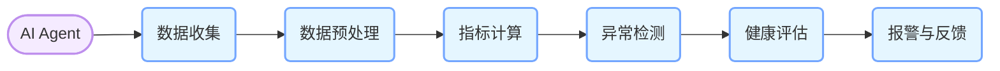

# 模型监控：实时跟踪AI Agent的健康状态

> 关键词：模型监控、AI Agent、健康状态、实时跟踪、性能评估

> 摘要：本文聚焦于模型监控，旨在深入探讨如何实时跟踪AI Agent的健康状态。首先介绍了模型监控的背景信息，包括目的、预期读者等。接着阐述了核心概念与联系，给出了原理和架构的示意图与流程图。详细讲解了核心算法原理及操作步骤，结合Python代码进行说明。同时介绍了相关数学模型和公式，并举例说明。通过项目实战展示了代码实现和解读。分析了实际应用场景，推荐了学习、开发工具和相关论文著作。最后总结了未来发展趋势与挑战，还提供了常见问题解答和扩展阅读参考资料，为读者全面了解和实践模型监控提供了系统的指导。

## 1. 背景介绍 
### 1.1 目的和范围
在当今人工智能技术飞速发展的时代，AI Agent被广泛应用于各种领域，如智能客服、自动驾驶、金融风险评估等。然而，随着AI Agent的复杂度不断增加以及应用场景的多样化，其运行过程中可能会出现各种问题，如性能下降、数据偏差、模型漂移等。模型监控的目的就是实时跟踪AI Agent的健康状态，及时发现并解决这些潜在问题，确保AI Agent能够稳定、高效地运行。

本文的范围涵盖了模型监控的基本概念、核心算法、数学模型、实际应用以及相关工具和资源等方面。通过对这些内容的详细阐述，帮助读者全面了解如何实现对AI Agent健康状态的实时跟踪。

### 1.2 预期读者
本文的预期读者包括人工智能领域的研究人员、开发人员、数据科学家、软件工程师以及对模型监控感兴趣的技术爱好者。无论您是刚接触AI Agent的初学者，还是希望深入了解模型监控技术的专业人士，都能从本文中获得有价值的信息。

### 1.3 文档结构概述
本文将按照以下结构进行组织：
1. **背景介绍**：介绍模型监控的目的、预期读者和文档结构。
2. **核心概念与联系**：阐述模型监控、AI Agent健康状态等核心概念，并给出原理和架构的示意图与流程图。
3. **核心算法原理 & 具体操作步骤**：详细讲解用于模型监控的核心算法原理，并结合Python代码说明具体操作步骤。
4. **数学模型和公式 & 详细讲解 & 举例说明**：介绍相关的数学模型和公式，并通过具体例子进行详细讲解。
5. **项目实战：代码实际案例和详细解释说明**：通过一个实际项目案例，展示如何实现模型监控的代码，并对代码进行详细解读。
6. **实际应用场景**：分析模型监控在不同领域的实际应用场景。
7. **工具和资源推荐**：推荐学习、开发工具和相关论文著作。
8. **总结：未来发展趋势与挑战**：总结模型监控的未来发展趋势和面临的挑战。
9. **附录：常见问题与解答**：解答读者在学习和实践过程中可能遇到的常见问题。
10. **扩展阅读 & 参考资料**：提供相关的扩展阅读材料和参考资料。

### 1.4 术语表
#### 1.4.1 核心术语定义
- **模型监控**：对AI Agent的运行状态进行实时监测和评估，以确保其性能和可靠性。
- **AI Agent**：一种能够感知环境、做出决策并采取行动的人工智能实体。
- **健康状态**：指AI Agent在运行过程中的性能、稳定性、可靠性等方面的综合表现。
- **实时跟踪**：在AI Agent运行过程中，不间断地收集和分析其相关数据，以获取最新的健康状态信息。
- **性能评估**：通过一系列指标和方法，对AI Agent的性能进行量化评估。

#### 1.4.2 相关概念解释
- **模型漂移**：指随着时间的推移，AI Agent所使用的模型在实际应用中的性能逐渐下降的现象。
- **数据偏差**：指训练数据和实际应用数据之间存在的差异，可能导致模型在实际应用中表现不佳。
- **异常检测**：用于发现AI Agent运行过程中出现的异常情况，如数据异常、性能异常等。

#### 1.4.3 缩略词列表
- **ML**：Machine Learning，机器学习
- **DL**：Deep Learning，深度学习
- **KPI**：Key Performance Indicator，关键绩效指标
- **ROC**：Receiver Operating Characteristic，受试者工作特征曲线
- **AUC**：Area Under the Curve，曲线下面积

## 2. 核心概念与联系 
### 核心概念原理
模型监控的核心原理是通过收集AI Agent在运行过程中的各种数据，如输入数据、输出结果、性能指标等，对这些数据进行实时分析和评估，以判断AI Agent的健康状态。具体来说，模型监控主要包括以下几个方面：
1. **数据收集**：从AI Agent的各个数据源中收集相关数据，如日志文件、数据库、传感器等。
2. **数据预处理**：对收集到的数据进行清洗、转换和特征提取等操作，以提高数据的质量和可用性。
3. **指标计算**：根据监控的需求，计算各种性能指标，如准确率、召回率、F1值等。
4. **异常检测**：使用各种异常检测算法，如基于统计的方法、基于机器学习的方法等，发现AI Agent运行过程中出现的异常情况。
5. **健康评估**：根据计算得到的指标和检测到的异常情况，对AI Agent的健康状态进行综合评估。
6. **报警与反馈**：当发现AI Agent的健康状态出现问题时，及时发出报警信息，并将相关信息反馈给相关人员，以便采取相应的措施。

### 架构的文本示意图
```plaintext
+---------------------+
|    AI Agent        |
+---------------------+
| Input Data          |
| Output Results      |
| Performance Metrics |
+---------------------+
          |
          v
+---------------------+
|    Data Collection  |
+---------------------+
| Logs                |
| Databases           |
| Sensors             |
+---------------------+
          |
          v
+---------------------+
|  Data Preprocessing |
+---------------------+
| Cleaning            |
| Transformation      |
| Feature Extraction  |
+---------------------+
          |
          v
+---------------------+
|    Metric Calculation |
+---------------------+
| Accuracy            |
| Recall              |
| F1 Score            |
+---------------------+
          |
          v
+---------------------+
|  Anomaly Detection  |
+---------------------+
| Statistical Methods |
| Machine Learning    |
+---------------------+
          |
          v
+---------------------+
|  Health Assessment  |
+---------------------+
| Overall Health Score|
| Status              |
+---------------------+
          |
          v
+---------------------+
|  Alarm & Feedback   |
+---------------------+
| Notifications       |
| Recommendations     |
+---------------------+
```

### Mermaid流程图


## 3. 核心算法原理 & 具体操作步骤 
### 核心算法原理
在模型监控中，常用的核心算法包括异常检测算法和性能评估算法。下面分别介绍这两种算法的原理。

#### 异常检测算法
异常检测算法用于发现AI Agent运行过程中出现的异常情况。常见的异常检测算法包括基于统计的方法、基于机器学习的方法和基于深度学习的方法。

##### 基于统计的方法
基于统计的方法通过对历史数据进行统计分析，建立正常数据的统计模型，然后根据该模型判断新数据是否为异常数据。常用的统计指标包括均值、标准差、中位数等。例如，假设我们有一组数据 $x_1, x_2, \cdots, x_n$，其均值为 $\mu$，标准差为 $\sigma$，则可以通过以下公式判断新数据 $x$ 是否为异常数据：
$$
|x - \mu| > k\sigma
$$
其中，$k$ 是一个阈值，通常取 2 或 3。

##### 基于机器学习的方法
基于机器学习的方法通过训练一个异常检测模型，将正常数据和异常数据进行区分。常用的机器学习算法包括支持向量机（SVM）、随机森林、K近邻（KNN）等。例如，使用支持向量机进行异常检测的步骤如下：
1. 收集正常数据和异常数据，并将其标记为 0 和 1。
2. 对数据进行预处理，如特征提取、归一化等。
3. 使用训练数据训练支持向量机模型。
4. 使用训练好的模型对新数据进行预测，如果预测结果为 1，则认为该数据为异常数据。

##### 基于深度学习的方法
基于深度学习的方法通过构建深度学习模型，如自编码器、生成对抗网络（GAN）等，学习正常数据的分布，然后根据该分布判断新数据是否为异常数据。例如，使用自编码器进行异常检测的步骤如下：
1. 收集正常数据，并将其作为训练数据。
2. 构建自编码器模型，包括编码器和解码器。
3. 使用训练数据训练自编码器模型。
4. 使用训练好的自编码器对新数据进行重构，计算重构误差。
5. 如果重构误差超过某个阈值，则认为该数据为异常数据。

#### 性能评估算法
性能评估算法用于评估AI Agent的性能。常见的性能评估指标包括准确率、召回率、F1值、ROC曲线和AUC值等。

##### 准确率
准确率是指模型预测正确的样本数占总样本数的比例。计算公式如下：
$$
\text{Accuracy} = \frac{\text{TP} + \text{TN}}{\text{TP} + \text{TN} + \text{FP} + \text{FN}}
$$
其中，$\text{TP}$ 表示真正例（True Positive），即模型预测为正例且实际为正例的样本数；$\text{TN}$ 表示真反例（True Negative），即模型预测为反例且实际为反例的样本数；$\text{FP}$ 表示假正例（False Positive），即模型预测为正例但实际为反例的样本数；$\text{FN}$ 表示假反例（False Negative），即模型预测为反例但实际为正例的样本数。

##### 召回率
召回率是指模型预测正确的正例数占实际正例数的比例。计算公式如下：
$$
\text{Recall} = \frac{\text{TP}}{\text{TP} + \text{FN}}
$$

##### F1值
F1值是准确率和召回率的调和平均数，用于综合评估模型的性能。计算公式如下：
$$
\text{F1} = \frac{2 \times \text{Accuracy} \times \text{Recall}}{\text{Accuracy} + \text{Recall}}
$$

##### ROC曲线和AUC值
ROC曲线（Receiver Operating Characteristic Curve）是一种用于评估二分类模型性能的曲线，它以假正率（False Positive Rate）为横轴，真正率（True Positive Rate）为纵轴。AUC值（Area Under the Curve）是ROC曲线下的面积，取值范围为 $[0, 1]$，AUC值越大，说明模型的性能越好。

### 具体操作步骤
下面以Python代码为例，详细说明如何实现模型监控的核心算法。

#### 异常检测算法实现
```python
import numpy as np
from sklearn.svm import OneClassSVM
from sklearn.preprocessing import StandardScaler

# 生成正常数据
np.random.seed(42)
normal_data = np.random.randn(100, 2)

# 生成异常数据
anomaly_data = np.random.randn(10, 2) + 5

# 合并数据
data = np.vstack((normal_data, anomaly_data))

# 数据预处理
scaler = StandardScaler()
scaled_data = scaler.fit_transform(data)

# 训练异常检测模型
model = OneClassSVM(nu=0.1, kernel='rbf', gamma=0.1)
model.fit(scaled_data[:100])

# 预测
predictions = model.predict(scaled_data)

# 输出异常数据的索引
anomaly_indices = np.where(predictions == -1)[0]
print("异常数据的索引:", anomaly_indices)
```

#### 性能评估算法实现
```python
from sklearn.metrics import accuracy_score, recall_score, f1_score, roc_curve, auc
import matplotlib.pyplot as plt

# 真实标签
y_true = [1, 1, 0, 0, 1, 0, 1, 0]

# 预测标签
y_pred = [1, 0, 0, 0, 1, 1, 1, 0]

# 计算准确率
accuracy = accuracy_score(y_true, y_pred)
print("准确率:", accuracy)

# 计算召回率
recall = recall_score(y_true, y_pred)
print("召回率:", recall)

# 计算F1值
f1 = f1_score(y_true, y_pred)
print("F1值:", f1)

# 计算ROC曲线和AUC值
fpr, tpr, thresholds = roc_curve(y_true, y_pred)
roc_auc = auc(fpr, tpr)

# 绘制ROC曲线
plt.plot(fpr, tpr, label='ROC curve (area = %0.2f)' % roc_auc)
plt.plot([0, 1], [0, 1], 'k--')
plt.xlim([0.0, 1.0])
plt.ylim([0.0, 1.05])
plt.xlabel('False Positive Rate')
plt.ylabel('True Positive Rate')
plt.title('Receiver Operating Characteristic')
plt.legend(loc="lower right")
plt.show()
```

## 4. 数学模型和公式 & 详细讲解 & 举例说明 
### 异常检测的数学模型和公式
#### 基于统计的异常检测
假设我们有一组数据 $x_1, x_2, \cdots, x_n$，其均值为 $\mu$，标准差为 $\sigma$。我们可以使用以下公式计算每个数据点 $x_i$ 的 $z$ 分数：
$$
z_i = \frac{x_i - \mu}{\sigma}
$$
$z$ 分数表示数据点 $x_i$ 与均值 $\mu$ 的偏离程度，以标准差 $\sigma$ 为单位。通常，如果 $|z_i| > k$（$k$ 是一个阈值，通常取 2 或 3），则认为 $x_i$ 是异常数据。

**举例说明**：假设有一组数据 $[1, 2, 3, 4, 5, 100]$，首先计算均值 $\mu$ 和标准差 $\sigma$：
```python
import numpy as np

data = np.array([1, 2, 3, 4, 5, 100])
mu = np.mean(data)
sigma = np.std(data)
print("均值:", mu)
print("标准差:", sigma)
```
然后计算每个数据点的 $z$ 分数：
```python
z_scores = (data - mu) / sigma
print("z分数:", z_scores)
```
假设 $k = 3$，则可以找出异常数据：
```python
threshold = 3
anomaly_indices = np.where(np.abs(z_scores) > threshold)[0]
print("异常数据的索引:", anomaly_indices)
```

#### 基于机器学习的异常检测
以支持向量机（SVM）为例，其目标是找到一个超平面，将正常数据和异常数据分开。在单类支持向量机（One-Class SVM）中，我们只使用正常数据进行训练，目标是找到一个超球体，将正常数据包含在其中。

单类支持向量机的优化问题可以表示为：
$$
\begin{aligned}
\min_{\mathbf{w}, \xi, \rho} &\quad \frac{1}{2} \|\mathbf{w}\|^2 + \frac{1}{\nu n} \sum_{i=1}^{n} \xi_i - \rho \\
\text{s.t.} &\quad (\mathbf{w} \cdot \phi(\mathbf{x}_i)) \geq \rho - \xi_i, \quad i = 1, \cdots, n \\
&\quad \xi_i \geq 0, \quad i = 1, \cdots, n
\end{aligned}
$$
其中，$\mathbf{w}$ 是超平面的法向量，$\xi_i$ 是松弛变量，$\rho$ 是超球体的半径，$\nu$ 是一个参数，用于控制异常数据的比例，$\phi(\mathbf{x}_i)$ 是将输入数据 $\mathbf{x}_i$ 映射到高维空间的函数。

### 性能评估的数学模型和公式
#### 准确率、召回率和F1值
前面已经介绍了准确率、召回率和F1值的计算公式，下面通过一个具体例子进行说明。

假设有一个二分类问题，真实标签为 $[1, 1, 0, 0, 1, 0, 1, 0]$，预测标签为 $[1, 0, 0, 0, 1, 1, 1, 0]$。

- **准确率**：
```python
from sklearn.metrics import accuracy_score

y_true = [1, 1, 0, 0, 1, 0, 1, 0]
y_pred = [1, 0, 0, 0, 1, 1, 1, 0]
accuracy = accuracy_score(y_true, y_pred)
print("准确率:", accuracy)
```

- **召回率**：
```python
from sklearn.metrics import recall_score

recall = recall_score(y_true, y_pred)
print("召回率:", recall)
```

- **F1值**：
```python
from sklearn.metrics import f1_score

f1 = f1_score(y_true, y_pred)
print("F1值:", f1)
```

#### ROC曲线和AUC值
ROC曲线的横坐标是假正率（False Positive Rate，FPR），纵坐标是真正率（True Positive Rate，TPR），其计算公式分别为：
$$
\text{FPR} = \frac{\text{FP}}{\text{FP} + \text{TN}}
$$
$$
\text{TPR} = \frac{\text{TP}}{\text{TP} + \text{FN}}
$$
AUC值是ROC曲线下的面积，可以使用数值积分的方法计算。

**举例说明**：
```python
from sklearn.metrics import roc_curve, auc
import matplotlib.pyplot as plt

y_true = [1, 1, 0, 0, 1, 0, 1, 0]
y_pred = [0.8, 0.7, 0.3, 0.2, 0.9, 0.4, 0.6, 0.1]  # 预测概率

fpr, tpr, thresholds = roc_curve(y_true, y_pred)
roc_auc = auc(fpr, tpr)

plt.plot(fpr, tpr, label='ROC curve (area = %0.2f)' % roc_auc)
plt.plot([0, 1], [0, 1], 'k--')
plt.xlim([0.0, 1.0])
plt.ylim([0.0, 1.05])
plt.xlabel('False Positive Rate')
plt.ylabel('True Positive Rate')
plt.title('Receiver Operating Characteristic')
plt.legend(loc="lower right")
plt.show()
```

## 5. 项目实战：代码实际案例和详细解释说明 
### 5.1  开发环境搭建
在进行模型监控的项目实战之前，需要搭建相应的开发环境。以下是具体的步骤：

#### 安装Python
首先，确保你已经安装了Python。建议使用Python 3.6及以上版本。可以从Python官方网站（https://www.python.org/downloads/）下载并安装Python。

#### 创建虚拟环境
为了避免不同项目之间的依赖冲突，建议使用虚拟环境。可以使用`venv`模块创建虚拟环境：
```bash
python -m venv model_monitoring_env
```
激活虚拟环境：
- 在Windows上：
```bash
model_monitoring_env\Scripts\activate
```
- 在Linux/Mac上：
```bash
source model_monitoring_env/bin/activate
```

#### 安装必要的库
在虚拟环境中，安装以下必要的库：
```bash
pip install numpy pandas scikit-learn matplotlib
```

### 5.2  源代码详细实现和代码解读
下面通过一个具体的项目案例，展示如何实现模型监控。假设我们有一个简单的二分类模型，用于预测客户是否会购买产品。我们将实时监控该模型的性能。

```python
import numpy as np
import pandas as pd
from sklearn.model_selection import train_test_split
from sklearn.linear_model import LogisticRegression
from sklearn.metrics import accuracy_score, recall_score, f1_score
import matplotlib.pyplot as plt

# 生成示例数据
np.random.seed(42)
n_samples = 1000
X = np.random.randn(n_samples, 2)
y = (X[:, 0] + X[:, 1] > 0).astype(int)

# 划分训练集和测试集
X_train, X_test, y_train, y_test = train_test_split(X, y, test_size=0.2, random_state=42)

# 训练模型
model = LogisticRegression()
model.fit(X_train, y_train)

# 模拟实时数据
n_steps = 10
accuracies = []
recalls = []
f1_scores = []

for step in range(n_steps):
    # 生成新的测试数据
    new_X = np.random.randn(100, 2)
    new_y = (new_X[:, 0] + new_X[:, 1] > 0).astype(int)
    
    # 预测
    y_pred = model.predict(new_X)
    
    # 计算性能指标
    accuracy = accuracy_score(new_y, y_pred)
    recall = recall_score(new_y, y_pred)
    f1 = f1_score(new_y, y_pred)
    
    accuracies.append(accuracy)
    recalls.append(recall)
    f1_scores.append(f1)
    
    print(f"Step {step + 1}: Accuracy = {accuracy:.2f}, Recall = {recall:.2f}, F1 Score = {f1:.2f}")

# 绘制性能指标随时间的变化曲线
plt.figure(figsize=(12, 6))
plt.plot(range(1, n_steps + 1), accuracies, label='Accuracy')
plt.plot(range(1, n_steps + 1), recalls, label='Recall')
plt.plot(range(1, n_steps + 1), f1_scores, label='F1 Score')
plt.xlabel('Step')
plt.ylabel('Performance')
plt.title('Model Performance Over Time')
plt.legend()
plt.show()
```

### 5.3  代码解读与分析
#### 数据生成与划分
```python
np.random.seed(42)
n_samples = 1000
X = np.random.randn(n_samples, 2)
y = (X[:, 0] + X[:, 1] > 0).astype(int)

X_train, X_test, y_train, y_test = train_test_split(X, y, test_size=0.2, random_state=42)
```
这部分代码生成了一个包含 1000 个样本的示例数据集，并将其划分为训练集和测试集，测试集占比为 20%。

#### 模型训练
```python
model = LogisticRegression()
model.fit(X_train, y_train)
```
使用逻辑回归模型对训练数据进行训练。

#### 模拟实时数据与性能监控
```python
n_steps = 10
accuracies = []
recalls = []
f1_scores = []

for step in range(n_steps):
    new_X = np.random.randn(100, 2)
    new_y = (new_X[:, 0] + new_X[:, 1] > 0).astype(int)
    
    y_pred = model.predict(new_X)
    
    accuracy = accuracy_score(new_y, y_pred)
    recall = recall_score(new_y, y_pred)
    f1 = f1_score(new_y, y_pred)
    
    accuracies.append(accuracy)
    recalls.append(recall)
    f1_scores.append(f1)
    
    print(f"Step {step + 1}: Accuracy = {accuracy:.2f}, Recall = {recall:.2f}, F1 Score = {f1:.2f}")
```
这部分代码模拟了 10 个时间步的实时数据，每次生成 100 个新样本，并使用训练好的模型进行预测。然后计算每个时间步的准确率、召回率和F1值，并将其存储在列表中。

#### 绘制性能曲线
```python
plt.figure(figsize=(12, 6))
plt.plot(range(1, n_steps + 1), accuracies, label='Accuracy')
plt.plot(range(1, n_steps + 1), recalls, label='Recall')
plt.plot(range(1, n_steps + 1), f1_scores, label='F1 Score')
plt.xlabel('Step')
plt.ylabel('Performance')
plt.title('Model Performance Over Time')
plt.legend()
plt.show()
```
最后，使用`matplotlib`库绘制性能指标随时间的变化曲线，方便直观地观察模型的性能变化。

## 6. 实际应用场景 
模型监控在许多领域都有广泛的应用，下面介绍一些常见的实际应用场景。

### 金融领域
在金融领域，模型监控可以用于风险评估、信用评分、欺诈检测等方面。例如，银行可以使用模型监控来实时跟踪信用评分模型的性能，及时发现模型漂移和数据偏差，以确保信用评估的准确性。在欺诈检测方面，通过监控交易数据的异常情况，可以及时发现潜在的欺诈行为，保护客户的资金安全。

### 医疗领域
在医疗领域，模型监控可以用于疾病诊断、治疗效果评估等方面。例如，医院可以使用模型监控来实时跟踪疾病诊断模型的性能，确保诊断结果的准确性。在治疗效果评估方面，通过监控患者的生理指标和治疗数据，可以及时调整治疗方案，提高治疗效果。

### 自动驾驶领域
在自动驾驶领域，模型监控可以用于车辆的安全性能评估、环境感知模型的性能监控等方面。例如，汽车制造商可以使用模型监控来实时跟踪自动驾驶车辆的安全性能，及时发现潜在的安全隐患。在环境感知方面，通过监控传感器数据和模型输出，可以确保车辆对周围环境的准确感知。

### 智能客服领域
在智能客服领域，模型监控可以用于对话质量评估、意图识别模型的性能监控等方面。例如，企业可以使用模型监控来实时跟踪智能客服系统的对话质量，及时发现对话中的问题，提高客户满意度。在意图识别方面，通过监控用户输入和模型输出，可以确保系统准确理解用户的意图。

## 7. 工具和资源推荐
### 7.1 学习资源推荐
#### 7.1.1 书籍推荐
- 《Python机器学习》：这本书详细介绍了Python在机器学习领域的应用，包括数据预处理、模型选择、模型评估等方面的内容，适合初学者入门。
- 《深度学习》：由深度学习领域的三位先驱Ian Goodfellow、Yoshua Bengio和Aaron Courville撰写，全面介绍了深度学习的理论和实践，是深度学习领域的经典著作。
- 《机器学习实战》：通过大量的实际案例，介绍了机器学习的常用算法和应用场景，适合有一定编程基础的读者。

#### 7.1.2 在线课程
- Coursera上的“机器学习”课程：由斯坦福大学的Andrew Ng教授主讲，是机器学习领域的经典在线课程，涵盖了机器学习的基本概念、算法和应用。
- edX上的“深度学习”课程：由伯克利大学的教授们主讲，深入介绍了深度学习的理论和实践，适合有一定机器学习基础的读者。
- Kaggle上的“微课程”：提供了一系列关于数据科学和机器学习的微课程，包括数据预处理、特征工程、模型选择等方面的内容，适合初学者快速入门。

#### 7.1.3 技术博客和网站
- Medium：是一个技术博客平台，上面有许多关于人工智能、机器学习和模型监控的优质文章。
- Towards Data Science：专注于数据科学和机器学习领域的技术博客，提供了许多实用的技术文章和案例分析。
- arXiv：是一个预印本数据库，上面有许多关于人工智能和机器学习的最新研究成果。

### 7.2 开发工具框架推荐
#### 7.2.1 IDE和编辑器
- PyCharm：是一款专业的Python集成开发环境，提供了丰富的功能，如代码编辑、调试、版本控制等，适合开发大型Python项目。
- Jupyter Notebook：是一个交互式的开发环境，支持Python、R等多种编程语言，适合进行数据分析和模型开发。
- Visual Studio Code：是一款轻量级的代码编辑器，支持多种编程语言和插件，适合快速开发和调试代码。

#### 7.2.2 调试和性能分析工具
- PDB：是Python自带的调试工具，可以帮助开发者定位代码中的问题。
- Py-Spy：是一个性能分析工具，可以实时分析Python程序的性能瓶颈。
- TensorBoard：是TensorFlow提供的可视化工具，可以帮助开发者监控模型的训练过程和性能。

#### 7.2.3 相关框架和库
- Scikit-learn：是一个常用的机器学习库，提供了丰富的机器学习算法和工具，如数据预处理、模型选择、模型评估等。
- TensorFlow：是一个开源的深度学习框架，提供了强大的深度学习模型构建和训练功能。
- PyTorch：是另一个流行的深度学习框架，具有简洁易用的特点，适合快速开发和实验。

### 7.3 相关论文著作推荐
#### 7.3.1 经典论文
- “The Elements of Statistical Learning”：这本书全面介绍了统计学习的理论和方法，是统计学习领域的经典著作。
- “Deep Residual Learning for Image Recognition”：提出了残差网络（ResNet）的概念，在图像识别领域取得了巨大的成功。
- “Generative Adversarial Nets”：提出了生成对抗网络（GAN）的概念，开创了生成式模型的新纪元。

#### 7.3.2 最新研究成果
- 在arXiv上搜索“Model Monitoring”或“AI Agent Health Monitoring”，可以找到许多关于模型监控的最新研究成果。
- 参加相关的学术会议，如NeurIPS、ICML等，了解模型监控领域的最新研究动态。

#### 7.3.3 应用案例分析
- Kaggle上有许多关于模型监控的实际应用案例，可以参考学习。
- 一些知名企业的技术博客，如Google AI Blog、Facebook AI Research等，会分享他们在模型监控方面的实践经验。

## 8. 总结：未来发展趋势与挑战
### 未来发展趋势
#### 自动化监控
随着人工智能技术的不断发展，模型监控将越来越自动化。未来，模型监控系统将能够自动收集数据、计算指标、检测异常，并根据预设的规则自动采取相应的措施，如重新训练模型、调整参数等，减少人工干预。

#### 多模态监控
目前的模型监控主要集中在单一模态的数据上，如文本、图像等。未来，模型监控将向多模态监控发展，综合考虑多种模态的数据，如文本、图像、音频等，以更全面地评估AI Agent的健康状态。

#### 实时性和可扩展性
随着AI Agent在实时场景中的应用越来越广泛，对模型监控的实时性和可扩展性提出了更高的要求。未来，模型监控系统将能够实时处理大量的数据，并快速做出响应，同时具备良好的可扩展性，能够适应不同规模和复杂度的AI Agent。

#### 与业务指标的融合
模型监控将不仅仅关注模型的技术指标，如准确率、召回率等，还将与业务指标进行融合，如销售额、客户满意度等。通过将模型监控与业务指标相结合，可以更好地评估AI Agent对业务的影响，为业务决策提供更有价值的信息。

### 面临的挑战
#### 数据质量问题
模型监控依赖于高质量的数据，但在实际应用中，数据质量往往存在问题，如数据缺失、数据噪声、数据偏差等。这些问题会影响模型监控的准确性和可靠性，需要采取有效的数据预处理和清洗方法来解决。

#### 模型复杂度问题
随着AI Agent的复杂度不断增加，模型监控的难度也越来越大。复杂的模型往往具有更多的参数和更复杂的结构，需要更先进的监控技术和算法来实时跟踪其健康状态。

#### 隐私和安全问题
在模型监控过程中，需要收集和处理大量的数据，这些数据可能包含用户的隐私信息。因此，如何保证数据的隐私和安全是模型监控面临的一个重要挑战。需要采取有效的隐私保护和安全措施，如数据加密、访问控制等，来保护用户的隐私和数据安全。

#### 解释性和可解释性问题
目前的许多AI Agent模型是黑盒模型，难以解释其决策过程和结果。在模型监控中，如何解释模型的性能变化和异常情况是一个重要的问题。需要研究和开发可解释的模型监控方法，提高模型监控的透明度和可信度。

## 9. 附录：常见问题与解答
### 问题1：模型监控和模型评估有什么区别？
模型评估是在模型训练完成后，使用测试数据对模型的性能进行评估，通常是一次性的操作。而模型监控是在模型部署后，对模型的运行状态进行实时监测和评估，是一个持续的过程。模型监控可以及时发现模型在实际应用中出现的问题，如模型漂移、数据偏差等，并采取相应的措施进行调整。

### 问题2：如何选择合适的异常检测算法？
选择合适的异常检测算法需要考虑以下几个因素：
- **数据类型**：不同的异常检测算法适用于不同类型的数据，如数值型数据、文本数据、图像数据等。
- **数据规模**：如果数据规模较大，需要选择计算效率较高的算法。
- **异常类型**：不同的异常检测算法对不同类型的异常有不同的检测效果，需要根据实际情况选择合适的算法。
- **可解释性**：如果需要对异常检测结果进行解释，需要选择可解释性较强的算法。

### 问题3：如何确定性能评估指标的阈值？
确定性能评估指标的阈值需要考虑以下几个因素：
- **业务需求**：不同的业务对性能评估指标的要求不同，需要根据业务需求确定合适的阈值。
- **数据分布**：性能评估指标的阈值应该根据数据的分布情况进行确定，避免出现过拟合或欠拟合的情况。
- **经验和实践**：可以根据以往的经验和实践，确定一个合理的阈值范围，然后通过实验进行调整和优化。

### 问题4：模型监控系统需要具备哪些功能？
模型监控系统需要具备以下功能：
- **数据收集**：能够从不同的数据源中收集模型的相关数据，如输入数据、输出结果、性能指标等。
- **数据预处理**：对收集到的数据进行清洗、转换和特征提取等操作，以提高数据的质量和可用性。
- **指标计算**：根据监控的需求，计算各种性能指标，如准确率、召回率、F1值等。
- **异常检测**：使用各种异常检测算法，发现模型运行过程中出现的异常情况。
- **健康评估**：根据计算得到的指标和检测到的异常情况，对模型的健康状态进行综合评估。
- **报警与反馈**：当发现模型的健康状态出现问题时，及时发出报警信息，并将相关信息反馈给相关人员，以便采取相应的措施。

## 10. 扩展阅读 & 参考资料
### 扩展阅读
- 《人工智能：现代方法》：全面介绍了人工智能的理论和方法，包括搜索算法、知识表示、机器学习、自然语言处理等方面的内容。
- 《数据挖掘：概念与技术》：详细介绍了数据挖掘的基本概念、算法和应用，适合对数据挖掘感兴趣的读者。
- 《Python数据分析实战》：通过大量的实际案例，介绍了Python在数据分析领域的应用，包括数据获取、数据清洗、数据分析和数据可视化等方面的内容。

### 参考资料
- Scikit-learn官方文档：https://scikit-learn.org/stable/documentation.html
- TensorFlow官方文档：https://www.tensorflow.org/api_docs
- PyTorch官方文档：https://pytorch.org/docs/stable/index.html

作者：AI天才研究院/AI Genius Institute & 禅与计算机程序设计艺术 /Zen And The Art of Computer Programming