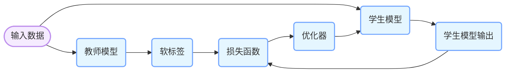

# 模型蒸馏技术在推理任务中的创新应用

> 关键词：模型蒸馏技术、推理任务、创新应用、知识传递、轻量级模型

> 摘要：本文聚焦于模型蒸馏技术在推理任务中的创新应用。首先介绍了模型蒸馏技术及推理任务的背景知识，阐述了开展相关研究的目的、范围和预期读者。接着详细讲解了模型蒸馏的核心概念、算法原理、数学模型，通过 Python 代码进行了算法实现的展示。在项目实战部分，搭建了开发环境，给出源代码并进行解读分析。探讨了模型蒸馏技术在多个实际场景中的应用，推荐了学习资源、开发工具框架和相关论文著作。最后总结了未来发展趋势与挑战，解答了常见问题，并提供了扩展阅读与参考资料，旨在全面深入地探讨模型蒸馏技术在推理任务中的创新潜力和价值。

## 1. 背景介绍 
### 1.1 目的和范围
在当今人工智能领域，大型深度学习模型在各种任务中展现出了卓越的性能。然而，这些模型往往具有巨大的参数量和复杂的结构，导致在推理阶段需要大量的计算资源和较长的推理时间。这使得它们在一些资源受限的场景，如移动设备、边缘计算设备等，难以得到有效的应用。模型蒸馏技术应运而生，其目的是将大型复杂模型（教师模型）的知识传递给小型简单模型（学生模型），从而在保持一定性能的前提下，显著减少模型的计算量和存储需求。

本文的范围主要涵盖模型蒸馏技术在推理任务中的创新应用。具体包括模型蒸馏的核心概念、算法原理、数学模型，以及如何将其应用于实际的推理任务中。通过项目实战案例，展示模型蒸馏技术在实际场景中的有效性和实用性。同时，还将探讨模型蒸馏技术在不同领域的应用前景和面临的挑战。

### 1.2 预期读者
本文的预期读者包括对深度学习、模型压缩和推理优化感兴趣的研究人员、工程师和开发者。对于那些希望在资源受限的环境中部署深度学习模型的从业者，本文提供了模型蒸馏技术的详细介绍和实际应用案例，具有较高的参考价值。此外，对人工智能领域前沿技术有探索欲望的学生和爱好者也可以通过阅读本文，了解模型蒸馏技术的基本原理和创新应用。

### 1.3 文档结构概述
本文的文档结构如下：
- 核心概念与联系：介绍模型蒸馏技术和推理任务的核心概念，以及它们之间的联系，并通过文本示意图和 Mermaid 流程图进行直观展示。
- 核心算法原理 & 具体操作步骤：详细讲解模型蒸馏的核心算法原理，使用 Python 源代码进行具体实现，并给出详细的操作步骤。
- 数学模型和公式 & 详细讲解 & 举例说明：推导模型蒸馏的数学模型和公式，进行详细的讲解，并通过具体的例子进行说明。
- 项目实战：代码实际案例和详细解释说明：搭建开发环境，给出模型蒸馏在推理任务中的源代码，并进行详细的解读和分析。
- 实际应用场景：探讨模型蒸馏技术在不同领域的实际应用场景。
- 工具和资源推荐：推荐学习模型蒸馏技术的相关书籍、在线课程、技术博客和网站，以及开发工具框架和相关论文著作。
- 总结：未来发展趋势与挑战：总结模型蒸馏技术在推理任务中的发展趋势和面临的挑战。
- 附录：常见问题与解答：解答读者在学习和应用模型蒸馏技术过程中常见的问题。
- 扩展阅读 & 参考资料：提供相关的扩展阅读资料和参考文献。

### 1.4 术语表
#### 1.4.1 核心术语定义
- **模型蒸馏（Model Distillation）**：一种将大型复杂模型（教师模型）的知识传递给小型简单模型（学生模型）的技术，通过让学生模型学习教师模型的输出分布，从而在保持一定性能的前提下，减少模型的计算量和存储需求。
- **教师模型（Teacher Model）**：在模型蒸馏中，具有较高性能和复杂结构的大型模型，其知识将被传递给学生模型。
- **学生模型（Student Model）**：在模型蒸馏中，结构简单、计算量小的模型，通过学习教师模型的知识来提高自身性能。
- **推理任务（Inference Task）**：在深度学习中，使用训练好的模型对新的数据进行预测或分类的任务。
- **知识传递（Knowledge Transfer）**：将教师模型的知识传递给学生模型的过程，通常通过最小化学生模型和教师模型输出之间的差异来实现。

#### 1.4.2 相关概念解释
- **软标签（Soft Labels）**：在模型蒸馏中，教师模型的输出通常是经过 softmax 函数处理后的概率分布，这些概率值被称为软标签。与硬标签（如分类任务中的类别标签）相比，软标签包含了更多的信息，可以帮助学生模型更好地学习。
- **温度参数（Temperature Parameter）**：在计算软标签时，通常会引入一个温度参数 $T$，用于控制概率分布的平滑程度。较高的温度会使概率分布更加平滑，较低的温度会使概率分布更加集中。

#### 1.4.3 缩略词列表
- **DNN**：深度神经网络（Deep Neural Network）
- **CNN**：卷积神经网络（Convolutional Neural Network）
- **RNN**：循环神经网络（Recurrent Neural Network）
- **MLP**：多层感知机（Multi-Layer Perceptron）

## 2. 核心概念与联系 
### 核心概念原理
模型蒸馏技术的核心思想是将教师模型的知识传递给学生模型。教师模型通常是一个在大规模数据集上训练得到的、具有较高性能的复杂模型，而学生模型则是一个结构简单、计算量小的模型。通过让学生模型学习教师模型的输出分布，学生模型可以在保持一定性能的前提下，显著减少计算量和存储需求。

具体来说，模型蒸馏的过程可以分为以下几个步骤：
1. **训练教师模型**：使用大规模数据集训练一个复杂的教师模型，使其在目标任务上达到较高的性能。
2. **生成软标签**：使用训练好的教师模型对训练数据进行推理，得到教师模型的输出，经过 softmax 函数处理后得到软标签。
3. **训练学生模型**：在训练学生模型时，除了使用真实标签进行监督学习外，还让学生模型学习教师模型的软标签。通常使用一个损失函数来衡量学生模型的输出和教师模型的软标签之间的差异，通过最小化这个损失函数来更新学生模型的参数。

### 架构的文本示意图
```plaintext
输入数据 -> 教师模型 -> 软标签
输入数据 -> 学生模型 -> 学生模型输出
损失函数：衡量学生模型输出和软标签之间的差异
优化器：根据损失函数更新学生模型的参数
```

### Mermaid 流程图


## 3. 核心算法原理 & 具体操作步骤 
### 核心算法原理
模型蒸馏的核心算法基于知识蒸馏损失函数。通常使用的损失函数是 Kullback-Leibler（KL）散度，用于衡量两个概率分布之间的差异。设教师模型的输出为 $p_t$，学生模型的输出为 $p_s$，则 KL 散度的计算公式为：

$$
D_{KL}(p_t || p_s) = \sum_{i} p_t(i) \log \frac{p_t(i)}{p_s(i)}
$$

在模型蒸馏中，为了控制软标签的平滑程度，通常会引入一个温度参数 $T$。在计算软标签和学生模型的输出时，分别对教师模型和学生模型的 logits 进行 softmax 操作，其中 softmax 函数的定义为：

$$
\text{softmax}(z)_i = \frac{\exp(z_i / T)}{\sum_{j} \exp(z_j / T)}
$$

其中 $z$ 是 logits，$T$ 是温度参数。

模型蒸馏的总损失函数通常由两部分组成：一部分是学生模型的输出和真实标签之间的交叉熵损失 $L_{ce}$，另一部分是学生模型的输出和教师模型的软标签之间的 KL 散度损失 $L_{kl}$。总损失函数的计算公式为：

$$
L = \alpha L_{ce} + (1 - \alpha) L_{kl}
$$

其中 $\alpha$ 是一个超参数，用于控制两部分损失的权重。

### 具体操作步骤
以下是使用 Python 和 PyTorch 实现模型蒸馏的具体操作步骤：

```python
import torch
import torch.nn as nn
import torch.optim as optim

# 定义教师模型和学生模型
class TeacherModel(nn.Module):
    def __init__(self):
        super(TeacherModel, self).__init__()
        # 定义教师模型的结构
        self.fc1 = nn.Linear(10, 20)
        self.fc2 = nn.Linear(20, 5)

    def forward(self, x):
        x = torch.relu(self.fc1(x))
        x = self.fc2(x)
        return x

class StudentModel(nn.Module):
    def __init__(self):
        super(StudentModel, self).__init__()
        # 定义学生模型的结构
        self.fc1 = nn.Linear(10, 10)
        self.fc2 = nn.Linear(10, 5)

    def forward(self, x):
        x = torch.relu(self.fc1(x))
        x = self.fc2(x)
        return x

# 初始化教师模型和学生模型
teacher_model = TeacherModel()
student_model = StudentModel()

# 定义损失函数和优化器
criterion_ce = nn.CrossEntropyLoss()
criterion_kl = nn.KLDivLoss(reduction='batchmean')
optimizer = optim.Adam(student_model.parameters(), lr=0.001)

# 定义超参数
alpha = 0.5
T = 2.0

# 模拟训练数据
inputs = torch.randn(32, 10)
labels = torch.randint(0, 5, (32,))

# 训练学生模型
for epoch in range(100):
    # 教师模型前向传播
    teacher_logits = teacher_model(inputs)
    teacher_probs = torch.softmax(teacher_logits / T, dim=1)

    # 学生模型前向传播
    student_logits = student_model(inputs)
    student_probs = torch.softmax(student_logits / T, dim=1)

    # 计算交叉熵损失
    loss_ce = criterion_ce(student_logits, labels)

    # 计算 KL 散度损失
    loss_kl = criterion_kl(torch.log(student_probs), teacher_probs)

    # 计算总损失
    loss = alpha * loss_ce + (1 - alpha) * loss_kl

    # 反向传播和参数更新
    optimizer.zero_grad()
    loss.backward()
    optimizer.step()

    if (epoch + 1) % 10 == 0:
        print(f'Epoch {epoch + 1}, Loss: {loss.item()}')
```

### 代码解释
1. **定义教师模型和学生模型**：分别定义了教师模型和学生模型的结构，教师模型相对复杂，学生模型相对简单。
2. **定义损失函数和优化器**：使用交叉熵损失函数 `nn.CrossEntropyLoss()` 计算学生模型的输出和真实标签之间的损失，使用 KL 散度损失函数 `nn.KLDivLoss()` 计算学生模型的输出和教师模型的软标签之间的损失。使用 Adam 优化器更新学生模型的参数。
3. **定义超参数**：设置 $\alpha$ 和 $T$ 的值，分别用于控制两部分损失的权重和软标签的平滑程度。
4. **模拟训练数据**：生成随机的输入数据和标签。
5. **训练学生模型**：在每个 epoch 中，首先进行教师模型的前向传播，得到教师模型的软标签。然后进行学生模型的前向传播，得到学生模型的输出。计算交叉熵损失和 KL 散度损失，然后计算总损失。最后进行反向传播和参数更新。

## 4. 数学模型和公式 & 详细讲解 & 举例说明 
### 数学模型和公式
#### 软标签的计算
在模型蒸馏中，教师模型的输出通常是未经过 softmax 函数处理的 logits $z_t$。为了得到软标签 $p_t$，需要对 logits 进行 softmax 操作，并引入温度参数 $T$：

$$
p_t(i) = \frac{\exp(z_t(i) / T)}{\sum_{j} \exp(z_t(j) / T)}
$$

其中 $z_t(i)$ 是教师模型第 $i$ 个类别的 logits，$T$ 是温度参数。

#### 学生模型的输出
学生模型的输出同样是未经过 softmax 函数处理的 logits $z_s$。为了与教师模型的软标签进行比较，需要对学生模型的 logits 进行 softmax 操作，并使用相同的温度参数 $T$：

$$
p_s(i) = \frac{\exp(z_s(i) / T)}{\sum_{j} \exp(z_s(j) / T)}
$$

#### KL 散度损失
KL 散度用于衡量两个概率分布之间的差异。在模型蒸馏中，使用 KL 散度来衡量学生模型的输出 $p_s$ 和教师模型的软标签 $p_t$ 之间的差异：

$$
L_{kl} = D_{KL}(p_t || p_s) = \sum_{i} p_t(i) \log \frac{p_t(i)}{p_s(i)}
$$

#### 交叉熵损失
交叉熵损失用于衡量学生模型的输出 $z_s$ 和真实标签 $y$ 之间的差异：

$$
L_{ce} = -\sum_{i} y(i) \log \text{softmax}(z_s(i))
$$

其中 $y(i)$ 是真实标签的 one-hot 编码。

#### 总损失函数
模型蒸馏的总损失函数由交叉熵损失和 KL 散度损失两部分组成：

$$
L = \alpha L_{ce} + (1 - \alpha) L_{kl}
$$

其中 $\alpha$ 是一个超参数，用于控制两部分损失的权重。

### 详细讲解
- **温度参数 $T$ 的作用**：温度参数 $T$ 用于控制软标签的平滑程度。当 $T$ 较大时，softmax 函数的输出会更加平滑，即各个类别的概率分布更加均匀；当 $T$ 较小时，softmax 函数的输出会更加集中，即概率分布更加偏向于概率最大的类别。在模型蒸馏中，适当增大 $T$ 可以使教师模型的软标签包含更多的信息，从而帮助学生模型更好地学习。
- **权重参数 $\alpha$ 的作用**：权重参数 $\alpha$ 用于控制交叉熵损失和 KL 散度损失的权重。当 $\alpha$ 较大时，总损失函数更侧重于学生模型的输出和真实标签之间的差异；当 $\alpha$ 较小时，总损失函数更侧重于学生模型的输出和教师模型的软标签之间的差异。通过调整 $\alpha$ 的值，可以平衡学生模型在真实标签和教师模型知识之间的学习。

### 举例说明
假设我们有一个三分类任务，教师模型的输出 logits 为 $z_t = [2, 1, 0]$，学生模型的输出 logits 为 $z_s = [1, 0.5, 0]$，真实标签为 $y = [1, 0, 0]$。

#### 计算软标签
设温度参数 $T = 2$，则教师模型的软标签为：

$$
p_t(1) = \frac{\exp(2 / 2)}{\exp(2 / 2) + \exp(1 / 2) + \exp(0 / 2)} \approx 0.665
$$

$$
p_t(2) = \frac{\exp(1 / 2)}{\exp(2 / 2) + \exp(1 / 2) + \exp(0 / 2)} \approx 0.244
$$

$$
p_t(3) = \frac{\exp(0 / 2)}{\exp(2 / 2) + \exp(1 / 2) + \exp(0 / 2)} \approx 0.091
$$

#### 计算学生模型的输出
同样使用温度参数 $T = 2$，则学生模型的输出为：

$$
p_s(1) = \frac{\exp(1 / 2)}{\exp(1 / 2) + \exp(0.5 / 2) + \exp(0 / 2)} \approx 0.507
$$

$$
p_s(2) = \frac{\exp(0.5 / 2)}{\exp(1 / 2) + \exp(0.5 / 2) + \exp(0 / 2)} \approx 0.283
$$

$$
p_s(3) = \frac{\exp(0 / 2)}{\exp(1 / 2) + \exp(0.5 / 2) + \exp(0 / 2)} \approx 0.210
$$

#### 计算 KL 散度损失
$$
L_{kl} = D_{KL}(p_t || p_s) = 0.665 \log \frac{0.665}{0.507} + 0.244 \log \frac{0.244}{0.283} + 0.091 \log \frac{0.091}{0.210} \approx 0.104
$$

#### 计算交叉熵损失
$$
L_{ce} = -\left(1 \log 0.507 + 0 \log 0.283 + 0 \log 0.210\right) \approx 0.681
$$

#### 计算总损失
设 $\alpha = 0.5$，则总损失为：

$$
L = 0.5 \times 0.681 + (1 - 0.5) \times 0.104 = 0.3925
$$

## 5. 项目实战：代码实际案例和详细解释说明 
### 5.1  开发环境搭建
#### 安装 Python
首先需要安装 Python，建议使用 Python 3.7 及以上版本。可以从 Python 官方网站（https://www.python.org/downloads/）下载并安装。

#### 安装 PyTorch
PyTorch 是一个广泛使用的深度学习框架，用于实现模型蒸馏。可以根据自己的系统和 CUDA 版本选择合适的安装方式，具体安装命令可以参考 PyTorch 官方网站（https://pytorch.org/get-started/locally/）。例如，在使用 CPU 的情况下，可以使用以下命令安装：

```sh
pip install torch torchvision
```

#### 安装其他依赖库
还需要安装一些其他的依赖库，如 `numpy`、`matplotlib` 等，可以使用以下命令安装：

```sh
pip install numpy matplotlib
```

### 5.2  源代码详细实现和代码解读
以下是一个完整的模型蒸馏项目实战代码，使用 PyTorch 在 MNIST 数据集上进行手写数字分类任务：

```python
import torch
import torch.nn as nn
import torch.optim as optim
import torchvision
import torchvision.transforms as transforms

# 定义教师模型
class TeacherModel(nn.Module):
    def __init__(self):
        super(TeacherModel, self).__init__()
        self.conv1 = nn.Conv2d(1, 32, kernel_size=3, padding=1)
        self.conv2 = nn.Conv2d(32, 64, kernel_size=3, padding=1)
        self.pool = nn.MaxPool2d(2, 2)
        self.fc1 = nn.Linear(64 * 7 * 7, 128)
        self.fc2 = nn.Linear(128, 10)

    def forward(self, x):
        x = self.pool(torch.relu(self.conv1(x)))
        x = self.pool(torch.relu(self.conv2(x)))
        x = x.view(-1, 64 * 7 * 7)
        x = torch.relu(self.fc1(x))
        x = self.fc2(x)
        return x

# 定义学生模型
class StudentModel(nn.Module):
    def __init__(self):
        super(StudentModel, self).__init__()
        self.fc1 = nn.Linear(28 * 28, 64)
        self.fc2 = nn.Linear(64, 10)

    def forward(self, x):
        x = x.view(-1, 28 * 28)
        x = torch.relu(self.fc1(x))
        x = self.fc2(x)
        return x

# 数据加载
transform = transforms.Compose([
    transforms.ToTensor(),
    transforms.Normalize((0.5,), (0.5,))
])

trainset = torchvision.datasets.MNIST(root='./data', train=True,
                                      download=True, transform=transform)
trainloader = torch.utils.data.DataLoader(trainset, batch_size=64,
                                          shuffle=True)

testset = torchvision.datasets.MNIST(root='./data', train=False,
                                     download=True, transform=transform)
testloader = torch.utils.data.DataLoader(testset, batch_size=64,
                                         shuffle=False)

# 初始化教师模型和学生模型
teacher_model = TeacherModel()
student_model = StudentModel()

# 定义损失函数和优化器
criterion_ce = nn.CrossEntropyLoss()
criterion_kl = nn.KLDivLoss(reduction='batchmean')
optimizer = optim.Adam(student_model.parameters(), lr=0.001)

# 定义超参数
alpha = 0.5
T = 2.0

# 训练教师模型（这里省略了教师模型的训练过程，假设已经训练好）
#...

# 训练学生模型
for epoch in range(10):
    running_loss = 0.0
    for i, data in enumerate(trainloader, 0):
        inputs, labels = data

        # 教师模型前向传播
        teacher_logits = teacher_model(inputs)
        teacher_probs = torch.softmax(teacher_logits / T, dim=1)

        # 学生模型前向传播
        student_logits = student_model(inputs)
        student_probs = torch.softmax(student_logits / T, dim=1)

        # 计算交叉熵损失
        loss_ce = criterion_ce(student_logits, labels)

        # 计算 KL 散度损失
        loss_kl = criterion_kl(torch.log(student_probs), teacher_probs)

        # 计算总损失
        loss = alpha * loss_ce + (1 - alpha) * loss_kl

        # 反向传播和参数更新
        optimizer.zero_grad()
        loss.backward()
        optimizer.step()

        running_loss += loss.item()

    print(f'Epoch {epoch + 1}, Loss: {running_loss / len(trainloader)}')

# 测试学生模型
correct = 0
total = 0
with torch.no_grad():
    for data in testloader:
        images, labels = data
        outputs = student_model(images)
        _, predicted = torch.max(outputs.data, 1)
        total += labels.size(0)
        correct += (predicted == labels).sum().item()

print(f'Accuracy of the student model on the 10000 test images: {100 * correct / total}%')
```

### 代码解读
1. **定义教师模型和学生模型**：教师模型是一个简单的卷积神经网络，包含两个卷积层和两个全连接层；学生模型是一个简单的多层感知机，包含两个全连接层。教师模型相对复杂，学生模型相对简单。
2. **数据加载**：使用 `torchvision` 库加载 MNIST 数据集，并进行数据预处理，包括将图像转换为张量和归一化处理。
3. **定义损失函数和优化器**：使用交叉熵损失函数 `nn.CrossEntropyLoss()` 计算学生模型的输出和真实标签之间的损失，使用 KL 散度损失函数 `nn.KLDivLoss()` 计算学生模型的输出和教师模型的软标签之间的损失。使用 Adam 优化器更新学生模型的参数。
4. **定义超参数**：设置 $\alpha$ 和 $T$ 的值，分别用于控制两部分损失的权重和软标签的平滑程度。
5. **训练学生模型**：在每个 epoch 中，首先进行教师模型的前向传播，得到教师模型的软标签。然后进行学生模型的前向传播，得到学生模型的输出。计算交叉熵损失和 KL 散度损失，然后计算总损失。最后进行反向传播和参数更新。
6. **测试学生模型**：使用测试数据集对训练好的学生模型进行测试，计算模型的准确率。

### 5.3  代码解读与分析
#### 模型复杂度对比
教师模型使用了卷积层，能够更好地提取图像的特征，模型复杂度较高；学生模型只使用了全连接层，模型复杂度较低。通过模型蒸馏，学生模型可以学习到教师模型的知识，从而在保持较低复杂度的情况下，达到较高的性能。

#### 损失函数分析
总损失函数由交叉熵损失和 KL 散度损失两部分组成。交叉熵损失用于监督学生模型的输出和真实标签之间的差异，保证学生模型能够正确分类；KL 散度损失用于监督学生模型的输出和教师模型的软标签之间的差异，使学生模型能够学习到教师模型的知识。通过调整 $\alpha$ 的值，可以平衡两部分损失的权重。

#### 温度参数分析
温度参数 $T$ 用于控制软标签的平滑程度。当 $T$ 较大时，软标签的概率分布更加均匀，包含更多的信息，有助于学生模型学习到更丰富的知识；当 $T$ 较小时，软标签的概率分布更加集中，更接近硬标签，可能会导致学生模型学习到的知识有限。在实际应用中，需要根据具体任务和数据集调整 $T$ 的值。

## 6. 实际应用场景 
### 移动设备端推理
在移动设备上，如智能手机、平板电脑等，计算资源和存储容量通常比较有限。大型深度学习模型难以在这些设备上实时运行。模型蒸馏技术可以将大型模型的知识传递给小型模型，从而在移动设备上实现高效的推理任务。例如，在图像分类、目标检测等任务中，使用模型蒸馏后的轻量级模型可以在保证一定准确率的前提下，显著减少计算量和能耗，提高设备的续航能力。

### 边缘计算场景
边缘计算是指在靠近数据源的边缘节点上进行数据处理和分析的计算模式。在边缘计算场景中，由于网络带宽和延迟的限制，将数据传输到云端进行处理可能会导致实时性问题。模型蒸馏技术可以在边缘设备上部署轻量级模型，实现本地推理，减少数据传输量，提高系统的实时性和可靠性。例如，在智能摄像头、工业传感器等设备中，使用模型蒸馏后的模型可以实时对图像、视频、传感器数据等进行分析和处理。

### 物联网设备推理
物联网设备通常具有低功耗、低成本的特点，其计算能力和存储容量也非常有限。模型蒸馏技术可以为物联网设备提供轻量级的推理解决方案。例如，在智能家居设备中，如智能门锁、智能家电等，使用模型蒸馏后的模型可以实现人脸识别、语音识别等功能，提高设备的智能化水平。

### 实时在线服务
在实时在线服务中，如搜索引擎、推荐系统等，需要对大量的用户请求进行快速响应。模型蒸馏技术可以将大型复杂模型的知识传递给小型模型，从而在保证服务质量的前提下，提高系统的响应速度和吞吐量。例如，在电商平台的商品推荐系统中，使用模型蒸馏后的轻量级模型可以实时为用户推荐个性化的商品，提高用户的购物体验。

## 7. 工具和资源推荐
### 7.1 学习资源推荐
#### 7.1.1 书籍推荐
- 《深度学习》（Deep Learning）：由 Ian Goodfellow、Yoshua Bengio 和 Aaron Courville 所著，是深度学习领域的经典教材，涵盖了深度学习的基本概念、算法和应用。
- 《动手学深度学习》（Dive into Deep Learning）：由 Aston Zhang、Zack C. Lipton、Mu Li 和 Alexander J. Smola 所著，提供了丰富的深度学习代码示例和详细的解释，适合初学者入门。
- 《神经网络与深度学习》：由邱锡鹏所著，系统地介绍了神经网络和深度学习的基本原理、算法和应用，内容丰富，讲解详细。

#### 7.1.2 在线课程
- Coursera 上的 “深度学习专项课程”（Deep Learning Specialization）：由 Andrew Ng 教授授课，包括五门课程，涵盖了深度学习的各个方面，是学习深度学习的经典在线课程。
- edX 上的 “强化学习”（Reinforcement Learning）：由 Richard S. Sutton 和 Andrew G. Barto 所著的《强化学习：原理与Python实现》一书的作者授课，系统地介绍了强化学习的基本概念、算法和应用。
- 哔哩哔哩（B 站）上的 “李宏毅机器学习” 课程：由台湾大学李宏毅教授授课，课程内容生动有趣，易于理解，适合初学者入门。

#### 7.1.3 技术博客和网站
- Medium 上的 Towards Data Science：是一个专注于数据科学和机器学习的技术博客平台，提供了大量的高质量文章和教程。
- arXiv.org：是一个预印本平台，提供了最新的学术研究论文，包括深度学习、模型蒸馏等领域的研究成果。
- Kaggle：是一个数据科学竞赛平台，提供了丰富的数据集和代码示例，以及社区交流和学习的机会。

### 7.2 开发工具框架推荐
#### 7.2.1 IDE和编辑器
- PyCharm：是一个专门为 Python 开发设计的集成开发环境（IDE），提供了丰富的代码编辑、调试和分析功能，适合专业开发者使用。
- Jupyter Notebook：是一个交互式的笔记本环境，支持 Python、R 等多种编程语言，适合数据探索、模型开发和实验验证。
- Visual Studio Code：是一个轻量级的代码编辑器，支持多种编程语言和插件扩展，具有丰富的代码编辑和调试功能，适合初学者和快速开发。

#### 7.2.2 调试和性能分析工具
- PyTorch Profiler：是 PyTorch 提供的性能分析工具，可以帮助开发者分析模型的运行时间、内存使用等性能指标，找出性能瓶颈。
- TensorBoard：是 TensorFlow 提供的可视化工具，也可以与 PyTorch 结合使用，用于可视化模型的训练过程、损失曲线、准确率等指标。
- NVIDIA Nsight Systems：是 NVIDIA 提供的性能分析工具，专门用于分析 GPU 应用程序的性能，包括深度学习模型的训练和推理过程。

#### 7.2.3 相关框架和库
- PyTorch：是一个广泛使用的深度学习框架，提供了丰富的神经网络层、优化器和损失函数，支持 GPU 加速，易于使用和扩展。
- TensorFlow：是另一个流行的深度学习框架，具有强大的分布式训练和部署能力，提供了丰富的工具和库，适合大规模工业应用。
- Hugging Face Transformers：是一个基于 PyTorch 和 TensorFlow 的自然语言处理库，提供了预训练的语言模型和各种自然语言处理任务的工具和示例。

### 7.3 相关论文著作推荐
#### 7.3.1 经典论文
- “Distilling the Knowledge in a Neural Network”：由 Geoffrey Hinton、Oriol Vinyals 和 Jeff Dean 发表，是模型蒸馏领域的开创性论文，首次提出了模型蒸馏的概念和方法。
- “FitNets: Hints for Thin Deep Nets”：提出了一种基于特征匹配的模型蒸馏方法，通过让学生模型学习教师模型的中间层特征，提高学生模型的性能。
- “Pay Attention! Distilling Knowledge via Attention Transfer”：提出了一种基于注意力转移的模型蒸馏方法，通过让学生模型学习教师模型的注意力机制，提高学生模型的性能。

#### 7.3.2 最新研究成果
- 近年来，模型蒸馏技术在不断发展和创新，出现了许多新的研究成果。例如，一些研究将模型蒸馏与其他技术相结合，如剪枝、量化等，进一步提高模型的压缩率和推理效率；另一些研究探索了模型蒸馏在不同领域的应用，如计算机视觉、自然语言处理、强化学习等。可以通过 arXiv.org 等平台关注最新的研究论文。

#### 7.3.3 应用案例分析
- 在实际应用中，模型蒸馏技术已经取得了许多成功的案例。例如，在图像分类任务中，使用模型蒸馏后的轻量级模型可以在保证一定准确率的前提下，显著减少计算量和存储需求；在自然语言处理任务中，模型蒸馏可以提高模型的推理速度和效率。可以通过相关的技术博客、会议论文等了解这些应用案例的具体实现和效果。

## 8. 总结：未来发展趋势与挑战
### 未来发展趋势
#### 与其他技术的融合
模型蒸馏技术将与其他模型压缩技术，如剪枝、量化等，进一步融合，以实现更高的模型压缩率和推理效率。例如，先对大型模型进行剪枝，去除冗余的参数，然后使用模型蒸馏技术将剪枝后的模型知识传递给小型模型，最后对小型模型进行量化，将参数表示为低精度的数据类型，从而在保证模型性能的前提下，显著减少模型的计算量和存储需求。

#### 多模态知识蒸馏
随着多模态数据（如图像、文本、音频等）的广泛应用，多模态知识蒸馏将成为未来的一个重要研究方向。多模态知识蒸馏旨在将不同模态的教师模型的知识传递给学生模型，使学生模型能够处理多模态数据。例如，在图像-文本匹配任务中，将图像模态的教师模型和文本模态的教师模型的知识传递给学生模型，提高学生模型的匹配性能。

#### 自适应知识蒸馏
自适应知识蒸馏将根据不同的任务、数据集和设备资源，自动调整知识蒸馏的参数和策略，以实现最优的模型压缩和推理性能。例如，在资源受限的设备上，自适应知识蒸馏可以自动选择合适的学生模型结构和知识蒸馏方法，使模型在保证一定性能的前提下，尽可能减少计算量和存储需求。

#### 强化学习中的知识蒸馏
强化学习中的知识蒸馏将成为另一个重要的研究方向。在强化学习中，大型复杂的策略网络通常需要大量的训练时间和计算资源。模型蒸馏技术可以将大型策略网络的知识传递给小型策略网络，从而在保证一定性能的前提下，提高强化学习的训练效率和推理速度。

### 面临的挑战
#### 知识传递的有效性
如何有效地将教师模型的知识传递给学生模型，是模型蒸馏技术面临的一个重要挑战。由于教师模型和学生模型的结构和复杂度不同，直接将教师模型的输出作为软标签传递给学生模型可能无法充分利用教师模型的知识。因此，需要研究更加有效的知识传递方法，如基于特征匹配、注意力转移等方法，以提高知识传递的有效性。

#### 超参数的选择
模型蒸馏中的超参数，如温度参数 $T$、权重参数 $\alpha$ 等，对模型的性能有重要影响。如何选择合适的超参数是一个具有挑战性的问题。目前，超参数的选择通常依赖于经验和实验，缺乏理论指导。因此，需要研究更加科学的超参数选择方法，以提高模型蒸馏的性能和稳定性。

#### 模型的泛化能力
在模型蒸馏过程中，学生模型可能会过度拟合教师模型的输出，导致模型的泛化能力下降。如何提高学生模型的泛化能力是模型蒸馏技术面临的另一个挑战。可以通过引入正则化方法、增加训练数据等方式来提高学生模型的泛化能力。

#### 可解释性
模型蒸馏技术通常是一个黑盒过程，缺乏可解释性。在一些对模型可解释性要求较高的应用场景中，如医疗诊断、金融风险评估等，模型的可解释性是一个重要的考虑因素。因此，需要研究模型蒸馏技术的可解释性方法，以提高模型的可信度和可靠性。

## 9. 附录：常见问题与解答
### 1. 模型蒸馏和模型压缩有什么区别？
模型蒸馏是一种模型压缩技术，但它与其他模型压缩技术（如剪枝、量化等）有所不同。模型蒸馏通过将大型复杂模型（教师模型）的知识传递给小型简单模型（学生模型），使学生模型在保持一定性能的前提下，减少计算量和存储需求。而剪枝是通过去除模型中冗余的参数来压缩模型；量化是将模型的参数表示为低精度的数据类型来减少存储需求。模型蒸馏更侧重于知识的传递，而其他模型压缩技术更侧重于参数的减少。

### 2. 模型蒸馏中的温度参数 $T$ 有什么作用？
温度参数 $T$ 用于控制软标签的平滑程度。在计算软标签时，对教师模型的 logits 进行 softmax 操作，并引入温度参数 $T$。当 $T$ 较大时，softmax 函数的输出会更加平滑，即各个类别的概率分布更加均匀；当 $T$ 较小时，softmax 函数的输出会更加集中，即概率分布更加偏向于概率最大的类别。在模型蒸馏中，适当增大 $T$ 可以使教师模型的软标签包含更多的信息，从而帮助学生模型更好地学习。

### 3. 如何选择模型蒸馏中的权重参数 $\alpha$？
权重参数 $\alpha$ 用于控制交叉熵损失和 KL 散度损失的权重。当 $\alpha$ 较大时，总损失函数更侧重于学生模型的输出和真实标签之间的差异；当 $\alpha$ 较小时，总损失函数更侧重于学生模型的输出和教师模型的软标签之间的差异。选择 $\alpha$ 的值通常需要根据具体任务和数据集进行实验和调整。一般来说，可以先尝试不同的 $\alpha$ 值，观察学生模型的性能变化，选择使学生模型性能最优的 $\alpha$ 值。

### 4. 模型蒸馏可以应用于所有类型的深度学习模型吗？
模型蒸馏可以应用于大多数类型的深度学习模型，包括卷积神经网络（CNN）、循环神经网络（RNN）、多层感知机（MLP）等。只要存在一个教师模型和一个学生模型，就可以使用模型蒸馏技术将教师模型的知识传递给学生模型。不过，在不同类型的模型中，模型蒸馏的具体实现和效果可能会有所不同。例如，在 CNN 中，可以通过让学生模型学习教师模型的中间层特征来提高性能；在 RNN 中，需要考虑序列数据的特点进行知识传递。

### 5. 模型蒸馏后的学生模型性能一定能达到教师模型的性能吗？
模型蒸馏后的学生模型性能通常不能完全达到教师模型的性能，但可以在保持一定性能的前提下，显著减少计算量和存储需求。学生模型的性能受到多种因素的影响，如教师模型的性能、学生模型的结构、知识传递的方法、超参数的选择等。在实际应用中，需要根据具体任务和需求，权衡学生模型的性能和计算资源，选择合适的模型蒸馏方法和参数。

## 10. 扩展阅读 & 参考资料
### 扩展阅读
- “Model Compression and Acceleration for Deep Neural Networks: The Principles, Progress, and Challenges”：这篇综述文章详细介绍了深度学习模型压缩和加速的原理、方法和挑战，包括模型蒸馏、剪枝、量化等技术。
- “Neural Architecture Search: A Survey”：这篇综述文章介绍了神经网络架构搜索的方法和进展，模型蒸馏可以与神经网络架构搜索相结合，以自动搜索出最优的学生模型结构。
- “Federated Learning: Challenges, Methods, and Future Directions”：这篇综述文章介绍了联邦学习的概念、方法和挑战，模型蒸馏可以在联邦学习中用于保护数据隐私和提高模型性能。

### 参考资料
- Hinton, G., Vinyals, O., & Dean, J. (2015). Distilling the Knowledge in a Neural Network. arXiv preprint arXiv:1503.02531.
- Romero, A., Ballas, N., Kahou, S. E., Chassang, A., Gatta, C., & Bengio, Y. (2014). FitNets: Hints for Thin Deep Nets. arXiv preprint arXiv:1412.6550.
- Zagoruyko, S., & Komodakis, N. (2016). Pay Attention! Distilling Knowledge via Attention Transfer. arXiv preprint arXiv:1612.03928.

作者：AI天才研究院/AI Genius Institute & 禅与计算机程序设计艺术 /Zen And The Art of Computer Programming