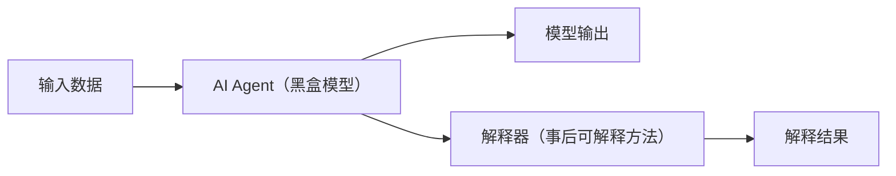

# 模型解释：增加AI Agent的透明度

> 关键词：模型解释、AI Agent、透明度、可解释性AI、机器学习、深度学习、决策过程

> 摘要：本文聚焦于模型解释以及如何增加AI Agent的透明度。在当今AI广泛应用的背景下，AI Agent的决策过程往往是不透明的，这给其应用带来了诸多挑战，如信任问题、安全隐患等。文章将深入探讨模型解释的核心概念与联系，详细阐述相关核心算法原理及具体操作步骤，借助数学模型和公式进行理论分析，并结合实际案例进行说明。同时，会介绍实际应用场景、推荐相关工具和资源，最后对未来发展趋势与挑战进行总结，旨在为读者全面呈现增加AI Agent透明度的相关知识和方法。

## 1. 背景介绍 
### 1.1 目的和范围
随着人工智能技术的飞速发展，AI Agent在各个领域得到了广泛应用，如医疗诊断、金融风险评估、自动驾驶等。然而，许多AI Agent尤其是基于深度学习的模型，其决策过程犹如一个“黑盒”，难以理解和解释。这就导致了用户对AI Agent的信任度降低，在一些关键领域的应用也受到了限制。本文的目的就是探讨如何通过模型解释来增加AI Agent的透明度，使人们能够理解其决策过程和依据。范围涵盖了模型解释的基本概念、算法原理、实际应用案例以及相关工具和资源等方面。

### 1.2 预期读者
本文预期读者包括人工智能领域的研究人员、开发者、数据科学家，以及对AI Agent可解释性感兴趣的相关从业者。对于正在学习人工智能的学生，本文也能提供有价值的参考，帮助他们深入理解模型解释和AI Agent透明度的重要性。

### 1.3 文档结构概述
本文首先介绍背景信息，包括目的、预期读者和文档结构概述等。接着阐述核心概念与联系，通过文本示意图和Mermaid流程图展示相关原理和架构。然后详细讲解核心算法原理和具体操作步骤，结合Python源代码进行说明。之后运用数学模型和公式进行理论分析，并举例说明。再通过项目实战展示代码实际案例并进行详细解释。随后介绍实际应用场景，推荐相关工具和资源。最后对未来发展趋势与挑战进行总结，还包含常见问题与解答以及扩展阅读和参考资料。

### 1.4 术语表
#### 1.4.1 核心术语定义
- **模型解释**：指对机器学习或深度学习模型的决策过程和输出结果进行解释和说明，使其能够被人类理解。
- **AI Agent**：是一种能够感知环境、做出决策并采取行动以实现特定目标的人工智能实体。
- **透明度**：在AI领域中，指AI Agent的决策过程和内部机制能够被清晰地观察和理解的程度。
- **可解释性AI**：致力于开发能够提供清晰解释的人工智能模型和方法，以增强模型的透明度和可信度。

#### 1.4.2 相关概念解释
- **黑盒模型**：指那些输入和输出之间的关系难以理解的模型，如深度神经网络，其内部参数和决策过程复杂，不易解释。
- **白盒模型**：与黑盒模型相对，其决策过程和内部机制可以被清晰理解，如决策树模型。
- **局部解释**：针对模型在某个特定输入上的决策进行解释，关注的是单个实例的情况。
- **全局解释**：从整体上对模型的行为和决策模式进行解释，适用于理解模型的一般规律。

#### 1.4.3 缩略词列表
- **AI**：Artificial Intelligence，人工智能
- **ML**：Machine Learning，机器学习
- **DL**：Deep Learning，深度学习
- **XAI**：Explainable Artificial Intelligence，可解释性人工智能

## 2. 核心概念与联系 
### 核心概念原理
模型解释的核心目标是为AI Agent的决策提供可理解的解释，从而增加其透明度。其原理基于对模型的输入、输出和内部机制进行分析和解读。对于不同类型的模型，解释方法也有所不同。例如，对于线性模型，可以通过分析特征的权重来解释模型的决策；对于复杂的深度学习模型，则需要采用更高级的解释技术。

可解释性AI主要分为两类：事前可解释和事后可解释。事前可解释模型在设计时就考虑了可解释性，如决策树、线性回归等，其结构本身就具有一定的可解释性。事后可解释方法则是针对已经训练好的黑盒模型，通过额外的技术来解释其决策过程，如LIME（Local Interpretable Model-agnostic Explanations）、SHAP（SHapley Additive exPlanations）等。

### 架构的文本示意图
以下是一个简单的模型解释架构示意图：

输入数据 -> AI Agent（黑盒模型） -> 模型输出
           |
           v
      解释器（事后可解释方法） -> 解释结果

输入数据被输入到AI Agent中，经过黑盒模型的处理得到输出结果。同时，解释器使用事后可解释方法对模型的决策过程进行分析，生成可理解的解释结果。

### Mermaid流程图


这个流程图清晰地展示了数据输入、模型处理、输出结果以及解释过程之间的关系。输入数据进入AI Agent进行处理，得到模型输出，同时解释器对模型的决策过程进行解释，最终生成解释结果。

## 3. 核心算法原理 & 具体操作步骤 
### LIME算法原理
LIME是一种局部可解释模型无关的解释方法，其核心思想是在局部范围内用一个简单的可解释模型来近似复杂的黑盒模型。具体步骤如下：
1. **扰动输入数据**：对于给定的输入实例，在其附近生成一组扰动样本。这些样本通过对原始输入的特征进行随机修改得到。
2. **计算样本权重**：根据扰动样本与原始输入的距离，计算每个样本的权重。距离越近的样本权重越高。
3. **训练局部可解释模型**：使用扰动样本及其对应的黑盒模型输出，以及样本权重，训练一个简单的可解释模型，如线性回归模型。
4. **解释决策**：通过分析局部可解释模型的系数，解释黑盒模型在该输入实例上的决策。

### Python源代码实现
```python
import numpy as np
import lime
import lime.lime_tabular
from sklearn.ensemble import RandomForestClassifier
from sklearn.datasets import make_classification
from sklearn.model_selection import train_test_split

# 生成示例数据
X, y = make_classification(n_samples=1000, n_features=10, n_informative=5, n_classes=2, random_state=42)
X_train, X_test, y_train, y_test = train_test_split(X, y, test_size=0.2, random_state=42)

# 训练黑盒模型（随机森林分类器）
model = RandomForestClassifier(n_estimators=100, random_state=42)
model.fit(X_train, y_train)

# 创建LIME解释器
explainer = lime.lime_tabular.LimeTabularExplainer(X_train, mode='classification', feature_names=[f'feature_{i}' for i in range(X_train.shape[1])])

# 选择一个测试实例进行解释
test_instance = X_test[0]

# 生成解释
exp = explainer.explain_instance(test_instance, model.predict_proba, num_features=5)

# 打印解释结果
print(exp.as_list())
```

### 代码解释
1. **数据生成**：使用`make_classification`函数生成一个分类数据集，并将其划分为训练集和测试集。
2. **模型训练**：使用随机森林分类器作为黑盒模型进行训练。
3. **解释器创建**：使用`LimeTabularExplainer`创建一个LIME解释器，指定数据类型为分类，以及特征名称。
4. **选择测试实例**：从测试集中选择一个实例进行解释。
5. **生成解释**：使用`explain_instance`方法生成该实例的解释结果。
6. **打印解释结果**：将解释结果以列表形式打印出来，列表中的每个元素包含特征名称和该特征对模型决策的贡献程度。

### SHAP算法原理
SHAP是一种基于Shapley值的模型解释方法，它可以为每个特征分配一个重要性得分，该得分表示该特征对模型输出的贡献。具体步骤如下：
1. **定义特征子集**：对于一个给定的输入实例，考虑所有可能的特征子集。
2. **计算Shapley值**：对于每个特征，计算其在所有可能的特征子集中的边际贡献的加权平均值，得到该特征的Shapley值。
3. **解释决策**：根据特征的Shapley值，解释模型在该输入实例上的决策。

### Python源代码实现
```python
import shap
import numpy as np
from sklearn.ensemble import RandomForestClassifier
from sklearn.datasets import make_classification
from sklearn.model_selection import train_test_split

# 生成示例数据
X, y = make_classification(n_samples=1000, n_features=10, n_informative=5, n_classes=2, random_state=42)
X_train, X_test, y_train, y_test = train_test_split(X, y, test_size=0.2, random_state=42)

# 训练黑盒模型（随机森林分类器）
model = RandomForestClassifier(n_estimators=100, random_state=42)
model.fit(X_train, y_train)

# 创建SHAP解释器
explainer = shap.TreeExplainer(model)

# 计算SHAP值
shap_values = explainer.shap_values(X_test)

# 可视化第一个测试实例的SHAP值
shap.force_plot(explainer.expected_value[1], shap_values[1][0], X_test[0], feature_names=[f'feature_{i}' for i in range(X_test.shape[1])])
```

### 代码解释
1. **数据生成和模型训练**：与LIME示例相同，生成分类数据集并训练随机森林分类器。
2. **解释器创建**：使用`TreeExplainer`创建一个SHAP解释器，适用于树模型。
3. **计算SHAP值**：使用`shap_values`方法计算测试集的SHAP值。
4. **可视化解释结果**：使用`force_plot`函数可视化第一个测试实例的SHAP值，直观展示每个特征对模型决策的影响。

## 4. 数学模型和公式 & 详细讲解 & 举例说明 
### LIME的数学模型和公式
LIME的目标是找到一个局部可解释模型 $g(z)$ 来近似黑盒模型 $f(z)$ 在输入实例 $x$ 附近的行为。其中 $z$ 是扰动样本，$f(z)$ 是黑盒模型的输出，$g(z)$ 是简单的可解释模型（如线性模型）。

局部可解释模型的损失函数定义为：

$$\xi(f, g, \pi_x) = \Omega(g) + \lambda L(f, g, \pi_x)$$

其中：
- $\Omega(g)$ 是可解释模型 $g$ 的复杂度，如线性模型的非零系数个数。
- $L(f, g, \pi_x)$ 是 $f$ 和 $g$ 在输入实例 $x$ 附近的局部损失，通常使用加权均方误差。
- $\pi_x(z)$ 是样本 $z$ 相对于输入实例 $x$ 的权重，通常使用指数核函数：

$$\pi_x(z) = \exp\left(-\frac{D(x, z)^2}{\sigma^2}\right)$$

其中 $D(x, z)$ 是样本 $x$ 和 $z$ 之间的距离，$\sigma$ 是核函数的带宽。

### 举例说明
假设我们有一个二分类问题，输入特征为 $x_1, x_2, x_3$，黑盒模型为一个复杂的神经网络。对于一个特定的输入实例 $x = [1, 2, 3]$，LIME会在其附近生成一组扰动样本，如 $z_1 = [1.1, 2, 3]$，$z_2 = [1, 2.1, 3]$ 等。然后计算每个样本的权重，根据权重训练一个线性模型 $g(z) = w_0 + w_1z_1 + w_2z_2 + w_3z_3$。通过分析线性模型的系数 $w_1, w_2, w_3$，我们可以解释黑盒模型在输入实例 $x$ 上的决策。例如，如果 $w_1$ 很大且为正，说明特征 $x_1$ 对模型的决策有正向的重要影响。

### SHAP的数学模型和公式
SHAP基于Shapley值的概念，Shapley值是一种在合作博弈论中用于分配合作收益的方法。对于一个机器学习模型，每个特征可以看作是一个参与者，模型的输出可以看作是合作的收益。

特征 $i$ 在输入实例 $x$ 上的Shapley值定义为：

$$\phi_i(x) = \sum_{S \subseteq N \setminus \{i\}} \frac{|S|!(|N| - |S| - 1)!}{|N|!} [f(S \cup \{i\}) - f(S)]$$

其中：
- $N$ 是所有特征的集合。
- $S$ 是特征 $i$ 之外的一个特征子集。
- $f(S)$ 是模型在特征子集 $S$ 上的输出。

### 举例说明
假设我们有一个预测房价的模型，输入特征包括房屋面积、卧室数量、卫生间数量等。对于一个特定的房屋实例，SHAP会计算每个特征的Shapley值。例如，房屋面积的Shapley值为正且较大，说明该房屋的面积比平均面积大，对房价的预测有正向的贡献；而卫生间数量的Shapley值为负，说明该房屋的卫生间数量相对较少，对房价的预测有负向的影响。

## 5. 项目实战：代码实际案例和详细解释说明 
### 5.1  开发环境搭建
#### 安装Python
首先需要安装Python，建议使用Python 3.7及以上版本。可以从Python官方网站（https://www.python.org/downloads/）下载并安装。

#### 安装必要的库
使用pip安装以下必要的库：
```bash
pip install numpy pandas scikit-learn lime shap matplotlib
```

### 5.2  源代码详细实现和代码解读
以下是一个完整的项目实战代码示例，使用LIME和SHAP对鸢尾花分类模型进行解释：

```python
import numpy as np
import pandas as pd
from sklearn.datasets import load_iris
from sklearn.model_selection import train_test_split
from sklearn.ensemble import RandomForestClassifier
import lime
import lime.lime_tabular
import shap
import matplotlib.pyplot as plt

# 加载鸢尾花数据集
iris = load_iris()
X = iris.data
y = iris.target
feature_names = iris.feature_names

# 划分训练集和测试集
X_train, X_test, y_train, y_test = train_test_split(X, y, test_size=0.2, random_state=42)

# 训练随机森林分类器
model = RandomForestClassifier(n_estimators=100, random_state=42)
model.fit(X_train, y_train)

# 使用LIME进行局部解释
explainer = lime.lime_tabular.LimeTabularExplainer(X_train, mode='classification', feature_names=feature_names)
test_instance = X_test[0]
exp = explainer.explain_instance(test_instance, model.predict_proba, num_features=4)

# 打印LIME解释结果
print("LIME解释结果：")
print(exp.as_list())

# 使用SHAP进行全局解释
explainer_shap = shap.TreeExplainer(model)
shap_values = explainer_shap.shap_values(X_test)

# 可视化SHAP值
shap.summary_plot(shap_values, X_test, feature_names=feature_names)
plt.show()
```

### 代码解读与分析
#### 数据加载和预处理
- 使用`load_iris`函数加载鸢尾花数据集。
- 将数据集划分为训练集和测试集，比例为8:2。

#### 模型训练
- 使用随机森林分类器作为黑盒模型进行训练。

#### LIME局部解释
- 创建`LimeTabularExplainer`对象，指定数据类型为分类和特征名称。
- 选择一个测试实例进行解释，使用`explain_instance`方法生成解释结果。
- 打印解释结果，展示每个特征对模型决策的贡献。

#### SHAP全局解释
- 创建`TreeExplainer`对象，适用于树模型。
- 计算测试集的SHAP值。
- 使用`summary_plot`函数可视化SHAP值，直观展示每个特征在整个测试集上的重要性。

通过这个项目实战，我们可以看到如何使用LIME和SHAP对机器学习模型进行解释，从而增加模型的透明度。

## 6. 实际应用场景 
### 医疗领域
在医疗诊断中，AI Agent可以根据患者的症状、检查结果等信息进行疾病诊断。然而，医生和患者需要了解模型的决策依据，以确保诊断的准确性和可靠性。通过模型解释，可以解释模型为什么做出某个诊断，哪些特征对诊断结果影响最大。例如，在乳腺癌诊断中，模型可以解释肿瘤的大小、形状、密度等特征对诊断结果的贡献，帮助医生更好地理解诊断结果。

### 金融领域
在金融风险评估中，AI Agent可以根据客户的信用记录、收入情况、负债情况等信息评估客户的信用风险。银行和金融机构需要了解模型的决策过程，以确保风险评估的公正性和合理性。通过模型解释，可以解释模型如何根据客户的特征计算信用风险得分，哪些特征对风险评估影响最大。例如，在贷款审批中，模型可以解释客户的收入稳定性、债务收入比等特征对贷款审批结果的影响，帮助银行做出更明智的决策。

### 自动驾驶领域
在自动驾驶中，AI Agent需要根据传感器数据做出驾驶决策，如加速、减速、转向等。为了确保自动驾驶的安全性和可靠性，人们需要了解模型的决策过程。通过模型解释，可以解释模型为什么做出某个驾驶决策，哪些传感器数据对决策影响最大。例如，在遇到交通信号灯时，模型可以解释摄像头图像中的信号灯颜色、位置等特征对停车或通行决策的影响。

### 教育领域
在教育领域，AI Agent可以根据学生的学习行为、成绩等信息进行学习评估和个性化推荐。教师和学生需要了解模型的决策依据，以更好地利用推荐结果。通过模型解释，可以解释模型为什么推荐某个学习资源或学习策略，哪些学生特征对推荐结果影响最大。例如，在在线学习平台中，模型可以解释学生的学习时间、作业完成情况等特征对课程推荐的影响，帮助学生选择更适合自己的课程。

## 7. 工具和资源推荐
### 7.1 学习资源推荐
#### 7.1.1 书籍推荐
- 《可解释机器学习》（Interpretable Machine Learning）：作者是Christoph Molnar，这本书系统地介绍了可解释性AI的各种方法和技术，包括局部解释、全局解释、特征重要性分析等，同时提供了大量的案例和代码示例。
- 《Python机器学习实战》（Python Machine Learning）：作者是Sebastian Raschka和Vahid Mirjalili，这本书涵盖了机器学习的基础知识和常见算法，同时也介绍了一些模型解释的方法，适合初学者学习。

#### 7.1.2 在线课程
- Coursera上的“Interpretable Machine Learning”课程：由Christoph Molnar讲授，深入讲解了可解释性AI的理论和实践，提供了丰富的案例和编程练习。
- edX上的“Artificial Intelligence: Ethics and Society”课程：该课程探讨了人工智能的伦理和社会问题，其中包括模型解释和AI Agent透明度的相关内容，有助于从更宏观的角度理解可解释性AI的重要性。

#### 7.1.3 技术博客和网站
- Towards Data Science：这是一个专注于数据科学和机器学习的博客平台，上面有很多关于模型解释和可解释性AI的文章，涵盖了最新的研究成果和实践经验。
- Distill：该网站致力于以可视化和易于理解的方式展示机器学习的研究成果，其中有一些关于模型解释的精彩文章和可视化案例。

### 7.2 开发工具框架推荐
#### 7.2.1 IDE和编辑器
- PyCharm：是一款功能强大的Python集成开发环境，提供了代码编辑、调试、版本控制等功能，适合开发和调试模型解释相关的代码。
- Jupyter Notebook：是一个交互式的开发环境，支持Python代码的编写、运行和可视化，非常适合进行数据探索和模型解释实验。

#### 7.2.2 调试和性能分析工具
- TensorBoard：是TensorFlow的可视化工具，可以用于监控模型的训练过程、可视化模型的结构和性能指标，也可以用于可视化模型解释的结果。
- Py-Spy：是一个Python性能分析工具，可以帮助分析代码的性能瓶颈，优化模型解释的代码。

#### 7.2.3 相关框架和库
- LIME：提供了简单易用的API，用于对各种机器学习模型进行局部解释。
- SHAP：是一个强大的模型解释库，支持多种模型类型，提供了丰富的解释方法和可视化工具。
- ELI5：可以用于解释各种机器学习模型的预测结果，支持文本解释和可视化解释。

### 7.3 相关论文著作推荐
#### 7.3.1 经典论文
- “Why Should I Trust You?” Explaining the Predictions of Any Classifier：这篇论文提出了LIME方法，是模型解释领域的经典论文，详细介绍了LIME的原理和实现方法。
- A Unified Approach to Interpreting Model Predictions：这篇论文提出了SHAP方法，将Shapley值引入到模型解释中，为模型解释提供了一种统一的方法。

#### 7.3.2 最新研究成果
- Towards A Rigorous Science of Interpretable Machine Learning：该论文探讨了可解释性AI的科学基础和研究方向，提出了一些新的研究思路和方法。
- Interpretable Machine Learning for Healthcare：这篇论文关注医疗领域的模型解释问题，介绍了一些在医疗数据上的模型解释方法和应用案例。

#### 7.3.3 应用案例分析
- Interpretability in Machine Learning for Credit Risk Analysis：该论文分析了模型解释在信用风险评估中的应用，通过实际案例展示了如何使用模型解释方法提高信用风险评估的透明度和可信度。
- Explainable AI in Autonomous Vehicles：这篇论文探讨了模型解释在自动驾驶中的应用，分析了自动驾驶系统中模型解释的挑战和解决方案。

## 8. 总结：未来发展趋势与挑战
### 未来发展趋势
- **多模态解释**：随着人工智能技术的发展，模型输入和输出的形式越来越多样化，如文本、图像、音频等。未来的模型解释方法将需要支持多模态数据，提供更全面和准确的解释。
- **实时解释**：在一些实时应用场景中，如自动驾驶、金融交易等，需要模型能够实时提供解释。未来的模型解释方法将更加注重实时性，能够在短时间内生成可理解的解释结果。
- **集成解释**：单一的解释方法可能无法满足所有需求，未来的模型解释系统将集成多种解释方法，根据不同的场景和需求选择合适的解释方法，提供更灵活和有效的解释。
- **与人类交互**：模型解释不仅要提供可理解的结果，还要能够与人类进行有效的交互。未来的模型解释系统将更加注重用户体验，通过可视化、交互式界面等方式，让用户更好地理解和利用解释结果。

### 挑战
- **解释的准确性**：如何确保解释结果的准确性是模型解释面临的一个重要挑战。由于模型的复杂性和数据的不确定性，解释结果可能存在误差和偏差。需要开发更准确和可靠的解释方法，提高解释结果的可信度。
- **解释的效率**：对于大规模数据集和复杂模型，模型解释的计算成本可能很高，导致解释效率低下。需要研究高效的解释算法和优化技术，降低计算成本，提高解释效率。
- **解释的通用性**：不同类型的模型和应用场景可能需要不同的解释方法，如何开发具有通用性的解释方法是一个挑战。需要探索一种统一的解释框架，能够适用于各种模型和应用场景。
- **伦理和法律问题**：模型解释涉及到数据隐私、算法公平性等伦理和法律问题。如何在保证模型解释效果的同时，遵守伦理和法律规定，是未来需要解决的重要问题。

## 9. 附录：常见问题与解答
### 问题1：模型解释是否会降低模型的性能？
解答：一般情况下，模型解释本身不会直接降低模型的性能。模型解释是在模型训练完成后进行的，它主要是对模型的决策过程进行分析和解读，不会影响模型的参数和结构。然而，一些解释方法可能需要额外的计算资源，这可能会在一定程度上影响系统的整体性能。但可以通过优化解释算法和使用高效的计算资源来降低这种影响。

### 问题2：哪些模型更容易进行解释？
解答：一些简单的模型，如线性回归、逻辑回归、决策树等，本身具有一定的可解释性，更容易进行解释。这些模型的决策过程可以通过分析模型的系数、规则等直接理解。而对于复杂的深度学习模型，如深度神经网络，其内部结构复杂，参数众多，解释起来相对困难，需要使用专门的解释方法。

### 问题3：模型解释的结果是否完全可靠？
解答：模型解释的结果不是完全可靠的。由于模型的复杂性和数据的不确定性，解释结果可能存在一定的误差和偏差。此外，不同的解释方法可能会得出不同的解释结果。因此，在使用模型解释结果时，需要结合具体的应用场景和实际情况进行综合判断，不能完全依赖解释结果。

### 问题4：模型解释在实际应用中是否有必要？
解答：在许多实际应用中，模型解释是非常有必要的。例如，在医疗、金融、自动驾驶等领域，用户需要了解模型的决策依据，以确保决策的准确性和可靠性。模型解释可以增加AI Agent的透明度，提高用户对模型的信任度，同时也有助于发现模型中的问题和偏差，提高模型的性能和安全性。

## 10. 扩展阅读 & 参考资料
### 扩展阅读
- 《人工智能时代的伦理与治理》：探讨了人工智能发展带来的伦理和社会问题，包括模型解释和AI Agent透明度在伦理和治理中的重要性。
- 《大数据与智能革命》：介绍了大数据和人工智能的发展趋势，以及模型解释在大数据分析和智能决策中的应用。

### 参考资料
- Molnar, C. (2019). Interpretable Machine Learning. Retrieved from https://christophm.github.io/interpretable-ml-book/
- Lundberg, S. M., & Lee, S. I. (2017). A Unified Approach to Interpreting Model Predictions. Advances in Neural Information Processing Systems.
- Ribeiro, M. T., Singh, S., & Guestrin, C. (2016). “Why Should I Trust You?” Explaining the Predictions of Any Classifier. Proceedings of the 22nd ACM SIGKDD International Conference on Knowledge Discovery and Data Mining.

作者：AI天才研究院/AI Genius Institute & 禅与计算机程序设计艺术 /Zen And The Art of Computer Programming