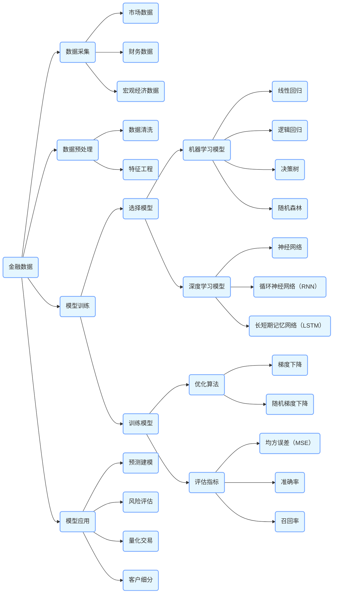

# 模型训练与金融数据的结合

> 关键词：模型训练、金融数据、机器学习、数据分析、预测建模、风险评估、量化交易

> 摘要：本文深入探讨了模型训练与金融数据的结合，旨在揭示如何利用先进的模型训练技术处理金融数据，以实现金融领域的精准预测、风险评估和决策支持等目标。文章从背景介绍入手，阐述了相关概念、算法原理、数学模型，并通过实际项目案例展示了具体应用。同时，分析了该结合在实际金融场景中的应用情况，推荐了学习资源、开发工具和相关论文，最后总结了未来发展趋势与挑战，为从业者和研究者提供了全面而深入的参考。

## 1. 背景介绍 
### 1.1 目的和范围
本文章的主要目的是详细阐述模型训练与金融数据结合的原理、方法和应用。范围涵盖了常见的模型训练技术，如机器学习、深度学习等在金融数据处理中的应用，包括金融市场预测、风险评估、量化交易等多个方面。通过深入分析和实际案例展示，帮助读者理解如何将模型训练技术有效地应用于金融数据，提高金融决策的准确性和效率。

### 1.2 预期读者
本文预期读者包括金融行业从业者，如金融分析师、交易员、风险管理人员等，他们希望借助模型训练技术提升金融业务的分析和决策能力；计算机科学领域的开发者和研究者，对将机器学习和数据分析技术应用于金融领域感兴趣；以及对金融科技交叉领域有学习需求的学生和爱好者。

### 1.3 文档结构概述
本文将按照以下结构展开：首先介绍相关核心概念和它们之间的联系，包括模型训练和金融数据的基本定义和相互关系；接着阐述核心算法原理和具体操作步骤，使用 Python 代码进行详细说明；然后讲解相关的数学模型和公式，并举例说明其应用；通过实际项目案例展示代码实现和详细解读；分析模型训练与金融数据结合在实际金融场景中的应用；推荐学习资源、开发工具和相关论文；最后总结未来发展趋势与挑战，并提供常见问题解答和扩展阅读参考资料。

### 1.4 术语表
#### 1.4.1 核心术语定义
- **模型训练**：指使用数据对机器学习或深度学习模型进行优化，使其能够学习数据中的模式和规律，以实现特定的预测或分类任务。
- **金融数据**：包括金融市场数据（如股票价格、利率、汇率等）、财务报表数据（如资产负债表、利润表等）、宏观经济数据（如 GDP、通货膨胀率等），是反映金融市场和企业财务状况的各种数据集合。
- **机器学习**：是一门多领域交叉学科，涉及概率论、统计学、逼近论、凸分析、算法复杂度理论等多门学科。它专门研究计算机怎样模拟或实现人类的学习行为，以获取新的知识或技能，重新组织已有的知识结构使之不断改善自身的性能。
- **深度学习**：是机器学习的一个分支领域，它是一种基于对数据进行表征学习的方法。深度学习通过构建具有很多层的神经网络模型，自动从大量数据中学习复杂的模式和特征。
- **风险评估**：对金融资产或投资组合面临的风险进行量化和评估的过程，包括市场风险、信用风险、流动性风险等。

#### 1.4.2 相关概念解释
- **特征工程**：在模型训练中，将原始金融数据转换为适合模型输入的特征的过程。这包括数据清洗、特征选择、特征提取和特征转换等步骤，目的是提高模型的性能和泛化能力。
- **过拟合**：模型在训练数据上表现良好，但在未见过的测试数据上表现不佳的现象。过拟合通常是由于模型过于复杂，学习了训练数据中的噪声和异常值，而没有学习到数据的本质规律。
- **欠拟合**：模型在训练数据和测试数据上的表现都不佳的现象。欠拟合通常是由于模型过于简单，无法学习到数据中的复杂模式和规律。
- **交叉验证**：一种评估模型性能的方法，将数据集划分为多个子集，轮流使用不同的子集作为训练集和测试集，对模型进行多次训练和评估，以减少模型评估的偏差和方差。

#### 1.4.3 缩略词列表
- **ML**：Machine Learning，机器学习
- **DL**：Deep Learning，深度学习
- **GDP**：Gross Domestic Product，国内生产总值
- **ROI**：Return on Investment，投资回报率
- **MSE**：Mean Squared Error，均方误差

## 2. 核心概念与联系 

### 2.1 模型训练的基本原理
模型训练的核心是通过优化算法调整模型的参数，使得模型的预测结果与真实标签之间的误差最小化。以简单的线性回归模型为例，假设我们有一组输入特征 $X = [x_1, x_2,..., x_n]$ 和对应的输出标签 $y$，线性回归模型的预测公式为：

$$\hat{y} = w_0 + w_1x_1 + w_2x_2 +... + w_nx_n$$

其中，$w_0, w_1,..., w_n$ 是模型的参数。模型训练的目标是找到一组最优的参数 $w$，使得预测值 $\hat{y}$ 与真实值 $y$ 之间的误差最小。常用的误差度量方法是均方误差（MSE）：

$$MSE = \frac{1}{m} \sum_{i=1}^{m} (y_i - \hat{y}_i)^2$$

其中，$m$ 是样本数量。通过最小化 MSE，我们可以得到最优的参数 $w$。

### 2.2 金融数据的特点
金融数据具有以下特点：
- **高噪声**：金融市场受到多种因素的影响，包括宏观经济环境、政策变化、市场情绪等，这些因素使得金融数据中包含大量的噪声和不确定性。
- **非线性**：金融数据之间的关系往往是非线性的，例如股票价格与公司业绩、市场利率等因素之间的关系不是简单的线性关系。
- **时间序列性**：许多金融数据是按时间顺序记录的，具有明显的时间序列特征，如股票价格的日收盘价、利率的月度数据等。时间序列数据的特点是数据之间存在相关性，过去的数据会影响未来的数据。
- **高维度**：金融数据通常包含多个特征，例如股票的价格、成交量、市盈率、市净率等，这些特征构成了高维度的数据空间。

### 2.3 模型训练与金融数据的结合方式
模型训练与金融数据的结合主要有以下几种方式：
- **预测建模**：利用历史金融数据训练模型，预测未来的金融市场走势，如股票价格预测、汇率预测等。
- **风险评估**：通过对金融数据的分析和建模，评估金融资产或投资组合面临的风险，如信用风险评估、市场风险评估等。
- **量化交易**：基于模型训练的结果，制定量化交易策略，自动执行交易操作，以获取超额收益。
- **客户细分**：根据客户的金融行为数据，使用模型训练技术将客户划分为不同的群体，以便为不同的客户群体提供个性化的金融服务。

### 2.4 核心概念原理和架构的文本示意图
```plaintext
金融数据
|
|-- 数据采集
|   |-- 市场数据
|   |-- 财务数据
|   |-- 宏观经济数据
|
|-- 数据预处理
|   |-- 数据清洗
|   |-- 特征工程
|
|-- 模型训练
|   |-- 选择模型
|   |   |-- 机器学习模型
|   |   |   |-- 线性回归
|   |   |   |-- 逻辑回归
|   |   |   |-- 决策树
|   |   |   |-- 随机森林
|   |   |-- 深度学习模型
|   |   |   |-- 神经网络
|   |   |   |-- 循环神经网络（RNN）
|   |   |   |-- 长短期记忆网络（LSTM）
|   |-- 训练模型
|   |   |-- 优化算法
|   |   |   |-- 梯度下降
|   |   |   |-- 随机梯度下降
|   |   |-- 评估指标
|   |   |   |-- 均方误差（MSE）
|   |   |   |-- 准确率
|   |   |   |-- 召回率
|
|-- 模型应用
|   |-- 预测建模
|   |-- 风险评估
|   |-- 量化交易
|   |-- 客户细分
```

### 2.5 Mermaid 流程图


## 3. 核心算法原理 & 具体操作步骤 

### 3.1 线性回归算法原理
线性回归是一种简单而常用的机器学习算法，用于建立自变量 $X$ 和因变量 $y$ 之间的线性关系。假设我们有 $n$ 个样本，每个样本有 $m$ 个特征，线性回归模型的表达式为：

$$\hat{y} = w_0 + w_1x_1 + w_2x_2 +... + w_mx_m$$

其中，$\hat{y}$ 是预测值，$w_0, w_1,..., w_m$ 是模型的参数。为了找到最优的参数 $w$，我们通常使用最小二乘法，即最小化预测值 $\hat{y}$ 与真实值 $y$ 之间的均方误差（MSE）：

$$MSE = \frac{1}{n} \sum_{i=1}^{n} (y_i - \hat{y}_i)^2$$

可以通过求 MSE 对 $w$ 的偏导数，并令其等于 0，得到最优的参数 $w$。

### 3.2 线性回归算法的 Python 实现
```python
import numpy as np
from sklearn.linear_model import LinearRegression
from sklearn.metrics import mean_squared_error
from sklearn.model_selection import train_test_split

# 生成示例数据
np.random.seed(0)
X = 2 * np.random.rand(100, 1)
y = 4 + 3 * X + np.random.randn(100, 1)

# 划分训练集和测试集
X_train, X_test, y_train, y_test = train_test_split(X, y, test_size=0.2, random_state=42)

# 创建线性回归模型
model = LinearRegression()

# 训练模型
model.fit(X_train, y_train)

# 预测
y_pred = model.predict(X_test)

# 计算均方误差
mse = mean_squared_error(y_test, y_pred)
print(f"均方误差: {mse}")
```
### 3.3 具体操作步骤
1. **数据准备**：收集和整理金融数据，进行数据清洗和预处理，将数据划分为训练集和测试集。
2. **模型选择**：根据问题的特点和数据的类型，选择合适的模型，如线性回归、逻辑回归、决策树等。
3. **模型训练**：使用训练集对模型进行训练，通过优化算法调整模型的参数，使得模型的预测结果与真实标签之间的误差最小化。
4. **模型评估**：使用测试集对训练好的模型进行评估，计算评估指标，如均方误差、准确率、召回率等，评估模型的性能。
5. **模型调优**：根据模型评估的结果，对模型进行调优，如调整模型的超参数、进行特征选择等，提高模型的性能。
6. **模型应用**：将训练好的模型应用于实际的金融场景，如预测金融市场走势、评估金融风险等。

## 4. 数学模型和公式 & 详细讲解 & 举例说明 

### 4.1 线性回归的数学模型和公式
线性回归的数学模型可以表示为：

$$\hat{y} = w_0 + w_1x_1 + w_2x_2 +... + w_mx_m = \mathbf{w}^T\mathbf{x}$$

其中，$\mathbf{w} = [w_0, w_1,..., w_m]^T$ 是模型的参数向量，$\mathbf{x} = [1, x_1, x_2,..., x_m]^T$ 是输入特征向量。

均方误差（MSE）的公式为：

$$MSE = \frac{1}{n} \sum_{i=1}^{n} (y_i - \hat{y}_i)^2 = \frac{1}{n} \sum_{i=1}^{n} (y_i - \mathbf{w}^T\mathbf{x}_i)^2$$

为了找到最优的参数 $\mathbf{w}$，我们对 MSE 求关于 $\mathbf{w}$ 的偏导数，并令其等于 0：

$$\frac{\partial MSE}{\partial \mathbf{w}} = -\frac{2}{n} \sum_{i=1}^{n} (y_i - \mathbf{w}^T\mathbf{x}_i)\mathbf{x}_i = 0$$

通过求解上述方程，可以得到最优的参数 $\mathbf{w}$。

### 4.2 逻辑回归的数学模型和公式
逻辑回归是一种用于分类问题的机器学习算法，它通过逻辑函数将线性回归的输出映射到 $[0, 1]$ 区间，用于表示样本属于某个类别的概率。逻辑函数的表达式为：

$$\sigma(z) = \frac{1}{1 + e^{-z}}$$

其中，$z = \mathbf{w}^T\mathbf{x}$ 是线性回归的输出。

逻辑回归的预测概率为：

$$P(y = 1|\mathbf{x}) = \sigma(\mathbf{w}^T\mathbf{x}) = \frac{1}{1 + e^{-\mathbf{w}^T\mathbf{x}}}$$

为了训练逻辑回归模型，我们通常使用最大似然估计法，即最大化所有样本的似然函数。似然函数的表达式为：

$$L(\mathbf{w}) = \prod_{i=1}^{n} P(y_i|\mathbf{x}_i) = \prod_{i=1}^{n} [\sigma(\mathbf{w}^T\mathbf{x}_i)]^{y_i} [1 - \sigma(\mathbf{w}^T\mathbf{x}_i)]^{1 - y_i}$$

为了方便计算，我们通常对似然函数取对数，得到对数似然函数：

$$\ell(\mathbf{w}) = \log L(\mathbf{w}) = \sum_{i=1}^{n} [y_i \log \sigma(\mathbf{w}^T\mathbf{x}_i) + (1 - y_i) \log (1 - \sigma(\mathbf{w}^T\mathbf{x}_i))]$$

通过最大化对数似然函数，我们可以得到最优的参数 $\mathbf{w}$。

### 4.3 举例说明
假设我们有一组股票价格数据，我们想要使用线性回归模型预测股票的未来价格。我们可以将过去的股票价格作为输入特征 $X$，未来的股票价格作为输出标签 $y$。假设我们有 $n$ 个样本，每个样本有 $m$ 个特征，线性回归模型的表达式为：

$$\hat{y} = w_0 + w_1x_1 + w_2x_2 +... + w_mx_m$$

我们可以使用最小二乘法来训练模型，找到最优的参数 $w$。训练完成后，我们可以使用模型对未来的股票价格进行预测。

假设我们有一个二分类问题，如判断股票是否会上涨。我们可以使用逻辑回归模型来解决这个问题。我们将股票的各种特征作为输入特征 $X$，股票是否上涨作为输出标签 $y$（上涨为 1，不上涨为 0）。逻辑回归模型的预测概率为：

$$P(y = 1|\mathbf{x}) = \sigma(\mathbf{w}^T\mathbf{x}) = \frac{1}{1 + e^{-\mathbf{w}^T\mathbf{x}}}$$

我们可以使用最大似然估计法来训练模型，找到最优的参数 $\mathbf{w}$。训练完成后，我们可以使用模型对股票是否会上涨进行预测。

## 5. 项目实战：代码实际案例和详细解释说明 

### 5.1  开发环境搭建
1. **安装 Python**：建议使用 Python 3.7 及以上版本，可以从 Python 官方网站（https://www.python.org/downloads/）下载并安装。
2. **安装必要的库**：使用以下命令安装必要的 Python 库：
```bash
pip install numpy pandas scikit-learn matplotlib
```
- `numpy`：用于数值计算。
- `pandas`：用于数据处理和分析。
- `scikit-learn`：提供了各种机器学习算法和工具。
- `matplotlib`：用于数据可视化。

### 5.2  源代码详细实现和代码解读
以下是一个使用线性回归模型预测股票价格的示例代码：
```python
import numpy as np
import pandas as pd
from sklearn.linear_model import LinearRegression
from sklearn.metrics import mean_squared_error
from sklearn.model_selection import train_test_split
import matplotlib.pyplot as plt

# 读取股票数据
data = pd.read_csv('stock_prices.csv')

# 提取特征和标签
X = data[['Open', 'High', 'Low', 'Volume']].values
y = data['Close'].values

# 划分训练集和测试集
X_train, X_test, y_train, y_test = train_test_split(X, y, test_size=0.2, random_state=42)

# 创建线性回归模型
model = LinearRegression()

# 训练模型
model.fit(X_train, y_train)

# 预测
y_pred = model.predict(X_test)

# 计算均方误差
mse = mean_squared_error(y_test, y_pred)
print(f"均方误差: {mse}")

# 可视化预测结果
plt.scatter(y_test, y_pred)
plt.xlabel('真实价格')
plt.ylabel('预测价格')
plt.title('股票价格预测')
plt.show()
```
### 代码解读
1. **数据读取**：使用 `pandas` 库的 `read_csv` 函数读取股票数据文件 `stock_prices.csv`。
2. **特征提取**：从数据中提取特征 `Open`、`High`、`Low`、`Volume` 作为输入特征 $X$，提取 `Close` 作为输出标签 $y$。
3. **数据划分**：使用 `train_test_split` 函数将数据划分为训练集和测试集，测试集占总数据的 20%。
4. **模型创建**：创建一个线性回归模型 `LinearRegression`。
5. **模型训练**：使用训练集对模型进行训练，调用 `fit` 方法。
6. **模型预测**：使用训练好的模型对测试集进行预测，调用 `predict` 方法。
7. **模型评估**：计算预测结果与真实标签之间的均方误差（MSE），使用 `mean_squared_error` 函数。
8. **可视化**：使用 `matplotlib` 库的 `scatter` 函数绘制真实价格和预测价格的散点图，直观展示模型的预测效果。

### 5.3  代码解读与分析
- **数据质量**：数据的质量对模型的性能有很大影响。在实际应用中，需要对数据进行清洗和预处理，去除缺失值、异常值等。
- **特征选择**：选择合适的特征对模型的性能至关重要。可以使用特征选择方法，如相关性分析、特征重要性排序等，选择对预测结果影响较大的特征。
- **模型评估**：除了均方误差（MSE），还可以使用其他评估指标，如均方根误差（RMSE）、平均绝对误差（MAE）、决定系数（$R^2$）等，全面评估模型的性能。
- **模型调优**：可以通过调整模型的超参数，如正则化参数、学习率等，提高模型的性能。也可以尝试使用其他机器学习算法，如决策树、随机森林、神经网络等，比较不同算法的性能。

## 6. 实际应用场景 
### 6.1 金融市场预测
模型训练与金融数据的结合可以用于预测金融市场的走势，如股票价格预测、汇率预测、利率预测等。通过分析历史金融数据，训练模型学习数据中的模式和规律，从而对未来的市场走势进行预测。例如，使用线性回归模型预测股票价格，使用时间序列模型预测汇率变化等。金融市场预测可以帮助投资者做出更明智的投资决策，降低投资风险。

### 6.2 风险评估
在金融领域，风险评估是非常重要的工作。模型训练可以帮助金融机构评估金融资产或投资组合面临的风险，如信用风险评估、市场风险评估、流动性风险评估等。通过分析客户的信用数据、市场数据等，训练模型对风险进行量化和评估。例如，使用逻辑回归模型评估客户的信用风险，使用风险价值（VaR）模型评估投资组合的市场风险等。风险评估可以帮助金融机构制定合理的风险管理策略，保障金融稳定。

### 6.3 量化交易
量化交易是指利用计算机算法和数学模型进行交易决策的交易方式。模型训练与金融数据的结合可以为量化交易提供支持，通过分析历史金融数据，训练模型发现市场中的交易机会，制定量化交易策略。例如，使用机器学习模型识别股票的买卖信号，使用高频交易算法进行快速交易等。量化交易可以提高交易效率，降低交易成本，获取超额收益。

### 6.4 客户细分
金融机构可以根据客户的金融行为数据，使用模型训练技术将客户划分为不同的群体，以便为不同的客户群体提供个性化的金融服务。例如，根据客户的资产规模、交易频率、风险偏好等特征，将客户分为高净值客户、普通客户、风险偏好型客户、风险厌恶型客户等。金融机构可以针对不同的客户群体推出不同的金融产品和服务，提高客户满意度和忠诚度。

## 7. 工具和资源推荐
### 7.1 学习资源推荐
#### 7.1.1 书籍推荐
- 《机器学习》（周志华著）：全面介绍了机器学习的基本概念、算法和应用，是机器学习领域的经典教材。
- 《深度学习》（Ian Goodfellow、Yoshua Bengio 和 Aaron Courville 著）：深度学习领域的权威著作，详细介绍了深度学习的理论和实践。
- 《Python 数据分析实战》（Sebastian Raschka 著）：通过实际案例介绍了如何使用 Python 进行数据分析和机器学习，适合初学者。
- 《金融时间序列分析》（Ruey S. Tsay 著）：介绍了金融时间序列分析的基本理论和方法，包括 ARIMA 模型、GARCH 模型等。

#### 7.1.2 在线课程
- Coursera 上的“机器学习”课程（Andrew Ng 教授）：经典的机器学习课程，介绍了机器学习的基本概念、算法和应用。
- edX 上的“深度学习”课程（Yoshua Bengio 教授）：深入介绍了深度学习的理论和实践。
- 网易云课堂上的“Python 数据分析与机器学习实战”课程：通过实际案例介绍了如何使用 Python 进行数据分析和机器学习。

#### 7.1.3 技术博客和网站
- Medium：一个技术博客平台，有很多关于机器学习、金融科技的优秀文章。
- Kaggle：一个数据科学竞赛平台，提供了丰富的数据集和代码示例，可以学习到很多实际应用中的技巧和方法。
- Towards Data Science：专注于数据科学和机器学习领域的技术博客，有很多高质量的文章。

### 7.2 开发工具框架推荐
#### 7.2.1 IDE和编辑器
- PyCharm：一款专业的 Python 集成开发环境，提供了丰富的功能和插件，适合开发大型 Python 项目。
- Jupyter Notebook：一个交互式的编程环境，适合进行数据探索、模型训练和可视化。
- Visual Studio Code：一款轻量级的代码编辑器，支持多种编程语言，有丰富的插件可以扩展功能。

#### 7.2.2 调试和性能分析工具
- PDB：Python 自带的调试工具，可以帮助开发者调试 Python 代码。
- Py-Spy：一个用于分析 Python 程序性能的工具，可以查看程序的 CPU 使用率、函数调用时间等信息。
- TensorBoard：TensorFlow 提供的可视化工具，可以用于可视化模型的训练过程、损失函数变化等信息。

#### 7.2.3 相关框架和库
- NumPy：用于数值计算的 Python 库，提供了高效的数组操作和数学函数。
- Pandas：用于数据处理和分析的 Python 库，提供了数据结构和数据操作方法。
- Scikit-learn：一个简单易用的机器学习库，提供了各种机器学习算法和工具。
- TensorFlow：一个开源的深度学习框架，提供了丰富的深度学习模型和工具。
- PyTorch：另一个开源的深度学习框架，具有动态图的特点，适合快速开发和实验。

### 7.3 相关论文著作推荐
#### 7.3.1 经典论文
- “Gradient-based learning applied to document recognition”（Yann LeCun 等）：介绍了卷积神经网络（CNN）在手写数字识别中的应用，是深度学习领域的经典论文。
- “Long Short-Term Memory”（Sepp Hochreiter 和 Jürgen Schmidhuber）：提出了长短期记忆网络（LSTM），解决了循环神经网络（RNN）中的梯度消失问题。
- “Random forests”（Leo Breiman）：介绍了随机森林算法，是集成学习领域的经典论文。

#### 7.3.2 最新研究成果
- 在顶级学术会议和期刊上搜索关于模型训练与金融数据结合的最新研究成果，如 NeurIPS、ICML、Journal of Financial Economics 等。
- 关注知名研究机构和学者的研究动态，如斯坦福大学、麻省理工学院、谷歌大脑等。

#### 7.3.3 应用案例分析
- 分析金融机构和科技公司在模型训练与金融数据结合方面的应用案例，了解实际应用中的问题和解决方案。
- 参考行业报告和白皮书，了解模型训练与金融数据结合在不同金融场景中的应用现状和发展趋势。

## 8. 总结：未来发展趋势与挑战
### 8.1 未来发展趋势
- **深度学习的广泛应用**：深度学习在处理复杂的金融数据和非线性关系方面具有强大的能力，未来将在金融领域得到更广泛的应用，如金融市场预测、风险评估、量化交易等。
- **融合多源数据**：除了传统的金融数据，未来将融合更多的多源数据，如社交媒体数据、新闻数据、物联网数据等，以提高模型的预测能力和决策的准确性。
- **强化学习在量化交易中的应用**：强化学习可以通过与环境的交互不断优化交易策略，未来将在量化交易中得到更多的应用，实现更智能的交易决策。
- **金融科技的融合发展**：模型训练与金融数据的结合将推动金融科技的融合发展，如区块链技术与机器学习的结合，将提高金融交易的安全性和效率。

### 8.2 挑战
- **数据质量和隐私问题**：金融数据的质量和隐私问题是模型训练面临的重要挑战。数据中可能存在噪声、缺失值和异常值，需要进行数据清洗和预处理。同时，金融数据涉及用户的隐私和敏感信息，需要采取有效的措施保护数据的安全和隐私。
- **模型可解释性**：深度学习模型通常是黑盒模型，缺乏可解释性，这在金融领域可能会带来一定的风险。未来需要研究如何提高模型的可解释性，使模型的决策过程更加透明和可信。
- **市场变化和不确定性**：金融市场具有高度的变化性和不确定性，模型的性能可能会受到市场变化的影响。需要不断更新和优化模型，以适应市场的变化。
- **人才短缺**：模型训练与金融数据的结合需要既懂机器学习又懂金融业务的复合型人才，目前这类人才相对短缺，需要加强相关人才的培养。

## 9. 附录：常见问题与解答
### 9.1 模型训练中如何处理缺失值？
处理缺失值的方法有多种，常见的方法包括：
- **删除含有缺失值的样本**：如果缺失值的比例较小，可以直接删除含有缺失值的样本。
- **填充缺失值**：可以使用均值、中位数、众数等统计量填充缺失值，也可以使用插值法填充缺失值。
- **使用模型预测缺失值**：可以使用机器学习模型，如线性回归、决策树等，根据其他特征预测缺失值。

### 9.2 如何选择合适的模型？
选择合适的模型需要考虑以下因素：
- **问题的类型**：根据问题的类型，如分类问题、回归问题、聚类问题等，选择合适的模型。
- **数据的特点**：考虑数据的规模、维度、分布等特点，选择适合的数据处理和模型训练方法。
- **模型的性能**：可以使用交叉验证等方法评估不同模型的性能，选择性能最好的模型。
- **模型的可解释性**：在金融领域，模型的可解释性很重要，需要选择可解释性较好的模型。

### 9.3 模型过拟合怎么办？
处理模型过拟合的方法有多种，常见的方法包括：
- **增加数据量**：增加训练数据的规模可以减少模型过拟合的风险。
- **正则化**：在模型的损失函数中加入正则化项，如 L1 正则化、L2 正则化等，可以限制模型的复杂度，减少过拟合的风险。
- **特征选择**：选择对预测结果影响较大的特征，减少特征的维度，可以降低模型的复杂度，减少过拟合的风险。
- **早停法**：在模型训练过程中，当模型在验证集上的性能不再提高时，停止训练，避免模型过拟合。

### 9.4 如何评估模型的性能？
评估模型的性能可以使用不同的评估指标，具体选择取决于问题的类型：
- **回归问题**：常用的评估指标有均方误差（MSE）、均方根误差（RMSE）、平均绝对误差（MAE）、决定系数（$R^2$）等。
- **分类问题**：常用的评估指标有准确率、精确率、召回率、F1 值、ROC 曲线、AUC 值等。
- **聚类问题**：常用的评估指标有轮廓系数、Calinski-Harabasz 指数等。

## 10. 扩展阅读 & 参考资料
- 《人工智能时代：大数据与机器智能重塑经济与社会》（李开复、王咏刚著）
- 《智能时代：大数据与智能革命重新定义未来》（吴军著）
- https://www.kaggle.com/ （Kaggle 官方网站）
- https://scikit-learn.org/ （Scikit-learn 官方文档）
- https://www.tensorflow.org/ （TensorFlow 官方网站）
- https://pytorch.org/ （PyTorch 官方网站）

作者：AI天才研究院/AI Genius Institute & 禅与计算机程序设计艺术 /Zen And The Art of Computer Programming