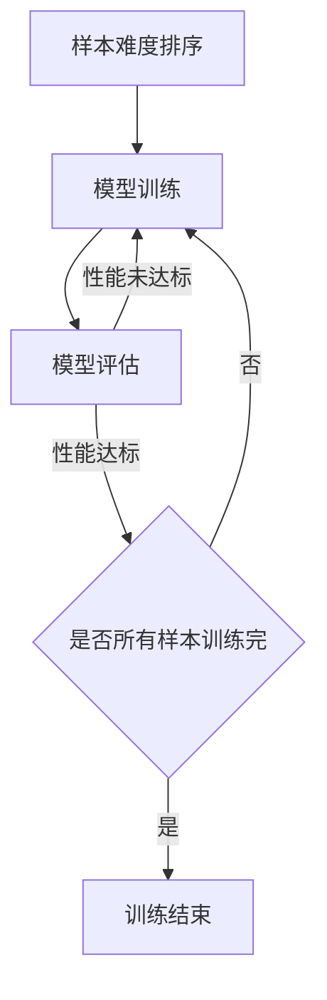

# 模型训练中的curriculum learning在认知障碍康复中的应用

> 关键词：Curriculum Learning、模型训练、认知障碍康复、机器学习、康复治疗

> 摘要：本文深入探讨了模型训练中的Curriculum Learning（课程学习）方法在认知障碍康复领域的应用。首先介绍了研究背景，包括目的、预期读者、文档结构和相关术语。接着阐述了Curriculum Learning的核心概念及其与认知障碍康复的联系，并给出了原理和架构的文本示意图与Mermaid流程图。详细讲解了核心算法原理，结合Python代码进行具体操作步骤的说明。通过数学模型和公式进一步解释其内在机制，并举例说明。以实际项目为例，展示了代码实现和解读。分析了Curriculum Learning在认知障碍康复中的实际应用场景，推荐了相关的学习资源、开发工具框架和论文著作。最后总结了未来发展趋势与挑战，并提供常见问题解答和扩展阅读参考资料。

## 1. 背景介绍 
### 1.1 目的和范围
认知障碍是一类影响患者认知功能的疾病，如老年痴呆、脑损伤后遗症等，给患者及其家庭带来了沉重的负担。传统的认知障碍康复治疗方法往往缺乏个性化和系统性，难以满足患者的多样化需求。Curriculum Learning是一种模拟人类学习过程的机器学习方法，它通过有序地呈现学习样本，从简单到复杂逐步训练模型，能够提高模型的学习效率和泛化能力。本研究的目的是探索Curriculum Learning在认知障碍康复中的应用，旨在开发更加有效的康复训练方案，提高康复治疗效果。

本研究的范围主要涵盖了Curriculum Learning的基本原理、在认知障碍康复中的应用机制、相关算法实现以及实际应用案例分析。同时，还会涉及到认知障碍康复领域的相关知识，如认知功能评估、康复训练方法等。

### 1.2 预期读者
本文的预期读者包括从事人工智能、机器学习领域的研究人员和开发者，对将先进技术应用于医疗康复领域感兴趣的专业人士。此外，认知障碍康复领域的医生、康复治疗师等也可以从本文中了解到新的康复治疗思路和方法。对于对认知障碍康复和人工智能交叉领域有兴趣的普通读者，本文也提供了通俗易懂的解释和案例，帮助他们了解相关知识。

### 1.3 文档结构概述
本文将按照以下结构进行组织：
1. 背景介绍：阐述研究的目的、范围、预期读者和文档结构，同时介绍相关术语。
2. 核心概念与联系：解释Curriculum Learning的核心概念，说明其与认知障碍康复的联系，并给出原理和架构的文本示意图与Mermaid流程图。
3. 核心算法原理 & 具体操作步骤：详细讲解Curriculum Learning的核心算法原理，结合Python代码进行具体操作步骤的说明。
4. 数学模型和公式 & 详细讲解 & 举例说明：通过数学模型和公式进一步解释Curriculum Learning的内在机制，并举例说明。
5. 项目实战：代码实际案例和详细解释说明：以实际项目为例，展示Curriculum Learning在认知障碍康复中的代码实现和解读。
6. 实际应用场景：分析Curriculum Learning在认知障碍康复中的实际应用场景。
7. 工具和资源推荐：推荐相关的学习资源、开发工具框架和论文著作。
8. 总结：未来发展趋势与挑战：总结Curriculum Learning在认知障碍康复中的应用现状，分析未来发展趋势和面临的挑战。
9. 附录：常见问题与解答：提供常见问题的解答，帮助读者更好地理解本文内容。
10. 扩展阅读 & 参考资料：提供相关的扩展阅读资料和参考文献。

### 1.4 术语表
#### 1.4.1 核心术语定义
- **Curriculum Learning（课程学习）**：一种机器学习方法，它通过有序地呈现学习样本，从简单到复杂逐步训练模型，模拟人类的学习过程。
- **认知障碍**：指与学习、记忆、语言、思维、判断等认知功能相关的障碍，常见于老年痴呆、脑损伤等疾病。
- **康复训练**：针对认知障碍患者的一系列训练活动，旨在提高患者的认知功能和生活自理能力。
- **泛化能力**：模型在未见过的数据上的表现能力，即模型能够将所学知识应用到新的情境中的能力。

#### 1.4.2 相关概念解释
- **学习样本排序**：在Curriculum Learning中，需要对学习样本进行排序，通常根据样本的难度进行排序，从简单到复杂依次呈现给模型进行训练。
- **难度度量**：用于衡量学习样本难度的指标，常见的难度度量方法包括样本的复杂度、模型对样本的错误率等。
- **康复评估**：对认知障碍患者的认知功能进行评估的过程，常用的评估工具包括简易精神状态检查表（MMSE）、蒙特利尔认知评估量表（MoCA）等。

#### 1.4.3 缩略词列表
- **CL**：Curriculum Learning（课程学习）
- **MMSE**：Mini - Mental State Examination（简易精神状态检查表）
- **MoCA**：Montreal Cognitive Assessment（蒙特利尔认知评估量表）

## 2. 核心概念与联系 

### 2.1 Curriculum Learning核心概念
Curriculum Learning的核心思想是模拟人类的学习过程，人类在学习新知识时，通常会从简单的内容开始，逐步学习更复杂的内容。在机器学习中，Curriculum Learning通过对学习样本进行排序，按照从简单到复杂的顺序依次将样本输入到模型中进行训练。这样可以让模型在早期学习到一些基本的特征和模式，为后续学习更复杂的内容打下基础，从而提高模型的学习效率和泛化能力。

### 2.2 与认知障碍康复的联系
在认知障碍康复中，患者的认知能力通常是逐步恢复的。康复训练也应该遵循从简单到复杂的原则，就像Curriculum Learning中样本的排序一样。通过应用Curriculum Learning的思想，可以为认知障碍患者设计个性化的康复训练方案，根据患者的当前认知水平，从简单的训练任务开始，逐步增加任务的难度，使患者能够更好地适应训练过程，提高康复效果。

### 2.3 原理和架构的文本示意图
Curriculum Learning的原理和架构可以用以下文本示意图来表示：

1. **样本难度排序**：首先，需要对所有的学习样本进行难度评估，根据评估结果对样本进行排序，得到一个从简单到复杂的样本序列。
2. **模型训练**：按照样本序列的顺序，依次将样本输入到模型中进行训练。在训练过程中，模型会不断学习样本中的特征和模式。
3. **模型评估**：在每个训练阶段结束后，对模型的性能进行评估。如果模型的性能达到了一定的标准，则可以进入下一个难度级别的样本训练；否则，继续在当前难度级别进行训练。
4. **循环迭代**：重复步骤2和3，直到所有的样本都被训练完或者模型的性能达到了预期的目标。

### 2.4 Mermaid流程图


## 3. 核心算法原理 & 具体操作步骤 

### 3.1 核心算法原理
Curriculum Learning的核心算法可以分为以下几个步骤：

1. **样本难度度量**：首先需要定义一个难度度量函数，用于衡量每个学习样本的难度。常见的难度度量方法包括样本的复杂度、模型对样本的错误率等。例如，可以使用模型在样本上的分类错误率作为难度度量指标，错误率越高，说明样本越难。

2. **样本排序**：根据样本的难度度量结果，对所有的学习样本进行排序，得到一个从简单到复杂的样本序列。

3. **模型训练**：按照样本序列的顺序，依次将样本输入到模型中进行训练。在每个训练阶段，模型会根据当前输入的样本更新自己的参数。

4. **模型评估**：在每个训练阶段结束后，使用验证集对模型的性能进行评估。可以使用准确率、召回率等指标来衡量模型的性能。

5. **难度级别调整**：根据模型的评估结果，决定是否进入下一个难度级别的样本训练。如果模型的性能达到了一定的标准，则可以进入下一个难度级别的样本训练；否则，继续在当前难度级别进行训练。

### 3.2 具体操作步骤（Python代码实现）
以下是一个使用Python和PyTorch实现Curriculum Learning的简单示例：

```python
import torch
import torch.nn as nn
import torch.optim as optim
from torch.utils.data import Dataset, DataLoader

# 定义一个简单的数据集类
class SimpleDataset(Dataset):
    def __init__(self, data, labels):
        self.data = data
        self.labels = labels

    def __len__(self):
        return len(self.data)

    def __getitem__(self, idx):
        return self.data[idx], self.labels[idx]

# 定义一个简单的神经网络模型
class SimpleModel(nn.Module):
    def __init__(self, input_size, hidden_size, output_size):
        super(SimpleModel, self).__init__()
        self.fc1 = nn.Linear(input_size, hidden_size)
        self.relu = nn.ReLU()
        self.fc2 = nn.Linear(hidden_size, output_size)

    def forward(self, x):
        out = self.fc1(x)
        out = self.relu(out)
        out = self.fc2(out)
        return out

# 定义难度度量函数（这里简单使用样本的特征值之和作为难度度量）
def difficulty_metric(sample):
    return torch.sum(sample).item()

# 样本排序函数
def sort_samples(data, labels):
    difficulties = [difficulty_metric(sample) for sample in data]
    sorted_indices = sorted(range(len(difficulties)), key=lambda k: difficulties[k])
    sorted_data = [data[i] for i in sorted_indices]
    sorted_labels = [labels[i] for i in sorted_indices]
    return sorted_data, sorted_labels

# 训练函数
def train_model(model, train_loader, criterion, optimizer, epochs):
    model.train()
    for epoch in range(epochs):
        running_loss = 0.0
        for i, (inputs, labels) in enumerate(train_loader):
            optimizer.zero_grad()
            outputs = model(inputs)
            loss = criterion(outputs, labels)
            loss.backward()
            optimizer.step()
            running_loss += loss.item()
        print(f'Epoch {epoch + 1}, Loss: {running_loss / len(train_loader)}')

# 主函数
def main():
    # 生成一些随机数据
    input_size = 10
    hidden_size = 20
    output_size = 2
    num_samples = 100
    data = torch.randn(num_samples, input_size)
    labels = torch.randint(0, output_size, (num_samples,))

    # 样本排序
    sorted_data, sorted_labels = sort_samples(data, labels)

    # 创建数据集和数据加载器
    dataset = SimpleDataset(sorted_data, sorted_labels)
    train_loader = DataLoader(dataset, batch_size=10, shuffle=False)

    # 初始化模型、损失函数和优化器
    model = SimpleModel(input_size, hidden_size, output_size)
    criterion = nn.CrossEntropyLoss()
    optimizer = optim.Adam(model.parameters(), lr=0.001)

    # 训练模型
    train_model(model, train_loader, criterion, optimizer, epochs=10)

if __name__ == "__main__":
    main()
```

### 3.3 代码解释
1. **数据集类**：`SimpleDataset`类用于封装数据集，实现了`__len__`和`__getitem__`方法，方便后续使用`DataLoader`进行数据加载。
2. **神经网络模型**：`SimpleModel`类定义了一个简单的两层神经网络，包含一个全连接层、一个ReLU激活函数和另一个全连接层。
3. **难度度量函数**：`difficulty_metric`函数用于计算样本的难度，这里简单地使用样本的特征值之和作为难度度量。
4. **样本排序函数**：`sort_samples`函数根据样本的难度对样本进行排序，返回排序后的样本和标签。
5. **训练函数**：`train_model`函数用于训练模型，在每个训练阶段，计算损失并更新模型的参数。
6. **主函数**：`main`函数是程序的入口，生成随机数据，对样本进行排序，创建数据集和数据加载器，初始化模型、损失函数和优化器，最后调用`train_model`函数进行模型训练。

## 4. 数学模型和公式 & 详细讲解 & 举例说明 

### 4.1 数学模型和公式
#### 4.1.1 难度度量
假设我们有一个样本集合 $S = \{x_1, x_2, \cdots, x_n\}$，其中 $x_i$ 表示第 $i$ 个样本。难度度量函数 $d(x)$ 用于衡量样本 $x$ 的难度。例如，在分类问题中，可以使用模型在样本 $x$ 上的分类错误率作为难度度量：

$$d(x) = 1 - \text{Accuracy}(x)$$

其中 $\text{Accuracy}(x)$ 表示模型在样本 $x$ 上的分类准确率。

#### 4.1.2 样本排序
根据难度度量函数 $d(x)$，对样本集合 $S$ 进行排序，得到一个排序后的样本序列 $S' = \{x_{i_1}, x_{i_2}, \cdots, x_{i_n}\}$，其中 $d(x_{i_j}) \leq d(x_{i_{j+1}})$ 对于 $j = 1, 2, \cdots, n - 1$ 成立。

#### 4.1.3 模型训练
在Curriculum Learning中，模型的训练过程可以表示为一个迭代过程。假设我们有一个模型 $f_{\theta}$，其中 $\theta$ 表示模型的参数。在第 $t$ 个训练阶段，我们使用排序后的样本序列中的第 $t$ 个样本 $x_{i_t}$ 进行训练，更新模型的参数 $\theta$。

模型的损失函数可以表示为：

$$L(\theta) = \ell(f_{\theta}(x_{i_t}), y_{i_t})$$

其中 $\ell$ 表示损失函数，$y_{i_t}$ 表示样本 $x_{i_t}$ 的真实标签。

使用梯度下降法更新模型的参数：

$$\theta_{t+1} = \theta_t - \alpha \nabla_{\theta} L(\theta_t)$$

其中 $\alpha$ 表示学习率，$\nabla_{\theta} L(\theta_t)$ 表示损失函数 $L(\theta)$ 关于参数 $\theta$ 在 $\theta_t$ 处的梯度。

### 4.2 详细讲解
- **难度度量**：难度度量函数的选择非常重要，它直接影响到样本的排序结果。不同的任务可能需要使用不同的难度度量方法。例如，在图像分类任务中，可以使用图像的复杂度、模型对图像的预测置信度等作为难度度量指标。
- **样本排序**：样本排序是Curriculum Learning的核心步骤之一，通过将样本按照难度从小到大排序，可以让模型在早期学习到一些简单的特征和模式，为后续学习更复杂的内容打下基础。
- **模型训练**：在每个训练阶段，模型根据当前输入的样本更新自己的参数。通过不断迭代，模型逐渐学习到样本中的特征和模式，提高自己的性能。

### 4.3 举例说明
假设我们有一个简单的二分类问题，样本的特征是一个二维向量 $x = (x_1, x_2)$，标签 $y \in \{0, 1\}$。我们使用模型在样本上的分类错误率作为难度度量。

首先，我们生成一些随机样本：

| 样本 $x$ | 标签 $y$ |
| --- | --- |
| $(0.1, 0.2)$ | 0 |
| $(0.8, 0.9)$ | 1 |
| $(0.3, 0.4)$ | 0 |
| $(0.7, 0.6)$ | 1 |

假设我们的模型是一个简单的逻辑回归模型，使用这些样本进行训练。在训练过程中，我们计算模型在每个样本上的分类错误率：

| 样本 $x$ | 标签 $y$ | 分类错误率 |
| --- | --- | --- |
| $(0.1, 0.2)$ | 0 | 0.1 |
| $(0.8, 0.9)$ | 1 | 0.3 |
| $(0.3, 0.4)$ | 0 | 0.15 |
| $(0.7, 0.6)$ | 1 | 0.2 |

根据分类错误率对样本进行排序，得到排序后的样本序列：

| 样本 $x$ | 标签 $y$ | 分类错误率 |
| --- | --- | --- |
| $(0.1, 0.2)$ | 0 | 0.1 |
| $(0.3, 0.4)$ | 0 | 0.15 |
| $(0.7, 0.6)$ | 1 | 0.2 |
| $(0.8, 0.9)$ | 1 | 0.3 |

然后，按照排序后的样本序列依次将样本输入到模型中进行训练，在每个训练阶段更新模型的参数。通过这种方式，模型可以先学习到一些简单的样本，逐渐适应更复杂的样本，提高学习效率和泛化能力。

## 5. 项目实战：代码实际案例和详细解释说明 

### 5.1  开发环境搭建
#### 5.1.1 操作系统
本项目可以在Windows、Linux或macOS等操作系统上进行开发，建议使用Linux系统，因为它在开发和部署机器学习项目方面具有更好的稳定性和兼容性。

#### 5.1.2 Python环境
使用Python 3.7及以上版本，可以通过Anaconda或Miniconda来管理Python环境。以下是创建和激活Python虚拟环境的命令：

```bash
# 创建虚拟环境
conda create -n curriculum_learning python=3.8

# 激活虚拟环境
conda activate curriculum_learning
```

#### 5.1.3 安装依赖库
本项目需要安装以下依赖库：
- PyTorch：用于构建和训练神经网络模型。
- NumPy：用于数值计算。
- Pandas：用于数据处理和分析。

可以使用以下命令安装这些依赖库：

```bash
pip install torch numpy pandas
```

### 5.2  源代码详细实现和代码解读
#### 5.2.1 数据准备
假设我们有一个认知障碍康复训练的数据集，包含患者的认知测试成绩和康复训练任务的相关信息。以下是一个简单的数据准备代码示例：

```python
import pandas as pd
import torch
from torch.utils.data import Dataset, DataLoader

# 读取数据集
data = pd.read_csv('cognitive_rehabilitation_data.csv')

# 提取特征和标签
features = data.drop('label', axis=1).values
labels = data['label'].values

# 转换为PyTorch张量
features = torch.tensor(features, dtype=torch.float32)
labels = torch.tensor(labels, dtype=torch.long)

# 定义数据集类
class CognitiveRehabilitationDataset(Dataset):
    def __init__(self, features, labels):
        self.features = features
        self.labels = labels

    def __len__(self):
        return len(self.features)

    def __getitem__(self, idx):
        return self.features[idx], self.labels[idx]

# 创建数据集和数据加载器
dataset = CognitiveRehabilitationDataset(features, labels)
train_loader = DataLoader(dataset, batch_size=32, shuffle=False)
```

#### 5.2.2 难度度量和样本排序
```python
# 定义难度度量函数（这里简单使用特征的均值作为难度度量）
def difficulty_metric(sample):
    return torch.mean(sample).item()

# 样本排序函数
def sort_samples(features, labels):
    difficulties = [difficulty_metric(sample) for sample in features]
    sorted_indices = sorted(range(len(difficulties)), key=lambda k: difficulties[k])
    sorted_features = [features[i] for i in sorted_indices]
    sorted_labels = [labels[i] for i in sorted_indices]
    sorted_features = torch.stack(sorted_features)
    sorted_labels = torch.tensor(sorted_labels)
    return sorted_features, sorted_labels

# 样本排序
sorted_features, sorted_labels = sort_samples(features, labels)

# 创建排序后的数据集和数据加载器
sorted_dataset = CognitiveRehabilitationDataset(sorted_features, sorted_labels)
sorted_train_loader = DataLoader(sorted_dataset, batch_size=32, shuffle=False)
```

#### 5.2.3 模型定义和训练
```python
import torch.nn as nn
import torch.optim as optim

# 定义一个简单的神经网络模型
class CognitiveRehabilitationModel(nn.Module):
    def __init__(self, input_size, hidden_size, output_size):
        super(CognitiveRehabilitationModel, self).__init__()
        self.fc1 = nn.Linear(input_size, hidden_size)
        self.relu = nn.ReLU()
        self.fc2 = nn.Linear(hidden_size, output_size)

    def forward(self, x):
        out = self.fc1(x)
        out = self.relu(out)
        out = self.fc2(out)
        return out

# 初始化模型、损失函数和优化器
input_size = features.shape[1]
hidden_size = 64
output_size = len(torch.unique(labels))
model = CognitiveRehabilitationModel(input_size, hidden_size, output_size)
criterion = nn.CrossEntropyLoss()
optimizer = optim.Adam(model.parameters(), lr=0.001)

# 训练函数
def train_model(model, train_loader, criterion, optimizer, epochs):
    model.train()
    for epoch in range(epochs):
        running_loss = 0.0
        for i, (inputs, labels) in enumerate(train_loader):
            optimizer.zero_grad()
            outputs = model(inputs)
            loss = criterion(outputs, labels)
            loss.backward()
            optimizer.step()
            running_loss += loss.item()
        print(f'Epoch {epoch + 1}, Loss: {running_loss / len(train_loader)}')

# 训练模型
train_model(model, sorted_train_loader, criterion, optimizer, epochs=10)
```

### 5.3  代码解读与分析
#### 5.3.1 数据准备
- 首先使用`pandas`库读取数据集，并提取特征和标签。
- 将特征和标签转换为PyTorch张量，方便后续处理。
- 定义`CognitiveRehabilitationDataset`类，继承自`torch.utils.data.Dataset`，用于封装数据集。
- 创建数据加载器`DataLoader`，方便批量加载数据。

#### 5.3.2 难度度量和样本排序
- 定义`difficulty_metric`函数，使用特征的均值作为难度度量。
- 定义`sort_samples`函数，根据难度度量对样本进行排序，返回排序后的特征和标签。
- 创建排序后的数据集和数据加载器。

#### 5.3.3 模型定义和训练
- 定义`CognitiveRehabilitationModel`类，继承自`torch.nn.Module`，构建一个简单的两层神经网络模型。
- 初始化模型、损失函数和优化器。
- 定义`train_model`函数，用于训练模型。在每个训练阶段，计算损失并更新模型的参数。
- 调用`train_model`函数，使用排序后的数据集进行模型训练。

通过这种方式，我们可以将Curriculum Learning应用到认知障碍康复训练中，根据样本的难度逐步训练模型，提高模型的学习效率和泛化能力。

## 6. 实际应用场景 
### 6.1 个性化康复训练方案制定
在认知障碍康复中，每个患者的认知水平和康复需求都不同。通过应用Curriculum Learning的思想，可以为每个患者制定个性化的康复训练方案。首先，对患者进行认知功能评估，根据评估结果确定患者的当前认知水平。然后，根据Curriculum Learning的样本排序方法，从简单到复杂为患者选择合适的康复训练任务。例如，对于认知水平较低的患者，可以先从简单的记忆训练任务开始，如记忆几个简单的数字或图片；随着患者认知水平的提高，逐渐增加任务的难度，如记忆更长的数字序列或更复杂的图片。

### 6.2 康复训练效果评估
Curriculum Learning可以帮助评估康复训练的效果。在康复训练过程中，模型会根据患者的训练表现不断调整训练任务的难度。如果患者能够顺利完成当前难度级别的训练任务，说明患者的认知能力有所提高，可以进入下一个难度级别的训练；如果患者在某个难度级别的训练任务中表现不佳，说明患者还需要在当前难度级别进行更多的训练。通过这种方式，可以实时监测患者的康复进展，及时调整康复训练方案，提高康复训练效果。

### 6.3 智能康复训练系统开发
可以开发基于Curriculum Learning的智能康复训练系统。该系统可以根据患者的认知水平和训练表现，自动为患者选择合适的康复训练任务，并实时调整任务的难度。同时，系统还可以记录患者的训练数据，为医生和康复治疗师提供详细的康复报告，帮助他们更好地了解患者的康复情况。例如，系统可以分析患者在不同类型训练任务中的表现，找出患者的薄弱环节，为患者制定更有针对性的康复训练方案。

## 7. 工具和资源推荐
### 7.1 学习资源推荐
#### 7.1.1 书籍推荐
- 《深度学习》（Deep Learning）：由Ian Goodfellow、Yoshua Bengio和Aaron Courville所著，是深度学习领域的经典教材，涵盖了深度学习的基本原理、算法和应用。
- 《Python机器学习》（Python Machine Learning）：由Sebastian Raschka所著，介绍了使用Python进行机器学习的基本方法和技巧，包括数据预处理、模型选择、模型评估等内容。
- 《人工智能：一种现代的方法》（Artificial Intelligence: A Modern Approach）：由Stuart Russell和Peter Norvig所著，是人工智能领域的权威教材，涵盖了人工智能的各个方面，包括搜索算法、知识表示、机器学习等。

#### 7.1.2 在线课程
- Coursera上的“深度学习专项课程”（Deep Learning Specialization）：由Andrew Ng教授授课，包括五门课程，全面介绍了深度学习的基本原理和应用。
- edX上的“人工智能导论”（Introduction to Artificial Intelligence）：由麻省理工学院（MIT）的Patrick Winston教授授课，介绍了人工智能的基本概念、算法和应用。
- Udemy上的“Python数据科学和机器学习实战”（Python for Data Science and Machine Learning Bootcamp）：由Jose Portilla教授授课，通过实际项目介绍了使用Python进行数据科学和机器学习的方法和技巧。

#### 7.1.3 技术博客和网站
- Medium：是一个技术博客平台，上面有很多关于人工智能、机器学习和深度学习的文章，作者来自世界各地的技术专家和研究者。
- Towards Data Science：是一个专注于数据科学和机器学习的技术博客，上面有很多高质量的文章和教程。
- arXiv：是一个预印本数据库，上面有很多关于人工智能、机器学习和深度学习的最新研究成果。

### 7.2 开发工具框架推荐
#### 7.2.1 IDE和编辑器
- PyCharm：是一款专门为Python开发设计的集成开发环境（IDE），具有代码自动补全、调试、版本控制等功能，非常适合开发机器学习和深度学习项目。
- Jupyter Notebook：是一个交互式的开发环境，支持Python、R等多种编程语言，可以方便地进行数据探索、模型训练和结果可视化。
- Visual Studio Code：是一款轻量级的代码编辑器，支持多种编程语言和插件，具有代码高亮、调试、版本控制等功能，非常适合快速开发和调试代码。

#### 7.2.2 调试和性能分析工具
- PyTorch Profiler：是PyTorch自带的性能分析工具，可以帮助开发者分析模型的性能瓶颈，优化模型的训练和推理速度。
- TensorBoard：是TensorFlow的可视化工具，也可以用于PyTorch项目。它可以帮助开发者可视化模型的训练过程、损失曲线、准确率等指标，方便调试和优化模型。
- cProfile：是Python自带的性能分析工具，可以帮助开发者分析代码的运行时间和内存使用情况，找出代码中的性能瓶颈。

#### 7.2.3 相关框架和库
- PyTorch：是一个开源的深度学习框架，具有动态图、易于使用等优点，广泛应用于学术界和工业界。
- TensorFlow：是另一个开源的深度学习框架，具有强大的分布式训练和部署能力，被很多大型科技公司所采用。
- Scikit-learn：是一个开源的机器学习库，提供了丰富的机器学习算法和工具，包括数据预处理、模型选择、模型评估等功能。

### 7.3 相关论文著作推荐
#### 7.3.1 经典论文
- 《Curriculum Learning》：由Yoshua Bengio等人发表于2009年的ICML会议上，首次提出了Curriculum Learning的概念，并通过实验证明了其在机器学习中的有效性。
- 《Deep Learning》：由Yoshua Bengio、Ian Goodfellow和Aaron Courville等人撰写的综述论文，全面介绍了深度学习的基本原理、算法和应用。
- 《A Survey on Transfer Learning》：由Sinno Jialin Pan和Qiang Yang发表于2010年的IEEE Transactions on Knowledge and Data Engineering上，对迁移学习进行了全面的综述和分析。

#### 7.3.2 最新研究成果
- 可以通过arXiv、ACM Digital Library、IEEE Xplore等数据库搜索关于Curriculum Learning和认知障碍康复的最新研究成果。例如，搜索关键词“Curriculum Learning in Cognitive Rehabilitation”可以找到相关的研究论文。

#### 7.3.3 应用案例分析
- 可以参考一些医疗科技公司的官方网站和研究报告，了解Curriculum Learning在认知障碍康复中的实际应用案例。例如，一些公司开发了基于Curriculum Learning的智能康复训练系统，可以通过他们的官方网站了解系统的功能和应用效果。

## 8. 总结：未来发展趋势与挑战
### 8.1 未来发展趋势
#### 8.1.1 与多模态数据融合
未来，Curriculum Learning可能会与多模态数据融合技术相结合，综合利用患者的认知测试成绩、影像学数据、生理信号等多模态数据，为患者制定更加个性化的康复训练方案。例如，通过分析患者的脑部影像学数据，可以了解患者脑部的病变情况，结合认知测试成绩，为患者选择更有针对性的康复训练任务。

#### 8.1.2 强化学习与Curriculum Learning的结合
强化学习是一种通过智能体与环境进行交互来学习最优策略的机器学习方法。将强化学习与Curriculum Learning相结合，可以让智能体在学习过程中自动调整训练任务的难度，进一步提高学习效率和泛化能力。例如，在认知障碍康复训练中，智能体可以根据患者的训练表现，自动选择合适的康复训练任务，并实时调整任务的难度。

#### 8.1.3 跨学科研究与应用
Curriculum Learning在认知障碍康复中的应用涉及到人工智能、机器学习、医学、心理学等多个学科领域。未来，跨学科研究将成为发展的趋势，不同学科的专家将共同合作，推动Curriculum Learning在认知障碍康复中的应用和发展。例如，人工智能专家可以开发更先进的算法和模型，医学专家可以提供专业的医学知识和临床数据，心理学专家可以提供关于认知发展和康复的理论支持。

### 8.2 挑战
#### 8.2.1 数据质量和数量问题
在认知障碍康复领域，获取高质量、大规模的数据是一个挑战。一方面，认知障碍患者的数量相对较少，数据收集难度较大；另一方面，数据的标注需要专业的医学知识和经验，标注成本较高。此外，数据的质量也会影响Curriculum Learning的效果，如果数据存在噪声、缺失值等问题，可能会导致模型的性能下降。

#### 8.2.2 难度度量的准确性
难度度量是Curriculum Learning的关键步骤之一，其准确性直接影响到样本的排序结果和模型的训练效果。然而，在认知障碍康复中，很难找到一个准确的难度度量方法。因为认知障碍患者的认知能力受到多种因素的影响，如年龄、性别、教育程度、疾病类型等，不同患者对同一训练任务的难度感受可能不同。因此，如何设计一个准确、通用的难度度量方法是一个需要解决的问题。

#### 8.2.3 伦理和法律问题
在应用Curriculum Learning进行认知障碍康复治疗时，需要考虑伦理和法律问题。例如，如何保护患者的隐私和数据安全，如何确保康复训练方案的安全性和有效性等。此外，还需要考虑人工智能算法的可解释性问题，医生和患者需要了解算法的决策过程和依据，以便做出合理的治疗决策。

## 9. 附录：常见问题与解答
### 9.1 什么是Curriculum Learning？
Curriculum Learning是一种机器学习方法，它通过有序地呈现学习样本，从简单到复杂逐步训练模型，模拟人类的学习过程。这种方法可以提高模型的学习效率和泛化能力。

### 9.2 Curriculum Learning在认知障碍康复中有什么作用？
在认知障碍康复中，Curriculum Learning可以帮助为患者制定个性化的康复训练方案，根据患者的认知水平从简单到复杂选择合适的训练任务。同时，它还可以用于评估康复训练的效果，实时监测患者的康复进展，及时调整训练方案。此外，还可以基于Curriculum Learning开发智能康复训练系统。

### 9.3 如何选择合适的难度度量方法？
选择合适的难度度量方法需要考虑具体的任务和数据特点。在认知障碍康复中，可以考虑使用患者的认知测试成绩、模型对训练任务的预测错误率等作为难度度量指标。此外，还可以结合医学专家的经验和专业知识，设计更准确的难度度量方法。

### 9.4 Curriculum Learning与传统的机器学习方法有什么区别？
传统的机器学习方法通常是随机地将所有样本输入到模型中进行训练，而Curriculum Learning会对样本进行排序，按照从简单到复杂的顺序依次将样本输入到模型中进行训练。这种方式可以让模型在早期学习到一些基本的特征和模式，为后续学习更复杂的内容打下基础，从而提高模型的学习效率和泛化能力。

### 9.5 在实际应用中，如何确保Curriculum Learning的效果？
要确保Curriculum Learning的效果，需要注意以下几点：
1. 选择合适的难度度量方法，确保样本的排序合理。
2. 收集高质量、大规模的数据，为模型训练提供充足的信息。
3. 选择合适的模型和训练参数，根据具体任务进行调整。
4. 对模型进行充分的评估和验证，及时发现和解决问题。

## 10. 扩展阅读 & 参考资料
### 10.1 扩展阅读
- 《神经康复学》：深入了解认知障碍康复的医学知识和康复治疗方法。
- 《机器学习实战》：通过实际项目深入学习机器学习的算法和应用。
- 《人工智能哲学》：探讨人工智能领域的哲学问题和伦理问题。

### 10.2 参考资料
- Bengio, Y., Louradour, J., Collobert, R., & Weston, J. (2009). Curriculum learning. In Proceedings of the 26th annual international conference on machine learning (pp. 41-48).
- Goodfellow, I. J., Bengio, Y., & Courville, A. (2016). Deep learning. MIT press.
- Pan, S. J., & Yang, Q. (2010). A survey on transfer learning. IEEE Transactions on Knowledge and Data Engineering, 22(10), 1345-1359.

作者：AI天才研究院/AI Genius Institute & 禅与计算机程序设计艺术 /Zen And The Art of Computer Programming