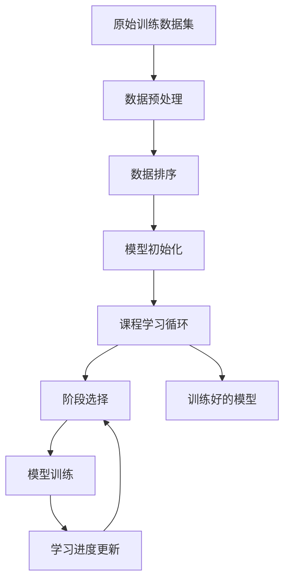

# 模型训练中的curriculum learning高级应用

> 关键词：Curriculum Learning、模型训练、高级应用、学习策略、人工智能

> 摘要：本文深入探讨了模型训练中Curriculum Learning的高级应用。首先介绍了Curriculum Learning的背景知识，包括其目的、预期读者和文档结构等。接着详细阐述了Curriculum Learning的核心概念与联系，通过文本示意图和Mermaid流程图进行直观展示。分析了其核心算法原理，并给出Python源代码示例。还介绍了相关的数学模型和公式，结合具体例子进行说明。通过项目实战，展示了如何在实际中应用Curriculum Learning，包括开发环境搭建、源代码实现和解读。探讨了其实际应用场景，推荐了学习资源、开发工具框架和相关论文著作。最后总结了Curriculum Learning的未来发展趋势与挑战，并提供了常见问题解答和扩展阅读参考资料。

## 1. 背景介绍 
### 1.1 目的和范围
Curriculum Learning（课程学习）是一种模拟人类学习过程的训练策略，在模型训练中具有重要意义。其目的在于通过合理安排训练数据的顺序，让模型先从简单任务或数据开始学习，逐步过渡到复杂任务或数据，从而提高模型的学习效率、泛化能力和最终性能。

本文的范围涵盖了Curriculum Learning的核心概念、算法原理、数学模型、实际应用案例以及相关的工具和资源推荐。旨在帮助读者全面深入地理解Curriculum Learning在模型训练中的高级应用，掌握如何将其应用到实际项目中，提升模型的训练效果。

### 1.2 预期读者
本文预期读者包括人工智能领域的研究人员、机器学习工程师、数据科学家以及对模型训练技术感兴趣的开发者。无论是初学者希望了解Curriculum Learning的基本概念，还是有一定经验的专业人士寻求高级应用技巧，都能从本文中获得有价值的信息。

### 1.3 文档结构概述
本文将按照以下结构进行阐述：
1. 背景介绍：介绍Curriculum Learning的目的、预期读者和文档结构。
2. 核心概念与联系：详细解释Curriculum Learning的核心概念，通过文本示意图和Mermaid流程图展示其原理和架构。
3. 核心算法原理 & 具体操作步骤：讲解Curriculum Learning的核心算法，并用Python源代码详细阐述。
4. 数学模型和公式 & 详细讲解 & 举例说明：介绍相关的数学模型和公式，并结合实例进行解释。
5. 项目实战：代码实际案例和详细解释说明，包括开发环境搭建、源代码实现和解读。
6. 实际应用场景：探讨Curriculum Learning在不同领域的实际应用。
7. 工具和资源推荐：推荐学习资源、开发工具框架和相关论文著作。
8. 总结：未来发展趋势与挑战：总结Curriculum Learning的发展趋势和面临的挑战。
9. 附录：常见问题与解答：解答读者可能遇到的常见问题。
10. 扩展阅读 & 参考资料：提供扩展阅读的建议和参考资料。

### 1.4 术语表
#### 1.4.1 核心术语定义
- **Curriculum Learning（课程学习）**：一种训练策略，通过按照一定顺序安排训练数据，让模型从简单到复杂逐步学习。
- **Simple Tasks（简单任务）**：在Curriculum Learning中，指相对容易学习和处理的任务或数据。
- **Complex Tasks（复杂任务）**：相对于简单任务，具有更高难度和复杂度的任务或数据。
- **Learning Progress（学习进度）**：表示模型在Curriculum Learning过程中所处的阶段，反映了从简单任务到复杂任务的过渡情况。

#### 1.4.2 相关概念解释
- **渐进式学习**：与Curriculum Learning类似，强调逐步增加学习内容的难度，使学习者能够更好地掌握知识和技能。
- **数据排序**：在Curriculum Learning中，根据任务或数据的难度对训练数据进行排序，以便模型按照顺序学习。

#### 1.4.3 缩略词列表
- **CL**：Curriculum Learning

## 2. 核心概念与联系 

### 核心概念原理
Curriculum Learning的核心思想源于人类的学习过程。人类在学习新知识时，通常会从简单的概念和技能开始，逐渐过渡到复杂的内容。例如，儿童在学习语言时，先学习简单的单词和句子，然后再学习复杂的语法和表达方式。

在模型训练中，Curriculum Learning通过对训练数据进行排序，让模型先学习简单的数据样本，这些样本通常具有较少的噪声、较明显的特征和较简单的模式。随着模型的学习能力逐渐增强，再引入更复杂的数据样本进行训练。这样可以避免模型在训练初期陷入复杂数据的混乱中，提高学习效率和泛化能力。

### 架构的文本示意图
以下是Curriculum Learning的架构文本示意图：

```plaintext
输入：原始训练数据集
|
|-- 数据预处理：对原始数据集进行清洗、标注等操作
|
|-- 数据排序：根据任务或数据的难度对预处理后的数据进行排序
|
|-- 模型初始化：初始化待训练的模型
|
|-- 课程学习循环：
|    |
|    |-- 阶段选择：根据学习进度选择当前阶段的训练数据
|    |
|    |-- 模型训练：使用当前阶段的数据对模型进行训练
|    |
|    |-- 学习进度更新：根据训练结果更新学习进度
|
输出：训练好的模型
```

### Mermaid流程图


## 3. 核心算法原理 & 具体操作步骤 

### 核心算法原理
Curriculum Learning的核心算法可以分为以下几个步骤：
1. **数据排序**：根据任务或数据的难度对训练数据进行排序。难度的衡量可以根据多种因素，如数据的复杂度、噪声水平、特征的明显程度等。
2. **阶段划分**：将排序后的数据划分为多个阶段，每个阶段包含一定数量的数据样本。
3. **模型训练**：从第一个阶段开始，使用该阶段的数据对模型进行训练。在每个阶段训练完成后，评估模型的性能。
4. **学习进度更新**：根据模型的性能和预设的规则，决定是否进入下一个阶段。如果模型在当前阶段的性能达到了一定的阈值，则进入下一个阶段；否则，继续在当前阶段进行训练。

### 具体操作步骤及Python源代码示例
以下是一个简单的Curriculum Learning示例，使用Python和PyTorch库实现：

```python
import torch
import torch.nn as nn
import torch.optim as optim
from torch.utils.data import Dataset, DataLoader

# 定义一个简单的数据集类
class SimpleDataset(Dataset):
    def __init__(self, data):
        self.data = data

    def __len__(self):
        return len(self.data)

    def __getitem__(self, idx):
        return self.data[idx]

# 定义一个简单的神经网络模型
class SimpleModel(nn.Module):
    def __init__(self, input_size, hidden_size, output_size):
        super(SimpleModel, self).__init__()
        self.fc1 = nn.Linear(input_size, hidden_size)
        self.relu = nn.ReLU()
        self.fc2 = nn.Linear(hidden_size, output_size)

    def forward(self, x):
        out = self.fc1(x)
        out = self.relu(out)
        out = self.fc2(out)
        return out

# 数据排序函数（简单示例，根据数据的第一个元素排序）
def sort_data(data):
    return sorted(data, key=lambda x: x[0])

# 阶段划分函数
def divide_into_stages(sorted_data, num_stages):
    stage_size = len(sorted_data) // num_stages
    stages = []
    for i in range(num_stages):
        start = i * stage_size
        end = (i + 1) * stage_size if i < num_stages - 1 else len(sorted_data)
        stages.append(sorted_data[start:end])
    return stages

# 课程学习函数
def curriculum_learning(data, input_size, hidden_size, output_size, num_stages, num_epochs_per_stage):
    # 数据排序
    sorted_data = sort_data(data)
    # 阶段划分
    stages = divide_into_stages(sorted_data, num_stages)

    # 模型初始化
    model = SimpleModel(input_size, hidden_size, output_size)
    criterion = nn.MSELoss()
    optimizer = optim.Adam(model.parameters(), lr=0.001)

    for stage_idx, stage_data in enumerate(stages):
        print(f"Training on stage {stage_idx + 1}")
        dataset = SimpleDataset(stage_data)
        dataloader = DataLoader(dataset, batch_size=32, shuffle=True)

        for epoch in range(num_epochs_per_stage):
            running_loss = 0.0
            for inputs in dataloader:
                inputs = inputs.float()
                optimizer.zero_grad()
                outputs = model(inputs)
                loss = criterion(outputs, inputs)  # 简单示例，以自身作为目标
                loss.backward()
                optimizer.step()
                running_loss += loss.item()

            print(f"Epoch {epoch + 1}, Loss: {running_loss / len(dataloader)}")

    return model

# 示例数据
data = [(i,) for i in range(100)]
input_size = 1
hidden_size = 10
output_size = 1
num_stages = 3
num_epochs_per_stage = 5

# 进行课程学习
trained_model = curriculum_learning(data, input_size, hidden_size, output_size, num_stages, num_epochs_per_stage)
```

### 代码解释
1. **数据排序**：`sort_data`函数根据数据的第一个元素对数据进行排序。
2. **阶段划分**：`divide_into_stages`函数将排序后的数据划分为多个阶段。
3. **模型初始化**：定义了一个简单的神经网络模型`SimpleModel`，并初始化了损失函数和优化器。
4. **课程学习循环**：在每个阶段，使用该阶段的数据对模型进行训练，训练多个epoch。

## 4. 数学模型和公式 & 详细讲解 & 举例说明 

### 数学模型和公式
在Curriculum Learning中，我们可以用以下数学模型来描述：

设训练数据集为 $\mathcal{D}=\{x_1, x_2, \cdots, x_n\}$，经过排序和阶段划分后，第 $k$ 个阶段的数据集为 $\mathcal{D}_k=\{x_{k1}, x_{k2}, \cdots, x_{km_k}\}$，其中 $m_k$ 是第 $k$ 个阶段的数据样本数量。

模型的目标是最小化损失函数 $L(\theta)$，其中 $\theta$ 是模型的参数。在第 $k$ 个阶段，我们通过优化以下目标函数来更新模型参数：

$$
\theta_{k+1} = \arg\min_{\theta} \frac{1}{m_k} \sum_{i=1}^{m_k} L(f(x_{ki}; \theta), y_{ki})
$$

其中 $f(x; \theta)$ 是模型的输出，$y_{ki}$ 是样本 $x_{ki}$ 的真实标签。

### 详细讲解
在每个阶段，我们使用当前阶段的数据集来更新模型参数，目标是使模型在该阶段的数据上的损失最小化。随着阶段的推进，模型逐渐接触到更复杂的数据，从而不断提升其学习能力和泛化能力。

### 举例说明
假设我们有一个回归任务，数据集包含一些二维点 $(x_1, x_2)$，目标是预测一个连续值 $y$。我们可以根据点的分布复杂度对数据进行排序，例如，先让模型学习分布较为集中的点，再学习分布较为分散的点。

在第一个阶段，我们使用分布集中的数据进行训练，模型学习到一些简单的模式。随着阶段的推进，引入分布更复杂的数据，模型需要不断调整参数以适应新的数据。通过这种方式，模型可以更好地泛化到不同复杂度的数据上。

## 5. 项目实战：代码实际案例和详细解释说明 

### 5.1  开发环境搭建
为了实现Curriculum Learning的项目实战，我们需要搭建以下开发环境：
1. **Python**：建议使用Python 3.7及以上版本。
2. **深度学习框架**：本文使用PyTorch，你可以根据自己的喜好选择TensorFlow等其他框架。安装命令如下：
```bash
pip install torch torchvision
```
3. **其他依赖库**：如`numpy`、`matplotlib`等，用于数据处理和可视化。安装命令如下：
```bash
pip install numpy matplotlib
```

### 5.2  源代码详细实现和代码解读
以下是一个基于MNIST数据集的Curriculum Learning项目实战代码：

```python
import torch
import torch.nn as nn
import torch.optim as optim
from torchvision import datasets, transforms
from torch.utils.data import DataLoader, Subset

# 数据预处理
transform = transforms.Compose([
    transforms.ToTensor(),
    transforms.Normalize((0.1307,), (0.3081,))
])

# 加载MNIST数据集
train_dataset = datasets.MNIST(root='./data', train=True,
                               download=True, transform=transform)
test_dataset = datasets.MNIST(root='./data', train=False,
                              download=True, transform=transform)

# 数据排序（简单示例，根据标签排序）
sorted_indices = sorted(range(len(train_dataset)), key=lambda i: train_dataset[i][1])
sorted_train_dataset = Subset(train_dataset, sorted_indices)

# 阶段划分
num_stages = 3
stage_size = len(sorted_train_dataset) // num_stages
stages = []
for i in range(num_stages):
    start = i * stage_size
    end = (i + 1) * stage_size if i < num_stages - 1 else len(sorted_train_dataset)
    stages.append(Subset(sorted_train_dataset, range(start, end)))

# 定义一个简单的神经网络模型
class SimpleNet(nn.Module):
    def __init__(self):
        super(SimpleNet, self).__init__()
        self.fc1 = nn.Linear(28 * 28, 128)
        self.relu = nn.ReLU()
        self.fc2 = nn.Linear(128, 10)

    def forward(self, x):
        x = x.view(-1, 28 * 28)
        x = self.fc1(x)
        x = self.relu(x)
        x = self.fc2(x)
        return x

# 训练函数
def train_model(model, dataloader, criterion, optimizer, epochs):
    model.train()
    for epoch in range(epochs):
        running_loss = 0.0
        for data, target in dataloader:
            optimizer.zero_grad()
            output = model(data)
            loss = criterion(output, target)
            loss.backward()
            optimizer.step()
            running_loss += loss.item()
        print(f"Epoch {epoch + 1}, Loss: {running_loss / len(dataloader)}")

# 测试函数
def test_model(model, dataloader):
    model.eval()
    correct = 0
    total = 0
    with torch.no_grad():
        for data, target in dataloader:
            output = model(data)
            _, predicted = torch.max(output.data, 1)
            total += target.size(0)
            correct += (predicted == target).sum().item()
    print(f"Accuracy: {100 * correct / total}%")

# 课程学习
model = SimpleNet()
criterion = nn.CrossEntropyLoss()
optimizer = optim.Adam(model.parameters(), lr=0.001)

for stage_idx, stage_dataset in enumerate(stages):
    print(f"Training on stage {stage_idx + 1}")
    stage_dataloader = DataLoader(stage_dataset, batch_size=64, shuffle=True)
    train_model(model, stage_dataloader, criterion, optimizer, epochs=5)
    test_dataloader = DataLoader(test_dataset, batch_size=64, shuffle=False)
    test_model(model, test_dataloader)
```

### 代码解读与分析
1. **数据预处理**：使用`transforms`对MNIST数据集进行预处理，将图像转换为张量并进行归一化。
2. **数据排序**：根据标签对训练数据集进行排序，这里只是一个简单示例，实际应用中可以根据数据的复杂度进行排序。
3. **阶段划分**：将排序后的数据集划分为多个阶段。
4. **模型定义**：定义了一个简单的全连接神经网络模型`SimpleNet`。
5. **训练和测试函数**：`train_model`函数用于训练模型，`test_model`函数用于测试模型的准确率。
6. **课程学习循环**：在每个阶段，使用该阶段的数据集对模型进行训练，并在测试集上进行测试。

通过这种方式，模型先学习简单的数字样本，逐渐过渡到复杂的样本，从而提高了学习效率和准确率。

## 6. 实际应用场景 
Curriculum Learning在多个领域都有广泛的应用，以下是一些常见的实际应用场景：

### 图像识别
在图像识别任务中，Curriculum Learning可以根据图像的复杂度对训练数据进行排序。例如，先让模型学习简单的几何图形图像，再学习复杂的自然场景图像。这样可以帮助模型更快地学习到图像的基本特征，然后逐渐适应更复杂的图像，提高图像识别的准确率。

### 自然语言处理
在自然语言处理中，Curriculum Learning可以应用于文本分类、机器翻译等任务。对于文本分类任务，可以根据文本的长度、难度等因素对训练数据进行排序，让模型先学习短文本、简单文本的分类，再学习长文本、复杂文本的分类。在机器翻译中，可以先让模型学习简单句子的翻译，再学习复杂句子的翻译，从而提高翻译的质量。

### 强化学习
在强化学习中，Curriculum Learning可以用于设计学习任务的顺序。例如，在机器人导航任务中，可以先让机器人在简单的环境中学习导航，如空旷的房间，然后逐渐引入复杂的环境，如充满障碍物的房间。这样可以帮助机器人更快地学习到基本的导航策略，然后逐渐适应更复杂的环境，提高导航的效率和准确性。

### 语音识别
在语音识别任务中，Curriculum Learning可以根据语音的清晰度、语速等因素对训练数据进行排序。让模型先学习清晰、语速较慢的语音，再学习模糊、语速较快的语音，从而提高语音识别的准确率。

## 7. 工具和资源推荐
### 7.1 学习资源推荐
#### 7.1.1 书籍推荐
- 《深度学习》（Deep Learning）：由Ian Goodfellow、Yoshua Bengio和Aaron Courville所著，是深度学习领域的经典教材，涵盖了Curriculum Learning等多种训练策略的介绍。
- 《动手学深度学习》（Dive into Deep Learning）：由李沐等人编写，提供了丰富的深度学习实践案例，包括Curriculum Learning的相关代码实现。

#### 7.1.2 在线课程
- Coursera上的“深度学习专项课程”（Deep Learning Specialization）：由Andrew Ng教授授课，系统地介绍了深度学习的各个方面，包括训练策略。
- edX上的“强化学习基础”（Foundations of Reinforcement Learning）：对于理解Curriculum Learning在强化学习中的应用有很大帮助。

#### 7.1.3 技术博客和网站
- Medium：有很多关于深度学习和Curriculum Learning的技术文章，作者们会分享自己的研究成果和实践经验。
- arXiv：是一个预印本平台，提供了大量的最新学术研究论文，你可以在这里找到关于Curriculum Learning的最新研究成果。

### 7.2 开发工具框架推荐
#### 7.2.1 IDE和编辑器
- PyCharm：是一款专门为Python开发设计的集成开发环境，提供了丰富的调试和代码编辑功能，适合进行深度学习项目的开发。
- Jupyter Notebook：是一个交互式的开发环境，适合进行数据探索、模型实验和代码演示，非常适合学习和研究Curriculum Learning。

#### 7.2.2 调试和性能分析工具
- TensorBoard：是TensorFlow提供的可视化工具，可以用于监控模型的训练过程，分析损失函数、准确率等指标的变化情况，帮助调试和优化模型。
- PyTorch Profiler：是PyTorch提供的性能分析工具，可以帮助你分析模型的运行时间、内存使用情况等，找出性能瓶颈。

#### 7.2.3 相关框架和库
- PyTorch：是一个开源的深度学习框架，提供了丰富的神经网络层和优化算法，方便实现Curriculum Learning。
- TensorFlow：是另一个广泛使用的深度学习框架，具有强大的分布式训练和部署能力，也可以用于实现Curriculum Learning。

### 7.3 相关论文著作推荐
#### 7.3.1 经典论文
- 《Curriculum Learning》：由Yoshua Bengio等人发表，是Curriculum Learning领域的经典论文，详细介绍了Curriculum Learning的概念和原理。
- 《Self-Paced Learning for Latent Variable Models》：提出了一种自定进度的学习方法，与Curriculum Learning有一定的关联。

#### 7.3.2 最新研究成果
- 在arXiv和各大机器学习会议（如NeurIPS、ICML等）上可以找到关于Curriculum Learning的最新研究成果，这些成果可能会提出新的算法和应用场景。

#### 7.3.3 应用案例分析
- 一些学术期刊和会议论文会分享Curriculum Learning在不同领域的应用案例，通过阅读这些案例可以了解如何将Curriculum Learning应用到实际项目中。

## 8. 总结：未来发展趋势与挑战
### 未来发展趋势
1. **自适应课程设计**：未来的Curriculum Learning可能会实现自适应的课程设计，根据模型的学习进度和性能自动调整训练数据的顺序和难度，从而进一步提高学习效率。
2. **多模态课程学习**：随着多模态数据（如图像、文本、语音等）的广泛应用，Curriculum Learning可能会扩展到多模态领域，实现跨模态的课程学习，提高模型对多模态数据的处理能力。
3. **与其他训练策略结合**：Curriculum Learning可能会与其他训练策略（如迁移学习、元学习等）相结合，发挥各自的优势，进一步提升模型的性能。

### 挑战
1. **难度评估**：如何准确地评估数据的难度是Curriculum Learning面临的一个挑战。不同的任务和数据可能需要不同的难度评估方法，目前还没有一种通用的方法。
2. **计算资源需求**：Curriculum Learning通常需要对数据进行排序和阶段划分，这可能会增加计算资源的需求。在大规模数据集上应用Curriculum Learning时，如何优化计算效率是一个需要解决的问题。
3. **模型适应性**：不同的模型对Curriculum Learning的适应性可能不同，如何选择适合的模型和调整模型的参数以充分发挥Curriculum Learning的优势是一个挑战。

## 9. 附录：常见问题与解答
### 问题1：Curriculum Learning和传统的随机训练有什么区别？
解答：传统的随机训练是随机选择训练数据进行模型训练，而Curriculum Learning会根据数据的难度对训练数据进行排序，让模型先学习简单的数据，再学习复杂的数据。Curriculum Learning可以提高模型的学习效率和泛化能力，避免模型在训练初期陷入复杂数据的混乱中。

### 问题2：如何确定数据的难度？
解答：数据的难度可以根据多种因素来确定，如数据的复杂度、噪声水平、特征的明显程度等。对于图像数据，可以根据图像的分辨率、纹理复杂度等因素来评估难度；对于文本数据，可以根据文本的长度、词汇复杂度等因素来评估难度。具体的评估方法需要根据具体的任务和数据来确定。

### 问题3：Curriculum Learning适用于所有的模型吗？
解答：Curriculum Learning并不适用于所有的模型。一般来说，对于复杂的模型和大规模的数据集，Curriculum Learning可能会带来更好的效果。但对于一些简单的模型和小规模的数据集，传统的随机训练可能已经足够。此外，不同的模型对Curriculum Learning的适应性也可能不同，需要进行实验和调整。

## 10. 扩展阅读 & 参考资料
### 扩展阅读
- 《Adversarial Curriculum Learning》：探讨了对抗式课程学习的方法，结合了对抗训练和课程学习的思想。
- 《Curriculum Learning for Deep Reinforcement Learning》：研究了Curriculum Learning在深度强化学习中的应用。

### 参考资料
- Goodfellow, I., Bengio, Y., & Courville, A. (2016). Deep Learning. MIT Press.
- Li, M., & Srikant, R. (2016). Self-Paced Learning for Latent Variable Models. Journal of Machine Learning Research.
- Bengio, Y., Louradour, J., Collobert, R., & Weston, J. (2009). Curriculum Learning. Proceedings of the 26th Annual International Conference on Machine Learning.

作者：AI天才研究院/AI Genius Institute & 禅与计算机程序设计艺术 /Zen And The Art of Computer Programming