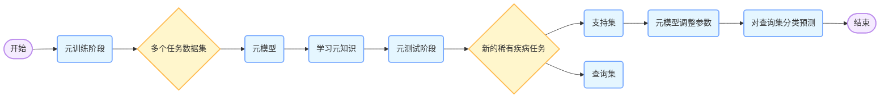

# 模型训练中的few-shot learning在稀有疾病诊断中的突破性应用

> 关键词：few-shot learning、稀有疾病诊断、模型训练、小样本学习、医疗人工智能

> 摘要：本文聚焦于模型训练中的few-shot learning在稀有疾病诊断领域的突破性应用。首先介绍了相关背景知识，包括研究目的、预期读者、文档结构等内容。接着深入剖析了few-shot learning的核心概念、算法原理及数学模型。通过项目实战展示了如何在实际开发中运用few-shot learning进行稀有疾病诊断，并给出详细的代码实现和解读。随后探讨了其实际应用场景，推荐了相关的学习资源、开发工具框架以及论文著作。最后总结了few-shot learning在稀有疾病诊断中的未来发展趋势与挑战，并对常见问题进行了解答，提供了扩展阅读和参考资料，旨在为相关领域的研究和实践提供全面而深入的指导。

## 1. 背景介绍 
### 1.1 目的和范围
稀有疾病是指那些发病率极低的疾病，由于患者数量稀少，很难收集到足够多的病例数据用于传统的机器学习模型训练。而传统的基于大量数据的机器学习方法在处理稀有疾病诊断时往往效果不佳。few-shot learning作为一种小样本学习方法，旨在从少量的样本中快速学习到有效的特征和模式，从而能够在数据稀缺的情况下进行准确的分类和预测。本文的目的是探讨few-shot learning在稀有疾病诊断中的应用，研究其原理、算法和实际操作步骤，评估其在该领域的有效性和潜力，为稀有疾病的早期诊断和治疗提供新的技术手段和思路。

本文的范围涵盖了few-shot learning的基本概念、核心算法、数学模型，以及如何将其应用于稀有疾病诊断的实际项目中。同时，还将分析其在实际应用场景中的优势和局限性，并提供相关的学习资源、开发工具和论文著作推荐。

### 1.2 预期读者
本文预期读者包括医疗领域的研究人员、医生、生物信息学家，以及计算机科学领域的人工智能研究者、机器学习工程师和数据科学家。对于医疗领域的读者，本文将帮助他们了解如何利用先进的人工智能技术解决稀有疾病诊断中的数据稀缺问题；对于计算机科学领域的读者，本文将展示few-shot learning在医疗健康领域的具体应用场景和挑战，为他们的研究和实践提供新的方向。

### 1.3 文档结构概述
本文将按照以下结构进行组织：
1. 背景介绍：阐述研究目的、预期读者和文档结构，介绍相关术语和概念。
2. 核心概念与联系：详细解释few-shot learning的核心概念，包括元学习、支持集和查询集等，并通过文本示意图和Mermaid流程图展示其架构和工作流程。
3. 核心算法原理 & 具体操作步骤：介绍几种常见的few-shot learning算法，如原型网络、匹配网络等，并使用Python源代码详细阐述其实现步骤。
4. 数学模型和公式 & 详细讲解 & 举例说明：推导few-shot learning的数学模型和公式，通过具体例子说明其应用和计算过程。
5. 项目实战：代码实际案例和详细解释说明：介绍如何搭建开发环境，给出使用few-shot learning进行稀有疾病诊断的源代码，并对代码进行详细解读和分析。
6. 实际应用场景：探讨few-shot learning在稀有疾病诊断中的实际应用场景，分析其优势和局限性。
7. 工具和资源推荐：推荐相关的学习资源、开发工具框架和论文著作，帮助读者进一步深入学习和研究。
8. 总结：未来发展趋势与挑战：总结few-shot learning在稀有疾病诊断中的应用现状，分析其未来发展趋势和面临的挑战。
9. 附录：常见问题与解答：对读者可能关心的常见问题进行解答。
10. 扩展阅读 & 参考资料：提供相关的扩展阅读材料和参考资料，方便读者进一步探索和研究。

### 1.4 术语表
#### 1.4.1 核心术语定义
- **Few-shot learning（小样本学习）**：是一种机器学习技术，旨在从少量的样本中学习到有效的特征和模式，从而能够在新的任务中进行准确的分类和预测。
- **元学习（Meta-learning）**：也称为“学习如何学习”，是few-shot learning的核心思想，通过在多个任务上进行训练，学习到一种通用的学习策略，以便在新的任务上能够快速学习。
- **支持集（Support set）**：在few-shot learning中，支持集是用于训练模型的少量样本集合，通常包含每个类别的少量样本。
- **查询集（Query set）**：查询集是用于测试模型性能的样本集合，模型需要根据支持集学习到的知识对查询集中的样本进行分类和预测。
- **稀有疾病（Rare disease）**：指那些发病率极低的疾病，通常患者数量较少，难以收集到足够多的病例数据用于传统的机器学习模型训练。

#### 1.4.2 相关概念解释
- **小样本问题**：在机器学习中，小样本问题是指由于样本数量有限，模型难以学习到足够的特征和模式，从而导致泛化能力下降的问题。few-shot learning旨在解决这一问题。
- **迁移学习**：迁移学习是指将在一个任务上学习到的知识迁移到另一个相关任务上的技术。few-shot learning可以看作是迁移学习的一种特殊情况，它强调在少量样本的情况下进行快速学习和迁移。
- **数据增强**：数据增强是指通过对原始数据进行变换和扩充，生成更多的样本，从而提高模型的泛化能力。在few-shot learning中，数据增强可以帮助缓解样本数量不足的问题。

#### 1.4.3 缩略词列表
- **ML（Machine Learning）**：机器学习
- **DL（Deep Learning）**：深度学习
- **CNN（Convolutional Neural Network）**：卷积神经网络
- **SVM（Support Vector Machine）**：支持向量机
- **KNN（K-Nearest Neighbors）**：K近邻算法

## 2. 核心概念与联系 

### 核心概念原理
Few-shot learning的核心思想是利用元学习的方法，从多个相关任务中学习到一种通用的学习策略，以便在新的任务上能够快速学习。在稀有疾病诊断中，每个疾病可以看作是一个独立的任务，由于每种稀有疾病的病例数据都非常有限，传统的机器学习方法很难在单个疾病上进行有效的训练。而few-shot learning通过在多个稀有疾病的数据集上进行训练，学习到一种通用的特征提取和分类方法，当遇到新的稀有疾病时，只需要少量的病例数据就可以快速进行诊断。

元学习的关键在于学习一个元模型，该模型可以根据少量的样本数据快速调整自身的参数，以适应新的任务。在few-shot learning中，通常将数据集划分为支持集和查询集。支持集包含每个类别的少量样本，用于训练模型；查询集包含需要进行分类和预测的样本，模型根据支持集学习到的知识对查询集中的样本进行分类和预测。

### 架构的文本示意图
```plaintext
元训练阶段：
多个任务数据集（包含不同稀有疾病的样本）
|
V
元模型（学习通用的学习策略）
|
V
学习到的元知识

元测试阶段：
新的稀有疾病任务（支持集和查询集）
|
V
元模型（利用元知识，根据支持集快速调整参数）
|
V
对查询集进行分类和预测
```

### Mermaid流程图


## 3. 核心算法原理 & 具体操作步骤 

### 原型网络（Prototypical Networks）
#### 算法原理
原型网络的核心思想是为每个类别计算一个原型向量，该向量表示该类别的中心。在训练过程中，模型学习如何将输入样本映射到一个特征空间，使得同一类别的样本在特征空间中靠近其原型向量，不同类别的样本远离其他类别的原型向量。在测试阶段，对于一个新的样本，模型计算其与各个类别的原型向量的距离，将其分类到距离最近的类别中。

#### 具体操作步骤
1. **数据准备**：将数据集划分为支持集和查询集。
2. **特征提取**：使用一个卷积神经网络（CNN）将支持集和查询集的样本映射到一个特征空间。
3. **计算原型向量**：对于支持集中的每个类别，计算该类别所有样本的特征向量的平均值，得到该类别的原型向量。
4. **计算距离**：对于查询集中的每个样本，计算其特征向量与各个类别的原型向量的欧氏距离。
5. **分类预测**：将查询集中的样本分类到距离最近的类别中。

#### Python源代码实现
```python
import torch
import torch.nn as nn
import torch.optim as optim
import numpy as np

# 定义卷积神经网络用于特征提取
class ProtoNet(nn.Module):
    def __init__(self):
        super(ProtoNet, self).__init__()
        self.encoder = nn.Sequential(
            nn.Conv2d(3, 64, kernel_size=3, padding=1),
            nn.BatchNorm2d(64),
            nn.ReLU(),
            nn.MaxPool2d(2),
            nn.Conv2d(64, 64, kernel_size=3, padding=1),
            nn.BatchNorm2d(64),
            nn.ReLU(),
            nn.MaxPool2d(2),
            nn.Conv2d(64, 64, kernel_size=3, padding=1),
            nn.BatchNorm2d(64),
            nn.ReLU(),
            nn.MaxPool2d(2),
            nn.Conv2d(64, 64, kernel_size=3, padding=1),
            nn.BatchNorm2d(64),
            nn.ReLU()
        )

    def forward(self, x):
        x = self.encoder(x)
        return x.view(x.size(0), -1)

# 计算原型向量
def compute_prototypes(support_set, labels, num_classes):
    prototypes = []
    for c in range(num_classes):
        class_indices = (labels == c).nonzero(as_tuple=True)[0]
        class_samples = support_set[class_indices]
        prototype = torch.mean(class_samples, dim=0)
        prototypes.append(prototype)
    return torch.stack(prototypes)

# 计算欧氏距离
def euclidean_distance(query, prototypes):
    n = query.size(0)
    m = prototypes.size(0)
    d = query.size(1)
    query = query.unsqueeze(1).expand(n, m, d)
    prototypes = prototypes.unsqueeze(0).expand(n, m, d)
    return torch.pow(query - prototypes, 2).sum(dim=2)

# 训练模型
def train_protonet(model, support_set, support_labels, query_set, query_labels, num_classes, num_epochs, lr):
    optimizer = optim.Adam(model.parameters(), lr=lr)
    criterion = nn.CrossEntropyLoss()

    for epoch in range(num_epochs):
        model.train()
        optimizer.zero_grad()

        # 提取特征
        support_features = model(support_set)
        query_features = model(query_set)

        # 计算原型向量
        prototypes = compute_prototypes(support_features, support_labels, num_classes)

        # 计算距离
        distances = euclidean_distance(query_features, prototypes)

        # 计算损失
        logits = -distances
        loss = criterion(logits, query_labels)

        # 反向传播
        loss.backward()
        optimizer.step()

        if (epoch + 1) % 10 == 0:
            print(f'Epoch {epoch + 1}/{num_epochs}, Loss: {loss.item()}')

    return model

# 测试模型
def test_protonet(model, support_set, support_labels, query_set, num_classes):
    model.eval()
    with torch.no_grad():
        # 提取特征
        support_features = model(support_set)
        query_features = model(query_set)

        # 计算原型向量
        prototypes = compute_prototypes(support_features, support_labels, num_classes)

        # 计算距离
        distances = euclidean_distance(query_features, prototypes)

        # 预测类别
        logits = -distances
        _, predictions = torch.max(logits, dim=1)

    return predictions
```

### 匹配网络（Matching Networks）
#### 算法原理
匹配网络通过学习一个匹配函数，来衡量查询集中的样本与支持集中的样本之间的相似度。在训练过程中，模型学习如何根据支持集的样本和标签，对查询集中的样本进行分类。匹配网络使用注意力机制来计算查询样本与支持样本之间的相似度权重，从而实现对查询样本的分类。

#### 具体操作步骤
1. **数据准备**：将数据集划分为支持集和查询集。
2. **特征提取**：使用一个神经网络将支持集和查询集的样本映射到一个特征空间。
3. **计算相似度**：使用注意力机制计算查询样本与支持样本之间的相似度权重。
4. **加权求和**：根据相似度权重对支持样本的标签进行加权求和，得到查询样本的预测标签。

#### Python源代码实现
```python
import torch
import torch.nn as nn
import torch.optim as optim
import numpy as np

# 定义特征提取网络
class Encoder(nn.Module):
    def __init__(self):
        super(Encoder, self).__init__()
        self.encoder = nn.Sequential(
            nn.Conv2d(3, 64, kernel_size=3, padding=1),
            nn.BatchNorm2d(64),
            nn.ReLU(),
            nn.MaxPool2d(2),
            nn.Conv2d(64, 64, kernel_size=3, padding=1),
            nn.BatchNorm2d(64),
            nn.ReLU(),
            nn.MaxPool2d(2),
            nn.Conv2d(64, 64, kernel_size=3, padding=1),
            nn.BatchNorm2d(64),
            nn.ReLU(),
            nn.MaxPool2d(2),
            nn.Conv2d(64, 64, kernel_size=3, padding=1),
            nn.BatchNorm2d(64),
            nn.ReLU()
        )

    def forward(self, x):
        x = self.encoder(x)
        return x.view(x.size(0), -1)

# 定义匹配网络
class MatchingNetwork(nn.Module):
    def __init__(self):
        super(MatchingNetwork, self).__init__()
        self.encoder = Encoder()

    def forward(self, support_set, support_labels, query_set):
        # 提取特征
        support_features = self.encoder(support_set)
        query_features = self.encoder(query_set)

        # 计算相似度
        similarity = torch.mm(query_features, support_features.t())
        attention = torch.softmax(similarity, dim=1)

        # 加权求和
        one_hot_labels = torch.nn.functional.one_hot(support_labels, num_classes=torch.max(support_labels).item() + 1).float()
        predictions = torch.mm(attention, one_hot_labels)

        return predictions

# 训练模型
def train_matching_network(model, support_set, support_labels, query_set, query_labels, num_epochs, lr):
    optimizer = optim.Adam(model.parameters(), lr=lr)
    criterion = nn.CrossEntropyLoss()

    for epoch in range(num_epochs):
        model.train()
        optimizer.zero_grad()

        # 前向传播
        predictions = model(support_set, support_labels, query_set)

        # 计算损失
        loss = criterion(predictions, query_labels)

        # 反向传播
        loss.backward()
        optimizer.step()

        if (epoch + 1) % 10 == 0:
            print(f'Epoch {epoch + 1}/{num_epochs}, Loss: {loss.item()}')

    return model

# 测试模型
def test_matching_network(model, support_set, support_labels, query_set):
    model.eval()
    with torch.no_grad():
        predictions = model(support_set, support_labels, query_set)
        _, predicted_labels = torch.max(predictions, dim=1)

    return predicted_labels
```

## 4. 数学模型和公式 & 详细讲解 & 举例说明 

### 原型网络的数学模型和公式
#### 特征提取
假设输入样本 $x$ 的维度为 $d_x$，通过卷积神经网络 $f_{\theta}$ 进行特征提取，得到特征向量 $z = f_{\theta}(x)$，其中 $\theta$ 是网络的参数，$z$ 的维度为 $d_z$。

#### 计算原型向量
对于支持集中的每个类别 $c$，设该类别的样本集合为 $S_c = \{x_{c1}, x_{c2}, \cdots, x_{cn_c}\}$，其中 $n_c$ 是该类别的样本数量。该类别的原型向量 $p_c$ 计算如下：
$$p_c = \frac{1}{n_c} \sum_{i=1}^{n_c} f_{\theta}(x_{ci})$$

#### 计算欧氏距离
对于查询集中的一个样本 $x_q$，其特征向量为 $z_q = f_{\theta}(x_q)$，与类别 $c$ 的原型向量 $p_c$ 的欧氏距离 $d(z_q, p_c)$ 计算如下：
$$d(z_q, p_c) = \|z_q - p_c\|_2 = \sqrt{\sum_{i=1}^{d_z} (z_{qi} - p_{ci})^2}$$

#### 分类预测
查询样本 $x_q$ 属于类别 $c$ 的概率 $P(y_q = c|x_q)$ 可以通过负距离的 softmax 函数计算：
$$P(y_q = c|x_q) = \frac{\exp(-d(z_q, p_c))}{\sum_{j=1}^{C} \exp(-d(z_q, p_j))}$$
其中 $C$ 是类别的数量。

#### 举例说明
假设我们有一个 2-way 1-shot 的任务，即有两个类别，每个类别只有一个样本作为支持集。支持集样本为 $x_1$ 和 $x_2$，对应的类别标签为 $y_1 = 0$ 和 $y_2 = 1$。查询集有一个样本 $x_q$。

1. **特征提取**：通过卷积神经网络 $f_{\theta}$ 提取特征，得到 $z_1 = f_{\theta}(x_1)$，$z_2 = f_{\theta}(x_2)$ 和 $z_q = f_{\theta}(x_q)$。
2. **计算原型向量**：由于每个类别只有一个样本，所以原型向量 $p_0 = z_1$，$p_1 = z_2$。
3. **计算欧氏距离**：计算 $d(z_q, p_0)$ 和 $d(z_q, p_1)$。
4. **分类预测**：计算 $P(y_q = 0|x_q) = \frac{\exp(-d(z_q, p_0))}{\exp(-d(z_q, p_0)) + \exp(-d(z_q, p_1))}$ 和 $P(y_q = 1|x_q) = \frac{\exp(-d(z_q, p_1))}{\exp(-d(z_q, p_0)) + \exp(-d(z_q, p_1))}$，将查询样本分类到概率最大的类别中。

### 匹配网络的数学模型和公式
#### 特征提取
同样，输入样本 $x$ 通过神经网络 $f_{\theta}$ 进行特征提取，得到特征向量 $z = f_{\theta}(x)$。

#### 计算相似度
对于查询样本 $x_q$ 和支持样本 $x_{si}$，其特征向量分别为 $z_q$ 和 $z_{si}$，它们之间的相似度 $s(z_q, z_{si})$ 可以通过点积计算：
$$s(z_q, z_{si}) = z_q^T z_{si}$$

#### 注意力机制
查询样本 $x_q$ 与支持样本的相似度权重 $\alpha_i$ 可以通过 softmax 函数计算：
$$\alpha_i = \frac{\exp(s(z_q, z_{si}))}{\sum_{j=1}^{n_s} \exp(s(z_q, z_{sj}))}$$
其中 $n_s$ 是支持集的样本数量。

#### 加权求和
查询样本 $x_q$ 的预测标签 $\hat{y}_q$ 可以通过对支持样本的标签进行加权求和得到：
$$\hat{y}_q = \sum_{i=1}^{n_s} \alpha_i y_{si}$$
其中 $y_{si}$ 是支持样本 $x_{si}$ 的标签。

#### 举例说明
假设支持集有三个样本 $x_{s1}$，$x_{s2}$，$x_{s3}$，对应的标签为 $y_{s1} = 0$，$y_{s2} = 1$，$y_{s3} = 1$，查询样本为 $x_q$。

1. **特征提取**：通过神经网络 $f_{\theta}$ 提取特征，得到 $z_{s1} = f_{\theta}(x_{s1})$，$z_{s2} = f_{\theta}(x_{s2})$，$z_{s3} = f_{\theta}(x_{s3})$ 和 $z_q = f_{\theta}(x_q)$。
2. **计算相似度**：计算 $s(z_q, z_{s1})$，$s(z_q, z_{s2})$ 和 $s(z_q, z_{s3})$。
3. **注意力机制**：计算相似度权重 $\alpha_1$，$\alpha_2$ 和 $\alpha_3$。
4. **加权求和**：计算 $\hat{y}_q = \alpha_1 y_{s1} + \alpha_2 y_{s2} + \alpha_3 y_{s3}$，将 $\hat{y}_q$ 四舍五入得到预测的类别标签。

## 5. 项目实战：代码实际案例和详细解释说明 

### 5.1  开发环境搭建
#### 安装Python
首先需要安装Python，建议使用Python 3.7及以上版本。可以从Python官方网站（https://www.python.org/downloads/）下载并安装。

#### 安装深度学习框架
我们使用PyTorch作为深度学习框架，可以通过以下命令安装：
```bash
pip install torch torchvision
```

#### 安装其他依赖库
还需要安装一些其他的依赖库，如NumPy、Matplotlib等，可以通过以下命令安装：
```bash
pip install numpy matplotlib
```

### 5.2  源代码详细实现和代码解读
以下是一个使用原型网络进行稀有疾病诊断的完整代码示例：
```python
import torch
import torch.nn as nn
import torch.optim as optim
import numpy as np
import matplotlib.pyplot as plt

# 定义卷积神经网络用于特征提取
class ProtoNet(nn.Module):
    def __init__(self):
        super(ProtoNet, self).__init__()
        self.encoder = nn.Sequential(
            nn.Conv2d(3, 64, kernel_size=3, padding=1),
            nn.BatchNorm2d(64),
            nn.ReLU(),
            nn.MaxPool2d(2),
            nn.Conv2d(64, 64, kernel_size=3, padding=1),
            nn.BatchNorm2d(64),
            nn.ReLU(),
            nn.MaxPool2d(2),
            nn.Conv2d(64, 64, kernel_size=3, padding=1),
            nn.BatchNorm2d(64),
            nn.ReLU(),
            nn.MaxPool2d(2),
            nn.Conv2d(64, 64, kernel_size=3, padding=1),
            nn.BatchNorm2d(64),
            nn.ReLU()
        )

    def forward(self, x):
        x = self.encoder(x)
        return x.view(x.size(0), -1)

# 计算原型向量
def compute_prototypes(support_set, labels, num_classes):
    prototypes = []
    for c in range(num_classes):
        class_indices = (labels == c).nonzero(as_tuple=True)[0]
        class_samples = support_set[class_indices]
        prototype = torch.mean(class_samples, dim=0)
        prototypes.append(prototype)
    return torch.stack(prototypes)

# 计算欧氏距离
def euclidean_distance(query, prototypes):
    n = query.size(0)
    m = prototypes.size(0)
    d = query.size(1)
    query = query.unsqueeze(1).expand(n, m, d)
    prototypes = prototypes.unsqueeze(0).expand(n, m, d)
    return torch.pow(query - prototypes, 2).sum(dim=2)

# 训练模型
def train_protonet(model, support_set, support_labels, query_set, query_labels, num_classes, num_epochs, lr):
    optimizer = optim.Adam(model.parameters(), lr=lr)
    criterion = nn.CrossEntropyLoss()

    losses = []
    for epoch in range(num_epochs):
        model.train()
        optimizer.zero_grad()

        # 提取特征
        support_features = model(support_set)
        query_features = model(query_set)

        # 计算原型向量
        prototypes = compute_prototypes(support_features, support_labels, num_classes)

        # 计算距离
        distances = euclidean_distance(query_features, prototypes)

        # 计算损失
        logits = -distances
        loss = criterion(logits, query_labels)

        # 反向传播
        loss.backward()
        optimizer.step()

        losses.append(loss.item())
        if (epoch + 1) % 10 == 0:
            print(f'Epoch {epoch + 1}/{num_epochs}, Loss: {loss.item()}')

    # 绘制损失曲线
    plt.plot(losses)
    plt.xlabel('Epoch')
    plt.ylabel('Loss')
    plt.title('Training Loss')
    plt.show()

    return model

# 测试模型
def test_protonet(model, support_set, support_labels, query_set, num_classes):
    model.eval()
    with torch.no_grad():
        # 提取特征
        support_features = model(support_set)
        query_features = model(query_set)

        # 计算原型向量
        prototypes = compute_prototypes(support_features, support_labels, num_classes)

        # 计算距离
        distances = euclidean_distance(query_features, prototypes)

        # 预测类别
        logits = -distances
        _, predictions = torch.max(logits, dim=1)

    return predictions

# 生成模拟数据
def generate_data(num_classes, num_support_per_class, num_query_per_class):
    support_set = []
    support_labels = []
    query_set = []
    query_labels = []

    for c in range(num_classes):
        support_samples = torch.randn(num_support_per_class, 3, 32, 32)
        support_set.append(support_samples)
        support_labels.extend([c] * num_support_per_class)

        query_samples = torch.randn(num_query_per_class, 3, 32, 32)
        query_set.append(query_samples)
        query_labels.extend([c] * num_query_per_class)

    support_set = torch.cat(support_set, dim=0)
    support_labels = torch.tensor(support_labels)
    query_set = torch.cat(query_set, dim=0)
    query_labels = torch.tensor(query_labels)

    return support_set, support_labels, query_set, query_labels

# 主函数
if __name__ == '__main__':
    # 生成数据
    num_classes = 5
    num_support_per_class = 5
    num_query_per_class = 10
    support_set, support_labels, query_set, query_labels = generate_data(num_classes, num_support_per_class, num_query_per_class)

    # 初始化模型
    model = ProtoNet()

    # 训练模型
    num_epochs = 100
    lr = 0.001
    model = train_protonet(model, support_set, support_labels, query_set, query_labels, num_classes, num_epochs, lr)

    # 测试模型
    predictions = test_protonet(model, support_set, support_labels, query_set, num_classes)

    # 计算准确率
    accuracy = (predictions == query_labels).float().mean().item()
    print(f'Test Accuracy: {accuracy * 100:.2f}%')
```

### 5.3  代码解读与分析
#### 数据生成部分
`generate_data` 函数用于生成模拟的稀有疾病诊断数据。我们假设每个疾病类别有一定数量的支持样本和查询样本，每个样本是一个 3 通道、32x32 大小的图像。通过随机生成张量来模拟图像数据。

#### 模型定义部分
`ProtoNet` 类定义了一个卷积神经网络，用于特征提取。该网络包含四个卷积层，每个卷积层后面跟着批归一化层和 ReLU 激活函数，最后通过最大池化层进行下采样。

#### 训练部分
`train_protonet` 函数实现了原型网络的训练过程。在每个 epoch 中，首先通过模型提取支持集和查询集的特征，然后计算每个类别的原型向量，接着计算查询样本与原型向量的欧氏距离，最后使用交叉熵损失函数计算损失并进行反向传播更新模型参数。同时，绘制训练损失曲线，方便观察训练过程。

#### 测试部分
`test_protonet` 函数实现了原型网络的测试过程。在测试阶段，模型不进行参数更新，通过计算查询样本与原型向量的距离，将查询样本分类到距离最近的类别中。

#### 准确率计算部分
最后，计算测试集的准确率，评估模型的性能。

## 6. 实际应用场景 
### 临床诊断辅助
在临床实践中，医生经常会遇到一些罕见的疾病，由于缺乏足够的病例经验，诊断难度较大。few-shot learning可以帮助医生利用已有的少量稀有疾病病例数据进行模型训练，当遇到新的疑似稀有疾病患者时，模型可以快速对患者的症状、检查结果等数据进行分析和诊断，为医生提供参考建议，辅助医生做出更准确的诊断。

### 药物研发
在药物研发过程中，需要对药物在特定疾病上的疗效进行评估。对于稀有疾病，由于患者数量有限，很难进行大规模的临床试验。few-shot learning可以通过分析少量的患者数据，预测药物在稀有疾病患者中的疗效和安全性，为药物研发提供指导，加快药物研发的进程。

### 疾病监测与预警
通过收集和分析少量的稀有疾病病例数据，利用few-shot learning建立疾病监测模型。该模型可以实时监测疾病的发生和传播情况，当发现异常情况时及时发出预警，有助于卫生部门采取相应的防控措施，控制疾病的传播。

### 医学影像诊断
在医学影像诊断中，如X光、CT、MRI等，对于稀有疾病的影像特征识别是一个挑战。few-shot learning可以通过学习少量的稀有疾病影像样本，识别出影像中的特征和病变，辅助医生进行影像诊断，提高诊断的准确性和效率。

### 基因数据分析
在基因数据分析中，对于稀有疾病的基因变异特征识别也存在数据稀缺的问题。few-shot learning可以通过分析少量的稀有疾病患者的基因数据，识别出与疾病相关的基因变异，为疾病的诊断和治疗提供基因层面的依据。

## 7. 工具和资源推荐
### 7.1 学习资源推荐
#### 7.1.1 书籍推荐
- 《机器学习》（周志华）：这本书系统地介绍了机器学习的基本概念、算法和应用，是机器学习领域的经典教材，对于理解few-shot learning的基础理论非常有帮助。
- 《深度学习》（Ian Goodfellow、Yoshua Bengio、Aaron Courville）：这本书全面介绍了深度学习的原理、方法和应用，对于深入理解深度学习在few-shot learning中的应用有很大的帮助。
- 《元学习：原理与算法》（李宏毅）：这本书专门介绍了元学习的相关知识，包括few-shot learning的核心算法和技术，是学习few-shot learning的重要参考书籍。

#### 7.1.2 在线课程
- Coursera上的“机器学习”课程（Andrew Ng）：这是一门非常经典的机器学习入门课程，涵盖了机器学习的基本概念、算法和应用，对于初学者来说是一个很好的学习资源。
- edX上的“深度学习基础”课程（MIT）：这门课程介绍了深度学习的基本原理和方法，包括神经网络、卷积神经网络等，对于理解few-shot learning中的深度学习模型有很大的帮助。
- B站的“李宏毅机器学习”课程：这门课程由台湾大学的李宏毅教授主讲，内容生动有趣，涵盖了机器学习和深度学习的多个方面，包括few-shot learning的相关知识。

#### 7.1.3 技术博客和网站
- Medium：Medium上有很多关于机器学习和人工智能的技术博客，其中不乏关于few-shot learning的文章，可以从中了解到最新的研究成果和应用案例。
- arXiv：arXiv是一个预印本平台，上面有很多关于机器学习和人工智能的研究论文，包括few-shot learning的最新研究成果，可以及时了解到该领域的前沿动态。
- Towards Data Science：这是一个专注于数据科学和机器学习的技术博客平台，上面有很多关于few-shot learning的实践经验和案例分享。

### 7.2 开发工具框架推荐
#### 7.2.1 IDE和编辑器
- PyCharm：PyCharm是一款专门为Python开发设计的集成开发环境（IDE），具有强大的代码编辑、调试和自动补全功能，非常适合用于开发基于Python的few-shot learning项目。
- Jupyter Notebook：Jupyter Notebook是一个交互式的开发环境，可以在浏览器中编写和运行代码，方便进行代码的测试和演示，对于学习和研究few-shot learning非常有用。
- Visual Studio Code：Visual Studio Code是一款轻量级的代码编辑器，支持多种编程语言，具有丰富的插件生态系统，可以通过安装相关插件来支持Python开发和机器学习项目。

#### 7.2.2 调试和性能分析工具
- PyTorch Debugger（TorchScript Debugger）：PyTorch自带的调试工具，可以帮助开发者调试和分析PyTorch模型的运行过程，定位问题和优化性能。
- TensorBoard：TensorBoard是TensorFlow的可视化工具，也可以与PyTorch结合使用，用于可视化模型的训练过程、损失曲线、准确率等指标，方便开发者进行性能分析和优化。
- NVIDIA Nsight Systems：NVIDIA Nsight Systems是一款性能分析工具，可以帮助开发者分析深度学习模型在GPU上的运行性能，找出性能瓶颈并进行优化。

#### 7.2.3 相关框架和库
- PyTorch：PyTorch是一个开源的深度学习框架，具有动态计算图、易于使用等优点，广泛应用于机器学习和深度学习领域，也是few-shot learning研究和开发的常用框架。
- TensorFlow：TensorFlow是另一个流行的深度学习框架，具有强大的分布式训练和部署能力，也有很多关于few-shot learning的实现和应用。
- Scikit-learn：Scikit-learn是一个开源的机器学习库，提供了丰富的机器学习算法和工具，对于实现和测试few-shot learning算法有很大的帮助。

### 7.3 相关论文著作推荐
#### 7.3.1 经典论文
- "Matching Networks for One Shot Learning"（Vinyals et al., 2016）：这篇论文提出了匹配网络（Matching Networks），是few-shot learning领域的经典论文之一，为后续的研究奠定了基础。
- "Prototypical Networks for Few-shot Learning"（Snell et al., 2017）：这篇论文提出了原型网络（Prototypical Networks），是一种简单而有效的few-shot learning算法，具有较高的性能和可解释性。
- "Model-Agnostic Meta-Learning for Fast Adaptation of Deep Networks"（Finn et al., 2017）：这篇论文提出了模型无关元学习（MAML），是一种通用的元学习算法，可以应用于各种深度学习模型和任务，包括few-shot learning。

#### 7.3.2 最新研究成果
- 在arXiv和顶级学术会议（如NeurIPS、ICML、CVPR等）上可以找到关于few-shot learning的最新研究成果，这些研究可能涉及新的算法、技术和应用场景。

#### 7.3.3 应用案例分析
- 一些医疗领域的学术期刊和会议（如IEEE Transactions on Biomedical Engineering、MICCAI等）上会发表关于few-shot learning在稀有疾病诊断等医疗应用场景的案例分析论文，可以从中了解到实际应用中的经验和挑战。

## 8. 总结：未来发展趋势与挑战
### 未来发展趋势
#### 算法创新
随着研究的不断深入，未来可能会出现更多创新的few-shot learning算法，这些算法可能会结合更多的先验知识和领域信息，提高模型在小样本情况下的学习能力和泛化能力。例如，将强化学习、生成对抗网络等技术与few-shot learning相结合，探索新的学习范式。

#### 跨领域应用拓展
few-shot learning不仅在稀有疾病诊断领域有应用潜力，未来还可能拓展到其他领域，如金融风险预测、工业故障诊断、自然语言处理等。通过将few-shot learning应用于不同领域，可以解决这些领域中数据稀缺的问题，提高模型的性能和效率。

#### 与其他技术融合
few-shot learning可能会与其他技术如物联网、区块链、量子计算等进行融合。例如，在物联网场景中，通过few-shot learning可以快速学习和识别新的设备故障模式；在区块链中，可以利用few-shot learning进行智能合约的风险评估。

#### 可解释性增强
随着人工智能技术的广泛应用，模型的可解释性变得越来越重要。未来的few-shot learning算法可能会更加注重可解释性，能够清晰地解释模型的决策过程和依据，提高模型的可信度和可靠性。

### 挑战
#### 数据质量和标注问题
在稀有疾病诊断等领域，数据质量和标注是一个关键问题。由于病例数量有限，数据可能存在噪声、缺失值等问题，同时标注的准确性也难以保证。如何处理低质量的数据和不准确的标注，是few-shot learning面临的一个挑战。

#### 模型泛化能力
虽然few-shot learning旨在从少量样本中学习到有效的特征和模式，但在实际应用中，模型的泛化能力仍然是一个挑战。由于训练样本有限，模型可能会出现过拟合的问题，无法在新的数据集上取得良好的性能。如何提高模型的泛化能力，是few-shot learning需要解决的重要问题。

#### 计算资源需求
一些复杂的few-shot learning算法需要大量的计算资源来进行训练和推理，这对于实际应用来说可能是一个限制。如何在有限的计算资源下实现高效的few-shot learning，是未来需要研究的方向之一。

#### 伦理和法律问题
在医疗等领域应用few-shot learning时，会涉及到伦理和法律问题。例如，模型的诊断结果可能会对患者的治疗决策产生影响，如何确保模型的安全性和可靠性，以及如何处理可能出现的误诊等问题，是需要考虑的伦理和法律问题。

## 9. 附录：常见问题与解答
### 1. few-shot learning与传统机器学习有什么区别？
传统机器学习通常需要大量的样本数据来进行训练，以学习到数据的特征和模式。而few-shot learning则旨在从少量的样本中快速学习到有效的特征和模式，能够在数据稀缺的情况下进行准确的分类和预测。few-shot learning通过元学习的方法，学习到一种通用的学习策略，以便在新的任务上能够快速适应。

### 2. few-shot learning在稀有疾病诊断中的准确率如何？
few-shot learning在稀有疾病诊断中的准确率受到多种因素的影响，如数据质量、样本数量、模型选择等。一般来说，通过合理选择算法和优化模型参数，few-shot learning可以在一定程度上提高稀有疾病诊断的准确率。但由于稀有疾病的复杂性和多样性，目前的准确率还存在一定的提升空间。

### 3. 如何选择合适的few-shot learning算法？
选择合适的few-shot learning算法需要考虑多个因素，如数据类型、任务类型、计算资源等。不同的算法有不同的特点和适用场景，例如原型网络适用于数据特征较为简单的任务，而匹配网络则更注重样本之间的相似度。可以通过实验和比较不同算法在具体任务上的性能，来选择最合适的算法。

### 4. few-shot learning是否可以替代医生进行稀有疾病诊断？
目前few-shot learning还不能完全替代医生进行稀有疾病诊断。虽然few-shot learning可以为医生提供辅助诊断建议，但稀有疾病的诊断需要综合考虑患者的症状、病史、检查结果等多方面的信息，还需要医生的专业知识和临床经验。few-shot learning可以作为医生的辅助工具，帮助医生提高诊断的准确性和效率。

### 5. 如何获取稀有疾病的样本数据？
获取稀有疾病的样本数据是一个挑战。可以通过以下途径获取：
- 医疗机构合作：与医院、研究机构等合作，收集他们的病例数据。
- 公共数据集：一些公共的医疗数据集可能包含部分稀有疾病的样本数据。
- 数据共享平台：参与数据共享平台，与其他研究者共享和交换数据。

## 10. 扩展阅读 & 参考资料
### 扩展阅读
- 《人工智能：现代方法》（Stuart Russell、Peter Norvig）：这本书全面介绍了人工智能的基本概念、算法和应用，对于深入理解人工智能和few-shot learning的背景知识有很大的帮助。
- 《医疗人工智能：从算法到应用》（董霄剑）：这本书介绍了人工智能在医疗领域的应用，包括疾病诊断、药物研发等方面，对于了解few-shot learning在医疗领域的应用有很大的参考价值。
- 《深度学习实战》（Antoine Geron）：这本书通过实际案例介绍了深度学习的应用和实践，对于掌握深度学习在few-shot learning中的实现和应用有很大的帮助。

### 参考资料
- Vinyals, O., Blundell, C., Lillicrap, T., kavukcuoglu, K., & Wierstra, D. (2016). Matching Networks for One Shot Learning. Advances in Neural Information Processing Systems.
- Snell, J., Swersky, K., & Zemel, R. S. (2017). Prototypical Networks for Few-shot Learning. Advances in Neural Information Processing Systems.
- Finn, C., Abbeel, P., & Levine, S. (2017). Model-Agnostic Meta-Learning for Fast Adaptation of Deep Networks. Proceedings of the 34th International Conference on Machine Learning-Volume 70.

作者：AI天才研究院/AI Genius Institute & 禅与计算机程序设计艺术 /Zen And The Art of Computer Programming