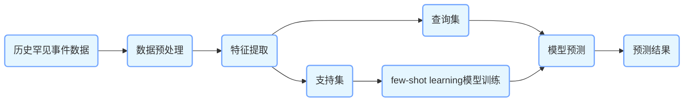

# 模型训练中的few-shot learning在罕见事件预测中的突破

> 关键词：few-shot learning、罕见事件预测、模型训练、小样本学习、机器学习

> 摘要：本文聚焦于模型训练中的few-shot learning（少样本学习）在罕见事件预测领域的应用与突破。首先介绍了研究的背景、目的、预期读者等信息，详细阐述了few-shot learning和罕见事件预测的核心概念及其联系，包括原理和架构的示意图与流程图。接着深入讲解了few-shot learning的核心算法原理，结合Python代码进行具体操作步骤的说明，还介绍了相关的数学模型和公式，并举例说明。通过项目实战，给出代码实际案例及详细解释。分析了few-shot learning在不同场景下的实际应用，推荐了学习、开发相关的工具和资源，包括书籍、在线课程、技术博客、开发工具框架、相关论文著作等。最后总结了few-shot learning在罕见事件预测中的未来发展趋势与挑战，还提供了常见问题解答和扩展阅读参考资料。

## 1. 背景介绍 
### 1.1 目的和范围
在现实世界中，许多重要的事件属于罕见事件，如自然灾害（地震、海啸等）、金融市场的极端波动、医疗领域的罕见疾病发作等。准确预测这些罕见事件对于减少损失、保障安全至关重要。然而，由于罕见事件发生的频率极低，能够收集到的相关数据样本非常有限。传统的机器学习方法通常需要大量的数据进行训练才能达到较好的效果，在处理小样本数据时表现不佳。few-shot learning作为一种新兴的机器学习技术，旨在解决在少量样本情况下进行有效学习和预测的问题。本文的目的是探讨few-shot learning在罕见事件预测中的应用和突破，研究其原理、算法、实际应用案例等，范围涵盖了few-shot learning的基本概念、核心算法、数学模型，以及在不同领域罕见事件预测中的具体应用。

### 1.2 预期读者
本文预期读者包括机器学习领域的研究人员、数据科学家、软件工程师、对人工智能和预测技术感兴趣的专业人士，以及相关专业的学生。对于希望了解如何利用有限数据进行准确预测，特别是在罕见事件预测方面有需求的读者，本文将提供有价值的信息和技术指导。

### 1.3 文档结构概述
本文将按照以下结构进行组织：首先介绍核心概念，包括few-shot learning和罕见事件预测的定义、原理及它们之间的联系，并通过示意图和流程图进行直观展示；接着详细讲解few-shot learning的核心算法原理和具体操作步骤，结合Python代码进行说明；阐述相关的数学模型和公式，并举例说明；通过项目实战给出代码实际案例和详细解释；分析few-shot learning在不同实际场景中的应用；推荐学习和开发所需的工具和资源；总结few-shot learning在罕见事件预测中的未来发展趋势与挑战；提供常见问题解答和扩展阅读参考资料。

### 1.4 术语表
#### 1.4.1 核心术语定义
- **few-shot learning（少样本学习）**：是一种机器学习范式，旨在从少量的标注样本中学习到有效的模型，使得模型能够对新的样本进行准确的分类或预测。
- **罕见事件预测**：对发生频率极低的事件进行提前预测，这些事件可能具有重大的影响，如自然灾害、金融市场的极端情况等。
- **元学习（meta-learning）**：也称为“学习如何学习”，是few-shot learning中常用的一种方法，通过在多个任务上进行训练，学习到通用的学习策略，以便在新的少样本任务中快速适应。

#### 1.4.2 相关概念解释
- **支持集（support set）**：在few-shot learning中，用于模型训练的少量标注样本集合。
- **查询集（query set）**：用于测试模型性能的样本集合，模型在支持集上学习后对查询集进行预测。
- **过拟合（overfitting）**：模型在训练数据上表现很好，但在新的数据上表现不佳的现象，在少样本学习中由于数据量有限，过拟合问题更为突出。

#### 1.4.3 缩略词列表
- **MAML（Model-Agnostic Meta-Learning）**：与模型无关的元学习算法。
- **Siamese Network（孪生网络）**：一种用于比较两个输入样本相似度的神经网络架构。

## 2. 核心概念与联系 
### 核心概念原理
#### few-shot learning原理
few-shot learning的核心思想是利用已有的知识和经验，在少量样本的情况下快速学习新的概念或任务。它通常基于元学习的方法，通过在多个相关任务上进行训练，学习到通用的学习策略和特征表示。例如，在图像分类任务中，模型可以先在大量的常见图像分类任务上进行元训练，学习到图像的通用特征提取方法和分类策略。当遇到一个新的少样本图像分类任务时，模型可以利用之前学习到的知识，在少量的标注样本上进行快速微调，从而实现对新任务的准确分类。

#### 罕见事件预测原理
罕见事件预测的原理是通过分析历史数据中的各种特征和模式，建立预测模型，以推断未来罕见事件发生的可能性。由于罕见事件的数据量稀少，传统的基于大量数据的预测方法往往难以奏效。因此，需要采用特殊的技术和方法，如few-shot learning，来处理小样本数据，挖掘数据中的潜在信息，提高预测的准确性。

### 架构示意图
以下是few-shot learning在罕见事件预测中的基本架构示意图：



### 架构说明
1. **数据预处理**：对历史罕见事件数据进行清洗、归一化等操作，以提高数据的质量和可用性。
2. **特征提取**：从预处理后的数据中提取有代表性的特征，用于后续的模型训练和预测。
3. **支持集和查询集划分**：将提取的特征数据划分为支持集和查询集，支持集用于模型训练，查询集用于测试模型性能。
4. **few-shot learning模型训练**：利用支持集对few-shot learning模型进行训练，学习到有效的特征表示和分类或预测策略。
5. **模型预测**：使用训练好的模型对查询集进行预测，得到预测结果。

## 3. 核心算法原理 & 具体操作步骤 
### 核心算法原理：MAML（Model-Agnostic Meta-Learning）
MAML是一种与模型无关的元学习算法，其核心思想是通过在多个任务上进行训练，找到一个通用的初始化参数，使得模型在新的少样本任务上能够快速收敛。具体来说，MAML的训练过程分为两个阶段：元训练和元测试。

#### 元训练阶段
在元训练阶段，模型从多个任务中随机采样一些任务，对于每个采样的任务，首先使用该任务的支持集对模型进行一次或多次梯度更新，得到一个临时的模型参数。然后，使用该任务的查询集计算临时模型的损失，并根据这个损失对原始模型的参数进行更新。通过多次迭代这个过程，模型学习到一个通用的初始化参数，使得在新的任务上能够快速适应。

#### 元测试阶段
在元测试阶段，对于一个新的少样本任务，使用训练好的通用初始化参数对模型进行初始化，然后使用该任务的支持集对模型进行少量的梯度更新，最后使用更新后的模型对查询集进行预测。

### Python代码实现MAML算法
```python
import torch
import torch.nn as nn
import torch.optim as optim

# 定义一个简单的神经网络模型
class SimpleNet(nn.Module):
    def __init__(self, input_size, hidden_size, output_size):
        super(SimpleNet, self).__init__()
        self.fc1 = nn.Linear(input_size, hidden_size)
        self.relu = nn.ReLU()
        self.fc2 = nn.Linear(hidden_size, output_size)

    def forward(self, x):
        out = self.fc1(x)
        out = self.relu(out)
        out = self.fc2(out)
        return out

# 定义MAML算法类
class MAML:
    def __init__(self, model, lr_inner, lr_outer, num_inner_steps):
        self.model = model
        self.lr_inner = lr_inner
        self.lr_outer = lr_outer
        self.num_inner_steps = num_inner_steps
        self.optimizer = optim.Adam(self.model.parameters(), lr=lr_outer)

    def inner_update(self, support_x, support_y):
        # 复制模型参数
        fast_weights = list(self.model.parameters())
        criterion = nn.CrossEntropyLoss()

        for _ in range(self.num_inner_steps):
            # 前向传播
            output = self.model(support_x)
            loss = criterion(output, support_y)

            # 计算梯度
            grads = torch.autograd.grad(loss, fast_weights)

            # 更新参数
            fast_weights = [w - self.lr_inner * g for w, g in zip(fast_weights, grads)]

        return fast_weights

    def meta_train(self, tasks):
        meta_loss = 0
        for task in tasks:
            support_x, support_y, query_x, query_y = task

            # 内循环更新
            fast_weights = self.inner_update(support_x, support_y)

            # 外循环计算损失
            criterion = nn.CrossEntropyLoss()
            output = self.model.forward(query_x)
            loss = criterion(output, query_y)
            meta_loss += loss

        # 外循环更新
        self.optimizer.zero_grad()
        meta_loss.backward()
        self.optimizer.step()

        return meta_loss.item()

    def meta_test(self, support_x, support_y, query_x):
        # 内循环更新
        fast_weights = self.inner_update(support_x, support_y)

        # 使用更新后的参数进行预测
        output = self.model.forward(query_x)
        return output
```

### 具体操作步骤
1. **数据准备**：收集历史罕见事件数据，并将其划分为多个任务，每个任务包含支持集和查询集。
2. **模型初始化**：初始化一个神经网络模型，如上述代码中的`SimpleNet`。
3. **MAML算法初始化**：创建一个`MAML`类的实例，设置内循环学习率`lr_inner`、外循环学习率`lr_outer`和内循环步数`num_inner_steps`。
4. **元训练**：调用`meta_train`方法，传入多个任务进行元训练，更新模型的通用初始化参数。
5. **元测试**：对于一个新的少样本任务，调用`meta_test`方法，传入该任务的支持集和查询集，得到预测结果。

## 4. 数学模型和公式 & 详细讲解 & 举例说明 
### 数学模型和公式
#### MAML的目标函数
MAML的目标是找到一个通用的初始化参数 $\theta$，使得在新的任务上能够快速适应。具体来说，对于一个任务 $T$，其支持集为 $S_T$，查询集为 $Q_T$，MAML的目标函数可以表示为：

$$
\min_{\theta} \sum_{T \in \mathcal{T}} \mathcal{L}_{Q_T} \left( f_{\theta'_T} \right)
$$

其中，$\mathcal{T}$ 是任务集合，$\theta'_T$ 是在任务 $T$ 的支持集 $S_T$ 上进行一次或多次梯度更新后得到的临时参数，$f_{\theta'_T}$ 是使用临时参数 $\theta'_T$ 的模型，$\mathcal{L}_{Q_T}$ 是在任务 $T$ 的查询集 $Q_T$ 上的损失函数。

#### 内循环参数更新公式
在任务 $T$ 的支持集 $S_T$ 上进行一次梯度更新的公式为：

$$
\theta'_T = \theta - \alpha \nabla_{\theta} \mathcal{L}_{S_T} \left( f_{\theta} \right)
$$

其中，$\alpha$ 是内循环学习率，$\nabla_{\theta} \mathcal{L}_{S_T} \left( f_{\theta} \right)$ 是在任务 $T$ 的支持集 $S_T$ 上对模型参数 $\theta$ 的梯度。

### 详细讲解
MAML的目标函数的意义是最小化所有任务的查询集上的损失之和。通过在多个任务上进行训练，模型学习到一个通用的初始化参数 $\theta$，使得在新的任务上，只需要在支持集上进行少量的梯度更新，就能够在查询集上取得较好的性能。

内循环参数更新公式是对模型参数进行一次梯度下降更新，目的是让模型在当前任务的支持集上快速适应。更新后的临时参数 $\theta'_T$ 用于计算查询集上的损失，从而更新原始的通用初始化参数 $\theta$。

### 举例说明
假设我们有一个二分类的罕见事件预测任务，每个样本有 10 个特征。我们使用一个包含 10 个隐藏单元的简单神经网络模型进行预测。

1. **数据准备**：我们有 10 个任务，每个任务的支持集有 5 个样本，查询集有 10 个样本。
2. **模型初始化**：初始化模型的参数 $\theta$。
3. **元训练**：对于每个任务 $T$，首先在支持集 $S_T$ 上进行一次梯度更新，得到临时参数 $\theta'_T$。然后，使用查询集 $Q_T$ 计算临时模型的损失 $\mathcal{L}_{Q_T} \left( f_{\theta'_T} \right)$。最后，根据所有任务的查询集损失之和更新原始的通用初始化参数 $\theta$。
4. **元测试**：对于一个新的少样本任务，使用训练好的通用初始化参数 $\theta$ 对模型进行初始化，然后在支持集上进行一次梯度更新，得到临时参数 $\theta'$。最后，使用更新后的模型对查询集进行预测。

## 5. 项目实战：代码实际案例和详细解释说明 
### 5.1  开发环境搭建
#### 安装Python和相关库
首先，确保你已经安装了Python 3.x版本。然后，使用以下命令安装所需的库：
```sh
pip install torch torchvision numpy matplotlib
```
#### 数据集准备
我们使用一个模拟的罕见事件预测数据集，该数据集包含 1000 个样本，每个样本有 10 个特征，分为 10 个任务，每个任务包含 100 个样本。将数据集划分为支持集和查询集，支持集包含 20 个样本，查询集包含 80 个样本。

### 5.2  源代码详细实现和代码解读
```python
import torch
import torch.nn as nn
import torch.optim as optim
import numpy as np

# 定义一个简单的神经网络模型
class SimpleNet(nn.Module):
    def __init__(self, input_size, hidden_size, output_size):
        super(SimpleNet, self).__init__()
        self.fc1 = nn.Linear(input_size, hidden_size)
        self.relu = nn.ReLU()
        self.fc2 = nn.Linear(hidden_size, output_size)

    def forward(self, x):
        out = self.fc1(x)
        out = self.relu(out)
        out = self.fc2(out)
        return out

# 定义MAML算法类
class MAML:
    def __init__(self, model, lr_inner, lr_outer, num_inner_steps):
        self.model = model
        self.lr_inner = lr_inner
        self.lr_outer = lr_outer
        self.num_inner_steps = num_inner_steps
        self.optimizer = optim.Adam(self.model.parameters(), lr=lr_outer)

    def inner_update(self, support_x, support_y):
        # 复制模型参数
        fast_weights = list(self.model.parameters())
        criterion = nn.CrossEntropyLoss()

        for _ in range(self.num_inner_steps):
            # 前向传播
            output = self.model(support_x)
            loss = criterion(output, support_y)

            # 计算梯度
            grads = torch.autograd.grad(loss, fast_weights)

            # 更新参数
            fast_weights = [w - self.lr_inner * g for w, g in zip(fast_weights, grads)]

        return fast_weights

    def meta_train(self, tasks):
        meta_loss = 0
        for task in tasks:
            support_x, support_y, query_x, query_y = task

            # 内循环更新
            fast_weights = self.inner_update(support_x, support_y)

            # 外循环计算损失
            criterion = nn.CrossEntropyLoss()
            output = self.model.forward(query_x)
            loss = criterion(output, query_y)
            meta_loss += loss

        # 外循环更新
        self.optimizer.zero_grad()
        meta_loss.backward()
        self.optimizer.step()

        return meta_loss.item()

    def meta_test(self, support_x, support_y, query_x):
        # 内循环更新
        fast_weights = self.inner_update(support_x, support_y)

        # 使用更新后的参数进行预测
        output = self.model.forward(query_x)
        return output

# 生成模拟数据集
def generate_dataset(num_tasks, num_samples_per_task, input_size, output_size):
    tasks = []
    for _ in range(num_tasks):
        # 生成支持集
        support_x = torch.randn(num_samples_per_task // 5, input_size)
        support_y = torch.randint(0, output_size, (num_samples_per_task // 5,))

        # 生成查询集
        query_x = torch.randn(num_samples_per_task - num_samples_per_task // 5, input_size)
        query_y = torch.randint(0, output_size, (num_samples_per_task - num_samples_per_task // 5,))

        tasks.append((support_x, support_y, query_x, query_y))

    return tasks

# 主函数
def main():
    # 定义模型参数
    input_size = 10
    hidden_size = 10
    output_size = 2
    lr_inner = 0.01
    lr_outer = 0.001
    num_inner_steps = 1
    num_epochs = 100
    num_tasks = 10
    num_samples_per_task = 100

    # 初始化模型
    model = SimpleNet(input_size, hidden_size, output_size)

    # 初始化MAML算法
    maml = MAML(model, lr_inner, lr_outer, num_inner_steps)

    # 生成数据集
    tasks = generate_dataset(num_tasks, num_samples_per_task, input_size, output_size)

    # 元训练
    for epoch in range(num_epochs):
        loss = maml.meta_train(tasks)
        print(f'Epoch {epoch+1}/{num_epochs}, Loss: {loss}')

    # 元测试
    support_x, support_y, query_x, query_y = tasks[0]
    output = maml.meta_test(support_x, support_y, query_x)
    predictions = torch.argmax(output, dim=1)
    accuracy = (predictions == query_y).float().mean().item()
    print(f'Test Accuracy: {accuracy}')

if __name__ == "__main__":
    main()
```

### 5.3  代码解读与分析
#### 模型定义
`SimpleNet` 类定义了一个简单的两层神经网络模型，包含一个输入层、一个隐藏层和一个输出层。

#### MAML算法类
`MAML` 类实现了MAML算法的核心逻辑，包括内循环更新和外循环更新。`inner_update` 方法在支持集上进行一次或多次梯度更新，得到临时参数；`meta_train` 方法在多个任务上进行元训练，更新模型的通用初始化参数；`meta_test` 方法在新的少样本任务上进行预测。

#### 数据集生成
`generate_dataset` 函数生成模拟的数据集，将每个任务的样本划分为支持集和查询集。

#### 主函数
`main` 函数完成了模型的初始化、数据集的生成、元训练和元测试的整个流程。在元训练阶段，模型在多个任务上进行训练，不断更新通用初始化参数；在元测试阶段，模型在一个新的少样本任务上进行预测，并计算预测的准确率。

## 6. 实际应用场景 
### 自然灾害预测
在自然灾害预测领域，如地震、海啸等事件发生的频率极低，能够收集到的相关数据非常有限。few-shot learning可以利用历史上少量的灾害数据进行学习，提取灾害发生前的特征和模式，从而在新的情况下对灾害的发生进行预测。例如，通过分析地震发生前的地质活动、地下水位变化等少量数据，训练few-shot learning模型，当出现类似的特征时，模型可以预测地震发生的可能性。

### 金融市场极端波动预测
金融市场的极端波动，如股市暴跌、汇率大幅波动等，属于罕见事件。传统的金融预测模型往往无法准确预测这些极端情况，因为它们基于大量的正常市场数据进行训练。few-shot learning可以通过分析历史上的少量极端波动数据，学习到市场在极端情况下的特征和变化规律，从而提前预测市场的极端波动，帮助投资者做出决策。

### 医疗领域罕见疾病诊断
在医疗领域，一些罕见疾病的发病率极低，医生能够接触到的病例非常有限。few-shot learning可以利用已有的少量罕见疾病病例数据，学习到疾病的特征和诊断规则。当遇到新的疑似罕见疾病患者时，模型可以根据患者的症状和检查结果进行快速诊断，提高诊断的准确性和效率。

### 工业设备故障预测
工业设备的某些故障可能是罕见事件，例如大型机械设备的关键部件突然损坏。由于这些故障发生的频率较低，能够收集到的故障数据有限。few-shot learning可以通过分析设备的历史运行数据和少量的故障数据，学习到设备故障的特征和预警信号。当设备出现异常情况时，模型可以及时预测故障的发生，以便进行预防性维护。

## 7. 工具和资源推荐
### 7.1 学习资源推荐
#### 7.1.1 书籍推荐
- 《深度学习》（Deep Learning）：由Ian Goodfellow、Yoshua Bengio和Aaron Courville所著，是深度学习领域的经典教材，涵盖了深度学习的基本原理、算法和应用，对于理解few-shot learning的基础理论有很大帮助。
- 《机器学习》（Machine Learning: A Probabilistic Perspective）：作者是Kevin P. Murphy，本书从概率的角度介绍了机器学习的各种算法和模型，有助于深入理解few-shot learning中的概率模型和推理方法。
- 《元学习：原理与应用》（Meta-Learning: Principles and Applications）：专门介绍元学习的书籍，详细讲解了few-shot learning中常用的元学习算法和技术。

#### 7.1.2 在线课程
- Coursera上的“深度学习专项课程”（Deep Learning Specialization）：由Andrew Ng教授授课，涵盖了深度学习的各个方面，包括卷积神经网络、循环神经网络等，对于掌握few-shot learning所需的深度学习基础非常有帮助。
- edX上的“机器学习基础”（Foundations of Machine Learning）：提供了机器学习的基本概念、算法和实践，为学习few-shot learning打下坚实的基础。
- 斯坦福大学的“CS231n: Convolutional Neural Networks for Visual Recognition”：主要讲解卷积神经网络在图像识别中的应用，其中涉及到的一些技术和方法可以应用于few-shot learning的图像分类任务。

#### 7.1.3 技术博客和网站
- Medium上的“Towards Data Science”：汇集了大量关于数据科学、机器学习和人工智能的文章，其中有很多关于few-shot learning的最新研究成果和实践经验分享。
- arXiv.org：一个预印本平台，提供了大量的学术论文，包括few-shot learning领域的最新研究进展。
- GitHub上的相关项目：可以搜索到很多few-shot learning的开源代码和项目，通过阅读和实践这些代码，能够更好地理解和应用few-shot learning技术。

### 7.2 开发工具框架推荐
#### 7.2.1 IDE和编辑器
- PyCharm：是一款专业的Python集成开发环境，提供了丰富的代码编辑、调试和分析功能，适合开发基于Python的few-shot learning项目。
- Jupyter Notebook：一种交互式的开发环境，支持代码、文本、图像等多种元素的混合展示，非常适合进行数据探索、模型实验和结果可视化，在few-shot learning的研究和开发中经常使用。
- Visual Studio Code：一款轻量级的代码编辑器，具有丰富的插件生态系统，可以安装Python相关的插件，提供良好的代码编辑体验。

#### 7.2.2 调试和性能分析工具
- PyTorch Profiler：PyTorch提供的性能分析工具，可以帮助开发者分析模型的训练和推理过程中的性能瓶颈，优化代码的运行效率。
- TensorBoard：是TensorFlow提供的可视化工具，也可以与PyTorch结合使用，用于可视化模型的训练过程、损失曲线、准确率等指标，方便开发者监控模型的性能。
- cProfile：Python标准库中的性能分析工具，可以帮助开发者找出代码中的性能瓶颈，优化代码的执行速度。

#### 7.2.3 相关框架和库
- PyTorch：一个开源的深度学习框架，提供了丰富的神经网络层和优化算法，支持GPU加速，在few-shot learning的研究和开发中被广泛使用。
- TensorFlow：另一个流行的深度学习框架，具有强大的分布式训练和部署能力，也可以用于few-shot learning项目的开发。
- scikit-learn：一个简单易用的机器学习库，提供了各种机器学习算法和工具，如数据预处理、模型选择、评估等，在few-shot learning的前期数据处理和模型评估中非常有用。

### 7.3 相关论文著作推荐
#### 7.3.1 经典论文
- “Model-Agnostic Meta-Learning for Fast Adaptation of Deep Networks”：介绍了MAML算法，是few-shot learning领域的经典论文，提出了一种与模型无关的元学习方法，能够在少样本情况下快速适应新的任务。
- “Siamese Neural Networks for One-shot Image Recognition”：提出了孪生网络（Siamese Network）用于一次性图像识别，通过比较两个输入样本的相似度来进行分类，为few-shot learning的图像分类任务提供了一种有效的方法。
- “Matching Networks for One Shot Learning”：介绍了匹配网络（Matching Networks），通过学习样本之间的相似度来进行少样本学习，在图像分类和自然语言处理等任务中取得了较好的效果。

#### 7.3.2 最新研究成果
- 关注arXiv.org上关于few-shot learning的最新论文，了解该领域的最新研究进展，如新型的元学习算法、改进的少样本学习模型等。
- 参加机器学习和人工智能领域的顶级学术会议，如NeurIPS、ICML、CVPR等，会议上会有很多关于few-shot learning的最新研究成果发表。

#### 7.3.3 应用案例分析
- 一些知名的科技公司和研究机构会发布关于few-shot learning在实际应用中的案例分析报告，如Google、Facebook、OpenAI等。这些案例分析可以帮助我们了解few-shot learning在不同领域的实际应用效果和挑战。

## 8. 总结：未来发展趋势与挑战
### 未来发展趋势
#### 算法创新
未来，few-shot learning领域将不断涌现新的算法和技术。研究人员将继续探索更加高效、准确的元学习算法，提高模型在少样本情况下的学习能力和泛化性能。例如，结合强化学习和元学习的方法，让模型能够在动态环境中快速学习和适应。

#### 多模态融合
随着数据类型的不断丰富，few-shot learning将越来越多地应用于多模态数据的处理，如图像、文本、音频等。通过融合不同模态的数据，模型可以获取更全面的信息，提高罕见事件预测的准确性。例如，在医疗领域，结合患者的病历文本、影像图像和生命体征数据进行罕见疾病的诊断。

#### 跨领域应用拓展
few-shot learning在罕见事件预测中的应用将不断拓展到更多的领域，如交通运输、能源管理、环境保护等。通过解决不同领域中的少样本学习问题，为各行业提供更精准的预测和决策支持。

### 挑战
#### 数据质量和多样性
由于罕见事件数据量有限，数据的质量和多样性成为影响few-shot learning性能的关键因素。数据中的噪声、缺失值等问题可能导致模型学习到错误的特征和模式，而数据的多样性不足可能使模型的泛化能力受限。因此，如何提高数据的质量和多样性是一个亟待解决的问题。

#### 模型可解释性
few-shot learning模型通常是基于深度学习的复杂模型，其决策过程往往难以解释。在一些关键领域，如医疗和金融，模型的可解释性至关重要。如何提高few-shot learning模型的可解释性，让用户能够理解模型的决策依据，是一个需要克服的挑战。

#### 计算资源需求
一些先进的few-shot learning算法需要大量的计算资源进行训练和推理，这对于硬件设备和计算成本提出了较高的要求。如何在有限的计算资源下实现高效的少样本学习，是未来需要解决的问题之一。

## 9. 附录：常见问题与解答
### 问题1：few-shot learning和传统机器学习方法有什么区别？
传统机器学习方法通常需要大量的标注数据进行训练，才能学习到数据中的模式和规律，从而对新的数据进行准确的预测。而few-shot learning旨在从少量的标注样本中学习到有效的模型，通过利用元学习等技术，让模型能够快速适应新的少样本任务。在数据量有限的情况下，few-shot learning具有明显的优势。

### 问题2：few-shot learning在罕见事件预测中的准确率如何？
few-shot learning在罕见事件预测中的准确率受到多种因素的影响，如数据的质量和多样性、模型的选择和参数设置、算法的性能等。在一些实际应用中，few-shot learning已经取得了较好的效果，但与传统的基于大量数据的预测方法相比，其准确率可能会受到一定的限制。通过不断优化算法和模型，提高数据的质量和多样性，可以进一步提高few-shot learning在罕见事件预测中的准确率。

### 问题3：如何选择合适的few-shot learning算法？
选择合适的few-shot learning算法需要考虑多个因素，如任务的类型（分类、回归等）、数据的特点（数据量、维度等）、计算资源的限制等。一般来说，可以先尝试一些经典的算法，如MAML、Siamese Network等，然后根据实验结果进行调整和优化。此外，还可以参考相关的学术论文和开源项目，了解不同算法在不同任务上的性能表现。

### 问题4：few-shot learning模型的训练时间长吗？
few-shot learning模型的训练时间取决于多个因素，如模型的复杂度、数据的规模、算法的效率等。一些简单的few-shot learning模型在少量数据上的训练时间可能较短，但对于复杂的模型和大规模的数据，训练时间可能会较长。可以通过优化算法、使用GPU加速等方法来缩短训练时间。

## 10. 扩展阅读 & 参考资料
### 扩展阅读
- 阅读更多关于元学习和少样本学习的学术论文，深入了解该领域的最新研究成果和技术发展趋势。
- 关注一些知名的科技博客和论坛，如Kaggle、Stack Overflow等，了解其他开发者在few-shot learning领域的实践经验和问题解决方案。
- 参与相关的开源项目，通过实践来提高自己的技能和理解。

### 参考资料
- Goodfellow, I., Bengio, Y., & Courville, A. (2016). Deep Learning. MIT Press.
- Murphy, K. P. (2012). Machine Learning: A Probabilistic Perspective. MIT Press.
- Finn, C., Abbeel, P., & Levine, S. (2017). Model-Agnostic Meta-Learning for Fast Adaptation of Deep Networks. Proceedings of the 34th International Conference on Machine Learning-Volume 70.
- Koch, G., Zemel, R., & Salakhutdinov, R. (2015). Siamese Neural Networks for One-shot Image Recognition. ICML Deep Learning Workshop.
- Vinyals, O., Blundell, C., Lillicrap, T., kavukcuoglu, K., & Wierstra, D. (2016). Matching Networks for One Shot Learning. Advances in Neural Information Processing Systems.

作者：AI天才研究院/AI Genius Institute & 禅与计算机程序设计艺术 /Zen And The Art of Computer Programming