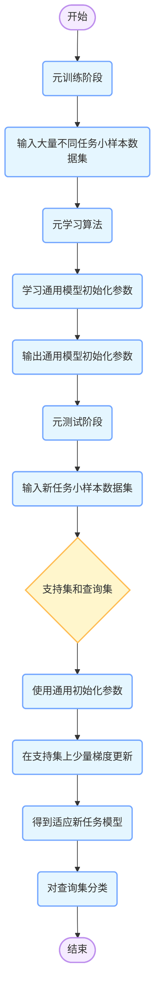

# 模型训练中的few-shot learning在罕见事件预警中的突破性应用

> 关键词：Few-shot learning、模型训练、罕见事件预警、小样本学习、机器学习应用

> 摘要：本文聚焦于模型训练中的Few-shot learning（小样本学习）在罕见事件预警领域的突破性应用。首先介绍了研究背景，包括目的、预期读者等内容。接着阐述了Few-shot learning的核心概念与联系，给出原理和架构示意图。详细讲解了核心算法原理及具体操作步骤，运用Python代码进行了阐述，并给出相关数学模型和公式。通过项目实战展示了代码实现和解读。探讨了其在实际场景中的应用，推荐了相关学习资源、开发工具和论文著作。最后总结了未来发展趋势与挑战，解答常见问题并提供扩展阅读和参考资料，旨在为该领域的研究和应用提供全面的技术指导。

## 1. 背景介绍 
### 1.1 目的和范围
在许多实际应用场景中，罕见事件的预警至关重要，如自然灾害预警、金融市场的极端风险预警、医疗领域的罕见疾病预测等。然而，由于罕见事件发生的频率极低，可用于模型训练的数据样本非常有限。传统的机器学习方法通常需要大量的数据来进行有效的模型训练，在小样本数据情况下，这些方法往往表现不佳。Few-shot learning作为一种新兴的机器学习技术，旨在解决在仅有少量标注样本的情况下进行有效学习和分类的问题。本文的目的是深入探讨Few-shot learning在罕见事件预警中的应用，研究其原理、算法和实际应用效果，为相关领域的研究和实践提供理论支持和技术指导。范围涵盖了Few-shot learning的基本概念、核心算法、数学模型，以及在不同罕见事件预警场景中的应用案例分析。

### 1.2 预期读者
本文预期读者包括从事机器学习、人工智能、数据分析等领域的研究人员和工程师，对罕见事件预警技术感兴趣的专业人士，以及相关领域的研究生和高年级本科生。对于希望了解小样本学习技术在实际应用中的原理和方法，以及如何将其应用于罕见事件预警的读者具有较高的参考价值。

### 1.3 文档结构概述
本文将按照以下结构进行组织：首先介绍Few-shot learning的背景知识，包括目的、预期读者和文档结构概述等内容；接着详细阐述Few-shot learning的核心概念与联系，给出原理和架构示意图；然后讲解核心算法原理及具体操作步骤，并运用Python代码进行详细说明；随后介绍相关的数学模型和公式，并通过举例进行详细讲解；通过项目实战展示代码实现和解读；探讨Few-shot learning在实际场景中的应用；推荐相关的学习资源、开发工具和论文著作；最后总结未来发展趋势与挑战，解答常见问题并提供扩展阅读和参考资料。

### 1.4 术语表
#### 1.4.1 核心术语定义
- **Few-shot learning**：小样本学习，是一种机器学习技术，旨在利用少量标注样本进行有效的模型训练和分类。
- **罕见事件**：指发生频率极低的事件，如地震、海啸、金融市场的极端波动等。
- **预警**：提前发现潜在的风险或事件，并发出相应的信号。
- **元学习（Meta-learning）**：一种学习如何学习的方法，旨在快速适应新的任务和数据，是Few-shot learning的重要基础。
- **支持集（Support set）**：在Few-shot learning中，用于模型训练的少量标注样本集合。
- **查询集（Query set）**：用于测试模型性能的样本集合。

#### 1.4.2 相关概念解释
- **小样本问题**：在机器学习中，由于数据获取成本高、事件发生频率低等原因，导致可用于训练的样本数量非常有限，传统的机器学习方法在这种情况下难以取得良好的效果。
- **迁移学习**：将在一个任务上学习到的知识迁移到另一个相关任务上，以提高模型在新任务上的性能。Few-shot learning可以看作是迁移学习的一种特殊情况，在小样本数据上进行知识迁移。
- **度量学习**：通过学习样本之间的距离度量，来判断样本之间的相似性，常用于Few-shot learning中的分类任务。

#### 1.4.3 缩略词列表
- **CNN**：Convolutional Neural Network，卷积神经网络
- **RNN**：Recurrent Neural Network，循环神经网络
- **LSTM**：Long Short-Term Memory，长短期记忆网络
- **MAML**：Model-Agnostic Meta-Learning，模型无关元学习
- **Siamese Network**：孪生网络

## 2. 核心概念与联系 
### 核心概念原理
Few-shot learning的核心思想是利用少量标注样本进行有效的模型训练和分类。传统的机器学习方法通常需要大量的数据来学习样本的特征和模式，而Few-shot learning则通过元学习的方法，学习如何在小样本数据上快速适应新的任务。元学习的目标是学习一个通用的模型初始化参数，使得模型在面对新的任务时，能够通过少量的梯度更新快速收敛到最优解。

Few-shot learning通常采用“N-way K-shot”的任务设置，其中“N-way”表示分类任务的类别数，“K-shot”表示每个类别可用的标注样本数。例如，一个5-way 1-shot的任务表示需要对5个类别进行分类，每个类别只有1个标注样本。

### 架构的文本示意图
以下是Few-shot learning的基本架构示意图：

1. **元训练阶段**：
    - 输入：大量的不同任务的小样本数据集。
    - 过程：通过元学习算法，学习一个通用的模型初始化参数。
    - 输出：通用的模型初始化参数。

2. **元测试阶段**：
    - 输入：新的任务的小样本数据集（支持集和查询集）。
    - 过程：使用通用的模型初始化参数，在支持集上进行少量的梯度更新，得到适应新任务的模型。
    - 输出：对查询集进行分类的结果。

### Mermaid 流程图


## 3. 核心算法原理 & 具体操作步骤 
### 核心算法原理
#### 模型无关元学习（MAML）
MAML是一种经典的Few-shot learning算法，其核心思想是学习一个通用的模型初始化参数，使得模型在面对新的任务时，能够通过少量的梯度更新快速收敛到最优解。

具体来说，MAML的训练过程分为两个步骤：

1. **内部循环**：在每个任务的支持集上进行少量的梯度更新，得到适应该任务的模型参数。
2. **外部循环**：在所有任务的查询集上计算损失函数，并根据损失函数对通用的模型初始化参数进行更新。

#### 孪生网络（Siamese Network）
孪生网络是一种基于度量学习的Few-shot learning算法，其核心思想是学习样本之间的距离度量，通过比较样本之间的距离来判断它们是否属于同一类别。

孪生网络由两个共享参数的子网络组成，输入两个样本，分别通过子网络得到它们的特征向量，然后计算特征向量之间的距离。在训练过程中，通过最小化同一类样本之间的距离，最大化不同类样本之间的距离，来学习有效的距离度量。

### 具体操作步骤
#### MAML的操作步骤
1. **初始化模型参数 $\theta$**：随机初始化一个通用的模型参数。
2. **元训练阶段**：
    - 从任务分布中采样一个任务 $T$。
    - 将任务 $T$ 的支持集 $S$ 划分为 $n$ 个小批量。
    - 对于每个小批量：
        - 在支持集上进行一次梯度更新，得到临时参数 $\theta'$：
            - 计算支持集上的损失函数 $L(S;\theta)$。
            - 根据损失函数计算梯度 $\nabla_{\theta}L(S;\theta)$。
            - 更新临时参数 $\theta' = \theta - \alpha\nabla_{\theta}L(S;\theta)$，其中 $\alpha$ 是内部循环的学习率。
        - 在任务 $T$ 的查询集 $Q$ 上计算损失函数 $L(Q;\theta')$。
    - 根据所有任务的查询集上的损失函数更新通用的模型参数 $\theta$：
        - 计算所有任务的查询集上的损失函数的平均值 $\bar{L}$。
        - 根据损失函数的平均值计算梯度 $\nabla_{\theta}\bar{L}$。
        - 更新通用的模型参数 $\theta = \theta - \beta\nabla_{\theta}\bar{L}$，其中 $\beta$ 是外部循环的学习率。
3. **元测试阶段**：
    - 给定一个新的任务 $T_{new}$ 的支持集 $S_{new}$ 和查询集 $Q_{new}$。
    - 使用通用的模型参数 $\theta$，在支持集 $S_{new}$ 上进行少量的梯度更新，得到适应新任务的模型参数 $\theta_{new}$。
    - 使用适应新任务的模型参数 $\theta_{new}$ 对查询集 $Q_{new}$ 进行分类。

#### Siamese Network的操作步骤
1. **初始化孪生网络的参数**：随机初始化孪生网络的参数。
2. **训练阶段**：
    - 从训练数据集中采样一对样本 $(x_1, x_2)$，并标记它们是否属于同一类别 $y$。
    - 将样本 $x_1$ 和 $x_2$ 分别输入到孪生网络的两个子网络中，得到它们的特征向量 $f(x_1)$ 和 $f(x_2)$。
    - 计算特征向量之间的距离 $d = ||f(x_1) - f(x_2)||$。
    - 根据标记 $y$ 计算损失函数 $L$，例如使用对比损失函数：
        - 当 $y = 1$ 时，$L = \frac{1}{2}(d)^2$。
        - 当 $y = 0$ 时，$L = \frac{1}{2}(\max(0, m - d))^2$，其中 $m$ 是一个正的边界值。
    - 根据损失函数更新孪生网络的参数。
3. **测试阶段**：
    - 给定一个新的任务的支持集和查询集。
    - 对于查询集中的每个样本 $x_q$，计算它与支持集中每个样本的距离。
    - 根据距离判断查询样本所属的类别。

### Python源代码实现
#### MAML的Python代码实现
```python
import torch
import torch.nn as nn
import torch.optim as optim

# 定义一个简单的神经网络模型
class SimpleNet(nn.Module):
    def __init__(self, input_size, hidden_size, output_size):
        super(SimpleNet, self).__init__()
        self.fc1 = nn.Linear(input_size, hidden_size)
        self.relu = nn.ReLU()
        self.fc2 = nn.Linear(hidden_size, output_size)

    def forward(self, x):
        out = self.fc1(x)
        out = self.relu(out)
        out = self.fc2(out)
        return out

# MAML算法实现
def maml(model, tasks, inner_lr, outer_lr, num_inner_steps, num_outer_steps):
    optimizer = optim.Adam(model.parameters(), lr=outer_lr)
    for outer_step in range(num_outer_steps):
        meta_loss = 0
        for task in tasks:
            support_set, query_set = task
            # 内部循环
            fast_weights = list(model.parameters())
            for inner_step in range(num_inner_steps):
                support_inputs, support_labels = support_set
                support_outputs = model(support_inputs)
                support_loss = nn.CrossEntropyLoss()(support_outputs, support_labels)
                grads = torch.autograd.grad(support_loss, fast_weights)
                fast_weights = [w - inner_lr * g for w, g in zip(fast_weights, grads)]
            # 外部循环
            query_inputs, query_labels = query_set
            query_outputs = model(query_inputs)
            query_loss = nn.CrossEntropyLoss()(query_outputs, query_labels)
            meta_loss += query_loss
        meta_loss /= len(tasks)
        optimizer.zero_grad()
        meta_loss.backward()
        optimizer.step()
    return model

# 示例使用
input_size = 10
hidden_size = 20
output_size = 5
model = SimpleNet(input_size, hidden_size, output_size)
tasks = []  # 这里需要填充具体的任务数据
inner_lr = 0.01
outer_lr = 0.001
num_inner_steps = 5
num_outer_steps = 100
trained_model = maml(model, tasks, inner_lr, outer_lr, num_inner_steps, num_outer_steps)
```

#### Siamese Network的Python代码实现
```python
import torch
import torch.nn as nn
import torch.optim as optim

# 定义孪生网络的子网络
class SiameseSubNet(nn.Module):
    def __init__(self, input_size, hidden_size):
        super(SiameseSubNet, self).__init__()
        self.fc1 = nn.Linear(input_size, hidden_size)
        self.relu = nn.ReLU()
        self.fc2 = nn.Linear(hidden_size, hidden_size)

    def forward(self, x):
        out = self.fc1(x)
        out = self.relu(out)
        out = self.fc2(out)
        return out

# 定义孪生网络
class SiameseNetwork(nn.Module):
    def __init__(self, input_size, hidden_size):
        super(SiameseNetwork, self).__init__()
        self.sub_net = SiameseSubNet(input_size, hidden_size)

    def forward_once(self, x):
        return self.sub_net(x)

    def forward(self, input1, input2):
        output1 = self.forward_once(input1)
        output2 = self.forward_once(input2)
        return output1, output2

# 定义对比损失函数
class ContrastiveLoss(nn.Module):
    def __init__(self, margin=2.0):
        super(ContrastiveLoss, self).__init__()
        self.margin = margin

    def forward(self, output1, output2, label):
        euclidean_distance = nn.functional.pairwise_distance(output1, output2)
        loss_contrastive = torch.mean((1 - label) * torch.pow(euclidean_distance, 2) +
                                      label * torch.pow(torch.clamp(self.margin - euclidean_distance, min=0.0), 2))
        return loss_contrastive

# 训练孪生网络
def train_siamese_network(model, train_loader, criterion, optimizer, num_epochs):
    for epoch in range(num_epochs):
        running_loss = 0.0
        for i, (input1, input2, label) in enumerate(train_loader):
            optimizer.zero_grad()
            output1, output2 = model(input1, input2)
            loss = criterion(output1, output2, label)
            loss.backward()
            optimizer.step()
            running_loss += loss.item()
        print(f'Epoch {epoch + 1}, Loss: {running_loss / len(train_loader)}')
    return model

# 示例使用
input_size = 10
hidden_size = 20
model = SiameseNetwork(input_size, hidden_size)
criterion = ContrastiveLoss()
optimizer = optim.Adam(model.parameters(), lr=0.001)
train_loader = []  # 这里需要填充具体的训练数据
num_epochs = 100
trained_model = train_siamese_network(model, train_loader, criterion, optimizer, num_epochs)
```

## 4. 数学模型和公式 & 详细讲解 & 举例说明 
### MAML的数学模型和公式
#### 内部循环
在内部循环中，对于一个任务 $T$ 的支持集 $S$，模型的参数更新公式为：
$$\theta' = \theta - \alpha\nabla_{\theta}L(S;\theta)$$
其中，$\theta$ 是通用的模型参数，$\alpha$ 是内部循环的学习率，$L(S;\theta)$ 是支持集上的损失函数。

#### 外部循环
在外部循环中，对于所有任务的查询集，需要计算损失函数的平均值，并根据平均值更新通用的模型参数：
$$\bar{L} = \frac{1}{N}\sum_{i = 1}^{N}L(Q_i;\theta_i')$$
$$\theta = \theta - \beta\nabla_{\theta}\bar{L}$$
其中，$N$ 是任务的数量，$Q_i$ 是第 $i$ 个任务的查询集，$\theta_i'$ 是第 $i$ 个任务在内部循环中得到的临时参数，$\beta$ 是外部循环的学习率。

### 举例说明
假设我们有一个简单的分类任务，输入数据是二维向量，输出是3个类别。模型是一个简单的全连接神经网络，有一个隐藏层，包含10个神经元。

在内部循环中，对于一个任务的支持集，我们可以计算支持集上的损失函数：
$$L(S;\theta) = \frac{1}{|S|}\sum_{(x, y) \in S}CrossEntropy(f(x;\theta), y)$$
其中，$|S|$ 是支持集的样本数量，$f(x;\theta)$ 是模型在参数 $\theta$ 下对输入 $x$ 的输出，$y$ 是真实标签。

根据损失函数计算梯度：
$$\nabla_{\theta}L(S;\theta) = \frac{\partial L(S;\theta)}{\partial \theta}$$
然后更新临时参数：
$$\theta' = \theta - \alpha\nabla_{\theta}L(S;\theta)$$

在外部循环中，对于所有任务的查询集，计算损失函数的平均值：
$$\bar{L} = \frac{1}{N}\sum_{i = 1}^{N}L(Q_i;\theta_i')$$
其中，$L(Q_i;\theta_i')$ 是第 $i$ 个任务的查询集上的损失函数。

根据平均值计算梯度：
$$\nabla_{\theta}\bar{L} = \frac{\partial \bar{L}}{\partial \theta}$$
最后更新通用的模型参数：
$$\theta = \theta - \beta\nabla_{\theta}\bar{L}$$

### Siamese Network的数学模型和公式
#### 特征提取
孪生网络通过两个共享参数的子网络对输入样本进行特征提取：
$$f(x_1) = \text{SiameseSubNet}(x_1)$$
$$f(x_2) = \text{SiameseSubNet}(x_2)$$
其中，$x_1$ 和 $x_2$ 是输入样本，$f(x_1)$ 和 $f(x_2)$ 是它们的特征向量。

#### 距离计算
计算特征向量之间的欧几里得距离：
$$d = ||f(x_1) - f(x_2)|| = \sqrt{\sum_{i = 1}^{n}(f(x_1)_i - f(x_2)_i)^2}$$
其中，$n$ 是特征向量的维度。

#### 对比损失函数
对比损失函数的定义如下：
$$L = (1 - y)\frac{1}{2}(d)^2 + y\frac{1}{2}(\max(0, m - d))^2$$
其中，$y$ 是样本对的标签，$y = 1$ 表示样本对属于同一类别，$y = 0$ 表示样本对属于不同类别，$m$ 是一个正的边界值。

### 举例说明
假设我们有两个输入样本 $x_1 = [1, 2]$ 和 $x_2 = [3, 4]$，经过孪生网络的子网络得到它们的特征向量 $f(x_1) = [0.1, 0.2]$ 和 $f(x_2) = [0.3, 0.4]$。

计算特征向量之间的欧几里得距离：
$$d = \sqrt{(0.1 - 0.3)^2 + (0.2 - 0.4)^2} = \sqrt{0.04 + 0.04} = \sqrt{0.08} \approx 0.283$$

假设 $y = 0$，$m = 1$，则对比损失函数的值为：
$$L = \frac{1}{2}(0.283)^2 \approx 0.04$$

## 5. 项目实战：代码实际案例和详细解释说明 
### 5.1  开发环境搭建
#### 操作系统
可以选择Windows、Linux或macOS操作系统。建议使用Linux系统，如Ubuntu 18.04及以上版本，因为Linux系统在开发和部署机器学习项目方面具有更好的稳定性和兼容性。

#### Python环境
安装Python 3.7及以上版本。可以使用Anaconda来管理Python环境，具体步骤如下：
1. 从Anaconda官方网站（https://www.anaconda.com/products/individual）下载适合自己操作系统的Anaconda安装包。
2. 运行安装包，按照提示进行安装。
3. 创建一个新的Python环境：
```bash
conda create -n few_shot_learning python=3.8
conda activate few_shot_learning
```

#### 依赖库安装
安装所需的Python依赖库，包括PyTorch、NumPy、Matplotlib等：
```bash
pip install torch torchvision numpy matplotlib
```

### 5.2  源代码详细实现和代码解读
#### 数据准备
假设我们使用一个简单的手写数字数据集（MNIST）来演示Few-shot learning的应用。我们将数据集划分为支持集和查询集。

```python
import torch
import torchvision
import torchvision.transforms as transforms

# 定义数据预处理
transform = transforms.Compose([
    transforms.ToTensor(),
    transforms.Normalize((0.5,), (0.5,))
])

# 加载MNIST数据集
trainset = torchvision.datasets.MNIST(root='./data', train=True,
                                      download=True, transform=transform)
testset = torchvision.datasets.MNIST(root='./data', train=False,
                                     download=True, transform=transform)

# 定义N-way K-shot任务
N = 5  # 类别数
K = 1  # 每个类别样本数
query_num = 10  # 查询集样本数

# 随机选择N个类别
import random
classes = random.sample(range(10), N)

# 构建支持集和查询集
support_set = []
query_set = []
for c in classes:
    class_indices = [i for i, (x, y) in enumerate(trainset) if y == c]
    support_indices = random.sample(class_indices, K)
    query_indices = [i for i in class_indices if i not in support_indices]
    query_indices = random.sample(query_indices, query_num)
    for idx in support_indices:
        support_set.append(trainset[idx])
    for idx in query_indices:
        query_set.append(trainset[idx])

# 将支持集和查询集转换为张量
support_images = torch.stack([x for x, _ in support_set])
support_labels = torch.tensor([y for _, y in support_set])
query_images = torch.stack([x for x, _ in query_set])
query_labels = torch.tensor([y for _, y in query_set])
```

#### 使用MAML进行模型训练
```python
import torch.nn as nn
import torch.optim as optim

# 定义一个简单的卷积神经网络模型
class SimpleCNN(nn.Module):
    def __init__(self):
        super(SimpleCNN, self).__init__()
        self.conv1 = nn.Conv2d(1, 16, kernel_size=3, padding=1)
        self.relu = nn.ReLU()
        self.pool = nn.MaxPool2d(2, 2)
        self.conv2 = nn.Conv2d(16, 32, kernel_size=3, padding=1)
        self.fc1 = nn.Linear(32 * 7 * 7, 128)
        self.fc2 = nn.Linear(128, N)

    def forward(self, x):
        x = self.pool(self.relu(self.conv1(x)))
        x = self.pool(self.relu(self.conv2(x)))
        x = x.view(-1, 32 * 7 * 7)
        x = self.relu(self.fc1(x))
        x = self.fc2(x)
        return x

# 初始化模型
model = SimpleCNN()

# 定义MAML算法参数
inner_lr = 0.01
outer_lr = 0.001
num_inner_steps = 5
num_outer_steps = 100

# 定义优化器
optimizer = optim.Adam(model.parameters(), lr=outer_lr)

# MAML训练过程
for outer_step in range(num_outer_steps):
    # 内部循环
    fast_weights = list(model.parameters())
    for inner_step in range(num_inner_steps):
        support_outputs = model(support_images)
        support_loss = nn.CrossEntropyLoss()(support_outputs, support_labels)
        grads = torch.autograd.grad(support_loss, fast_weights)
        fast_weights = [w - inner_lr * g for w, g in zip(fast_weights, grads)]

    # 外部循环
    query_outputs = model(query_images)
    query_loss = nn.CrossEntropyLoss()(query_outputs, query_labels)
    optimizer.zero_grad()
    query_loss.backward()
    optimizer.step()

    if (outer_step + 1) % 10 == 0:
        print(f'Epoch {outer_step + 1}, Loss: {query_loss.item()}')
```

### 5.3  代码解读与分析
#### 数据准备部分
- 首先，我们使用`torchvision`库加载MNIST数据集，并进行数据预处理，将图像转换为张量并进行归一化处理。
- 然后，我们随机选择`N`个类别，并为每个类别选择`K`个样本作为支持集，选择`query_num`个样本作为查询集。
- 最后，将支持集和查询集的图像和标签分别转换为张量。

#### MAML训练部分
- 我们定义了一个简单的卷积神经网络模型`SimpleCNN`，用于对MNIST图像进行分类。
- 在MAML训练过程中，分为内部循环和外部循环。
    - 内部循环：在支持集上进行少量的梯度更新，得到临时参数`fast_weights`。
    - 外部循环：在查询集上计算损失函数，并根据损失函数更新通用的模型参数。
- 每10个epoch打印一次查询集上的损失函数值，以便观察训练过程。

## 6. 实际应用场景 
### 自然灾害预警
在自然灾害预警领域，如地震、海啸、飓风等，由于这些事件发生的频率极低，可用于训练的历史数据非常有限。Few-shot learning可以利用少量的历史灾害数据和相关的地理、气象等信息，快速训练出能够预警这些罕见自然灾害的模型。例如，通过分析少量地震发生前的地质活动数据、地震波特征等，建立一个能够在新的地震事件发生前发出预警的模型。

### 金融市场极端风险预警
金融市场中，极端风险事件如股灾、金融危机等发生的概率较低，但一旦发生会对经济造成巨大的影响。Few-shot learning可以通过分析少量的历史极端风险事件数据，以及市场的宏观经济指标、行业数据等，训练出能够预警金融市场极端风险的模型。例如，在股票市场中，通过分析少量股灾发生前的市场成交量、股价波动等数据，建立一个能够提前预警股灾的模型。

### 医疗领域罕见疾病预测
在医疗领域，一些罕见疾病的发病率极低，医生对这些疾病的诊断和治疗经验也非常有限。Few-shot learning可以利用少量的罕见疾病患者的病历数据、基因数据、影像数据等，训练出能够预测罕见疾病发生风险的模型。例如，通过分析少量遗传性罕见疾病患者的基因序列数据，建立一个能够预测家族成员患该疾病风险的模型。

### 工业设备故障预警
在工业生产中，一些关键设备的故障发生频率较低，但一旦发生会导致生产中断和巨大的经济损失。Few-shot learning可以利用少量的设备故障历史数据，以及设备的运行参数、传感器数据等，训练出能够预警设备故障的模型。例如，在电力系统中，通过分析少量变压器故障前的电流、电压、温度等数据，建立一个能够提前预警变压器故障的模型。

## 7. 工具和资源推荐
### 7.1 学习资源推荐
#### 7.1.1 书籍推荐
- 《深度学习》（Deep Learning）：由Ian Goodfellow、Yoshua Bengio和Aaron Courville撰写，是深度学习领域的经典教材，涵盖了深度学习的基本原理、算法和应用。
- 《机器学习》（Machine Learning: A Probabilistic Perspective）：由Kevin P. Murphy撰写，从概率的角度介绍了机器学习的基本概念和算法，对于理解Few-shot learning的理论基础有很大帮助。
- 《元学习：原理与算法》（Meta-Learning: Foundations and Algorithms）：专门介绍元学习的书籍，详细讲解了元学习的各种算法和应用，包括Few-shot learning。

#### 7.1.2 在线课程
- Coursera上的“深度学习专项课程”（Deep Learning Specialization）：由Andrew Ng教授授课，涵盖了深度学习的各个方面，包括卷积神经网络、循环神经网络、强化学习等。
- edX上的“机器学习基础”（Foundations of Machine Learning）：由加州大学伯克利分校的教授授课，介绍了机器学习的基本概念和算法，适合初学者。
- 中国大学MOOC上的“人工智能：模型与算法”：由清华大学的教授授课，讲解了人工智能的核心模型和算法，包括Few-shot learning的相关内容。

#### 7.1.3 技术博客和网站
- Medium：一个技术博客平台，有很多关于机器学习、人工智能的高质量文章，搜索“Few-shot learning”可以找到很多相关的技术分享。
- arXiv：一个预印本论文平台，上面有很多最新的机器学习研究成果，包括Few-shot learning的最新算法和应用。
- OpenAI博客：OpenAI发布的关于人工智能的最新研究和技术进展，对Few-shot learning等前沿技术有深入的探讨。

### 7.2 开发工具框架推荐
#### 7.2.1 IDE和编辑器
- PyCharm：一款功能强大的Python集成开发环境，提供了代码编辑、调试、版本控制等功能，适合开发机器学习项目。
- Jupyter Notebook：一个交互式的开发环境，可以在浏览器中编写和运行Python代码，支持代码、文本、图像等多种形式的展示，非常适合进行数据分析和模型实验。
- Visual Studio Code：一款轻量级的代码编辑器，支持多种编程语言和插件扩展，安装相关的Python插件后可以用于机器学习项目的开发。

#### 7.2.2 调试和性能分析工具
- PyTorch Profiler：PyTorch自带的性能分析工具，可以帮助开发者分析模型的运行时间、内存使用等情况，优化模型性能。
- TensorBoard：一个可视化工具，用于监控深度学习模型的训练过程，包括损失函数、准确率、梯度等指标的变化。
- cProfile：Python标准库中的性能分析工具，可以分析Python代码的运行时间和函数调用情况。

#### 7.2.3 相关框架和库
- PyTorch：一个开源的深度学习框架，提供了丰富的神经网络层和优化算法，支持GPU加速，广泛应用于机器学习和深度学习领域。
- TensorFlow：另一个流行的深度学习框架，具有高度的灵活性和可扩展性，支持分布式训练和模型部署。
- Scikit-learn：一个开源的机器学习库，提供了各种机器学习算法和工具，如分类、回归、聚类等，适合初学者进行机器学习实验。

### 7.3 相关论文著作推荐
#### 7.3.1 经典论文
- "Model-Agnostic Meta-Learning for Fast Adaptation of Deep Networks"：介绍了MAML算法的经典论文，提出了一种通用的元学习方法，可用于Few-shot learning任务。
- "Siamese Neural Networks for One-shot Image Recognition"：提出了孪生网络用于One-shot学习的论文，奠定了基于度量学习的Few-shot learning方法的基础。
- "Matching Networks for One Shot Learning"：提出了匹配网络用于One-shot学习的论文，通过学习样本之间的匹配关系来进行分类。

#### 7.3.2 最新研究成果
- 可以在arXiv上搜索“Few-shot learning”，找到最新的研究论文，了解该领域的最新算法和应用。
- 关注机器学习领域的顶级会议，如NeurIPS、ICML、CVPR等，这些会议上会发表很多关于Few-shot learning的最新研究成果。

#### 7.3.3 应用案例分析
- 一些实际应用案例可以在相关的行业期刊和会议论文中找到，例如在自然灾害预警、金融市场风险预警、医疗领域等方面的应用案例。
- 一些开源项目和数据集也会附带相关的应用案例分析，例如在GitHub上搜索“Few-shot learning”相关的项目，可以找到很多实际应用的代码和分析。

## 8. 总结：未来发展趋势与挑战
### 未来发展趋势
#### 与其他技术的融合
Few-shot learning将与其他机器学习技术如迁移学习、强化学习等进一步融合，以提高模型的学习能力和适应性。例如，将Few-shot learning与迁移学习相结合，可以更好地利用大规模预训练模型的知识，在小样本数据上快速适应新的任务。

#### 跨领域应用拓展
Few-shot learning将在更多的领域得到应用，如自动驾驶、智能家居、生物医学等。在这些领域中，数据获取成本高、事件发生频率低的问题普遍存在，Few-shot learning可以为这些领域的模型训练提供有效的解决方案。

#### 算法的不断创新
随着研究的深入，将会有更多新的Few-shot learning算法出现，这些算法将更加高效、准确，能够处理更加复杂的任务。例如，一些基于图神经网络的Few-shot learning算法已经取得了不错的效果，未来可能会有更多基于不同模型架构的算法出现。

### 挑战
#### 数据质量和多样性
Few-shot learning对数据质量和多样性要求较高，由于可用的样本数量有限，数据中的噪声和偏差可能会对模型的性能产生较大的影响。如何获取高质量、多样化的小样本数据是一个挑战。

#### 模型可解释性
Few-shot learning模型通常比较复杂，其决策过程难以解释。在一些对模型可解释性要求较高的领域，如医疗、金融等，模型的可解释性问题是一个亟待解决的问题。

#### 计算资源需求
一些复杂的Few-shot learning算法需要大量的计算资源，尤其是在训练大规模模型时，计算成本较高。如何在有限的计算资源下提高模型的训练效率是一个挑战。

## 9. 附录：常见问题与解答
### 问题1：Few-shot learning与传统机器学习方法有什么区别？
解答：传统机器学习方法通常需要大量的标注数据来进行模型训练，以学习样本的特征和模式。而Few-shot learning旨在解决在仅有少量标注样本的情况下进行有效学习和分类的问题。它通过元学习等方法，学习如何在小样本数据上快速适应新的任务，减少对大量数据的依赖。

### 问题2：Few-shot learning适用于所有类型的罕见事件预警吗？
解答：并非所有类型的罕见事件预警都适合使用Few-shot learning。Few-shot learning更适用于那些虽然事件发生频率低，但存在一定规律和特征的罕见事件。对于一些完全随机、没有明显规律的罕见事件，Few-shot learning可能无法取得很好的效果。此外，Few-shot learning还需要有一定数量的历史数据作为基础，即使数据量较少，但如果没有任何历史数据，也无法进行有效的模型训练。

### 问题3：如何评估Few-shot learning模型在罕见事件预警中的性能？
解答：可以使用一些常见的评估指标来评估Few-shot learning模型在罕见事件预警中的性能，如准确率、召回率、F1值等。由于罕见事件的发生频率较低，可能会存在数据不平衡的问题，因此在评估时需要特别关注召回率，即模型正确预测出罕见事件的比例。此外，还可以使用ROC曲线、AUC值等指标来评估模型的性能。

### 问题4：Few-shot learning模型的训练时间通常有多长？
解答：Few-shot learning模型的训练时间取决于多个因素，如模型的复杂度、数据集的大小、计算资源的配置等。一般来说，由于Few-shot learning使用的样本数量较少，训练时间相对传统机器学习方法可能会较短。但如果模型比较复杂，如使用了深度神经网络，或者数据集的特征维度较高，训练时间可能会较长。此外，使用GPU等加速设备可以显著缩短训练时间。

## 10. 扩展阅读 & 参考资料
### 扩展阅读
- "Few-Shot Learning: A Review"：对Few-shot learning的全面综述文章，介绍了该领域的发展历程、主要算法和应用。
- "Meta-Learning in Neural Networks: A Survey"：关于元学习在神经网络中的综述文章，其中涵盖了Few-shot learning的相关内容。
- "Applications of Few-Shot Learning in Real-World Scenarios"：介绍了Few-shot learning在实际场景中的应用案例和经验分享。

### 参考资料
- Goodfellow, I., Bengio, Y., & Courville, A. (2016). Deep Learning. MIT Press.
- Murphy, K. P. (2012). Machine Learning: A Probabilistic Perspective. MIT Press.
- Finn, C., Abbeel, P., & Levine, S. (2017). Model-Agnostic Meta-Learning for Fast Adaptation of Deep Networks. arXiv preprint arXiv:1703.03400.
- Koch, G., Zemel, R., & Salakhutdinov, R. (2015). Siamese Neural Networks for One-shot Image Recognition. arXiv preprint arXiv:1503.03832.

作者：AI天才研究院/AI Genius Institute & 禅与计算机程序设计艺术 /Zen And The Art of Computer Programming