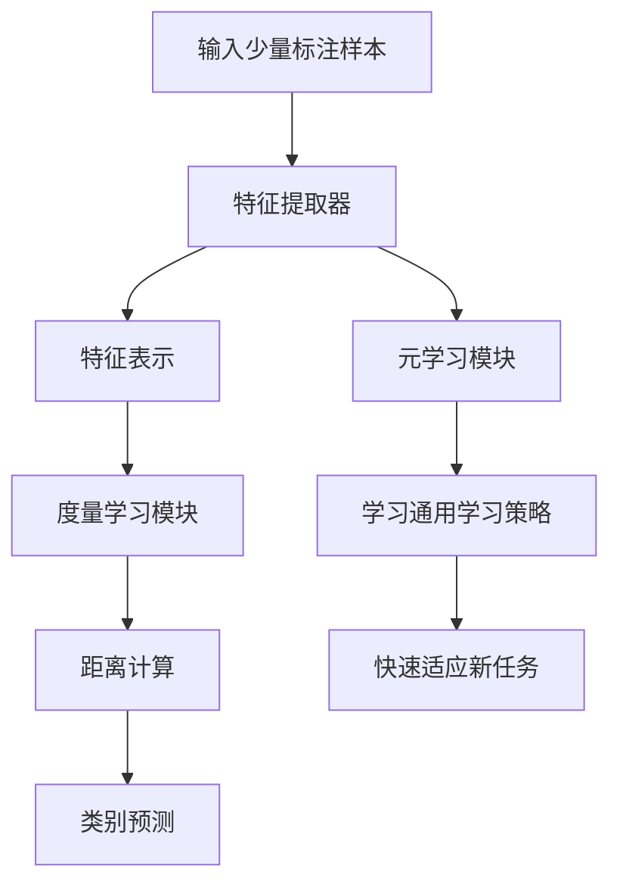

# 模型训练中的few-shot learning高级技术应用

> 关键词：few-shot learning、模型训练、高级技术、元学习、迁移学习

> 摘要：本文深入探讨了模型训练中few-shot learning的高级技术应用。首先介绍了few-shot learning的背景，包括其目的、适用读者和文档结构。接着详细阐述了核心概念、算法原理、数学模型等内容。通过项目实战案例展示了few-shot learning在实际中的应用，分析了具体的代码实现和解读。同时探讨了其实际应用场景，推荐了相关的学习资源、开发工具和论文著作。最后总结了few-shot learning的未来发展趋势与挑战，并提供了常见问题解答和扩展阅读参考资料，旨在帮助读者全面了解和掌握few-shot learning的高级技术应用。

## 1. 背景介绍 
### 1.1 目的和范围
在传统的机器学习和深度学习任务中，通常需要大量的标注数据来训练模型以达到较好的性能。然而，在许多实际场景中，获取大量标注数据是非常困难、昂贵甚至不可行的。few-shot learning（少样本学习）正是为了解决这一问题而提出的技术，其目的是让模型在仅有少量标注样本的情况下也能进行有效的学习和准确的预测。

本文的范围将涵盖few-shot learning的核心概念、算法原理、数学模型、项目实战以及实际应用场景等方面，重点介绍few-shot learning中的高级技术应用，帮助读者深入理解和掌握这一前沿技术。

### 1.2 预期读者
本文预期读者包括机器学习、深度学习领域的研究人员、工程师和爱好者，以及对少样本学习技术感兴趣的相关专业学生。对于那些希望在数据稀缺情况下提高模型性能的开发者，本文将提供有价值的参考和实践指导。

### 1.3 文档结构概述
本文将按照以下结构进行组织：首先介绍few-shot learning的背景信息，包括目的、读者和文档结构；接着阐述核心概念和它们之间的联系，并用文本示意图和Mermaid流程图进行说明；然后详细讲解核心算法原理和具体操作步骤，使用Python代码进行示例；再介绍数学模型和公式，并通过举例说明；之后进行项目实战，包括开发环境搭建、源代码实现和代码解读；接着探讨few-shot learning的实际应用场景；推荐相关的学习资源、开发工具和论文著作；最后总结few-shot learning的未来发展趋势与挑战，提供常见问题解答和扩展阅读参考资料。

### 1.4 术语表
#### 1.4.1 核心术语定义
- **few-shot learning**：少样本学习，指模型在仅有少量标注样本的情况下进行学习和预测的技术。
- **meta-learning**：元学习，也称为“学习如何学习”，旨在通过在多个任务上进行训练，让模型学会快速适应新的任务，是few-shot learning中的重要技术之一。
- **support set**：支持集，在few-shot learning中，用于训练模型的少量标注样本集合。
- **query set**：查询集，用于测试模型性能的样本集合。
- **N-way K-shot**：表示分类任务中有N个类别，每个类别有K个标注样本。

#### 1.4.2 相关概念解释
- **迁移学习**：将在一个任务上学习到的知识迁移到另一个相关任务上，与few-shot learning有一定的关联，都旨在利用有限的数据提高模型性能。
- **度量学习**：学习样本之间的距离度量，在few-shot learning中常用于判断样本所属的类别。

#### 1.4.3 缩略词列表
- **CNN**：Convolutional Neural Network，卷积神经网络
- **LSTM**：Long Short-Term Memory，长短期记忆网络
- **SVM**：Support Vector Machine，支持向量机

## 2. 核心概念与联系 

### 核心概念原理
few-shot learning的核心思想是利用先验知识和少量的标注样本，让模型能够快速适应新的任务。其中，元学习是few-shot learning中常用的方法，它通过在多个不同的任务上进行训练，学习到一种通用的学习策略，使得模型在面对新的少样本任务时能够快速调整参数。

度量学习也是few-shot learning中的重要技术，它通过学习样本之间的距离度量，将新样本与支持集中的样本进行比较，从而判断新样本所属的类别。

### 架构的文本示意图
```plaintext
输入数据（少量标注样本）
|
|-- 特征提取器（如CNN）
|       |
|       |-- 特征表示
|       |
|       |-- 度量学习模块
|       |       |
|       |       |-- 距离计算
|       |       |
|       |       |-- 类别预测
|
|-- 元学习模块
|       |
|       |-- 学习通用学习策略
|       |
|       |-- 快速适应新任务
```

### Mermaid流程图


## 3. 核心算法原理 & 具体操作步骤 

### 核心算法原理
在few-shot learning中，常用的算法有原型网络（Prototypical Networks）、匹配网络（Matching Networks）和关系网络（Relation Networks）等。这里以原型网络为例进行讲解。

原型网络的核心思想是为每个类别计算一个原型（prototype），即该类别所有样本特征的均值。对于一个新的样本，计算其与各个类别原型的距离，将其分类到距离最近的类别。

### 具体操作步骤
1. **特征提取**：使用卷积神经网络（CNN）对支持集和查询集中的样本进行特征提取。
2. **计算原型**：对于支持集中的每个类别，计算其所有样本特征的均值，得到该类别的原型。
3. **距离计算**：对于查询集中的每个样本，计算其与各个类别原型的距离，常用的距离度量方法有欧氏距离。
4. **类别预测**：将查询集中的样本分类到距离最近的类别。

### Python源代码详细阐述
```python
import torch
import torch.nn as nn
import torch.optim as optim
from torch.utils.data import DataLoader
import numpy as np

# 定义卷积神经网络作为特征提取器
class CNN(nn.Module):
    def __init__(self):
        super(CNN, self).__init__()
        self.conv1 = nn.Conv2d(3, 64, kernel_size=3, padding=1)
        self.relu1 = nn.ReLU()
        self.pool1 = nn.MaxPool2d(2)
        self.conv2 = nn.Conv2d(64, 64, kernel_size=3, padding=1)
        self.relu2 = nn.ReLU()
        self.pool2 = nn.MaxPool2d(2)
        self.conv3 = nn.Conv2d(64, 64, kernel_size=3, padding=1)
        self.relu3 = nn.ReLU()
        self.pool3 = nn.MaxPool2d(2)
        self.conv4 = nn.Conv2d(64, 64, kernel_size=3, padding=1)
        self.relu4 = nn.ReLU()
        self.pool4 = nn.MaxPool2d(2)

    def forward(self, x):
        x = self.pool1(self.relu1(self.conv1(x)))
        x = self.pool2(self.relu2(self.conv2(x)))
        x = self.pool3(self.relu3(self.conv3(x)))
        x = self.pool4(self.relu4(self.conv4(x)))
        x = x.view(x.size(0), -1)
        return x

# 定义原型网络
class PrototypicalNetwork(nn.Module):
    def __init__(self):
        super(PrototypicalNetwork, self).__init__()
        self.feature_extractor = CNN()

    def forward(self, support_set, query_set, n_way, k_shot):
        # 特征提取
        support_features = self.feature_extractor(support_set)
        query_features = self.feature_extractor(query_set)

        # 计算原型
        prototypes = []
        for i in range(n_way):
            class_features = support_features[i * k_shot:(i + 1) * k_shot]
            prototype = torch.mean(class_features, dim=0)
            prototypes.append(prototype)
        prototypes = torch.stack(prototypes)

        # 距离计算
        distances = []
        for query_feature in query_features:
            distance = torch.sum((prototypes - query_feature) ** 2, dim=1)
            distances.append(distance)
        distances = torch.stack(distances)

        # 类别预测
        logits = -distances
        return logits

# 训练函数
def train(model, dataloader, n_way, k_shot, optimizer, criterion, device):
    model.train()
    total_loss = 0
    for support_set, support_labels, query_set, query_labels in dataloader:
        support_set = support_set.to(device)
        support_labels = support_labels.to(device)
        query_set = query_set.to(device)
        query_labels = query_labels.to(device)

        optimizer.zero_grad()
        logits = model(support_set, query_set, n_way, k_shot)
        loss = criterion(logits, query_labels)
        loss.backward()
        optimizer.step()

        total_loss += loss.item()
    return total_loss / len(dataloader)

# 测试函数
def test(model, dataloader, n_way, k_shot, device):
    model.eval()
    correct = 0
    total = 0
    with torch.no_grad():
        for support_set, support_labels, query_set, query_labels in dataloader:
            support_set = support_set.to(device)
            support_labels = support_labels.to(device)
            query_set = query_set.to(device)
            query_labels = query_labels.to(device)

            logits = model(support_set, query_set, n_way, k_shot)
            _, predicted = torch.max(logits, dim=1)
            total += query_labels.size(0)
            correct += (predicted == query_labels).sum().item()
    return correct / total

# 示例使用
if __name__ == "__main__":
    device = torch.device("cuda" if torch.cuda.is_available() else "cpu")
    model = PrototypicalNetwork().to(device)
    optimizer = optim.Adam(model.parameters(), lr=0.001)
    criterion = nn.CrossEntropyLoss()

    # 假设这里有一个自定义的数据集和数据加载器
    # dataset = CustomDataset()
    # dataloader = DataLoader(dataset, batch_size=1, shuffle=True)

    # 训练模型
    num_epochs = 10
    for epoch in range(num_epochs):
        train_loss = train(model, dataloader, n_way=5, k_shot=1, optimizer=optimizer, criterion=criterion, device=device)
        print(f'Epoch {epoch + 1}/{num_epochs}, Train Loss: {train_loss}')

    # 测试模型
    test_accuracy = test(model, dataloader, n_way=5, k_shot=1, device=device)
    print(f'Test Accuracy: {test_accuracy}')
```

## 4. 数学模型和公式 & 详细讲解 & 举例说明 

### 数学模型和公式
在原型网络中，核心的数学模型和公式如下：

#### 特征提取
假设输入样本为 $x$，特征提取器为 $f(x)$，则提取后的特征表示为 $z = f(x)$。

#### 原型计算
对于第 $i$ 个类别，其原型 $c_i$ 计算公式为：
$$c_i = \frac{1}{K} \sum_{j=1}^{K} z_{ij}$$
其中，$K$ 是每个类别的样本数量，$z_{ij}$ 是第 $i$ 个类别中第 $j$ 个样本的特征表示。

#### 距离计算
使用欧氏距离计算查询样本 $z_q$ 与第 $i$ 个类别原型 $c_i$ 的距离 $d(z_q, c_i)$：
$$d(z_q, c_i) = \| z_q - c_i \|_2^2$$

#### 类别预测
对于查询样本 $z_q$，其属于第 $i$ 个类别的概率 $p(y = i | z_q)$ 可以通过 softmax 函数计算：
$$p(y = i | z_q) = \frac{\exp(-d(z_q, c_i))}{\sum_{j=1}^{N} \exp(-d(z_q, c_j))}$$
其中，$N$ 是类别数量。

### 详细讲解
- **特征提取**：通过卷积神经网络等特征提取器将输入样本映射到特征空间，以便后续的计算。
- **原型计算**：每个类别的原型是该类别所有样本特征的均值，代表了该类别的中心。
- **距离计算**：使用欧氏距离衡量查询样本与各个类别原型的距离，距离越近表示该样本越可能属于该类别。
- **类别预测**：通过 softmax 函数将距离转换为概率，选择概率最大的类别作为预测结果。

### 举例说明
假设我们有一个 5-way 1-shot 的分类任务，即有 5 个类别，每个类别有 1 个标注样本。输入的查询样本为 $x_q$，经过特征提取器得到特征表示 $z_q$。

首先，计算每个类别的原型 $c_1, c_2, c_3, c_4, c_5$。然后，计算 $z_q$ 与每个原型的欧氏距离 $d(z_q, c_1), d(z_q, c_2), d(z_q, c_3), d(z_q, c_4), d(z_q, c_5)$。

最后，通过 softmax 函数计算 $p(y = 1 | z_q), p(y = 2 | z_q), p(y = 3 | z_q), p(y = 4 | z_q), p(y = 5 | z_q)$，选择概率最大的类别作为 $x_q$ 的预测类别。

## 5. 项目实战：代码实际案例和详细解释说明 

### 5.1  开发环境搭建
#### 操作系统
推荐使用 Linux 系统，如 Ubuntu 18.04 或更高版本，也可以使用 Windows 10 或 macOS。

#### 编程语言和库
- **Python**：版本 3.6 或更高版本。
- **PyTorch**：深度学习框架，用于构建和训练模型。可以根据自己的系统和 CUDA 版本选择合适的安装方式，例如：
```bash
pip install torch torchvision
```
- **NumPy**：用于数值计算。
```bash
pip install numpy
```
- **Matplotlib**：用于数据可视化（可选）。
```bash
pip install matplotlib
```

### 5.2  源代码详细实现和代码解读
```python
import torch
import torch.nn as nn
import torch.optim as optim
from torch.utils.data import DataLoader
import numpy as np

# 定义卷积神经网络作为特征提取器
class CNN(nn.Module):
    def __init__(self):
        super(CNN, self).__init__()
        # 第一个卷积层，输入通道数为3（RGB图像），输出通道数为64
        self.conv1 = nn.Conv2d(3, 64, kernel_size=3, padding=1)
        # ReLU激活函数
        self.relu1 = nn.ReLU()
        # 最大池化层，池化窗口大小为2
        self.pool1 = nn.MaxPool2d(2)
        # 第二个卷积层
        self.conv2 = nn.Conv2d(64, 64, kernel_size=3, padding=1)
        self.relu2 = nn.ReLU()
        self.pool2 = nn.MaxPool2d(2)
        # 第三个卷积层
        self.conv3 = nn.Conv2d(64, 64, kernel_size=3, padding=1)
        self.relu3 = nn.ReLU()
        self.pool3 = nn.MaxPool2d(2)
        # 第四个卷积层
        self.conv4 = nn.Conv2d(64, 64, kernel_size=3, padding=1)
        self.relu4 = nn.ReLU()
        self.pool4 = nn.MaxPool2d(2)

    def forward(self, x):
        # 前向传播过程
        x = self.pool1(self.relu1(self.conv1(x)))
        x = self.pool2(self.relu2(self.conv2(x)))
        x = self.pool3(self.relu3(self.conv3(x)))
        x = self.pool4(self.relu4(self.conv4(x)))
        # 将特征图展平为一维向量
        x = x.view(x.size(0), -1)
        return x

# 定义原型网络
class PrototypicalNetwork(nn.Module):
    def __init__(self):
        super(PrototypicalNetwork, self).__init__()
        # 初始化特征提取器
        self.feature_extractor = CNN()

    def forward(self, support_set, query_set, n_way, k_shot):
        # 对支持集和查询集进行特征提取
        support_features = self.feature_extractor(support_set)
        query_features = self.feature_extractor(query_set)

        # 计算原型
        prototypes = []
        for i in range(n_way):
            # 提取第i个类别的特征
            class_features = support_features[i * k_shot:(i + 1) * k_shot]
            # 计算该类别的原型
            prototype = torch.mean(class_features, dim=0)
            prototypes.append(prototype)
        # 将原型列表转换为张量
        prototypes = torch.stack(prototypes)

        # 距离计算
        distances = []
        for query_feature in query_features:
            # 计算查询样本与每个原型的欧氏距离
            distance = torch.sum((prototypes - query_feature) ** 2, dim=1)
            distances.append(distance)
        # 将距离列表转换为张量
        distances = torch.stack(distances)

        # 类别预测
        logits = -distances
        return logits

# 训练函数
def train(model, dataloader, n_way, k_shot, optimizer, criterion, device):
    model.train()
    total_loss = 0
    for support_set, support_labels, query_set, query_labels in dataloader:
        # 将数据移动到指定设备（GPU或CPU）
        support_set = support_set.to(device)
        support_labels = support_labels.to(device)
        query_set = query_set.to(device)
        query_labels = query_labels.to(device)

        # 清空梯度
        optimizer.zero_grad()
        # 前向传播
        logits = model(support_set, query_set, n_way, k_shot)
        # 计算损失
        loss = criterion(logits, query_labels)
        # 反向传播
        loss.backward()
        # 更新参数
        optimizer.step()

        total_loss += loss.item()
    return total_loss / len(dataloader)

# 测试函数
def test(model, dataloader, n_way, k_shot, device):
    model.eval()
    correct = 0
    total = 0
    with torch.no_grad():
        for support_set, support_labels, query_set, query_labels in dataloader:
            support_set = support_set.to(device)
            support_labels = support_labels.to(device)
            query_set = query_set.to(device)
            query_labels = query_labels.to(device)

            # 前向传播
            logits = model(support_set, query_set, n_way, k_shot)
            # 获取预测结果
            _, predicted = torch.max(logits, dim=1)
            total += query_labels.size(0)
            correct += (predicted == query_labels).sum().item()
    return correct / total

# 示例使用
if __name__ == "__main__":
    # 选择设备
    device = torch.device("cuda" if torch.cuda.is_available() else "cpu")
    # 初始化原型网络
    model = PrototypicalNetwork().to(device)
    # 定义优化器
    optimizer = optim.Adam(model.parameters(), lr=0.001)
    # 定义损失函数
    criterion = nn.CrossEntropyLoss()

    # 假设这里有一个自定义的数据集和数据加载器
    # dataset = CustomDataset()
    # dataloader = DataLoader(dataset, batch_size=1, shuffle=True)

    # 训练模型
    num_epochs = 10
    for epoch in range(num_epochs):
        train_loss = train(model, dataloader, n_way=5, k_shot=1, optimizer=optimizer, criterion=criterion, device=device)
        print(f'Epoch {epoch + 1}/{num_epochs}, Train Loss: {train_loss}')

    # 测试模型
    test_accuracy = test(model, dataloader, n_way=5, k_shot=1, device=device)
    print(f'Test Accuracy: {test_accuracy}')
```

### 5.3  代码解读与分析
- **CNN 类**：定义了一个简单的卷积神经网络作为特征提取器，包含四个卷积层、ReLU 激活函数和最大池化层。
- **PrototypicalNetwork 类**：实现了原型网络，包含特征提取和原型计算、距离计算、类别预测等步骤。
- **train 函数**：用于训练模型，包括前向传播、损失计算、反向传播和参数更新。
- **test 函数**：用于测试模型的性能，计算准确率。
- **主程序**：初始化模型、优化器和损失函数，进行训练和测试。

## 6. 实际应用场景 
### 医疗领域
在医疗图像诊断中，获取大量标注的医疗图像数据是非常困难的，因为需要专业的医生进行标注。few-shot learning 可以在仅有少量标注图像的情况下训练模型，帮助医生进行疾病诊断，如肿瘤检测、肺部疾病诊断等。

### 生物识别领域
在人脸识别、指纹识别等生物识别系统中，对于新用户或新的生物特征样本，可能只有少量的标注数据。few-shot learning 可以让模型快速适应新的用户，提高识别的准确率和效率。

### 自然语言处理领域
在文本分类、情感分析等任务中，对于一些特定领域或新出现的话题，可能只有少量的标注文本数据。few-shot learning 可以利用先验知识和少量的标注数据，训练出有效的文本分类模型。

### 工业检测领域
在工业生产中，对于一些新产品或新的缺陷类型，可能只有少量的标注样本。few-shot learning 可以帮助企业快速开发出缺陷检测模型，提高产品质量和生产效率。

## 7. 工具和资源推荐
### 7.1 学习资源推荐
#### 7.1.1 书籍推荐
- 《Deep Learning》（Ian Goodfellow、Yoshua Bengio 和 Aaron Courville 著）：深度学习领域的经典教材，涵盖了深度学习的基本原理和算法。
- 《Few-Shot Learning: A Survey》：专门介绍 few-shot learning 的书籍，对各种 few-shot learning 算法进行了详细的阐述和比较。

#### 7.1.2 在线课程
- Coursera 上的“Deep Learning Specialization”：由 Andrew Ng 教授主讲，涵盖了深度学习的各个方面，包括 few-shot learning 的相关内容。
- edX 上的“Introduction to Artificial Intelligence”：介绍人工智能的基础知识和前沿技术，其中包括 few-shot learning 的讲解。

#### 7.1.3 技术博客和网站
- Medium 上的 Towards Data Science：有很多关于机器学习和深度学习的优质文章，包括 few-shot learning 的最新研究成果和实践经验。
- arXiv.org：一个预印本服务器，提供了大量的学术论文，包括 few-shot learning 领域的最新研究。

### 7.2 开发工具框架推荐
#### 7.2.1 IDE和编辑器
- PyCharm：一款功能强大的 Python IDE，提供了代码编辑、调试、版本控制等功能，适合开发深度学习项目。
- Jupyter Notebook：一个交互式的开发环境，方便进行代码编写、数据可视化和模型调试，常用于机器学习和深度学习的实验和研究。

#### 7.2.2 调试和性能分析工具
- TensorBoard：TensorFlow 提供的可视化工具，可以用于监控模型的训练过程、可视化模型结构和性能指标。
- PyTorch Profiler：PyTorch 提供的性能分析工具，可以帮助开发者找出代码中的性能瓶颈，优化模型的训练和推理速度。

#### 7.2.3 相关框架和库
- PyTorch：一个开源的深度学习框架，提供了丰富的神经网络层和优化算法，方便开发者构建和训练 few-shot learning 模型。
- Scikit-learn：一个常用的机器学习库，提供了各种机器学习算法和工具，可用于数据预处理、模型评估等任务。

### 7.3 相关论文著作推荐
#### 7.3.1 经典论文
- “Prototypical Networks for Few-shot Learning”：提出了原型网络，是 few-shot learning 领域的经典论文之一。
- “Matching Networks for One Shot Learning”：介绍了匹配网络，为 few-shot learning 提供了一种新的方法。

#### 7.3.2 最新研究成果
- 关注 arXiv.org 上关于 few-shot learning 的最新论文，了解该领域的最新研究动态和技术发展趋势。

#### 7.3.3 应用案例分析
- 一些学术会议和期刊上会发表 few-shot learning 在不同领域的应用案例，如医疗、生物识别等，可以从中学习到实际应用中的经验和技巧。

## 8. 总结：未来发展趋势与挑战
### 未来发展趋势
- **与其他技术的融合**：few-shot learning 可能会与迁移学习、强化学习等技术进一步融合，以提高模型在少样本情况下的学习能力和泛化能力。
- **多模态应用**：在图像、文本、语音等多模态数据上的 few-shot learning 应用将成为未来的研究热点，以满足更复杂的实际需求。
- **实际应用的拓展**：few-shot learning 将在更多领域得到应用，如自动驾驶、智能家居等，为这些领域带来更高效的解决方案。

### 挑战
- **数据稀缺问题**：尽管 few-shot learning 旨在解决数据稀缺问题，但在某些极端情况下，数据仍然非常有限，如何在极少样本的情况下提高模型性能仍然是一个挑战。
- **模型泛化能力**：少样本学习模型容易出现过拟合问题，如何提高模型的泛化能力，使其在新的任务和数据上表现良好，是需要解决的关键问题。
- **计算资源需求**：一些复杂的 few-shot learning 算法需要大量的计算资源，如何在有限的计算资源下实现高效的训练和推理，也是一个挑战。

## 9. 附录：常见问题与解答
### 问题1：few-shot learning 与传统机器学习有什么区别？
传统机器学习通常需要大量的标注数据来训练模型，而 few-shot learning 旨在在仅有少量标注样本的情况下进行学习和预测。few-shot learning 更注重利用先验知识和元学习等技术，让模型能够快速适应新的任务。

### 问题2：few-shot learning 有哪些常用的算法？
常用的 few-shot learning 算法包括原型网络（Prototypical Networks）、匹配网络（Matching Networks）、关系网络（Relation Networks）等。

### 问题3：如何评估 few-shot learning 模型的性能？
常用的评估指标包括准确率、召回率、F1 值等。在 few-shot learning 中，通常使用 N-way K-shot 的设置进行评估，即在 N 个类别中，每个类别有 K 个标注样本的情况下进行测试。

### 问题4：few-shot learning 模型容易过拟合吗？
由于 few-shot learning 模型使用的标注样本较少，容易出现过拟合问题。可以通过正则化、数据增强等方法来缓解过拟合问题。

## 10. 扩展阅读 & 参考资料
### 扩展阅读
- “Meta-Learning: A Survey”：对元学习进行了全面的综述，有助于深入理解 few-shot learning 中的元学习技术。
- “Few-Shot Image Classification with Graph Convolutional Networks”：介绍了如何使用图卷积网络进行 few-shot 图像分类，提供了新的思路和方法。

### 参考资料
- 《Prototypical Networks for Few-shot Learning》论文原文
- 《Matching Networks for One Shot Learning》论文原文
- PyTorch 官方文档
- Scikit-learn 官方文档

作者：AI天才研究院/AI Genius Institute & 禅与计算机程序设计艺术 /Zen And The Art of Computer Programming