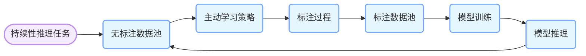

# 模型训练中的主动学习策略在持续性推理任务中的优化

> 关键词：模型训练、主动学习策略、持续性推理任务、优化、机器学习

> 摘要：本文聚焦于模型训练中的主动学习策略在持续性推理任务中的优化问题。首先介绍了相关背景知识，包括目的范围、预期读者等内容。接着阐述了核心概念与联系，通过文本示意图和Mermaid流程图清晰展示。详细讲解了核心算法原理并给出Python源代码，同时给出了数学模型和公式及具体例子。通过项目实战展示代码实际案例和详细解释。分析了实际应用场景，推荐了学习、开发工具和相关论文著作。最后总结了未来发展趋势与挑战，并提供常见问题解答和扩展阅读参考资料，旨在为该领域的研究和实践提供全面且深入的指导。

## 1. 背景介绍 
### 1.1 目的和范围
在当今的人工智能和机器学习领域，模型训练是一个核心环节。而持续性推理任务，如自然语言处理中的对话系统、智能客服，以及计算机视觉中的视频监控等，需要模型能够不断适应新的数据和情况，持续做出准确的推理。主动学习策略作为一种高效的数据采样方法，可以在有限的标注数据下提升模型性能。本文章的目的在于探讨如何优化主动学习策略，使其更好地应用于持续性推理任务中，提高模型的训练效率和推理准确性。范围涵盖了从核心概念的介绍到算法原理的阐述，再到实际项目的应用，以及相关工具和资源的推荐等多个方面。

### 1.2 预期读者
本文预期读者包括人工智能、机器学习领域的研究人员、开发者，以及对模型训练和主动学习感兴趣的技术爱好者。对于正在从事持续性推理任务相关项目的工程师，本文可以提供优化主动学习策略的思路和方法；对于研究人员，有助于深入理解主动学习在持续性推理任务中的应用和挑战。

### 1.3 文档结构概述
本文将按照以下结构展开：首先介绍核心概念与联系，通过示意图和流程图帮助读者理解相关概念；接着详细讲解核心算法原理，并给出Python源代码；然后阐述数学模型和公式，通过具体例子加深理解；通过项目实战展示代码实现和详细解释；分析实际应用场景；推荐学习、开发工具和相关论文著作；最后总结未来发展趋势与挑战，提供常见问题解答和扩展阅读参考资料。

### 1.4 术语表
#### 1.4.1 核心术语定义
- **模型训练**：指通过给定的数据集对机器学习模型的参数进行调整，以使模型能够学习到数据中的模式和规律，从而对新的数据进行预测或分类。
- **主动学习策略**：是一种机器学习中的数据采样方法，模型主动选择最有价值的数据进行标注，从而在有限的标注数据下提高模型性能。
- **持续性推理任务**：指需要模型在一段时间内持续处理新的数据，并做出准确推理的任务，如实时对话、动态图像分析等。

#### 1.4.2 相关概念解释
- **标注数据**：指带有明确标签或标记的数据，用于监督学习中训练模型。例如，在图像分类任务中，标注数据就是每张图像对应的类别标签。
- **无标注数据**：指没有标签的数据，在主动学习中，模型需要从这些无标注数据中选择最有价值的部分进行标注。

#### 1.4.3 缩略词列表
- **ML**：Machine Learning，机器学习
- **AL**：Active Learning，主动学习

## 2. 核心概念与联系 
### 核心概念原理
在持续性推理任务中，模型需要不断地处理新的数据并做出准确的推理。传统的模型训练方法通常需要大量的标注数据，然而标注数据的获取往往是昂贵且耗时的。主动学习策略的核心思想是让模型主动选择最有价值的数据进行标注，从而在有限的标注数据下提高模型性能。

在持续性推理任务的背景下，主动学习策略可以动态地根据模型当前的状态和新出现的数据，选择最能提升模型性能的数据进行标注。例如，当模型遇到一些难以分类的数据时，主动学习策略会优先选择这些数据进行标注，以便模型能够更好地学习到这些复杂的模式。

### 架构的文本示意图
```plaintext
+---------------------+
| 持续性推理任务      |
|                     |
| 新数据不断流入      |
+---------------------+
           |
           v
+---------------------+
| 无标注数据池        |
|                     |
| 存储新出现的数据    |
+---------------------+
           |
           v
+---------------------+
| 主动学习策略        |
|                     |
| 选择最有价值数据    |
+---------------------+
           |
           v
+---------------------+
| 标注过程            |
|                     |
| 人工或自动标注      |
+---------------------+
           |
           v
+---------------------+
| 标注数据池          |
|                     |
| 存储标注好的数据    |
+---------------------+
           |
           v
+---------------------+
| 模型训练            |
|                     |
| 使用标注数据更新模型|
+---------------------+
           |
           v
+---------------------+
| 模型推理            |
|                     |
| 对新数据进行推理    |
+---------------------+
```

### Mermaid 流程图


## 3. 核心算法原理 & 具体操作步骤 
### 核心算法原理
主动学习策略的核心算法有多种，这里以基于不确定性采样的主动学习算法为例进行讲解。该算法的基本思想是选择模型最不确定的样本进行标注。在分类任务中，通常使用模型预测概率的熵来衡量不确定性。熵越大，表示模型对该样本的分类越不确定。

### 具体操作步骤
1. **初始化模型和数据池**：使用少量的标注数据初始化模型，将大量的无标注数据放入无标注数据池中。
2. **模型推理**：使用当前模型对无标注数据池中的数据进行推理，得到每个样本的预测概率。
3. **计算不确定性**：对于每个样本，计算其预测概率的熵。熵的计算公式为：$H(p)=-\sum_{i=1}^{n}p_i\log(p_i)$，其中 $p_i$ 是第 $i$ 个类别的预测概率，$n$ 是类别的数量。
4. **选择最不确定的样本**：选择熵最大的 $k$ 个样本进行标注。
5. **更新数据池和模型**：将标注好的样本从无标注数据池移动到标注数据池，并使用新的标注数据更新模型。
6. **重复步骤2-5**：不断重复上述步骤，直到达到预定的训练轮数或满足其他停止条件。

### Python源代码
```python
import numpy as np
from sklearn.datasets import make_classification
from sklearn.linear_model import LogisticRegression
from sklearn.model_selection import train_test_split

# 生成数据集
X, y = make_classification(n_samples=1000, n_features=20, n_informative=10, n_classes=2, random_state=42)
X_train, X_test, y_train, y_test = train_test_split(X, y, test_size=0.2, random_state=42)

# 初始化模型
model = LogisticRegression()

# 初始化标注数据和无标注数据
n_initial = 100
X_labeled = X_train[:n_initial]
y_labeled = y_train[:n_initial]
X_unlabeled = X_train[n_initial:]

# 训练初始模型
model.fit(X_labeled, y_labeled)

# 主动学习循环
n_rounds = 5
k = 20
for round in range(n_rounds):
    # 模型推理
    probabilities = model.predict_proba(X_unlabeled)
    
    # 计算不确定性（熵）
    entropy = -np.sum(probabilities * np.log(probabilities + 1e-10), axis=1)
    
    # 选择最不确定的样本
    top_k_indices = np.argsort(entropy)[-k:]
    X_new_labeled = X_unlabeled[top_k_indices]
    y_new_labeled = y_train[n_initial + top_k_indices]
    
    # 更新数据池
    X_labeled = np.vstack((X_labeled, X_new_labeled))
    y_labeled = np.hstack((y_labeled, y_new_labeled))
    X_unlabeled = np.delete(X_unlabeled, top_k_indices, axis=0)
    
    # 更新模型
    model.fit(X_labeled, y_labeled)
    
    # 评估模型
    accuracy = model.score(X_test, y_test)
    print(f"Round {round + 1}: Accuracy = {accuracy}")
```

## 4. 数学模型和公式 & 详细讲解 & 举例说明 
### 数学模型和公式
在基于不确定性采样的主动学习算法中，核心的数学公式是熵的计算公式。熵是信息论中的一个概念，用于衡量随机变量的不确定性。在分类任务中，我们可以将模型对一个样本的预测概率看作一个随机变量的概率分布，通过计算这个概率分布的熵来衡量模型对该样本的不确定性。

熵的计算公式为：
$$H(p)=-\sum_{i=1}^{n}p_i\log(p_i)$$
其中，$p_i$ 是第 $i$ 个类别的预测概率，$n$ 是类别的数量。

### 详细讲解
- **概率分布**：在分类任务中，模型对一个样本的输出是一个概率向量，每个元素表示该样本属于各个类别的概率。例如，在一个二分类任务中，模型对某个样本的输出可能是 $[0.2, 0.8]$，表示该样本属于类别 0 的概率是 0.2，属于类别 1 的概率是 0.8。
- **熵的意义**：熵越大，表示概率分布越均匀，模型对该样本的分类越不确定。例如，当概率分布为 $[0.5, 0.5]$ 时，熵达到最大值 $H(p)=- (0.5\log(0.5) + 0.5\log(0.5)) = \log(2) \approx 0.693$；当概率分布为 $[1, 0]$ 或 $[0, 1]$ 时，熵为 0，表示模型对该样本的分类非常确定。

### 举例说明
假设我们有一个三分类任务，模型对某个样本的预测概率为 $p = [0.2, 0.3, 0.5]$。根据熵的计算公式，我们可以计算该样本的熵：

$$
\begin{align*}
H(p)&=-\sum_{i=1}^{3}p_i\log(p_i)\\
&=-(0.2\log(0.2) + 0.3\log(0.3) + 0.5\log(0.5))\\
&\approx - (0.2\times(-1.609) + 0.3\times(-1.204) + 0.5\times(-0.693))\\
&\approx 1.029
\end{align*}
$$

通过比较不同样本的熵，我们可以选择熵最大的样本进行标注，以提高模型的性能。

## 5. 项目实战：代码实际案例和详细解释说明 
### 5.1  开发环境搭建
#### 安装Python
首先，确保你已经安装了Python。推荐使用Python 3.7及以上版本。你可以从Python官方网站（https://www.python.org/downloads/）下载并安装Python。

#### 创建虚拟环境
为了避免不同项目之间的依赖冲突，建议使用虚拟环境。在命令行中执行以下命令创建并激活虚拟环境：
```bash
# 创建虚拟环境
python -m venv myenv

# 激活虚拟环境（Windows）
myenv\Scripts\activate

# 激活虚拟环境（Linux/Mac）
source myenv/bin/activate
```

#### 安装依赖库
在虚拟环境中安装所需的依赖库，包括 `numpy`、`scikit-learn` 等。执行以下命令：
```bash
pip install numpy scikit-learn
```

### 5.2  源代码详细实现和代码解读
```python
import numpy as np
from sklearn.datasets import make_classification
from sklearn.linear_model import LogisticRegression
from sklearn.model_selection import train_test_split

# 生成数据集
X, y = make_classification(n_samples=1000, n_features=20, n_informative=10, n_classes=2, random_state=42)
X_train, X_test, y_train, y_test = train_test_split(X, y, test_size=0.2, random_state=42)
```
- **代码解读**：首先导入所需的库，然后使用 `make_classification` 函数生成一个二分类数据集。接着使用 `train_test_split` 函数将数据集划分为训练集和测试集。

```python
# 初始化模型
model = LogisticRegression()

# 初始化标注数据和无标注数据
n_initial = 100
X_labeled = X_train[:n_initial]
y_labeled = y_train[:n_initial]
X_unlabeled = X_train[n_initial:]

# 训练初始模型
model.fit(X_labeled, y_labeled)
```
- **代码解读**：初始化一个逻辑回归模型，然后将训练集的前 100 个样本作为初始标注数据，其余样本作为无标注数据。使用初始标注数据训练模型。

```python
# 主动学习循环
n_rounds = 5
k = 20
for round in range(n_rounds):
    # 模型推理
    probabilities = model.predict_proba(X_unlabeled)
    
    # 计算不确定性（熵）
    entropy = -np.sum(probabilities * np.log(probabilities + 1e-10), axis=1)
    
    # 选择最不确定的样本
    top_k_indices = np.argsort(entropy)[-k:]
    X_new_labeled = X_unlabeled[top_k_indices]
    y_new_labeled = y_train[n_initial + top_k_indices]
    
    # 更新数据池
    X_labeled = np.vstack((X_labeled, X_new_labeled))
    y_labeled = np.hstack((y_labeled, y_new_labeled))
    X_unlabeled = np.delete(X_unlabeled, top_k_indices, axis=0)
    
    # 更新模型
    model.fit(X_labeled, y_labeled)
    
    # 评估模型
    accuracy = model.score(X_test, y_test)
    print(f"Round {round + 1}: Accuracy = {accuracy}")
```
- **代码解读**：在主动学习循环中，首先使用当前模型对无标注数据进行推理，得到每个样本的预测概率。然后计算每个样本的熵，选择熵最大的 20 个样本进行标注。将标注好的样本添加到标注数据池中，并从无标注数据池中删除这些样本。最后使用新的标注数据更新模型，并评估模型在测试集上的准确率。

### 5.3  代码解读与分析
通过上述代码，我们可以看到主动学习策略在持续性推理任务中的应用。随着主动学习轮数的增加，模型在测试集上的准确率逐渐提高，说明主动学习策略能够有效地选择有价值的数据进行标注，从而提高模型的性能。

同时，我们也可以发现，主动学习策略需要不断地进行模型推理和数据选择，这会增加一定的计算开销。因此，在实际应用中，需要根据具体情况权衡计算成本和模型性能的提升。

## 6. 实际应用场景 
### 自然语言处理
在自然语言处理领域，如文本分类、情感分析等任务中，标注数据的获取往往是一个瓶颈。主动学习策略可以应用于这些任务中，通过选择最有价值的文本数据进行标注，提高模型的训练效率和分类准确性。例如，在新闻文本分类任务中，模型可以主动选择那些难以分类的新闻文本进行标注，从而更好地学习到不同类别新闻的特征。

### 计算机视觉
在计算机视觉领域，如图像分类、目标检测等任务中，标注图像数据需要大量的人力和时间。主动学习策略可以帮助选择最有价值的图像进行标注，提高模型的性能。例如，在医学图像分析中，模型可以主动选择那些特征不明显、难以诊断的图像进行标注，从而提高医学图像诊断的准确性。

### 智能客服
在智能客服系统中，需要不断地处理用户的问题并给出准确的回答。主动学习策略可以应用于智能客服系统的模型训练中，通过选择最有代表性和最具挑战性的用户问题进行标注，提高智能客服系统的回答准确性和效率。

## 7. 工具和资源推荐
### 7.1 学习资源推荐
#### 7.1.1 书籍推荐
- 《机器学习》（周志华）：这本书是机器学习领域的经典教材，全面介绍了机器学习的基本概念、算法和应用。
- 《深度学习》（Ian Goodfellow、Yoshua Bengio、Aaron Courville）：详细介绍了深度学习的理论和实践，对于理解深度学习模型和算法有很大的帮助。

#### 7.1.2 在线课程
- Coursera上的“机器学习”课程（Andrew Ng）：这是一门非常经典的机器学习课程，适合初学者入门。
- edX上的“深度学习”课程（DeepLearning.AI）：由深度学习领域的专家授课，内容丰富实用。

#### 7.1.3 技术博客和网站
- Medium：上面有很多关于机器学习和人工智能的优秀文章，涵盖了最新的研究成果和实践经验。
- arXiv：提供了大量的学术论文，是了解机器学习领域最新研究动态的重要途径。

### 7.2 开发工具框架推荐
#### 7.2.1 IDE和编辑器
- PyCharm：一款功能强大的Python集成开发环境，提供了丰富的代码编辑、调试和项目管理功能。
- Jupyter Notebook：一种交互式的开发环境，适合进行数据探索和模型实验。

#### 7.2.2 调试和性能分析工具
- TensorBoard：TensorFlow提供的可视化工具，可以帮助用户监控模型的训练过程和性能。
- PyTorch Profiler：PyTorch提供的性能分析工具，可以帮助用户找出模型中的性能瓶颈。

#### 7.2.3 相关框架和库
- scikit-learn：一个简单易用的机器学习库，提供了丰富的机器学习算法和工具。
- PyTorch：一个流行的深度学习框架，具有动态图和易于使用的特点。

### 7.3 相关论文著作推荐
#### 7.3.1 经典论文
- “Active Learning Literature Survey”（Burr Settles）：这篇论文对主动学习领域进行了全面的综述，介绍了主动学习的基本概念、算法和应用。
- “A Survey on Active Learning for Natural Language Processing”（Yu Su、Xiang Ren、Dan Roth）：专门针对自然语言处理领域的主动学习进行了综述，对该领域的研究和实践有很大的指导意义。

#### 7.3.2 最新研究成果
- 可以通过arXiv等学术平台关注最新的主动学习和持续性推理任务相关的研究论文，了解该领域的最新进展。

#### 7.3.3 应用案例分析
- 一些顶级学术会议（如NeurIPS、ICML等）的论文集中，会有很多关于主动学习在实际应用中的案例分析，可以从中学习到实际项目中的经验和技巧。

## 8. 总结：未来发展趋势与挑战
### 未来发展趋势
- **与强化学习的结合**：将主动学习策略与强化学习相结合，可以使模型在持续性推理任务中更加智能地选择数据进行标注，进一步提高模型的性能。
- **多模态主动学习**：随着多模态数据（如图像、文本、音频等）的广泛应用，多模态主动学习将成为未来的一个重要研究方向。通过结合不同模态的数据，模型可以更全面地理解数据，提高推理的准确性。
- **自动化主动学习系统**：开发自动化的主动学习系统，减少人工干预，提高主动学习的效率和可靠性。

### 挑战
- **计算资源需求**：主动学习策略需要不断地进行模型推理和数据选择，这会增加计算资源的需求。如何在有限的计算资源下实现高效的主动学习是一个挑战。
- **标注成本**：虽然主动学习可以减少标注数据的数量，但标注仍然是一个昂贵的过程。如何降低标注成本，提高标注效率是一个需要解决的问题。
- **模型适应性**：在持续性推理任务中，数据的分布可能会随着时间的推移发生变化。如何使模型能够快速适应数据分布的变化，是主动学习面临的一个挑战。

## 9. 附录：常见问题与解答
### 问题1：主动学习策略一定能提高模型性能吗？
答：主动学习策略通常可以在有限的标注数据下提高模型性能，但并不是绝对的。其效果取决于数据的特点、模型的选择和主动学习算法的设计等因素。在某些情况下，如果数据分布比较简单，或者模型已经能够很好地拟合数据，主动学习可能不会带来明显的性能提升。

### 问题2：如何选择合适的主动学习算法？
答：选择合适的主动学习算法需要考虑数据的特点、任务的类型和计算资源等因素。例如，对于分类任务，基于不确定性采样的算法通常比较有效；对于回归任务，可以考虑使用基于模型变化的主动学习算法。同时，还需要根据计算资源的情况选择计算复杂度合适的算法。

### 问题3：主动学习策略在实际应用中需要注意什么？
答：在实际应用中，需要注意以下几点：
- **标注质量**：标注数据的质量直接影响模型的性能，因此需要确保标注的准确性和一致性。
- **计算成本**：主动学习策略会增加一定的计算开销，需要根据实际情况权衡计算成本和模型性能的提升。
- **数据更新**：在持续性推理任务中，需要及时更新数据池，确保模型能够处理新出现的数据。

## 10. 扩展阅读 & 参考资料
### 扩展阅读
- 可以进一步阅读关于半监督学习、迁移学习等相关领域的文献，了解这些技术与主动学习的结合和应用。
- 关注一些开源的主动学习项目，如 modAL（https://modal-python.readthedocs.io/），学习其实现原理和应用方法。

### 参考资料
- 文中引用的相关书籍、论文和在线课程。
- 各开源框架和库的官方文档，如 scikit-learn（https://scikit-learn.org/）、PyTorch（https://pytorch.org/）等。

作者：AI天才研究院/AI Genius Institute & 禅与计算机程序设计艺术 /Zen And The Art of Computer Programming