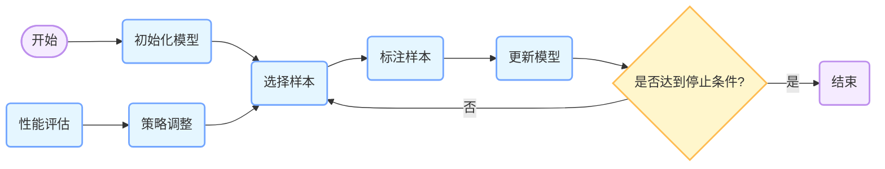

# 模型训练中的主动学习策略自适应优化

> 关键词：模型训练、主动学习策略、自适应优化、机器学习、数据标注

> 摘要：本文围绕模型训练中的主动学习策略自适应优化展开深入探讨。首先介绍了相关背景知识，包括目的范围、预期读者、文档结构和术语表。接着阐述了核心概念与联系，通过文本示意图和 Mermaid 流程图进行清晰展示。详细讲解了核心算法原理，结合 Python 代码进行具体操作步骤的说明。给出了数学模型和公式，并通过举例加深理解。通过项目实战，展示了代码实际案例并进行详细解释。分析了实际应用场景，推荐了学习资源、开发工具框架以及相关论文著作。最后总结了未来发展趋势与挑战，还包含常见问题解答和扩展阅读参考资料，旨在为读者全面呈现主动学习策略自适应优化在模型训练中的应用和发展。

## 1. 背景介绍 
### 1.1 目的和范围
在当今的机器学习和深度学习领域，模型训练是一个至关重要的环节。然而，数据标注的成本往往很高，尤其是在处理大规模数据集时。主动学习策略旨在通过选择性地标注最有价值的数据样本，来提高模型的性能，同时降低标注成本。本文章的目的在于深入探讨如何对主动学习策略进行自适应优化，以进一步提升模型训练的效率和效果。范围涵盖了主动学习策略的基本原理、自适应优化的算法和方法、实际应用案例以及相关的工具和资源。

### 1.2 预期读者
本文预期读者包括机器学习工程师、数据科学家、研究人员以及对模型训练和主动学习感兴趣的技术爱好者。对于初学者，本文可以作为一个系统的学习资料，帮助他们了解主动学习策略自适应优化的基本概念和方法；对于有一定经验的专业人士，本文提供了深入的技术分析和实际应用案例，可供他们参考和借鉴。

### 1.3 文档结构概述
本文将按照以下结构进行组织：首先介绍核心概念与联系，包括主动学习和自适应优化的基本原理和架构；接着详细讲解核心算法原理和具体操作步骤，使用 Python 代码进行说明；然后给出数学模型和公式，并通过举例进行详细讲解；通过项目实战展示代码实际案例并进行详细解释；分析实际应用场景；推荐相关的工具和资源；最后总结未来发展趋势与挑战，并提供常见问题解答和扩展阅读参考资料。

### 1.4 术语表
#### 1.4.1 核心术语定义
- **主动学习（Active Learning）**：一种机器学习方法，通过选择性地标注最有价值的数据样本，来提高模型的性能，同时降低标注成本。
- **自适应优化（Adaptive Optimization）**：根据模型的性能和数据的特点，自动调整学习策略和参数，以达到最优的学习效果。
- **模型训练（Model Training）**：通过使用训练数据对模型进行调整和优化，使模型能够学习到数据中的模式和规律。
- **数据标注（Data Annotation）**：为数据样本添加标签或注释，以便模型能够理解和学习数据的含义。

#### 1.4.2 相关概念解释
- **不确定性采样（Uncertainty Sampling）**：主动学习中常用的一种采样策略，选择模型最不确定的样本进行标注。
- **委员会查询（Query by Committee）**：通过多个模型组成的委员会，选择委员会成员意见分歧最大的样本进行标注。
- **信息密度（Information Density）**：衡量数据样本中包含信息的多少，信息密度高的样本通常更有价值。

#### 1.4.3 缩略词列表
- **ML（Machine Learning）**：机器学习
- **DL（Deep Learning）**：深度学习
- **AL（Active Learning）**：主动学习
- **AO（Adaptive Optimization）**：自适应优化

## 2. 核心概念与联系 
### 主动学习原理
主动学习的核心思想是在模型训练过程中，主动选择最有价值的数据样本进行标注，而不是随机选择。通过这种方式，可以在有限的标注资源下，更快地提高模型的性能。主动学习通常包括以下几个步骤：
1. **初始化模型**：使用少量的标注数据初始化模型。
2. **选择样本**：根据某种策略选择最有价值的数据样本。
3. **标注样本**：对选择的样本进行标注。
4. **更新模型**：使用新标注的数据更新模型。
5. **重复步骤 2-4**：直到达到停止条件。

### 自适应优化原理
自适应优化是指根据模型的性能和数据的特点，自动调整学习策略和参数，以达到最优的学习效果。在主动学习中，自适应优化可以用于调整样本选择策略、模型训练参数等。例如，当模型的性能提升缓慢时，可以调整样本选择策略，选择更有价值的样本进行标注；当模型出现过拟合时，可以调整训练参数，如学习率、正则化系数等。

### 核心概念架构的文本示意图
```plaintext
主动学习策略
|-- 样本选择策略
|   |-- 不确定性采样
|   |-- 委员会查询
|   |-- 信息密度采样
|-- 标注数据管理
|   |-- 标注数据存储
|   |-- 标注数据更新
|-- 模型训练与更新
|   |-- 模型初始化
|   |-- 模型训练
|   |-- 模型更新

自适应优化
|-- 性能评估
|   |-- 准确率
|   |-- 召回率
|   |-- F1 值
|-- 策略调整
|   |-- 样本选择策略调整
|   |-- 模型训练参数调整
```

### Mermaid 流程图


## 3. 核心算法原理 & 具体操作步骤 
### 不确定性采样算法原理
不确定性采样是主动学习中最常用的一种采样策略，其基本思想是选择模型最不确定的样本进行标注。常见的不确定性采样方法包括：
- **最大熵采样（Maximum Entropy Sampling）**：选择熵最大的样本进行标注，熵表示模型对样本分类的不确定性。
- **最小置信度采样（Least Confidence Sampling）**：选择模型预测置信度最低的样本进行标注。
- **边际采样（Margin Sampling）**：选择模型预测的前两个类别置信度差值最小的样本进行标注。

### Python 代码实现
```python
import numpy as np
from sklearn.linear_model import LogisticRegression
from sklearn.datasets import make_classification
from sklearn.model_selection import train_test_split

# 生成数据集
X, y = make_classification(n_samples=1000, n_features=20, n_informative=10, n_classes=2, random_state=42)
X_train, X_test, y_train, y_test = train_test_split(X, y, test_size=0.2, random_state=42)

# 初始化模型
model = LogisticRegression()

# 初始标注数据
n_initial = 10
idx_initial = np.random.choice(len(X_train), n_initial, replace=False)
X_labeled = X_train[idx_initial]
y_labeled = y_train[idx_initial]
X_unlabeled = np.delete(X_train, idx_initial, axis=0)

# 训练模型
model.fit(X_labeled, y_labeled)

# 不确定性采样
def uncertainty_sampling(model, X_unlabeled):
    probabilities = model.predict_proba(X_unlabeled)
    entropy = -np.sum(probabilities * np.log2(probabilities + 1e-10), axis=1)
    idx_max_entropy = np.argmax(entropy)
    return idx_max_entropy

# 主动学习循环
n_iterations = 10
for i in range(n_iterations):
    # 选择样本
    idx_selected = uncertainty_sampling(model, X_unlabeled)
    X_new = X_unlabeled[idx_selected].reshape(1, -1)
    y_new = np.array([input(f"请标注样本 {X_new}: ")], dtype=int)
    
    # 更新标注数据
    X_labeled = np.vstack((X_labeled, X_new))
    y_labeled = np.hstack((y_labeled, y_new))
    X_unlabeled = np.delete(X_unlabeled, idx_selected, axis=0)
    
    # 更新模型
    model.fit(X_labeled, y_labeled)
    
    # 评估模型
    accuracy = model.score(X_test, y_test)
    print(f"迭代 {i+1}: 准确率 = {accuracy}")
```

### 具体操作步骤
1. **生成数据集**：使用 `make_classification` 函数生成一个分类数据集。
2. **初始化模型**：使用逻辑回归模型进行初始化。
3. **选择初始标注数据**：随机选择一部分数据作为初始标注数据。
4. **训练模型**：使用初始标注数据训练模型。
5. **不确定性采样**：计算未标注数据的熵，选择熵最大的样本进行标注。
6. **更新标注数据**：将选择的样本添加到标注数据集中。
7. **更新模型**：使用更新后的标注数据集重新训练模型。
8. **评估模型**：使用测试数据集评估模型的准确率。
9. **重复步骤 5-8**：直到达到指定的迭代次数。

## 4. 数学模型和公式 & 详细讲解 & 举例说明 
### 最大熵采样公式
最大熵采样的核心是计算样本的熵，熵的计算公式为：
$$
H(p) = -\sum_{i=1}^{C} p_i \log_2 p_i
$$
其中，$p_i$ 是模型对样本属于第 $i$ 类的预测概率，$C$ 是类别数。熵越大，表示模型对样本的分类越不确定。

### 详细讲解
熵是信息论中的一个概念，用于衡量随机变量的不确定性。在主动学习中，我们希望选择模型最不确定的样本进行标注，因此选择熵最大的样本。通过计算每个未标注样本的熵，我们可以找到最有价值的样本进行标注。

### 举例说明
假设我们有一个二分类问题，模型对一个样本的预测概率为 $p_1 = 0.3$ 和 $p_2 = 0.7$。则该样本的熵为：
$$
H(p) = - (0.3 \log_2 0.3 + 0.7 \log_2 0.7) \approx 0.881
$$
如果另一个样本的预测概率为 $p_1 = 0.5$ 和 $p_2 = 0.5$，则该样本的熵为：
$$
H(p) = - (0.5 \log_2 0.5 + 0.5 \log_2 0.5) = 1
$$
由于第二个样本的熵更大，因此在最大熵采样中，我们会选择第二个样本进行标注。

## 5. 项目实战：代码实际案例和详细解释说明 
### 5.1  开发环境搭建
- **Python 环境**：建议使用 Python 3.7 及以上版本。
- **依赖库**：安装 `numpy`、`scikit-learn` 等必要的库。可以使用以下命令进行安装：
```sh
pip install numpy scikit-learn
```

### 5.2  源代码详细实现和代码解读
```python
import numpy as np
from sklearn.linear_model import LogisticRegression
from sklearn.datasets import make_classification
from sklearn.model_selection import train_test_split

# 生成数据集
X, y = make_classification(n_samples=1000, n_features=20, n_informative=10, n_classes=2, random_state=42)
X_train, X_test, y_train, y_test = train_test_split(X, y, test_size=0.2, random_state=42)

# 初始化模型
model = LogisticRegression()

# 初始标注数据
n_initial = 10
idx_initial = np.random.choice(len(X_train), n_initial, replace=False)
X_labeled = X_train[idx_initial]
y_labeled = y_train[idx_initial]
X_unlabeled = np.delete(X_train, idx_initial, axis=0)

# 训练模型
model.fit(X_labeled, y_labeled)

# 不确定性采样
def uncertainty_sampling(model, X_unlabeled):
    probabilities = model.predict_proba(X_unlabeled)
    entropy = -np.sum(probabilities * np.log2(probabilities + 1e-10), axis=1)
    idx_max_entropy = np.argmax(entropy)
    return idx_max_entropy

# 主动学习循环
n_iterations = 10
for i in range(n_iterations):
    # 选择样本
    idx_selected = uncertainty_sampling(model, X_unlabeled)
    X_new = X_unlabeled[idx_selected].reshape(1, -1)
    y_new = np.array([input(f"请标注样本 {X_new}: ")], dtype=int)
    
    # 更新标注数据
    X_labeled = np.vstack((X_labeled, X_new))
    y_labeled = np.hstack((y_labeled, y_new))
    X_unlabeled = np.delete(X_unlabeled, idx_selected, axis=0)
    
    # 更新模型
    model.fit(X_labeled, y_labeled)
    
    # 评估模型
    accuracy = model.score(X_test, y_test)
    print(f"迭代 {i+1}: 准确率 = {accuracy}")
```

### 代码解读与分析
1. **数据集生成**：使用 `make_classification` 函数生成一个包含 1000 个样本、20 个特征的二分类数据集。
2. **数据划分**：使用 `train_test_split` 函数将数据集划分为训练集和测试集，测试集占比 20%。
3. **模型初始化**：使用逻辑回归模型进行初始化。
4. **初始标注数据选择**：随机选择 10 个样本作为初始标注数据。
5. **模型训练**：使用初始标注数据训练模型。
6. **不确定性采样函数**：`uncertainty_sampling` 函数计算未标注数据的熵，选择熵最大的样本进行标注。
7. **主动学习循环**：在每次迭代中，选择一个样本进行标注，更新标注数据集和模型，并评估模型的准确率。

## 6. 实际应用场景 
### 图像分类
在图像分类任务中，数据标注的成本很高，因为需要人工对大量的图像进行分类标注。主动学习策略可以通过选择性地标注最有价值的图像样本，来提高模型的性能，同时降低标注成本。例如，在医学图像分类中，可以使用主动学习策略选择最具诊断价值的图像进行标注，从而提高疾病诊断的准确率。

### 自然语言处理
在自然语言处理任务中，如文本分类、情感分析等，也可以使用主动学习策略。通过选择最有价值的文本样本进行标注，可以更快地提高模型的性能。例如，在社交媒体情感分析中，可以使用主动学习策略选择最具代表性的文本进行标注，从而提高情感分析的准确率。

### 语音识别
在语音识别任务中，数据标注需要大量的人力和时间。主动学习策略可以通过选择性地标注最有价值的语音样本，来提高模型的性能。例如，在智能语音助手的开发中，可以使用主动学习策略选择最具挑战性的语音样本进行标注，从而提高语音识别的准确率。

## 7. 工具和资源推荐
### 7.1 学习资源推荐
#### 7.1.1 书籍推荐
- 《机器学习》（周志华）：一本全面介绍机器学习基本概念、算法和应用的经典教材。
- 《深度学习》（Ian Goodfellow、Yoshua Bengio 和 Aaron Courville）：深度学习领域的权威著作，介绍了深度学习的基本原理、算法和应用。
- 《主动学习》（Burr Settles）：专门介绍主动学习的书籍，涵盖了主动学习的基本概念、算法和应用。

#### 7.1.2 在线课程
- Coursera 上的 “机器学习” 课程（Andrew Ng 教授）：经典的机器学习在线课程，介绍了机器学习的基本概念、算法和应用。
- edX 上的 “深度学习” 课程（MIT 教授）：深入介绍深度学习的基本原理、算法和应用。
- Kaggle 上的 “主动学习” 教程：提供了主动学习的实践案例和代码实现。

#### 7.1.3 技术博客和网站
- Medium 上的机器学习和深度学习相关博客：提供了最新的技术文章和研究成果。
- arXiv.org：一个开放获取的预印本平台，提供了大量的机器学习和深度学习相关的研究论文。
- GitHub 上的开源项目：可以找到很多主动学习和模型训练相关的开源代码和项目。

### 7.2 开发工具框架推荐
#### 7.2.1 IDE和编辑器
- PyCharm：一款功能强大的 Python IDE，提供了代码编辑、调试、版本控制等功能。
- Jupyter Notebook：一个交互式的编程环境，适合进行数据分析和模型训练的实验。
- Visual Studio Code：一款轻量级的代码编辑器，支持多种编程语言和插件扩展。

#### 7.2.2 调试和性能分析工具
- TensorBoard：TensorFlow 提供的可视化工具，用于监控模型训练过程和分析模型性能。
- Py-Spy：一个用于分析 Python 程序性能的工具，可以找出程序中的性能瓶颈。
- cProfile：Python 标准库中的性能分析工具，用于分析函数调用时间和次数。

#### 7.2.3 相关框架和库
- Scikit-learn：一个简单易用的机器学习库，提供了多种机器学习算法和工具。
- TensorFlow：一个开源的深度学习框架，提供了高效的计算和模型训练功能。
- PyTorch：另一个开源的深度学习框架，具有动态图和易于使用的特点。

### 7.3 相关论文著作推荐
#### 7.3.1 经典论文
- “Active Learning Literature Survey”（Burr Settles）：一篇全面介绍主动学习的综述论文，涵盖了主动学习的基本概念、算法和应用。
- “Learning with Uncertainty Sampling”（David Cohn、Zoubin Ghahramani 和 Michael I. Jordan）：介绍了不确定性采样的基本原理和算法。
- “Query by Committee”（H. S. Seung、M. Opper 和 H. Sompolinsky）：提出了委员会查询的主动学习策略。

#### 7.3.2 最新研究成果
- 关注机器学习和深度学习领域的顶级会议，如 NeurIPS、ICML、CVPR 等，这些会议上会发表很多关于主动学习和模型训练的最新研究成果。
- 关注 arXiv.org 上的最新预印本论文，了解最新的研究动态。

#### 7.3.3 应用案例分析
- 可以在学术数据库如 IEEE Xplore、ACM Digital Library 等上查找主动学习在不同领域的应用案例分析，了解主动学习的实际应用效果和挑战。

## 8. 总结：未来发展趋势与挑战
### 未来发展趋势
- **结合深度学习**：随着深度学习的发展，主动学习与深度学习的结合将成为未来的一个重要发展方向。例如，使用深度神经网络进行样本选择和模型训练，提高主动学习的性能和效率。
- **多模态主动学习**：在实际应用中，数据往往是多模态的，如图像、文本、语音等。未来的主动学习将更加注重多模态数据的处理，提高模型的泛化能力和性能。
- **自适应主动学习**：自适应优化将在主动学习中发挥越来越重要的作用。通过根据模型的性能和数据的特点自动调整学习策略和参数，进一步提高主动学习的效率和效果。

### 挑战
- **样本选择策略的优化**：目前的样本选择策略还存在一些不足之处，如容易陷入局部最优解、对数据分布的变化敏感等。未来需要研究更加有效的样本选择策略，提高主动学习的性能。
- **标注成本的降低**：虽然主动学习可以降低标注成本，但在某些情况下，标注成本仍然很高。未来需要研究更加高效的标注方法和技术，进一步降低标注成本。
- **模型的可解释性**：随着深度学习模型的复杂度不断增加，模型的可解释性成为一个重要的问题。在主动学习中，需要研究如何提高模型的可解释性，以便更好地理解和应用模型。

## 9. 附录：常见问题与解答
### 主动学习和传统机器学习有什么区别？
传统机器学习通常使用随机采样的方法选择训练数据，而主动学习则通过选择性地标注最有价值的数据样本，来提高模型的性能，同时降低标注成本。主动学习可以在有限的标注资源下，更快地提高模型的性能。

### 自适应优化在主动学习中有什么作用？
自适应优化可以根据模型的性能和数据的特点，自动调整学习策略和参数，以达到最优的学习效果。在主动学习中，自适应优化可以用于调整样本选择策略、模型训练参数等，提高主动学习的效率和效果。

### 如何选择合适的样本选择策略？
选择合适的样本选择策略需要考虑数据的特点、模型的类型和任务的需求等因素。例如，对于分类问题，可以使用不确定性采样策略；对于回归问题，可以使用基于误差的采样策略。此外，还可以通过实验比较不同的样本选择策略，选择性能最优的策略。

## 10. 扩展阅读 & 参考资料
### 扩展阅读
- 《人工智能：一种现代的方法》（Stuart Russell 和 Peter Norvig）：全面介绍人工智能的基本概念、算法和应用，适合进一步深入学习人工智能领域的知识。
- 《模式识别与机器学习》（Christopher M. Bishop）：一本经典的机器学习教材，介绍了模式识别和机器学习的基本原理、算法和应用。

### 参考资料
- Scikit-learn 官方文档：https://scikit-learn.org/stable/
- TensorFlow 官方文档：https://www.tensorflow.org/
- PyTorch 官方文档：https://pytorch.org/

作者：AI天才研究院/AI Genius Institute & 禅与计算机程序设计艺术 /Zen And The Art of Computer Programming