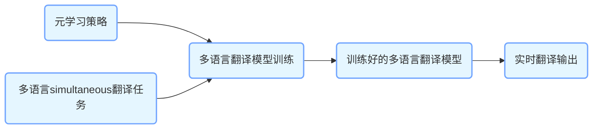

# 模型训练中的元学习策略在多语言simultaneous翻译中的优化

> 关键词：元学习策略、多语言simultaneous翻译、模型训练、优化、机器翻译

> 摘要：本文聚焦于模型训练中的元学习策略在多语言simultaneous翻译中的优化问题。首先介绍了相关背景，包括研究目的、预期读者等内容。接着阐述了核心概念及它们之间的联系，通过文本示意图和Mermaid流程图进行清晰展示。详细讲解了核心算法原理和具体操作步骤，并给出Python源代码示例。深入分析了数学模型和公式，结合实际例子进行说明。通过项目实战，展示了代码的实际应用和详细解释。探讨了该技术在实际中的应用场景，推荐了学习资源、开发工具框架以及相关论文著作。最后总结了未来发展趋势与挑战，还提供了常见问题解答和扩展阅读参考资料，旨在为多语言simultaneous翻译的研究和实践提供全面的技术指导。

## 1. 背景介绍 
### 1.1 目的和范围
多语言simultaneous翻译（同步翻译）在全球化的今天具有重要的应用价值，它能够实时将一种语言的语音或文本翻译成多种目标语言。然而，传统的模型训练方法在处理多语言、多领域的simultaneous翻译任务时，往往面临着数据稀疏、泛化能力不足等问题。元学习策略作为一种新兴的机器学习方法，旨在通过快速学习新任务的能力，提高模型在不同语言和场景下的适应性和性能。

本文章的目的在于深入探讨元学习策略在多语言simultaneous翻译模型训练中的应用，研究如何利用元学习来优化翻译质量、提高模型的泛化能力和学习效率。具体范围包括核心概念的介绍、算法原理的分析、数学模型的构建、实际项目的案例分析以及相关工具和资源的推荐等。

### 1.2 预期读者
本文预期读者主要包括从事自然语言处理、机器翻译领域的研究人员和工程师，对元学习和多语言处理技术感兴趣的学生和开发者，以及关注人工智能技术在跨语言交流中应用的相关人士。对于那些希望深入了解模型训练优化方法和提高多语言simultaneous翻译性能的专业人员，本文将提供有价值的技术参考和实践指导。

### 1.3 文档结构概述
本文将按照以下结构进行组织：
- 核心概念与联系：介绍元学习、多语言simultaneous翻译等核心概念，并阐述它们之间的关系，通过文本示意图和Mermaid流程图进行直观展示。
- 核心算法原理 & 具体操作步骤：详细讲解元学习策略在多语言simultaneous翻译中的核心算法，包括模型结构、训练过程等，并给出Python源代码示例。
- 数学模型和公式 & 详细讲解 & 举例说明：建立相关的数学模型，推导重要公式，并结合实际例子进行详细解释。
- 项目实战：代码实际案例和详细解释说明：通过一个实际的项目案例，展示如何使用元学习策略进行多语言simultaneous翻译模型的训练和优化，包括开发环境搭建、源代码实现和代码解读。
- 实际应用场景：探讨元学习策略在多语言simultaneous翻译中的实际应用场景，如国际会议、跨国商务交流等。
- 工具和资源推荐：推荐相关的学习资源、开发工具框架和论文著作，帮助读者进一步深入学习和研究。
- 总结：未来发展趋势与挑战：总结元学习策略在多语言simultaneous翻译中的应用现状，分析未来的发展趋势和面临的挑战。
- 附录：常见问题与解答：解答读者在学习和实践过程中可能遇到的常见问题。
- 扩展阅读 & 参考资料：提供相关的扩展阅读材料和参考资料，方便读者进一步深入研究。

### 1.4 术语表
#### 1.4.1 核心术语定义
- **元学习（Meta-learning）**：也称为“学习如何学习”，是一种让模型能够从多个任务中快速学习新知识的机器学习方法。它通过在多个相关任务上进行训练，学习到通用的学习策略和模型初始化参数，从而在面对新任务时能够快速适应。
- **多语言simultaneous翻译**：指在实时或接近实时的情况下，将一种源语言的语音或文本同时翻译成多种目标语言的翻译方式。
- **模型训练**：通过使用大量的训练数据来调整模型的参数，使得模型能够学习到数据中的模式和规律，从而提高模型在特定任务上的性能。
- **优化**：在模型训练过程中，通过调整模型的参数和训练策略，使得模型的性能达到最优或接近最优的过程。

#### 1.4.2 相关概念解释
- **少样本学习（Few-shot learning）**：是元学习的一个重要应用场景，指在只有少量训练样本的情况下，模型能够快速学习并进行准确预测的能力。在多语言simultaneous翻译中，少样本学习可以帮助模型在面对新的语言对或领域时，快速适应并进行高质量的翻译。
- **任务适应（Task adaptation）**：元学习中的一个关键概念，指模型在面对新任务时，能够利用之前学习到的知识和经验，快速调整自身的参数和结构，以适应新任务的要求。
- **元训练（Meta-training）**：元学习中的训练阶段，模型在多个相关任务上进行训练，学习到通用的学习策略和模型初始化参数。
- **元测试（Meta-testing）**：元学习中的测试阶段，模型在新的任务上进行测试，评估其在少样本情况下的学习能力和泛化能力。

#### 1.4.3 缩略词列表
- **NLP**：Natural Language Processing，自然语言处理
- **MT**：Machine Translation，机器翻译
- **RNN**：Recurrent Neural Network，循环神经网络
- **LSTM**：Long Short-Term Memory，长短期记忆网络
- **GRU**：Gated Recurrent Unit，门控循环单元
- **Transformer**：一种基于注意力机制的神经网络架构，广泛应用于自然语言处理任务中

## 2. 核心概念与联系 
### 核心概念原理
#### 元学习原理
元学习的核心思想是让模型学会如何学习，通过在多个相关任务上进行训练，模型能够学习到通用的学习策略和模型初始化参数。在元学习中，通常将任务分为元训练任务和元测试任务。在元训练阶段，模型在多个元训练任务上进行训练，学习到通用的学习策略和初始化参数；在元测试阶段，模型在新的元测试任务上进行测试，利用之前学习到的知识和经验，快速适应新任务。

#### 多语言simultaneous翻译原理
多语言simultaneous翻译的目标是在实时或接近实时的情况下，将一种源语言的语音或文本同时翻译成多种目标语言。为了实现这一目标，通常需要使用深度学习模型，如Transformer架构，来处理输入的源语言序列，并生成对应的目标语言序列。在翻译过程中，模型需要考虑源语言和目标语言之间的语法、语义和上下文信息，以确保翻译的准确性和流畅性。

### 核心概念之间的联系
元学习策略可以应用于多语言simultaneous翻译模型的训练中，以提高模型的泛化能力和学习效率。具体来说，元学习可以帮助模型在面对新的语言对或领域时，快速适应并进行高质量的翻译。通过在多个相关的语言对和领域上进行元训练，模型可以学习到通用的语言知识和翻译策略，从而在元测试阶段能够快速调整自身的参数和结构，以适应新的翻译任务。

### 文本示意图
```plaintext
+------------------+           +------------------+
|   元学习策略     |           | 多语言simultaneous翻译 |
+------------------+           +------------------+
         |                                 |
         |  应用于模型训练                 |
         v                                 v
+------------------+           +------------------+
|  多语言翻译模型  |           |  实时翻译输出   |
+------------------+           +------------------+
```

### Mermaid流程图


## 3. 核心算法原理 & 具体操作步骤 
### 核心算法原理
在多语言simultaneous翻译中应用元学习策略，通常采用基于模型无关元学习（Model-Agnostic Meta-Learning，MAML）的方法。MAML的核心思想是通过在多个任务上进行训练，找到一个通用的模型初始化参数，使得模型在面对新任务时能够快速适应。

具体来说，MAML的训练过程分为两个步骤：元训练和元更新。在元训练步骤中，对于每个元训练任务，模型使用当前的参数进行一次或多次梯度更新，得到一个临时的参数；在元更新步骤中，模型使用所有元训练任务的临时参数，计算元梯度，并更新模型的原始参数。

### 具体操作步骤
#### 步骤1：数据准备
首先，需要收集和整理多语言的翻译数据集，将其划分为元训练集和元测试集。元训练集包含多个相关的语言对和领域的翻译任务，用于模型的元训练；元测试集包含新的语言对和领域的翻译任务，用于模型的元测试。

#### 步骤2：模型初始化
选择一个合适的深度学习模型，如Transformer，作为多语言simultaneous翻译模型。初始化模型的参数，得到初始的模型参数 $\theta$。

#### 步骤3：元训练
对于每个元训练任务 $T_i$，执行以下操作：
1. 从元训练任务 $T_i$ 中采样一个小批量的训练数据 $(x_{i}, y_{i})$。
2. 使用当前的模型参数 $\theta$ 对训练数据 $(x_{i}, y_{i})$ 进行前向传播，计算损失函数 $L_{i}(\theta)$。
3. 使用梯度下降法对损失函数 $L_{i}(\theta)$ 进行一次或多次梯度更新，得到临时的模型参数 $\theta_{i}'$：
   $\theta_{i}' = \theta - \alpha \nabla_{\theta} L_{i}(\theta)$
   其中，$\alpha$ 是学习率。

#### 步骤4：元更新
计算所有元训练任务的临时参数 $\theta_{i}'$ 的元损失函数 $L_{meta}(\theta)$：
$L_{meta}(\theta) = \sum_{i=1}^{N} L_{i}(\theta_{i}')$
其中，$N$ 是元训练任务的数量。

使用梯度下降法对元损失函数 $L_{meta}(\theta)$ 进行梯度更新，得到更新后的模型参数 $\theta$：
$\theta = \theta - \beta \nabla_{\theta} L_{meta}(\theta)$
其中，$\beta$ 是元学习率。

#### 步骤5：元测试
在元测试阶段，从元测试集中选择一个新的翻译任务 $T_{test}$，使用更新后的模型参数 $\theta$ 对测试数据进行前向传播，计算翻译结果，并评估模型的性能。

### Python源代码示例
```python
import torch
import torch.nn as nn
import torch.optim as optim

# 定义多语言翻译模型（这里使用简单的示例模型）
class MultiLingualTranslationModel(nn.Module):
    def __init__(self, input_size, hidden_size, output_size):
        super(MultiLingualTranslationModel, self).__init__()
        self.fc1 = nn.Linear(input_size, hidden_size)
        self.relu = nn.ReLU()
        self.fc2 = nn.Linear(hidden_size, output_size)

    def forward(self, x):
        out = self.fc1(x)
        out = self.relu(out)
        out = self.fc2(out)
        return out

# 定义MAML算法
class MAML:
    def __init__(self, model, alpha=0.01, beta=0.001):
        self.model = model
        self.alpha = alpha
        self.beta = beta
        self.meta_optimizer = optim.Adam(self.model.parameters(), lr=beta)

    def meta_train(self, tasks):
        meta_loss = 0
        for task in tasks:
            # 保存原始参数
            original_params = [p.clone() for p in self.model.parameters()]

            # 元训练步骤
            x, y = task
            outputs = self.model(x)
            loss = nn.MSELoss()(outputs, y)
            grads = torch.autograd.grad(loss, self.model.parameters())
            theta_prime = [p - self.alpha * g for p, g in zip(self.model.parameters(), grads)]

            # 恢复原始参数
            for p, op in zip(self.model.parameters(), original_params):
                p.data = op.data

            # 计算元损失
            outputs_prime = self.model(x)
            meta_loss += nn.MSELoss()(outputs_prime, y)

        # 元更新步骤
        self.meta_optimizer.zero_grad()
        meta_loss.backward()
        self.meta_optimizer.step()

        return meta_loss.item()

# 示例数据
input_size = 10
hidden_size = 20
output_size = 5
model = MultiLingualTranslationModel(input_size, hidden_size, output_size)
maml = MAML(model)

# 模拟元训练任务
tasks = []
for _ in range(5):
    x = torch.randn(32, input_size)
    y = torch.randn(32, output_size)
    tasks.append((x, y))

# 进行元训练
meta_loss = maml.meta_train(tasks)
print(f"Meta loss: {meta_loss}")
```

## 4. 数学模型和公式 & 详细讲解 & 举例说明 
### 数学模型
在多语言simultaneous翻译中应用元学习策略，主要的数学模型基于MAML算法。假设我们有一个深度学习模型 $f_{\theta}$，其中 $\theta$ 是模型的参数。对于每个元训练任务 $T_i$，我们有一个损失函数 $L_{i}(\theta)$，表示模型在任务 $T_i$ 上的损失。

### 元训练步骤的数学公式
在元训练步骤中，对于每个元训练任务 $T_i$，我们使用当前的模型参数 $\theta$ 对训练数据进行前向传播，计算损失函数 $L_{i}(\theta)$，然后使用梯度下降法进行一次或多次梯度更新，得到临时的模型参数 $\theta_{i}'$：
$\theta_{i}' = \theta - \alpha \nabla_{\theta} L_{i}(\theta)$
其中，$\alpha$ 是学习率。

### 元更新步骤的数学公式
在元更新步骤中，我们计算所有元训练任务的临时参数 $\theta_{i}'$ 的元损失函数 $L_{meta}(\theta)$：
$L_{meta}(\theta) = \sum_{i=1}^{N} L_{i}(\theta_{i}')$
其中，$N$ 是元训练任务的数量。

然后，使用梯度下降法对元损失函数 $L_{meta}(\theta)$ 进行梯度更新，得到更新后的模型参数 $\theta$：
$\theta = \theta - \beta \nabla_{\theta} L_{meta}(\theta)$
其中，$\beta$ 是元学习率。

### 详细讲解
#### 元训练步骤
元训练步骤的目的是在每个元训练任务上对模型进行微调，得到临时的模型参数 $\theta_{i}'$。通过使用梯度下降法，我们可以沿着损失函数的负梯度方向更新模型的参数，使得模型在当前任务上的损失最小化。

#### 元更新步骤
元更新步骤的目的是通过所有元训练任务的临时参数 $\theta_{i}'$，计算元损失函数 $L_{meta}(\theta)$，并更新模型的原始参数 $\theta$。元损失函数 $L_{meta}(\theta)$ 表示模型在所有元训练任务上的平均损失，通过最小化元损失函数，我们可以找到一个通用的模型初始化参数，使得模型在面对新任务时能够快速适应。

### 举例说明
假设我们有两个元训练任务 $T_1$ 和 $T_2$，模型的初始参数为 $\theta$。在元训练步骤中，对于任务 $T_1$，我们计算损失函数 $L_1(\theta)$，并使用梯度下降法更新得到临时参数 $\theta_1'$：
$\theta_1' = \theta - \alpha \nabla_{\theta} L_1(\theta)$

对于任务 $T_2$，我们计算损失函数 $L_2(\theta)$，并使用梯度下降法更新得到临时参数 $\theta_2'$：
$\theta_2' = \theta - \alpha \nabla_{\theta} L_2(\theta)$

在元更新步骤中，我们计算元损失函数 $L_{meta}(\theta)$：
$L_{meta}(\theta) = L_1(\theta_1') + L_2(\theta_2')$

然后，使用梯度下降法更新模型的原始参数 $\theta$：
$\theta = \theta - \beta \nabla_{\theta} L_{meta}(\theta)$

通过不断重复元训练和元更新步骤，模型可以学习到通用的学习策略和初始化参数，从而在面对新任务时能够快速适应。

## 5. 项目实战：代码实际案例和详细解释说明 
### 5.1  开发环境搭建
#### 操作系统
建议使用Linux系统，如Ubuntu 18.04或更高版本，因为Linux系统在深度学习开发中具有广泛的支持和良好的性能。

#### Python环境
安装Python 3.7或更高版本，可以使用Anaconda来管理Python环境。以下是创建和激活Anaconda环境的命令：
```bash
conda create -n multi_lingual_translation python=3.8
conda activate multi_lingual_translation
```

#### 深度学习框架
安装PyTorch深度学习框架，可以根据自己的CUDA版本选择合适的安装命令。例如，对于CUDA 11.1，可以使用以下命令安装：
```bash
pip install torch torchvision torchaudio --extra-index-url https://download.pytorch.org/whl/cu111
```

#### 其他依赖库
安装必要的依赖库，如NumPy、Pandas等：
```bash
pip install numpy pandas
```

### 5.2  源代码详细实现和代码解读
```python
import torch
import torch.nn as nn
import torch.optim as optim
import numpy as np

# 定义多语言翻译模型（使用Transformer架构）
class TransformerTranslationModel(nn.Module):
    def __init__(self, input_size, d_model, nhead, num_layers, output_size):
        super(TransformerTranslationModel, self).__init__()
        self.embedding = nn.Linear(input_size, d_model)
        self.transformer_encoder = nn.TransformerEncoder(
            nn.TransformerEncoderLayer(d_model=d_model, nhead=nhead),
            num_layers=num_layers
        )
        self.decoder = nn.Linear(d_model, output_size)

    def forward(self, x):
        x = self.embedding(x)
        x = self.transformer_encoder(x)
        x = self.decoder(x)
        return x

# 定义MAML算法
class MAML:
    def __init__(self, model, alpha=0.01, beta=0.001):
        self.model = model
        self.alpha = alpha
        self.beta = beta
        self.meta_optimizer = optim.Adam(self.model.parameters(), lr=beta)

    def meta_train(self, tasks):
        meta_loss = 0
        for task in tasks:
            # 保存原始参数
            original_params = [p.clone() for p in self.model.parameters()]

            # 元训练步骤
            x, y = task
            outputs = self.model(x)
            loss = nn.MSELoss()(outputs, y)
            grads = torch.autograd.grad(loss, self.model.parameters())
            theta_prime = [p - self.alpha * g for p, g in zip(self.model.parameters(), grads)]

            # 恢复原始参数
            for p, op in zip(self.model.parameters(), original_params):
                p.data = op.data

            # 计算元损失
            outputs_prime = self.model(x)
            meta_loss += nn.MSELoss()(outputs_prime, y)

        # 元更新步骤
        self.meta_optimizer.zero_grad()
        meta_loss.backward()
        self.meta_optimizer.step()

        return meta_loss.item()

# 示例数据生成
def generate_example_data(num_tasks, task_size, input_size, output_size):
    tasks = []
    for _ in range(num_tasks):
        x = torch.randn(task_size, input_size)
        y = torch.randn(task_size, output_size)
        tasks.append((x, y))
    return tasks

# 主函数
if __name__ == "__main__":
    # 模型参数
    input_size = 10
    d_model = 20
    nhead = 2
    num_layers = 2
    output_size = 5

    # 创建模型
    model = TransformerTranslationModel(input_size, d_model, nhead, num_layers, output_size)
    maml = MAML(model)

    # 生成示例数据
    num_tasks = 5
    task_size = 32
    tasks = generate_example_data(num_tasks, task_size, input_size, output_size)

    # 进行元训练
    num_epochs = 10
    for epoch in range(num_epochs):
        meta_loss = maml.meta_train(tasks)
        print(f"Epoch {epoch+1}/{num_epochs}, Meta loss: {meta_loss}")
```

### 代码解读与分析
#### 模型定义
`TransformerTranslationModel` 类定义了一个基于Transformer架构的多语言翻译模型。该模型包含一个嵌入层、一个Transformer编码器和一个解码器。嵌入层将输入数据映射到高维空间，Transformer编码器对输入数据进行特征提取，解码器将特征映射到输出空间。

#### MAML算法实现
`MAML` 类实现了MAML算法的元训练和元更新步骤。在元训练步骤中，模型在每个元训练任务上进行一次或多次梯度更新，得到临时的模型参数；在元更新步骤中，模型使用所有元训练任务的临时参数，计算元损失函数，并更新模型的原始参数。

#### 数据生成
`generate_example_data` 函数用于生成示例数据，每个任务包含一个输入数据和一个目标数据。

#### 主函数
主函数中，我们首先定义了模型的参数，创建了模型和MAML对象。然后生成示例数据，并进行多个epoch的元训练。在每个epoch中，调用 `meta_train` 方法进行元训练，并打印元损失。

通过这个项目实战，我们可以看到如何使用元学习策略对多语言simultaneous翻译模型进行训练和优化。

## 6. 实际应用场景 
### 国际会议
在国际会议中，参会人员来自不同的国家和地区，使用不同的语言进行交流。多语言simultaneous翻译系统可以实时将演讲者的发言翻译成多种目标语言，让参会人员能够及时理解演讲内容。元学习策略可以帮助翻译模型快速适应不同语言和领域的演讲内容，提高翻译质量和效率。

### 跨国商务交流
在跨国商务谈判、商务会议等场景中，双方需要进行实时的语言交流。多语言simultaneous翻译系统可以为双方提供准确、流畅的翻译服务，促进商务合作的顺利进行。元学习策略可以让翻译模型在面对新的商务领域和语言对时，快速调整和优化，提高翻译的准确性和专业性。

### 在线教育
在在线教育平台上，可能会有来自不同国家的教师和学生。多语言simultaneous翻译系统可以实时将教师的授课内容翻译成多种目标语言，让不同语言背景的学生都能够理解课程内容。元学习策略可以帮助翻译模型适应不同学科和教学风格的课程，提高翻译的质量和效果。

### 旅游行业
在旅游过程中，游客可能会遇到语言障碍。多语言simultaneous翻译系统可以帮助游客与当地人进行交流，了解当地的文化和旅游信息。元学习策略可以让翻译模型快速适应不同地区的方言和口语表达，提高翻译的实用性和准确性。

## 7. 工具和资源推荐
### 7.1 学习资源推荐
#### 7.1.1 书籍推荐
- 《深度学习》（Deep Learning）：由Ian Goodfellow、Yoshua Bengio和Aaron Courville撰写，是深度学习领域的经典教材，涵盖了深度学习的基本原理、算法和应用。
- 《自然语言处理入门》（Natural Language Processing with Python）：由Steven Bird、Ewan Klein和Edward Loper撰写，介绍了使用Python进行自然语言处理的基本方法和技术。
- 《元学习：理论与实践》（Meta-Learning: Theory and Practice）：深入探讨了元学习的理论和应用，适合对元学习感兴趣的研究人员和开发者。

#### 7.1.2 在线课程
- Coursera上的“深度学习专项课程”（Deep Learning Specialization）：由Andrew Ng教授授课，包括神经网络和深度学习、改善深层神经网络、结构化机器学习项目、卷积神经网络和序列模型等课程，是学习深度学习的优质资源。
- edX上的“自然语言处理基础”（Foundations of Natural Language Processing）：介绍了自然语言处理的基本概念、算法和应用，适合初学者入门。
- OpenAI的“强化学习基础”（Introduction to Reinforcement Learning）：讲解了强化学习的基本原理和算法，对于理解元学习中的强化学习方法有很大帮助。

#### 7.1.3 技术博客和网站
- arXiv.org：一个预印本服务器，提供了大量最新的学术论文，包括自然语言处理、元学习等领域的研究成果。
- Medium上的Towards Data Science：一个专注于数据科学和机器学习的博客平台，有很多关于元学习、自然语言处理的技术文章和案例分享。
- Hugging Face的博客：提供了关于自然语言处理模型、数据集和工具的最新信息和技术教程。

### 7.2 开发工具框架推荐
#### 7.2.1 IDE和编辑器
- PyCharm：一款功能强大的Python集成开发环境，提供了代码编辑、调试、版本控制等功能，适合Python开发。
- Jupyter Notebook：一个交互式的开发环境，支持Python、R等多种编程语言，适合进行数据分析和模型实验。
- Visual Studio Code：一款轻量级的代码编辑器，支持多种编程语言和插件，具有丰富的扩展功能。

#### 7.2.2 调试和性能分析工具
- PyTorch Profiler：PyTorch提供的性能分析工具，可以帮助开发者分析模型的性能瓶颈，优化代码。
- TensorBoard：一个可视化工具，可以帮助开发者可视化模型的训练过程、损失曲线、参数分布等信息。
- cProfile：Python标准库中的性能分析工具，可以帮助开发者分析Python代码的性能。

#### 7.2.3 相关框架和库
- PyTorch：一个开源的深度学习框架，提供了丰富的神经网络层和优化算法，适合进行深度学习模型的开发和训练。
- Hugging Face Transformers：一个用于自然语言处理的开源库，提供了预训练的Transformer模型和工具，方便开发者进行自然语言处理任务。
- NLTK：一个用于自然语言处理的Python库，提供了丰富的语料库和工具，适合进行自然语言处理的基础研究和开发。

### 7.3 相关论文著作推荐
#### 7.3.1 经典论文
- "Model-Agnostic Meta-Learning for Fast Adaptation of Deep Networks"：提出了MAML算法，是元学习领域的经典论文。
- "Attention Is All You Need"：介绍了Transformer架构，是自然语言处理领域的重要论文。
- "Neural Machine Translation by Jointly Learning to Align and Translate"：提出了基于注意力机制的神经机器翻译模型，为机器翻译领域的发展奠定了基础。

#### 7.3.2 最新研究成果
- 关注arXiv.org上关于元学习和多语言翻译的最新论文，了解该领域的最新研究进展。
- 参加自然语言处理领域的顶级会议，如ACL、EMNLP等，获取最新的研究成果和技术动态。

#### 7.3.3 应用案例分析
- 分析工业界和学术界的多语言翻译系统的应用案例，了解元学习策略在实际应用中的效果和挑战。
- 参考相关的技术博客和开源项目，学习他人的实践经验和代码实现。

## 8. 总结：未来发展趋势与挑战
### 未来发展趋势
#### 更强大的元学习算法
随着研究的深入，未来可能会出现更强大的元学习算法，能够更好地适应多语言simultaneous翻译的需求。例如，结合强化学习和元学习的方法，让模型能够在不同的翻译场景中自动调整学习策略。

#### 跨模态多语言翻译
未来的多语言simultaneous翻译系统可能会不仅仅局限于文本翻译，还会涉及到语音、图像等跨模态的翻译。元学习策略可以帮助模型在不同模态和语言之间进行快速学习和迁移。

#### 个性化翻译服务
随着用户需求的多样化，未来的多语言simultaneous翻译系统可能会提供个性化的翻译服务。元学习策略可以根据用户的历史翻译数据和偏好，快速调整模型的参数，提供更符合用户需求的翻译结果。

### 挑战
#### 数据稀缺问题
在多语言simultaneous翻译中，尤其是对于一些小语种和特定领域的翻译任务，数据稀缺是一个严重的问题。元学习策略虽然可以在一定程度上缓解数据稀缺的问题，但仍然需要更多的研究和技术创新来解决。

#### 模型复杂度和计算资源
元学习策略通常需要在多个任务上进行训练，模型的复杂度和计算资源需求较高。如何在有限的计算资源下，提高模型的训练效率和性能，是一个需要解决的挑战。

#### 语言和文化差异
不同语言和文化之间存在着巨大的差异，这给多语言simultaneous翻译带来了很大的挑战。元学习策略需要更好地处理语言和文化差异，提高翻译的准确性和流畅性。

## 9. 附录：常见问题与解答
### 问题1：元学习和传统机器学习有什么区别？
元学习的目标是让模型学会如何学习，通过在多个相关任务上进行训练，学习到通用的学习策略和模型初始化参数。而传统机器学习通常是在一个固定的任务上进行训练，模型的泛化能力主要依赖于训练数据的质量和数量。元学习可以在少样本的情况下快速适应新任务，而传统机器学习在少样本情况下的性能往往较差。

### 问题2：元学习策略在多语言simultaneous翻译中能带来哪些好处？
元学习策略可以帮助多语言simultaneous翻译模型快速适应新的语言对和领域，提高模型的泛化能力和学习效率。在面对新的翻译任务时，模型可以利用之前学习到的知识和经验，快速调整自身的参数和结构，从而提高翻译质量和效率。

### 问题3：如何选择合适的元学习算法？
选择合适的元学习算法需要考虑多个因素，如任务的特点、数据的分布、模型的复杂度等。常见的元学习算法包括MAML、Reptile、Meta-SGD等。对于多语言simultaneous翻译任务，MAML是一个比较常用的算法，因为它具有较好的通用性和适应性。

### 问题4：在实际应用中，元学习策略的训练时间会很长吗？
元学习策略通常需要在多个任务上进行训练，训练时间可能会比传统机器学习算法长。但是，通过合理的算法设计和优化，如使用高效的梯度计算方法、并行计算等，可以在一定程度上缩短训练时间。此外，元学习策略的优势在于能够快速适应新任务，在实际应用中可以减少模型的重新训练时间。

## 10. 扩展阅读 & 参考资料
### 扩展阅读
- "Meta-Learning for Few-Shot Natural Language Processing: A Survey"：对元学习在少样本自然语言处理中的应用进行了全面的综述。
- "Advances in Neural Information Processing Systems (NeurIPS)"：该会议的论文集包含了很多关于元学习、自然语言处理等领域的最新研究成果。
- "Journal of Artificial Intelligence Research (JAIR)"：人工智能领域的顶级期刊，发表了很多高质量的研究论文。

### 参考资料
- Goodfellow, I., Bengio, Y., & Courville, A. (2016). Deep Learning. MIT Press.
- Bird, S., Klein, E., & Loper, E. (2009). Natural Language Processing with Python. O'Reilly Media.
- Finn, C., Abbeel, P., & Levine, S. (2017). Model-Agnostic Meta-Learning for Fast Adaptation of Deep Networks. arXiv preprint arXiv:1703.03400.
- Vaswani, A., Shazeer, N., Parmar, N., Uszkoreit, J., Jones, L., Gomez, A. N.,... & Polosukhin, I. (2017). Attention Is All You Need. arXiv preprint arXiv:1706.03762.

作者：AI天才研究院/AI Genius Institute & 禅与计算机程序设计艺术 /Zen And The Art of Computer Programming