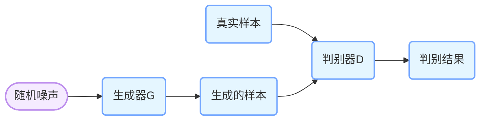

# 模型训练中的对抗学习技术在网络安全防御中的前沿应用

> 关键词：对抗学习技术、模型训练、网络安全防御、前沿应用、生成对抗网络

> 摘要：本文围绕模型训练中的对抗学习技术在网络安全防御中的前沿应用展开深入探讨。首先介绍了相关背景，包括目的范围、预期读者等内容。接着阐述了对抗学习技术的核心概念与联系，给出了原理和架构的文本示意图及Mermaid流程图。详细讲解了核心算法原理，通过Python源代码进行阐述，并介绍了相关数学模型和公式。结合项目实战，给出代码实际案例并进行详细解释。分析了对抗学习技术在网络安全防御中的实际应用场景，推荐了学习资源、开发工具框架以及相关论文著作。最后总结了未来发展趋势与挑战，还提供了常见问题与解答和扩展阅读参考资料，旨在为网络安全领域的研究者和从业者提供全面的技术参考。

## 1. 背景介绍 
### 1.1 目的和范围
随着信息技术的飞速发展，网络安全问题日益严峻。传统的网络安全防御技术在面对日益复杂多变的攻击手段时，逐渐暴露出一定的局限性。模型训练中的对抗学习技术作为一种新兴的技术手段，为网络安全防御带来了新的思路和方法。本文的目的在于深入研究对抗学习技术在网络安全防御中的前沿应用，详细探讨其原理、算法、实际应用场景等方面的内容，为网络安全领域的研究和实践提供参考。范围涵盖了对抗学习技术的基本概念、核心算法、数学模型，以及在网络安全防御中的具体应用案例等。

### 1.2 预期读者
本文预期读者主要包括网络安全领域的研究人员、开发者、安全分析师，以及对人工智能和网络安全交叉领域感兴趣的专业人士。对于希望深入了解对抗学习技术在网络安全防御中应用的初学者，也可以通过本文获得系统的知识和技术指导。

### 1.3 文档结构概述
本文共分为十个部分。第一部分为背景介绍，阐述了文章的目的、范围、预期读者和文档结构概述，并对相关术语进行了定义。第二部分介绍对抗学习技术的核心概念与联系，包括原理和架构的文本示意图及Mermaid流程图。第三部分详细讲解核心算法原理，并通过Python源代码进行说明。第四部分介绍数学模型和公式，并举例说明。第五部分进行项目实战，包括开发环境搭建、源代码实现和代码解读。第六部分分析对抗学习技术在网络安全防御中的实际应用场景。第七部分推荐学习资源、开发工具框架和相关论文著作。第八部分总结未来发展趋势与挑战。第九部分为附录，提供常见问题与解答。第十部分列出扩展阅读和参考资料。

### 1.4 术语表
#### 1.4.1 核心术语定义
- **对抗学习技术**：是一种机器学习技术，通过两个或多个模型之间的对抗博弈来提高模型的性能和鲁棒性。在对抗学习中，通常存在一个生成模型和一个判别模型，生成模型试图生成与真实数据相似的样本，而判别模型则试图区分生成的样本和真实样本。
- **模型训练**：指通过使用大量的数据对机器学习模型进行优化，使得模型能够学习到数据中的模式和规律，从而在新的数据上取得良好的预测性能。
- **网络安全防御**：是指采取一系列措施来保护计算机网络免受未经授权的访问、攻击、破坏或数据泄露等威胁。
- **生成对抗网络（GAN）**：是一种典型的对抗学习模型，由生成器和判别器组成。生成器负责生成数据，判别器负责判断输入的数据是真实数据还是生成的数据。

#### 1.4.2 相关概念解释
- **鲁棒性**：指模型在面对噪声、异常值或对抗攻击时，仍能保持较好的性能和稳定性。
- **过拟合**：指模型在训练数据上表现良好，但在新的数据上表现不佳的现象。对抗学习技术可以在一定程度上缓解过拟合问题。
- **特征提取**：指从原始数据中提取出能够代表数据特征的信息，以便机器学习模型能够更好地处理和理解数据。

#### 1.4.3 缩略词列表
- **GAN**：Generative Adversarial Networks（生成对抗网络）
- **DNN**：Deep Neural Networks（深度神经网络）
- **CNN**：Convolutional Neural Networks（卷积神经网络）

## 2. 核心概念与联系 
### 核心概念原理
对抗学习技术的核心思想源于博弈论，通过两个或多个模型之间的对抗博弈来不断提升模型的性能。以生成对抗网络（GAN）为例，其包含一个生成器（Generator）和一个判别器（Discriminator）。

生成器的任务是接收一个随机噪声向量作为输入，通过一系列的神经网络层将其转换为与真实数据相似的样本。例如，在图像生成任务中，生成器可以将随机噪声转换为逼真的图像。判别器则接收真实数据样本和生成器生成的样本作为输入，判断输入的样本是真实数据还是生成的数据。

在训练过程中，生成器和判别器进行对抗训练。生成器试图生成能够欺骗判别器的样本，而判别器则试图准确地区分真实样本和生成样本。通过不断地迭代训练，生成器和判别器的性能都得到了提升，最终生成器能够生成高质量的样本，判别器也能够准确地进行判别。

### 架构的文本示意图
```plaintext
               +----------------+
               |   随机噪声     |
               +----------------+
                      |
                      v
               +----------------+
               |   生成器 (G)   |
               +----------------+
                      |
                      v
 +----------------+        +----------------+
 |  生成的样本   |        |   真实样本     |
 +----------------+        +----------------+
          |                      |
          v                      v
               +----------------+
               |  判别器 (D)    |
               +----------------+
                      |
                      v
              +----------------+
              |  判别结果      |
              +----------------+
```

### Mermaid流程图


## 3. 核心算法原理 & 具体操作步骤 
### 核心算法原理
以生成对抗网络（GAN）为例，其核心算法基于博弈论中的极小极大原理。生成器和判别器的目标可以用以下公式表示：

生成器的目标是最大化判别器将其生成的样本判断为真实样本的概率，即最小化以下损失函数：
$$ \min_G V(D, G) = \mathbb{E}_{z \sim p_z(z)}[\log(1 - D(G(z)))] $$

判别器的目标是最大化区分真实样本和生成样本的能力，即最大化以下损失函数：
$$ \max_D V(D, G) = \mathbb{E}_{x \sim p_{data}(x)}[\log(D(x))] + \mathbb{E}_{z \sim p_z(z)}[\log(1 - D(G(z)))] $$

其中，$x$ 表示真实样本，$z$ 表示随机噪声，$p_{data}(x)$ 是真实数据的分布，$p_z(z)$ 是随机噪声的分布，$G(z)$ 是生成器生成的样本，$D(x)$ 是判别器对样本 $x$ 的判别结果（取值范围在 $[0, 1]$ 之间，越接近 1 表示判别为真实样本的概率越大）。

### 具体操作步骤
1. **初始化参数**：随机初始化生成器 $G$ 和判别器 $D$ 的参数。
2. **迭代训练**：
    - **训练判别器**：
        - 从真实数据分布 $p_{data}(x)$ 中采样一批真实样本 $x$。
        - 从随机噪声分布 $p_z(z)$ 中采样一批随机噪声 $z$，通过生成器 $G$ 生成一批样本 $G(z)$。
        - 计算判别器的损失函数 $V(D, G)$，并使用梯度上升法更新判别器 $D$ 的参数，以最大化损失函数。
    - **训练生成器**：
        - 从随机噪声分布 $p_z(z)$ 中采样一批随机噪声 $z$。
        - 计算生成器的损失函数 $V(D, G)$，并使用梯度下降法更新生成器 $G$ 的参数，以最小化损失函数。
3. **终止条件**：当达到预设的训练轮数或损失函数收敛时，停止训练。

### Python源代码实现
```python
import torch
import torch.nn as nn
import torch.optim as optim
import numpy as np

# 定义生成器
class Generator(nn.Module):
    def __init__(self, input_dim, output_dim):
        super(Generator, self).__init__()
        self.model = nn.Sequential(
            nn.Linear(input_dim, 128),
            nn.LeakyReLU(0.2),
            nn.Linear(128, output_dim),
            nn.Tanh()
        )

    def forward(self, z):
        return self.model(z)

# 定义判别器
class Discriminator(nn.Module):
    def __init__(self, input_dim):
        super(Discriminator, self).__init__()
        self.model = nn.Sequential(
            nn.Linear(input_dim, 128),
            nn.LeakyReLU(0.2),
            nn.Linear(128, 1),
            nn.Sigmoid()
        )

    def forward(self, x):
        return self.model(x)

# 超参数设置
input_dim = 100
output_dim = 784
batch_size = 32
epochs = 100
learning_rate = 0.0002

# 初始化生成器和判别器
generator = Generator(input_dim, output_dim)
discriminator = Discriminator(output_dim)

# 定义优化器和损失函数
g_optimizer = optim.Adam(generator.parameters(), lr=learning_rate)
d_optimizer = optim.Adam(discriminator.parameters(), lr=learning_rate)
criterion = nn.BCELoss()

# 模拟真实数据
real_data = torch.randn(batch_size, output_dim)

# 训练过程
for epoch in range(epochs):
    # 训练判别器
    d_optimizer.zero_grad()

    # 真实样本
    real_labels = torch.ones(batch_size, 1)
    real_output = discriminator(real_data)
    d_real_loss = criterion(real_output, real_labels)

    # 生成样本
    z = torch.randn(batch_size, input_dim)
    fake_data = generator(z)
    fake_labels = torch.zeros(batch_size, 1)
    fake_output = discriminator(fake_data.detach())
    d_fake_loss = criterion(fake_output, fake_labels)

    # 判别器总损失
    d_loss = d_real_loss + d_fake_loss
    d_loss.backward()
    d_optimizer.step()

    # 训练生成器
    g_optimizer.zero_grad()
    z = torch.randn(batch_size, input_dim)
    fake_data = generator(z)
    real_labels = torch.ones(batch_size, 1)
    output = discriminator(fake_data)
    g_loss = criterion(output, real_labels)
    g_loss.backward()
    g_optimizer.step()

    if epoch % 10 == 0:
        print(f'Epoch [{epoch}/{epochs}], D_loss: {d_loss.item():.4f}, G_loss: {g_loss.item():.4f}')
```

## 4. 数学模型和公式 & 详细讲解 & 举例说明 
### 数学模型和公式
在生成对抗网络（GAN）中，核心的数学模型和公式主要围绕生成器和判别器的损失函数展开。

#### 生成器损失函数
生成器的目标是生成能够欺骗判别器的样本，其损失函数可以表示为：
$$ \min_G V(D, G) = \mathbb{E}_{z \sim p_z(z)}[\log(1 - D(G(z)))] $$

详细讲解：
- $z$ 是从随机噪声分布 $p_z(z)$ 中采样得到的随机噪声向量。
- $G(z)$ 是生成器根据随机噪声 $z$ 生成的样本。
- $D(G(z))$ 是判别器对生成样本 $G(z)$ 的判别结果，取值范围在 $[0, 1]$ 之间。
- $\log(1 - D(G(z)))$ 表示生成样本被判别器判断为假样本的对数损失。生成器的目标是最小化这个损失，即让判别器尽可能将其生成的样本判断为真实样本。

#### 判别器损失函数
判别器的目标是准确区分真实样本和生成样本，其损失函数可以表示为：
$$ \max_D V(D, G) = \mathbb{E}_{x \sim p_{data}(x)}[\log(D(x))] + \mathbb{E}_{z \sim p_z(z)}[\log(1 - D(G(z)))] $$

详细讲解：
- $x$ 是从真实数据分布 $p_{data}(x)$ 中采样得到的真实样本。
- $D(x)$ 是判别器对真实样本 $x$ 的判别结果。
- $\log(D(x))$ 表示真实样本被判别器判断为真实样本的对数损失。判别器希望最大化这个值，即尽可能准确地将真实样本判断为真实样本。
- $\mathbb{E}_{z \sim p_z(z)}[\log(1 - D(G(z)))]$ 与生成器损失函数中的该项含义相同，判别器希望最大化这个值，即尽可能准确地将生成样本判断为假样本。

### 举例说明
假设我们有一个简单的一维数据分布，真实数据分布 $p_{data}(x)$ 是均值为 0，标准差为 1 的正态分布。随机噪声分布 $p_z(z)$ 是均值为 0，标准差为 1 的正态分布。

生成器 $G$ 是一个简单的线性函数 $G(z) = az + b$，判别器 $D$ 是一个逻辑回归模型 $D(x) = \frac{1}{1 + e^{-cx - d}}$。

#### 训练判别器
- 从真实数据分布 $p_{data}(x)$ 中采样一批真实样本 $x_1, x_2, \cdots, x_n$。
- 从随机噪声分布 $p_z(z)$ 中采样一批随机噪声 $z_1, z_2, \cdots, z_n$，通过生成器 $G$ 生成一批样本 $G(z_1), G(z_2), \cdots, G(z_n)$。
- 计算判别器对真实样本的判别结果 $D(x_1), D(x_2), \cdots, D(x_n)$ 和对生成样本的判别结果 $D(G(z_1)), D(G(z_2)), \cdots, D(G(z_n))$。
- 计算判别器的损失函数：
  - 对于真实样本，损失为 $\sum_{i = 1}^{n} \log(D(x_i))$。
  - 对于生成样本，损失为 $\sum_{i = 1}^{n} \log(1 - D(G(z_i)))$。
  - 判别器总损失为两者之和。

#### 训练生成器
- 从随机噪声分布 $p_z(z)$ 中采样一批随机噪声 $z_1, z_2, \cdots, z_n$，通过生成器 $G$ 生成一批样本 $G(z_1), G(z_2), \cdots, G(z_n)$。
- 计算判别器对生成样本的判别结果 $D(G(z_1)), D(G(z_2)), \cdots, D(G(z_n))$。
- 计算生成器的损失函数：$\sum_{i = 1}^{n} \log(1 - D(G(z_i)))$。

通过不断迭代训练，生成器和判别器的参数会不断更新，最终生成器能够生成接近真实数据分布的样本，判别器能够准确地区分真实样本和生成样本。

## 5. 项目实战：代码实际案例和详细解释说明 
### 5.1  开发环境搭建
#### 操作系统
推荐使用Linux系统，如Ubuntu 18.04及以上版本，也可以使用Windows 10或macOS。

#### 编程语言和库
- **Python**：建议使用Python 3.7及以上版本。
- **PyTorch**：用于深度学习模型的构建和训练。可以通过以下命令安装：
```bash
pip install torch torchvision
```
- **NumPy**：用于数值计算。可以通过以下命令安装：
```bash
pip install numpy
```

#### 开发工具
推荐使用Jupyter Notebook或PyCharm作为开发工具。

### 5.2  源代码详细实现和代码解读
以下是一个使用PyTorch实现的简单生成对抗网络（GAN）用于手写数字图像生成的代码示例：

```python
import torch
import torch.nn as nn
import torch.optim as optim
import torchvision
import torchvision.datasets as datasets
import torchvision.transforms as transforms
from torch.utils.data import DataLoader

# 定义生成器
class Generator(nn.Module):
    def __init__(self, input_dim, output_dim):
        super(Generator, self).__init__()
        self.model = nn.Sequential(
            nn.Linear(input_dim, 256),
            nn.LeakyReLU(0.2),
            nn.Linear(256, 512),
            nn.LeakyReLU(0.2),
            nn.Linear(512, output_dim),
            nn.Tanh()
        )

    def forward(self, z):
        return self.model(z)

# 定义判别器
class Discriminator(nn.Module):
    def __init__(self, input_dim):
        super(Discriminator, self).__init__()
        self.model = nn.Sequential(
            nn.Linear(input_dim, 512),
            nn.LeakyReLU(0.2),
            nn.Linear(512, 256),
            nn.LeakyReLU(0.2),
            nn.Linear(256, 1),
            nn.Sigmoid()
        )

    def forward(self, x):
        return self.model(x)

# 超参数设置
input_dim = 100
output_dim = 784  # 28x28 图像
batch_size = 32
epochs = 100
learning_rate = 0.0002

# 数据加载
transform = transforms.Compose([
    transforms.ToTensor(),
    transforms.Normalize((0.5,), (0.5,))
])

train_dataset = datasets.MNIST(root='./data', train=True,
                               transform=transform, download=True)
train_loader = DataLoader(train_dataset, batch_size=batch_size, shuffle=True)

# 初始化生成器和判别器
generator = Generator(input_dim, output_dim)
discriminator = Discriminator(output_dim)

# 定义优化器和损失函数
g_optimizer = optim.Adam(generator.parameters(), lr=learning_rate)
d_optimizer = optim.Adam(discriminator.parameters(), lr=learning_rate)
criterion = nn.BCELoss()

# 训练过程
for epoch in range(epochs):
    for i, (real_images, _) in enumerate(train_loader):
        real_images = real_images.view(-1, output_dim)

        # 训练判别器
        d_optimizer.zero_grad()

        # 真实样本
        real_labels = torch.ones(real_images.size(0), 1)
        real_output = discriminator(real_images)
        d_real_loss = criterion(real_output, real_labels)

        # 生成样本
        z = torch.randn(real_images.size(0), input_dim)
        fake_images = generator(z)
        fake_labels = torch.zeros(real_images.size(0), 1)
        fake_output = discriminator(fake_images.detach())
        d_fake_loss = criterion(fake_output, fake_labels)

        # 判别器总损失
        d_loss = d_real_loss + d_fake_loss
        d_loss.backward()
        d_optimizer.step()

        # 训练生成器
        g_optimizer.zero_grad()
        z = torch.randn(real_images.size(0), input_dim)
        fake_images = generator(z)
        real_labels = torch.ones(real_images.size(0), 1)
        output = discriminator(fake_images)
        g_loss = criterion(output, real_labels)
        g_loss.backward()
        g_optimizer.step()

    if epoch % 10 == 0:
        print(f'Epoch [{epoch}/{epochs}], D_loss: {d_loss.item():.4f}, G_loss: {g_loss.item():.4f}')
```

### 5.3  代码解读与分析
#### 生成器
- `Generator` 类继承自 `nn.Module`，定义了一个简单的全连接神经网络作为生成器。
- 输入维度为 `input_dim`，输出维度为 `output_dim`。
- 使用 `LeakyReLU` 作为激活函数，最后一层使用 `Tanh` 激活函数将输出映射到 $[-1, 1]$ 范围内。

#### 判别器
- `Discriminator` 类继承自 `nn.Module`，定义了一个简单的全连接神经网络作为判别器。
- 输入维度为 `output_dim`，输出维度为 1。
- 使用 `LeakyReLU` 作为激活函数，最后一层使用 `Sigmoid` 激活函数将输出映射到 $[0, 1]$ 范围内，表示样本为真实样本的概率。

#### 数据加载
- 使用 `torchvision.datasets.MNIST` 加载MNIST手写数字数据集。
- 使用 `transforms` 对数据进行预处理，包括将图像转换为张量和归一化处理。
- 使用 `DataLoader` 批量加载数据。

#### 训练过程
- **训练判别器**：
  - 从真实数据中采样一批真实图像，计算判别器对真实图像的判别结果和损失。
  - 从随机噪声中生成一批假图像，计算判别器对假图像的判别结果和损失。
  - 将两个损失相加得到判别器的总损失，使用反向传播更新判别器的参数。
- **训练生成器**：
  - 从随机噪声中生成一批假图像，计算判别器对假图像的判别结果。
  - 计算生成器的损失，使用反向传播更新生成器的参数。

通过不断迭代训练，生成器能够生成越来越逼真的手写数字图像，判别器能够准确地区分真实图像和生成图像。

## 6. 实际应用场景 
### 恶意软件检测
在恶意软件检测中，传统的基于特征的检测方法往往难以应对不断变化的恶意软件变种。对抗学习技术可以用于生成对抗样本，模拟恶意软件的变种，从而增强检测模型的鲁棒性。

具体来说，可以使用生成对抗网络（GAN）生成与真实恶意软件特征相似的对抗样本，将这些对抗样本加入到训练数据中，让检测模型学习到更多的恶意软件特征，提高检测模型在面对未知恶意软件变种时的检测准确率。

### 入侵检测
在网络入侵检测中，攻击者可能会采用各种手段来逃避检测系统的监测。对抗学习技术可以用于生成对抗攻击样本，模拟攻击者的攻击行为，从而评估和改进入侵检测系统的性能。

例如，通过生成对抗样本对入侵检测系统进行攻击，观察系统的响应，找出系统的漏洞和薄弱环节。然后，根据这些信息对入侵检测系统进行优化和改进，提高系统的安全性和鲁棒性。

### 数据加密与隐私保护
对抗学习技术可以用于数据加密和隐私保护。在数据传输和存储过程中，为了保护数据的隐私和安全，可以使用生成对抗网络生成虚假数据，将真实数据与虚假数据混合在一起，从而增加数据的复杂性和安全性。

例如，在医疗数据共享中，为了保护患者的隐私，可以使用对抗学习技术生成虚假的医疗数据，将其与真实的医疗数据混合，然后将混合后的数据共享给第三方。这样，即使第三方获取了数据，也难以区分哪些是真实数据，哪些是虚假数据，从而保护了患者的隐私。

### 网络流量预测与异常检测
对抗学习技术可以用于网络流量预测和异常检测。通过训练生成对抗网络，可以学习到网络流量的分布和模式，从而预测未来的网络流量。同时，利用生成对抗网络生成的样本与真实网络流量进行比较，可以检测出网络中的异常流量。

例如，在企业网络中，通过对正常网络流量进行建模和训练生成对抗网络，可以预测未来的网络流量。当检测到网络流量与预测值偏差较大时，就可以判断可能存在异常流量，如网络攻击或异常数据传输。

## 7. 工具和资源推荐
### 7.1 学习资源推荐
#### 7.1.1 书籍推荐
- 《深度学习》（Deep Learning）：由Ian Goodfellow、Yoshua Bengio和Aaron Courville所著，是深度学习领域的经典教材，涵盖了深度学习的基本概念、算法和应用。
- 《Python深度学习》（Deep Learning with Python）：由Francois Chollet所著，介绍了如何使用Python和Keras库进行深度学习模型的开发和训练。
- 《生成对抗网络实战》（GANs in Action）：由Jakub Langr和Vladimir Bok所著，详细介绍了生成对抗网络的原理、算法和应用案例。

#### 7.1.2 在线课程
- Coursera上的“深度学习专项课程”（Deep Learning Specialization）：由Andrew Ng教授授课，涵盖了深度学习的各个方面，包括神经网络、卷积神经网络、循环神经网络等。
- edX上的“生成对抗网络基础”（Foundations of Generative Adversarial Networks）：介绍了生成对抗网络的基本概念、算法和应用。
- Udemy上的“对抗学习实战：从基础到高级”（Adversarial Learning in Practice: From Basics to Advanced）：通过实际案例介绍了对抗学习技术的应用和实践。

#### 7.1.3 技术博客和网站
- Medium：有很多关于深度学习和对抗学习的技术博客文章，如Towards Data Science、The AI Summer等。
- arXiv：是一个预印本服务器，提供了大量关于深度学习和对抗学习的最新研究论文。
- GitHub：可以找到很多开源的对抗学习项目和代码示例。

### 7.2 开发工具框架推荐
#### 7.2.1 IDE和编辑器
- PyCharm：是一款专业的Python集成开发环境，提供了丰富的代码编辑、调试和项目管理功能。
- Jupyter Notebook：是一个交互式的开发环境，适合进行数据分析、模型训练和可视化。
- Visual Studio Code：是一款轻量级的代码编辑器，支持多种编程语言和插件扩展。

#### 7.2.2 调试和性能分析工具
- PyTorch Profiler：是PyTorch提供的性能分析工具，可以帮助开发者分析模型的训练时间、内存使用等性能指标。
- TensorBoard：是TensorFlow提供的可视化工具，也可以用于PyTorch模型的可视化和调试。
- NVIDIA Nsight Systems：是一款针对GPU的性能分析工具，可以帮助开发者优化GPU代码的性能。

#### 7.2.3 相关框架和库
- PyTorch：是一个开源的深度学习框架，提供了丰富的神经网络层和优化算法，支持GPU加速。
- TensorFlow：是另一个广泛使用的深度学习框架，提供了高级的模型构建和训练接口。
- Scikit-learn：是一个用于机器学习的Python库，提供了各种机器学习算法和工具，如分类、回归、聚类等。

### 7.3 相关论文著作推荐
#### 7.3.1 经典论文
- “Generative Adversarial Nets”：由Ian Goodfellow等人发表，首次提出了生成对抗网络（GAN）的概念。
- “Adversarial Machine Learning at Scale”：探讨了对抗学习在大规模数据集上的应用和挑战。
- “Explaining and Harnessing Adversarial Examples”：分析了对抗样本的产生原因和应用。

#### 7.3.2 最新研究成果
- 可以关注顶级学术会议如NeurIPS、ICML、CVPR等的论文，了解对抗学习技术的最新研究进展。
- 一些知名的研究机构如OpenAI、Google Brain等也会发布关于对抗学习的最新研究成果。

#### 7.3.3 应用案例分析
- 可以在学术数据库如IEEE Xplore、ACM Digital Library等查找关于对抗学习技术在网络安全防御中的应用案例分析论文，了解实际应用中的经验和挑战。

## 8. 总结：未来发展趋势与挑战
### 未来发展趋势
#### 多模态对抗学习
随着数据类型的不断丰富，未来的对抗学习技术将不仅仅局限于单一模态的数据，如图像、文本等，而是会向多模态数据方向发展。例如，将图像和文本信息结合起来进行对抗学习，能够更全面地模拟真实场景，提高模型的性能和鲁棒性。

#### 强化学习与对抗学习的融合
强化学习和对抗学习都是机器学习领域的重要分支，将两者融合可以为网络安全防御带来新的思路和方法。例如，使用强化学习来优化对抗学习中的策略，使模型能够在动态变化的环境中更好地应对攻击。

#### 对抗学习在物联网安全中的应用
随着物联网的快速发展，物联网设备的安全问题日益突出。对抗学习技术可以用于物联网设备的安全检测和防护，如检测物联网设备中的异常行为、生成对抗样本对物联网安全系统进行测试等。

### 挑战
#### 计算资源需求
对抗学习技术通常需要大量的计算资源来进行模型训练，特别是在处理大规模数据集和复杂模型时，计算资源的需求会更加显著。因此，如何在有限的计算资源下提高对抗学习的效率是一个亟待解决的问题。

#### 对抗样本的可迁移性
对抗样本的可迁移性是指在一个模型上生成的对抗样本可以在其他模型上也起到攻击作用。这一特性给网络安全防御带来了很大的挑战，因为攻击者可以利用对抗样本的可迁移性对多个模型进行攻击。如何有效地防御可迁移性对抗样本是未来研究的一个重要方向。

#### 模型的鲁棒性评估
目前，对于对抗学习模型的鲁棒性评估还没有一个统一的标准和方法。不同的评估指标和方法可能会得出不同的结果，这给模型的鲁棒性评估带来了一定的困难。因此，需要建立一套科学、合理的模型鲁棒性评估体系，以准确评估对抗学习模型在网络安全防御中的性能。

## 9. 附录：常见问题与解答
### 什么是对抗学习技术？
对抗学习技术是一种机器学习技术，通过两个或多个模型之间的对抗博弈来提高模型的性能和鲁棒性。在对抗学习中，通常存在一个生成模型和一个判别模型，生成模型试图生成与真实数据相似的样本，而判别模型则试图区分生成的样本和真实样本。

### 对抗学习技术在网络安全防御中有哪些应用？
对抗学习技术在网络安全防御中有多种应用，包括恶意软件检测、入侵检测、数据加密与隐私保护、网络流量预测与异常检测等。通过生成对抗样本，可以增强检测模型的鲁棒性，评估和改进入侵检测系统的性能，保护数据的隐私和安全，以及检测网络中的异常流量。

### 如何训练一个生成对抗网络（GAN）？
训练一个生成对抗网络通常需要以下步骤：
1. 初始化生成器和判别器的参数。
2. 从真实数据分布中采样一批真实样本，从随机噪声分布中采样一批随机噪声。
3. 使用生成器根据随机噪声生成一批样本。
4. 训练判别器，使其能够区分真实样本和生成样本。
5. 训练生成器，使其能够生成能够欺骗判别器的样本。
6. 重复步骤2-5，直到达到预设的训练轮数或损失函数收敛。

### 对抗学习技术存在哪些挑战？
对抗学习技术存在一些挑战，包括计算资源需求大、对抗样本的可迁移性和模型的鲁棒性评估困难等。计算资源需求大是因为对抗学习通常需要大量的计算资源来进行模型训练。对抗样本的可迁移性使得攻击者可以利用在一个模型上生成的对抗样本对其他模型进行攻击。模型的鲁棒性评估困难是因为目前还没有一个统一的标准和方法来评估对抗学习模型的鲁棒性。

## 10. 扩展阅读 & 参考资料
### 扩展阅读
- 《人工智能安全》：介绍了人工智能在安全领域的应用和挑战，包括对抗学习技术在网络安全中的应用。
- 《深度学习实战：基于Python和TensorFlow》：通过实际案例介绍了深度学习的应用和实践，包括生成对抗网络的实现。

### 参考资料
- Goodfellow, I. J., et al. (2014). Generative adversarial nets. Advances in neural information processing systems.
- Madry, A., et al. (2017). Towards deep learning models resistant to adversarial attacks. arXiv preprint arXiv:1706.06083.
- Szegedy, C., et al. (2013). Intriguing properties of neural networks. arXiv preprint arXiv:1312.6199.

作者：AI天才研究院/AI Genius Institute & 禅与计算机程序设计艺术 /Zen And The Art of Computer Programming