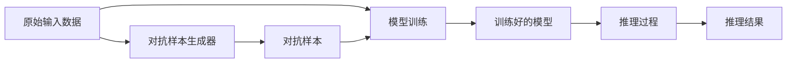

# 模型训练中的对抗训练策略在提高推理鲁棒性方面的创新

> 关键词：模型训练、对抗训练策略、推理鲁棒性、创新方法、深度学习

> 摘要：本文围绕模型训练中的对抗训练策略在提高推理鲁棒性方面的创新展开。首先介绍了相关背景知识，包括目的、预期读者等内容。接着详细阐述了对抗训练的核心概念、算法原理、数学模型。通过项目实战展示了如何运用对抗训练来提高模型推理鲁棒性，并分析了其在不同实际场景中的应用。同时推荐了学习、开发工具和相关论文著作。最后总结了未来发展趋势与挑战，解答常见问题并提供扩展阅读和参考资料，旨在为研究和应用对抗训练策略的人员提供全面且深入的技术指导。

## 1. 背景介绍 
### 1.1 目的和范围
在当今深度学习快速发展的时代，模型的推理鲁棒性至关重要。推理鲁棒性指的是模型在面对各种复杂、不确定甚至恶意输入时，仍能准确、稳定地输出结果的能力。然而，现有的许多模型在实际应用中容易受到诸如对抗样本等因素的干扰，导致推理结果出现严重偏差。对抗训练策略作为一种有效的方法，旨在通过引入对抗性的训练样本，使模型学习到更加鲁棒的特征表示，从而提高推理鲁棒性。

本文的范围将涵盖对抗训练策略的基本概念、核心算法原理、数学模型、实际应用案例以及相关的工具和资源推荐等方面。通过深入探讨对抗训练策略在提高推理鲁棒性方面的创新，为研究人员和开发者提供全面的技术参考。

### 1.2 预期读者
本文的预期读者主要包括以下几类人群：
- 深度学习研究人员：对模型鲁棒性和对抗训练技术感兴趣，希望深入了解对抗训练策略的创新方法和原理，为进一步的研究提供思路。
- 人工智能开发者：在实际项目中需要提高模型的推理鲁棒性，希望学习对抗训练策略的具体实现方法和应用技巧。
- 高校相关专业的学生：正在学习深度学习和人工智能课程，希望通过本文了解对抗训练策略的前沿知识，拓宽自己的知识面。

### 1.3 文档结构概述
本文将按照以下结构进行组织：
- 核心概念与联系：介绍对抗训练和推理鲁棒性的核心概念，以及它们之间的联系，并通过文本示意图和Mermaid流程图进行直观展示。
- 核心算法原理 & 具体操作步骤：详细讲解对抗训练的核心算法原理，并使用Python源代码进行具体实现和操作步骤的演示。
- 数学模型和公式 & 详细讲解 & 举例说明：给出对抗训练的数学模型和相关公式，并进行详细讲解和举例说明。
- 项目实战：通过实际项目案例，展示如何在开发环境中搭建对抗训练系统，以及源代码的详细实现和解读。
- 实际应用场景：分析对抗训练策略在不同实际场景中的应用，如计算机视觉、自然语言处理等。
- 工具和资源推荐：推荐学习对抗训练策略的相关书籍、在线课程、技术博客和网站，以及开发工具、框架和相关论文著作。
- 总结：未来发展趋势与挑战：总结对抗训练策略在提高推理鲁棒性方面的发展趋势和面临的挑战。
- 附录：常见问题与解答：解答读者在学习和应用对抗训练策略过程中常见的问题。
- 扩展阅读 & 参考资料：提供进一步学习和研究的扩展阅读材料和参考资料。

### 1.4 术语表
#### 1.4.1 核心术语定义
- **对抗训练（Adversarial Training）**：一种训练方法，通过在训练过程中引入对抗样本，使模型学习到更加鲁棒的特征表示，从而提高模型的鲁棒性。
- **推理鲁棒性（Inference Robustness）**：模型在面对各种复杂、不确定甚至恶意输入时，仍能准确、稳定地输出结果的能力。
- **对抗样本（Adversarial Example）**：通过对原始输入数据进行微小的、精心设计的扰动，使得模型在这些样本上产生错误的输出，但人类却难以察觉这些扰动。
- **生成对抗网络（Generative Adversarial Networks，GANs）**：一种深度学习模型，由生成器和判别器组成，通过对抗训练的方式进行学习。

#### 1.4.2 相关概念解释
- **鲁棒性（Robustness）**：系统在受到各种干扰和不确定性因素影响时，仍能保持其性能和功能的能力。在深度学习中，鲁棒性通常指模型在面对噪声、对抗样本等干扰时的稳定性和准确性。
- **过拟合（Overfitting）**：模型在训练数据上表现良好，但在测试数据或实际应用中表现不佳的现象。对抗训练可以在一定程度上缓解过拟合问题，提高模型的泛化能力。
- **泛化能力（Generalization Ability）**：模型在未见过的数据上的表现能力。一个具有良好泛化能力的模型能够在不同的数据集和场景中都能取得较好的性能。

#### 1.4.3 缩略词列表
- **GANs**：Generative Adversarial Networks（生成对抗网络）
- **PGD**：Projected Gradient Descent（投影梯度下降）
- **FGSM**：Fast Gradient Sign Method（快速梯度符号法）

## 2. 核心概念与联系 
### 核心概念原理
#### 对抗训练
对抗训练的核心思想是通过引入对抗样本，使模型在训练过程中学习到更加鲁棒的特征表示。具体来说，对抗样本是通过对原始输入数据进行微小的、精心设计的扰动得到的，这些扰动可以使得模型在这些样本上产生错误的输出，但人类却难以察觉这些扰动。在对抗训练中，模型不仅要学习正确分类原始输入数据，还要学习正确分类对抗样本，从而提高模型的鲁棒性。

#### 推理鲁棒性
推理鲁棒性是指模型在面对各种复杂、不确定甚至恶意输入时，仍能准确、稳定地输出结果的能力。在实际应用中，模型可能会受到噪声、对抗样本等因素的干扰，导致推理结果出现偏差。提高推理鲁棒性可以使模型更加可靠和稳定，减少因输入数据的不确定性而导致的错误。

### 架构的文本示意图
```plaintext
原始输入数据 --> 对抗样本生成器 --> 对抗样本
|                                        |
v                                        v
模型训练 --> 训练好的模型 --> 推理过程 --> 推理结果
```
该示意图展示了对抗训练的基本流程。首先，从原始输入数据中生成对抗样本，然后将原始输入数据和对抗样本一起用于模型训练。训练好的模型在推理过程中，能够对各种输入数据（包括对抗样本）进行准确的推理，从而提高推理鲁棒性。

### Mermaid 流程图


## 3. 核心算法原理 & 具体操作步骤 
### 核心算法原理
在对抗训练中，常用的算法有快速梯度符号法（FGSM）和投影梯度下降法（PGD）。下面以FGSM为例，详细讲解其算法原理。

FGSM的核心思想是通过计算损失函数关于输入数据的梯度，然后根据梯度的符号对输入数据进行扰动，得到对抗样本。具体步骤如下：
1. 计算损失函数 $L(\theta, x, y)$ 关于输入数据 $x$ 的梯度 $\nabla_x L(\theta, x, y)$，其中 $\theta$ 是模型的参数，$y$ 是真实标签。
2. 根据梯度的符号对输入数据进行扰动，得到对抗样本 $x_{adv} = x + \epsilon \cdot sign(\nabla_x L(\theta, x, y))$，其中 $\epsilon$ 是扰动的强度。

### 具体操作步骤及Python源代码实现
```python
import torch
import torch.nn as nn
import torch.optim as optim

# 定义一个简单的模型
class SimpleModel(nn.Module):
    def __init__(self):
        super(SimpleModel, self).__init__()
        self.fc1 = nn.Linear(10, 20)
        self.fc2 = nn.Linear(20, 2)

    def forward(self, x):
        x = torch.relu(self.fc1(x))
        x = self.fc2(x)
        return x

# 初始化模型和损失函数
model = SimpleModel()
criterion = nn.CrossEntropyLoss()
optimizer = optim.SGD(model.parameters(), lr=0.01)

# 生成一些随机数据
x = torch.randn(32, 10)
y = torch.randint(0, 2, (32,))

# FGSM算法实现
def fgsm_attack(model, x, y, epsilon):
    x.requires_grad = True
    output = model(x)
    loss = criterion(output, y)
    model.zero_grad()
    loss.backward()
    data_grad = x.grad.data
    sign_data_grad = data_grad.sign()
    perturbed_image = x + epsilon * sign_data_grad
    perturbed_image = torch.clamp(perturbed_image, 0, 1)
    return perturbed_image

# 进行对抗训练
epsilon = 0.01
for epoch in range(10):
    # 生成对抗样本
    perturbed_x = fgsm_attack(model, x, y, epsilon)
    # 前向传播
    output = model(perturbed_x)
    loss = criterion(output, y)
    # 反向传播和优化
    optimizer.zero_grad()
    loss.backward()
    optimizer.step()
    print(f'Epoch {epoch+1}, Loss: {loss.item()}')
```
### 代码解释
1. **模型定义**：定义了一个简单的全连接神经网络 `SimpleModel`，包含两个全连接层。
2. **数据生成**：生成了一些随机的输入数据 `x` 和对应的标签 `y`。
3. **FGSM攻击函数**：定义了 `fgsm_attack` 函数，用于生成对抗样本。该函数首先计算损失函数关于输入数据的梯度，然后根据梯度的符号对输入数据进行扰动，最后将扰动后的输入数据限制在 $[0, 1]$ 范围内。
4. **对抗训练**：在每个训练周期中，先使用 `fgsm_attack` 函数生成对抗样本，然后将对抗样本输入到模型中进行前向传播，计算损失函数，最后进行反向传播和优化。

## 4. 数学模型和公式 & 详细讲解 & 举例说明 
### 数学模型和公式
#### 损失函数
在对抗训练中，常用的损失函数是交叉熵损失函数。对于一个分类问题，假设模型的输出为 $\hat{y}$，真实标签为 $y$，则交叉熵损失函数定义为：
$$L(\theta, x, y) = - \sum_{i=1}^{C} y_i \log(\hat{y}_i)$$
其中 $C$ 是类别数，$y_i$ 是真实标签的第 $i$ 个分量，$\hat{y}_i$ 是模型输出的第 $i$ 个分量。

#### FGSM算法公式
FGSM算法的核心公式为：
$$x_{adv} = x + \epsilon \cdot sign(\nabla_x L(\theta, x, y))$$
其中 $x$ 是原始输入数据，$x_{adv}$ 是对抗样本，$\epsilon$ 是扰动的强度，$\nabla_x L(\theta, x, y)$ 是损失函数关于输入数据的梯度，$sign(\cdot)$ 是符号函数。

### 详细讲解
#### 损失函数
交叉熵损失函数衡量了模型输出与真实标签之间的差异。在训练过程中，我们的目标是最小化损失函数，使得模型的输出尽可能接近真实标签。

#### FGSM算法
FGSM算法通过计算损失函数关于输入数据的梯度，然后根据梯度的符号对输入数据进行扰动，得到对抗样本。由于梯度表示了损失函数在输入数据上的变化方向，因此沿着梯度的符号方向进行扰动可以使得损失函数增大，从而使模型在对抗样本上产生错误的输出。

### 举例说明
假设我们有一个二分类问题，模型的输出为 $\hat{y} = [0.2, 0.8]$，真实标签为 $y = [0, 1]$。则交叉熵损失函数为：
$$L(\theta, x, y) = - (0 \cdot \log(0.2) + 1 \cdot \log(0.8)) \approx 0.223$$
假设输入数据 $x$ 的维度为 $10$，损失函数关于输入数据的梯度为 $\nabla_x L(\theta, x, y) = [0.1, -0.2, 0.3, -0.4, 0.5, -0.6, 0.7, -0.8, 0.9, -1.0]$，扰动强度 $\epsilon = 0.01$。则对抗样本为：
$$x_{adv} = x + 0.01 \cdot [sign(0.1), sign(-0.2), sign(0.3), sign(-0.4), sign(0.5), sign(-0.6), sign(0.7), sign(-0.8), sign(0.9), sign(-1.0)]$$
$$= x + 0.01 \cdot [1, -1, 1, -1, 1, -1, 1, -1, 1, -1]$$

## 5. 项目实战：代码实际案例和详细解释说明 
### 5.1  开发环境搭建
#### 操作系统
推荐使用Ubuntu 18.04或更高版本的Linux操作系统，也可以使用Windows 10或macOS。

#### 编程语言和框架
- **Python**：推荐使用Python 3.7或更高版本。
- **PyTorch**：一个开源的深度学习框架，用于构建和训练深度学习模型。可以通过以下命令安装：
```bash
pip install torch torchvision
```

#### 其他依赖库
- **NumPy**：用于数值计算。
- **Matplotlib**：用于数据可视化。可以通过以下命令安装：
```bash
pip install numpy matplotlib
```

### 5.2  源代码详细实现和代码解读
```python
import torch
import torch.nn as nn
import torch.optim as optim
import torchvision
import torchvision.transforms as transforms
import matplotlib.pyplot as plt
import numpy as np

# 定义超参数
batch_size = 32
learning_rate = 0.001
num_epochs = 10
epsilon = 0.01

# 数据预处理
transform = transforms.Compose([
    transforms.ToTensor(),
    transforms.Normalize((0.5,), (0.5,))
])

# 加载数据集
trainset = torchvision.datasets.MNIST(root='./data', train=True,
                                      download=True, transform=transform)
trainloader = torch.utils.data.DataLoader(trainset, batch_size=batch_size,
                                          shuffle=True)

testset = torchvision.datasets.MNIST(root='./data', train=False,
                                     download=True, transform=transform)
testloader = torch.utils.data.DataLoader(testset, batch_size=batch_size,
                                         shuffle=False)

# 定义一个简单的卷积神经网络
class SimpleCNN(nn.Module):
    def __init__(self):
        super(SimpleCNN, self).__init__()
        self.conv1 = nn.Conv2d(1, 10, kernel_size=5)
        self.pool = nn.MaxPool2d(2, 2)
        self.conv2 = nn.Conv2d(10, 20, kernel_size=5)
        self.fc1 = nn.Linear(20 * 4 * 4, 50)
        self.fc2 = nn.Linear(50, 10)

    def forward(self, x):
        x = self.pool(torch.relu(self.conv1(x)))
        x = self.pool(torch.relu(self.conv2(x)))
        x = x.view(-1, 20 * 4 * 4)
        x = torch.relu(self.fc1(x))
        x = self.fc2(x)
        return x

# 初始化模型、损失函数和优化器
model = SimpleCNN()
criterion = nn.CrossEntropyLoss()
optimizer = optim.Adam(model.parameters(), lr=learning_rate)

# FGSM算法实现
def fgsm_attack(model, x, y, epsilon):
    x.requires_grad = True
    output = model(x)
    loss = criterion(output, y)
    model.zero_grad()
    loss.backward()
    data_grad = x.grad.data
    sign_data_grad = data_grad.sign()
    perturbed_image = x + epsilon * sign_data_grad
    perturbed_image = torch.clamp(perturbed_image, -1, 1)
    return perturbed_image

# 训练模型
for epoch in range(num_epochs):
    running_loss = 0.0
    for i, data in enumerate(trainloader, 0):
        inputs, labels = data
        # 生成对抗样本
        perturbed_inputs = fgsm_attack(model, inputs, labels, epsilon)
        # 前向传播
        outputs = model(perturbed_inputs)
        loss = criterion(outputs, labels)
        # 反向传播和优化
        optimizer.zero_grad()
        loss.backward()
        optimizer.step()
        running_loss += loss.item()
    print(f'Epoch {epoch+1}, Loss: {running_loss / len(trainloader)}')

# 测试模型
correct = 0
total = 0
with torch.no_grad():
    for data in testloader:
        images, labels = data
        outputs = model(images)
        _, predicted = torch.max(outputs.data, 1)
        total += labels.size(0)
        correct += (predicted == labels).sum().item()

print(f'Accuracy of the network on the 10000 test images: {100 * correct / total}%')
```
### 5.3  代码解读与分析
#### 数据预处理和加载
使用 `torchvision.transforms` 对数据进行预处理，包括将图像转换为张量和归一化。然后使用 `torchvision.datasets.MNIST` 加载MNIST数据集，并使用 `torch.utils.data.DataLoader` 创建数据加载器。

#### 模型定义
定义了一个简单的卷积神经网络 `SimpleCNN`，包含两个卷积层、两个全连接层和池化层。

#### FGSM算法实现
与前面的示例类似，定义了 `fgsm_attack` 函数，用于生成对抗样本。

#### 训练过程
在每个训练周期中，从训练数据加载器中获取一批数据，然后使用 `fgsm_attack` 函数生成对抗样本。将对抗样本输入到模型中进行前向传播，计算损失函数，最后进行反向传播和优化。

#### 测试过程
在测试过程中，使用测试数据加载器中的数据对模型进行测试，计算模型的准确率。

通过对抗训练，模型在面对对抗样本时的鲁棒性得到了提高，从而在测试数据上的准确率也可能会有所提升。

## 6. 实际应用场景 
### 计算机视觉
在计算机视觉领域，对抗训练策略可以用于提高图像分类、目标检测、语义分割等任务的推理鲁棒性。例如，在自动驾驶场景中，模型可能会受到光照变化、遮挡、恶意攻击等因素的影响，导致对交通标志、行人等目标的识别出现错误。通过对抗训练，可以使模型学习到更加鲁棒的特征表示，从而提高在复杂环境下的识别准确率。

### 自然语言处理
在自然语言处理领域，对抗训练策略可以用于提高文本分类、情感分析、机器翻译等任务的推理鲁棒性。例如，在垃圾邮件分类任务中，攻击者可能会通过对邮件内容进行微小的修改来绕过垃圾邮件过滤器。通过对抗训练，可以使模型学习到更加鲁棒的文本特征，从而提高对垃圾邮件的识别准确率。

### 金融领域
在金融领域，对抗训练策略可以用于提高风险评估、欺诈检测等任务的推理鲁棒性。例如，在信用卡欺诈检测任务中，攻击者可能会通过伪造交易记录来欺骗检测系统。通过对抗训练，可以使模型学习到更加鲁棒的交易特征，从而提高对欺诈交易的识别准确率。

## 7. 工具和资源推荐
### 7.1 学习资源推荐
#### 7.1.1 书籍推荐
- 《深度学习》（Deep Learning）：由Ian Goodfellow、Yoshua Bengio和Aaron Courville所著，是深度学习领域的经典教材，涵盖了深度学习的基本概念、算法和应用。
- 《Python深度学习》（Deep Learning with Python）：由Francois Chollet所著，介绍了如何使用Python和Keras框架进行深度学习模型的开发和训练。
- 《动手学深度学习》（Dive into Deep Learning）：由李沐、Aston Zhang等所著，提供了丰富的深度学习代码示例和实践教程，适合初学者学习。

#### 7.1.2 在线课程
- Coursera上的“深度学习专项课程”（Deep Learning Specialization）：由Andrew Ng教授授课，包括五门课程，涵盖了深度学习的各个方面。
- edX上的“麻省理工学院：深度学习基础”（MITx: 6.S191x Introduction to Deep Learning）：由麻省理工学院的教授授课，介绍了深度学习的基本原理和应用。
- 哔哩哔哩上的“李宏毅机器学习”课程：由台湾大学的李宏毅教授授课，内容生动有趣，适合初学者学习。

#### 7.1.3 技术博客和网站
- arXiv：一个预印本平台，提供了大量的机器学习和深度学习领域的研究论文。
- Medium：一个技术博客平台，有很多关于深度学习和对抗训练的优质文章。
- Towards Data Science：一个专注于数据科学和机器学习的博客平台，提供了丰富的技术文章和教程。

### 7.2 开发工具框架推荐
#### 7.2.1 IDE和编辑器
- PyCharm：一个专业的Python集成开发环境，提供了丰富的代码编辑、调试和项目管理功能。
- Jupyter Notebook：一个交互式的笔记本环境，适合进行数据分析、模型训练和可视化。
- Visual Studio Code：一个轻量级的代码编辑器，支持多种编程语言和插件扩展。

#### 7.2.2 调试和性能分析工具
- PyTorch Profiler：PyTorch提供的性能分析工具，可以帮助用户分析模型的训练和推理性能。
- TensorBoard：TensorFlow提供的可视化工具，也可以用于PyTorch模型的可视化和性能分析。
- cProfile：Python标准库中的性能分析工具，可以帮助用户分析Python代码的性能瓶颈。

#### 7.2.3 相关框架和库
- PyTorch：一个开源的深度学习框架，提供了丰富的神经网络层和优化算法，易于使用和扩展。
- TensorFlow：另一个流行的深度学习框架，具有强大的分布式训练和部署能力。
- Scikit-learn：一个开源的机器学习库，提供了丰富的机器学习算法和工具，适合进行数据预处理、模型选择和评估。

### 7.3 相关论文著作推荐
#### 7.3.1 经典论文
- “Explaining and Harnessing Adversarial Examples”：由Ian J. Goodfellow、Jonathon Shlens和Christian Szegedy所著，首次提出了对抗样本的概念和FGSM算法。
- “Generative Adversarial Nets”：由Ian J. Goodfellow等人所著，提出了生成对抗网络（GANs）的概念。
- “Towards Deep Learning Models Resistant to Adversarial Attacks”：由Aleksander Madry等人所著，提出了基于投影梯度下降（PGD）的对抗训练方法。

#### 7.3.2 最新研究成果
可以通过arXiv等预印本平台关注对抗训练领域的最新研究成果。例如，一些研究致力于提出更加高效和鲁棒的对抗训练算法，或者探索对抗训练在新的应用场景中的应用。

#### 7.3.3 应用案例分析
可以通过阅读相关的学术论文和技术博客，了解对抗训练在不同应用场景中的实际应用案例和效果分析。例如，在计算机视觉、自然语言处理等领域的应用案例。

## 8. 总结：未来发展趋势与挑战
### 未来发展趋势
- **更加高效的对抗训练算法**：随着深度学习模型的不断增大和复杂度的提高，现有的对抗训练算法可能会面临计算资源和时间的挑战。未来的研究可能会致力于提出更加高效的对抗训练算法，以减少训练时间和计算成本。
- **多模态对抗训练**：目前的对抗训练主要集中在单一模态的数据上，如图像、文本等。未来的研究可能会探索多模态对抗训练，即将不同模态的数据（如图像和文本）结合起来进行对抗训练，以提高模型在多模态数据上的推理鲁棒性。
- **对抗训练与其他技术的结合**：对抗训练可以与其他技术（如迁移学习、强化学习等）相结合，以进一步提高模型的性能和鲁棒性。例如，将对抗训练与迁移学习相结合，可以使模型在不同的数据集和任务之间进行更好的迁移。

### 挑战
- **对抗样本的多样性和复杂性**：随着攻击者技术的不断提高，对抗样本的多样性和复杂性也在不断增加。模型需要能够应对各种不同类型的对抗样本，这对对抗训练策略提出了更高的要求。
- **对抗训练的可解释性**：目前的对抗训练方法大多是基于黑盒模型的，缺乏可解释性。在一些安全敏感的应用场景中，如医疗、金融等，模型的可解释性至关重要。未来的研究需要探索如何提高对抗训练的可解释性。
- **对抗训练的泛化能力**：对抗训练的目标是提高模型在对抗样本上的鲁棒性，但在实际应用中，模型可能会在未见过的对抗样本上表现不佳。如何提高对抗训练的泛化能力，使模型能够应对各种未知的对抗攻击，是一个亟待解决的问题。

## 9. 附录：常见问题与解答
### 1. 对抗训练一定会提高模型的推理鲁棒性吗？
不一定。对抗训练的效果受到多种因素的影响，如对抗样本的生成方法、扰动强度、模型结构等。在某些情况下，对抗训练可能会导致模型的性能下降，或者在某些特定类型的对抗样本上仍然表现不佳。因此，在进行对抗训练时，需要根据具体的任务和数据进行调优。

### 2. 对抗训练会增加模型的训练时间吗？
会。对抗训练需要在训练过程中生成对抗样本，这会增加额外的计算开销。特别是在使用复杂的对抗样本生成方法（如PGD）时，训练时间可能会显著增加。为了减少训练时间，可以采用一些优化策略，如使用更高效的对抗样本生成算法、并行计算等。

### 3. 如何选择合适的扰动强度 $\epsilon$？
扰动强度 $\epsilon$ 是对抗训练中的一个重要超参数，它控制了对抗样本的扰动程度。如果 $\epsilon$ 太小，对抗样本的扰动可能不足以使模型产生错误的输出，从而无法达到提高模型鲁棒性的目的；如果 $\epsilon$ 太大，对抗样本可能会变得过于明显，导致模型在正常样本上的性能下降。通常可以通过实验的方法，在验证集上选择一个合适的 $\epsilon$ 值。

### 4. 对抗训练可以应用于所有类型的深度学习模型吗？
理论上，对抗训练可以应用于所有类型的深度学习模型，如卷积神经网络（CNN）、循环神经网络（RNN）、Transformer等。但在实际应用中，不同类型的模型可能需要根据其特点进行适当的调整。例如，对于RNN模型，需要考虑序列数据的特点，设计合适的对抗样本生成方法。

## 10. 扩展阅读 & 参考资料
### 扩展阅读
- Goodfellow, I. J., Bengio, Y., & Courville, A. (2016). Deep Learning. MIT Press.
- Chollet, F. (2017). Deep Learning with Python. Manning Publications.
- Zhang, A., Lipton, Z. C., Li, M., & Smola, A. J. (2020). Dive into Deep Learning.

### 参考资料
- Goodfellow, I. J., Shlens, J., & Szegedy, C. (2014). Explaining and Harnessing Adversarial Examples. arXiv preprint arXiv:1412.6572.
- Goodfellow, I. J., Pouget-Abadie, J., Mirza, M., Xu, B., Warde-Farley, D., Ozair, S.,... & Bengio, Y. (2014). Generative Adversarial Nets. Advances in neural information processing systems.
- Madry, A., Makelov, A., Schmidt, L., Tsipras, D., & Vladu, A. (2017). Towards Deep Learning Models Resistant to Adversarial Attacks. arXiv preprint arXiv:1706.06083.

作者：AI天才研究院/AI Genius Institute & 禅与计算机程序设计艺术 /Zen And The Art of Computer Programming