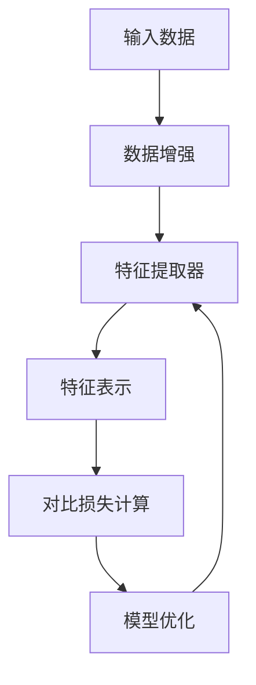

# 模型训练中的对比学习在高质量特征提取与推理中的应用

> 关键词：对比学习、模型训练、高质量特征提取、推理、应用

> 摘要：本文深入探讨了模型训练中的对比学习在高质量特征提取与推理中的应用。首先介绍了对比学习的背景知识，包括其目的、适用读者群体、文档结构以及相关术语。接着详细阐述了对比学习的核心概念、原理和架构，通过文本示意图和 Mermaid 流程图进行直观展示。对核心算法原理和具体操作步骤进行了深入分析，并使用 Python 源代码进行详细阐述。同时，给出了相关的数学模型和公式，并举例说明。通过项目实战，展示了对比学习在实际中的代码实现和详细解释。探讨了对比学习在不同实际应用场景中的应用情况，推荐了相关的学习资源、开发工具框架和论文著作。最后总结了对比学习的未来发展趋势与挑战，并提供了常见问题的解答和扩展阅读参考资料，旨在为读者全面深入地理解对比学习在高质量特征提取与推理中的应用提供有价值的信息。

## 1. 背景介绍 
### 1.1 目的和范围
在当今的人工智能和机器学习领域，模型训练是一个核心环节，而特征提取与推理则是模型性能的关键决定因素。高质量的特征能够更准确地描述数据的本质特征，从而使模型在各种任务中表现更优。对比学习作为一种新兴的训练方法，在高质量特征提取与推理方面展现出了巨大的潜力。

本文的目的在于全面深入地探讨对比学习在模型训练中的应用，特别是在高质量特征提取与推理方面的作用。我们将详细介绍对比学习的原理、算法、数学模型，并通过实际的项目案例展示其应用过程。同时，分析对比学习在不同实际场景中的应用情况，为读者提供全面的知识体系，帮助读者理解和应用对比学习来提升模型的特征提取和推理能力。

### 1.2 预期读者
本文的预期读者包括人工智能、机器学习领域的研究人员、工程师和开发者。对于正在学习和研究模型训练方法，特别是对特征提取和推理有深入需求的读者，本文将提供有价值的参考。同时，对于想要了解对比学习最新发展和应用的相关专业人士，也能从本文中获取到丰富的信息。

### 1.3 文档结构概述
本文将按照以下结构进行组织：
- 背景介绍：阐述本文的目的、适用读者群体、文档结构以及相关术语。
- 核心概念与联系：详细介绍对比学习的核心概念、原理和架构，通过文本示意图和 Mermaid 流程图进行直观展示。
- 核心算法原理 & 具体操作步骤：深入分析对比学习的核心算法原理，并使用 Python 源代码详细阐述具体操作步骤。
- 数学模型和公式 & 详细讲解 & 举例说明：给出对比学习相关的数学模型和公式，并通过具体例子进行详细解释。
- 项目实战：通过实际的项目案例，展示对比学习在代码实现中的具体应用和详细解释。
- 实际应用场景：探讨对比学习在不同实际场景中的应用情况。
- 工具和资源推荐：推荐相关的学习资源、开发工具框架和论文著作。
- 总结：总结对比学习的未来发展趋势与挑战。
- 附录：提供常见问题的解答。
- 扩展阅读 & 参考资料：列出相关的扩展阅读材料和参考资料。

### 1.4 术语表
#### 1.4.1 核心术语定义
- **对比学习（Contrastive Learning）**：是一种无监督学习方法，通过对比不同样本之间的相似性和差异性来学习数据的特征表示。其核心思想是让相似的样本在特征空间中距离更近，不相似的样本距离更远。
- **特征提取（Feature Extraction）**：从原始数据中提取出能够代表数据本质特征的信息，以便后续的模型训练和分析。
- **推理（Inference）**：在模型训练完成后，使用训练好的模型对新的数据进行预测和判断的过程。
- **正样本对（Positive Pairs）**：在对比学习中，具有相似特征或属于同一类别的样本对。
- **负样本对（Negative Pairs）**：在对比学习中，具有不同特征或属于不同类别的样本对。

#### 1.4.2 相关概念解释
- **无监督学习（Unsupervised Learning）**：一种机器学习方法，不需要对数据进行标记，模型通过自动发现数据中的模式和结构来进行学习。对比学习属于无监督学习的范畴，它利用数据自身的结构信息来学习特征表示。
- **特征空间（Feature Space）**：将原始数据映射到一个新的空间，每个样本在这个空间中用一个向量表示。对比学习的目标就是在特征空间中学习到能够有效区分不同样本的特征表示。

#### 1.4.3 缩略词列表
- **CNN（Convolutional Neural Network）**：卷积神经网络，是一种常用的深度学习模型，在图像和语音处理等领域有广泛应用。
- **MLP（Multi - Layer Perceptron）**：多层感知机，是一种基本的神经网络结构，由多个神经元层组成。
- **SVM（Support Vector Machine）**：支持向量机，是一种常用的分类和回归模型。

## 2. 核心概念与联系 

### 核心概念原理
对比学习的核心原理是通过对比不同样本之间的相似性和差异性来学习数据的特征表示。在对比学习中，我们通常会构建正样本对和负样本对。正样本对中的样本具有相似的特征或属于同一类别，而负样本对中的样本具有不同的特征或属于不同类别。

模型的目标是学习一个特征提取器，使得正样本对在特征空间中的距离尽可能小，而负样本对在特征空间中的距离尽可能大。通过不断地优化这个目标，模型可以学习到数据的高质量特征表示。

### 架构示意图
以下是对比学习的基本架构文本示意图：

输入数据 -> 数据增强（可选） -> 特征提取器 -> 特征表示 -> 对比损失计算 -> 模型优化

在这个架构中，输入数据首先可以经过数据增强操作，以增加数据的多样性。然后，数据通过特征提取器转换为特征表示。接着，根据构建的正样本对和负样本对，计算对比损失。最后，使用优化算法对模型进行优化，以最小化对比损失。

### Mermaid 流程图


在这个流程图中，输入数据经过数据增强后进入特征提取器，得到特征表示。特征表示用于计算对比损失，模型根据对比损失进行优化，优化后的模型再次用于特征提取，形成一个循环，不断提升模型的性能。

## 3. 核心算法原理 & 具体操作步骤 

### 核心算法原理
对比学习的核心算法通常基于对比损失函数。常见的对比损失函数有 InfoNCE（Info Noise Contrastive Estimation）损失。

InfoNCE 损失的基本思想是将一个样本与其他样本进行对比，计算该样本与正样本的相似度和与负样本的相似度，然后通过一个对数似然函数来衡量模型的性能。具体来说，对于一个样本 $x$，其正样本为 $x^+$，负样本为 $x_1^-, x_2^-, \cdots, x_n^-$，InfoNCE 损失的计算公式为：

$$
L_{InfoNCE} = -\log\frac{\exp(\text{sim}(f(x), f(x^+)) / \tau)}{\exp(\text{sim}(f(x), f(x^+)) / \tau) + \sum_{i=1}^{n}\exp(\text{sim}(f(x), f(x_i^-)) / \tau)}
$$

其中，$f(\cdot)$ 是特征提取器，$\text{sim}(\cdot, \cdot)$ 是相似度函数，通常使用余弦相似度，$\tau$ 是温度参数，用于控制分布的平滑程度。

### 具体操作步骤
以下是使用 Python 和 PyTorch 实现对比学习的具体操作步骤：

```python
import torch
import torch.nn as nn
import torch.optim as optim
import torch.nn.functional as F

# 定义特征提取器
class FeatureExtractor(nn.Module):
    def __init__(self):
        super(FeatureExtractor, self).__init__()
        self.fc1 = nn.Linear(10, 20)
        self.fc2 = nn.Linear(20, 10)

    def forward(self, x):
        x = F.relu(self.fc1(x))
        x = self.fc2(x)
        return x

# 定义对比损失函数
def info_nce_loss(features, temperature=0.1):
    batch_size = features.shape[0]
    labels = torch.arange(batch_size).to(features.device)
    similarity_matrix = F.cosine_similarity(features.unsqueeze(1), features.unsqueeze(0), dim=2)
    # 移除对角线元素，因为自己和自己的相似度没有意义
    mask = torch.eye(batch_size, dtype=torch.bool).to(features.device)
    similarity_matrix = similarity_matrix[~mask].view(batch_size, -1)
    labels = labels[~mask].view(batch_size, -1)[:, 0]
    logits = similarity_matrix / temperature
    loss = F.cross_entropy(logits, labels)
    return loss

# 初始化特征提取器和优化器
feature_extractor = FeatureExtractor()
optimizer = optim.Adam(feature_extractor.parameters(), lr=0.001)

# 模拟输入数据
batch_size = 16
input_data = torch.randn(batch_size, 10)

# 训练循环
num_epochs = 10
for epoch in range(num_epochs):
    # 前向传播
    features = feature_extractor(input_data)
    loss = info_nce_loss(features)

    # 反向传播和优化
    optimizer.zero_grad()
    loss.backward()
    optimizer.step()

    print(f'Epoch {epoch+1}/{num_epochs}, Loss: {loss.item()}')
```

### 代码解释
1. **特征提取器定义**：定义了一个简单的两层全连接神经网络作为特征提取器，将输入的 10 维数据映射到 10 维的特征空间。
2. **对比损失函数定义**：实现了 InfoNCE 损失函数，通过计算特征之间的余弦相似度，并使用交叉熵损失来计算最终的损失。
3. **初始化和训练循环**：初始化特征提取器和优化器，模拟输入数据，然后进行训练循环。在每个 epoch 中，计算特征表示，计算对比损失，进行反向传播和参数更新。

## 4. 数学模型和公式 & 详细讲解 & 举例说明 

### 数学模型和公式
对比学习的核心数学模型基于对比损失函数。除了前面介绍的 InfoNCE 损失函数，还有其他一些常见的对比损失函数，如 Triplet Loss。

#### Triplet Loss
Triplet Loss 的目标是让锚点样本（Anchor）与正样本（Positive）的距离小于锚点样本与负样本（Negative）的距离，并且有一个最小的间隔 $\alpha$。其计算公式为：

$$
L_{Triplet} = \max(d(a, p) - d(a, n) + \alpha, 0)
$$

其中，$a$ 是锚点样本，$p$ 是正样本，$n$ 是负样本，$d(\cdot, \cdot)$ 是距离函数，通常使用欧几里得距离。

### 详细讲解
#### InfoNCE 损失
InfoNCE 损失的核心思想是通过最大化正样本对的相似度，同时最小化负样本对的相似度来学习特征表示。温度参数 $\tau$ 控制了分布的平滑程度，当 $\tau$ 较小时，分布更加尖锐，模型更加关注正样本对；当 $\tau$ 较大时，分布更加平滑，模型对负样本对的关注增加。

#### Triplet Loss
Triplet Loss 的核心思想是通过约束锚点样本与正样本和负样本的距离关系来学习特征表示。间隔 $\alpha$ 确保了锚点样本与正样本的距离和与负样本的距离之间有一个最小的差距，从而使得模型能够更好地区分不同类别的样本。

### 举例说明
假设我们有一个图像分类任务，输入是图像数据。我们可以将同一类别的两张图像作为正样本对，不同类别的两张图像作为负样本对。

#### InfoNCE 损失举例
假设特征提取器将两张正样本图像 $x_1$ 和 $x_2$ 映射到特征空间中的向量 $f(x_1)$ 和 $f(x_2)$，两张负样本图像 $x_3$ 和 $x_4$ 映射到向量 $f(x_3)$ 和 $f(x_4)$。通过计算余弦相似度和 InfoNCE 损失，模型会调整参数，使得 $f(x_1)$ 和 $f(x_2)$ 的相似度增加，而 $f(x_1)$ 和 $f(x_3)$ 的相似度减小。

#### Triplet Loss 举例
假设我们选择一张图像作为锚点样本 $a$，同一类别的另一张图像作为正样本 $p$，不同类别的一张图像作为负样本 $n$。通过计算欧几里得距离和 Triplet Loss，模型会调整参数，使得 $d(a, p)$ 小于 $d(a, n)$，并且满足间隔 $\alpha$ 的要求。

## 5. 项目实战：代码实际案例和详细解释说明 

### 5.1  开发环境搭建
为了实现对比学习的项目实战，我们需要搭建以下开发环境：
- **Python**：建议使用 Python 3.7 及以上版本。
- **PyTorch**：一个开源的深度学习框架，用于构建和训练模型。可以使用以下命令安装：
```bash
pip install torch torchvision
```
- **NumPy**：用于数值计算和数据处理。可以使用以下命令安装：
```bash
pip install numpy
```
- **Matplotlib**：用于数据可视化。可以使用以下命令安装：
```bash
pip install matplotlib
```

### 5.2  源代码详细实现和代码解读
以下是一个使用对比学习进行图像特征提取的项目实战代码：

```python
import torch
import torch.nn as nn
import torch.optim as optim
import torchvision
import torchvision.transforms as transforms
import matplotlib.pyplot as plt
import numpy as np

# 数据加载和预处理
transform = transforms.Compose([
    transforms.ToTensor(),
    transforms.Normalize((0.5, 0.5, 0.5), (0.5, 0.5, 0.5))
])

trainset = torchvision.datasets.CIFAR10(root='./data', train=True,
                                        download=True, transform=transform)
trainloader = torch.utils.data.DataLoader(trainset, batch_size=32,
                                          shuffle=True, num_workers=2)

# 定义特征提取器
class FeatureExtractor(nn.Module):
    def __init__(self):
        super(FeatureExtractor, self).__init__()
        self.conv1 = nn.Conv2d(3, 6, 5)
        self.pool = nn.MaxPool2d(2, 2)
        self.conv2 = nn.Conv2d(6, 16, 5)
        self.fc1 = nn.Linear(16 * 5 * 5, 120)
        self.fc2 = nn.Linear(120, 84)
        self.fc3 = nn.Linear(84, 10)

    def forward(self, x):
        x = self.pool(torch.relu(self.conv1(x)))
        x = self.pool(torch.relu(self.conv2(x)))
        x = x.view(-1, 16 * 5 * 5)
        x = torch.relu(self.fc1(x))
        x = torch.relu(self.fc2(x))
        x = self.fc3(x)
        return x

# 定义对比损失函数
def info_nce_loss(features, temperature=0.1):
    batch_size = features.shape[0]
    labels = torch.arange(batch_size).to(features.device)
    similarity_matrix = F.cosine_similarity(features.unsqueeze(1), features.unsqueeze(0), dim=2)
    # 移除对角线元素，因为自己和自己的相似度没有意义
    mask = torch.eye(batch_size, dtype=torch.bool).to(features.device)
    similarity_matrix = similarity_matrix[~mask].view(batch_size, -1)
    labels = labels[~mask].view(batch_size, -1)[:, 0]
    logits = similarity_matrix / temperature
    loss = F.cross_entropy(logits, labels)
    return loss

# 初始化特征提取器和优化器
feature_extractor = FeatureExtractor()
optimizer = optim.Adam(feature_extractor.parameters(), lr=0.001)

# 训练循环
num_epochs = 10
losses = []
for epoch in range(num_epochs):
    running_loss = 0.0
    for i, data in enumerate(trainloader, 0):
        inputs, _ = data
        # 前向传播
        features = feature_extractor(inputs)
        loss = info_nce_loss(features)

        # 反向传播和优化
        optimizer.zero_grad()
        loss.backward()
        optimizer.step()

        running_loss += loss.item()
    epoch_loss = running_loss / len(trainloader)
    losses.append(epoch_loss)
    print(f'Epoch {epoch+1}/{num_epochs}, Loss: {epoch_loss}')

# 绘制损失曲线
plt.plot(losses)
plt.xlabel('Epoch')
plt.ylabel('Loss')
plt.title('Contrastive Learning Loss')
plt.show()
```

### 5.3  代码解读与分析
1. **数据加载和预处理**：使用 `torchvision` 加载 CIFAR - 10 数据集，并进行预处理，包括将图像转换为张量和归一化操作。
2. **特征提取器定义**：定义了一个简单的卷积神经网络作为特征提取器，包括两个卷积层和三个全连接层。
3. **对比损失函数定义**：使用 InfoNCE 损失函数来计算对比损失。
4. **初始化和训练循环**：初始化特征提取器和优化器，然后进行训练循环。在每个 epoch 中，计算特征表示，计算对比损失，进行反向传播和参数更新。
5. **损失曲线绘制**：使用 `matplotlib` 绘制训练过程中的损失曲线，方便观察模型的训练情况。

通过这个项目实战，我们可以看到对比学习在图像特征提取中的应用过程，并且可以通过损失曲线来评估模型的训练效果。

## 6. 实际应用场景 
### 图像领域
- **图像分类**：对比学习可以帮助模型学习到更具区分性的图像特征，从而提高图像分类的准确率。通过对比不同类别的图像特征，模型能够更好地区分不同类别的图像。
- **图像检索**：在图像检索任务中，对比学习可以将图像映射到一个特征空间，使得相似的图像在特征空间中距离更近。这样，当输入一个查询图像时，可以通过计算特征空间中的距离来找到与之相似的图像。

### 自然语言处理领域
- **文本分类**：对比学习可以用于学习文本的特征表示，通过对比不同类别的文本特征，提高文本分类的性能。
- **语义相似度计算**：在语义相似度计算任务中，对比学习可以将文本映射到一个特征空间，通过计算特征空间中的距离来衡量文本之间的语义相似度。

### 语音领域
- **语音识别**：对比学习可以帮助模型学习到更具鲁棒性的语音特征，从而提高语音识别的准确率。通过对比不同语音信号的特征，模型能够更好地适应不同的语音环境。
- **说话人识别**：在说话人识别任务中，对比学习可以将语音信号映射到一个特征空间，使得同一个说话人的语音特征在特征空间中距离更近，不同说话人的语音特征距离更远。

## 7. 工具和资源推荐
### 7.1 学习资源推荐
#### 7.1.1 书籍推荐
- 《深度学习》（Deep Learning）：由 Ian Goodfellow、Yoshua Bengio 和 Aaron Courville 所著，是深度学习领域的经典教材，涵盖了深度学习的基本概念、算法和应用。
- 《动手学深度学习》（Dive into Deep Learning）：由 Aston Zhang、Zack C. Lipton、Mu Li 和 Alexander J. Smola 所著，以动手实践为导向，介绍了深度学习的理论和实践。

#### 7.1.2 在线课程
- Coursera 上的“深度学习专项课程”（Deep Learning Specialization）：由 Andrew Ng 教授授课，涵盖了深度学习的各个方面，包括神经网络、卷积神经网络、循环神经网络等。
- edX 上的“麻省理工学院：深度学习基础”（MITx: 6.S191x Introduction to Deep Learning）：由麻省理工学院的教授授课，介绍了深度学习的基本原理和应用。

#### 7.1.3 技术博客和网站
- Medium 上的 Towards Data Science：是一个专注于数据科学和机器学习的技术博客，有很多关于对比学习和其他机器学习方法的文章。
- arXiv：是一个预印本平台，包含了很多最新的机器学习研究论文，可以及时了解对比学习的最新研究进展。

### 7.2 开发工具框架推荐
#### 7.2.1 IDE和编辑器
- PyCharm：是一个专门为 Python 开发设计的集成开发环境，提供了丰富的代码编辑、调试和项目管理功能。
- Jupyter Notebook：是一个交互式的开发环境，适合进行数据探索、模型实验和代码演示。

#### 7.2.2 调试和性能分析工具
- TensorBoard：是 TensorFlow 提供的一个可视化工具，可以用于可视化模型的训练过程、损失曲线、参数分布等。
- PyTorch Profiler：是 PyTorch 提供的一个性能分析工具，可以用于分析模型的性能瓶颈和内存使用情况。

#### 7.2.3 相关框架和库
- PyTorch：是一个开源的深度学习框架，提供了丰富的深度学习模型和工具，方便进行对比学习的实现和训练。
- TensorFlow：是另一个广泛使用的深度学习框架，也支持对比学习的实现和训练。

### 7.3 相关论文著作推荐
#### 7.3.1 经典论文
- “A Simple Framework for Contrastive Learning of Visual Representations”：提出了 SimCLR 方法，是对比学习在图像领域的经典论文。
- “Momentum Contrast for Unsupervised Visual Representation Learning”：提出了 MoCo 方法，通过动量更新的方式改进了对比学习的性能。

#### 7.3.2 最新研究成果
可以通过 arXiv 等预印本平台关注对比学习的最新研究成果，了解该领域的最新发展趋势。

#### 7.3.3 应用案例分析
可以在学术数据库如 IEEE Xplore、ACM Digital Library 等查找对比学习在不同领域的应用案例分析，了解对比学习在实际应用中的效果和挑战。

## 8. 总结：未来发展趋势与挑战
### 未来发展趋势
- **多模态对比学习**：将对比学习应用于多模态数据，如结合图像、文本和语音等不同模态的数据进行特征学习，以提高模型的性能和泛化能力。
- **自监督对比学习**：进一步发展自监督学习方法，让模型能够自动发现数据中的结构和模式，减少对人工标注数据的依赖。
- **对比学习与强化学习的结合**：将对比学习与强化学习相结合，提高强化学习算法的效率和性能，特别是在复杂环境下的决策任务中。

### 挑战
- **计算资源需求**：对比学习通常需要大量的计算资源和时间来训练模型，特别是在处理大规模数据集时，如何降低计算成本是一个挑战。
- **负样本选择**：负样本的选择对对比学习的性能有重要影响，如何选择合适的负样本是一个需要解决的问题。
- **模型可解释性**：对比学习模型通常是黑盒模型，缺乏可解释性，如何提高模型的可解释性是未来研究的一个重要方向。

## 9. 附录：常见问题与解答
### 问题 1：对比学习和监督学习有什么区别？
解答：监督学习需要使用标注好的数据进行训练，模型的目标是学习输入数据和标注之间的映射关系。而对比学习是一种无监督学习方法，不需要标注数据，模型通过对比不同样本之间的相似性和差异性来学习数据的特征表示。

### 问题 2：如何选择合适的对比损失函数？
解答：选择合适的对比损失函数需要考虑具体的任务和数据特点。InfoNCE 损失适用于大多数情况，特别是在需要学习全局特征表示的任务中。Triplet Loss 适用于需要约束样本之间距离关系的任务，如人脸识别和图像检索。

### 问题 3：对比学习的训练时间通常比较长，有什么方法可以加速训练？
解答：可以使用以下方法加速对比学习的训练：
- 使用更高效的硬件，如 GPU 或 TPU。
- 优化模型架构，减少模型的参数数量。
- 采用分布式训练方法，并行处理多个样本。

## 10. 扩展阅读 & 参考资料
### 扩展阅读
- 阅读更多关于对比学习的研究论文，了解最新的研究进展和方法。
- 学习其他无监督学习方法，如自编码器、生成对抗网络等，对比不同方法的优缺点。

### 参考资料
- Goodfellow, I., Bengio, Y., & Courville, A. (2016). Deep Learning. MIT Press.
- Zhang, A., Lipton, Z. C., Li, M., & Smola, A. J. (2020). Dive into Deep Learning.
- Chen, T., Kornblith, S., Norouzi, M., & Hinton, G. (2020). A Simple Framework for Contrastive Learning of Visual Representations. arXiv preprint arXiv:2002.05709.
- He, K., Fan, H., Wu, Y., Xie, S., & Girshick, R. (2020). Momentum Contrast for Unsupervised Visual Representation Learning. In Proceedings of the IEEE/CVF Conference on Computer Vision and Pattern Recognition (pp. 9729-9738).

作者：AI天才研究院/AI Genius Institute & 禅与计算机程序设计艺术 /Zen And The Art of Computer Programming