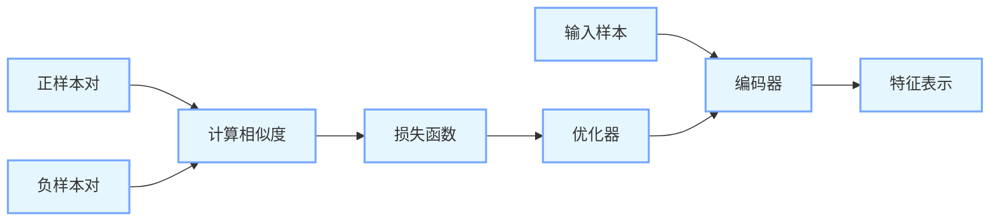

# 模型训练中的对比学习技术优化与应用

> 关键词：模型训练、对比学习技术、优化方法、应用场景、数学模型

> 摘要：本文深入探讨了模型训练中的对比学习技术，详细介绍了其核心概念、算法原理、数学模型等内容。通过分析对比学习技术在不同领域的应用案例，阐述了其在提升模型性能方面的重要作用。同时，给出了优化对比学习技术的方法和实际操作步骤，并推荐了相关的学习资源、开发工具和论文著作。最后，对对比学习技术的未来发展趋势与挑战进行了总结和展望，旨在为从事相关领域研究和开发的人员提供全面而深入的参考。

## 1. 背景介绍 
### 1.1 目的和范围
在当今的人工智能和机器学习领域，模型训练是一个至关重要的环节。随着数据量的不断增加和任务复杂度的提升，如何提高模型的学习能力和泛化性能成为了研究的热点。对比学习技术作为一种有效的自监督学习方法，通过对比不同样本之间的相似性和差异性来学习特征表示，在图像、语音、自然语言处理等多个领域取得了显著的成果。本文的目的在于深入剖析对比学习技术的原理、优化方法及其应用，为研究人员和开发者提供全面的技术指导。文章的范围涵盖了对比学习技术的基本概念、核心算法、数学模型、实际应用案例以及相关的工具和资源推荐等方面。

### 1.2 预期读者
本文预期读者主要包括人工智能、机器学习领域的研究人员、开发者，以及对对比学习技术感兴趣的高校师生。对于初学者，本文可以作为入门指南，帮助他们了解对比学习技术的基本原理和应用场景；对于有一定经验的专业人士，本文提供了深入的技术分析和优化方法，可作为进一步研究和开发的参考。

### 1.3 文档结构概述
本文将按照以下结构进行组织：首先介绍对比学习技术的核心概念和相关联系，包括其原理和架构的文本示意图以及 Mermaid 流程图；接着详细阐述核心算法原理和具体操作步骤，并使用 Python 源代码进行说明；然后介绍对比学习技术的数学模型和公式，并通过举例进行详细讲解；之后给出项目实战的代码实际案例和详细解释说明；再探讨对比学习技术的实际应用场景；推荐相关的工具和资源，包括学习资源、开发工具框架和论文著作；最后对对比学习技术的未来发展趋势与挑战进行总结，并提供附录常见问题与解答以及扩展阅读和参考资料。

### 1.4 术语表
#### 1.4.1 核心术语定义
- **对比学习（Contrastive Learning）**：一种自监督学习方法，通过对比不同样本之间的相似性和差异性来学习特征表示，使得相似的样本在特征空间中距离更近，不相似的样本距离更远。
- **正样本对（Positive Pairs）**：在对比学习中，具有相似语义或属于同一类别的样本对。
- **负样本对（Negative Pairs）**：在对比学习中，具有不同语义或属于不同类别的样本对。
- **特征表示（Feature Representation）**：将原始数据转换为低维向量空间中的表示，以便模型更好地理解和处理数据。
- **损失函数（Loss Function）**：用于衡量模型预测结果与真实标签之间的差异，在对比学习中用于优化模型参数。

#### 1.4.2 相关概念解释
- **自监督学习（Self-Supervised Learning）**：一种无监督学习方法，通过利用数据本身的结构和信息来自动生成监督信号，无需人工标注数据。对比学习是自监督学习的一种重要方法。
- **表示学习（Representation Learning）**：旨在学习数据的有效特征表示，使得这些表示能够捕捉数据的重要信息和结构，从而提高模型在各种任务上的性能。
- **度量学习（Metric Learning）**：研究如何学习数据之间的相似度度量，使得相似的样本在特征空间中距离更近，不相似的样本距离更远。对比学习可以看作是一种特殊的度量学习方法。

#### 1.4.3 缩略词列表
- **CNN（Convolutional Neural Network）**：卷积神经网络，一种常用于图像和视频处理的深度学习模型。
- **RNN（Recurrent Neural Network）**：循环神经网络，一种常用于处理序列数据的深度学习模型。
- **BERT（Bidirectional Encoder Representations from Transformers）**：一种基于 Transformer 架构的预训练语言模型。
- **MoCo（Momentum Contrast）**：一种基于动量对比的对比学习方法。
- **SimCLR（Simple Contrastive Learning of Representations）**：一种简单有效的对比学习方法。

## 2. 核心概念与联系 
### 核心概念原理
对比学习的核心思想是通过对比不同样本之间的相似性和差异性来学习特征表示。具体来说，给定一个样本集合，我们将其划分为正样本对和负样本对。正样本对通常是具有相似语义或属于同一类别的样本，负样本对则是具有不同语义或属于不同类别的样本。在特征空间中，我们希望正样本对的距离尽可能小，负样本对的距离尽可能大。

为了实现这一目标，对比学习通常使用一个编码器（Encoder）将原始样本映射到特征空间中，然后通过一个损失函数来衡量正样本对和负样本对之间的距离差异。通过最小化损失函数，我们可以不断调整编码器的参数，使得模型能够学习到有效的特征表示。

### 架构的文本示意图
以下是一个简单的对比学习架构示意图：

```plaintext
输入样本 --> 编码器（Encoder） --> 特征表示
正样本对 --> 计算相似度 --> 损失函数
负样本对 --> 计算相似度 --> 损失函数
损失函数 --> 优化器 --> 更新编码器参数
```

在这个架构中，输入样本首先通过编码器映射到特征空间中，得到特征表示。然后，对于正样本对和负样本对，分别计算它们在特征空间中的相似度。最后，将这些相似度输入到损失函数中，通过优化器更新编码器的参数，使得正样本对的相似度增加，负样本对的相似度减小。

### Mermaid 流程图


这个流程图展示了对比学习的基本流程。输入样本经过编码器得到特征表示，正样本对和负样本对计算相似度后输入到损失函数中，损失函数的结果通过优化器更新编码器的参数。

## 3. 核心算法原理 & 具体操作步骤 
### 核心算法原理
对比学习的核心算法通常基于损失函数来实现，常见的损失函数有 InfoNCE（Info Noise Contrastive Estimation）损失函数。InfoNCE 损失函数的基本思想是通过最大化正样本对之间的互信息，同时最小化负样本对之间的互信息来学习特征表示。

InfoNCE 损失函数的数学表达式如下：

$$
\mathcal{L}_{InfoNCE} = -\log \frac{\exp(\text{sim}(z_i, z_j) / \tau)}{\sum_{k=1}^{N} \exp(\text{sim}(z_i, z_k) / \tau)}
$$

其中，$z_i$ 和 $z_j$ 是正样本对的特征表示，$z_k$ 是负样本对的特征表示，$\text{sim}(\cdot, \cdot)$ 是相似度函数，通常使用余弦相似度，$\tau$ 是温度参数，用于控制相似度的缩放。

### 具体操作步骤
以下是使用 InfoNCE 损失函数进行对比学习的具体操作步骤：

1. **数据准备**：收集和整理训练数据，将其划分为正样本对和负样本对。
2. **模型定义**：定义编码器模型，用于将输入样本映射到特征空间中。
3. **损失函数定义**：定义 InfoNCE 损失函数。
4. **优化器定义**：选择合适的优化器，如 Adam 优化器，用于更新编码器的参数。
5. **训练过程**：
    - 从训练数据中随机选择一批正样本对和负样本对。
    - 将样本输入到编码器中，得到特征表示。
    - 计算正样本对和负样本对之间的相似度。
    - 计算 InfoNCE 损失函数。
    - 使用优化器更新编码器的参数。
6. **模型评估**：在验证集上评估模型的性能，根据评估结果调整模型参数。

### Python 源代码实现
```python
import torch
import torch.nn as nn
import torch.optim as optim
import torch.nn.functional as F

# 定义编码器模型
class Encoder(nn.Module):
    def __init__(self, input_dim, hidden_dim, output_dim):
        super(Encoder, self).__init__()
        self.fc1 = nn.Linear(input_dim, hidden_dim)
        self.fc2 = nn.Linear(hidden_dim, output_dim)

    def forward(self, x):
        x = F.relu(self.fc1(x))
        x = self.fc2(x)
        return F.normalize(x, dim=1)

# 定义 InfoNCE 损失函数
def info_nce_loss(features, temperature=0.1):
    batch_size = features.shape[0]
    labels = torch.arange(batch_size).to(features.device)
    similarity_matrix = torch.matmul(features, features.T)
    # 去除对角线上的相似度（自身与自身的相似度）
    mask = torch.eye(batch_size, dtype=torch.bool).to(features.device)
    similarity_matrix = similarity_matrix[~mask].view(batch_size, -1)
    logits = similarity_matrix / temperature
    loss = F.cross_entropy(logits, labels)
    return loss

# 数据准备
input_dim = 10
hidden_dim = 20
output_dim = 10
batch_size = 32
data = torch.randn(batch_size, input_dim)

# 模型定义
encoder = Encoder(input_dim, hidden_dim, output_dim)

# 优化器定义
optimizer = optim.Adam(encoder.parameters(), lr=0.001)

# 训练过程
num_epochs = 100
for epoch in range(num_epochs):
    features = encoder(data)
    loss = info_nce_loss(features)
    optimizer.zero_grad()
    loss.backward()
    optimizer.step()
    if (epoch + 1) % 10 == 0:
        print(f'Epoch [{epoch+1}/{num_epochs}], Loss: {loss.item():.4f}')
```

在这个代码示例中，我们首先定义了一个简单的编码器模型 `Encoder`，用于将输入样本映射到特征空间中。然后定义了 InfoNCE 损失函数 `info_nce_loss`，并使用 Adam 优化器进行模型训练。在训练过程中，我们不断更新编码器的参数，使得损失函数逐渐减小。

## 4. 数学模型和公式 & 详细讲解 & 举例说明 
### 数学模型和公式
#### InfoNCE 损失函数
如前所述，InfoNCE 损失函数的数学表达式为：

$$
\mathcal{L}_{InfoNCE} = -\log \frac{\exp(\text{sim}(z_i, z_j) / \tau)}{\sum_{k=1}^{N} \exp(\text{sim}(z_i, z_k) / \tau)}
$$

其中，$z_i$ 和 $z_j$ 是正样本对的特征表示，$z_k$ 是负样本对的特征表示，$\text{sim}(\cdot, \cdot)$ 是相似度函数，通常使用余弦相似度：

$$
\text{sim}(z_i, z_j) = \frac{z_i^T z_j}{\|z_i\| \|z_j\|}
$$

$\tau$ 是温度参数，用于控制相似度的缩放。温度参数的作用是调整损失函数对相似度的敏感度，当 $\tau$ 较小时，损失函数对相似度的变化更加敏感，模型更容易学习到细微的差异；当 $\tau$ 较大时，损失函数对相似度的变化相对不敏感，模型更注重整体的相似性。

#### 互信息理论基础
InfoNCE 损失函数的理论基础是互信息（Mutual Information）。互信息是衡量两个随机变量之间依赖关系的一种度量，在对比学习中，我们希望最大化正样本对之间的互信息，同时最小化负样本对之间的互信息。

设 $X$ 和 $Y$ 是两个随机变量，它们的互信息定义为：

$$
I(X; Y) = \sum_{x \in \mathcal{X}} \sum_{y \in \mathcal{Y}} p(x, y) \log \frac{p(x, y)}{p(x) p(y)}
$$

其中，$p(x, y)$ 是 $X$ 和 $Y$ 的联合概率分布，$p(x)$ 和 $p(y)$ 分别是 $X$ 和 $Y$ 的边缘概率分布。

在对比学习中，我们可以将正样本对的特征表示看作是具有高互信息的随机变量，负样本对的特征表示看作是具有低互信息的随机变量。通过最大化正样本对之间的互信息，我们可以使得模型学习到更有区分度的特征表示。

### 详细讲解
InfoNCE 损失函数的核心思想是通过对比正样本对和负样本对之间的相似度来学习特征表示。具体来说，对于一个正样本对 $(z_i, z_j)$，我们希望其相似度 $\text{sim}(z_i, z_j)$ 尽可能大，而对于负样本对 $(z_i, z_k)$，我们希望其相似度 $\text{sim}(z_i, z_k)$ 尽可能小。

在损失函数中，分子 $\exp(\text{sim}(z_i, z_j) / \tau)$ 表示正样本对的相似度得分，分母 $\sum_{k=1}^{N} \exp(\text{sim}(z_i, z_k) / \tau)$ 表示所有样本对（包括正样本对和负样本对）的相似度得分之和。通过取对数和取负号，我们将最大化正样本对的相似度和最小化负样本对的相似度的问题转化为最小化损失函数的问题。

### 举例说明
假设我们有一个简单的对比学习任务，输入样本是二维向量，编码器将其映射到二维特征空间中。我们有一个正样本对 $(z_1, z_2)$ 和两个负样本对 $(z_1, z_3)$，$(z_1, z_4)$。

设 $z_1 = [0.1, 0.2]$，$z_2 = [0.15, 0.25]$，$z_3 = [0.8, 0.9]$，$z_4 = [0.7, 0.6]$，温度参数 $\tau = 0.1$。

首先，计算余弦相似度：

$$
\text{sim}(z_1, z_2) = \frac{z_1^T z_2}{\|z_1\| \|z_2\|} = \frac{0.1 \times 0.15 + 0.2 \times 0.25}{\sqrt{0.1^2 + 0.2^2} \sqrt{0.15^2 + 0.25^2}} \approx 0.98
$$

$$
\text{sim}(z_1, z_3) = \frac{z_1^T z_3}{\|z_1\| \|z_3\|} = \frac{0.1 \times 0.8 + 0.2 \times 0.9}{\sqrt{0.1^2 + 0.2^2} \sqrt{0.8^2 + 0.9^2}} \approx 0.56
$$

$$
\text{sim}(z_1, z_4) = \frac{z_1^T z_4}{\|z_1\| \|z_4\|} = \frac{0.1 \times 0.7 + 0.2 \times 0.6}{\sqrt{0.1^2 + 0.2^2} \sqrt{0.7^2 + 0.6^2}} \approx 0.62
$$

然后，计算 InfoNCE 损失函数：

$$
\mathcal{L}_{InfoNCE} = -\log \frac{\exp(0.98 / 0.1)}{\exp(0.98 / 0.1) + \exp(0.56 / 0.1) + \exp(0.62 / 0.1)}
$$

通过不断调整编码器的参数，使得损失函数逐渐减小，最终模型能够学习到有效的特征表示，使得正样本对在特征空间中距离更近，负样本对距离更远。

## 5. 项目实战：代码实际案例和详细解释说明 
### 5.1  开发环境搭建
在进行对比学习项目实战之前，我们需要搭建相应的开发环境。以下是具体的步骤：

1. **安装 Python**：建议使用 Python 3.7 及以上版本，可以从 Python 官方网站（https://www.python.org/downloads/）下载并安装。
2. **安装 PyTorch**：PyTorch 是一个常用的深度学习框架，我们可以根据自己的需求选择合适的版本进行安装。可以参考 PyTorch 官方网站（https://pytorch.org/get-started/locally/）的指引进行安装。
3. **安装其他依赖库**：除了 PyTorch，我们还需要安装一些其他的依赖库，如 NumPy、Matplotlib 等。可以使用以下命令进行安装：

```bash
pip install numpy matplotlib
```

### 5.2  源代码详细实现和代码解读
以下是一个基于 PyTorch 的对比学习项目实战代码示例，我们将使用 CIFAR-10 数据集进行训练：

```python
import torch
import torch.nn as nn
import torch.optim as optim
import torchvision
import torchvision.transforms as transforms
from torch.utils.data import DataLoader

# 定义编码器模型
class Encoder(nn.Module):
    def __init__(self):
        super(Encoder, self).__init__()
        self.conv1 = nn.Conv2d(3, 64, kernel_size=3, stride=1, padding=1)
        self.relu1 = nn.ReLU()
        self.pool1 = nn.MaxPool2d(kernel_size=2, stride=2)
        self.conv2 = nn.Conv2d(64, 128, kernel_size=3, stride=1, padding=1)
        self.relu2 = nn.ReLU()
        self.pool2 = nn.MaxPool2d(kernel_size=2, stride=2)
        self.fc1 = nn.Linear(128 * 8 * 8, 256)
        self.relu3 = nn.ReLU()
        self.fc2 = nn.Linear(256, 128)

    def forward(self, x):
        x = self.pool1(self.relu1(self.conv1(x)))
        x = self.pool2(self.relu2(self.conv2(x)))
        x = x.view(-1, 128 * 8 * 8)
        x = self.relu3(self.fc1(x))
        x = self.fc2(x)
        return F.normalize(x, dim=1)

# 定义 InfoNCE 损失函数
def info_nce_loss(features, temperature=0.1):
    batch_size = features.shape[0]
    labels = torch.arange(batch_size).to(features.device)
    similarity_matrix = torch.matmul(features, features.T)
    # 去除对角线上的相似度（自身与自身的相似度）
    mask = torch.eye(batch_size, dtype=torch.bool).to(features.device)
    similarity_matrix = similarity_matrix[~mask].view(batch_size, -1)
    logits = similarity_matrix / temperature
    loss = F.cross_entropy(logits, labels)
    return loss

# 数据预处理
transform = transforms.Compose([
    transforms.ToTensor(),
    transforms.Normalize((0.5, 0.5, 0.5), (0.5, 0.5, 0.5))
])

# 加载 CIFAR-10 数据集
trainset = torchvision.datasets.CIFAR10(root='./data', train=True,
                                        download=True, transform=transform)
trainloader = DataLoader(trainset, batch_size=32, shuffle=True)

# 模型定义
encoder = Encoder()

# 优化器定义
optimizer = optim.Adam(encoder.parameters(), lr=0.001)

# 训练过程
num_epochs = 10
for epoch in range(num_epochs):
    running_loss = 0.0
    for i, data in enumerate(trainloader, 0):
        inputs, _ = data
        features = encoder(inputs)
        loss = info_nce_loss(features)
        optimizer.zero_grad()
        loss.backward()
        optimizer.step()
        running_loss += loss.item()
    print(f'Epoch [{epoch+1}/{num_epochs}], Loss: {running_loss / len(trainloader):.4f}')

print('Finished Training')
```

### 代码解读与分析
1. **编码器模型定义**：`Encoder` 类定义了一个简单的卷积神经网络，用于将输入的图像数据映射到特征空间中。该网络包含两个卷积层、两个池化层和两个全连接层。
2. **InfoNCE 损失函数定义**：`info_nce_loss` 函数实现了 InfoNCE 损失函数的计算，通过对比正样本对和负样本对之间的相似度来学习特征表示。
3. **数据预处理**：使用 `transforms.Compose` 函数定义了数据预处理的步骤，包括将图像转换为张量和归一化处理。
4. **数据集加载**：使用 `torchvision.datasets.CIFAR10` 加载 CIFAR-10 数据集，并使用 `DataLoader` 进行数据加载和批量处理。
5. **模型训练**：在训练过程中，我们不断从数据集中获取一批数据，将其输入到编码器中得到特征表示，然后计算 InfoNCE 损失函数，并使用优化器更新编码器的参数。

通过以上步骤，我们可以完成一个简单的对比学习项目实战，训练出一个能够学习到有效特征表示的编码器模型。

## 6. 实际应用场景 
对比学习技术在多个领域都有广泛的应用，以下是一些常见的应用场景：

### 图像领域
- **图像分类**：对比学习可以用于学习图像的特征表示，从而提高图像分类模型的性能。通过在大规模无标签图像数据上进行对比学习，模型可以学习到更通用的特征，然后在有标签的图像数据上进行微调，从而在图像分类任务上取得更好的效果。
- **图像检索**：在图像检索任务中，我们需要根据用户输入的查询图像，从图像数据库中找到与之相似的图像。对比学习可以学习到图像之间的相似度度量，使得相似的图像在特征空间中距离更近，从而提高图像检索的准确性。
- **目标检测**：对比学习可以用于目标检测模型的预训练，通过学习图像中不同目标之间的相似性和差异性，模型可以更好地捕捉目标的特征，从而提高目标检测的性能。

### 自然语言处理领域
- **文本分类**：对比学习可以用于学习文本的特征表示，从而提高文本分类模型的性能。通过在大规模无标签文本数据上进行对比学习，模型可以学习到更通用的文本特征，然后在有标签的文本数据上进行微调，从而在文本分类任务上取得更好的效果。
- **语义相似度计算**：在自然语言处理中，语义相似度计算是一个重要的任务。对比学习可以学习到文本之间的语义相似度度量，使得语义相似的文本在特征空间中距离更近，从而提高语义相似度计算的准确性。
- **机器翻译**：对比学习可以用于机器翻译模型的预训练，通过学习源语言和目标语言之间的对应关系，模型可以更好地理解语言的语义，从而提高机器翻译的质量。

### 语音领域
- **语音识别**：对比学习可以用于学习语音的特征表示，从而提高语音识别模型的性能。通过在大规模无标签语音数据上进行对比学习，模型可以学习到更通用的语音特征，然后在有标签的语音数据上进行微调，从而在语音识别任务上取得更好的效果。
- **说话人识别**：在说话人识别任务中，我们需要根据语音信号识别出说话人的身份。对比学习可以学习到说话人之间的相似度度量，使得同一说话人的语音在特征空间中距离更近，不同说话人的语音距离更远，从而提高说话人识别的准确性。

## 7. 工具和资源推荐
### 7.1 学习资源推荐
#### 7.1.1 书籍推荐
- 《深度学习》（Deep Learning）：由 Ian Goodfellow、Yoshua Bengio 和 Aaron Courville 合著，是深度学习领域的经典教材，涵盖了深度学习的基本概念、算法和应用。
- 《Python 深度学习》（Deep Learning with Python）：由 Francois Chollet 所著，介绍了如何使用 Python 和 Keras 进行深度学习开发，适合初学者入门。
- 《动手学深度学习》（Dive into Deep Learning）：由 Aston Zhang、Zack C. Lipton、Mu Li 和 Alexander J. Smola 合著，提供了丰富的代码示例和实践项目，帮助读者更好地理解和掌握深度学习知识。

#### 7.1.2 在线课程
- Coursera 上的“深度学习专项课程”（Deep Learning Specialization）：由 Andrew Ng 教授授课，包括五门课程，系统地介绍了深度学习的各个方面。
- edX 上的“使用 PyTorch 进行深度学习”（Introduction to Deep Learning with PyTorch）：介绍了如何使用 PyTorch 进行深度学习开发，适合初学者。
- 哔哩哔哩（B 站）上有很多关于深度学习和对比学习的视频教程，如李沐的“动手学深度学习”系列课程，讲解详细，适合自学。

#### 7.1.3 技术博客和网站
- Medium 上有很多关于深度学习和对比学习的技术博客，如 Towards Data Science 等，提供了最新的研究成果和实践经验。
- arXiv 是一个预印本数据库，包含了大量的计算机科学和机器学习领域的研究论文，可以及时了解最新的研究动态。
- 各大科技公司的官方博客，如 Google AI Blog、Facebook AI Research Blog 等，会发布一些他们在深度学习和对比学习领域的研究成果和应用案例。

### 7.2 开发工具框架推荐
#### 7.2.1 IDE和编辑器
- PyCharm：是一款专门为 Python 开发设计的集成开发环境（IDE），提供了丰富的代码编辑、调试和项目管理功能，适合开发深度学习项目。
- Jupyter Notebook：是一个交互式的开发环境，支持 Python 等多种编程语言，可以方便地进行代码编写、数据可视化和实验记录，适合进行深度学习实验和研究。
- Visual Studio Code：是一款轻量级的代码编辑器，支持多种编程语言和插件扩展，具有丰富的代码编辑和调试功能，也可以用于深度学习开发。

#### 7.2.2 调试和性能分析工具
- PyTorch Profiler：是 PyTorch 提供的一个性能分析工具，可以帮助我们分析模型的运行时间、内存使用情况等，从而优化模型性能。
- TensorBoard：是 TensorFlow 提供的一个可视化工具，也可以与 PyTorch 结合使用，用于可视化模型的训练过程、损失函数变化等，帮助我们更好地理解模型的训练情况。
- Py-Spy：是一个用于分析 Python 程序性能的工具，可以帮助我们找出程序中的性能瓶颈，提高程序的运行效率。

#### 7.2.3 相关框架和库
- PyTorch：是一个开源的深度学习框架，提供了丰富的神经网络层和优化算法，支持 GPU 加速，广泛应用于深度学习研究和开发。
- TensorFlow：是另一个开源的深度学习框架，具有强大的分布式训练和模型部署功能，也被广泛应用于工业界和学术界。
- Scikit-learn：是一个常用的机器学习库，提供了丰富的机器学习算法和工具，如分类、回归、聚类等，可用于数据预处理和模型评估。

### 7.3 相关论文著作推荐
#### 7.3.1 经典论文
- “A Simple Framework for Contrastive Learning of Visual Representations”（SimCLR）：提出了一种简单有效的对比学习方法，在图像表示学习任务上取得了很好的效果。
- “Momentum Contrast for Unsupervised Visual Representation Learning”（MoCo）：提出了一种基于动量对比的对比学习方法，通过维护一个动态的字典来提高对比学习的效率。
- “InfoNCE: Info Noise Contrastive Estimation”：介绍了 InfoNCE 损失函数的原理和应用，为对比学习提供了理论基础。

#### 7.3.2 最新研究成果
- 可以关注 arXiv 上的最新论文，了解对比学习领域的最新研究动态。例如，一些研究尝试将对比学习与其他技术相结合，如强化学习、生成对抗网络等，以进一步提高模型的性能。
- 参加国际机器学习会议（如 NeurIPS、ICML、CVPR 等）和自然语言处理会议（如 ACL、EMNLP 等），这些会议上会有很多关于对比学习的最新研究成果发表。

#### 7.3.3 应用案例分析
- 可以关注各大科技公司的研究报告和开源项目，了解对比学习技术在实际应用中的案例和经验。例如，Google 在图像搜索和视频理解领域、Facebook 在自然语言处理和语音识别领域都有很多关于对比学习的应用案例。

## 8. 总结：未来发展趋势与挑战
### 未来发展趋势
- **多模态对比学习**：随着人工智能技术的发展，多模态数据（如图像、文本、语音等）的处理变得越来越重要。未来，对比学习技术可能会更多地应用于多模态数据的处理，通过对比不同模态数据之间的相似性和差异性，学习到更全面的特征表示。
- **与其他技术的融合**：对比学习可以与其他技术（如强化学习、生成对抗网络等）相结合，以进一步提高模型的性能。例如，将对比学习与强化学习相结合，可以在无监督或弱监督的环境中学习到更有效的策略。
- **自监督预训练的普及**：对比学习作为一种自监督学习方法，可以在大规模无标签数据上进行预训练，然后在有标签数据上进行微调。未来，自监督预训练可能会成为模型训练的主流方法，应用于更多的领域和任务。

### 挑战
- **计算资源需求**：对比学习通常需要大量的计算资源来进行训练，尤其是在处理大规模数据集时。如何有效地利用计算资源，提高训练效率，是一个需要解决的问题。
- **负样本选择**：在对比学习中，负样本的选择对模型的性能有很大的影响。如何选择合适的负样本，使得模型能够学习到更有区分度的特征表示，是一个具有挑战性的问题。
- **理论基础的完善**：虽然对比学习已经取得了很好的效果，但目前其理论基础还不够完善。如何从理论上解释对比学习的有效性，以及如何进一步优化对比学习算法，是未来需要研究的方向。

## 9. 附录：常见问题与解答
### 1. 对比学习和监督学习有什么区别？
监督学习需要大量的有标签数据来训练模型，模型的目标是根据输入数据预测对应的标签。而对比学习是一种自监督学习方法，不需要人工标注数据，通过对比不同样本之间的相似性和差异性来学习特征表示。

### 2. 对比学习中的温度参数有什么作用？
温度参数 $\tau$ 用于控制相似度的缩放，调整损失函数对相似度的敏感度。当 $\tau$ 较小时，损失函数对相似度的变化更加敏感，模型更容易学习到细微的差异；当 $\tau$ 较大时，损失函数对相似度的变化相对不敏感，模型更注重整体的相似性。

### 3. 如何选择合适的负样本？
选择合适的负样本是对比学习中的一个关键问题。常见的方法包括随机选择负样本、根据语义信息选择负样本等。此外，一些研究还提出了动态负样本选择的方法，根据模型的训练情况动态调整负样本的选择策略。

### 4. 对比学习可以应用于哪些领域？
对比学习可以应用于图像、自然语言处理、语音等多个领域，如图像分类、图像检索、文本分类、语义相似度计算、语音识别、说话人识别等。

## 10. 扩展阅读 & 参考资料
- Goodfellow, I., Bengio, Y., & Courville, A. (2016). Deep Learning. MIT Press.
- Chollet, F. (2017). Deep Learning with Python. Manning Publications.
- Zhang, A., Lipton, Z. C., Li, M., & Smola, A. J. (2020). Dive into Deep Learning.
- Chen, T., Kornblith, S., Norouzi, M., & Hinton, G. (2020). A Simple Framework for Contrastive Learning of Visual Representations. arXiv preprint arXiv:2002.05709.
- He, K., Fan, H., Wu, Y., Xie, S., & Girshick, R. (2020). Momentum Contrast for Unsupervised Visual Representation Learning. In Proceedings of the IEEE/CVF Conference on Computer Vision and Pattern Recognition (pp. 9729-9738).
- Oord, A. v. d., Li, Y., & Vinyals, O. (2018). Representation Learning with Contrastive Predictive Coding. arXiv preprint arXiv:1807.03748.

作者：AI天才研究院/AI Genius Institute & 禅与计算机程序设计艺术 /Zen And The Art of Computer Programming