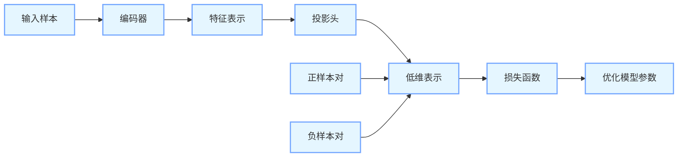

# 模型训练中的对比学习技术在高质量特征提取与推理中的应用

> 关键词：对比学习、模型训练、高质量特征提取、推理应用、深度学习

> 摘要：本文深入探讨了模型训练中的对比学习技术在高质量特征提取与推理中的应用。首先介绍了对比学习的背景知识，包括其目的、适用读者和文档结构等。接着详细阐述了对比学习的核心概念、算法原理、数学模型。通过实际项目案例展示了对比学习在实际开发中的应用，包括环境搭建、代码实现与解读。分析了对比学习在不同领域的实际应用场景，并推荐了相关的学习资源、开发工具和论文著作。最后总结了对比学习的未来发展趋势与挑战，还提供了常见问题解答和扩展阅读参考资料，旨在为读者全面呈现对比学习技术在高质量特征提取与推理中的重要作用和应用方法。

## 1. 背景介绍 
### 1.1 目的和范围
在当今的人工智能和机器学习领域，模型训练是一个核心环节。高质量的特征提取和准确的推理能力对于模型的性能至关重要。对比学习技术作为一种新兴的训练方法，旨在通过对比不同样本之间的相似性和差异性，学习到更具区分性和鲁棒性的特征表示。本文的目的是深入探讨对比学习技术在模型训练过程中如何实现高质量的特征提取，并将这些特征应用于推理任务中，以提高模型的性能和泛化能力。

本文的范围涵盖了对比学习的基本概念、算法原理、数学模型，以及在实际项目中的应用案例。同时，还将介绍对比学习在不同领域的实际应用场景，推荐相关的学习资源、开发工具和论文著作，帮助读者全面了解和掌握对比学习技术。

### 1.2 预期读者
本文预期的读者包括人工智能、机器学习领域的研究人员、开发者，以及对对比学习技术感兴趣的技术爱好者。对于正在进行模型训练和特征提取相关工作的专业人士，本文可以提供深入的技术分析和实践指导；对于初学者，本文可以作为一个系统的学习资料，帮助他们快速了解对比学习的基本概念和应用方法。

### 1.3 文档结构概述
本文将按照以下结构进行组织：
- 核心概念与联系：介绍对比学习的基本概念、原理和架构，通过文本示意图和 Mermaid 流程图进行直观展示。
- 核心算法原理 & 具体操作步骤：详细讲解对比学习的核心算法原理，并使用 Python 源代码进行具体实现和步骤说明。
- 数学模型和公式 & 详细讲解 & 举例说明：介绍对比学习的数学模型和相关公式，并通过具体例子进行详细解释。
- 项目实战：代码实际案例和详细解释说明：通过一个实际的项目案例，展示对比学习在实际开发中的应用，包括开发环境搭建、源代码实现和代码解读。
- 实际应用场景：分析对比学习在不同领域的实际应用场景。
- 工具和资源推荐：推荐相关的学习资源、开发工具和论文著作。
- 总结：未来发展趋势与挑战：总结对比学习的未来发展趋势和面临的挑战。
- 附录：常见问题与解答：提供常见问题的解答。
- 扩展阅读 & 参考资料：提供扩展阅读的建议和参考资料。

### 1.4 术语表
#### 1.4.1 核心术语定义
- **对比学习（Contrastive Learning）**：一种无监督学习方法，通过对比不同样本之间的相似性和差异性来学习特征表示。
- **正样本对（Positive Pairs）**：在对比学习中，具有相似特征或属于同一类别的样本对。
- **负样本对（Negative Pairs）**：在对比学习中，具有不同特征或属于不同类别的样本对。
- **特征提取（Feature Extraction）**：从原始数据中提取出具有代表性和区分性的特征的过程。
- **推理（Inference）**：在模型训练完成后，使用训练好的模型对新的数据进行预测或分类的过程。

#### 1.4.2 相关概念解释
- **无监督学习（Unsupervised Learning）**：一种机器学习方法，不需要标注数据，通过数据本身的结构和规律来学习特征表示。
- **表示学习（Representation Learning）**：旨在学习数据的有效表示，使得这些表示能够更好地用于后续的任务，如分类、预测等。
- **度量学习（Metric Learning）**：学习样本之间的距离度量，使得相似的样本在特征空间中距离更近，不相似的样本距离更远。

#### 1.4.3 缩略词列表
- **CNN（Convolutional Neural Network）**：卷积神经网络
- **MLP（Multi-Layer Perceptron）**：多层感知机
- **SOTA（State-of-the-Art）**：当前最优

## 2. 核心概念与联系 

### 对比学习的基本原理
对比学习的核心思想是通过对比正样本对和负样本对，使得模型能够学习到样本之间的相似性和差异性。在对比学习中，通常会定义一个损失函数，鼓励正样本对在特征空间中的距离尽可能小，而负样本对的距离尽可能大。

### 对比学习的架构
对比学习的架构通常包括编码器（Encoder）和投影头（Projection Head）。编码器用于将输入的样本映射到特征空间，投影头则用于将编码器输出的特征进一步映射到一个低维的表示空间，以便进行对比学习。

### 文本示意图
```plaintext
输入样本 -> 编码器 -> 特征表示 -> 投影头 -> 低维表示
正样本对和负样本对在低维表示空间中进行对比，通过损失函数优化模型参数
```

### Mermaid 流程图


## 3. 核心算法原理 & 具体操作步骤 

### 对比学习的核心算法原理
对比学习的核心算法通常基于 InfoNCE（Info Noise Contrastive Estimation）损失函数。InfoNCE 损失函数的目标是最大化正样本对之间的互信息，同时最小化负样本对之间的互信息。

InfoNCE 损失函数的公式如下：
$$
L_{InfoNCE} = -\log\frac{\exp(\text{sim}(z_i, z_j) / \tau)}{\sum_{k=1}^{N}\exp(\text{sim}(z_i, z_k) / \tau)}
$$
其中，$z_i$ 和 $z_j$ 是正样本对的低维表示，$z_k$ 是负样本对的低维表示，$\text{sim}$ 是相似度函数（通常使用余弦相似度），$\tau$ 是温度参数。

### 具体操作步骤
以下是使用 Python 和 PyTorch 实现对比学习的具体步骤：

```python
import torch
import torch.nn as nn
import torch.optim as optim
import torch.nn.functional as F

# 定义编码器
class Encoder(nn.Module):
    def __init__(self):
        super(Encoder, self).__init__()
        self.fc1 = nn.Linear(10, 20)
        self.fc2 = nn.Linear(20, 10)

    def forward(self, x):
        x = F.relu(self.fc1(x))
        x = self.fc2(x)
        return x

# 定义投影头
class ProjectionHead(nn.Module):
    def __init__(self):
        super(ProjectionHead, self).__init__()
        self.fc = nn.Linear(10, 5)

    def forward(self, x):
        x = self.fc(x)
        return x

# 定义 InfoNCE 损失函数
def info_nce_loss(features, temperature=0.1):
    batch_size = features.shape[0]
    labels = torch.arange(batch_size).to(features.device)
    similarity_matrix = F.cosine_similarity(features.unsqueeze(1), features.unsqueeze(0), dim=2)
    mask = torch.eye(batch_size, dtype=torch.bool).to(features.device)
    positives = similarity_matrix[~mask].view(batch_size, -1)
    negatives = similarity_matrix[mask].unsqueeze(1)
    logits = torch.cat([positives, negatives], dim=1)
    logits /= temperature
    loss = F.cross_entropy(logits, labels)
    return loss

# 初始化模型和优化器
encoder = Encoder()
projection_head = ProjectionHead()
optimizer = optim.Adam(list(encoder.parameters()) + list(projection_head.parameters()), lr=0.001)

# 模拟训练数据
batch_size = 16
input_data = torch.randn(batch_size, 10)

# 训练循环
num_epochs = 10
for epoch in range(num_epochs):
    # 前向传播
    features = encoder(input_data)
    projected_features = projection_head(features)
    loss = info_nce_loss(projected_features)

    # 反向传播和优化
    optimizer.zero_grad()
    loss.backward()
    optimizer.step()

    print(f'Epoch {epoch+1}/{num_epochs}, Loss: {loss.item()}')
```

### 代码解释
1. **编码器（Encoder）**：将输入的样本映射到特征空间。
2. **投影头（Projection Head）**：将编码器输出的特征进一步映射到低维表示空间。
3. **InfoNCE 损失函数（info_nce_loss）**：计算正样本对和负样本对之间的对比损失。
4. **训练循环**：在每个 epoch 中，进行前向传播、损失计算、反向传播和参数更新。

## 4. 数学模型和公式 & 详细讲解 & 举例说明 

### InfoNCE 损失函数的详细讲解
InfoNCE 损失函数的核心思想是通过最大化正样本对之间的互信息，同时最小化负样本对之间的互信息，来学习到更具区分性的特征表示。

具体来说，InfoNCE 损失函数的分子 $\exp(\text{sim}(z_i, z_j) / \tau)$ 表示正样本对之间的相似度得分，分母 $\sum_{k=1}^{N}\exp(\text{sim}(z_i, z_k) / \tau)$ 表示所有样本对（包括正样本对和负样本对）之间的相似度得分之和。通过取对数和负号，将最大化正样本对之间的相似度转化为最小化损失函数。

### 温度参数 $\tau$ 的作用
温度参数 $\tau$ 控制了相似度得分的缩放程度。当 $\tau$ 较小时，相似度得分的差异会被放大，模型会更加关注正样本对和负样本对之间的差异；当 $\tau$ 较大时，相似度得分的差异会被缩小，模型会更加平滑。

### 举例说明
假设我们有一个正样本对 $(z_1, z_2)$ 和两个负样本对 $(z_1, z_3)$、$(z_1, z_4)$，它们的相似度得分分别为 $\text{sim}(z_1, z_2) = 0.8$，$\text{sim}(z_1, z_3) = 0.2$，$\text{sim}(z_1, z_4) = 0.1$，温度参数 $\tau = 0.1$。

则 InfoNCE 损失函数的计算如下：
$$
\begin{align*}
L_{InfoNCE} &= -\log\frac{\exp(0.8 / 0.1)}{\exp(0.8 / 0.1) + \exp(0.2 / 0.1) + \exp(0.1 / 0.1)}\\
&= -\log\frac{\exp(8)}{\exp(8) + \exp(2) + \exp(1)}\\
&\approx -\log\frac{2980.96}{2980.96 + 7.39 + 2.72}\\
&\approx -\log(0.997)\\
&\approx 0.003
\end{align*}
$$

通过不断优化这个损失函数，模型可以学习到更具区分性的特征表示。

## 5. 项目实战：代码实际案例和详细解释说明 

### 5.1  开发环境搭建
在进行对比学习的项目实战之前，需要搭建相应的开发环境。以下是具体的步骤：

1. **安装 Python**：推荐使用 Python 3.7 及以上版本。
2. **安装 PyTorch**：根据自己的操作系统和 CUDA 版本，选择合适的 PyTorch 版本进行安装。可以参考 PyTorch 官方网站的安装指南：https://pytorch.org/get-started/locally/。
3. **安装其他依赖库**：如 NumPy、Matplotlib 等，可以使用 pip 进行安装：
```bash
pip install numpy matplotlib
```

### 5.2  源代码详细实现和代码解读
以下是一个使用对比学习进行图像特征提取的实际案例：

```python
import torch
import torch.nn as nn
import torch.optim as optim
import torchvision
import torchvision.transforms as transforms
from torch.utils.data import DataLoader

# 定义编码器
class Encoder(nn.Module):
    def __init__(self):
        super(Encoder, self).__init__()
        self.conv1 = nn.Conv2d(3, 64, kernel_size=3, stride=1, padding=1)
        self.relu1 = nn.ReLU()
        self.pool1 = nn.MaxPool2d(kernel_size=2, stride=2)
        self.conv2 = nn.Conv2d(64, 128, kernel_size=3, stride=1, padding=1)
        self.relu2 = nn.ReLU()
        self.pool2 = nn.MaxPool2d(kernel_size=2, stride=2)
        self.fc1 = nn.Linear(128 * 8 * 8, 256)
        self.relu3 = nn.ReLU()

    def forward(self, x):
        x = self.pool1(self.relu1(self.conv1(x)))
        x = self.pool2(self.relu2(self.conv2(x)))
        x = x.view(-1, 128 * 8 * 8)
        x = self.relu3(self.fc1(x))
        return x

# 定义投影头
class ProjectionHead(nn.Module):
    def __init__(self):
        super(ProjectionHead, self).__init__()
        self.fc1 = nn.Linear(256, 128)
        self.relu = nn.ReLU()
        self.fc2 = nn.Linear(128, 64)

    def forward(self, x):
        x = self.relu(self.fc1(x))
        x = self.fc2(x)
        return x

# 定义 InfoNCE 损失函数
def info_nce_loss(features, temperature=0.1):
    batch_size = features.shape[0]
    labels = torch.arange(batch_size).to(features.device)
    similarity_matrix = F.cosine_similarity(features.unsqueeze(1), features.unsqueeze(0), dim=2)
    mask = torch.eye(batch_size, dtype=torch.bool).to(features.device)
    positives = similarity_matrix[~mask].view(batch_size, -1)
    negatives = similarity_matrix[mask].unsqueeze(1)
    logits = torch.cat([positives, negatives], dim=1)
    logits /= temperature
    loss = F.cross_entropy(logits, labels)
    return loss

# 数据预处理
transform = transforms.Compose([
    transforms.Resize((32, 32)),
    transforms.ToTensor(),
    transforms.Normalize((0.5, 0.5, 0.5), (0.5, 0.5, 0.5))
])

# 加载数据集
trainset = torchvision.datasets.CIFAR10(root='./data', train=True,
                                        download=True, transform=transform)
trainloader = DataLoader(trainset, batch_size=32, shuffle=True)

# 初始化模型和优化器
encoder = Encoder()
projection_head = ProjectionHead()
optimizer = optim.Adam(list(encoder.parameters()) + list(projection_head.parameters()), lr=0.001)

# 训练循环
num_epochs = 10
for epoch in range(num_epochs):
    running_loss = 0.0
    for i, data in enumerate(trainloader, 0):
        inputs, _ = data
        optimizer.zero_grad()

        # 前向传播
        features = encoder(inputs)
        projected_features = projection_head(features)
        loss = info_nce_loss(projected_features)

        # 反向传播和优化
        loss.backward()
        optimizer.step()

        running_loss += loss.item()

    print(f'Epoch {epoch+1}/{num_epochs}, Loss: {running_loss / len(trainloader)}')
```

### 5.3  代码解读与分析
1. **编码器（Encoder）**：使用卷积神经网络（CNN）对输入的图像进行特征提取。
2. **投影头（Projection Head）**：将编码器输出的特征进一步映射到低维表示空间。
3. **InfoNCE 损失函数（info_nce_loss）**：计算正样本对和负样本对之间的对比损失。
4. **数据预处理**：使用 `torchvision.transforms` 对图像进行预处理，包括调整大小、转换为张量和归一化。
5. **数据集加载**：使用 `torchvision.datasets.CIFAR10` 加载 CIFAR-10 数据集，并使用 `DataLoader` 进行批量加载。
6. **训练循环**：在每个 epoch 中，遍历训练数据集，进行前向传播、损失计算、反向传播和参数更新。

通过这个项目实战，我们可以看到对比学习在图像特征提取中的应用，通过优化 InfoNCE 损失函数，模型可以学习到更具区分性的图像特征。

## 6. 实际应用场景 
### 计算机视觉领域
- **图像分类**：对比学习可以用于提取图像的高质量特征，从而提高图像分类模型的性能。通过对比不同类别的图像，模型可以学习到更具区分性的特征表示，使得不同类别的图像在特征空间中距离更远，同一类别的图像距离更近。
- **目标检测**：在目标检测任务中，对比学习可以帮助模型学习到目标的特征表示，从而提高目标检测的准确性。通过对比目标和背景的特征，模型可以更好地识别目标的位置和类别。
- **图像检索**：对比学习可以用于构建图像检索系统。通过将图像映射到特征空间，对比不同图像之间的特征相似度，可以实现快速准确的图像检索。

### 自然语言处理领域
- **文本分类**：对比学习可以用于提取文本的特征表示，从而提高文本分类模型的性能。通过对比不同类别的文本，模型可以学习到更具区分性的特征表示，使得不同类别的文本在特征空间中距离更远，同一类别的文本距离更近。
- **语义相似度计算**：在语义相似度计算任务中，对比学习可以帮助模型学习到文本的语义特征表示，从而更准确地计算文本之间的语义相似度。通过对比相似和不相似的文本对，模型可以学习到更具语义信息的特征表示。
- **机器翻译**：对比学习可以用于机器翻译任务。通过对比源语言和目标语言的句子，模型可以学习到跨语言的特征表示，从而提高机器翻译的质量。

### 音频处理领域
- **语音识别**：对比学习可以用于提取语音的特征表示，从而提高语音识别模型的性能。通过对比不同语音信号的特征，模型可以学习到更具区分性的特征表示，使得不同语音信号在特征空间中距离更远，同一语音信号距离更近。
- **音频分类**：在音频分类任务中，对比学习可以帮助模型学习到音频的特征表示，从而提高音频分类的准确性。通过对比不同类别的音频，模型可以更好地识别音频的类别。
- **音乐检索**：对比学习可以用于构建音乐检索系统。通过将音乐映射到特征空间，对比不同音乐之间的特征相似度，可以实现快速准确的音乐检索。

## 7. 工具和资源推荐
### 7.1 学习资源推荐
#### 7.1.1 书籍推荐
- 《深度学习》（Deep Learning）：由 Ian Goodfellow、Yoshua Bengio 和 Aaron Courville 撰写，是深度学习领域的经典教材，涵盖了深度学习的基本概念、算法和应用。
- 《动手学深度学习》（Dive into Deep Learning）：由 Aston Zhang、Zack C. Lipton、Mu Li 和 Alexander J. Smola 撰写，是一本实践性很强的深度学习教材，提供了大量的代码示例和实验。

#### 7.1.2 在线课程
- Coursera 上的《深度学习专项课程》（Deep Learning Specialization）：由 Andrew Ng 教授授课，是深度学习领域的经典在线课程，涵盖了深度学习的各个方面。
- edX 上的《麻省理工学院：深度学习》（MIT: Deep Learning）：由麻省理工学院的教授授课，提供了深度学习的高级课程内容。

#### 7.1.3 技术博客和网站
- Medium 上的 Towards Data Science：是一个专注于数据科学和机器学习的技术博客，提供了大量的高质量文章和教程。
- arXiv：是一个预印本服务器，提供了大量的学术论文，包括对比学习领域的最新研究成果。

### 7.2 开发工具框架推荐
#### 7.2.1 IDE和编辑器
- PyCharm：是一款专门为 Python 开发设计的集成开发环境（IDE），提供了丰富的功能和插件，方便进行代码编写、调试和管理。
- Jupyter Notebook：是一个交互式的开发环境，适合进行数据探索、模型实验和可视化。

#### 7.2.2 调试和性能分析工具
- TensorBoard：是 TensorFlow 提供的一个可视化工具，可以用于可视化模型的训练过程、损失函数变化、参数分布等。
- PyTorch Profiler：是 PyTorch 提供的一个性能分析工具，可以用于分析模型的性能瓶颈，优化代码效率。

#### 7.2.3 相关框架和库
- PyTorch：是一个开源的深度学习框架，提供了丰富的神经网络层和优化算法，方便进行模型训练和开发。
- TensorFlow：是另一个广泛使用的深度学习框架，提供了高效的分布式训练和部署能力。

### 7.3 相关论文著作推荐
#### 7.3.1 经典论文
- 《A Simple Framework for Contrastive Learning of Visual Representations》（SimCLR）：提出了一种简单而有效的对比学习框架，在图像特征提取任务中取得了很好的效果。
- 《Momentum Contrast for Unsupervised Visual Representation Learning》（MoCo）：提出了一种基于动量对比的无监督视觉表示学习方法，通过维护一个队列来存储负样本，提高了对比学习的效率。

#### 7.3.2 最新研究成果
- 《BYOL: Bootstrap Your Own Latent: A New Approach to Self-Supervised Learning》：提出了一种自监督学习方法，通过自举的方式学习特征表示，不需要负样本对。
- 《SwAV: Unsupervised Learning of Visual Features by Contrasting Cluster Assignments》：提出了一种基于聚类对比的无监督学习方法，通过对比不同聚类的分配结果来学习特征表示。

#### 7.3.3 应用案例分析
- 《Contrastive Learning for Medical Image Analysis》：探讨了对比学习在医学图像分析领域的应用，如疾病诊断、图像分割等。
- 《Contrastive Learning for Recommendation Systems》：研究了对比学习在推荐系统中的应用，通过对比用户的偏好和物品的特征，提高推荐的准确性。

## 8. 总结：未来发展趋势与挑战
### 未来发展趋势
- **多模态对比学习**：将对比学习应用于多模态数据，如图像、文本、音频等，以学习到更全面和丰富的特征表示。
- **无监督和半监督学习的结合**：将对比学习与无监督和半监督学习方法相结合，减少对标注数据的依赖，提高模型的泛化能力。
- **对比学习在强化学习中的应用**：将对比学习应用于强化学习中，帮助智能体学习到更具区分性的状态表示，提高强化学习的效率和性能。

### 挑战
- **计算资源需求**：对比学习通常需要大量的计算资源和时间来训练模型，特别是在处理大规模数据集时，计算成本较高。
- **负样本选择**：负样本的选择对对比学习的性能有很大影响，如何选择合适的负样本是一个挑战。
- **模型可解释性**：对比学习模型通常是黑盒模型，缺乏可解释性，如何提高模型的可解释性是一个重要的研究方向。

## 9. 附录：常见问题与解答
### 问题 1：对比学习和监督学习有什么区别？
对比学习是一种无监督学习方法，不需要标注数据，通过对比不同样本之间的相似性和差异性来学习特征表示。而监督学习需要标注数据，通过最小化预测结果和标注之间的损失来训练模型。

### 问题 2：对比学习中的温度参数 $\tau$ 有什么作用？
温度参数 $\tau$ 控制了相似度得分的缩放程度。当 $\tau$ 较小时，相似度得分的差异会被放大，模型会更加关注正样本对和负样本对之间的差异；当 $\tau$ 较大时，相似度得分的差异会被缩小，模型会更加平滑。

### 问题 3：如何选择合适的负样本？
选择合适的负样本是对比学习中的一个关键问题。常见的方法包括随机选择负样本、基于难例挖掘选择负样本等。在实际应用中，需要根据具体的任务和数据集来选择合适的负样本选择方法。

### 问题 4：对比学习可以应用于哪些领域？
对比学习可以应用于计算机视觉、自然语言处理、音频处理等多个领域，如图像分类、目标检测、文本分类、语义相似度计算、语音识别等。

## 10. 扩展阅读 & 参考资料
### 扩展阅读
- 《Self-Supervised Learning: Generative or Contrastive》：深入探讨了自监督学习中的生成式和对比式方法的优缺点。
- 《Contrastive Learning in Practice》：介绍了对比学习在实际应用中的一些技巧和经验。

### 参考资料
- SimCLR 论文：https://arxiv.org/abs/2002.05709
- MoCo 论文：https://arxiv.org/abs/1911.05722
- BYOL 论文：https://arxiv.org/abs/2006.07733
- SwAV 论文：https://arxiv.org/abs/2006.09882

作者：AI天才研究院/AI Genius Institute & 禅与计算机程序设计艺术 /Zen And The Art of Computer Programming