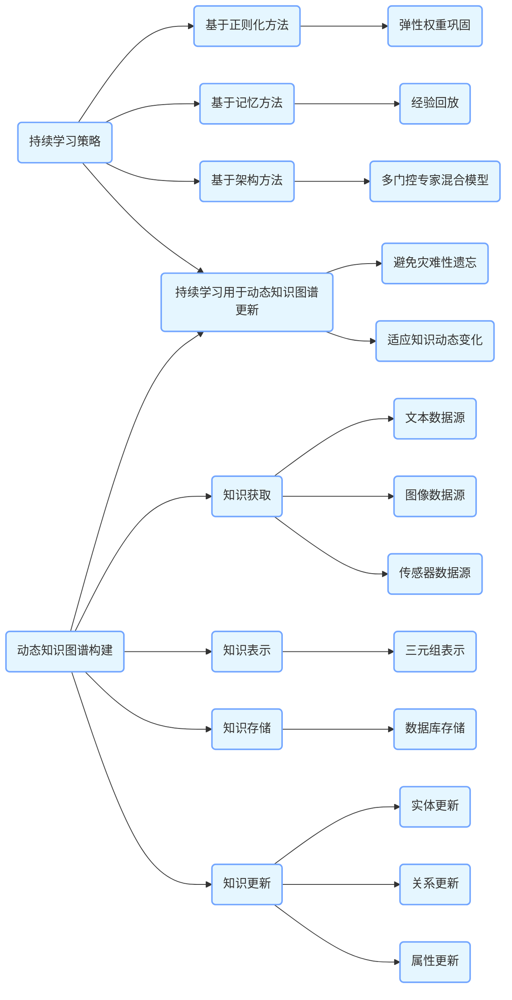

# 模型训练中的持续学习策略在动态知识图谱构建中的应用

> 关键词：模型训练、持续学习策略、动态知识图谱构建、机器学习、知识更新

> 摘要：本文聚焦于模型训练中的持续学习策略在动态知识图谱构建中的应用。首先介绍了相关背景，包括目的、预期读者等。详细阐述了核心概念，如持续学习和动态知识图谱的原理及联系，并给出示意图和流程图。深入讲解了核心算法原理和具体操作步骤，结合Python代码进行说明。分析了相关数学模型和公式，并举例说明。通过项目实战展示了代码的实际应用和详细解读。探讨了实际应用场景，推荐了学习资源、开发工具框架以及相关论文著作。最后总结了未来发展趋势与挑战，并给出常见问题解答和扩展阅读参考资料。旨在为相关领域的研究者和开发者提供全面且深入的技术指导。

## 1. 背景介绍 
### 1.1 目的和范围
在当今信息爆炸的时代，知识处于不断更新和变化的状态。传统的知识图谱构建方法往往难以适应这种动态变化，无法及时准确地反映最新的知识信息。模型训练中的持续学习策略为解决这一问题提供了新的思路和方法。本文章的目的在于深入探讨持续学习策略如何应用于动态知识图谱的构建，以实现知识图谱的实时更新和动态演化。具体范围涵盖了持续学习策略的原理、核心算法、数学模型，以及在实际项目中的应用和相关工具资源的推荐等方面。

### 1.2 预期读者
本文预期读者包括人工智能、机器学习、自然语言处理等领域的研究者、开发者，以及对知识图谱构建和持续学习策略感兴趣的技术爱好者。对于正在从事知识图谱相关项目开发的工程师，本文可以为他们提供实用的技术方案和实践经验；对于学术研究人员，本文可以为他们的研究提供理论支持和新的研究方向。

### 1.3 文档结构概述
本文按照以下结构进行组织：首先介绍背景信息，让读者了解文章的目的和适用范围；接着阐述核心概念，包括持续学习和动态知识图谱的原理及联系；然后详细讲解核心算法原理和具体操作步骤，并结合Python代码进行说明；分析相关数学模型和公式，并举例说明；通过项目实战展示代码的实际应用和详细解读；探讨实际应用场景；推荐学习资源、开发工具框架以及相关论文著作；最后总结未来发展趋势与挑战，给出常见问题解答和扩展阅读参考资料。

### 1.4 术语表
#### 1.4.1 核心术语定义
- **持续学习（Continual Learning）**：也称为终身学习，是指模型能够在不断接收新数据的过程中持续学习，同时保留之前学习到的知识，避免灾难性遗忘。
- **动态知识图谱（Dynamic Knowledge Graph）**：是一种能够实时反映知识的动态变化，不断更新和扩展实体、关系及属性信息的知识图谱。
- **灾难性遗忘（Catastrophic Forgetting）**：指模型在学习新任务时，会迅速忘记之前学习到的知识，导致对旧任务的性能急剧下降。

#### 1.4.2 相关概念解释
- **知识图谱（Knowledge Graph）**：是一种以图的形式表示知识的结构化数据，由实体、关系和属性组成。实体是现实世界中的对象，关系表示实体之间的联系，属性则描述实体的特征。
- **模型训练（Model Training）**：是指通过使用大量的数据对模型进行优化，使模型能够学习到数据中的模式和规律，从而实现特定的任务，如分类、预测等。

#### 1.4.3 缩略词列表
- **ML（Machine Learning）**：机器学习
- **DL（Deep Learning）**：深度学习
- **KG（Knowledge Graph）**：知识图谱

## 2. 核心概念与联系 

### 持续学习原理
持续学习的核心目标是让模型在不断接收新数据的过程中，能够持续学习新知识，同时保留之前学习到的知识。为了实现这一目标，需要解决灾难性遗忘的问题。常见的持续学习方法包括基于正则化的方法、基于记忆的方法和基于架构的方法。

基于正则化的方法通过在损失函数中添加正则化项，限制模型参数的更新范围，从而避免模型在学习新任务时过度修改旧知识。例如，弹性权重巩固（Elastic Weight Consolidation，EWC）方法通过计算每个参数对旧任务的重要性，为参数添加不同的正则化强度，使得对旧任务重要的参数在学习新任务时更新幅度较小。

基于记忆的方法通过在模型中引入记忆模块，存储一些旧任务的数据或知识，在学习新任务时，利用这些记忆信息来帮助模型保留旧知识。例如，经验回放（Experience Replay）方法会随机从记忆缓冲区中采样旧数据，与新数据一起进行训练，从而避免模型遗忘旧知识。

基于架构的方法则通过设计特殊的模型架构，使得模型能够分离不同任务的学习，从而避免任务之间的干扰。例如，多门控专家混合模型（Mixture of Experts with Gating Networks）通过门控网络将不同的专家网络分配给不同的任务，每个专家网络专门处理一个任务，从而避免不同任务之间的相互影响。

### 动态知识图谱原理
动态知识图谱是传统知识图谱的扩展，它能够实时反映知识的动态变化。动态知识图谱的构建过程包括知识的获取、表示、存储和更新。知识获取是指从各种数据源中收集新知识，如文本、图像、传感器数据等。知识表示是将获取到的知识转换为适合计算机处理的形式，如三元组（实体，关系，实体）。知识存储是将表示好的知识存储在数据库中，以便后续的查询和使用。知识更新是动态知识图谱的核心，它需要根据新获取的知识，及时更新知识图谱中的实体、关系和属性信息。

### 核心概念联系
持续学习策略在动态知识图谱构建中起着至关重要的作用。动态知识图谱需要不断更新和扩展，以反映最新的知识信息。而持续学习策略能够让模型在不断接收新数据的过程中，持续学习新知识，同时保留之前学习到的知识，从而避免在更新知识图谱时出现灾难性遗忘的问题。通过持续学习，模型可以不断适应知识图谱的动态变化，提高知识图谱的准确性和完整性。

### 文本示意图
```plaintext
持续学习策略
|
|-- 基于正则化方法
|   |-- 弹性权重巩固
|
|-- 基于记忆方法
|   |-- 经验回放
|
|-- 基于架构方法
|   |-- 多门控专家混合模型

动态知识图谱构建
|
|-- 知识获取
|   |-- 文本数据源
|   |-- 图像数据源
|   |-- 传感器数据源
|
|-- 知识表示
|   |-- 三元组表示
|
|-- 知识存储
|   |-- 数据库存储
|
|-- 知识更新
|   |-- 实体更新
|   |-- 关系更新
|   |-- 属性更新

持续学习策略与动态知识图谱构建的联系
|
|-- 持续学习用于动态知识图谱的知识更新
|   |-- 避免灾难性遗忘
|   |-- 适应知识动态变化
```

### Mermaid流程图


## 3. 核心算法原理 & 具体操作步骤 

### 基于经验回放的持续学习算法原理
经验回放是一种基于记忆的持续学习方法，其核心思想是在模型学习新数据时，随机从记忆缓冲区中采样旧数据，与新数据一起进行训练，从而避免模型遗忘旧知识。具体来说，经验回放算法的步骤如下：
1. **初始化记忆缓冲区**：在开始训练之前，创建一个记忆缓冲区，用于存储旧数据。记忆缓冲区的大小可以根据实际情况进行调整。
2. **训练模型**：在每个训练步骤中，从当前的新数据集中随机采样一批数据，同时从记忆缓冲区中随机采样一批旧数据。将新数据和旧数据合并成一个批次，用于训练模型。
3. **更新记忆缓冲区**：在每次训练完成后，将当前训练使用的新数据添加到记忆缓冲区中。如果记忆缓冲区已满，则按照一定的策略（如先进先出）删除一些旧数据，以保持缓冲区的大小不变。

### Python代码实现
```python
import numpy as np
import torch
import torch.nn as nn
import torch.optim as optim

# 定义一个简单的神经网络模型
class SimpleModel(nn.Module):
    def __init__(self, input_size, hidden_size, output_size):
        super(SimpleModel, self).__init__()
        self.fc1 = nn.Linear(input_size, hidden_size)
        self.relu = nn.ReLU()
        self.fc2 = nn.Linear(hidden_size, output_size)

    def forward(self, x):
        out = self.fc1(x)
        out = self.relu(out)
        out = self.fc2(out)
        return out

# 初始化模型和优化器
input_size = 10
hidden_size = 20
output_size = 2
model = SimpleModel(input_size, hidden_size, output_size)
optimizer = optim.Adam(model.parameters(), lr=0.001)
criterion = nn.CrossEntropyLoss()

# 初始化记忆缓冲区
memory_buffer = []
buffer_size = 100

# 模拟新数据集
new_data = np.random.rand(100, input_size)
new_labels = np.random.randint(0, output_size, 100)

# 训练模型
num_epochs = 10
for epoch in range(num_epochs):
    # 从新数据集中随机采样一批数据
    batch_indices = np.random.choice(len(new_data), 32)
    batch_data = torch.tensor(new_data[batch_indices], dtype=torch.float32)
    batch_labels = torch.tensor(new_labels[batch_indices], dtype=torch.long)

    # 从记忆缓冲区中随机采样一批旧数据
    if len(memory_buffer) > 0:
        memory_indices = np.random.choice(len(memory_buffer), min(32, len(memory_buffer)))
        memory_data = [memory_buffer[i][0] for i in memory_indices]
        memory_labels = [memory_buffer[i][1] for i in memory_indices]
        memory_data = torch.stack(memory_data)
        memory_labels = torch.tensor(memory_labels, dtype=torch.long)

        # 合并新数据和旧数据
        combined_data = torch.cat((batch_data, memory_data), dim=0)
        combined_labels = torch.cat((batch_labels, memory_labels), dim=0)
    else:
        combined_data = batch_data
        combined_labels = batch_labels

    # 前向传播
    outputs = model(combined_data)
    loss = criterion(outputs, combined_labels)

    # 反向传播和优化
    optimizer.zero_grad()
    loss.backward()
    optimizer.step()

    # 更新记忆缓冲区
    for i in batch_indices:
        data = torch.tensor(new_data[i], dtype=torch.float32)
        label = new_labels[i]
        if len(memory_buffer) < buffer_size:
            memory_buffer.append((data, label))
        else:
            # 先进先出策略
            memory_buffer.pop(0)
            memory_buffer.append((data, label))

    print(f'Epoch [{epoch+1}/{num_epochs}], Loss: {loss.item():.4f}')
```

### 代码解释
1. **模型定义**：定义了一个简单的两层神经网络模型`SimpleModel`，包含一个输入层、一个隐藏层和一个输出层。
2. **初始化**：初始化模型、优化器和损失函数。同时，初始化记忆缓冲区`memory_buffer`，并设置缓冲区的大小`buffer_size`。
3. **训练过程**：在每个训练步骤中，从新数据集中随机采样一批数据，同时从记忆缓冲区中随机采样一批旧数据。将新数据和旧数据合并成一个批次，用于训练模型。
4. **更新记忆缓冲区**：在每次训练完成后，将当前训练使用的新数据添加到记忆缓冲区中。如果记忆缓冲区已满，则按照先进先出的策略删除一些旧数据。

## 4. 数学模型和公式 & 详细讲解 & 举例说明 

### 损失函数
在持续学习中，通常使用交叉熵损失函数来衡量模型的预测结果与真实标签之间的差异。交叉熵损失函数的公式如下：
$$
L = -\frac{1}{N}\sum_{i=1}^{N}\sum_{j=1}^{C}y_{ij}\log(p_{ij})
$$
其中，$N$ 是样本数量，$C$ 是类别数量，$y_{ij}$ 是第 $i$ 个样本的真实标签的第 $j$ 个分量（如果第 $i$ 个样本属于第 $j$ 类，则 $y_{ij}=1$，否则 $y_{ij}=0$），$p_{ij}$ 是模型对第 $i$ 个样本属于第 $j$ 类的预测概率。

### 弹性权重巩固（EWC）的正则化项
弹性权重巩固（EWC）是一种基于正则化的持续学习方法，它通过在损失函数中添加正则化项来避免灾难性遗忘。正则化项的公式如下：
$$
\mathcal{L}_{EWC}(\theta) = \mathcal{L}(\theta) + \frac{\lambda}{2}\sum_{i}F_{i}(\theta_{i}-\theta_{i}^{*})^2
$$
其中，$\mathcal{L}(\theta)$ 是原始的损失函数，$\lambda$ 是正则化强度，$F_{i}$ 是第 $i$ 个参数对旧任务的重要性，$\theta_{i}$ 是当前参数的值，$\theta_{i}^{*}$ 是旧任务训练完成后的参数值。

### 举例说明
假设我们有一个二分类问题，有 10 个样本，模型的预测结果和真实标签如下：
| 样本编号 | 真实标签 | 预测概率（类别 0） | 预测概率（类别 1） |
| ---- | ---- | ---- | ---- |
| 1 | 0 | 0.8 | 0.2 |
| 2 | 1 | 0.3 | 0.7 |
| 3 | 0 | 0.9 | 0.1 |
| 4 | 1 | 0.2 | 0.8 |
| 5 | 0 | 0.7 | 0.3 |
| 6 | 1 | 0.4 | 0.6 |
| 7 | 0 | 0.85 | 0.15 |
| 8 | 1 | 0.25 | 0.75 |
| 9 | 0 | 0.95 | 0.05 |
| 10 | 1 | 0.1 | 0.9 |

使用交叉熵损失函数计算损失：
$$
\begin{align*}
L &= -\frac{1}{10}\sum_{i=1}^{10}\sum_{j=0}^{1}y_{ij}\log(p_{ij}) \\
&= -\frac{1}{10}[(1\times\log(0.8)+0\times\log(0.2))+(0\times\log(0.3)+1\times\log(0.7))+\cdots+(0\times\log(0.1)+1\times\log(0.9))] \\
&\approx 0.23
\end{align*}
$$

假设在使用 EWC 方法时，某个参数 $\theta$ 对旧任务的重要性 $F = 10$，旧任务训练完成后的参数值 $\theta^{*} = 0.5$，当前参数值 $\theta = 0.6$，正则化强度 $\lambda = 0.1$，则该参数的正则化项为：
$$
\frac{\lambda}{2}F(\theta - \theta^{*})^2 = \frac{0.1}{2}\times10\times(0.6 - 0.5)^2 = 0.005
$$

## 5. 项目实战：代码实际案例和详细解释说明 

### 5.1  开发环境搭建
#### 安装 Python
首先，确保你已经安装了 Python 3.x 版本。可以从 Python 官方网站（https://www.python.org/downloads/）下载并安装适合你操作系统的 Python 版本。

#### 安装依赖库
在项目中，我们需要使用一些 Python 库，如`torch`、`numpy`等。可以使用以下命令来安装这些库：
```sh
pip install torch numpy
```

### 5.2  源代码详细实现和代码解读
以下是一个完整的基于经验回放的持续学习策略在动态知识图谱构建中的示例代码：
```python
import numpy as np
import torch
import torch.nn as nn
import torch.optim as optim

# 定义一个简单的知识图谱嵌入模型
class KnowledgeGraphEmbeddingModel(nn.Module):
    def __init__(self, num_entities, num_relations, embedding_dim):
        super(KnowledgeGraphEmbeddingModel, self).__init__()
        self.entity_embeddings = nn.Embedding(num_entities, embedding_dim)
        self.relation_embeddings = nn.Embedding(num_relations, embedding_dim)

    def forward(self, head, relation, tail):
        head_emb = self.entity_embeddings(head)
        relation_emb = self.relation_embeddings(relation)
        tail_emb = self.entity_embeddings(tail)
        score = torch.sum((head_emb + relation_emb - tail_emb) ** 2, dim=1)
        return score

# 初始化模型和优化器
num_entities = 100
num_relations = 10
embedding_dim = 50
model = KnowledgeGraphEmbeddingModel(num_entities, num_relations, embedding_dim)
optimizer = optim.Adam(model.parameters(), lr=0.001)
criterion = nn.MSELoss()

# 初始化记忆缓冲区
memory_buffer = []
buffer_size = 100

# 模拟新的知识图谱三元组数据
new_triples = np.random.randint(0, num_entities, (100, 3))
new_labels = np.random.rand(100)

# 训练模型
num_epochs = 10
for epoch in range(num_epochs):
    # 从新数据集中随机采样一批数据
    batch_indices = np.random.choice(len(new_triples), 32)
    batch_triples = torch.tensor(new_triples[batch_indices], dtype=torch.long)
    batch_labels = torch.tensor(new_labels[batch_indices], dtype=torch.float32)

    head = batch_triples[:, 0]
    relation = batch_triples[:, 1]
    tail = batch_triples[:, 2]

    # 从记忆缓冲区中随机采样一批旧数据
    if len(memory_buffer) > 0:
        memory_indices = np.random.choice(len(memory_buffer), min(32, len(memory_buffer)))
        memory_triples = [memory_buffer[i][0] for i in memory_indices]
        memory_labels = [memory_buffer[i][1] for i in memory_indices]
        memory_triples = torch.stack(memory_triples)
        memory_labels = torch.tensor(memory_labels, dtype=torch.float32)

        memory_head = memory_triples[:, 0]
        memory_relation = memory_triples[:, 1]
        memory_tail = memory_triples[:, 2]

        # 合并新数据和旧数据
        combined_head = torch.cat((head, memory_head), dim=0)
        combined_relation = torch.cat((relation, memory_relation), dim=0)
        combined_tail = torch.cat((tail, memory_tail), dim=0)
        combined_labels = torch.cat((batch_labels, memory_labels), dim=0)
    else:
        combined_head = head
        combined_relation = relation
        combined_tail = tail
        combined_labels = batch_labels

    # 前向传播
    scores = model(combined_head, combined_relation, combined_tail)
    loss = criterion(scores, combined_labels)

    # 反向传播和优化
    optimizer.zero_grad()
    loss.backward()
    optimizer.step()

    # 更新记忆缓冲区
    for i in batch_indices:
        triple = torch.tensor(new_triples[i], dtype=torch.long)
        label = new_labels[i]
        if len(memory_buffer) < buffer_size:
            memory_buffer.append((triple, label))
        else:
            # 先进先出策略
            memory_buffer.pop(0)
            memory_buffer.append((triple, label))

    print(f'Epoch [{epoch+1}/{num_epochs}], Loss: {loss.item():.4f}')
```

### 5.3  代码解读与分析
1. **模型定义**：定义了一个简单的知识图谱嵌入模型`KnowledgeGraphEmbeddingModel`，该模型使用嵌入层将实体和关系映射到低维向量空间，并通过计算三元组的得分来评估三元组的合理性。
2. **初始化**：初始化模型、优化器和损失函数。同时，初始化记忆缓冲区`memory_buffer`，并设置缓冲区的大小`buffer_size`。
3. **数据模拟**：模拟了新的知识图谱三元组数据`new_triples`和对应的标签`new_labels`。
4. **训练过程**：在每个训练步骤中，从新数据集中随机采样一批数据，同时从记忆缓冲区中随机采样一批旧数据。将新数据和旧数据合并成一个批次，用于训练模型。
5. **更新记忆缓冲区**：在每次训练完成后，将当前训练使用的新数据添加到记忆缓冲区中。如果记忆缓冲区已满，则按照先进先出的策略删除一些旧数据。

通过这种方式，模型可以在不断接收新数据的过程中，持续学习新知识，同时保留之前学习到的知识，避免灾难性遗忘。

## 6. 实际应用场景 
### 智能问答系统
在智能问答系统中，知识图谱可以提供丰富的背景知识，帮助系统更好地理解用户的问题并给出准确的答案。随着时间的推移，知识图谱需要不断更新以反映最新的信息。使用持续学习策略可以让知识图谱在不断接收新数据的过程中持续更新，从而提高智能问答系统的性能。例如，当有新的事件发生或新的知识出现时，知识图谱可以及时更新，智能问答系统可以根据更新后的知识图谱给出更准确的答案。

### 推荐系统
推荐系统可以利用知识图谱来理解用户的兴趣和物品的属性，从而提供更个性化的推荐。随着用户行为和物品信息的不断变化，知识图谱需要不断更新以适应这种变化。持续学习策略可以让知识图谱在不断接收新数据的过程中持续更新，从而提高推荐系统的准确性和多样性。例如，当用户有新的行为或物品有新的属性时，知识图谱可以及时更新，推荐系统可以根据更新后的知识图谱为用户提供更符合其兴趣的推荐。

### 医疗领域
在医疗领域，知识图谱可以整合各种医疗知识，如疾病诊断、治疗方案等。随着医学研究的不断进展，知识图谱需要不断更新以反映最新的医学知识。使用持续学习策略可以让知识图谱在不断接收新数据的过程中持续更新，从而帮助医生做出更准确的诊断和治疗决策。例如，当有新的疾病治疗方法或药物出现时，知识图谱可以及时更新，医生可以根据更新后的知识图谱为患者提供更合适的治疗方案。

### 金融领域
在金融领域，知识图谱可以用于风险评估、市场预测等。随着金融市场的不断变化，知识图谱需要不断更新以反映最新的市场信息。持续学习策略可以让知识图谱在不断接收新数据的过程中持续更新，从而提高金融领域的决策准确性。例如，当有新的金融政策或市场动态出现时，知识图谱可以及时更新，金融机构可以根据更新后的知识图谱进行更准确的风险评估和市场预测。

## 7. 工具和资源推荐
### 7.1 学习资源推荐
#### 7.1.1 书籍推荐
- 《机器学习》（周志华）：这本书全面介绍了机器学习的基本概念、算法和应用，是机器学习领域的经典教材。
- 《深度学习》（Ian Goodfellow、Yoshua Bengio 和 Aaron Courville）：这本书系统地介绍了深度学习的理论和实践，是深度学习领域的权威著作。
- 《知识图谱：方法、实践与应用》（陈华钧）：这本书详细介绍了知识图谱的构建方法、应用场景和实践案例，是知识图谱领域的优秀书籍。

#### 7.1.2 在线课程
- Coursera 上的“机器学习”课程（Andrew Ng 教授）：这是一门非常经典的机器学习在线课程，涵盖了机器学习的基本概念、算法和应用。
- edX 上的“深度学习基础”课程：这门课程系统地介绍了深度学习的基本原理和实践方法。
- 中国大学 MOOC 上的“知识图谱”课程：这门课程详细介绍了知识图谱的构建、表示和应用。

#### 7.1.3 技术博客和网站
- Medium：Medium 上有很多关于机器学习、知识图谱等领域的优秀博客文章，可以帮助你了解最新的技术动态和研究成果。
- arXiv：arXiv 是一个预印本数据库，提供了大量的学术论文，你可以在上面找到关于持续学习、动态知识图谱等领域的最新研究成果。
- 机器之心：机器之心是一个专注于人工智能领域的科技媒体，提供了丰富的技术文章和行业资讯。

### 7.2 开发工具框架推荐
#### 7.2.1 IDE和编辑器
- PyCharm：PyCharm 是一款专门为 Python 开发设计的集成开发环境，提供了丰富的功能，如代码编辑、调试、版本控制等。
- Jupyter Notebook：Jupyter Notebook 是一个交互式的开发环境，适合进行数据分析、模型训练等工作。
- Visual Studio Code：Visual Studio Code 是一款轻量级的代码编辑器，支持多种编程语言，并且有丰富的插件可以扩展其功能。

#### 7.2.2 调试和性能分析工具
- TensorBoard：TensorBoard 是 TensorFlow 提供的一个可视化工具，可以帮助你可视化模型的训练过程、损失函数变化等信息。
- Py-Spy：Py-Spy 是一个用于分析 Python 程序性能的工具，可以帮助你找出程序中的性能瓶颈。
- cProfile：cProfile 是 Python 标准库中的一个性能分析工具，可以帮助你分析程序中各个函数的执行时间和调用次数。

#### 7.2.3 相关框架和库
- PyTorch：PyTorch 是一个开源的深度学习框架，提供了丰富的神经网络层和优化算法，易于使用和扩展。
- TensorFlow：TensorFlow 是一个广泛使用的深度学习框架，提供了强大的分布式训练和部署能力。
- DGL（Deep Graph Library）：DGL 是一个用于图神经网络的深度学习框架，提供了丰富的图神经网络模型和工具。

### 7.3 相关论文著作推荐
#### 7.3.1 经典论文
- "Overcoming catastrophic forgetting in neural networks"（James Kirkpatrick 等）：这篇论文提出了弹性权重巩固（EWC）方法，是基于正则化的持续学习方法的经典论文。
- "Learning without Forgetting"（Li Zhizhong 和 Derek Hoiem）：这篇论文提出了一种基于知识蒸馏的持续学习方法，有效避免了灾难性遗忘。
- "TransE: Translating Embeddings for Modeling Multi-relational Data"（Antoine Bordes 等）：这篇论文提出了 TransE 模型，是知识图谱嵌入领域的经典论文。

#### 7.3.2 最新研究成果
- 关注 arXiv 上关于持续学习、动态知识图谱等领域的最新论文，可以了解到该领域的最新研究进展。
- 参加相关的学术会议，如 NeurIPS、ICML、AAAI 等，这些会议会发布该领域的最新研究成果。

#### 7.3.3 应用案例分析
- 可以在 ACM Digital Library、IEEE Xplore 等学术数据库中搜索关于持续学习和动态知识图谱在不同领域应用的案例分析论文，了解这些技术在实际应用中的效果和挑战。

## 8. 总结：未来发展趋势与挑战
### 未来发展趋势
#### 多模态融合
未来，动态知识图谱的构建将更加注重多模态数据的融合，如文本、图像、语音等。通过融合多模态数据，可以更全面地描述实体和关系，提高知识图谱的准确性和完整性。同时，持续学习策略也需要适应多模态数据的特点，开发出更有效的多模态持续学习算法。

#### 强化学习与持续学习的结合
强化学习可以让智能体在与环境的交互中不断学习和优化策略。将强化学习与持续学习策略相结合，可以让动态知识图谱在不断变化的环境中自动学习和更新知识，提高知识图谱的适应性和智能性。

#### 联邦学习与持续学习的融合
联邦学习可以在不共享原始数据的情况下进行模型训练，保护数据隐私。将联邦学习与持续学习策略相结合，可以在多个参与方之间共同构建和更新动态知识图谱，同时保护各方的数据隐私。

### 挑战
#### 灾难性遗忘问题仍然存在
尽管已经提出了许多持续学习方法来解决灾难性遗忘问题，但在实际应用中，灾难性遗忘问题仍然没有得到完全解决。特别是在处理大规模和复杂的动态知识图谱时，灾难性遗忘问题更加突出。未来需要进一步研究和开发更有效的持续学习方法，以更好地解决灾难性遗忘问题。

#### 计算资源和时间成本
持续学习需要不断地接收新数据并进行模型更新，这会带来较高的计算资源和时间成本。特别是在处理大规模的动态知识图谱时，计算资源和时间成本会成为一个严重的问题。未来需要研究和开发更高效的持续学习算法和优化技术，以降低计算资源和时间成本。

#### 数据质量和标注问题
动态知识图谱的构建需要大量的高质量数据和准确的标注。然而，在实际应用中，数据质量和标注问题往往是一个挑战。低质量的数据和不准确的标注会影响模型的训练效果和知识图谱的准确性。未来需要研究和开发更有效的数据清洗和标注方法，以提高数据质量和标注准确性。

## 9. 附录：常见问题与解答
### 什么是灾难性遗忘？
灾难性遗忘是指模型在学习新任务时，会迅速忘记之前学习到的知识，导致对旧任务的性能急剧下降。在动态知识图谱构建中，灾难性遗忘会导致知识图谱在更新时丢失之前的知识，影响知识图谱的准确性和完整性。

### 持续学习有哪些常见的方法？
持续学习的常见方法包括基于正则化的方法（如弹性权重巩固）、基于记忆的方法（如经验回放）和基于架构的方法（如多门控专家混合模型）。

### 如何评估持续学习策略在动态知识图谱构建中的效果？
可以使用以下指标来评估持续学习策略在动态知识图谱构建中的效果：
- **准确性**：评估知识图谱中实体、关系和属性信息的准确性。
- **完整性**：评估知识图谱中包含的知识的完整性。
- **稳定性**：评估模型在学习新数据时对旧知识的保留程度，避免灾难性遗忘。
- **效率**：评估模型的训练和更新效率，包括计算资源和时间成本。

### 持续学习策略在处理大规模动态知识图谱时会遇到哪些问题？
持续学习策略在处理大规模动态知识图谱时会遇到以下问题：
- **计算资源和时间成本高**：大规模动态知识图谱需要处理大量的数据，持续学习需要不断地接收新数据并进行模型更新，这会带来较高的计算资源和时间成本。
- **灾难性遗忘问题更突出**：在处理大规模和复杂的动态知识图谱时，灾难性遗忘问题更加突出，需要更有效的持续学习方法来解决。
- **数据存储和管理困难**：大规模动态知识图谱需要存储大量的数据，数据的存储和管理会成为一个挑战。

## 10. 扩展阅读 & 参考资料
- Goodfellow, I. J., Bengio, Y., & Courville, A. (2016). Deep Learning. MIT Press.
- Zhou, Z. H. (2016). Machine Learning. Tsinghua University Press.
- Chen, H. J. (2020). Knowledge Graph: Methods, Practices and Applications. Tsinghua University Press.
- Kirkpatrick, J., Pascanu, R., Rabinowitz, N., Veness, J., Desjardins, G., Rusu, A. A.,... & Hassabis, D. (2017). Overcoming catastrophic forgetting in neural networks. Proceedings of the national academy of sciences, 114(13), 3521-3526.
- Li, Z., & Hoiem, D. (2016). Learning without Forgetting. IEEE transactions on pattern analysis and machine intelligence, 40(12), 2935-2947.
- Bordes, A., Usunier, N., Garcia-Duran, A., Weston, J., & Yakhnenko, O. (2013). Translating embeddings for modeling multi-relational data. Advances in neural information processing systems, 26.

作者：AI天才研究院/AI Genius Institute & 禅与计算机程序设计艺术 /Zen And The Art of Computer Programming