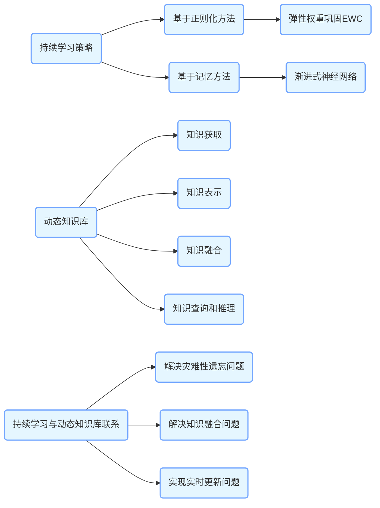

# 模型训练中的持续学习策略在动态知识库更新中的应用

> 关键词：模型训练、持续学习策略、动态知识库更新、机器学习、知识融合

> 摘要：本文聚焦于模型训练中的持续学习策略在动态知识库更新方面的应用。首先介绍了相关背景，包括目的、预期读者等信息。接着阐述了核心概念，如持续学习和动态知识库的原理及联系，并通过示意图和流程图进行说明。详细讲解了核心算法原理，给出Python代码示例，同时分析了相关数学模型和公式。通过项目实战，展示了代码实现和解读。探讨了该技术在不同场景中的实际应用，推荐了学习资源、开发工具框架以及相关论文著作。最后总结了未来发展趋势与挑战，并提供常见问题解答和扩展阅读参考资料。

## 1. 背景介绍 
### 1.1 目的和范围
在当今信息爆炸的时代，知识库中的信息需要不断更新以适应新的知识和变化。传统的模型训练方法往往难以处理动态变化的知识，而持续学习策略为解决这一问题提供了新的思路。本文的目的是深入探讨模型训练中的持续学习策略如何应用于动态知识库更新，旨在为相关领域的研究人员和开发者提供全面的技术指导和理论支持。

本文的范围涵盖了持续学习策略的基本原理、核心算法、数学模型，以及在实际项目中的应用案例。同时，还介绍了相关的学习资源、开发工具和研究成果，帮助读者更好地理解和应用这一技术。

### 1.2 预期读者
本文的预期读者包括人工智能、机器学习领域的研究人员、开发者，以及对知识库管理和更新感兴趣的专业人士。无论是初学者希望了解持续学习和动态知识库更新的基本概念，还是有一定经验的开发者想要深入研究相关算法和应用，都能从本文中获得有价值的信息。

### 1.3 文档结构概述
本文将按照以下结构进行组织：
1. 背景介绍：介绍本文的目的、预期读者和文档结构，以及相关术语的定义。
2. 核心概念与联系：阐述持续学习和动态知识库的核心概念，以及它们之间的联系，并通过示意图和流程图进行说明。
3. 核心算法原理 & 具体操作步骤：详细讲解持续学习的核心算法原理，并给出Python代码示例。
4. 数学模型和公式 & 详细讲解 & 举例说明：分析持续学习中的数学模型和公式，并通过具体例子进行说明。
5. 项目实战：代码实际案例和详细解释说明：通过一个实际项目，展示持续学习策略在动态知识库更新中的应用，包括开发环境搭建、源代码实现和代码解读。
6. 实际应用场景：探讨持续学习策略在不同领域的实际应用场景。
7. 工具和资源推荐：推荐相关的学习资源、开发工具框架和研究论文。
8. 总结：未来发展趋势与挑战：总结持续学习策略在动态知识库更新中的应用现状，分析未来发展趋势和面临的挑战。
9. 附录：常见问题与解答：解答读者在学习和应用过程中可能遇到的常见问题。
10. 扩展阅读 & 参考资料：提供相关的扩展阅读材料和参考资料。

### 1.4 术语表
#### 1.4.1 核心术语定义
- **持续学习（Continuous Learning）**：也称为终身学习（Lifelong Learning），是指模型能够在不断接收新数据的过程中持续学习，同时保留之前学到的知识，避免灾难性遗忘（Catastrophic Forgetting）。
- **动态知识库（Dynamic Knowledge Base）**：是一种能够随着时间和新信息的加入而不断更新和变化的知识库，它可以存储各种类型的知识，如事实、规则、案例等。
- **灾难性遗忘（Catastrophic Forgetting）**：指模型在学习新任务时，会忘记之前学到的旧任务的知识，导致在旧任务上的性能急剧下降。
- **知识融合（Knowledge Fusion）**：将新的知识与已有的知识库进行整合的过程，确保新知识能够被正确地融入到知识库中，同时保持知识库的一致性和完整性。

#### 1.4.2 相关概念解释
- **增量学习（Incremental Learning）**：是持续学习的一种特殊形式，它允许模型在每次接收到新数据时，对已有的模型进行更新，而不需要重新训练整个模型。
- **元学习（Meta - Learning）**：也称为学习如何学习，它的目标是让模型能够快速适应新的任务，通过学习不同任务之间的共性和规律，提高模型的泛化能力和学习效率。
- **迁移学习（Transfer Learning）**：是指将在一个任务上学习到的知识迁移到另一个相关任务上，从而加快新任务的学习速度和提高性能。

#### 1.4.3 缩略词列表
- **ML（Machine Learning）**：机器学习
- **DL（Deep Learning）**：深度学习
- **DNN（Deep Neural Network）**：深度神经网络
- **CNN（Convolutional Neural Network）**：卷积神经网络
- **RNN（Recurrent Neural Network）**：循环神经网络

## 2. 核心概念与联系 

### 持续学习原理
持续学习的核心目标是让模型能够在不断接收新数据的过程中持续学习，同时避免灾难性遗忘。为了实现这一目标，需要采用一些特殊的技术和策略。

一种常见的方法是基于正则化的方法，通过在损失函数中添加额外的正则化项，限制模型参数的变化，从而保留之前学到的知识。例如，弹性权重巩固（Elastic Weight Consolidation，EWC）算法通过计算每个参数的重要性，对重要参数的变化进行惩罚，从而减少对旧知识的遗忘。

另一种方法是基于记忆的方法，通过在模型中引入记忆模块，存储之前学习到的重要信息。当学习新任务时，可以从记忆模块中提取相关信息，帮助模型更好地保留旧知识。例如，渐进式神经网络（Progressive Neural Networks）通过在每个新任务上添加新的网络层，同时保留旧任务的网络层，避免了灾难性遗忘。

### 动态知识库原理
动态知识库是一种能够随着时间和新信息的加入而不断更新和变化的知识库。它的主要特点是具有灵活性和可扩展性，能够适应不同类型和规模的知识。

动态知识库的更新过程通常包括以下几个步骤：
1. **知识获取**：从各种数据源中收集新的知识，如文本、图像、传感器数据等。
2. **知识表示**：将获取到的新知识转换为适合存储和处理的表示形式，如三元组、本体等。
3. **知识融合**：将新的知识与已有的知识库进行整合，确保新知识能够被正确地融入到知识库中，同时保持知识库的一致性和完整性。
4. **知识查询和推理**：提供对知识库的查询和推理功能，以便用户能够获取所需的知识。

### 核心概念联系
持续学习策略在动态知识库更新中起着至关重要的作用。通过持续学习，模型可以不断适应新的知识和变化，从而实现动态知识库的实时更新。

具体来说，持续学习可以帮助动态知识库解决以下问题：
1. **灾难性遗忘问题**：避免在更新知识库时忘记之前的知识，确保知识库的稳定性和连续性。
2. **知识融合问题**：将新的知识与已有的知识库进行有效的融合，提高知识库的质量和可用性。
3. **实时更新问题**：在不断接收新数据的情况下，实时更新知识库，确保知识库的时效性。

### 文本示意图
```plaintext
持续学习策略
├── 基于正则化方法
│   └── 弹性权重巩固（EWC）
├── 基于记忆方法
│   └── 渐进式神经网络

动态知识库
├── 知识获取
├── 知识表示
├── 知识融合
└── 知识查询和推理

持续学习与动态知识库的联系
├── 解决灾难性遗忘问题
├── 解决知识融合问题
├── 实现实时更新问题
```

### Mermaid 流程图


## 3. 核心算法原理 & 具体操作步骤 

### 弹性权重巩固（EWC）算法原理
弹性权重巩固（EWC）算法是一种基于正则化的持续学习方法，其核心思想是通过计算每个参数的重要性，对重要参数的变化进行惩罚，从而减少对旧知识的遗忘。

具体来说，EWC算法在训练新任务时，会在损失函数中添加一个额外的正则化项，如下所示：

$$\mathcal{L}_{EWC}(\theta) = \mathcal{L}_{new}(\theta) + \lambda\sum_{i}\frac{F_i}{2}(\theta_i - \theta_{A}^i)^2$$

其中，$\mathcal{L}_{new}(\theta)$ 是新任务的损失函数，$\lambda$ 是正则化系数，$F_i$ 是第 $i$ 个参数的Fisher信息矩阵的对角元素，$\theta_i$ 是当前参数值，$\theta_{A}^i$ 是旧任务训练结束时的参数值。

Fisher信息矩阵 $F$ 用于衡量每个参数对旧任务的重要性，其计算公式为：

$$F_{i,j} = \mathbb{E}_{x,y\sim\mathcal{D}_{old}}\left[\frac{\partial\log p(y|x,\theta)}{\partial\theta_i}\frac{\partial\log p(y|x,\theta)}{\partial\theta_j}\right]$$

在实际应用中，通常只计算 $F$ 的对角元素 $F_i$。

### 具体操作步骤
1. **训练旧任务**：使用传统的机器学习方法训练旧任务，得到旧任务训练结束时的参数 $\theta_{A}$。
2. **计算Fisher信息矩阵**：在旧任务训练结束后，计算每个参数的Fisher信息矩阵的对角元素 $F_i$。
3. **训练新任务**：在训练新任务时，在损失函数中添加EWC正则化项，使用随机梯度下降等优化算法更新参数 $\theta$。

### Python代码示例
```python
import torch
import torch.nn as nn
import torch.optim as optim

# 定义一个简单的神经网络模型
class SimpleNet(nn.Module):
    def __init__(self):
        super(SimpleNet, self).__init__()
        self.fc1 = nn.Linear(10, 20)
        self.fc2 = nn.Linear(20, 1)

    def forward(self, x):
        x = torch.relu(self.fc1(x))
        x = self.fc2(x)
        return x

# 训练旧任务
def train_old_task(model, optimizer, criterion, old_data_loader):
    model.train()
    for inputs, labels in old_data_loader:
        optimizer.zero_grad()
        outputs = model(inputs)
        loss = criterion(outputs, labels)
        loss.backward()
        optimizer.step()
    return model.state_dict()

# 计算Fisher信息矩阵
def compute_fisher(model, old_data_loader):
    fisher = {}
    for n, p in model.named_parameters():
        fisher[n] = torch.zeros_like(p.data)
    model.train()
    for inputs, labels in old_data_loader:
        outputs = model(inputs)
        loss = torch.mean(outputs**2)  # 简单的损失函数示例
        model.zero_grad()
        loss.backward()
        for n, p in model.named_parameters():
            if p.grad is not None:
                fisher[n] += p.grad.data**2
    for n in fisher:
        fisher[n] /= len(old_data_loader)
    return fisher

# 训练新任务，添加EWC正则化项
def train_new_task(model, optimizer, criterion, new_data_loader, old_params, fisher, lambda_ewc):
    model.train()
    for inputs, labels in new_data_loader:
        optimizer.zero_grad()
        outputs = model(inputs)
        loss = criterion(outputs, labels)
        # 添加EWC正则化项
        for n, p in model.named_parameters():
            if n in old_params:
                loss += 0.5 * lambda_ewc * (fisher[n] * (p - old_params[n])**2).sum()
        loss.backward()
        optimizer.step()
    return model

# 示例使用
model = SimpleNet()
optimizer = optim.Adam(model.parameters(), lr=0.001)
criterion = nn.MSELoss()

# 模拟旧任务数据加载器
old_data_loader = []  # 实际应用中需要填充数据
old_params = train_old_task(model, optimizer, criterion, old_data_loader)
fisher = compute_fisher(model, old_data_loader)

# 模拟新任务数据加载器
new_data_loader = []  # 实际应用中需要填充数据
lambda_ewc = 100
model = train_new_task(model, optimizer, criterion, new_data_loader, old_params, fisher, lambda_ewc)
```

## 4. 数学模型和公式 & 详细讲解 & 举例说明 

### 损失函数分析
在持续学习中，损失函数的设计非常重要，它直接影响到模型的学习效果和对旧知识的保留能力。以EWC算法为例，其损失函数为：

$$\mathcal{L}_{EWC}(\theta) = \mathcal{L}_{new}(\theta) + \lambda\sum_{i}\frac{F_i}{2}(\theta_i - \theta_{A}^i)^2$$

- $\mathcal{L}_{new}(\theta)$：新任务的损失函数，用于衡量模型在新任务上的性能。例如，在分类任务中，常用的损失函数是交叉熵损失函数：

$$\mathcal{L}_{new}(\theta) = -\frac{1}{N}\sum_{n=1}^{N}\sum_{k=1}^{K}y_{n,k}\log p_{n,k}$$

其中，$N$ 是样本数量，$K$ 是类别数量，$y_{n,k}$ 是第 $n$ 个样本属于第 $k$ 类的真实标签（0或1），$p_{n,k}$ 是模型预测第 $n$ 个样本属于第 $k$ 类的概率。

- $\lambda\sum_{i}\frac{F_i}{2}(\theta_i - \theta_{A}^i)^2$：EWC正则化项，用于惩罚参数的变化，减少对旧知识的遗忘。其中，$\lambda$ 是正则化系数，控制正则化项的强度；$F_i$ 是第 $i$ 个参数的Fisher信息矩阵的对角元素，衡量该参数对旧任务的重要性；$\theta_i$ 是当前参数值，$\theta_{A}^i$ 是旧任务训练结束时的参数值。

### Fisher信息矩阵详细讲解
Fisher信息矩阵 $F$ 用于衡量每个参数对旧任务的重要性，其定义为：

$$F_{i,j} = \mathbb{E}_{x,y\sim\mathcal{D}_{old}}\left[\frac{\partial\log p(y|x,\theta)}{\partial\theta_i}\frac{\partial\log p(y|x,\theta)}{\partial\theta_j}\right]$$

其中，$\mathcal{D}_{old}$ 是旧任务的数据集，$p(y|x,\theta)$ 是在给定输入 $x$ 和参数 $\theta$ 的情况下，输出 $y$ 的概率分布。

在实际应用中，通常只计算 $F$ 的对角元素 $F_i$，可以通过以下近似方法计算：

$$F_i \approx \frac{1}{N}\sum_{n=1}^{N}\left(\frac{\partial\log p(y_n|x_n,\theta)}{\partial\theta_i}\right)^2$$

其中，$N$ 是旧任务数据集的样本数量，$x_n$ 和 $y_n$ 分别是第 $n$ 个样本的输入和输出。

### 举例说明
假设我们有一个简单的线性回归模型：

$$y = \theta_1x + \theta_2$$

其中，$\theta_1$ 和 $\theta_2$ 是模型的参数，$x$ 是输入，$y$ 是输出。

在旧任务训练中，我们使用均方误差损失函数：

$$\mathcal{L}_{old}(\theta) = \frac{1}{N}\sum_{n=1}^{N}(y_n - (\theta_1x_n + \theta_2))^2$$

计算 $\log p(y|x,\theta)$ 对 $\theta_1$ 和 $\theta_2$ 的偏导数：

$$\frac{\partial\log p(y|x,\theta)}{\partial\theta_1} = \frac{\partial(-\frac{1}{2\sigma^2}(y - (\theta_1x + \theta_2))^2)}{\partial\theta_1} = \frac{1}{\sigma^2}(y - (\theta_1x + \theta_2))x$$

$$\frac{\partial\log p(y|x,\theta)}{\partial\theta_2} = \frac{\partial(-\frac{1}{2\sigma^2}(y - (\theta_1x + \theta_2))^2)}{\partial\theta_2} = \frac{1}{\sigma^2}(y - (\theta_1x + \theta_2))$$

假设我们有一个包含两个样本的旧任务数据集：$(x_1, y_1) = (1, 2)$ 和 $(x_2, y_2) = (2, 4)$，且 $\sigma^2 = 1$。在旧任务训练结束时，参数 $\theta_1 = 2$，$\theta_2 = 0$。

计算Fisher信息矩阵的对角元素：

对于 $\theta_1$：

$$F_1 \approx \frac{1}{2}\left[\left(\frac{\partial\log p(y_1|x_1,\theta)}{\partial\theta_1}\right)^2 + \left(\frac{\partial\log p(y_2|x_2,\theta)}{\partial\theta_1}\right)^2\right]$$

$$=\frac{1}{2}\left[(2 - (2\times1 + 0))^2\times1^2 + (4 - (2\times2 + 0))^2\times2^2\right] = 0$$

对于 $\theta_2$：

$$F_2 \approx \frac{1}{2}\left[\left(\frac{\partial\log p(y_1|x_1,\theta)}{\partial\theta_2}\right)^2 + \left(\frac{\partial\log p(y_2|x_2,\theta)}{\partial\theta_2}\right)^2\right]$$

$$=\frac{1}{2}\left[(2 - (2\times1 + 0))^2 + (4 - (2\times2 + 0))^2\right] = 0$$

在训练新任务时，EWC正则化项为：

$$\lambda\sum_{i}\frac{F_i}{2}(\theta_i - \theta_{A}^i)^2 = 0$$

这意味着在这个例子中，由于Fisher信息矩阵的对角元素为0，EWC正则化项对参数的更新没有影响。实际应用中，Fisher信息矩阵的计算会更加复杂，通常需要使用更多的样本和更复杂的模型。

## 5. 项目实战：代码实际案例和详细解释说明 

### 5.1  开发环境搭建
在进行项目实战之前，需要搭建好开发环境。以下是具体的步骤：

#### 安装Python
首先，确保你已经安装了Python 3.6或更高版本。可以从Python官方网站（https://www.python.org/downloads/）下载并安装适合你操作系统的Python版本。

#### 安装深度学习框架
我们将使用PyTorch作为深度学习框架，它提供了丰富的工具和函数，方便我们进行模型训练和开发。可以使用以下命令安装PyTorch：

```sh
pip install torch torchvision
```

#### 安装其他依赖库
除了PyTorch，还需要安装一些其他的依赖库，如NumPy、Matplotlib等。可以使用以下命令安装：

```sh
pip install numpy matplotlib
```

### 5.2  源代码详细实现和代码解读
下面是一个完整的项目实战代码示例，展示了如何使用EWC算法进行持续学习，实现动态知识库更新。

```python
import torch
import torch.nn as nn
import torch.optim as optim
import numpy as np
import matplotlib.pyplot as plt

# 定义一个简单的神经网络模型
class SimpleNet(nn.Module):
    def __init__(self):
        super(SimpleNet, self).__init__()
        self.fc1 = nn.Linear(10, 20)
        self.fc2 = nn.Linear(20, 1)

    def forward(self, x):
        x = torch.relu(self.fc1(x))
        x = self.fc2(x)
        return x

# 生成模拟数据
def generate_data(num_samples, input_size):
    inputs = torch.randn(num_samples, input_size)
    labels = torch.sum(inputs, dim=1, keepdim=True)
    return inputs, labels

# 训练旧任务
def train_old_task(model, optimizer, criterion, old_data_loader):
    model.train()
    for inputs, labels in old_data_loader:
        optimizer.zero_grad()
        outputs = model(inputs)
        loss = criterion(outputs, labels)
        loss.backward()
        optimizer.step()
    return model.state_dict()

# 计算Fisher信息矩阵
def compute_fisher(model, old_data_loader):
    fisher = {}
    for n, p in model.named_parameters():
        fisher[n] = torch.zeros_like(p.data)
    model.train()
    for inputs, labels in old_data_loader:
        outputs = model(inputs)
        loss = torch.mean(outputs**2)  # 简单的损失函数示例
        model.zero_grad()
        loss.backward()
        for n, p in model.named_parameters():
            if p.grad is not None:
                fisher[n] += p.grad.data**2
    for n in fisher:
        fisher[n] /= len(old_data_loader)
    return fisher

# 训练新任务，添加EWC正则化项
def train_new_task(model, optimizer, criterion, new_data_loader, old_params, fisher, lambda_ewc):
    model.train()
    new_losses = []
    for epoch in range(100):
        epoch_loss = 0
        for inputs, labels in new_data_loader:
            optimizer.zero_grad()
            outputs = model(inputs)
            loss = criterion(outputs, labels)
            # 添加EWC正则化项
            for n, p in model.named_parameters():
                if n in old_params:
                    loss += 0.5 * lambda_ewc * (fisher[n] * (p - old_params[n])**2).sum()
            loss.backward()
            optimizer.step()
            epoch_loss += loss.item()
        new_losses.append(epoch_loss / len(new_data_loader))
    return model, new_losses

# 主函数
def main():
    # 初始化模型、优化器和损失函数
    model = SimpleNet()
    optimizer = optim.Adam(model.parameters(), lr=0.001)
    criterion = nn.MSELoss()

    # 生成旧任务数据
    old_inputs, old_labels = generate_data(1000, 10)
    old_data_loader = [(old_inputs, old_labels)]

    # 训练旧任务
    old_params = train_old_task(model, optimizer, criterion, old_data_loader)
    fisher = compute_fisher(model, old_data_loader)

    # 生成新任务数据
    new_inputs, new_labels = generate_data(1000, 10)
    new_data_loader = [(new_inputs, new_labels)]

    # 训练新任务，添加EWC正则化项
    lambda_ewc = 100
    model, new_losses = train_new_task(model, optimizer, criterion, new_data_loader, old_params, fisher, lambda_ewc)

    # 绘制新任务训练损失曲线
    plt.plot(new_losses)
    plt.xlabel('Epoch')
    plt.ylabel('Loss')
    plt.title('New Task Training Loss with EWC')
    plt.show()

if __name__ == "__main__":
    main()
```

### 5.3  代码解读与分析
#### 模型定义
```python
class SimpleNet(nn.Module):
    def __init__(self):
        super(SimpleNet, self).__init__()
        self.fc1 = nn.Linear(10, 20)
        self.fc2 = nn.Linear(20, 1)

    def forward(self, x):
        x = torch.relu(self.fc1(x))
        x = self.fc2(x)
        return x
```
定义了一个简单的两层全连接神经网络模型 `SimpleNet`，输入层有10个神经元，隐藏层有20个神经元，输出层有1个神经元。

#### 数据生成
```python
def generate_data(num_samples, input_size):
    inputs = torch.randn(num_samples, input_size)
    labels = torch.sum(inputs, dim=1, keepdim=True)
    return inputs, labels
```
生成模拟数据，输入是随机生成的高斯分布数据，标签是输入数据的总和。

#### 旧任务训练
```python
def train_old_task(model, optimizer, criterion, old_data_loader):
    model.train()
    for inputs, labels in old_data_loader:
        optimizer.zero_grad()
        outputs = model(inputs)
        loss = criterion(outputs, labels)
        loss.backward()
        optimizer.step()
    return model.state_dict()
```
使用传统的训练方法训练旧任务，返回旧任务训练结束时的模型参数。

#### Fisher信息矩阵计算
```python
def compute_fisher(model, old_data_loader):
    fisher = {}
    for n, p in model.named_parameters():
        fisher[n] = torch.zeros_like(p.data)
    model.train()
    for inputs, labels in old_data_loader:
        outputs = model(inputs)
        loss = torch.mean(outputs**2)  # 简单的损失函数示例
        model.zero_grad()
        loss.backward()
        for n, p in model.named_parameters():
            if p.grad is not None:
                fisher[n] += p.grad.data**2
    for n in fisher:
        fisher[n] /= len(old_data_loader)
    return fisher
```
计算每个参数的Fisher信息矩阵的对角元素，用于衡量该参数对旧任务的重要性。

#### 新任务训练
```python
def train_new_task(model, optimizer, criterion, new_data_loader, old_params, fisher, lambda_ewc):
    model.train()
    new_losses = []
    for epoch in range(100):
        epoch_loss = 0
        for inputs, labels in new_data_loader:
            optimizer.zero_grad()
            outputs = model(inputs)
            loss = criterion(outputs, labels)
            # 添加EWC正则化项
            for n, p in model.named_parameters():
                if n in old_params:
                    loss += 0.5 * lambda_ewc * (fisher[n] * (p - old_params[n])**2).sum()
            loss.backward()
            optimizer.step()
            epoch_loss += loss.item()
        new_losses.append(epoch_loss / len(new_data_loader))
    return model, new_losses
```
在训练新任务时，在损失函数中添加EWC正则化项，减少对旧知识的遗忘。返回训练后的模型和新任务的训练损失曲线。

#### 主函数
```python
def main():
    # 初始化模型、优化器和损失函数
    model = SimpleNet()
    optimizer = optim.Adam(model.parameters(), lr=0.001)
    criterion = nn.MSELoss()

    # 生成旧任务数据
    old_inputs, old_labels = generate_data(1000, 10)
    old_data_loader = [(old_inputs, old_labels)]

    # 训练旧任务
    old_params = train_old_task(model, optimizer, criterion, old_data_loader)
    fisher = compute_fisher(model, old_data_loader)

    # 生成新任务数据
    new_inputs, new_labels = generate_data(1000, 10)
    new_data_loader = [(new_inputs, new_labels)]

    # 训练新任务，添加EWC正则化项
    lambda_ewc = 100
    model, new_losses = train_new_task(model, optimizer, criterion, new_data_loader, old_params, fisher, lambda_ewc)

    # 绘制新任务训练损失曲线
    plt.plot(new_losses)
    plt.xlabel('Epoch')
    plt.ylabel('Loss')
    plt.title('New Task Training Loss with EWC')
    plt.show()

if __name__ == "__main__":
    main()
```
主函数完成了整个项目的流程，包括模型初始化、旧任务训练、Fisher信息矩阵计算、新任务训练和损失曲线绘制。

## 6. 实际应用场景 
### 智能客服系统
在智能客服系统中，知识库需要不断更新以应对新的问题和客户需求。持续学习策略可以帮助系统在不断接收新问题和答案的过程中，实时更新知识库，同时保留之前的知识。例如，当有新的产品或服务推出时，客服系统可以通过持续学习，将相关的问题和答案添加到知识库中，提高客户服务的质量和效率。

### 金融风险评估
金融领域的风险评估需要考虑各种因素和不断变化的市场情况。动态知识库可以存储各种金融数据和风险评估模型，持续学习策略可以帮助系统在新的数据和信息出现时，及时更新知识库和模型，提高风险评估的准确性和及时性。例如，当市场出现重大变化时，系统可以通过持续学习，调整风险评估模型，为金融机构提供更准确的风险预警。

### 医疗诊断辅助系统
医疗领域的知识不断更新，新的疾病、治疗方法和药物不断涌现。医疗诊断辅助系统可以利用持续学习策略，在新的医学研究成果和临床数据出现时，及时更新知识库，为医生提供更准确的诊断建议。例如，当有新的疾病诊断标准发布时，系统可以通过持续学习，将相关知识添加到知识库中，帮助医生更好地诊断疾病。

### 自动驾驶系统
自动驾驶系统需要不断学习和适应新的路况和交通规则。动态知识库可以存储地图信息、交通规则和驾驶经验等知识，持续学习策略可以帮助系统在新的路况和交通规则出现时，及时更新知识库，提高自动驾驶的安全性和可靠性。例如，当某个地区的交通规则发生变化时，系统可以通过持续学习，更新知识库中的相关内容，确保自动驾驶车辆能够遵守新的规则。

## 7. 工具和资源推荐
### 7.1 学习资源推荐
#### 7.1.1 书籍推荐
- 《深度学习》（Deep Learning）：由Ian Goodfellow、Yoshua Bengio和Aaron Courville合著，是深度学习领域的经典教材，全面介绍了深度学习的基本概念、算法和应用。
- 《机器学习》（Machine Learning: A Probabilistic Perspective）：由Kevin P. Murphy所著，从概率的角度介绍了机器学习的基本原理和算法，内容丰富，适合有一定数学基础的读者。
- 《持续学习》（Continual Learning: A Machine Learning Perspective）：专门介绍持续学习的书籍，涵盖了持续学习的基本概念、算法和应用，是学习持续学习的重要参考资料。

#### 7.1.2 在线课程
- Coursera上的“深度学习专项课程”（Deep Learning Specialization）：由Andrew Ng教授主讲，包括深度学习的基础、卷积神经网络、循环神经网络等内容，是学习深度学习的优质课程。
- edX上的“人工智能导论”（Introduction to Artificial Intelligence）：由麻省理工学院（MIT）的Patrick Winston教授主讲，介绍了人工智能的基本概念、算法和应用，适合初学者。
- Udemy上的“持续学习实战”（Continual Learning in Practice）：专门介绍持续学习的在线课程，通过实际案例和代码演示，帮助学员掌握持续学习的算法和应用。

#### 7.1.3 技术博客和网站
- arXiv：一个开放获取的预印本平台，提供了大量的计算机科学、机器学习等领域的研究论文，是获取最新研究成果的重要渠道。
- Medium：一个技术博客平台，有很多机器学习和人工智能领域的专家分享自己的研究成果和经验，是学习和交流的好地方。
- Towards Data Science：专注于数据科学和机器学习领域的博客，提供了很多实用的教程和案例分析。

### 7.2 开发工具框架推荐
#### 7.2.1 IDE和编辑器
- PyCharm：一款专门为Python开发设计的集成开发环境（IDE），提供了丰富的代码编辑、调试和项目管理功能，是Python开发者的首选工具之一。
- Jupyter Notebook：一个交互式的笔记本环境，支持Python、R等多种编程语言，适合进行数据探索、模型训练和结果展示。
- Visual Studio Code：一款轻量级的代码编辑器，支持多种编程语言和插件扩展，具有强大的代码编辑和调试功能。

#### 7.2.2 调试和性能分析工具
- TensorBoard：TensorFlow提供的可视化工具，可以帮助开发者监控模型的训练过程、可视化模型结构和性能指标，方便调试和优化模型。
- PyTorch Profiler：PyTorch提供的性能分析工具，可以帮助开发者分析模型的运行时间、内存使用等性能指标，找出性能瓶颈并进行优化。
- cProfile：Python标准库中的性能分析工具，可以帮助开发者分析Python代码的运行时间和函数调用情况，找出性能瓶颈。

#### 7.2.3 相关框架和库
- PyTorch：一个开源的深度学习框架，提供了丰富的工具和函数，方便开发者进行模型训练和开发，具有良好的灵活性和易用性。
- TensorFlow：另一个流行的深度学习框架，由Google开发，提供了强大的分布式训练和部署功能，广泛应用于工业界和学术界。
- Scikit - learn：一个开源的机器学习库，提供了丰富的机器学习算法和工具，适合进行数据预处理、模型选择和评估等任务。

### 7.3 相关论文著作推荐
#### 7.3.1 经典论文
- "Overcoming catastrophic forgetting in neural networks"：提出了弹性权重巩固（EWC）算法，是持续学习领域的经典论文之一。
- "Progressive neural networks"：提出了渐进式神经网络，通过在每个新任务上添加新的网络层，避免了灾难性遗忘。
- "Learning without forgetting"：提出了一种基于知识蒸馏的持续学习方法，通过将旧任务的知识蒸馏到新模型中，减少对旧知识的遗忘。

#### 7.3.2 最新研究成果
- 关注arXiv等预印本平台上关于持续学习和动态知识库更新的最新研究论文，了解该领域的最新发展动态。
- 参加相关的学术会议，如NeurIPS、ICML等，听取专家的报告和研究成果分享。

#### 7.3.3 应用案例分析
- 查看相关领域的学术期刊和会议论文，了解持续学习策略在智能客服、金融风险评估、医疗诊断等领域的应用案例和实践经验。
- 参考一些开源项目和实际产品的文档和代码，学习如何将持续学习策略应用到实际项目中。

## 8. 总结：未来发展趋势与挑战
### 未来发展趋势
#### 更高效的持续学习算法
随着数据量的不断增加和任务的复杂性不断提高，需要开发更高效的持续学习算法，减少训练时间和计算资源的消耗。例如，研究人员可以探索基于元学习和迁移学习的持续学习方法，提高模型的学习效率和泛化能力。

#### 多模态持续学习
未来的持续学习系统将不仅仅局限于处理单一模态的数据，如文本、图像等，而是需要能够处理多模态的数据，如文本、图像、语音等。多模态持续学习可以融合不同模态的数据信息，提高模型的性能和应用范围。

#### 与其他技术的融合
持续学习策略将与其他技术，如区块链、物联网等进行融合，创造出更多的应用场景和商业价值。例如，将持续学习应用于区块链上的智能合约，可以实现智能合约的自动更新和优化；将持续学习应用于物联网设备，可以实现设备的智能升级和自适应控制。

### 面临的挑战
#### 灾难性遗忘问题仍然存在
尽管已经提出了许多方法来解决灾难性遗忘问题，但目前的方法仍然存在一定的局限性，无法完全避免灾难性遗忘。未来需要进一步研究和开发更有效的方法，彻底解决灾难性遗忘问题。

#### 知识融合的复杂性
在动态知识库更新过程中，知识融合是一个复杂的问题，需要考虑新知识与旧知识之间的一致性、完整性和冲突解决等问题。如何实现高效、准确的知识融合，是未来需要解决的一个重要挑战。

#### 数据隐私和安全问题
持续学习系统需要不断接收新的数据进行学习，这涉及到数据隐私和安全问题。如何在保证数据隐私和安全的前提下，实现持续学习和动态知识库更新，是未来需要关注的一个重要问题。

## 9. 附录：常见问题与解答
### 1. 什么是灾难性遗忘？
灾难性遗忘是指模型在学习新任务时，会忘记之前学到的旧任务的知识，导致在旧任务上的性能急剧下降。这是持续学习中需要解决的一个重要问题。

### 2. 持续学习和增量学习有什么区别？
增量学习是持续学习的一种特殊形式，它允许模型在每次接收到新数据时，对已有的模型进行更新，而不需要重新训练整个模型。持续学习的范围更广，不仅包括增量学习，还包括处理新任务、避免灾难性遗忘等方面。

### 3. 如何选择合适的持续学习算法？
选择合适的持续学习算法需要考虑多个因素，如任务的特点、数据的分布、计算资源等。一般来说，可以先尝试一些经典的算法，如EWC、渐进式神经网络等，然后根据实验结果进行调整和优化。

### 4. 持续学习在实际应用中有哪些限制？
持续学习在实际应用中可能面临一些限制，如计算资源的消耗、灾难性遗忘问题、知识融合的复杂性等。在实际应用中，需要根据具体情况进行权衡和选择。

### 5. 如何评估持续学习模型的性能？
评估持续学习模型的性能可以从多个方面进行，如在旧任务和新任务上的准确率、遗忘率、泛化能力等。可以使用一些常用的评估指标，如准确率、召回率、F1值等，来评估模型的性能。

## 10. 扩展阅读 & 参考资料
### 扩展阅读
- 《人工智能：现代方法》（Artificial Intelligence: A Modern Approach）：全面介绍了人工智能的基本概念、算法和应用，是人工智能领域的经典教材。
- 《深度学习实战》（Deep Learning in Practice）：通过实际案例和代码演示，介绍了深度学习的应用和开发技巧，适合有一定编程基础的读者。
- 《数据科学实战》（Data Science in Practice）：介绍了数据科学的基本概念、方法和工具，以及如何将数据科学应用到实际项目中。

### 参考资料
- Goodfellow, I., Bengio, Y., & Courville, A. (2016). Deep Learning. MIT Press.
- Murphy, K. P. (2012). Machine Learning: A Probabilistic Perspective. MIT Press.
- Kirkpatrick, J., Pascanu, R., Rabinowitz, N., Veness, J., Desjardins, G., Rusu, A. A.,... & Hassabis, D. (2017). Overcoming catastrophic forgetting in neural networks. Proceedings of the national academy of sciences, 114(13), 3521 - 3526.
- Rusu, A. A., Rabinowitz, N. C., Desjardins, G., Soyer, H., Kirkpatrick, J., Kavukcuoglu, K.,... & Hadsell, R. (2016). Progressive neural networks. arXiv preprint arXiv:1606.04671.
- Li, Z., & Hoiem, D. (2016). Learning without forgetting. IEEE transactions on pattern analysis and machine intelligence, 40(12), 2935 - 2947.

作者：AI天才研究院/AI Genius Institute & 禅与计算机程序设计艺术 /Zen And The Art of Computer Programming