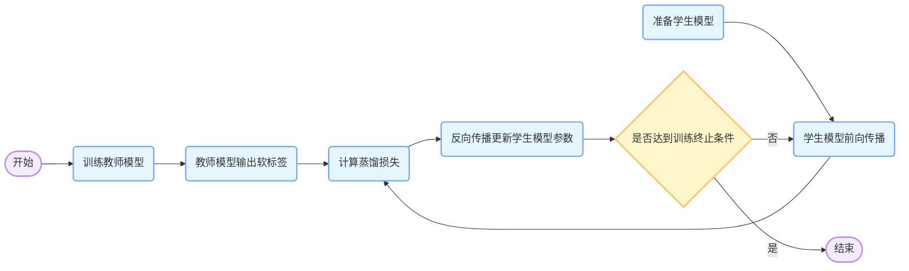

# 模型训练中的知识蒸馏技术在移动端AI应用中的优化与实践

> 关键词：知识蒸馏技术、移动端AI应用、模型训练、优化、实践

> 摘要：本文聚焦于模型训练中的知识蒸馏技术在移动端AI应用中的优化与实践。首先介绍了相关背景，包括目的范围、预期读者等内容。接着阐述了知识蒸馏技术的核心概念与联系，给出了原理和架构的文本示意图与Mermaid流程图。详细讲解了核心算法原理及具体操作步骤，并结合Python源代码进行说明。同时，对涉及的数学模型和公式进行了深入分析，辅以举例说明。通过项目实战，展示了开发环境搭建、源代码实现及解读。探讨了该技术在实际中的应用场景，推荐了学习资源、开发工具框架和相关论文著作。最后总结了未来发展趋势与挑战，还设置了常见问题解答和扩展阅读参考资料。旨在为移动端AI应用中知识蒸馏技术的应用提供全面且深入的指导。

## 1. 背景介绍 
### 1.1 目的和范围
随着移动端设备在日常生活中的广泛应用，如智能手机、智能手表等，对移动端AI应用的需求也日益增长。然而，移动端设备的计算资源和存储容量相对有限，难以运行复杂的大型AI模型。知识蒸馏技术作为一种有效的模型压缩和加速方法，能够将大型教师模型的知识迁移到小型学生模型中，在保证一定性能的前提下，降低模型的复杂度和计算量，使其更适合在移动端运行。

本文的目的是深入探讨知识蒸馏技术在移动端AI应用中的优化策略和实践方法，包括技术原理、算法实现、实际案例分析等方面。范围涵盖了知识蒸馏技术的基本概念、核心算法、数学模型，以及在移动端图像识别、语音识别、自然语言处理等常见AI应用场景中的具体实践。

### 1.2 预期读者
本文预期读者包括从事移动端AI应用开发的程序员、软件工程师，对模型压缩和加速技术感兴趣的研究人员，以及希望了解知识蒸馏技术在移动端应用的相关从业者。读者需要具备一定的机器学习和深度学习基础知识，熟悉Python编程语言和常见的深度学习框架，如TensorFlow、PyTorch等。

### 1.3 文档结构概述
本文将按照以下结构进行组织：
1. 背景介绍：阐述本文的目的、范围、预期读者和文档结构概述，并对相关术语进行解释。
2. 核心概念与联系：介绍知识蒸馏技术的核心概念，包括教师模型、学生模型、蒸馏损失等，给出核心概念原理和架构的文本示意图和Mermaid流程图。
3. 核心算法原理 & 具体操作步骤：详细讲解知识蒸馏技术的核心算法原理，并使用Python源代码进行详细阐述。
4. 数学模型和公式 & 详细讲解 & 举例说明：介绍知识蒸馏技术涉及的数学模型和公式，并进行详细讲解和举例说明。
5. 项目实战：代码实际案例和详细解释说明：通过一个具体的项目实战，展示知识蒸馏技术在移动端AI应用中的实现过程，包括开发环境搭建、源代码详细实现和代码解读。
6. 实际应用场景：探讨知识蒸馏技术在移动端AI应用中的实际应用场景。
7. 工具和资源推荐：推荐学习知识蒸馏技术和移动端AI应用开发的相关资源，包括书籍、在线课程、技术博客和网站，以及开发工具框架和相关论文著作。
8. 总结：未来发展趋势与挑战：总结知识蒸馏技术在移动端AI应用中的发展趋势和面临的挑战。
9. 附录：常见问题与解答：解答读者在学习和实践过程中可能遇到的常见问题。
10. 扩展阅读 & 参考资料：提供扩展阅读的建议和相关参考资料。

### 1.4 术语表
#### 1.4.1 核心术语定义
- **知识蒸馏（Knowledge Distillation）**：一种模型压缩和加速技术，通过将大型教师模型的知识迁移到小型学生模型中，使学生模型在保证一定性能的前提下，降低复杂度和计算量。
- **教师模型（Teacher Model）**：通常是一个大型、复杂且性能良好的模型，用于提供知识给学生模型。
- **学生模型（Student Model）**：一个小型、简单的模型，通过学习教师模型的知识来提高自身性能。
- **蒸馏损失（Distillation Loss）**：用于衡量学生模型输出与教师模型输出之间差异的损失函数，引导学生模型学习教师模型的知识。
- **移动端AI应用（Mobile AI Application）**：指在移动端设备（如智能手机、智能手表等）上运行的人工智能应用。

#### 1.4.2 相关概念解释
- **模型压缩（Model Compression）**：通过各种技术手段（如知识蒸馏、量化、剪枝等）减小模型的规模和计算量，使其更适合在资源受限的设备上运行。
- **模型加速（Model Acceleration）**：提高模型的推理速度，减少模型在运行过程中的计算时间。
- **软标签（Soft Labels）**：教师模型输出的概率分布，包含了更多的类别之间的相对关系信息，相比于硬标签（类别标签）能提供更多的知识。

#### 1.4.3 缩略词列表
- **AI**：Artificial Intelligence，人工智能
- **ML**：Machine Learning，机器学习
- **DL**：Deep Learning，深度学习
- **TF**：TensorFlow，一个开源的深度学习框架
- **PT**：PyTorch，一个开源的深度学习框架

## 2. 核心概念与联系 
知识蒸馏技术的核心思想是让小型的学生模型学习大型教师模型的知识，从而在保证一定性能的前提下，降低模型的复杂度和计算量。下面我们详细介绍相关核心概念及其联系。

### 核心概念原理
- **教师模型**：通常是一个在大规模数据集上进行训练的大型、复杂的模型，具有较高的性能。教师模型在训练过程中学习到了丰富的特征表示和分类信息，这些知识可以通过知识蒸馏技术传递给学生模型。
- **学生模型**：是一个相对小型、简单的模型，其结构和参数数量远小于教师模型。学生模型的目标是通过学习教师模型的知识，在保证一定性能的前提下，实现模型的压缩和加速。
- **蒸馏损失**：用于衡量学生模型输出与教师模型输出之间的差异。通过最小化蒸馏损失，学生模型可以学习到教师模型的知识。常见的蒸馏损失函数包括KL散度（Kullback-Leibler Divergence）等。

### 核心概念架构的文本示意图
```plaintext
教师模型（大型、复杂）
    |
    | 输出软标签（概率分布）
    v
蒸馏损失函数（如KL散度）
    |
    | 结合学生模型输出计算损失
    v
学生模型（小型、简单）
    |
    | 训练学习教师模型知识
    v
优化后的学生模型（适用于移动端）
```

### Mermaid流程图


在这个流程图中，首先训练教师模型，教师模型输出软标签。同时准备学生模型并进行前向传播，然后将学生模型的输出与教师模型的软标签结合计算蒸馏损失。通过反向传播更新学生模型的参数，不断重复这个过程，直到达到训练终止条件。最终得到优化后的学生模型，适用于移动端AI应用。

## 3. 核心算法原理 & 具体操作步骤 
### 核心算法原理
知识蒸馏的核心算法原理是通过最小化学生模型输出与教师模型输出之间的蒸馏损失，让学生模型学习教师模型的知识。常见的蒸馏损失函数是KL散度，它衡量了两个概率分布之间的差异。

设教师模型的输出为 $T$，学生模型的输出为 $S$，温度参数为 $T_{temp}$，则经过温度缩放后的教师模型输出为 $T' = softmax(\frac{T}{T_{temp}})$，学生模型输出为 $S' = softmax(\frac{S}{T_{temp}})$。KL散度定义为：

$$
D_{KL}(T' || S') = \sum_{i} T'_i \log(\frac{T'_i}{S'_i})
$$

其中，$i$ 表示类别索引。

### 具体操作步骤
下面我们使用Python和PyTorch框架来详细阐述知识蒸馏的具体操作步骤。

```python
import torch
import torch.nn as nn
import torch.optim as optim

# 定义教师模型和学生模型
class TeacherModel(nn.Module):
    def __init__(self):
        super(TeacherModel, self).__init__()
        # 这里简单定义一个全连接层作为示例
        self.fc = nn.Linear(10, 5)

    def forward(self, x):
        return self.fc(x)

class StudentModel(nn.Module):
    def __init__(self):
        super(StudentModel, self).__init__()
        # 这里简单定义一个全连接层作为示例
        self.fc = nn.Linear(10, 5)

    def forward(self, x):
        return self.fc(x)

# 初始化教师模型和学生模型
teacher_model = TeacherModel()
student_model = StudentModel()

# 定义损失函数和优化器
criterion = nn.KLDivLoss(reduction='batchmean')
optimizer = optim.Adam(student_model.parameters(), lr=0.001)

# 定义温度参数
T_temp = 2.0

# 模拟训练数据
num_samples = 100
input_data = torch.randn(num_samples, 10)

# 训练过程
num_epochs = 10
for epoch in range(num_epochs):
    # 前向传播
    teacher_output = teacher_model(input_data)
    student_output = student_model(input_data)

    # 温度缩放
    teacher_logits = teacher_output / T_temp
    student_logits = student_output / T_temp

    # 计算蒸馏损失
    teacher_probs = torch.softmax(teacher_logits, dim=1)
    student_log_probs = torch.log_softmax(student_logits, dim=1)
    distillation_loss = criterion(student_log_probs, teacher_probs)

    # 反向传播和参数更新
    optimizer.zero_grad()
    distillation_loss.backward()
    optimizer.step()

    print(f'Epoch {epoch+1}/{num_epochs}, Distillation Loss: {distillation_loss.item()}')

```

### 代码解释
1. **模型定义**：定义了一个简单的教师模型和学生模型，都包含一个全连接层。
2. **损失函数和优化器**：使用 `nn.KLDivLoss` 作为蒸馏损失函数，`Adam` 作为优化器。
3. **温度缩放**：将教师模型和学生模型的输出除以温度参数 $T_{temp}$，以控制软标签的平滑程度。
4. **前向传播**：计算教师模型和学生模型的输出。
5. **蒸馏损失计算**：使用KL散度计算学生模型输出与教师模型输出之间的蒸馏损失。
6. **反向传播和参数更新**：通过反向传播更新学生模型的参数。

通过以上步骤，学生模型可以逐渐学习到教师模型的知识，实现模型的压缩和加速。

## 4. 数学模型和公式 & 详细讲解 & 举例说明 
### 数学模型和公式
知识蒸馏中最常用的损失函数是KL散度，其数学定义如下：

设 $P$ 和 $Q$ 是两个概率分布，$P = \{p_1, p_2, \cdots, p_n\}$，$Q = \{q_1, q_2, \cdots, q_n\}$，则 $P$ 相对于 $Q$ 的KL散度定义为：

$$
D_{KL}(P || Q) = \sum_{i=1}^{n} p_i \log(\frac{p_i}{q_i})
$$

在知识蒸馏中，$P$ 通常是教师模型输出的软标签概率分布，$Q$ 是学生模型输出的概率分布。为了控制软标签的平滑程度，引入了温度参数 $T_{temp}$。经过温度缩放后的教师模型输出为 $T' = softmax(\frac{T}{T_{temp}})$，学生模型输出为 $S' = softmax(\frac{S}{T_{temp}})$，其中 $T$ 和 $S$ 分别是教师模型和学生模型的原始输出。

则蒸馏损失可以表示为：

$$
L_{distillation} = D_{KL}(T' || S') = \sum_{i=1}^{n} T'_i \log(\frac{T'_i}{S'_i})
$$

### 详细讲解
- **KL散度的含义**：KL散度衡量了两个概率分布之间的差异。值越小，表示两个分布越相似。在知识蒸馏中，通过最小化蒸馏损失，学生模型的输出概率分布可以逐渐接近教师模型的输出概率分布，从而学习到教师模型的知识。
- **温度参数的作用**：温度参数 $T_{temp}$ 控制了软标签的平滑程度。当 $T_{temp}$ 较大时，软标签的分布更加平滑，类别之间的差异减小，学生模型可以学习到更多的类别之间的相对关系信息；当 $T_{temp}$ 较小时，软标签的分布更加尖锐，接近硬标签，学生模型更注重学习类别标签信息。

### 举例说明
假设我们有一个三分类问题，教师模型的输出为 $T = [2, 1, 0]$，学生模型的输出为 $S = [1, 0.5, 0]$，温度参数 $T_{temp} = 2$。

1. **温度缩放**：
   - 教师模型输出经过温度缩放后：$\frac{T}{T_{temp}} = [1, 0.5, 0]$
   - 学生模型输出经过温度缩放后：$\frac{S}{T_{temp}} = [0.5, 0.25, 0]$

2. **计算软标签概率分布**：
   - 教师模型软标签概率分布：$T' = softmax([1, 0.5, 0]) = [\frac{e^1}{e^1 + e^{0.5} + e^0}, \frac{e^{0.5}}{e^1 + e^{0.5} + e^0}, \frac{e^0}{e^1 + e^{0.5} + e^0}] \approx [0.62, 0.27, 0.11]$
   - 学生模型软标签概率分布：$S' = softmax([0.5, 0.25, 0]) = [\frac{e^{0.5}}{e^{0.5} + e^{0.25} + e^0}, \frac{e^{0.25}}{e^{0.5} + e^{0.25} + e^0}, \frac{e^0}{e^{0.5} + e^{0.25} + e^0}] \approx [0.44, 0.31, 0.25]$

3. **计算蒸馏损失**：
   - $L_{distillation} = D_{KL}(T' || S') = 0.62 \log(\frac{0.62}{0.44}) + 0.27 \log(\frac{0.27}{0.31}) + 0.11 \log(\frac{0.11}{0.25}) \approx 0.18$

通过不断训练，学生模型的蒸馏损失会逐渐减小，其输出概率分布会越来越接近教师模型的输出概率分布，从而学习到教师模型的知识。

## 5. 项目实战：代码实际案例和详细解释说明 
### 5.1  开发环境搭建
在进行知识蒸馏技术在移动端AI应用的项目实战之前，我们需要搭建相应的开发环境。以下是具体的搭建步骤：

#### 安装Python
首先，确保你已经安装了Python。建议使用Python 3.7及以上版本，可以从Python官方网站（https://www.python.org/downloads/）下载并安装。

#### 安装深度学习框架
我们将使用PyTorch作为深度学习框架，可以通过以下命令安装：
```bash
pip install torch torchvision
```

#### 安装其他依赖库
还需要安装一些其他的依赖库，如 `numpy`、`matplotlib` 等，可以使用以下命令安装：
```bash
pip install numpy matplotlib
```

### 5.2  源代码详细实现和代码解读
下面我们以一个简单的图像分类任务为例，展示知识蒸馏技术在移动端AI应用中的具体实现。

```python
import torch
import torch.nn as nn
import torch.optim as optim
import torchvision
import torchvision.transforms as transforms

# 定义教师模型和学生模型
class TeacherModel(nn.Module):
    def __init__(self):
        super(TeacherModel, self).__init__()
        self.conv1 = nn.Conv2d(3, 6, 5)
        self.pool = nn.MaxPool2d(2, 2)
        self.conv2 = nn.Conv2d(6, 16, 5)
        self.fc1 = nn.Linear(16 * 5 * 5, 120)
        self.fc2 = nn.Linear(120, 84)
        self.fc3 = nn.Linear(84, 10)

    def forward(self, x):
        x = self.pool(torch.relu(self.conv1(x)))
        x = self.pool(torch.relu(self.conv2(x)))
        x = x.view(-1, 16 * 5 * 5)
        x = torch.relu(self.fc1(x))
        x = torch.relu(self.fc2(x))
        x = self.fc3(x)
        return x

class StudentModel(nn.Module):
    def __init__(self):
        super(StudentModel, self).__init__()
        self.conv1 = nn.Conv2d(3, 4, 5)
        self.pool = nn.MaxPool2d(2, 2)
        self.conv2 = nn.Conv2d(4, 8, 5)
        self.fc1 = nn.Linear(8 * 5 * 5, 60)
        self.fc2 = nn.Linear(60, 30)
        self.fc3 = nn.Linear(30, 10)

    def forward(self, x):
        x = self.pool(torch.relu(self.conv1(x)))
        x = self.pool(torch.relu(self.conv2(x)))
        x = x.view(-1, 8 * 5 * 5)
        x = torch.relu(self.fc1(x))
        x = torch.relu(self.fc2(x))
        x = self.fc3(x)
        return x

# 数据预处理
transform = transforms.Compose(
    [transforms.ToTensor(),
     transforms.Normalize((0.5, 0.5, 0.5), (0.5, 0.5, 0.5))])

# 加载数据集
trainset = torchvision.datasets.CIFAR10(root='./data', train=True,
                                        download=True, transform=transform)
trainloader = torch.utils.data.DataLoader(trainset, batch_size=4,
                                          shuffle=True, num_workers=2)

testset = torchvision.datasets.CIFAR10(root='./data', train=False,
                                       download=True, transform=transform)
testloader = torch.utils.data.DataLoader(testset, batch_size=4,
                                         shuffle=False, num_workers=2)

# 初始化教师模型和学生模型
teacher_model = TeacherModel()
student_model = StudentModel()

# 定义损失函数和优化器
criterion = nn.KLDivLoss(reduction='batchmean')
optimizer = optim.Adam(student_model.parameters(), lr=0.001)

# 定义温度参数
T_temp = 2.0

# 训练过程
num_epochs = 10
for epoch in range(num_epochs):
    running_loss = 0.0
    for i, data in enumerate(trainloader, 0):
        inputs, labels = data

        # 前向传播
        teacher_output = teacher_model(inputs)
        student_output = student_model(inputs)

        # 温度缩放
        teacher_logits = teacher_output / T_temp
        student_logits = student_output / T_temp

        # 计算蒸馏损失
        teacher_probs = torch.softmax(teacher_logits, dim=1)
        student_log_probs = torch.log_softmax(student_logits, dim=1)
        distillation_loss = criterion(student_log_probs, teacher_probs)

        # 反向传播和参数更新
        optimizer.zero_grad()
        distillation_loss.backward()
        optimizer.step()

        running_loss += distillation_loss.item()
        if i % 2000 == 1999:    # 每2000个批次打印一次损失
            print(f'[{epoch + 1}, {i + 1:5d}] loss: {running_loss / 2000:.3f}')
            running_loss = 0.0

print('Finished Training')

# 测试学生模型
correct = 0
total = 0
with torch.no_grad():
    for data in testloader:
        images, labels = data
        outputs = student_model(images)
        _, predicted = torch.max(outputs.data, 1)
        total += labels.size(0)
        correct += (predicted == labels).sum().item()

print(f'Accuracy of the network on the 10000 test images: {100 * correct / total}%')

```

### 5.3  代码解读与分析
#### 模型定义
- **教师模型**：定义了一个简单的卷积神经网络，包含两个卷积层和三个全连接层。
- **学生模型**：结构与教师模型相似，但卷积层和全连接层的通道数和神经元数量较少，模型规模更小。

#### 数据预处理和加载
- 使用 `torchvision.transforms` 对数据进行预处理，包括转换为张量和归一化。
- 使用 `torchvision.datasets.CIFAR10` 加载CIFAR-10数据集，并使用 `torch.utils.data.DataLoader` 进行数据加载。

#### 训练过程
- 前向传播：计算教师模型和学生模型的输出。
- 温度缩放：将教师模型和学生模型的输出除以温度参数 $T_{temp}$。
- 蒸馏损失计算：使用KL散度计算学生模型输出与教师模型输出之间的蒸馏损失。
- 反向传播和参数更新：通过反向传播更新学生模型的参数。

#### 测试过程
在测试集上测试学生模型的准确率，评估模型的性能。

通过以上步骤，我们实现了一个简单的知识蒸馏图像分类项目，将教师模型的知识迁移到学生模型中，使学生模型在保证一定准确率的前提下，具有更小的模型规模，更适合在移动端运行。

## 6. 实际应用场景 
知识蒸馏技术在移动端AI应用中有广泛的实际应用场景，以下是一些常见的应用场景：

### 移动端图像识别
在智能手机、智能相机等设备上，图像识别应用非常普遍。然而，大型的图像识别模型往往需要大量的计算资源和存储空间，难以在移动端设备上实时运行。知识蒸馏技术可以将大型图像识别模型的知识迁移到小型学生模型中，在保证一定识别准确率的前提下，降低模型的复杂度和计算量，实现移动端图像识别的实时性和高效性。例如，在手机拍照时进行实时的物体识别、场景分类等。

### 移动端语音识别
语音识别是移动端AI应用的重要领域之一。移动端设备的语音识别需要在有限的计算资源下实现快速、准确的识别。知识蒸馏技术可以帮助压缩语音识别模型的规模，提高模型的推理速度。例如，在智能语音助手、语音输入法等应用中，使用知识蒸馏后的小型模型可以更快速地处理语音信号，提供更好的用户体验。

### 移动端自然语言处理
在移动端的聊天机器人、文本分类、情感分析等自然语言处理应用中，知识蒸馏技术也有重要的应用价值。通过将大型自然语言处理模型的知识迁移到小型学生模型中，可以在保证一定处理效果的前提下，减少模型的存储空间和计算量，使模型更适合在移动端设备上运行。例如，在手机端的智能聊天应用中，使用知识蒸馏后的模型可以更高效地理解用户的输入并生成回复。

### 移动端推荐系统
移动端的推荐系统需要根据用户的行为和偏好实时推荐相关的内容，如商品推荐、新闻推荐等。知识蒸馏技术可以用于压缩推荐模型的规模，提高推荐系统的响应速度。通过将大型推荐模型的知识迁移到小型学生模型中，在保证推荐准确性的前提下，减少模型的计算量，使推荐系统能够在移动端设备上快速运行。

### 移动端智能安防
在移动端的智能安防应用中，如监控摄像头的实时目标检测、行为分析等，知识蒸馏技术可以将大型目标检测和行为分析模型的知识迁移到小型学生模型中，降低模型的计算复杂度，实现移动端设备的实时监控和预警功能。

## 7. 工具和资源推荐
### 7.1 学习资源推荐
#### 7.1.1 书籍推荐
- 《深度学习》（Deep Learning）：由Ian Goodfellow、Yoshua Bengio和Aaron Courville所著，是深度学习领域的经典教材，全面介绍了深度学习的基本概念、算法和应用。
- 《动手学深度学习》（Dive into Deep Learning）：由李沐、Aston Zhang等撰写，提供了丰富的代码示例和实践案例，适合初学者快速上手深度学习。
- 《Python深度学习》（Deep Learning with Python）：由Francois Chollet所著，结合Keras框架介绍了深度学习的基本原理和应用，是一本很好的入门书籍。

#### 7.1.2 在线课程
- Coursera上的“深度学习专项课程”（Deep Learning Specialization）：由Andrew Ng教授讲授，包括神经网络和深度学习、改善深层神经网络、结构化机器学习项目、卷积神经网络、序列模型等课程，是深度学习领域的经典在线课程。
- edX上的“强化学习基础”（Foundations of Reinforcement Learning）：介绍了强化学习的基本概念、算法和应用，适合对强化学习感兴趣的读者。
- 哔哩哔哩（Bilibili）上有很多关于深度学习和知识蒸馏技术的教学视频，如“李宏毅机器学习”系列视频，讲解生动易懂，适合初学者学习。

#### 7.1.3 技术博客和网站
- Medium：是一个技术博客平台，有很多关于深度学习、知识蒸馏技术的文章，如Towards Data Science等专栏。
- arXiv：是一个预印本平台，提供了大量的学术论文，包括知识蒸馏技术的最新研究成果。
- 开源中国（OSChina）：是一个开源技术社区，有很多关于深度学习和移动端开发的技术文章和案例分享。

### 7.2 开发工具框架推荐
#### 7.2.1 IDE和编辑器
- PyCharm：是一款专门为Python开发设计的集成开发环境（IDE），提供了丰富的代码编辑、调试、版本控制等功能，适合深度学习项目的开发。
- Jupyter Notebook：是一个交互式的开发环境，支持Python、R等多种编程语言，适合进行数据分析、模型训练和实验验证。
- Visual Studio Code：是一款轻量级的代码编辑器，支持多种编程语言和插件扩展，可通过安装相关插件实现深度学习项目的开发。

#### 7.2.2 调试和性能分析工具
- TensorBoard：是TensorFlow提供的可视化工具，可以用于可视化模型的训练过程、损失曲线、准确率等指标，帮助开发者进行模型调试和性能分析。
- PyTorch Profiler：是PyTorch提供的性能分析工具，可以分析模型的计算时间、内存使用情况等，帮助开发者优化模型性能。
- NVIDIA Nsight Systems：是NVIDIA提供的性能分析工具，可用于分析GPU加速的深度学习模型的性能，帮助开发者找出性能瓶颈。

#### 7.2.3 相关框架和库
- TensorFlow：是一个开源的深度学习框架，提供了丰富的API和工具，支持各种深度学习模型的开发和训练。
- PyTorch：是一个开源的深度学习框架，具有动态图特性，易于使用和调试，在学术界和工业界都有广泛的应用。
- Scikit-learn：是一个开源的机器学习库，提供了各种机器学习算法和工具，可用于数据预处理、模型选择和评估等。

### 7.3 相关论文著作推荐
#### 7.3.1 经典论文
- “Distilling the Knowledge in a Neural Network”：由Geoffrey Hinton等人发表，是知识蒸馏技术的开创性论文，介绍了知识蒸馏的基本概念和方法。
- “MobileNetV2: Inverted Residuals and Linear Bottlenecks”：提出了MobileNetV2模型，是一种轻量级的卷积神经网络，适用于移动端AI应用。
- “EfficientNet: Rethinking Model Scaling for Convolutional Neural Networks”：提出了EfficientNet模型，通过自动搜索网络结构和缩放策略，实现了高效的模型设计。

#### 7.3.2 最新研究成果
可以通过arXiv、ACM Digital Library、IEEE Xplore等学术平台搜索知识蒸馏技术的最新研究成果，了解该领域的前沿动态。

#### 7.3.3 应用案例分析
一些学术会议和期刊上会发表知识蒸馏技术在实际应用中的案例分析，如CVPR、ICCV、NeurIPS等计算机视觉和机器学习领域的顶级会议，以及Journal of Artificial Intelligence Research（JAIR）、Artificial Intelligence等学术期刊。

## 8. 总结：未来发展趋势与挑战
### 未来发展趋势
#### 模型结构优化
未来，知识蒸馏技术将与模型结构优化技术相结合，设计出更加高效、轻量级的学生模型。例如，通过自动搜索算法（如神经架构搜索）来寻找最优的学生模型结构，进一步提高模型的性能和效率。

#### 多模态知识蒸馏
随着多模态数据（如图像、语音、文本等）在移动端AI应用中的广泛应用，多模态知识蒸馏将成为一个重要的研究方向。通过将不同模态的教师模型知识迁移到学生模型中，可以实现更全面、更准确的多模态信息处理。

#### 自适应知识蒸馏
自适应知识蒸馏技术将根据不同的移动端设备和应用场景，动态调整知识蒸馏的参数和策略，以实现最佳的模型性能和资源利用效率。例如，根据设备的计算能力、内存大小等因素，自动选择合适的教师模型和蒸馏损失函数。

#### 与其他技术融合
知识蒸馏技术将与其他模型压缩和加速技术（如量化、剪枝等）相结合，进一步提高模型的压缩率和推理速度。同时，还将与强化学习、元学习等技术融合，实现更智能、更高效的模型训练和优化。

### 面临的挑战
#### 知识迁移的有效性
如何确保教师模型的知识能够有效地迁移到学生模型中，是知识蒸馏技术面临的一个重要挑战。在某些情况下，学生模型可能无法完全学习到教师模型的知识，导致性能下降。因此，需要进一步研究和改进知识蒸馏的方法和策略，提高知识迁移的有效性。

#### 计算资源和时间成本
知识蒸馏过程通常需要额外的计算资源和时间成本，特别是在训练大型教师模型和进行多次蒸馏迭代时。如何在保证知识蒸馏效果的前提下，降低计算资源和时间成本，是需要解决的问题。

#### 模型可解释性
随着深度学习模型的复杂度不断增加，模型的可解释性成为一个重要的问题。知识蒸馏技术在一定程度上可以帮助提高模型的可解释性，但如何更好地理解和解释学生模型从教师模型中学习到的知识，仍然是一个挑战。

#### 数据隐私和安全
在知识蒸馏过程中，需要使用大量的训练数据。如何保护数据的隐私和安全，防止数据泄露和滥用，是一个不容忽视的问题。特别是在移动端AI应用中，用户数据的隐私和安全更加重要。

## 9. 附录：常见问题与解答
### 1. 知识蒸馏技术一定能提高学生模型的性能吗？
不一定。知识蒸馏技术的效果受到多种因素的影响，如教师模型的性能、学生模型的结构、蒸馏损失函数的选择、温度参数的设置等。在某些情况下，如果教师模型的性能不佳或蒸馏方法不当，学生模型的性能可能不会得到提高，甚至可能下降。因此，需要根据具体情况选择合适的教师模型和蒸馏策略，以确保知识蒸馏技术能够有效提高学生模型的性能。

### 2. 如何选择合适的温度参数？
温度参数 $T_{temp}$ 控制了软标签的平滑程度。一般来说，较大的温度参数可以使软标签更加平滑，学生模型可以学习到更多的类别之间的相对关系信息；较小的温度参数可以使软标签更加尖锐，接近硬标签，学生模型更注重学习类别标签信息。选择合适的温度参数需要进行实验和调优。通常可以从一个较大的值开始，逐步减小温度参数，观察学生模型的性能变化，选择使学生模型性能最佳的温度参数。

### 3. 知识蒸馏技术可以与其他模型压缩技术一起使用吗？
可以。知识蒸馏技术可以与其他模型压缩技术（如量化、剪枝等）一起使用，以进一步提高模型的压缩率和推理速度。例如，可以先使用知识蒸馏技术将大型教师模型的知识迁移到小型学生模型中，然后再对学生模型进行量化和剪枝操作，以减小模型的规模和计算量。这种组合使用的方法可以充分发挥各种模型压缩技术的优势，实现更高效的模型压缩和加速。

### 4. 知识蒸馏技术对训练数据有什么要求？
知识蒸馏技术对训练数据的要求与普通的深度学习模型训练类似。需要有足够的训练数据来保证模型的泛化能力。同时，训练数据的质量也很重要，应尽量避免数据中的噪声和错误标注。在知识蒸馏过程中，教师模型和学生模型使用相同的训练数据进行训练，以确保学生模型能够学习到教师模型的知识。

### 5. 知识蒸馏技术在移动端AI应用中的部署有哪些注意事项？
在移动端AI应用中部署知识蒸馏后的模型时，需要注意以下几点：
- **模型大小**：确保蒸馏后的学生模型大小符合移动端设备的存储容量限制。
- **推理速度**：优化模型的推理速度，以满足移动端应用的实时性要求。可以通过量化、剪枝等技术进一步减小模型的计算量。
- **兼容性**：确保模型与移动端设备的操作系统和硬件平台兼容。可以使用专门的移动端深度学习框架（如TensorFlow Lite、PyTorch Mobile等）进行模型部署。
- **数据隐私和安全**：保护用户数据的隐私和安全，避免数据泄露和滥用。

## 10. 扩展阅读 & 参考资料
### 扩展阅读
- 可以进一步阅读关于模型压缩和加速技术的相关书籍和论文，如《Model Compression and Acceleration for Deep Neural Networks》等。
- 关注深度学习领域的顶级会议（如CVPR、ICCV、NeurIPS等）和学术期刊（如Journal of Artificial Intelligence Research、Artificial Intelligence等），了解知识蒸馏技术的最新研究成果和应用案例。

### 参考资料
- Hinton, G., Vinyals, O., & Dean, J. (2015). Distilling the Knowledge in a Neural Network. arXiv preprint arXiv:1503.02531.
- Sandler, M., Howard, A., Zhu, M., Zhmoginov, A., & Chen, L. C. (2018). MobileNetV2: Inverted Residuals and Linear Bottlenecks. In Proceedings of the IEEE conference on computer vision and pattern recognition (pp. 4510-4520).
- Tan, M., & Le, Q. V. (2019). EfficientNet: Rethinking Model Scaling for Convolutional Neural Networks. In Proceedings of the IEEE international conference on computer vision (pp. 6105-6114).

作者：AI天才研究院/AI Genius Institute & 禅与计算机程序设计艺术 /Zen And The Art of Computer Programming