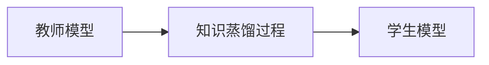

# 模型训练中的知识蒸馏技术在轻量级推理模型中的高级应用

> 关键词：知识蒸馏技术、轻量级推理模型、模型训练、高级应用、模型压缩

> 摘要：本文深入探讨了模型训练中的知识蒸馏技术在轻量级推理模型中的高级应用。首先介绍了知识蒸馏和轻量级推理模型的背景知识，包括目的、预期读者、文档结构和相关术语。接着详细阐述了核心概念、算法原理、数学模型，通过Python代码进行了原理展示。然后给出项目实战案例，从开发环境搭建到代码实现与解读。还探讨了实际应用场景，推荐了相关的学习资源、开发工具和论文著作。最后总结了未来发展趋势与挑战，并对常见问题进行解答，提供扩展阅读和参考资料，旨在为研究者和开发者在该领域的工作提供全面且深入的指导。

## 1. 背景介绍 
### 1.1 目的和范围
在当今的人工智能领域，深度学习模型变得越来越复杂和庞大。虽然这些大型模型在各种任务中展现出了卓越的性能，但它们通常需要大量的计算资源和内存，这使得在资源受限的设备上进行推理变得困难。轻量级推理模型应运而生，它旨在以较小的计算成本和内存占用实现接近大型模型的性能。

知识蒸馏技术是一种有效的模型压缩方法，它通过将大型教师模型的知识转移到小型学生模型中，使得学生模型能够学习到教师模型的泛化能力。本文的目的是详细介绍知识蒸馏技术在轻量级推理模型中的高级应用，包括核心概念、算法原理、数学模型、项目实战以及实际应用场景等方面，为研究者和开发者提供全面的技术指导。

### 1.2 预期读者
本文预期读者包括人工智能领域的研究者、深度学习开发者、机器学习工程师以及对模型压缩和轻量级推理模型感兴趣的技术爱好者。读者需要具备一定的深度学习基础知识，了解神经网络的基本概念和训练方法。

### 1.3 文档结构概述
本文将按照以下结构进行组织：
1. 背景介绍：介绍知识蒸馏技术和轻量级推理模型的背景信息。
2. 核心概念与联系：阐述知识蒸馏和轻量级推理模型的核心概念，并展示它们之间的联系。
3. 核心算法原理 & 具体操作步骤：详细介绍知识蒸馏的核心算法原理，并给出具体的操作步骤，同时使用Python代码进行说明。
4. 数学模型和公式 & 详细讲解 & 举例说明：给出知识蒸馏的数学模型和公式，并进行详细讲解和举例说明。
5. 项目实战：代码实际案例和详细解释说明：通过一个实际的项目案例，展示知识蒸馏技术在轻量级推理模型中的应用，包括开发环境搭建、源代码实现和代码解读。
6. 实际应用场景：介绍知识蒸馏技术在轻量级推理模型中的实际应用场景。
7. 工具和资源推荐：推荐相关的学习资源、开发工具和论文著作。
8. 总结：未来发展趋势与挑战：总结知识蒸馏技术在轻量级推理模型中的发展趋势和面临的挑战。
9. 附录：常见问题与解答：解答读者在学习和应用过程中可能遇到的常见问题。
10. 扩展阅读 & 参考资料：提供相关的扩展阅读材料和参考资料。

### 1.4 术语表
#### 1.4.1 核心术语定义
- **知识蒸馏（Knowledge Distillation）**：一种模型压缩技术，通过将大型教师模型的知识转移到小型学生模型中，使学生模型学习到教师模型的泛化能力。
- **教师模型（Teacher Model）**：在知识蒸馏中，通常是一个大型、复杂且性能较好的模型，用于提供知识给学生模型。
- **学生模型（Student Model）**：在知识蒸馏中，是一个小型、轻量级的模型，通过学习教师模型的知识来提高自身性能。
- **轻量级推理模型（Lightweight Inference Model）**：一种计算成本和内存占用较小的模型，适合在资源受限的设备上进行推理。

#### 1.4.2 相关概念解释
- **模型压缩（Model Compression）**：通过各种技术减少模型的参数数量和计算量，以降低模型的存储和计算成本。
- **泛化能力（Generalization Ability）**：模型在未见过的数据上的表现能力，即模型能够从训练数据中学习到普遍规律并应用到新数据上的能力。

#### 1.4.3 缩略词列表
- **DNN（Deep Neural Network）**：深度神经网络
- **CNN（Convolutional Neural Network）**：卷积神经网络
- **RNN（Recurrent Neural Network）**：循环神经网络

## 2. 核心概念与联系 

### 知识蒸馏的核心概念
知识蒸馏的核心思想是让学生模型学习教师模型的输出，而不仅仅是训练数据的标签。教师模型的输出通常包含了更多的信息，例如类别之间的相对概率关系。通过学习这些额外的信息，学生模型可以更好地泛化到未见过的数据。

假设我们有一个分类任务，教师模型的输出是一个概率分布，每个类别都有一个对应的概率值。学生模型的目标是学习这个概率分布，而不是仅仅学习训练数据的真实标签。为了实现这一点，我们通常使用一个蒸馏损失函数来衡量学生模型的输出和教师模型的输出之间的差异。

### 轻量级推理模型的核心概念
轻量级推理模型的设计目标是在保证一定性能的前提下，尽可能地减少模型的计算成本和内存占用。常见的轻量级推理模型包括MobileNet、ShuffleNet等，它们通常采用了一些优化技术，如深度可分离卷积、通道混洗等，来减少模型的参数数量和计算量。

### 两者之间的联系
知识蒸馏技术可以有效地提高轻量级推理模型的性能。由于轻量级推理模型的参数数量和计算量较少，它们的学习能力相对较弱。通过知识蒸馏，轻量级推理模型可以从大型教师模型中学习到更多的知识，从而提高自身的性能。同时，轻量级推理模型的低计算成本和内存占用也使得知识蒸馏的过程更加高效。

### 文本示意图
```plaintext
+-----------------+       +-----------------+
|   教师模型      | ----> |  知识蒸馏过程   |
+-----------------+       +-----------------+
                             |
                             v
+-----------------+
|   学生模型      |
+-----------------+
```

### Mermaid流程图


## 3. 核心算法原理 & 具体操作步骤 

### 核心算法原理
知识蒸馏的核心算法原理基于损失函数的设计。通常，我们使用一个组合损失函数来训练学生模型，该损失函数由两部分组成：蒸馏损失和传统的分类损失。

蒸馏损失用于衡量学生模型的输出和教师模型的输出之间的差异，通常使用KL散度（Kullback-Leibler Divergence）来计算。分类损失用于衡量学生模型的输出和训练数据的真实标签之间的差异，通常使用交叉熵损失（Cross Entropy Loss）来计算。

组合损失函数的公式如下：
$$L = \alpha \cdot L_{distillation} + (1 - \alpha) \cdot L_{classification}$$
其中，$L$ 是组合损失函数，$\alpha$ 是一个超参数，用于控制蒸馏损失和分类损失的权重，$L_{distillation}$ 是蒸馏损失，$L_{classification}$ 是分类损失。

### 具体操作步骤
1. **选择教师模型和学生模型**：选择一个大型、复杂且性能较好的模型作为教师模型，选择一个小型、轻量级的模型作为学生模型。
2. **训练教师模型**：使用训练数据对教师模型进行训练，直到教师模型达到满意的性能。
3. **知识蒸馏过程**：在训练学生模型时，同时计算蒸馏损失和分类损失，并使用组合损失函数来更新学生模型的参数。
4. **评估学生模型**：使用测试数据对学生模型进行评估，检查学生模型的性能是否达到预期。

### Python源代码示例
```python
import torch
import torch.nn as nn
import torch.optim as optim

# 定义教师模型和学生模型
class TeacherModel(nn.Module):
    def __init__(self):
        super(TeacherModel, self).__init__()
        self.fc1 = nn.Linear(10, 20)
        self.fc2 = nn.Linear(20, 5)

    def forward(self, x):
        x = torch.relu(self.fc1(x))
        x = self.fc2(x)
        return x

class StudentModel(nn.Module):
    def __init__(self):
        super(StudentModel, self).__init__()
        self.fc1 = nn.Linear(10, 10)
        self.fc2 = nn.Linear(10, 5)

    def forward(self, x):
        x = torch.relu(self.fc1(x))
        x = self.fc2(x)
        return x

# 初始化模型
teacher_model = TeacherModel()
student_model = StudentModel()

# 定义损失函数和优化器
criterion_distillation = nn.KLDivLoss(reduction='batchmean')
criterion_classification = nn.CrossEntropyLoss()
optimizer = optim.Adam(student_model.parameters(), lr=0.001)

# 超参数
alpha = 0.5

# 模拟训练数据
inputs = torch.randn(32, 10)
labels = torch.randint(0, 5, (32,))

# 训练学生模型
for epoch in range(100):
    # 前向传播
    teacher_outputs = teacher_model(inputs)
    student_outputs = student_model(inputs)

    # 计算蒸馏损失和分类损失
    distillation_loss = criterion_distillation(torch.log_softmax(student_outputs, dim=1), torch.softmax(teacher_outputs, dim=1))
    classification_loss = criterion_classification(student_outputs, labels)

    # 计算组合损失
    loss = alpha * distillation_loss + (1 - alpha) * classification_loss

    # 反向传播和优化
    optimizer.zero_grad()
    loss.backward()
    optimizer.step()

    if (epoch + 1) % 10 == 0:
        print(f'Epoch {epoch + 1}/{100}, Loss: {loss.item()}')
```

## 4. 数学模型和公式 & 详细讲解 & 举例说明 

### 蒸馏损失函数
蒸馏损失通常使用KL散度来计算，KL散度用于衡量两个概率分布之间的差异。假设 $p$ 是教师模型的输出概率分布，$q$ 是学生模型的输出概率分布，则KL散度的公式如下：
$$D_{KL}(p || q) = \sum_{i} p_i \log \frac{p_i}{q_i}$$

在知识蒸馏中，为了使学生模型更好地学习教师模型的输出，通常会使用温度参数 $T$ 来软化教师模型和学生模型的输出概率分布。软化后的概率分布公式如下：
$$p_i^T = \frac{\exp(z_i / T)}{\sum_{j} \exp(z_j / T)}$$
其中，$z_i$ 是模型的原始输出，$T$ 是温度参数。

软化后的KL散度公式如下：
$$L_{distillation} = D_{KL}(p^T || q^T)$$

### 分类损失函数
分类损失通常使用交叉熵损失来计算，交叉熵损失用于衡量模型的输出概率分布和真实标签之间的差异。假设 $y$ 是真实标签的one-hot编码，$q$ 是学生模型的输出概率分布，则交叉熵损失的公式如下：
$$L_{classification} = - \sum_{i} y_i \log q_i$$

### 组合损失函数
组合损失函数是蒸馏损失和分类损失的加权和，公式如下：
$$L = \alpha \cdot L_{distillation} + (1 - \alpha) \cdot L_{classification}$$
其中，$\alpha$ 是一个超参数，用于控制蒸馏损失和分类损失的权重。

### 举例说明
假设我们有一个二分类任务，教师模型的输出为 $[0.8, 0.2]$，学生模型的输出为 $[0.6, 0.4]$，真实标签为 $[1, 0]$。温度参数 $T = 1$，$\alpha = 0.5$。

1. **计算蒸馏损失**：
    - 教师模型的软化输出：$p^T = [0.8, 0.2]$
    - 学生模型的软化输出：$q^T = [0.6, 0.4]$
    - KL散度：$D_{KL}(p^T || q^T) = 0.8 \log \frac{0.8}{0.6} + 0.2 \log \frac{0.2}{0.4} \approx 0.173$

2. **计算分类损失**：
    - 交叉熵损失：$L_{classification} = - (1 \log 0.6 + 0 \log 0.4) \approx 0.511$

3. **计算组合损失**：
    - 组合损失：$L = 0.5 \times 0.173 + (1 - 0.5) \times 0.511 = 0.342$

## 5. 项目实战：代码实际案例和详细解释说明 

### 5.1  开发环境搭建
在进行项目实战之前，需要搭建开发环境。以下是具体的步骤：

1. **安装Python**：建议使用Python 3.7及以上版本。
2. **安装深度学习框架**：本文使用PyTorch作为深度学习框架，可以使用以下命令进行安装：
```bash
pip install torch torchvision
```
3. **安装其他依赖库**：根据项目的需要，可能需要安装其他依赖库，如NumPy、Matplotlib等。可以使用以下命令进行安装：
```bash
pip install numpy matplotlib
```

### 5.2  源代码详细实现和代码解读
以下是一个使用知识蒸馏技术训练轻量级推理模型的完整代码示例：

```python
import torch
import torch.nn as nn
import torch.optim as optim
import torchvision
import torchvision.transforms as transforms

# 定义教师模型和学生模型
class TeacherModel(nn.Module):
    def __init__(self):
        super(TeacherModel, self).__init__()
        self.conv1 = nn.Conv2d(3, 64, kernel_size=3, padding=1)
        self.pool = nn.MaxPool2d(2, 2)
        self.conv2 = nn.Conv2d(64, 128, kernel_size=3, padding=1)
        self.fc1 = nn.Linear(128 * 8 * 8, 256)
        self.fc2 = nn.Linear(256, 10)

    def forward(self, x):
        x = self.pool(torch.relu(self.conv1(x)))
        x = self.pool(torch.relu(self.conv2(x)))
        x = x.view(-1, 128 * 8 * 8)
        x = torch.relu(self.fc1(x))
        x = self.fc2(x)
        return x

class StudentModel(nn.Module):
    def __init__(self):
        super(StudentModel, self).__init__()
        self.conv1 = nn.Conv2d(3, 32, kernel_size=3, padding=1)
        self.pool = nn.MaxPool2d(2, 2)
        self.conv2 = nn.Conv2d(32, 64, kernel_size=3, padding=1)
        self.fc1 = nn.Linear(64 * 8 * 8, 128)
        self.fc2 = nn.Linear(128, 10)

    def forward(self, x):
        x = self.pool(torch.relu(self.conv1(x)))
        x = self.pool(torch.relu(self.conv2(x)))
        x = x.view(-1, 64 * 8 * 8)
        x = torch.relu(self.fc1(x))
        x = self.fc2(x)
        return x

# 数据预处理
transform = transforms.Compose([
    transforms.ToTensor(),
    transforms.Normalize((0.5, 0.5, 0.5), (0.5, 0.5, 0.5))
])

# 加载数据集
trainset = torchvision.datasets.CIFAR10(root='./data', train=True,
                                        download=True, transform=transform)
trainloader = torch.utils.data.DataLoader(trainset, batch_size=32,
                                          shuffle=True, num_workers=2)

testset = torchvision.datasets.CIFAR10(root='./data', train=False,
                                       download=True, transform=transform)
testloader = torch.utils.data.DataLoader(testset, batch_size=32,
                                         shuffle=False, num_workers=2)

# 初始化模型
teacher_model = TeacherModel()
student_model = StudentModel()

# 定义损失函数和优化器
criterion_distillation = nn.KLDivLoss(reduction='batchmean')
criterion_classification = nn.CrossEntropyLoss()
optimizer = optim.Adam(student_model.parameters(), lr=0.001)

# 超参数
alpha = 0.5
T = 2

# 训练教师模型（这里省略训练过程，假设教师模型已经训练好）
#...

# 训练学生模型
for epoch in range(10):
    running_loss = 0.0
    for i, data in enumerate(trainloader, 0):
        inputs, labels = data

        # 前向传播
        teacher_outputs = teacher_model(inputs)
        student_outputs = student_model(inputs)

        # 计算蒸馏损失和分类损失
        distillation_loss = criterion_distillation(torch.log_softmax(student_outputs / T, dim=1), torch.softmax(teacher_outputs / T, dim=1)) * (T * T)
        classification_loss = criterion_classification(student_outputs, labels)

        # 计算组合损失
        loss = alpha * distillation_loss + (1 - alpha) * classification_loss

        # 反向传播和优化
        optimizer.zero_grad()
        loss.backward()
        optimizer.step()

        running_loss += loss.item()
        if i % 200 == 199:
            print(f'[{epoch + 1}, {i + 1}] loss: {running_loss / 200:.3f}')
            running_loss = 0.0

print('Finished Training')

# 评估学生模型
correct = 0
total = 0
with torch.no_grad():
    for data in testloader:
        images, labels = data
        outputs = student_model(images)
        _, predicted = torch.max(outputs.data, 1)
        total += labels.size(0)
        correct += (predicted == labels).sum().item()

print(f'Accuracy of the network on the 10000 test images: {100 * correct / total}%')
```

### 5.3  代码解读与分析
1. **模型定义**：定义了教师模型和学生模型，教师模型相对较大，学生模型相对较小。
2. **数据预处理**：使用`torchvision.transforms`对数据进行预处理，包括转换为张量和归一化。
3. **数据集加载**：使用`torchvision.datasets`加载CIFAR-10数据集，并使用`torch.utils.data.DataLoader`创建数据加载器。
4. **损失函数和优化器**：定义了蒸馏损失函数（KL散度）、分类损失函数（交叉熵损失）和优化器（Adam）。
5. **训练过程**：在训练学生模型时，同时计算蒸馏损失和分类损失，并使用组合损失函数来更新学生模型的参数。
6. **评估过程**：使用测试数据对学生模型进行评估，计算模型的准确率。

通过知识蒸馏技术，学生模型可以学习到教师模型的知识，从而提高自身的性能。

## 6. 实际应用场景 
### 移动设备上的应用
在移动设备上，由于计算资源和内存有限，需要使用轻量级推理模型。知识蒸馏技术可以帮助在移动设备上部署高性能的轻量级推理模型，例如图像分类、目标检测等任务。通过将大型教师模型的知识转移到小型学生模型中，学生模型可以在移动设备上快速、准确地进行推理。

### 物联网设备上的应用
物联网设备通常具有较低的计算能力和存储容量，因此需要轻量级推理模型。知识蒸馏技术可以用于训练适用于物联网设备的轻量级推理模型，例如智能家居设备、智能健康监测设备等。这些设备可以在本地进行推理，减少与云端的通信，提高系统的响应速度和隐私性。

### 实时视频处理
在实时视频处理任务中，如视频监控、自动驾驶等，需要模型能够快速地进行推理。知识蒸馏技术可以训练轻量级推理模型，使其在保证一定精度的前提下，能够在实时视频处理中高效运行。

### 边缘计算
边缘计算是指在靠近数据源的边缘设备上进行数据处理和分析。知识蒸馏技术可以用于训练适用于边缘设备的轻量级推理模型，减少数据传输和云端计算的压力，提高系统的效率和可靠性。

## 7. 工具和资源推荐
### 7.1 学习资源推荐
#### 7.1.1 书籍推荐
- 《深度学习》（Deep Learning）：由Ian Goodfellow、Yoshua Bengio和Aaron Courville所著，是深度学习领域的经典教材，涵盖了深度学习的基本概念、算法和应用。
- 《Python深度学习》（Deep Learning with Python）：由Francois Chollet所著，介绍了如何使用Python和Keras进行深度学习开发，适合初学者。
- 《动手学深度学习》（Dive into Deep Learning）：由李沐等人所著，提供了丰富的代码示例和实践项目，帮助读者快速掌握深度学习的实践技能。

#### 7.1.2 在线课程
- Coursera上的“深度学习专项课程”（Deep Learning Specialization）：由Andrew Ng教授授课，涵盖了深度学习的各个方面，包括神经网络、卷积神经网络、循环神经网络等。
- edX上的“强化学习”（Reinforcement Learning）：由David Silver教授授课，介绍了强化学习的基本概念、算法和应用。
- 哔哩哔哩上的“沐神带你学AI”系列课程：由李沐教授授课，结合代码实践，深入浅出地讲解深度学习的知识。

#### 7.1.3 技术博客和网站
- Medium上的Towards Data Science：汇集了众多数据科学和机器学习领域的优秀文章，涵盖了最新的研究成果和实践经验。
- arXiv.org：一个预印本平台，提供了大量的学术论文，包括深度学习、知识蒸馏等领域的最新研究。
- 机器之心：专注于人工智能领域的资讯和技术解读，提供了丰富的技术文章和案例分析。

### 7.2 开发工具框架推荐
#### 7.2.1 IDE和编辑器
- PyCharm：一款功能强大的Python集成开发环境，提供了代码编辑、调试、版本控制等功能，适合Python深度学习开发。
- Jupyter Notebook：一个交互式的笔记本环境，支持Python代码的编写、运行和可视化，非常适合深度学习的实验和教学。
- Visual Studio Code：一款轻量级的代码编辑器，支持多种编程语言和插件扩展，可用于深度学习代码的编写和调试。

#### 7.2.2 调试和性能分析工具
- PyTorch Profiler：PyTorch提供的性能分析工具，可以帮助开发者分析模型的运行时间、内存使用等情况，优化模型性能。
- TensorBoard：TensorFlow提供的可视化工具，也可以与PyTorch结合使用，用于可视化模型的训练过程、损失曲线、准确率等指标。
- NVIDIA Nsight Systems：一款用于分析GPU应用程序性能的工具，可以帮助开发者找出模型在GPU上的性能瓶颈。

#### 7.2.3 相关框架和库
- PyTorch：一个开源的深度学习框架，提供了丰富的神经网络层和优化算法，易于使用和扩展。
- TensorFlow：另一个广泛使用的深度学习框架，具有强大的分布式训练和部署能力。
- Scikit-learn：一个用于机器学习的Python库，提供了各种机器学习算法和工具，可用于数据预处理、模型选择和评估等任务。

### 7.3 相关论文著作推荐
#### 7.3.1 经典论文
- “Distilling the Knowledge in a Neural Network”：由Geoffrey Hinton等人发表的论文，首次提出了知识蒸馏的概念。
- “MobileNets: Efficient Convolutional Neural Networks for Mobile Vision Applications”：介绍了MobileNet系列轻量级卷积神经网络的设计和应用。
- “ShuffleNet: An Extremely Efficient Convolutional Neural Network for Mobile Devices”：提出了ShuffleNet轻量级卷积神经网络，通过通道混洗操作提高了模型的效率。

#### 7.3.2 最新研究成果
- 关注arXiv.org上关于知识蒸馏和轻量级推理模型的最新论文，了解该领域的最新研究进展。
- 参加相关的学术会议，如NeurIPS、ICML、CVPR等，获取最新的研究成果和技术趋势。

#### 7.3.3 应用案例分析
- 一些科技公司的技术博客会分享他们在知识蒸馏和轻量级推理模型方面的应用案例，如Google、Facebook、Microsoft等。可以通过阅读这些案例，了解实际应用中的技术挑战和解决方案。

## 8. 总结：未来发展趋势与挑战
### 未来发展趋势
- **多模态知识蒸馏**：未来的知识蒸馏技术可能会扩展到多模态数据，如文本、图像、音频等。通过将不同模态的知识进行融合和蒸馏，可以提高模型在多模态任务中的性能。
- **自适应知识蒸馏**：开发自适应的知识蒸馏方法，根据学生模型的学习能力和任务需求，动态调整蒸馏损失和分类损失的权重，以提高知识蒸馏的效率和效果。
- **与其他模型压缩技术结合**：将知识蒸馏技术与其他模型压缩技术，如剪枝、量化等相结合，进一步降低模型的计算成本和内存占用，提高模型的性能。
- **在新兴领域的应用**：知识蒸馏技术将在更多的新兴领域得到应用，如量子计算、生物信息学等，为这些领域的发展提供技术支持。

### 挑战
- **教师模型的选择和训练**：选择合适的教师模型并进行有效的训练是知识蒸馏的关键。然而，大型教师模型的训练通常需要大量的计算资源和时间，如何选择和训练高效的教师模型是一个挑战。
- **蒸馏损失函数的设计**：蒸馏损失函数的设计直接影响知识蒸馏的效果。如何设计更有效的蒸馏损失函数，以更好地捕捉教师模型的知识，是一个需要研究的问题。
- **学生模型的架构设计**：设计适合知识蒸馏的学生模型架构是提高学生模型性能的关键。如何设计轻量级且具有强大学习能力的学生模型架构，是一个挑战。
- **知识蒸馏的可解释性**：知识蒸馏的过程相对复杂，缺乏可解释性。如何解释知识蒸馏的过程和结果，提高模型的可信度和可解释性，是一个重要的研究方向。

## 9. 附录：常见问题与解答
### 问题1：知识蒸馏技术是否适用于所有类型的模型？
知识蒸馏技术适用于大多数类型的模型，包括神经网络、决策树、支持向量机等。但对于一些简单的模型，知识蒸馏可能不会带来明显的性能提升。

### 问题2：如何选择合适的教师模型和学生模型？
选择教师模型时，应选择性能较好、复杂度较高的模型。选择学生模型时，应选择轻量级、计算成本低的模型。同时，学生模型的输入和输出应与教师模型兼容。

### 问题3：超参数 $\alpha$ 和 $T$ 如何选择？
超参数 $\alpha$ 和 $T$ 的选择通常需要通过实验来确定。一般来说，可以在一定范围内进行网格搜索或随机搜索，选择使学生模型性能最佳的超参数值。

### 问题4：知识蒸馏技术是否会增加训练时间？
知识蒸馏技术通常会增加一定的训练时间，因为需要同时计算蒸馏损失和分类损失。但相比于训练大型模型，知识蒸馏可以在较短的时间内训练出性能较好的轻量级模型。

### 问题5：知识蒸馏技术是否可以用于无监督学习？
知识蒸馏技术可以用于无监督学习。在无监督学习中，可以使用自编码器等模型作为教师模型，将其学到的特征表示知识蒸馏到学生模型中。

## 10. 扩展阅读 & 参考资料
### 扩展阅读
- “Model Compression and Acceleration for Deep Neural Networks: The Principles, Progress, and Challenges”：对模型压缩和加速技术进行了全面的综述，包括知识蒸馏、剪枝、量化等方法。
- “Deep Compression: Compressing Deep Neural Networks with Pruning, Trained Quantization and Huffman Coding”：介绍了一种综合的模型压缩方法，结合了剪枝、量化和哈夫曼编码等技术。
- “Adversarial Distillation: Learning from Noisy Teachers”：提出了一种对抗性知识蒸馏方法，通过引入对抗训练来提高知识蒸馏的效果。

### 参考资料
- Goodfellow, I., Bengio, Y., & Courville, A. (2016). Deep Learning. MIT Press.
- Chollet, F. (2017). Deep Learning with Python. Manning Publications.
- Li, M., Zhang, A., Li, Z., & Smola, A. J. (2020). Dive into Deep Learning. Amazon KDP.
- Hinton, G., Vinyals, O., & Dean, J. (2015). Distilling the Knowledge in a Neural Network. arXiv preprint arXiv:1503.02531.
- Howard, A. G., Zhu, M., Chen, B., Kalenichenko, D., Wang, W., Weyand, T.,... & Adam, H. (2017). MobileNets: Efficient Convolutional Neural Networks for Mobile Vision Applications. arXiv preprint arXiv:1704.04861.
- Zhang, X., Zhou, X., Lin, M., & Sun, J. (2017). ShuffleNet: An Extremely Efficient Convolutional Neural Network for Mobile Devices. In Proceedings of the IEEE conference on computer vision and pattern recognition (pp. 6848-6856).

作者：AI天才研究院/AI Genius Institute & 禅与计算机程序设计艺术 /Zen And The Art of Computer Programming