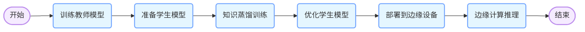

# 模型训练中的知识蒸馏技术在边缘计算推理中的优化应用

> 关键词：知识蒸馏技术、模型训练、边缘计算推理、优化应用、深度学习

> 摘要：本文深入探讨了模型训练中的知识蒸馏技术在边缘计算推理中的优化应用。首先介绍了知识蒸馏和边缘计算推理的背景知识，包括目的、预期读者等。接着详细阐述了知识蒸馏的核心概念、算法原理、数学模型等内容。通过实际项目案例展示了知识蒸馏技术在边缘计算推理中的具体实现和代码解读。同时，分析了其实际应用场景，并推荐了相关的学习资源、开发工具和论文著作。最后对未来发展趋势与挑战进行了总结，并给出常见问题解答和扩展阅读参考资料，旨在为相关领域的研究和实践提供全面而深入的指导。

## 1. 背景介绍 
### 1.1 目的和范围
随着深度学习的快速发展，模型的规模和复杂度不断增加，这在提升模型性能的同时，也带来了计算资源需求大、推理时间长等问题。边缘计算作为一种将计算和数据存储靠近数据源的计算模式，能够有效减少数据传输延迟和带宽压力。然而，边缘设备通常具有有限的计算资源和存储能力，难以直接运行大型复杂的深度学习模型。知识蒸馏技术作为一种模型压缩和加速的方法，可以将大型教师模型的知识转移到小型学生模型中，使得学生模型在保持较高性能的同时，具有更低的计算复杂度和存储需求。本文的目的在于探讨如何利用知识蒸馏技术优化边缘计算推理，提高边缘设备上模型推理的效率和性能。范围涵盖知识蒸馏技术的原理、算法实现、在边缘计算推理中的应用案例，以及相关的工具和资源推荐等方面。

### 1.2 预期读者
本文预期读者包括深度学习、边缘计算领域的研究人员、工程师和开发者，以及对模型压缩和推理优化感兴趣的技术爱好者。对于正在从事边缘设备上模型部署和优化工作的专业人士，本文可以提供实用的技术方案和案例参考；对于初学者，本文可以帮助他们了解知识蒸馏技术和边缘计算推理的基本概念和应用场景。

### 1.3 文档结构概述
本文将按照以下结构进行组织：首先介绍知识蒸馏和边缘计算推理的核心概念及其联系，通过文本示意图和 Mermaid 流程图进行直观展示；接着详细讲解知识蒸馏的核心算法原理，并给出具体的 Python 代码实现；然后阐述知识蒸馏的数学模型和公式，并通过举例进行说明；再通过一个实际项目案例，展示知识蒸馏技术在边缘计算推理中的具体实现和代码解读；分析知识蒸馏技术在边缘计算推理中的实际应用场景；推荐相关的学习资源、开发工具和论文著作；最后总结未来发展趋势与挑战，给出常见问题解答和扩展阅读参考资料。

### 1.4 术语表
#### 1.4.1 核心术语定义
- **知识蒸馏（Knowledge Distillation）**：一种模型压缩技术，通过将大型教师模型的知识转移到小型学生模型中，使学生模型学习到教师模型的泛化能力。
- **边缘计算（Edge Computing）**：一种将计算和数据存储靠近数据源的计算模式，减少数据传输延迟和带宽压力。
- **教师模型（Teacher Model）**：在知识蒸馏中，具有较高性能和复杂度的大型模型，用于提供知识给学生模型。
- **学生模型（Student Model）**：在知识蒸馏中，通过学习教师模型的知识来提高自身性能的小型模型。
- **软标签（Soft Labels）**：教师模型输出的概率分布，包含了比硬标签更多的信息，用于知识蒸馏的训练。

#### 1.4.2 相关概念解释
- **模型压缩（Model Compression）**：通过各种技术手段减少模型的参数数量和计算复杂度，同时保持模型的性能。
- **推理（Inference）**：在训练好的模型上对新数据进行预测的过程。
- **泛化能力（Generalization Ability）**：模型在未见过的数据上的表现能力。

#### 1.4.3 缩略词列表
- **DNN（Deep Neural Network）**：深度神经网络
- **CNN（Convolutional Neural Network）**：卷积神经网络
- **RNN（Recurrent Neural Network）**：循环神经网络

## 2. 核心概念与联系 

### 知识蒸馏核心概念
知识蒸馏的核心思想是让学生模型学习教师模型的输出，而不仅仅是训练数据的标签。教师模型通常是一个经过充分训练的大型复杂模型，具有较高的性能。学生模型则是一个相对较小、计算复杂度较低的模型。在知识蒸馏过程中，教师模型的输出被用作软标签，包含了更多的类别之间的关系信息。学生模型通过最小化与教师模型输出的差异来学习这些知识，从而在保持较小规模的同时，获得接近教师模型的性能。

### 边缘计算推理核心概念
边缘计算推理是指在靠近数据源的边缘设备上进行模型推理的过程。边缘设备如智能手机、物联网设备等通常具有有限的计算资源和存储能力。边缘计算推理的优势在于减少数据传输延迟和带宽压力，提高系统的实时性和隐私性。然而，由于边缘设备的资源限制，直接在边缘设备上运行大型复杂的深度学习模型是不可行的，因此需要对模型进行优化。

### 知识蒸馏与边缘计算推理的联系
知识蒸馏技术为边缘计算推理提供了一种有效的优化方法。通过将大型教师模型的知识转移到小型学生模型中，可以显著减少模型的计算复杂度和存储需求，使得学生模型能够在边缘设备上高效运行。同时，知识蒸馏可以在一定程度上保持模型的性能，从而满足边缘计算推理的需求。

### 文本示意图
```plaintext
知识蒸馏技术
|
|-- 教师模型（大型复杂模型）
|       |
|       |-- 输出软标签
|
|-- 学生模型（小型简单模型）
|       |
|       |-- 学习软标签
|
|-- 训练过程（最小化差异）

边缘计算推理
|
|-- 边缘设备（资源有限）
|       |
|       |-- 运行学生模型进行推理
```

### Mermaid 流程图


## 3. 核心算法原理 & 具体操作步骤 

### 知识蒸馏算法原理
知识蒸馏的核心算法是通过最小化学生模型和教师模型输出之间的差异来实现的。通常使用的损失函数是交叉熵损失函数，其定义如下：

设教师模型的输出为 $T$，学生模型的输出为 $S$，训练数据的真实标签为 $y$。知识蒸馏的损失函数 $L_{KD}$ 由两部分组成：

- 学生模型与教师模型输出的软标签之间的交叉熵损失 $L_{soft}$：
$$L_{soft} = H(T, S)$$
其中 $H$ 表示交叉熵函数。

- 学生模型与真实标签之间的交叉熵损失 $L_{hard}$：
$$L_{hard} = H(y, S)$$

最终的损失函数 $L_{KD}$ 是 $L_{soft}$ 和 $L_{hard}$ 的加权和：
$$L_{KD} = \alpha L_{soft} + (1 - \alpha) L_{hard}$$
其中 $\alpha$ 是一个超参数，用于控制 $L_{soft}$ 和 $L_{hard}$ 的相对权重。

### 具体操作步骤
1. **训练教师模型**：使用大量的训练数据对大型复杂的教师模型进行训练，直到模型收敛。
2. **准备学生模型**：选择一个相对较小的学生模型架构。
3. **知识蒸馏训练**：在训练学生模型时，同时计算 $L_{soft}$ 和 $L_{hard}$，并根据损失函数 $L_{KD}$ 进行反向传播更新学生模型的参数。
4. **优化学生模型**：调整超参数 $\alpha$ 等，进一步优化学生模型的性能。
5. **部署到边缘设备**：将训练好的学生模型部署到边缘设备上进行推理。

### Python 代码实现
```python
import torch
import torch.nn as nn
import torch.optim as optim

# 定义教师模型
class TeacherModel(nn.Module):
    def __init__(self):
        super(TeacherModel, self).__init__()
        # 这里简单示例，实际中可以是复杂的网络结构
        self.fc1 = nn.Linear(10, 20)
        self.fc2 = nn.Linear(20, 5)

    def forward(self, x):
        x = torch.relu(self.fc1(x))
        x = self.fc2(x)
        return x

# 定义学生模型
class StudentModel(nn.Module):
    def __init__(self):
        super(StudentModel, self).__init__()
        # 学生模型相对简单
        self.fc = nn.Linear(10, 5)

    def forward(self, x):
        x = self.fc(x)
        return x

# 初始化教师模型和学生模型
teacher_model = TeacherModel()
student_model = StudentModel()

# 定义损失函数和优化器
criterion_soft = nn.KLDivLoss(reduction='batchmean')
criterion_hard = nn.CrossEntropyLoss()
optimizer = optim.Adam(student_model.parameters(), lr=0.001)

# 超参数
alpha = 0.5

# 模拟训练数据
x = torch.randn(32, 10)
y = torch.randint(0, 5, (32,))

# 知识蒸馏训练
teacher_output = teacher_model(x)
soft_labels = torch.softmax(teacher_output / 2, dim=1)  # 引入温度参数

for epoch in range(100):
    student_output = student_model(x)
    student_soft_output = torch.softmax(student_output / 2, dim=1)

    # 计算损失
    L_soft = criterion_soft(torch.log(student_soft_output), soft_labels)
    L_hard = criterion_hard(student_output, y)
    L_KD = alpha * L_soft + (1 - alpha) * L_hard

    # 反向传播和参数更新
    optimizer.zero_grad()
    L_KD.backward()
    optimizer.step()

    if epoch % 10 == 0:
        print(f'Epoch {epoch}, Loss: {L_KD.item()}')
```

## 4. 数学模型和公式 & 详细讲解 & 举例说明 

### 交叉熵损失函数
交叉熵损失函数是知识蒸馏中常用的损失函数，用于衡量两个概率分布之间的差异。设 $p$ 和 $q$ 是两个概率分布，交叉熵损失函数 $H(p, q)$ 定义为：
$$H(p, q) = - \sum_{i} p_i \log(q_i)$$
其中 $p_i$ 和 $q_i$ 分别是概率分布 $p$ 和 $q$ 的第 $i$ 个元素。

### 知识蒸馏损失函数详细讲解
在知识蒸馏中，我们使用的损失函数 $L_{KD}$ 是 $L_{soft}$ 和 $L_{hard}$ 的加权和。$L_{soft}$ 用于衡量学生模型输出的软标签与教师模型输出的软标签之间的差异，$L_{hard}$ 用于衡量学生模型输出与真实标签之间的差异。

$\alpha$ 是一个超参数，用于控制 $L_{soft}$ 和 $L_{hard}$ 的相对权重。当 $\alpha$ 较大时，学生模型更注重学习教师模型的知识；当 $\alpha$ 较小时，学生模型更注重学习真实标签。

### 温度参数
在计算软标签时，通常会引入温度参数 $T$。教师模型的输出 $T$ 和学生模型的输出 $S$ 经过温度缩放后再进行 softmax 操作：
$$\text{softmax}(z)_i = \frac{\exp(z_i / T)}{\sum_{j} \exp(z_j / T)}$$
其中 $z$ 是模型的输出向量，$T$ 是温度参数。温度参数 $T$ 可以控制软标签的平滑程度，当 $T$ 较大时，软标签更加平滑，包含更多的类别之间的关系信息；当 $T$ 较小时，软标签更加接近硬标签。

### 举例说明
假设我们有一个三分类问题，教师模型的输出为 $T = [1, 2, 3]$，学生模型的输出为 $S = [0.5, 1.5, 2.5]$，真实标签为 $y = [0, 0, 1]$。

首先，计算教师模型的软标签（假设温度 $T = 2$）：
$$\text{softmax}(T / 2) = \text{softmax}([0.5, 1, 1.5]) = [0.2, 0.3, 0.5]$$
学生模型的软标签（温度 $T = 2$）：
$$\text{softmax}(S / 2) = \text{softmax}([0.25, 0.75, 1.25]) = [0.15, 0.3, 0.55]$$

计算 $L_{soft}$：
$$L_{soft} = H([0.2, 0.3, 0.5], [0.15, 0.3, 0.55])$$
$$= - (0.2 \log(0.15) + 0.3 \log(0.3) + 0.5 \log(0.55))$$

计算 $L_{hard}$：
$$L_{hard} = H([0, 0, 1], [0.5, 1.5, 2.5])$$

假设 $\alpha = 0.5$，则最终的损失函数 $L_{KD}$ 为：
$$L_{KD} = 0.5 L_{soft} + 0.5 L_{hard}$$

## 5. 项目实战：代码实际案例和详细解释说明 

### 5.1  开发环境搭建
- **操作系统**：可以选择 Linux（如 Ubuntu）或 Windows 操作系统。
- **Python 环境**：建议使用 Python 3.7 及以上版本。
- **深度学习框架**：使用 PyTorch 深度学习框架，安装命令如下：
```bash
pip install torch torchvision
```
- **其他依赖库**：安装 numpy、matplotlib 等常用库：
```bash
pip install numpy matplotlib
```

### 5.2  源代码详细实现和代码解读
```python
import torch
import torch.nn as nn
import torch.optim as optim
import torchvision
import torchvision.transforms as transforms

# 定义教师模型（使用预训练的 ResNet18）
teacher_model = torchvision.models.resnet18(pretrained=True)
num_ftrs = teacher_model.fc.in_features
teacher_model.fc = nn.Linear(num_ftrs, 10)  # 假设是 10 分类问题

# 定义学生模型（简单的卷积神经网络）
class StudentModel(nn.Module):
    def __init__(self):
        super(StudentModel, self).__init__()
        self.conv1 = nn.Conv2d(3, 16, 3, padding=1)
        self.pool = nn.MaxPool2d(2, 2)
        self.conv2 = nn.Conv2d(16, 32, 3, padding=1)
        self.fc1 = nn.Linear(32 * 8 * 8, 128)
        self.fc2 = nn.Linear(128, 10)

    def forward(self, x):
        x = self.pool(torch.relu(self.conv1(x)))
        x = self.pool(torch.relu(self.conv2(x)))
        x = x.view(-1, 32 * 8 * 8)
        x = torch.relu(self.fc1(x))
        x = self.fc2(x)
        return x

student_model = StudentModel()

# 数据预处理
transform = transforms.Compose(
    [transforms.ToTensor(),
     transforms.Normalize((0.5, 0.5, 0.5), (0.5, 0.5, 0.5))])

# 加载数据集
trainset = torchvision.datasets.CIFAR10(root='./data', train=True,
                                        download=True, transform=transform)
trainloader = torch.utils.data.DataLoader(trainset, batch_size=32,
                                          shuffle=True, num_workers=2)

testset = torchvision.datasets.CIFAR10(root='./data', train=False,
                                       download=True, transform=transform)
testloader = torch.utils.data.DataLoader(testset, batch_size=32,
                                         shuffle=False, num_workers=2)

# 定义损失函数和优化器
criterion_soft = nn.KLDivLoss(reduction='batchmean')
criterion_hard = nn.CrossEntropyLoss()
optimizer = optim.Adam(student_model.parameters(), lr=0.001)

# 超参数
alpha = 0.5
T = 2

# 知识蒸馏训练
teacher_model.eval()
for epoch in range(10):
    running_loss = 0.0
    for i, data in enumerate(trainloader, 0):
        inputs, labels = data

        # 教师模型输出
        with torch.no_grad():
            teacher_output = teacher_model(inputs)
            soft_labels = torch.softmax(teacher_output / T, dim=1)

        # 学生模型输出
        student_output = student_model(inputs)
        student_soft_output = torch.softmax(student_output / T, dim=1)

        # 计算损失
        L_soft = criterion_soft(torch.log(student_soft_output), soft_labels)
        L_hard = criterion_hard(student_output, labels)
        L_KD = alpha * L_soft + (1 - alpha) * L_hard

        # 反向传播和参数更新
        optimizer.zero_grad()
        L_KD.backward()
        optimizer.step()

        running_loss += L_KD.item()
        if i % 200 == 199:
            print(f'[{epoch + 1}, {i + 1}] loss: {running_loss / 200:.3f}')
            running_loss = 0.0

print('Finished Training')

# 测试学生模型
correct = 0
total = 0
with torch.no_grad():
    for data in testloader:
        images, labels = data
        outputs = student_model(images)
        _, predicted = torch.max(outputs.data, 1)
        total += labels.size(0)
        correct += (predicted == labels).sum().item()

print(f'Accuracy of the network on the 10000 test images: {100 * correct / total}%')
```

### 5.3  代码解读与分析
- **教师模型**：使用预训练的 ResNet18 作为教师模型，并修改最后一层全连接层以适应 10 分类问题。
- **学生模型**：定义了一个简单的卷积神经网络作为学生模型，包含两个卷积层和两个全连接层。
- **数据预处理**：使用 `torchvision.transforms` 对数据进行预处理，包括转换为张量和归一化。
- **数据集加载**：使用 `torchvision.datasets` 加载 CIFAR-10 数据集，并使用 `torch.utils.data.DataLoader` 进行数据加载。
- **损失函数和优化器**：使用 `nn.KLDivLoss` 作为软标签损失函数，`nn.CrossEntropyLoss` 作为硬标签损失函数，`optim.Adam` 作为优化器。
- **知识蒸馏训练**：在训练过程中，首先使用教师模型生成软标签，然后计算学生模型的输出，并根据损失函数 $L_{KD}$ 进行反向传播和参数更新。
- **测试学生模型**：在测试集上评估学生模型的准确率。

通过知识蒸馏训练，学生模型可以学习到教师模型的知识，从而在保持较小规模的同时，获得较好的性能。

## 6. 实际应用场景 
### 智能安防领域
在智能安防系统中，边缘设备如监控摄像头需要实时对视频图像进行分析，检测异常行为、识别人员身份等。由于监控摄像头的计算资源有限，直接运行大型复杂的深度学习模型是不可行的。知识蒸馏技术可以将大型的目标检测和识别模型的知识转移到小型学生模型中，使得学生模型能够在边缘设备上高效运行，实现实时的安防监控。

### 智能家居领域
智能家居设备如智能音箱、智能门锁等需要在本地进行语音识别、图像识别等任务。知识蒸馏技术可以优化这些设备上的模型，减少计算资源的消耗，提高设备的响应速度和稳定性。例如，将大型的语音识别模型的知识蒸馏到小型学生模型中，使得智能音箱能够在本地快速准确地识别用户的语音指令。

### 工业物联网领域
在工业物联网中，传感器节点需要对工业数据进行实时分析和处理。由于传感器节点的计算能力和存储容量有限，知识蒸馏技术可以帮助优化模型，使得模型能够在边缘设备上高效运行，实现工业数据的实时监测和故障预警。

### 智能交通领域
智能交通系统中的车载设备需要实时对道路情况、交通标志等进行识别和分析。知识蒸馏技术可以将大型的视觉识别模型的知识转移到小型学生模型中，使得车载设备能够在有限的计算资源下快速准确地完成识别任务，提高交通安全和效率。

## 7. 工具和资源推荐
### 7.1 学习资源推荐
#### 7.1.1 书籍推荐
- 《深度学习》（Deep Learning）：由 Ian Goodfellow、Yoshua Bengio 和 Aaron Courville 所著，是深度学习领域的经典教材，涵盖了深度学习的基本概念、算法和应用。
- 《动手学深度学习》（Dive into Deep Learning）：由 Aston Zhang、Zachary C. Lipton、Mu Li 和 Alexander J. Smola 所著，提供了丰富的代码示例和实践指导，适合初学者入门。

#### 7.1.2 在线课程
- Coursera 上的《深度学习专项课程》（Deep Learning Specialization）：由 Andrew Ng 教授授课，包括神经网络基础、卷积神经网络、循环神经网络等多个课程，全面介绍了深度学习的理论和实践。
- edX 上的《强化学习基础》（Foundations of Reinforcement Learning）：介绍了强化学习的基本概念和算法，对于理解知识蒸馏在强化学习中的应用有帮助。

#### 7.1.3 技术博客和网站
- Medium 上的 Towards Data Science：提供了大量关于数据科学、机器学习和深度学习的文章和教程。
- 博客园：国内的技术博客平台，有很多开发者分享深度学习和边缘计算的经验和技术文章。

### 7.2 开发工具框架推荐
#### 7.2.1 IDE和编辑器
- PyCharm：一款功能强大的 Python 集成开发环境，提供了代码编辑、调试、版本控制等功能，适合深度学习项目的开发。
- Jupyter Notebook：一种交互式的开发环境，支持代码、文本、图像等多种形式的展示，方便进行实验和数据分析。

#### 7.2.2 调试和性能分析工具
- TensorBoard：TensorFlow 提供的可视化工具，可以用于可视化模型的训练过程、损失函数曲线、网络结构等。
- PyTorch Profiler：PyTorch 提供的性能分析工具，可以帮助开发者分析模型的性能瓶颈，优化代码。

#### 7.2.3 相关框架和库
- PyTorch：一个开源的深度学习框架，提供了丰富的神经网络层和优化算法，支持知识蒸馏的实现。
- TensorFlow：另一个流行的深度学习框架，具有强大的分布式训练和模型部署能力。

### 7.3 相关论文著作推荐
#### 7.3.1 经典论文
- 《Distilling the Knowledge in a Neural Network》：由 Geoffrey Hinton 等人发表的经典论文，首次提出了知识蒸馏的概念。
- 《MobileNetV2: Inverted Residuals and Linear Bottlenecks》：介绍了 MobileNetV2 模型，是一种轻量级的卷积神经网络，适合在边缘设备上运行。

#### 7.3.2 最新研究成果
- 《Once-for-All: Train One Network and Specialize It for Efficient Deployment》：提出了 Once-for-All 网络，通过一次训练可以生成不同规模的子网络，为模型压缩和优化提供了新的思路。
- 《Knowledge Distillation with Adversarial Samples Supporting Decision Boundary》：研究了如何利用对抗样本进行知识蒸馏，提高学生模型的性能。

#### 7.3.3 应用案例分析
- 《Knowledge Distillation for Object Detection in Edge Computing》：分析了知识蒸馏技术在边缘计算中的目标检测应用案例，介绍了具体的实现方法和实验结果。
- 《Edge Intelligence: Paving the Last Mile of Artificial Intelligence with Edge Computing》：探讨了边缘智能的概念和应用，包括知识蒸馏在边缘计算中的应用。

## 8. 总结：未来发展趋势与挑战
### 未来发展趋势
- **多模态知识蒸馏**：随着深度学习在多模态数据处理中的应用越来越广泛，未来的知识蒸馏技术将不仅仅局限于单一模态的数据，而是会涉及图像、文本、语音等多种模态的数据。通过多模态知识蒸馏，可以让学生模型学习到更丰富的知识，提高模型的性能和泛化能力。
- **自适应知识蒸馏**：不同的边缘设备具有不同的计算资源和存储能力，未来的知识蒸馏技术将能够根据边缘设备的实际情况自适应地调整蒸馏策略和学生模型的规模。例如，对于计算资源充足的设备，可以使用更复杂的学生模型和更精细的蒸馏策略；对于计算资源有限的设备，可以使用更简单的学生模型和更高效的蒸馏策略。
- **与其他技术的融合**：知识蒸馏技术将与其他模型压缩和加速技术（如剪枝、量化等）相结合，进一步提高模型的效率和性能。同时，知识蒸馏技术也将与强化学习、迁移学习等技术相结合，拓展其应用场景。

### 挑战
- **知识表示和传递的准确性**：如何准确地表示教师模型的知识，并将其有效地传递给学生模型是一个挑战。目前的知识蒸馏方法主要基于软标签，但软标签可能无法完全捕捉教师模型的所有知识，特别是一些隐式的知识。未来需要研究更有效的知识表示和传递方法。
- **蒸馏策略的优化**：蒸馏策略（如损失函数的设计、超参数的选择等）对学生模型的性能有重要影响。如何设计更优化的蒸馏策略，使得学生模型能够在保持较小规模的同时，获得更好的性能是一个需要解决的问题。
- **边缘设备的资源限制**：边缘设备的计算资源和存储能力有限，这对知识蒸馏技术在边缘计算推理中的应用提出了挑战。需要研究如何在有限的资源下实现高效的知识蒸馏和模型推理。

## 9. 附录：常见问题与解答
### 问题 1：知识蒸馏中的温度参数有什么作用？
温度参数 $T$ 用于控制软标签的平滑程度。当 $T$ 较大时，软标签更加平滑，包含更多的类别之间的关系信息；当 $T$ 较小时，软标签更加接近硬标签。通过调整温度参数，可以让学生模型学习到不同程度的知识。

### 问题 2：知识蒸馏一定能提高学生模型的性能吗？
不一定。知识蒸馏的效果取决于多个因素，如教师模型的性能、学生模型的架构、蒸馏策略等。如果教师模型的性能较差，或者蒸馏策略设计不合理，知识蒸馏可能无法提高学生模型的性能，甚至可能导致性能下降。

### 问题 3：如何选择知识蒸馏中的超参数 $\alpha$？
超参数 $\alpha$ 用于控制 $L_{soft}$ 和 $L_{hard}$ 的相对权重。通常可以通过实验的方法来选择合适的 $\alpha$ 值。可以尝试不同的 $\alpha$ 值，观察学生模型在验证集上的性能，选择性能最好的 $\alpha$ 值。

### 问题 4：知识蒸馏技术可以应用于哪些类型的模型？
知识蒸馏技术可以应用于各种类型的深度学习模型，如卷积神经网络（CNN）、循环神经网络（RNN）、生成对抗网络（GAN）等。只要有一个大型的教师模型和一个小型的学生模型，就可以尝试使用知识蒸馏技术进行模型压缩和优化。

## 10. 扩展阅读 & 参考资料
- Hinton, G., Vinyals, O., & Dean, J. (2015). Distilling the Knowledge in a Neural Network. arXiv preprint arXiv:1503.02531.
- Sandler, M., Howard, A., Zhu, M., Zhmoginov, A., & Chen, L. C. (2018). MobileNetV2: Inverted Residuals and Linear Bottlenecks. In Proceedings of the IEEE conference on computer vision and pattern recognition (pp. 4510-4520).
- Cai, H., Gan, C. Y., & Han, S. (2019). Once-for-All: Train One Network and Specialize It for Efficient Deployment. arXiv preprint arXiv:1908.09791.
- Heo, B., Lee, J. Y., Yun, S., & Kwak, N. (2019). Knowledge Distillation with Adversarial Samples Supporting Decision Boundary. In Proceedings of the IEEE/CVF Conference on Computer Vision and Pattern Recognition (pp. 4313-4322).

作者：AI天才研究院/AI Genius Institute & 禅与计算机程序设计艺术 /Zen And The Art of Computer Programming