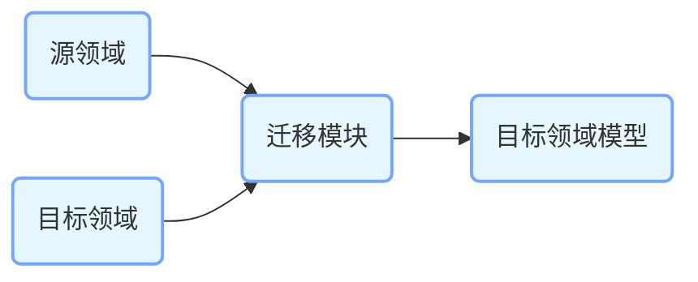

# 模型训练中的迁移学习策略优化与创新

> 关键词：迁移学习、模型训练、策略优化、创新方法、知识迁移

> 摘要：本文围绕模型训练中的迁移学习策略展开深入探讨。首先介绍了迁移学习在当前机器学习和人工智能领域的重要背景和意义，阐述了其目的、适用范围以及预期读者群体。详细解释了迁移学习的核心概念，包括其原理和架构，并通过文本示意图和 Mermaid 流程图进行直观展示。深入剖析了核心算法原理，结合 Python 源代码进行具体操作步骤的说明。同时，给出了相关的数学模型和公式，并辅以详细讲解和举例。通过实际项目案例，展示了迁移学习策略在代码实现中的应用，包括开发环境搭建、源代码详细实现和代码解读。探讨了迁移学习在不同实际场景中的应用，推荐了相关的学习资源、开发工具框架和论文著作。最后，总结了迁移学习的未来发展趋势与挑战，并提供了常见问题的解答和扩展阅读参考资料，旨在为研究和应用迁移学习的专业人士提供全面且深入的技术指导。

## 1. 背景介绍 
### 1.1 目的和范围
在当今人工智能和机器学习的快速发展过程中，模型训练面临着诸多挑战，如数据稀缺、训练成本高和时间长等问题。迁移学习作为一种有效的解决方案，旨在通过将一个领域（源领域）中学习到的知识迁移到另一个相关领域（目标领域），从而减少目标领域模型训练所需的数据量和计算资源，提高模型的性能和泛化能力。

本文的范围涵盖了迁移学习的基本概念、核心算法原理、数学模型、实际应用案例以及相关工具和资源。我们将重点探讨如何优化和创新迁移学习策略，以更好地应对不同领域的模型训练需求。

### 1.2 预期读者
本文主要面向对机器学习、深度学习和迁移学习感兴趣的研究人员、工程师和学生。对于那些希望在模型训练中应用迁移学习技术，提高模型性能和效率的专业人士，本文将提供有价值的技术指导和实践经验。同时，对于初学者来说，本文也可以作为了解迁移学习的入门资料，帮助他们建立起对迁移学习的基本认识和理解。

### 1.3 文档结构概述
本文将按照以下结构进行组织：
1. 背景介绍：介绍迁移学习的目的、范围、预期读者和文档结构概述，以及相关术语的定义和解释。
2. 核心概念与联系：详细解释迁移学习的核心概念，包括其原理和架构，并通过文本示意图和 Mermaid 流程图进行直观展示。
3. 核心算法原理 & 具体操作步骤：深入剖析迁移学习的核心算法原理，结合 Python 源代码进行具体操作步骤的说明。
4. 数学模型和公式 & 详细讲解 & 举例说明：给出迁移学习的相关数学模型和公式，并辅以详细讲解和举例。
5. 项目实战：代码实际案例和详细解释说明：通过实际项目案例，展示迁移学习策略在代码实现中的应用，包括开发环境搭建、源代码详细实现和代码解读。
6. 实际应用场景：探讨迁移学习在不同实际场景中的应用，如计算机视觉、自然语言处理等。
7. 工具和资源推荐：推荐相关的学习资源、开发工具框架和论文著作，帮助读者进一步深入学习和研究迁移学习。
8. 总结：未来发展趋势与挑战：总结迁移学习的未来发展趋势与挑战，为读者提供前瞻性的思考。
9. 附录：常见问题与解答：提供常见问题的解答，帮助读者解决在学习和应用迁移学习过程中遇到的问题。
10. 扩展阅读 & 参考资料：提供扩展阅读和参考资料，方便读者进一步深入学习和研究迁移学习。

### 1.4 术语表
#### 1.4.1 核心术语定义
- **迁移学习（Transfer Learning）**：是一种机器学习技术，旨在将一个领域（源领域）中学习到的知识迁移到另一个相关领域（目标领域），以提高目标领域模型的性能和泛化能力。
- **源领域（Source Domain）**：是指迁移学习中提供知识的领域，通常具有大量的标注数据和已经训练好的模型。
- **目标领域（Target Domain）**：是指迁移学习中需要应用知识的领域，通常数据量较少或缺乏标注数据。
- **特征迁移（Feature Transfer）**：是指将源领域的特征表示迁移到目标领域，以帮助目标领域模型更好地学习和分类。
- **模型迁移（Model Transfer）**：是指将源领域的模型结构和参数迁移到目标领域，以减少目标领域模型的训练时间和计算资源。

#### 1.4.2 相关概念解释
- **领域自适应（Domain Adaptation）**：是迁移学习的一种特殊情况，旨在解决源领域和目标领域之间的数据分布差异问题，通过调整模型的参数或特征表示，使模型能够在目标领域上取得更好的性能。
- **多源迁移学习（Multi - source Transfer Learning）**：是指从多个源领域中迁移知识到目标领域，以充分利用不同源领域的知识，提高目标领域模型的性能。
- **无监督迁移学习（Unsupervised Transfer Learning）**：是指在目标领域没有标注数据的情况下进行迁移学习，通过利用源领域的标注数据和目标领域的无标注数据，学习到适用于目标领域的特征表示或模型。

#### 1.4.3 缩略词列表
- **ML（Machine Learning）**：机器学习
- **DL（Deep Learning）**：深度学习
- **CNN（Convolutional Neural Network）**：卷积神经网络
- **RNN（Recurrent Neural Network）**：循环神经网络
- **LSTM（Long Short - Term Memory）**：长短期记忆网络

## 2. 核心概念与联系 

### 2.1 迁移学习的原理
迁移学习的基本原理是利用源领域和目标领域之间的相关性，将源领域中学习到的知识迁移到目标领域，从而提高目标领域模型的性能。这种相关性可以体现在数据的特征分布、模型的结构和参数等方面。

具体来说，迁移学习可以通过以下几种方式实现知识迁移：
- **特征迁移**：从源领域中提取有用的特征表示，并将其应用到目标领域中。这些特征可以是手工设计的特征，也可以是通过深度学习模型自动学习到的特征。
- **模型迁移**：将源领域中已经训练好的模型结构和参数迁移到目标领域中，然后在目标领域的数据上进行微调。这种方法可以减少目标领域模型的训练时间和计算资源。
- **参数迁移**：直接将源领域模型的部分参数迁移到目标领域模型中，作为目标领域模型的初始参数，然后在目标领域的数据上进行训练。

### 2.2 迁移学习的架构
迁移学习的架构通常包括源领域、目标领域和迁移模块三个部分，如下图所示：



- **源领域**：包含大量的标注数据和已经训练好的模型，是知识的提供者。
- **目标领域**：数据量较少或缺乏标注数据，需要从源领域中迁移知识来提高模型的性能。
- **迁移模块**：负责将源领域的知识迁移到目标领域，具体实现方式可以根据不同的迁移学习方法进行选择。

### 2.3 核心概念之间的联系
特征迁移、模型迁移和参数迁移是迁移学习中常用的三种知识迁移方式，它们之间存在着密切的联系。特征迁移是从数据层面进行知识迁移，通过提取源领域的特征表示来帮助目标领域模型更好地学习；模型迁移是从模型层面进行知识迁移，将源领域的模型结构和参数迁移到目标领域；参数迁移则是模型迁移的一种具体实现方式，直接将源领域模型的部分参数迁移到目标领域模型中。

在实际应用中，可以根据源领域和目标领域的具体情况，选择合适的迁移学习方式，或者将多种迁移学习方式结合使用，以达到更好的迁移效果。

## 3. 核心算法原理 & 具体操作步骤 

### 3.1 基于特征迁移的算法原理
基于特征迁移的算法主要是通过提取源领域和目标领域的特征表示，然后找到一种映射关系，将源领域的特征映射到目标领域，使得目标领域的特征表示更易于分类和学习。

一种常见的基于特征迁移的算法是领域自适应的主成分分析（Domain - Adaptive Principal Component Analysis，DAPCA）。该算法的基本思想是在主成分分析（PCA）的基础上，引入领域自适应的约束，使得源领域和目标领域的特征在低维空间中具有相似的分布。

### 3.2 Python 代码实现
以下是一个简单的基于特征迁移的 Python 代码示例，使用了 scikit - learn 库中的 PCA 算法：

```python
import numpy as np
from sklearn.decomposition import PCA

# 生成源领域和目标领域的数据
source_data = np.random.rand(100, 10)  # 源领域数据，100 个样本，每个样本 10 个特征
target_data = np.random.rand(50, 10)   # 目标领域数据，50 个样本，每个样本 10 个特征

# 使用 PCA 进行特征提取
pca = PCA(n_components=2)  # 降维到 2 维
source_features = pca.fit_transform(source_data)
target_features = pca.transform(target_data)

print("源领域特征形状:", source_features.shape)
print("目标领域特征形状:", target_features.shape)
```

### 3.3 具体操作步骤
1. **数据准备**：收集源领域和目标领域的数据，并进行预处理，如归一化、标准化等。
2. **特征提取**：使用合适的特征提取方法，如 PCA、LDA 等，从源领域和目标领域的数据中提取特征。
3. **特征映射**：找到一种映射关系，将源领域的特征映射到目标领域，使得目标领域的特征表示更易于分类和学习。
4. **模型训练**：使用提取和映射后的特征，在目标领域的数据上训练模型。

## 4. 数学模型和公式 & 详细讲解 & 举例说明 

### 4.1 主成分分析（PCA）的数学模型
主成分分析（PCA）是一种常用的特征提取方法，其目标是找到数据的主成分，使得数据在这些主成分上的投影具有最大的方差。

设原始数据矩阵为 $X \in \mathbb{R}^{n \times d}$，其中 $n$ 是样本数量，$d$ 是特征维度。PCA 的数学模型可以表示为：

$$
\max_{W} \text{tr}(W^T X^T X W) \quad \text{s.t.} \quad W^T W = I
$$

其中 $W \in \mathbb{R}^{d \times k}$ 是投影矩阵，$k$ 是降维后的维度，$\text{tr}$ 表示矩阵的迹。

### 4.2 公式推导
为了求解上述优化问题，可以使用拉格朗日乘子法。构造拉格朗日函数：

$$
\mathcal{L}(W, \Lambda) = \text{tr}(W^T X^T X W) - \text{tr}(\Lambda (W^T W - I))
$$

其中 $\Lambda \in \mathbb{R}^{k \times k}$ 是拉格朗日乘子矩阵。

对 $W$ 求偏导数并令其为零：

$$
\frac{\partial \mathcal{L}}{\partial W} = 2X^T X W - 2W \Lambda = 0
$$

即：

$$
X^T X W = W \Lambda
$$

这表明 $W$ 的列向量是 $X^T X$ 的特征向量，$\Lambda$ 是对应的特征值矩阵。因此，PCA 的求解过程就是求解 $X^T X$ 的前 $k$ 个最大特征值对应的特征向量。

### 4.3 举例说明
假设有以下二维数据：

$$
X = \begin{bmatrix}
1 & 2 \\
2 & 3 \\
3 & 4 \\
4 & 5
\end{bmatrix}
$$

首先计算 $X^T X$：

$$
X^T X = \begin{bmatrix}
1 & 2 & 3 & 4 \\
2 & 3 & 4 & 5
\end{bmatrix}
\begin{bmatrix}
1 & 2 \\
2 & 3 \\
3 & 4 \\
4 & 5
\end{bmatrix}
= \begin{bmatrix}
30 & 40 \\
40 & 54
\end{bmatrix}
$$

然后求解 $X^T X$ 的特征值和特征向量：

特征值 $\lambda_1 = 83.85$，对应的特征向量 $v_1 = \begin{bmatrix} 0.6 \\ 0.8 \end{bmatrix}$

特征值 $\lambda_2 = 0.15$，对应的特征向量 $v_2 = \begin{bmatrix} -0.8 \\ 0.6 \end{bmatrix}$

如果我们要将数据降维到一维，选择最大特征值对应的特征向量 $v_1$ 作为投影矩阵 $W$，则降维后的数据为：

$$
X_{reduced} = X W = \begin{bmatrix}
1 & 2 \\
2 & 3 \\
3 & 4 \\
4 & 5
\end{bmatrix}
\begin{bmatrix}
0.6 \\
0.8
\end{bmatrix}
= \begin{bmatrix}
2.2 \\
3.6 \\
5.0 \\
6.4
\end{bmatrix}
$$

## 5. 项目实战：代码实际案例和详细解释说明 

### 5.1 开发环境搭建
本项目使用 Python 作为开发语言，需要安装以下库：
- **TensorFlow**：一个开源的机器学习框架，用于构建和训练深度学习模型。
- **Keras**：一个高级神经网络 API，基于 TensorFlow 实现，方便快速搭建和训练模型。
- **scikit - learn**：一个常用的机器学习库，提供了各种机器学习算法和工具。

可以使用以下命令安装这些库：

```bash
pip install tensorflow keras scikit-learn
```

### 5.2 源代码详细实现和代码解读
以下是一个使用迁移学习进行图像分类的项目实战代码示例：

```python
import tensorflow as tf
from tensorflow.keras.applications.vgg16 import VGG16
from tensorflow.keras.layers import Dense, Flatten
from tensorflow.keras.models import Model
from tensorflow.keras.preprocessing.image import ImageDataGenerator

# 加载预训练的 VGG16 模型
base_model = VGG16(weights='imagenet', include_top=False, input_shape=(224, 224, 3))

# 冻结预训练模型的所有层
for layer in base_model.layers:
    layer.trainable = False

# 添加自定义的分类层
x = Flatten()(base_model.output)
x = Dense(256, activation='relu')(x)
predictions = Dense(2, activation='softmax')(x)

# 构建新的模型
model = Model(inputs=base_model.input, outputs=predictions)

# 编译模型
model.compile(optimizer='adam', loss='categorical_crossentropy', metrics=['accuracy'])

# 数据预处理和增强
train_datagen = ImageDataGenerator(
    rescale=1./255,
    shear_range=0.2,
    zoom_range=0.2,
    horizontal_flip=True
)

test_datagen = ImageDataGenerator(rescale=1./255)

# 加载训练和测试数据
train_generator = train_datagen.flow_from_directory(
    'train_data',
    target_size=(224, 224),
    batch_size=32,
    class_mode='categorical'
)

test_generator = test_datagen.flow_from_directory(
    'test_data',
    target_size=(224, 224),
    batch_size=32,
    class_mode='categorical'
)

# 训练模型
model.fit(
    train_generator,
    steps_per_epoch=train_generator.samples // train_generator.batch_size,
    epochs=10,
    validation_data=test_generator,
    validation_steps=test_generator.samples // test_generator.batch_size
)

# 评估模型
test_loss, test_acc = model.evaluate(test_generator)
print('Test accuracy:', test_acc)
```

### 5.3 代码解读与分析
1. **加载预训练模型**：使用 `VGG16` 模型作为基础模型，并加载其在 ImageNet 数据集上预训练的权重。`include_top=False` 表示不包含模型的顶层全连接层。
2. **冻结预训练模型的层**：通过将 `base_model.layers` 中的所有层的 `trainable` 属性设置为 `False`，冻结这些层的参数，使得在训练过程中这些参数不会被更新。
3. **添加自定义分类层**：在预训练模型的输出层后面添加自定义的全连接层和分类层，用于适应目标领域的分类任务。
4. **构建新模型**：使用 `Model` 类将预训练模型的输入和自定义分类层的输出组合成一个新的模型。
5. **编译模型**：使用 `adam` 优化器和 `categorical_crossentropy` 损失函数编译模型，并设置评估指标为准确率。
6. **数据预处理和增强**：使用 `ImageDataGenerator` 对训练和测试数据进行预处理和增强，包括归一化、剪切、缩放和水平翻转等操作。
7. **加载数据**：使用 `flow_from_directory` 方法从指定的目录中加载训练和测试数据。
8. **训练模型**：使用 `fit` 方法对模型进行训练，并指定训练的步数、轮数和验证数据。
9. **评估模型**：使用 `evaluate` 方法对模型在测试数据上的性能进行评估，并输出测试准确率。

## 6. 实际应用场景 
### 6.1 计算机视觉领域
- **图像分类**：在目标领域数据量较少的情况下，可以使用迁移学习将在大规模图像数据集（如 ImageNet）上预训练的模型迁移到目标领域，从而提高图像分类的准确率。例如，在医疗图像分类中，可以使用在自然图像上预训练的模型，然后在医疗图像数据集上进行微调。
- **目标检测**：迁移学习可以用于目标检测任务，通过将在大规模目标检测数据集上预训练的模型迁移到特定领域的目标检测任务中，减少目标领域的训练时间和数据需求。例如，在交通场景中的目标检测，可以使用在通用目标检测数据集上预训练的模型，然后在交通场景数据集上进行微调。

### 6.2 自然语言处理领域
- **文本分类**：在文本分类任务中，迁移学习可以通过将在大规模文本数据集（如 Wikipedia）上预训练的语言模型（如 BERT）迁移到目标领域的文本分类任务中，提高文本分类的性能。例如，在情感分析任务中，可以使用预训练的 BERT 模型，然后在情感分析数据集上进行微调。
- **机器翻译**：迁移学习可以用于机器翻译任务，通过将在大规模平行语料库上预训练的机器翻译模型迁移到特定领域的机器翻译任务中，提高翻译的质量和效率。例如，在医学领域的机器翻译中，可以使用在通用平行语料库上预训练的模型，然后在医学平行语料库上进行微调。

### 6.3 语音识别领域
在语音识别任务中，迁移学习可以通过将在大规模语音数据集上预训练的语音识别模型迁移到特定领域的语音识别任务中，提高语音识别的准确率和鲁棒性。例如，在车载语音识别系统中，可以使用在通用语音数据集上预训练的模型，然后在车载语音数据集上进行微调。

## 7. 工具和资源推荐
### 7.1 学习资源推荐
#### 7.1.1 书籍推荐
- 《深度学习》（Deep Learning）：由 Ian Goodfellow、Yoshua Bengio 和 Aaron Courville 所著，是深度学习领域的经典教材，涵盖了深度学习的基本概念、算法和应用。
- 《机器学习》（Machine Learning）：由 Tom M. Mitchell 所著，是机器学习领域的经典教材，系统地介绍了机器学习的基本概念、算法和理论。
- 《迁移学习简明手册》（A Comprehensive Survey on Transfer Learning）：详细介绍了迁移学习的基本概念、算法和应用，是迁移学习领域的重要参考书籍。

#### 7.1.2 在线课程
- Coursera 上的“深度学习专项课程”（Deep Learning Specialization）：由 Andrew Ng 教授授课，包括深度学习的基础知识、卷积神经网络、循环神经网络等内容，是学习深度学习的优质在线课程。
- edX 上的“迁移学习”（Transfer Learning）：专门介绍迁移学习的基本概念、算法和应用，通过理论讲解和实践案例，帮助学习者深入理解迁移学习。

#### 7.1.3 技术博客和网站
- Medium 上的 Towards Data Science：是一个专注于数据科学和机器学习的技术博客，经常发布关于迁移学习的最新研究成果和实践经验。
- arXiv.org：是一个开放获取的学术预印本平台，提供了大量关于迁移学习的研究论文，可以及时了解迁移学习的最新研究动态。

### 7.2 开发工具框架推荐
#### 7.2.1 IDE和编辑器
- PyCharm：是一款专门为 Python 开发设计的集成开发环境（IDE），提供了丰富的代码编辑、调试和项目管理功能，适合用于开发迁移学习项目。
- Jupyter Notebook：是一个基于 Web 的交互式计算环境，支持 Python、R 等多种编程语言，方便进行代码编写、实验和可视化，是数据科学和机器学习领域常用的开发工具。

#### 7.2.2 调试和性能分析工具
- TensorBoard：是 TensorFlow 提供的一个可视化工具，可以用于可视化模型的训练过程、性能指标和网络结构等，帮助开发者进行调试和性能分析。
- PyTorch Profiler：是 PyTorch 提供的一个性能分析工具，可以用于分析模型的运行时间、内存使用情况等，帮助开发者优化模型的性能。

#### 7.2.3 相关框架和库
- TensorFlow：是一个开源的机器学习框架，提供了丰富的深度学习模型和工具，支持迁移学习的实现。
- PyTorch：是一个开源的深度学习框架，具有简洁易用的 API 和高效的计算性能，广泛应用于迁移学习的研究和开发。
- scikit - learn：是一个常用的机器学习库，提供了各种机器学习算法和工具，包括特征提取、模型选择和评估等，可用于迁移学习的前期数据处理和模型评估。

### 7.3 相关论文著作推荐
#### 7.3.1 经典论文
- “A Survey on Transfer Learning”：由 Sinno Jialin Pan 和 Qiang Yang 发表，是迁移学习领域的经典综述论文，系统地介绍了迁移学习的基本概念、算法和应用。
- “ImageNet Classification with Deep Convolutional Neural Networks”：由 Alex Krizhevsky、Ilya Sutskever 和 Geoffrey E. Hinton 发表，提出了 AlexNet 模型，开启了深度学习在计算机视觉领域的新纪元，也为迁移学习在图像分类任务中的应用奠定了基础。

#### 7.3.2 最新研究成果
- 在 arXiv.org 上搜索“Transfer Learning”，可以找到大量关于迁移学习的最新研究论文，涵盖了迁移学习的各个方面，如算法创新、应用拓展等。
- 参加机器学习和人工智能领域的顶级学术会议，如 NeurIPS、ICML、CVPR 等，了解迁移学习的最新研究动态和成果。

#### 7.3.3 应用案例分析
- Kaggle 是一个数据科学竞赛平台，上面有很多关于迁移学习的实际应用案例和解决方案，可以通过学习这些案例，了解迁移学习在不同领域的应用和实践经验。
- 各大科技公司的技术博客，如 Google AI Blog、Facebook AI Research Blog 等，经常发布关于迁移学习的应用案例和技术分享，可以从中学习到实际应用中的技巧和方法。

## 8. 总结：未来发展趋势与挑战
### 8.1 未来发展趋势
- **跨领域迁移学习**：随着人工智能的发展，不同领域之间的联系越来越紧密，跨领域迁移学习将成为未来的一个重要发展方向。例如，将计算机视觉领域的知识迁移到自然语言处理领域，或者将语音识别领域的知识迁移到医疗诊断领域。
- **无监督和半监督迁移学习**：在实际应用中，标注数据往往是非常昂贵和耗时的，因此无监督和半监督迁移学习将具有更广阔的应用前景。通过利用大量的无标注数据和少量的标注数据进行迁移学习，可以提高模型的性能和效率。
- **深度迁移学习**：随着深度学习技术的不断发展，深度迁移学习将成为未来的主流。通过构建更深层次的神经网络模型，并结合迁移学习的思想，可以进一步提高模型的性能和泛化能力。

### 8.2 挑战
- **领域差异问题**：源领域和目标领域之间的差异可能会导致迁移学习的效果不佳。如何有效地解决领域差异问题，是迁移学习面临的一个重要挑战。
- **知识表示和迁移问题**：如何将源领域的知识有效地表示和迁移到目标领域，是迁移学习的核心问题。目前的迁移学习方法在知识表示和迁移方面还存在一定的局限性，需要进一步的研究和创新。
- **模型可解释性问题**：深度学习模型往往是黑盒模型，缺乏可解释性。在迁移学习中，模型的可解释性问题更加突出。如何提高迁移学习模型的可解释性，是未来需要解决的一个重要问题。

## 9. 附录：常见问题与解答
### 9.1 迁移学习一定能提高目标领域模型的性能吗？
不一定。迁移学习的效果取决于源领域和目标领域之间的相关性、数据的质量和数量、迁移学习的方法等多种因素。如果源领域和目标领域之间的差异过大，或者迁移学习的方法选择不当，可能会导致负迁移，即目标领域模型的性能反而下降。

### 9.2 如何选择合适的源领域？
选择合适的源领域需要考虑以下几个因素：
- **相关性**：源领域和目标领域之间应该具有一定的相关性，例如数据的特征分布、任务的性质等。
- **数据量**：源领域应该具有足够多的标注数据，以便学习到有效的知识。
- **模型性能**：源领域的模型应该具有较好的性能，这样迁移过来的知识才更有价值。

### 9.3 如何解决迁移学习中的领域差异问题？
可以采用以下方法解决迁移学习中的领域差异问题：
- **特征对齐**：通过特征提取和映射的方法，使源领域和目标领域的特征在低维空间中具有相似的分布。
- **领域自适应**：在模型训练过程中，引入领域自适应的约束，使模型能够适应目标领域的数据分布。
- **多源迁移学习**：从多个源领域中迁移知识，充分利用不同源领域的知识，减少领域差异的影响。

## 10. 扩展阅读 & 参考资料
### 10.1 扩展阅读
- 《强化学习：原理与Python实现》：介绍了强化学习的基本概念、算法和应用，强化学习与迁移学习有一定的联系，可以进一步拓展相关知识。
- 《生成对抗网络实战》：讲解了生成对抗网络的原理和实践，生成对抗网络在迁移学习中也有一定的应用，可以深入了解相关技术。

### 10.2 参考资料
- 各开源框架的官方文档，如 TensorFlow、PyTorch 等，提供了详细的 API 文档和使用示例。
- 学术数据库，如 IEEE Xplore、ACM Digital Library 等，包含了大量关于迁移学习的研究论文和会议报告。

作者：AI天才研究院/AI Genius Institute & 禅与计算机程序设计艺术 /Zen And The Art of Computer Programming