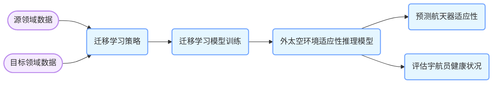

# 模型训练中的迁移学习策略在外太空环境适应性推理中的优化

> 关键词：迁移学习、模型训练、外太空环境、适应性推理、优化策略

> 摘要：本文聚焦于模型训练中的迁移学习策略在外太空环境适应性推理中的优化。首先介绍了研究的背景、目的、预期读者和文档结构，阐述了相关术语。接着深入探讨了迁移学习、外太空环境适应性推理等核心概念及其联系，并给出了相应的文本示意图和Mermaid流程图。详细讲解了核心算法原理，用Python代码进行了说明，同时介绍了相关的数学模型和公式。通过项目实战，展示了开发环境搭建、源代码实现与解读。分析了迁移学习策略在外太空环境适应性推理中的实际应用场景，推荐了学习资源、开发工具框架和相关论文著作。最后总结了未来发展趋势与挑战，解答了常见问题并提供了扩展阅读和参考资料，旨在为该领域的研究和实践提供全面而深入的指导。

## 1. 背景介绍 
### 1.1 目的和范围
随着人类对宇宙探索的不断深入，外太空环境下的各种任务日益增多，如行星探测、太空站建设与维护等。在这些任务中，需要对航天器、设备以及宇航员在外太空环境中的适应性进行准确推理。然而，外太空环境具有极端性和复杂性，如高辐射、微重力、低温等，获取足够的标注数据进行模型训练十分困难。迁移学习作为一种有效的机器学习技术，能够利用已有的相关领域数据和知识，来帮助目标领域模型的训练。本研究的目的就是探索如何优化模型训练中的迁移学习策略，以提高在外太空环境适应性推理中的准确性和效率。

本研究的范围主要涵盖迁移学习策略的选择与改进、外太空环境适应性推理模型的构建与优化，以及将迁移学习应用于外太空环境适应性推理的实际案例分析。

### 1.2 预期读者
本文预期读者包括从事航天工程、机器学习、人工智能等领域的科研人员和工程师，他们希望了解如何利用迁移学习技术解决外太空环境适应性推理问题；也适合相关专业的研究生和高年级本科生，作为学习和研究的参考资料。

### 1.3 文档结构概述
本文首先介绍研究的背景信息，包括目的、范围、预期读者和文档结构。接着阐述迁移学习、外太空环境适应性推理等核心概念及其联系，并给出相应的流程图。然后详细讲解核心算法原理和具体操作步骤，通过Python代码进行说明。介绍相关的数学模型和公式，并举例说明。通过项目实战展示开发环境搭建、源代码实现与解读。分析迁移学习策略在外太空环境适应性推理中的实际应用场景。推荐学习资源、开发工具框架和相关论文著作。最后总结未来发展趋势与挑战，解答常见问题并提供扩展阅读和参考资料。

### 1.4 术语表
#### 1.4.1 核心术语定义
- **迁移学习（Transfer Learning）**：是一种机器学习技术，它将从一个或多个源领域学习到的知识迁移到目标领域，以提高目标领域模型的性能，减少目标领域对大量标注数据的依赖。
- **外太空环境适应性推理**：指通过建立模型，根据外太空环境的各种参数（如辐射强度、温度、压力等），对航天器、设备或宇航员在外太空环境中的适应能力进行预测和评估。
- **源领域（Source Domain）**：是指已经有大量标注数据和知识的领域，迁移学习从该领域获取知识。
- **目标领域（Target Domain）**：是指需要进行模型训练和推理的领域，通常数据较少，需要借助源领域的知识。

#### 1.4.2 相关概念解释
- **特征迁移**：在迁移学习中，将源领域的特征表示迁移到目标领域，使目标领域模型能够利用源领域的特征信息。
- **模型微调（Fine-tuning）**：在迁移学习中，基于预训练的源领域模型，对目标领域数据进行少量的参数调整，以适应目标领域的任务。
- **外太空环境参数**：包括辐射剂量率、微流星体通量、温度范围、磁场强度等，这些参数对航天器和宇航员的安全和性能有重要影响。

#### 1.4.3 缩略词列表
- **TL**：Transfer Learning（迁移学习）
- **SD**：Source Domain（源领域）
- **TD**：Target Domain（目标领域）

## 2. 核心概念与联系 
### 核心概念原理
#### 迁移学习原理
迁移学习的核心思想是利用源领域和目标领域之间的相似性，将源领域的知识迁移到目标领域。源领域和目标领域通常具有不同的特征分布和数据规模，但它们在某些方面存在一定的关联。迁移学习通过挖掘这些关联，使得目标领域模型能够借助源领域的知识，更快地收敛和提高性能。

迁移学习主要有三种类型：基于样本的迁移学习、基于特征的迁移学习和基于模型的迁移学习。基于样本的迁移学习通过选择和加权源领域的样本，将其用于目标领域的训练；基于特征的迁移学习通过寻找源领域和目标领域的共同特征表示，实现知识的迁移；基于模型的迁移学习则是利用源领域预训练的模型，对目标领域进行微调或初始化。

#### 外太空环境适应性推理原理
外太空环境适应性推理是基于外太空环境的各种参数，构建模型来预测航天器、设备或宇航员在外太空环境中的适应能力。这些参数包括辐射、温度、压力等，它们会对航天器的材料性能、电子设备的可靠性以及宇航员的健康产生影响。通过收集和分析这些参数的数据，建立合适的模型，如神经网络模型、决策树模型等，可以对外太空环境适应性进行推理和评估。

### 核心概念架构的文本示意图
```plaintext
+---------------------+     +---------------------+
|     源领域数据      |     |     目标领域数据    |
+---------------------+     +---------------------+
| - 大量标注数据       |     | - 少量标注数据      |
| - 特定领域知识       |     | - 外太空环境参数    |
+---------------------+     +---------------------+
           |                           |
           | 迁移学习策略             |
           |                           |
+---------------------+
| 迁移学习模型训练    |
+---------------------+
| - 特征迁移          |
| - 模型微调          |
+---------------------+
           |
           |
+---------------------+
| 外太空环境适应性推理模型 |
+---------------------+
| - 预测航天器适应性   |
| - 评估宇航员健康状况 |
+---------------------+
```

### Mermaid 流程图


## 3. 核心算法原理 & 具体操作步骤 
### 核心算法原理
#### 基于特征的迁移学习算法
基于特征的迁移学习算法的核心是找到源领域和目标领域的共同特征表示。一种常用的方法是使用深度神经网络进行特征提取。具体来说，我们可以在源领域上训练一个深度神经网络，然后将其特征提取层应用到目标领域数据上。

假设我们有一个源领域数据集 $D_S = \{(x_{S1}, y_{S1}), (x_{S2}, y_{S2}), \cdots, (x_{Sn_S}, y_{Sn_S})\}$ 和一个目标领域数据集 $D_T = \{(x_{T1}, y_{T1}), (x_{T2}, y_{T2}), \cdots, (x_{Tn_T}, y_{Tn_T})\}$，其中 $x$ 是特征向量，$y$ 是标签。我们可以使用一个卷积神经网络（CNN）作为特征提取器。

在源领域上训练 CNN 时，我们的目标是最小化源领域的损失函数 $L_S$：
$$L_S = \frac{1}{n_S} \sum_{i=1}^{n_S} \ell(f(x_{Si}), y_{Si})$$
其中 $\ell$ 是损失函数，如交叉熵损失函数，$f$ 是 CNN 的特征提取层和分类层组成的函数。

训练好 CNN 后，我们固定其特征提取层的参数，只对分类层进行微调，以适应目标领域的数据。在微调过程中，我们最小化目标领域的损失函数 $L_T$：
$$L_T = \frac{1}{n_T} \sum_{i=1}^{n_T} \ell(f'(x_{Ti}), y_{Ti})$$
其中 $f'$ 是微调后的模型，其特征提取层参数固定，分类层参数可调整。

### 具体操作步骤
#### 步骤 1：数据准备
- 收集源领域和目标领域的数据。源领域数据可以是与外太空环境相关的地面模拟实验数据，或者是其他类似环境的数据；目标领域数据是实际的外太空环境数据。
- 对数据进行预处理，包括数据清洗、归一化等操作。

#### 步骤 2：源领域模型训练
- 选择合适的深度神经网络架构，如 ResNet、VGG 等。
- 使用源领域数据对神经网络进行训练，调整模型参数，直到模型在源领域上达到较好的性能。

#### 步骤 3：特征迁移
- 固定源领域模型的特征提取层参数。
- 将目标领域数据输入到特征提取层，得到目标领域数据的特征表示。

#### 步骤 4：目标领域模型微调
- 在特征提取层的基础上，添加一个新的分类层。
- 使用目标领域数据对新的分类层进行微调，调整分类层的参数，以适应目标领域的任务。

### Python 代码实现
```python
import torch
import torch.nn as nn
import torch.optim as optim
from torchvision import models, transforms
from torch.utils.data import DataLoader, Dataset

# 定义一个简单的数据集类
class CustomDataset(Dataset):
    def __init__(self, data, labels):
        self.data = data
        self.labels = labels

    def __len__(self):
        return len(self.data)

    def __getitem__(self, idx):
        return self.data[idx], self.labels[idx]

# 步骤 1：数据准备
# 假设我们已经有了源领域和目标领域的数据
source_data = torch.randn(100, 3, 224, 224)
source_labels = torch.randint(0, 10, (100,))
target_data = torch.randn(20, 3, 224, 224)
target_labels = torch.randint(0, 10, (20,))

source_dataset = CustomDataset(source_data, source_labels)
target_dataset = CustomDataset(target_data, target_labels)

source_dataloader = DataLoader(source_dataset, batch_size=10, shuffle=True)
target_dataloader = DataLoader(target_dataset, batch_size=10, shuffle=True)

# 步骤 2：源领域模型训练
model = models.resnet18(pretrained=False)
num_ftrs = model.fc.in_features
model.fc = nn.Linear(num_ftrs, 10)

criterion = nn.CrossEntropyLoss()
optimizer = optim.SGD(model.parameters(), lr=0.001, momentum=0.9)

device = torch.device("cuda:0" if torch.cuda.is_available() else "cpu")
model.to(device)

for epoch in range(10):
    running_loss = 0.0
    for i, data in enumerate(source_dataloader, 0):
        inputs, labels = data[0].to(device), data[1].to(device)

        optimizer.zero_grad()

        outputs = model(inputs)
        loss = criterion(outputs, labels)
        loss.backward()
        optimizer.step()

        running_loss += loss.item()
    print(f'Epoch {epoch + 1}, Loss: {running_loss / len(source_dataloader)}')

# 步骤 3：特征迁移
# 固定特征提取层的参数
for param in model.parameters():
    param.requires_grad = False

# 步骤 4：目标领域模型微调
# 替换分类层
num_ftrs = model.fc.in_features
model.fc = nn.Linear(num_ftrs, 10)

# 只对新的分类层进行优化
optimizer = optim.SGD(model.fc.parameters(), lr=0.001, momentum=0.9)

for epoch in range(5):
    running_loss = 0.0
    for i, data in enumerate(target_dataloader, 0):
        inputs, labels = data[0].to(device), data[1].to(device)

        optimizer.zero_grad()

        outputs = model(inputs)
        loss = criterion(outputs, labels)
        loss.backward()
        optimizer.step()

        running_loss += loss.item()
    print(f'Epoch {epoch + 1}, Loss: {running_loss / len(target_dataloader)}')
```

## 4. 数学模型和公式 & 详细讲解 & 举例说明 
### 数学模型和公式
#### 迁移学习损失函数
在迁移学习中，我们通常需要同时考虑源领域和目标领域的损失。一种常见的方法是使用加权损失函数：
$$L = \alpha L_S + (1 - \alpha) L_T$$
其中 $L_S$ 是源领域的损失函数，$L_T$ 是目标领域的损失函数，$\alpha$ 是权重系数，$0 \leq \alpha \leq 1$。

#### 特征分布匹配
为了使源领域和目标领域的特征分布更加接近，我们可以使用最大均值差异（Maximum Mean Discrepancy，MMD）来衡量两个分布之间的差异。假设我们有源领域特征集合 $X_S = \{x_{S1}, x_{S2}, \cdots, x_{Sn_S}\}$ 和目标领域特征集合 $X_T = \{x_{T1}, x_{T2}, \cdots, x_{Tn_T}\}$，MMD 的计算公式如下：
$$MMD(X_S, X_T) = \left\|\frac{1}{n_S} \sum_{i=1}^{n_S} \phi(x_{Si}) - \frac{1}{n_T} \sum_{j=1}^{n_T} \phi(x_{Tj})\right\|^2$$
其中 $\phi$ 是一个特征映射函数，将特征映射到再生核希尔伯特空间（Reproducing Kernel Hilbert Space，RKHS）。

### 详细讲解
#### 加权损失函数
加权损失函数的目的是在训练过程中平衡源领域和目标领域的重要性。当 $\alpha$ 接近 1 时，模型更注重源领域的损失，这适用于源领域数据质量较高、与目标领域相关性较强的情况；当 $\alpha$ 接近 0 时，模型更注重目标领域的损失，适用于目标领域数据较多、与源领域差异较大的情况。

#### 最大均值差异
MMD 是一种无参数的统计方法，用于衡量两个概率分布之间的差异。在迁移学习中，我们希望源领域和目标领域的特征分布尽可能接近，因此可以通过最小化 MMD 来实现特征分布的匹配。通过将特征映射到 RKHS 中，MMD 可以有效地处理高维数据和非线性分布。

### 举例说明
假设我们有一个源领域数据集 $D_S$ 包含 1000 个样本，目标领域数据集 $D_T$ 包含 100 个样本。我们使用交叉熵损失函数作为源领域和目标领域的损失函数，权重系数 $\alpha = 0.8$。在训练过程中，我们同时计算源领域和目标领域的损失，并根据加权损失函数进行参数更新。

另外，我们使用高斯核函数作为特征映射函数 $\phi$，计算源领域和目标领域特征的 MMD。在训练过程中，我们可以将 MMD 作为一个正则化项添加到损失函数中，以促使源领域和目标领域的特征分布更加接近。

## 5. 项目实战：代码实际案例和详细解释说明 
### 5.1  开发环境搭建
#### 硬件环境
- **CPU**：Intel Core i7 及以上处理器，建议使用多核处理器以提高训练速度。
- **GPU**：NVIDIA GPU，如 NVIDIA GeForce RTX 3080 或更高版本，用于加速深度学习模型的训练。
- **内存**：至少 16GB 内存，建议 32GB 或以上。
- **存储**：至少 500GB 硬盘空间，用于存储数据和模型。

#### 软件环境
- **操作系统**：Windows 10、Ubuntu 18.04 或更高版本。
- **Python**：Python 3.7 或更高版本。
- **深度学习框架**：PyTorch 1.7 或更高版本。
- **数据处理库**：NumPy、Pandas。
- **可视化库**：Matplotlib、Seaborn。

#### 安装步骤
1. 安装 Python：可以从 Python 官方网站（https://www.python.org/downloads/）下载并安装 Python。
2. 安装 PyTorch：根据自己的操作系统和 GPU 情况，从 PyTorch 官方网站（https://pytorch.org/get-started/locally/）选择合适的安装命令进行安装。
3. 安装其他库：使用以下命令安装所需的库：
```sh
pip install numpy pandas matplotlib seaborn
```

### 5.2  源代码详细实现和代码解读
```python
import torch
import torch.nn as nn
import torch.optim as optim
from torchvision import models, transforms
from torch.utils.data import DataLoader, Dataset
import numpy as np

# 定义一个简单的数据集类
class CustomDataset(Dataset):
    def __init__(self, data, labels):
        self.data = data
        self.labels = labels

    def __len__(self):
        return len(self.data)

    def __getitem__(self, idx):
        return self.data[idx], self.labels[idx]

# 步骤 1：数据准备
# 生成模拟的源领域和目标领域数据
np.random.seed(42)
source_data = torch.tensor(np.random.randn(100, 3, 224, 224).astype(np.float32))
source_labels = torch.tensor(np.random.randint(0, 10, 100))
target_data = torch.tensor(np.random.randn(20, 3, 224, 224).astype(np.float32))
target_labels = torch.tensor(np.random.randint(0, 10, 20))

source_dataset = CustomDataset(source_data, source_labels)
target_dataset = CustomDataset(target_data, target_labels)

source_dataloader = DataLoader(source_dataset, batch_size=10, shuffle=True)
target_dataloader = DataLoader(target_dataset, batch_size=10, shuffle=True)

# 步骤 2：源领域模型训练
model = models.resnet18(pretrained=False)
num_ftrs = model.fc.in_features
model.fc = nn.Linear(num_ftrs, 10)

criterion = nn.CrossEntropyLoss()
optimizer = optim.SGD(model.parameters(), lr=0.001, momentum=0.9)

device = torch.device("cuda:0" if torch.cuda.is_available() else "cpu")
model.to(device)

for epoch in range(10):
    running_loss = 0.0
    for i, data in enumerate(source_dataloader, 0):
        inputs, labels = data[0].to(device), data[1].to(device)

        optimizer.zero_grad()

        outputs = model(inputs)
        loss = criterion(outputs, labels)
        loss.backward()
        optimizer.step()

        running_loss += loss.item()
    print(f'Epoch {epoch + 1}, Loss: {running_loss / len(source_dataloader)}')

# 步骤 3：特征迁移
# 固定特征提取层的参数
for param in model.parameters():
    param.requires_grad = False

# 步骤 4：目标领域模型微调
# 替换分类层
num_ftrs = model.fc.in_features
model.fc = nn.Linear(num_ftrs, 10)

# 只对新的分类层进行优化
optimizer = optim.SGD(model.fc.parameters(), lr=0.001, momentum=0.9)

for epoch in range(5):
    running_loss = 0.0
    for i, data in enumerate(target_dataloader, 0):
        inputs, labels = data[0].to(device), data[1].to(device)

        optimizer.zero_grad()

        outputs = model(inputs)
        loss = criterion(outputs, labels)
        loss.backward()
        optimizer.step()

        running_loss += loss.item()
    print(f'Epoch {epoch + 1}, Loss: {running_loss / len(target_dataloader)}')
```

### 代码解读与分析
#### 数据准备部分
- `CustomDataset` 类继承自 `torch.utils.data.Dataset`，用于封装数据集。它实现了 `__len__` 和 `__getitem__` 方法，分别用于返回数据集的长度和获取指定索引的数据样本。
- 使用 `np.random.randn` 生成模拟的源领域和目标领域数据，使用 `np.random.randint` 生成对应的标签。
- 使用 `DataLoader` 类将数据集封装成可迭代的数据加载器，方便批量加载数据。

#### 源领域模型训练部分
- 使用 `models.resnet18` 加载一个预训练的 ResNet-18 模型，并将其全连接层替换为一个新的全连接层，输出维度为 10。
- 使用交叉熵损失函数 `nn.CrossEntropyLoss` 和随机梯度下降优化器 `optim.SGD` 进行模型训练。
- 在每个 epoch 中，遍历源领域数据加载器，计算损失并进行反向传播和参数更新。

#### 特征迁移部分
- 通过设置 `param.requires_grad = False` 固定模型的所有参数，使得在后续的训练中这些参数不会被更新。

#### 目标领域模型微调部分
- 替换模型的全连接层为一个新的全连接层。
- 只对新的全连接层的参数进行优化，使用随机梯度下降优化器。
- 在每个 epoch 中，遍历目标领域数据加载器，计算损失并进行反向传播和参数更新。

通过以上步骤，我们实现了一个简单的迁移学习模型，利用源领域的知识来帮助目标领域模型的训练。

## 6. 实际应用场景 
### 航天器设备故障预测
在外太空环境中，航天器的设备面临着各种极端条件的考验，如辐射、微重力等，这些条件可能导致设备故障。由于外太空环境数据的稀缺性，直接在这些数据上训练故障预测模型非常困难。使用迁移学习策略，可以利用地面模拟实验数据或其他类似环境的数据作为源领域，将其知识迁移到目标领域的外太空环境数据上，构建故障预测模型。通过该模型，可以提前预测航天器设备的故障，为维修和更换提供时间，保障航天器的安全运行。

### 宇航员健康状况评估
宇航员在外太空环境中会受到辐射、微重力等因素的影响，导致身体出现各种变化，如骨密度下降、免疫系统功能改变等。准确评估宇航员的健康状况对于保障他们的生命安全至关重要。迁移学习可以利用地球上的医学数据和研究成果作为源领域，将其知识迁移到外太空环境下的宇航员健康评估中。通过收集宇航员的生理数据，如心率、血压、血液指标等，结合迁移学习模型，可以实时评估宇航员的健康状况，及时发现潜在的健康问题。

### 外太空环境资源探测
外太空存在着丰富的资源，如小行星上的矿产资源、行星大气中的气体资源等。在进行资源探测时，需要根据外太空环境的特点和探测器获取的数据进行分析和判断。由于外太空环境的复杂性和多样性，获取足够的标注数据进行模型训练是一个挑战。迁移学习可以利用地球上类似地质环境或天体物理研究的数据作为源领域，将其知识迁移到外太空环境资源探测中。通过构建迁移学习模型，可以更准确地识别和评估外太空环境中的资源分布和储量。

## 7. 工具和资源推荐
### 7.1 学习资源推荐
#### 7.1.1 书籍推荐
- 《深度学习》（Deep Learning）：由 Ian Goodfellow、Yoshua Bengio 和 Aaron Courville 所著，是深度学习领域的经典教材，涵盖了深度学习的基本原理、算法和应用。
- 《机器学习》（Machine Learning）：由 Tom M. Mitchell 所著，系统地介绍了机器学习的基本概念、算法和理论，适合初学者入门。
- 《迁移学习简明手册》（A Brief Introduction to Transfer Learning）：专门介绍迁移学习的书籍，详细讲解了迁移学习的原理、方法和应用。

#### 7.1.2 在线课程
- Coursera 上的“深度学习专项课程”（Deep Learning Specialization）：由 Andrew Ng 教授授课，包括深度学习基础、卷积神经网络、循环神经网络等多个课程，对深度学习和迁移学习有深入的讲解。
- edX 上的“机器学习基础”（Foundations of Machine Learning）：提供了机器学习的基础知识，包括线性回归、逻辑回归、决策树等，为学习迁移学习打下基础。
- Udemy 上的“迁移学习实战”（Transfer Learning in Practice）：通过实际案例介绍迁移学习的应用，帮助学习者掌握迁移学习的实际操作。

#### 7.1.3 技术博客和网站
- Medium：上面有很多关于机器学习和迁移学习的技术文章，作者来自世界各地的专业人士和研究人员。
- Towards Data Science：专注于数据科学和机器学习领域，提供了大量的技术文章和教程，包括迁移学习的最新研究成果和应用案例。
- arXiv：是一个预印本平台，上面可以找到最新的机器学习和人工智能领域的研究论文，包括迁移学习的相关论文。

### 7.2 开发工具框架推荐
#### 7.2.1 IDE和编辑器
- PyCharm：是一款专门为 Python 开发设计的集成开发环境（IDE），提供了代码编辑、调试、版本控制等功能，适合开发深度学习和迁移学习项目。
- Jupyter Notebook：是一个交互式的开发环境，支持 Python、R 等多种编程语言，方便进行数据探索、模型训练和结果展示。
- Visual Studio Code：是一款轻量级的代码编辑器，支持多种编程语言和插件，具有丰富的扩展功能，可用于开发迁移学习项目。

#### 7.2.2 调试和性能分析工具
- TensorBoard：是 TensorFlow 提供的一个可视化工具，也可以与 PyTorch 结合使用，用于可视化模型训练过程中的损失函数、准确率等指标，帮助调试模型。
- PyTorch Profiler：是 PyTorch 提供的性能分析工具，用于分析模型的性能瓶颈，如计算时间、内存使用等，帮助优化模型。
- NVIDIA Nsight Systems：是 NVIDIA 提供的一款性能分析工具，用于分析 GPU 上的程序性能，对于使用 GPU 进行深度学习训练的项目非常有用。

#### 7.2.3 相关框架和库
- PyTorch：是一个开源的深度学习框架，提供了丰富的神经网络层和优化器，支持动态图计算，方便实现迁移学习模型。
- TensorFlow：是另一个流行的深度学习框架，具有强大的分布式训练和模型部署能力，也支持迁移学习。
- Scikit-learn：是一个常用的机器学习库，提供了多种机器学习算法和工具，可用于数据预处理、特征提取等任务，辅助迁移学习项目的开发。

### 7.3 相关论文著作推荐
#### 7.3.1 经典论文
- “A Survey on Transfer Learning”：由 Sinno Jialin Pan 和 Qiang Yang 发表，是迁移学习领域的经典综述论文，系统地介绍了迁移学习的定义、分类和方法。
- “Domain Adaptation via Transfer Component Analysis”：提出了一种基于迁移成分分析（Transfer Component Analysis，TCA）的领域自适应方法，用于解决源领域和目标领域特征分布不同的问题。
- “Deep Domain Confusion: Maximizing for Domain Invariance”：提出了深度领域混淆（Deep Domain Confusion，DDC）方法，通过最小化源领域和目标领域的特征分布差异，实现深度迁移学习。

#### 7.3.2 最新研究成果
- 在 arXiv 上搜索“Transfer Learning in Space Environment”等关键词，可以找到最新的关于迁移学习在外太空环境中的研究成果。这些研究可能涉及新的迁移学习算法、模型架构或应用场景。
- 参加机器学习和人工智能领域的国际会议，如 NeurIPS、ICML、CVPR 等，会议上会有关于迁移学习的最新研究报告和论文。

#### 7.3.3 应用案例分析
- 可以在 IEEE Xplore、ACM Digital Library 等学术数据库中搜索关于迁移学习在外太空环境应用的案例分析论文。这些论文通常会详细介绍项目的背景、目标、方法和结果，对于实际项目的开发具有参考价值。

## 8. 总结：未来发展趋势与挑战
### 未来发展趋势
#### 多模态迁移学习
随着外太空探测技术的发展，获取的数据类型越来越多样化，包括图像、视频、音频、传感器数据等。未来的迁移学习将朝着多模态迁移学习的方向发展，能够同时处理多种类型的数据，提高外太空环境适应性推理的准确性和全面性。

#### 自适应迁移学习
外太空环境是动态变化的，不同的任务和阶段可能面临不同的环境条件。自适应迁移学习能够根据实时的环境数据和任务需求，自动调整迁移学习策略和模型参数，提高模型的适应性和鲁棒性。

#### 与其他技术的融合
迁移学习将与其他技术，如强化学习、深度学习、量子计算等进行融合，发挥各自的优势，解决外太空环境适应性推理中的复杂问题。例如，迁移学习与强化学习相结合，可以实现智能的决策和控制，提高航天器的自主运行能力。

### 挑战
#### 数据异构性问题
外太空环境数据和源领域数据可能具有不同的特征分布、数据格式和语义信息，如何有效地处理数据异构性是迁移学习面临的一个挑战。需要研究新的特征提取和匹配方法，提高不同数据之间的兼容性。

#### 模型可解释性问题
深度学习模型通常是黑盒模型，其决策过程难以解释。在外太空环境适应性推理中，模型的可解释性非常重要，因为决策可能涉及到航天器和宇航员的安全。需要研究可解释的迁移学习模型，使模型的决策过程能够被人类理解和信任。

#### 计算资源限制
外太空环境下的计算资源有限，如处理器性能、内存容量和能源供应等。如何在有限的计算资源下实现高效的迁移学习是一个挑战。需要研究轻量级的迁移学习算法和模型，减少计算量和内存占用。

## 9. 附录：常见问题与解答
### 问题 1：迁移学习一定能提高外太空环境适应性推理的性能吗？
不一定。迁移学习的效果取决于源领域和目标领域之间的相似性、数据质量和迁移学习策略的选择。如果源领域和目标领域差异较大，或者迁移学习策略不合适，可能会导致负迁移，降低模型的性能。因此，在应用迁移学习之前，需要对源领域和目标领域进行充分的分析和评估，选择合适的迁移学习方法。

### 问题 2：如何选择合适的源领域数据？
选择合适的源领域数据需要考虑以下几个因素：
- 相关性：源领域数据应与目标领域数据具有一定的相关性，例如，地面模拟实验数据可以作为外太空环境数据的源领域。
- 数据质量：源领域数据应具有较高的质量，包括数据的准确性、完整性和标注的可靠性。
- 数据规模：源领域数据应具有足够的规模，以提供足够的知识和信息。

### 问题 3：迁移学习中的参数 $\alpha$ 如何确定？
参数 $\alpha$ 用于平衡源领域和目标领域的损失，其取值需要根据具体情况进行调整。一种常用的方法是通过交叉验证来确定 $\alpha$ 的最优值。具体来说，可以将目标领域数据分为训练集和验证集，在不同的 $\alpha$ 值下训练模型，并在验证集上评估模型的性能，选择性能最优的 $\alpha$ 值。

### 问题 4：如何处理外太空环境数据中的噪声？
处理外太空环境数据中的噪声可以采用以下方法：
- 数据清洗：去除数据中的异常值和缺失值。
- 滤波处理：使用滤波算法，如卡尔曼滤波、小波滤波等，对数据进行平滑处理，减少噪声的影响。
- 特征选择：选择对噪声不敏感的特征，提高模型的鲁棒性。

## 10. 扩展阅读 & 参考资料
### 扩展阅读
- 《太空探索中的人工智能》（Artificial Intelligence in Space Exploration）：介绍了人工智能技术在太空探索中的应用，包括迁移学习、机器学习、计算机视觉等。
- 《外太空环境科学》（Space Environment Science）：详细介绍了外太空环境的特点和规律，对于理解外太空环境适应性推理的背景和需求有很大帮助。
- 《深度学习实战》（Deep Learning in Practice）：通过实际案例介绍深度学习的应用，包括迁移学习在不同领域的实践经验。

### 参考资料
- Pan, S. J., & Yang, Q. (2010). A survey on transfer learning. IEEE Transactions on Knowledge and Data Engineering, 22(10), 1345-1359.
- Gong, B., Shi, Y., Sha, F., & Grauman, K. (2012). Domain adaptation via transfer component analysis. IEEE Transactions on Neural Networks, 23(2), 199-210.
- Tzeng, E., Hoffman, J., Zhang, N., Saenko, K., & Darrell, T. (2014). Deep domain confusion: Maximizing for domain invariance. arXiv preprint arXiv:1412.3474.

作者：AI天才研究院/AI Genius Institute & 禅与计算机程序设计艺术 /Zen And The Art of Computer Programming