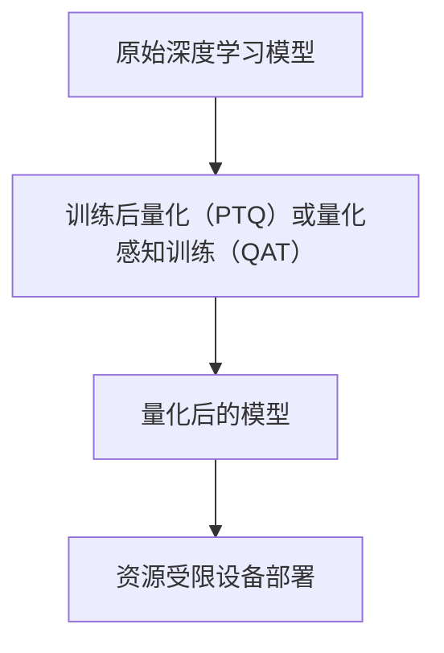

# 模型量化:在资源受限设备上部署AI

> 关键词：模型量化、资源受限设备、AI部署、深度学习、低精度计算

> 摘要：本文围绕模型量化在资源受限设备上部署AI这一主题展开深入探讨。首先介绍了模型量化的背景，包括其目的、适用读者群体、文档结构和相关术语。接着阐述了模型量化的核心概念与联系，通过文本示意图和Mermaid流程图展示其原理和架构。详细讲解了核心算法原理及具体操作步骤，结合Python源代码进行说明。分析了模型量化涉及的数学模型和公式，并举例说明。通过项目实战给出代码实际案例并详细解释。探讨了模型量化的实际应用场景，推荐了相关的学习资源、开发工具框架以及论文著作。最后总结了未来发展趋势与挑战，还设置了常见问题与解答以及扩展阅读和参考资料部分，旨在为开发者在资源受限设备上部署AI提供全面且深入的指导。

## 1. 背景介绍 
### 1.1 目的和范围
随着人工智能技术的飞速发展，深度学习模型在图像识别、自然语言处理等众多领域取得了巨大的成功。然而，这些模型通常具有庞大的参数数量和复杂的计算结构，需要大量的计算资源和内存空间来运行。在资源受限的设备上，如智能手机、物联网设备、嵌入式系统等，直接部署这些模型变得十分困难。模型量化技术应运而生，其目的是通过减少模型参数的表示精度，从而降低模型的存储需求和计算复杂度，使得深度学习模型能够在资源受限的设备上高效运行。

本文的范围涵盖了模型量化的基本概念、核心算法原理、数学模型、实际应用场景以及在资源受限设备上进行AI部署的具体实践。通过对这些内容的详细介绍，帮助读者全面了解模型量化技术，并掌握在资源受限设备上部署AI模型的方法。

### 1.2 预期读者
本文的预期读者主要包括以下几类人群：
- **深度学习开发者**：希望在资源受限的设备上部署深度学习模型，提高模型的运行效率和适用性。
- **嵌入式系统工程师**：负责开发和优化嵌入式设备上的AI应用，需要了解模型量化技术以降低设备的资源消耗。
- **人工智能研究人员**：对模型量化的理论和算法感兴趣，希望深入研究其原理和应用。
- **学生和爱好者**：对人工智能和深度学习有一定的了解，想要学习如何在资源受限的环境中应用这些技术。

### 1.3 文档结构概述
本文将按照以下结构进行组织：
- **核心概念与联系**：介绍模型量化的基本概念、原理和架构，通过文本示意图和Mermaid流程图进行直观展示。
- **核心算法原理 & 具体操作步骤**：详细讲解模型量化的核心算法原理，并给出具体的操作步骤，结合Python源代码进行说明。
- **数学模型和公式 & 详细讲解 & 举例说明**：分析模型量化涉及的数学模型和公式，并通过具体的例子进行详细讲解。
- **项目实战：代码实际案例和详细解释说明**：通过一个实际的项目案例，展示如何在资源受限的设备上使用模型量化技术部署AI模型，包括开发环境搭建、源代码实现和代码解读。
- **实际应用场景**：探讨模型量化在不同领域的实际应用场景，如智能手机、物联网、自动驾驶等。
- **工具和资源推荐**：推荐一些学习模型量化技术的相关资源，包括书籍、在线课程、技术博客和网站，以及开发工具框架和相关论文著作。
- **总结：未来发展趋势与挑战**：总结模型量化技术的发展趋势和面临的挑战，并对未来的研究方向进行展望。
- **附录：常见问题与解答**：解答读者在学习和应用模型量化技术过程中常见的问题。
- **扩展阅读 & 参考资料**：提供一些扩展阅读的材料和参考资料，方便读者进一步深入学习。

### 1.4 术语表
#### 1.4.1 核心术语定义
- **模型量化**：将深度学习模型中的浮点数参数转换为低精度的整数或定点数表示的过程，以减少模型的存储需求和计算复杂度。
- **量化精度**：指量化后的数据所使用的比特数，常见的量化精度有8位、4位等。
- **量化误差**：量化过程中由于精度降低而引入的误差，可能会影响模型的性能。
- **校准**：在量化过程中，通过对少量数据集进行统计分析，确定合适的量化参数，以减小量化误差。
- **资源受限设备**：指计算资源、内存空间、功耗等方面受到限制的设备，如智能手机、物联网设备、嵌入式系统等。

#### 1.4.2 相关概念解释
- **深度学习模型**：由多个神经网络层组成的复杂模型，用于处理和分析大量的数据，如图像、文本、语音等。
- **浮点数**：一种用于表示实数的计算机数据类型，通常使用32位或64位来存储。
- **整数**：计算机中用于表示整数的数据类型，常见的有8位、16位、32位等。
- **定点数**：一种固定小数点位置的数值表示方法，通常用于表示小数。

#### 1.4.3 缩略词列表
- **DNN**：Deep Neural Network，深度神经网络
- **CNN**：Convolutional Neural Network，卷积神经网络
- **RNN**：Recurrent Neural Network，循环神经网络
- **QAT**：Quantization Aware Training，量化感知训练
- **PTQ**：Post-Training Quantization，训练后量化

## 2. 核心概念与联系 

### 2.1 模型量化的基本原理
模型量化的基本思想是将深度学习模型中的浮点数参数转换为低精度的整数或定点数表示。在深度学习模型中，参数通常以32位浮点数（FP32）的形式存储和计算。然而，在实际应用中，尤其是在资源受限的设备上，使用32位浮点数会占用大量的存储和计算资源。通过模型量化，可以将这些参数转换为8位整数（INT8）或更低精度的表示，从而显著减少模型的存储需求和计算复杂度。

### 2.2 模型量化的架构
模型量化的架构主要包括两个阶段：训练后量化（PTQ）和量化感知训练（QAT）。

#### 2.2.1 训练后量化（PTQ）
训练后量化是在模型训练完成后进行的量化操作。其基本步骤如下：
1. **选择量化方法**：常见的量化方法有对称量化和非对称量化。
2. **校准**：通过对少量数据集进行统计分析，确定合适的量化参数，如缩放因子和零点。
3. **量化参数**：将模型中的浮点数参数转换为低精度的整数表示。

#### 2.2.2 量化感知训练（QAT）
量化感知训练是在模型训练过程中引入量化操作，使得模型在训练过程中就能够适应量化带来的误差。其基本步骤如下：
1. **插入量化节点**：在模型的计算图中插入量化节点，模拟量化过程。
2. **训练模型**：使用带有量化节点的模型进行训练，使得模型能够学习到量化带来的误差。
3. **量化参数**：在训练完成后，将模型中的浮点数参数转换为低精度的整数表示。

### 2.3 文本示意图
```plaintext
              +-------------------+
              |   原始深度学习模型  |
              +-------------------+
                      |
                      v
              +-------------------+
              |    训练后量化（PTQ） |
              |  或量化感知训练（QAT） |
              +-------------------+
                      |
                      v
              +-------------------+
              |    量化后的模型    |
              +-------------------+
                      |
                      v
              +-------------------+
              |  资源受限设备部署  |
              +-------------------+
```

### 2.4 Mermaid流程图


## 3. 核心算法原理 & 具体操作步骤 

### 3.1 核心算法原理
模型量化的核心算法主要涉及量化方法和量化参数的确定。

#### 3.1.1 量化方法
常见的量化方法有对称量化和非对称量化。

##### 对称量化
对称量化假设数据分布是对称的，通过一个缩放因子将浮点数映射到整数范围。其公式如下：
$$
q = \text{round}\left(\frac{r}{S}\right)
$$
其中，$r$ 是原始的浮点数，$S$ 是缩放因子，$q$ 是量化后的整数。

##### 非对称量化
非对称量化考虑了数据分布的偏移，除了缩放因子外，还引入了一个零点。其公式如下：
$$
q = \text{round}\left(\frac{r}{S}\right) + Z
$$
其中，$Z$ 是零点。

#### 3.1.2 量化参数的确定
量化参数（缩放因子和零点）的确定通常通过校准过程来完成。校准的目的是找到合适的量化参数，使得量化误差最小。常见的校准方法有最小化均方误差（MSE）、Kullback-Leibler散度（KL散度）等。

### 3.2 具体操作步骤
以下是使用Python和TensorFlow库进行训练后量化的具体操作步骤：

```python
import tensorflow as tf
import numpy as np

# 加载预训练的模型
model = tf.keras.applications.MobileNetV2(weights='imagenet')

# 定义校准数据集
calibration_images = np.random.rand(100, 224, 224, 3).astype(np.float32)

# 定义校准函数
def representative_dataset():
    for image in calibration_images:
        yield [np.expand_dims(image, axis=0)]

# 创建TFLite转换器
converter = tf.lite.TFLiteConverter.from_keras_model(model)

# 启用量化
converter.optimizations = [tf.lite.Optimize.DEFAULT]

# 设置校准数据集
converter.representative_dataset = representative_dataset

# 进行量化
tflite_quant_model = converter.convert()

# 保存量化后的模型
with open('quantized_model.tflite', 'wb') as f:
    f.write(tflite_quant_model)
```

### 3.3 代码解释
1. **加载预训练的模型**：使用 `tf.keras.applications.MobileNetV2` 加载预训练的MobileNetV2模型。
2. **定义校准数据集**：生成一个随机的校准数据集，用于确定量化参数。
3. **定义校准函数**：该函数用于提供校准数据，每次返回一个样本。
4. **创建TFLite转换器**：使用 `tf.lite.TFLiteConverter.from_keras_model` 创建一个TFLite转换器。
5. **启用量化**：通过 `converter.optimizations = [tf.lite.Optimize.DEFAULT]` 启用默认的量化优化。
6. **设置校准数据集**：将校准函数设置为 `converter.representative_dataset`。
7. **进行量化**：调用 `converter.convert()` 进行量化操作。
8. **保存量化后的模型**：将量化后的模型保存为 `quantized_model.tflite` 文件。

## 4. 数学模型和公式 & 详细讲解 & 举例说明 

### 4.1 量化公式
#### 4.1.1 对称量化
对称量化的公式为：
$$
q = \text{round}\left(\frac{r}{S}\right)
$$
其中，$r$ 是原始的浮点数，$S$ 是缩放因子，$q$ 是量化后的整数。

反量化公式为：
$$
r_q = S \cdot q
$$
其中，$r_q$ 是反量化后的浮点数。

#### 4.1.2 非对称量化
非对称量化的公式为：
$$
q = \text{round}\left(\frac{r}{S}\right) + Z
$$
其中，$r$ 是原始的浮点数，$S$ 是缩放因子，$Z$ 是零点，$q$ 是量化后的整数。

反量化公式为：
$$
r_q = S \cdot (q - Z)
$$
其中，$r_q$ 是反量化后的浮点数。

### 4.2 缩放因子和零点的计算
#### 4.2.1 对称量化
对于对称量化，缩放因子 $S$ 的计算公式为：
$$
S = \frac{\text{max}(|r|)}{Q_{\text{max}}}
$$
其中，$\text{max}(|r|)$ 是原始浮点数的绝对值的最大值，$Q_{\text{max}}$ 是量化整数的最大值。

#### 4.2.2 非对称量化
对于非对称量化，缩放因子 $S$ 的计算公式为：
$$
S = \frac{\text{max}(r) - \text{min}(r)}{Q_{\text{max}} - Q_{\text{min}}}
$$
其中，$\text{max}(r)$ 和 $\text{min}(r)$ 分别是原始浮点数的最大值和最小值，$Q_{\text{max}}$ 和 $Q_{\text{min}}$ 分别是量化整数的最大值和最小值。

零点 $Z$ 的计算公式为：
$$
Z = Q_{\text{min}} - \text{round}\left(\frac{\text{min}(r)}{S}\right)
$$

### 4.3 举例说明
假设我们有一组浮点数 $r = [1.2, 2.5, -0.8, 3.0]$，要将其量化为8位整数（$Q_{\text{min}} = -128$，$Q_{\text{max}} = 127$）。

#### 4.3.1 对称量化
1. 计算缩放因子 $S$：
$$
\text{max}(|r|) = 3.0
$$
$$
S = \frac{3.0}{127} \approx 0.0236
$$
2. 量化浮点数：
$$
q_1 = \text{round}\left(\frac{1.2}{0.0236}\right) \approx 51
$$
$$
q_2 = \text{round}\left(\frac{2.5}{0.0236}\right) \approx 106
$$
$$
q_3 = \text{round}\left(\frac{-0.8}{0.0236}\right) \approx -34
$$
$$
q_4 = \text{round}\left(\frac{3.0}{0.0236}\right) \approx 127
$$

#### 4.3.2 非对称量化
1. 计算缩放因子 $S$：
$$
\text{max}(r) = 3.0
$$
$$
\text{min}(r) = -0.8
$$
$$
S = \frac{3.0 - (-0.8)}{127 - (-128)} \approx 0.0149
$$
2. 计算零点 $Z$：
$$
Z = -128 - \text{round}\left(\frac{-0.8}{0.0149}\right) \approx -74
$$
3. 量化浮点数：
$$
q_1 = \text{round}\left(\frac{1.2}{0.0149}\right) + (-74) \approx 81 + (-74) = 7
$$
$$
q_2 = \text{round}\left(\frac{2.5}{0.0149}\right) + (-74) \approx 168 + (-74) = 94
$$
$$
q_3 = \text{round}\left(\frac{-0.8}{0.0149}\right) + (-74) \approx -54 + (-74) = -128
$$
$$
q_4 = \text{round}\left(\frac{3.0}{0.0149}\right) + (-74) \approx 201 + (-74) = 127
$$

## 5. 项目实战：代码实际案例和详细解释说明 

### 5.1  开发环境搭建
#### 5.1.1 安装Python
首先，需要安装Python 3.x版本。可以从Python官方网站（https://www.python.org/downloads/）下载并安装适合自己操作系统的Python版本。

#### 5.1.2 安装TensorFlow
使用以下命令安装TensorFlow：
```sh
pip install tensorflow
```

#### 5.1.3 安装其他依赖库
根据具体项目需求，可能还需要安装其他依赖库，如NumPy、Matplotlib等。可以使用以下命令安装：
```sh
pip install numpy matplotlib
```

### 5.2  源代码详细实现和代码解读
以下是一个使用TensorFlow进行图像分类模型量化并在资源受限设备上部署的完整代码示例：

```python
import tensorflow as tf
import numpy as np
import matplotlib.pyplot as plt
from tensorflow.keras.datasets import cifar10
from tensorflow.keras.models import Sequential
from tensorflow.keras.layers import Conv2D, MaxPooling2D, Flatten, Dense

# 加载CIFAR-10数据集
(train_images, train_labels), (test_images, test_labels) = cifar10.load_data()

# 数据预处理
train_images = train_images / 255.0
test_images = test_images / 255.0

# 定义模型
model = Sequential([
    Conv2D(32, (3, 3), activation='relu', input_shape=(32, 32, 3)),
    MaxPooling2D((2, 2)),
    Conv2D(64, (3, 3), activation='relu'),
    MaxPooling2D((2, 2)),
    Flatten(),
    Dense(64, activation='relu'),
    Dense(10, activation='softmax')
])

# 编译模型
model.compile(optimizer='adam',
              loss='sparse_categorical_crossentropy',
              metrics=['accuracy'])

# 训练模型
model.fit(train_images, train_labels, epochs=5, validation_data=(test_images, test_labels))

# 定义校准数据集
calibration_images = train_images[:100]

# 定义校准函数
def representative_dataset():
    for image in calibration_images:
        yield [np.expand_dims(image, axis=0)]

# 创建TFLite转换器
converter = tf.lite.TFLiteConverter.from_keras_model(model)

# 启用量化
converter.optimizations = [tf.lite.Optimize.DEFAULT]

# 设置校准数据集
converter.representative_dataset = representative_dataset

# 进行量化
tflite_quant_model = converter.convert()

# 保存量化后的模型
with open('quantized_cifar10_model.tflite', 'wb') as f:
    f.write(tflite_quant_model)

# 加载量化后的模型
interpreter = tf.lite.Interpreter(model_content=tflite_quant_model)
interpreter.allocate_tensors()

# 获取输入和输出张量的索引
input_details = interpreter.get_input_details()
output_details = interpreter.get_output_details()

# 选择一个测试样本进行推理
test_image = test_images[0]
test_image = np.expand_dims(test_image, axis=0).astype(np.float32)

# 设置输入张量的值
interpreter.set_tensor(input_details[0]['index'], test_image)

# 进行推理
interpreter.invoke()

# 获取输出张量的值
output_data = interpreter.get_tensor(output_details[0]['index'])

# 显示预测结果
predicted_class = np.argmax(output_data)
class_names = ['airplane', 'automobile', 'bird', 'cat', 'deer',
               'dog', 'frog', 'horse', 'ship', 'truck']
plt.imshow(test_images[0])
plt.title(f'Predicted: {class_names[predicted_class]}')
plt.show()
```

### 5.3  代码解读与分析
#### 5.3.1 数据加载和预处理
使用 `cifar10.load_data()` 加载CIFAR-10数据集，并将图像数据归一化到0到1之间。

#### 5.3.2 模型定义和训练
定义一个简单的卷积神经网络模型，并使用 `model.compile()` 编译模型。然后使用 `model.fit()` 对模型进行训练。

#### 5.3.3 量化操作
定义校准数据集和校准函数，创建TFLite转换器并启用量化。通过 `converter.convert()` 进行量化操作，并将量化后的模型保存为 `quantized_cifar10_model.tflite` 文件。

#### 5.3.4 模型推理
加载量化后的模型，获取输入和输出张量的索引。选择一个测试样本进行推理，设置输入张量的值，调用 `interpreter.invoke()` 进行推理，最后获取输出张量的值并显示预测结果。

## 6. 实际应用场景 
### 6.1 智能手机
在智能手机上，由于计算资源和电池续航的限制，需要高效的AI模型来实现各种功能，如图像识别、语音识别、智能拍照等。模型量化技术可以显著减少模型的存储需求和计算复杂度，使得这些功能能够在智能手机上快速、稳定地运行。

### 6.2 物联网设备
物联网设备通常具有有限的计算资源和内存空间，如智能摄像头、智能传感器等。模型量化技术可以将AI模型部署到这些设备上，实现实时的数据分析和决策，提高设备的智能化水平。

### 6.3 自动驾驶
在自动驾驶领域，需要在车辆上实时处理大量的传感器数据，如摄像头图像、雷达数据等。模型量化技术可以减少模型的计算量和功耗，提高系统的实时性和可靠性，从而保障自动驾驶的安全性。

### 6.4 医疗设备
医疗设备通常对计算资源和功耗有严格的要求，如便携式医疗监测设备、医学影像诊断设备等。模型量化技术可以将AI模型集成到这些设备中，实现疾病的早期诊断和监测，提高医疗服务的效率和质量。

## 7. 工具和资源推荐
### 7.1 学习资源推荐
#### 7.1.1 书籍推荐
- 《深度学习》（Deep Learning）：由Ian Goodfellow、Yoshua Bengio和Aaron Courville合著，是深度学习领域的经典教材，涵盖了深度学习的基本原理、算法和应用。
- 《动手学深度学习》（Dive into Deep Learning）：由阿斯顿·张、李沐等合著，提供了丰富的代码示例和实践项目，适合初学者快速上手深度学习。
- 《神经网络与深度学习》（Neural Networks and Deep Learning）：由Michael Nielsen编写，以通俗易懂的方式介绍了神经网络和深度学习的基本概念和算法。

#### 7.1.2 在线课程
- Coursera上的“深度学习专项课程”（Deep Learning Specialization）：由Andrew Ng教授授课，包括五门课程，涵盖了深度学习的各个方面。
- edX上的“使用TensorFlow进行深度学习”（Deep Learning with TensorFlow）：由Google团队开发，介绍了如何使用TensorFlow构建和训练深度学习模型。
- 哔哩哔哩上的“李宏毅机器学习课程”：由台湾大学李宏毅教授授课，课程内容生动有趣，适合初学者学习。

#### 7.1.3 技术博客和网站
- TensorFlow官方博客（https://blog.tensorflow.org/）：提供了TensorFlow的最新技术动态和应用案例。
- PyTorch官方博客（https://pytorch.org/blog/）：介绍了PyTorch的最新进展和研究成果。
- Medium上的“Towards Data Science”（https://towardsdatascience.com/）：汇集了众多数据科学和机器学习领域的优质文章。

### 7.2 开发工具框架推荐
#### 7.2.1 IDE和编辑器
- PyCharm：一款功能强大的Python集成开发环境，提供了代码编辑、调试、版本控制等功能。
- Visual Studio Code：一款轻量级的代码编辑器，支持多种编程语言，具有丰富的插件生态系统。
- Jupyter Notebook：一种交互式的编程环境，适合进行数据探索和模型实验。

#### 7.2.2 调试和性能分析工具
- TensorBoard：TensorFlow的可视化工具，可用于监控模型的训练过程、可视化模型结构和分析性能指标。
- PyTorch Profiler：PyTorch的性能分析工具，可用于分析模型的计算时间和内存使用情况。
- NVIDIA Nsight Compute：一款针对NVIDIA GPU的性能分析工具，可用于优化深度学习模型在GPU上的运行效率。

#### 7.2.3 相关框架和库
- TensorFlow：Google开发的深度学习框架，提供了丰富的API和工具，支持模型量化和部署。
- PyTorch：Facebook开发的深度学习框架，具有动态图特性，易于使用和调试，也支持模型量化。
- ONNX（Open Neural Network Exchange）：一种开放的神经网络交换格式，可用于在不同的深度学习框架之间转换模型。

### 7.3 相关论文著作推荐
#### 7.3.1 经典论文
- “Deep Compression: Compressing Deep Neural Networks with Pruning, Trained Quantization and Huffman Coding”：提出了一种结合剪枝、量化和哈夫曼编码的深度神经网络压缩方法。
- “Quantization and Training of Neural Networks for Efficient Integer-Arithmetic-Only Inference”：介绍了一种训练后量化的方法，使得模型能够在整数运算下高效推理。
- “MobileNets: Efficient Convolutional Neural Networks for Mobile Vision Applications”：提出了一种轻量级的卷积神经网络架构，适合在移动设备上部署。

#### 7.3.2 最新研究成果
- 在顶级学术会议如NeurIPS、ICML、CVPR等上发表的关于模型量化的最新研究论文，关注最新的算法和技术进展。

#### 7.3.3 应用案例分析
- 一些实际应用案例的研究报告，如在智能手机、物联网、自动驾驶等领域使用模型量化技术的案例分析，可帮助了解模型量化在实际场景中的应用效果和挑战。

## 8. 总结：未来发展趋势与挑战
### 8.1 未来发展趋势
- **更低精度量化**：未来的研究将致力于实现更低精度的量化，如2位、1位量化，以进一步减少模型的存储需求和计算复杂度。
- **自适应量化**：开发自适应量化方法，根据模型的不同层、不同输入数据动态调整量化参数，以提高量化效果。
- **端到端量化训练**：将量化操作融入到模型的端到端训练过程中，使得模型能够更好地适应量化带来的误差，提高模型的性能。
- **硬件协同设计**：与硬件厂商合作，进行硬件协同设计，开发专门支持量化计算的硬件架构，提高量化模型的运行效率。

### 8.2 挑战
- **量化误差控制**：量化过程中引入的误差可能会导致模型性能下降，如何有效地控制量化误差是一个关键挑战。
- **模型复杂度增加**：随着模型复杂度的不断增加，量化方法的设计和优化变得更加困难。
- **硬件兼容性**：不同的硬件平台对量化计算的支持程度不同，如何确保量化模型在各种硬件平台上都能高效运行是一个挑战。
- **数据隐私和安全**：在资源受限设备上部署AI模型时，数据隐私和安全问题需要得到充分重视。

## 9. 附录：常见问题与解答
### 9.1 模型量化会导致模型性能下降吗？
模型量化可能会导致一定的性能下降，因为量化过程中会引入量化误差。然而，通过合理选择量化方法和校准技术，可以在一定程度上控制量化误差，使得模型性能的下降在可接受的范围内。此外，量化感知训练方法可以让模型在训练过程中适应量化带来的误差，从而减少性能下降的影响。

### 9.2 训练后量化和量化感知训练有什么区别？
训练后量化是在模型训练完成后进行的量化操作，不需要重新训练模型，操作相对简单，但可能会导致较大的性能下降。量化感知训练是在模型训练过程中引入量化操作，使得模型能够学习到量化带来的误差，从而在量化后保持较好的性能，但需要重新训练模型，计算成本较高。

### 9.3 如何选择合适的量化精度？
选择合适的量化精度需要综合考虑模型的性能、存储需求和计算复杂度。一般来说，8位量化可以在性能和效率之间取得较好的平衡，适用于大多数场景。如果对存储和计算资源有更严格的要求，可以考虑使用4位或更低精度的量化，但需要注意可能会带来较大的性能下降。

### 9.4 模型量化后如何进行推理？
模型量化后，需要使用支持量化推理的推理引擎进行推理。常见的推理引擎有TensorFlow Lite、PyTorch Mobile等。在进行推理时，需要将输入数据进行相应的量化处理，然后输入到量化后的模型中进行计算，最后将输出结果进行反量化处理得到最终的预测结果。

## 10. 扩展阅读 & 参考资料
### 10.1 扩展阅读
- 《人工智能算法：原理与代码实践》：深入介绍了人工智能领域的各种算法原理，并提供了详细的代码实现。
- 《计算机视觉：算法与应用》：全面介绍了计算机视觉领域的算法和应用，包括图像识别、目标检测等。
- 《自然语言处理入门》：适合初学者了解自然语言处理的基本概念和技术。

### 10.2 参考资料
- TensorFlow官方文档（https://www.tensorflow.org/）
- PyTorch官方文档（https://pytorch.org/docs/stable/index.html）
- ONNX官方文档（https://onnx.ai/）

作者：AI天才研究院/AI Genius Institute & 禅与计算机程序设计艺术 /Zen And The Art of Computer Programming