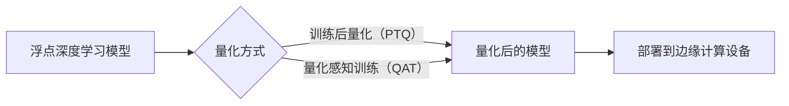

# 模型量化技术在边缘计算设备中的优化策略

> 关键词：模型量化技术、边缘计算设备、优化策略、低精度计算、资源受限设备

> 摘要：本文聚焦于模型量化技术在边缘计算设备中的优化策略。随着边缘计算的发展，边缘设备需要在资源受限的情况下高效运行模型。模型量化技术通过降低模型参数的精度，减少计算量和存储需求，从而提升边缘设备的性能。文章深入探讨了模型量化的核心概念、算法原理、数学模型，通过实际案例展示其应用，并介绍了相关工具和资源。最后，对未来发展趋势与挑战进行了总结，旨在为在边缘计算设备上应用模型量化技术提供全面的指导。

## 1. 背景介绍 
### 1.1 目的和范围
随着物联网、人工智能等技术的快速发展，边缘计算设备的应用越来越广泛。然而，这些设备通常具有有限的计算资源、内存和能量供应。模型量化技术作为一种有效的优化手段，可以显著减少模型的存储需求和计算复杂度，使得在边缘计算设备上部署复杂的深度学习模型成为可能。本文的目的是深入研究模型量化技术在边缘计算设备中的优化策略，涵盖量化的基本原理、算法实现、实际应用场景以及相关工具和资源等方面。

### 1.2 预期读者
本文预期读者包括对边缘计算和模型量化技术感兴趣的研究人员、工程师、开发者以及相关专业的学生。无论是从事边缘设备开发、深度学习模型优化，还是对新兴技术有探索欲望的人员，都可以从本文中获取有价值的信息。

### 1.3 文档结构概述
本文将按照以下结构进行阐述：首先介绍核心概念与联系，包括模型量化的基本原理和架构；接着详细讲解核心算法原理和具体操作步骤，并使用Python代码进行说明；然后介绍数学模型和公式，通过举例加深理解；再通过项目实战展示代码的实际应用和详细解释；之后探讨实际应用场景；推荐相关的工具和资源；最后总结未来发展趋势与挑战，并提供常见问题解答和扩展阅读参考资料。

### 1.4 术语表
#### 1.4.1 核心术语定义
- **模型量化**：将深度学习模型中的浮点参数和计算转换为低精度表示（如整数）的过程，以减少模型的存储需求和计算复杂度。
- **边缘计算设备**：指位于网络边缘的设备，如智能手机、智能摄像头、传感器节点等，具有一定的计算和存储能力，但资源相对受限。
- **低精度计算**：使用比传统浮点运算更低的精度（如8位整数、4位整数）进行计算，以提高计算效率和降低能耗。
- **量化误差**：由于量化过程中对浮点数值进行近似表示而产生的误差，可能会影响模型的性能。

#### 1.4.2 相关概念解释
- **深度学习模型**：一种基于人工神经网络的机器学习模型，通过多层神经元的非线性变换来学习数据的特征和模式。
- **浮点运算**：使用浮点数进行的数学运算，具有较高的精度，但计算复杂度和能耗也相对较高。
- **整数运算**：使用整数进行的数学运算，计算速度快、能耗低，但精度相对较低。

#### 1.4.3 缩略词列表
- **DNN**：深度神经网络（Deep Neural Network）
- **CNN**：卷积神经网络（Convolutional Neural Network）
- **RNN**：循环神经网络（Recurrent Neural Network）
- **FP32**：32位浮点数（Floating Point 32）
- **INT8**：8位整数（Integer 8）

## 2. 核心概念与联系 
### 模型量化的基本原理
模型量化的核心思想是将深度学习模型中的浮点参数和计算转换为低精度表示，通常是整数。在传统的深度学习模型中，参数和中间结果通常使用32位浮点数（FP32）表示，这需要大量的存储和计算资源。而量化后的模型可以使用8位整数（INT8）甚至更低的精度来表示，从而显著减少存储需求和计算复杂度。

量化过程可以分为线性量化和非线性量化。线性量化是最常见的量化方法，它通过一个线性映射将浮点数值映射到整数范围内。具体来说，对于一个浮点数值 $x$，其量化后的整数表示 $q$ 可以通过以下公式计算：
$$q = \lfloor \frac{x}{S} + Z \rfloor$$
其中，$S$ 是缩放因子，$Z$ 是零点偏移，$\lfloor \cdot \rfloor$ 表示向下取整操作。

### 模型量化的架构
模型量化的架构主要包括训练后量化（Post-Training Quantization，PTQ）和量化感知训练（Quantization-Aware Training，QAT）两种。

#### 训练后量化（PTQ）
训练后量化是在模型训练完成后进行的量化操作。这种方法不需要重新训练模型，只需要对训练好的浮点模型进行量化处理。PTQ 的优点是简单快速，不需要额外的训练数据和计算资源，但量化后的模型性能可能会有所下降。

#### 量化感知训练（QAT）
量化感知训练是在模型训练过程中考虑量化的影响。在训练过程中，模拟量化操作，使得模型能够适应量化带来的误差。QAT 的优点是可以获得更好的量化效果，减少量化误差对模型性能的影响，但需要额外的训练数据和计算资源。

### 模型量化与边缘计算设备的联系
边缘计算设备通常具有有限的计算资源、内存和能量供应，无法直接运行大规模的深度学习模型。模型量化技术通过减少模型的存储需求和计算复杂度，使得在边缘计算设备上部署复杂的深度学习模型成为可能。量化后的模型可以在边缘设备上更快地运行，同时降低能耗，提高设备的续航能力。

### 文本示意图
```plaintext
+------------------+        +------------------+
|  浮点深度学习模型  | ----> |  量化后的模型  |
+------------------+        +------------------+
           |                          |
           | 训练后量化（PTQ）         | 部署到边缘计算设备
           | 或量化感知训练（QAT）      |
           +--------------------------+
```

### Mermaid 流程图


## 3. 核心算法原理 & 具体操作步骤 
### 线性量化算法原理
线性量化是最常见的量化方法，其核心思想是通过一个线性映射将浮点数值映射到整数范围内。具体来说，对于一个浮点数值 $x$，其量化后的整数表示 $q$ 可以通过以下公式计算：
$$q = \lfloor \frac{x}{S} + Z \rfloor$$
其中，$S$ 是缩放因子，$Z$ 是零点偏移，$\lfloor \cdot \rfloor$ 表示向下取整操作。

反量化操作则是将量化后的整数表示 $q$ 转换回浮点数值 $x$，其公式为：
$$x = (q - Z) \times S$$

### 训练后量化（PTQ）的具体操作步骤
1. **收集校准数据**：选择一部分代表性的数据集作为校准数据，用于计算缩放因子和零点偏移。
2. **计算缩放因子和零点偏移**：对于每个需要量化的张量，统计其最小值 $x_{min}$ 和最大值 $x_{max}$，然后根据以下公式计算缩放因子 $S$ 和零点偏移 $Z$：
$$S = \frac{x_{max} - x_{min}}{2^b - 1}$$
$$Z = \text{round}(\frac{-x_{min}}{S})$$
其中，$b$ 是量化的位数（如8位整数，$b = 8$），$\text{round}(\cdot)$ 表示四舍五入操作。
3. **量化模型参数**：将模型中的浮点参数按照上述公式进行量化，得到量化后的整数参数。
4. **量化中间结果**：在模型推理过程中，将中间结果也进行量化，使用整数运算代替浮点运算。

### 量化感知训练（QAT）的具体操作步骤
1. **插入量化节点**：在模型的训练图中插入量化节点，模拟量化操作。
2. **训练模型**：使用带有量化节点的模型进行训练，使得模型能够适应量化带来的误差。
3. **调整量化参数**：在训练过程中，不断调整缩放因子和零点偏移，以最小化量化误差。
4. **量化模型**：训练完成后，将模型中的浮点参数和中间结果进行量化，得到量化后的模型。

### Python 代码实现
以下是一个简单的线性量化和反量化的 Python 代码示例：
```python
import numpy as np

def linear_quantize(x, scale, zero_point, bitwidth=8):
    """
    线性量化函数
    :param x: 输入的浮点数值
    :param scale: 缩放因子
    :param zero_point: 零点偏移
    :param bitwidth: 量化的位数
    :return: 量化后的整数数值
    """
    qmin = 0
    qmax = 2**bitwidth - 1
    q = np.round(x / scale + zero_point).clip(qmin, qmax).astype(np.int8)
    return q

def linear_dequantize(q, scale, zero_point):
    """
    线性反量化函数
    :param q: 输入的量化后的整数数值
    :param scale: 缩放因子
    :param zero_point: 零点偏移
    :return: 反量化后的浮点数值
    """
    x = (q - zero_point) * scale
    return x

# 示例数据
x = np.array([1.2, 2.3, 3.4, 4.5], dtype=np.float32)
x_min = np.min(x)
x_max = np.max(x)
bitwidth = 8
scale = (x_max - x_min) / (2**bitwidth - 1)
zero_point = np.round(-x_min / scale).astype(np.int8)

# 量化
q = linear_quantize(x, scale, zero_point, bitwidth)
print("量化后的结果:", q)

# 反量化
x_dequantized = linear_dequantize(q, scale, zero_point)
print("反量化后的结果:", x_dequantized)
```

## 4. 数学模型和公式 & 详细讲解 & 举例说明 
### 线性量化的数学模型
线性量化的数学模型可以表示为：
$$q = \lfloor \frac{x}{S} + Z \rfloor$$
$$x = (q - Z) \times S$$
其中，$x$ 是浮点数值，$q$ 是量化后的整数数值，$S$ 是缩放因子，$Z$ 是零点偏移。

### 缩放因子和零点偏移的计算
缩放因子 $S$ 和零点偏移 $Z$ 的计算是线性量化的关键步骤。对于一个需要量化的张量，其最小值为 $x_{min}$，最大值为 $x_{max}$，量化的位数为 $b$，则缩放因子 $S$ 和零点偏移 $Z$ 可以通过以下公式计算：
$$S = \frac{x_{max} - x_{min}}{2^b - 1}$$
$$Z = \text{round}(\frac{-x_{min}}{S})$$

### 量化误差的计算
量化误差是由于量化过程中对浮点数值进行近似表示而产生的误差。量化误差可以通过以下公式计算：
$$e = x - (q - Z) \times S$$
其中，$e$ 是量化误差，$x$ 是原始浮点数值，$q$ 是量化后的整数数值，$S$ 是缩放因子，$Z$ 是零点偏移。

### 举例说明
假设我们有一个浮点数值 $x = [1.2, 2.3, 3.4, 4.5]$，需要将其量化为8位整数。

1. **计算最小值和最大值**：
$$x_{min} = 1.2$$
$$x_{max} = 4.5$$

2. **计算缩放因子和零点偏移**：
$$S = \frac{4.5 - 1.2}{2^8 - 1} = \frac{3.3}{255} \approx 0.0129$$
$$Z = \text{round}(\frac{-1.2}{0.0129}) \approx -93$$

3. **量化**：
对于 $x = 1.2$，
$$q = \lfloor \frac{1.2}{0.0129} - 93 \rfloor = \lfloor 93 - 93 \rfloor = 0$$
对于 $x = 2.3$，
$$q = \lfloor \frac{2.3}{0.0129} - 93 \rfloor = \lfloor 178 - 93 \rfloor = 85$$
以此类推，得到量化后的结果 $q = [0, 85, 169, 255]$。

4. **反量化**：
对于 $q = 0$，
$$x = (0 + 93) \times 0.0129 = 1.1997 \approx 1.2$$
对于 $q = 85$，
$$x = (85 + 93) \times 0.0129 = 2.2962 \approx 2.3$$
以此类推，得到反量化后的结果 $x_{dequantized} = [1.1997, 2.2962, 3.3926, 4.489]$。

5. **计算量化误差**：
对于 $x = 1.2$，
$$e = 1.2 - 1.1997 = 0.0003$$
对于 $x = 2.3$，
$$e = 2.3 - 2.2962 = 0.0038$$
以此类推，得到量化误差 $e = [0.0003, 0.0038, 0.0074, 0.011]$。

## 5. 项目实战：代码实际案例和详细解释说明 
### 5.1  开发环境搭建
本项目使用 Python 作为开发语言，主要依赖以下库：
- **TensorFlow**：一个开源的深度学习框架，用于构建和训练深度学习模型。
- **NumPy**：一个用于科学计算的 Python 库，提供了高效的数组操作和数学函数。

可以使用以下命令安装所需的库：
```bash
pip install tensorflow numpy
```

### 5.2  源代码详细实现和代码解读
以下是一个使用 TensorFlow 进行训练后量化的代码示例：
```python
import tensorflow as tf
import numpy as np

# 构建一个简单的神经网络模型
model = tf.keras.Sequential([
    tf.keras.layers.Dense(10, activation='relu', input_shape=(784,)),
    tf.keras.layers.Dense(1, activation='sigmoid')
])

# 编译模型
model.compile(optimizer='adam',
              loss='binary_crossentropy',
              metrics=['accuracy'])

# 生成一些示例数据
x_train = np.random.rand(1000, 784).astype(np.float32)
y_train = np.random.randint(0, 2, 1000).astype(np.float32)

# 训练模型
model.fit(x_train, y_train, epochs=5, batch_size=32)

# 训练后量化
converter = tf.lite.TFLiteConverter.from_keras_model(model)
converter.optimizations = [tf.lite.Optimize.DEFAULT]
tflite_quant_model = converter.convert()

# 保存量化后的模型
with open('quantized_model.tflite', 'wb') as f:
    f.write(tflite_quant_model)

# 加载量化后的模型并进行推理
interpreter = tf.lite.Interpreter(model_content=tflite_quant_model)
interpreter.allocate_tensors()

# 获取输入和输出张量的索引
input_details = interpreter.get_input_details()
output_details = interpreter.get_output_details()

# 准备输入数据
input_data = np.random.rand(1, 784).astype(np.float32)

# 设置输入张量的值
interpreter.set_tensor(input_details[0]['index'], input_data)

# 进行推理
interpreter.invoke()

# 获取输出张量的值
output_data = interpreter.get_tensor(output_details[0]['index'])
print("推理结果:", output_data)
```

### 代码解读与分析
1. **构建和训练模型**：使用 TensorFlow 的 Keras API 构建一个简单的神经网络模型，并使用示例数据进行训练。
2. **训练后量化**：使用 `tf.lite.TFLiteConverter` 将训练好的 Keras 模型转换为 TensorFlow Lite 模型，并开启量化优化。
3. **保存量化后的模型**：将量化后的 TensorFlow Lite 模型保存到本地文件。
4. **加载量化后的模型并进行推理**：使用 `tf.lite.Interpreter` 加载量化后的模型，并进行推理。

通过训练后量化，模型的存储需求和计算复杂度会显著降低，从而可以在边缘计算设备上更高效地运行。

## 6. 实际应用场景 
### 智能摄像头
智能摄像头是边缘计算设备的典型应用之一。在智能摄像头中，需要实时对视频流进行分析，如目标检测、人脸识别等。由于摄像头的计算资源和存储容量有限，使用模型量化技术可以将深度学习模型的大小和计算量降低，从而实现实时处理。例如，通过将目标检测模型量化为8位整数，可以在不显著降低检测精度的情况下，提高模型的推理速度，减少能耗。

### 智能手机
智能手机也是边缘计算设备的重要组成部分。在智能手机中，需要运行各种深度学习应用，如语音识别、图像分类等。使用模型量化技术可以使这些应用在手机上更高效地运行，减少对网络的依赖。例如，将语音识别模型量化后，可以在手机本地进行语音识别，提高识别速度和隐私性。

### 工业物联网设备
工业物联网设备通常部署在工业生产环境中，需要对传感器数据进行实时分析和处理。由于工业环境的复杂性和设备的资源限制，使用模型量化技术可以将深度学习模型部署到这些设备上，实现实时监测和故障诊断。例如，通过将设备故障预测模型量化，可以在工业传感器节点上实时运行模型，及时发现设备故障，提高生产效率。

### 智能穿戴设备
智能穿戴设备如智能手表、智能手环等，具有有限的计算资源和电池续航能力。使用模型量化技术可以将健康监测模型、运动识别模型等部署到这些设备上，实现实时健康监测和运动分析。例如，将心率监测模型量化后，可以在智能手表上实时运行模型，准确监测心率变化，同时延长设备的电池续航时间。

## 7. 工具和资源推荐
### 7.1 学习资源推荐
#### 7.1.1 书籍推荐
- 《深度学习》（Deep Learning）：由 Ian Goodfellow、Yoshua Bengio 和 Aaron Courville 所著，是深度学习领域的经典教材，涵盖了深度学习的基本原理、算法和应用。
- 《Python 深度学习》（Deep Learning with Python）：由 Francois Chollet 所著，以 Python 和 Keras 为基础，介绍了深度学习的实践方法和应用案例。
- 《动手学深度学习》（Dive into Deep Learning）：由 Aston Zhang、Zack C. Lipton、Mu Li 和 Alexander J. Smola 所著，提供了丰富的代码示例和实践教程，适合初学者学习。

#### 7.1.2 在线课程
- Coursera 上的“深度学习专项课程”（Deep Learning Specialization）：由 Andrew Ng 教授授课，涵盖了深度学习的多个领域，包括神经网络、卷积神经网络、循环神经网络等。
- edX 上的“人工智能基础”（Introduction to Artificial Intelligence）：介绍了人工智能的基本概念、算法和应用，包括深度学习、机器学习等内容。
- 哔哩哔哩上的“李沐深度学习”：由李沐教授讲解，通过生动的视频和代码示例，介绍了深度学习的原理和实践。

#### 7.1.3 技术博客和网站
- Medium 上的 Towards Data Science：一个专注于数据科学和机器学习的技术博客，提供了大量的深度学习相关文章和教程。
- TensorFlow 官方博客：提供了 TensorFlow 框架的最新动态、技术文章和应用案例。
- PyTorch 官方博客：提供了 PyTorch 框架的最新动态、技术文章和应用案例。

### 7.2 开发工具框架推荐
#### 7.2.1 IDE和编辑器
- PyCharm：一个功能强大的 Python 集成开发环境，提供了代码编辑、调试、版本控制等功能。
- Visual Studio Code：一个轻量级的代码编辑器，支持多种编程语言，具有丰富的插件生态系统。
- Jupyter Notebook：一个交互式的笔记本环境，适合进行数据探索、模型训练和可视化。

#### 7.2.2 调试和性能分析工具
- TensorBoard：TensorFlow 提供的可视化工具，可以用于监控模型训练过程、查看模型结构和分析性能指标。
- PyTorch Profiler：PyTorch 提供的性能分析工具，可以用于分析模型的计算时间、内存使用等性能指标。
- NVIDIA Nsight Systems：一个用于分析 GPU 应用程序性能的工具，可以帮助开发者优化模型在 GPU 上的运行效率。

#### 7.2.3 相关框架和库
- TensorFlow：一个开源的深度学习框架，提供了丰富的工具和库，支持模型量化、模型压缩等优化技术。
- PyTorch：一个开源的深度学习框架，具有动态图和静态图两种模式，支持模型量化和量化感知训练。
- ONNX：一个开放的神经网络交换格式，可以用于在不同的深度学习框架之间转换模型，支持模型量化。

### 7.3 相关论文著作推荐
#### 7.3.1 经典论文
- “Deep Compression: Compressing Deep Neural Networks with Pruning, Trained Quantization and Huffman Coding”：提出了一种深度压缩方法，包括剪枝、量化和霍夫曼编码，用于减少深度学习模型的存储需求和计算复杂度。
- “Quantization and Training of Neural Networks for Efficient Integer-Arithmetic-Only Inference”：介绍了一种量化感知训练方法，通过在训练过程中模拟量化操作，使得模型能够适应量化带来的误差。
- “EfficientNet: Rethinking Model Scaling for Convolutional Neural Networks”：提出了一种高效的模型缩放方法，通过同时缩放模型的深度、宽度和分辨率，提高模型的性能和效率。

#### 7.3.2 最新研究成果
- 关注 arXiv 上的最新论文，特别是关于模型量化、边缘计算和深度学习优化的研究成果。
- 参加相关的学术会议，如 NeurIPS、ICML、CVPR 等，了解最新的研究动态和技术进展。

#### 7.3.3 应用案例分析
- 研究一些实际应用案例，如智能摄像头、智能手机、工业物联网等领域的模型量化应用，了解如何在实际场景中应用模型量化技术。
- 参考一些开源项目，如 TensorFlow Lite、PyTorch Mobile 等，学习如何使用这些框架进行模型量化和部署。

## 8. 总结：未来发展趋势与挑战
### 未来发展趋势
- **更低精度量化**：随着技术的不断发展，未来可能会出现更低精度的量化方法，如4位整数、2位整数甚至1位整数量化，进一步减少模型的存储需求和计算复杂度。
- **自适应量化**：自适应量化方法可以根据模型的不同层、不同输入数据等因素，动态调整量化参数，从而在保证模型性能的前提下，最大限度地减少量化误差。
- **硬件支持**：硬件厂商将越来越重视对模型量化技术的支持，开发专门的硬件加速器，以提高量化模型的计算效率和能耗比。
- **跨平台部署**：模型量化技术将与跨平台部署技术相结合，使得量化后的模型可以在不同的边缘计算设备上高效运行，实现真正的端到端智能。

### 挑战
- **量化误差控制**：量化误差是模型量化技术面临的主要挑战之一。如何在减少模型存储需求和计算复杂度的同时，控制量化误差对模型性能的影响，是未来研究的重点。
- **模型性能评估**：传统的模型性能评估指标（如准确率、召回率等）在量化模型中可能不再适用。需要开发新的评估指标和方法，以准确评估量化模型的性能。
- **硬件适配**：不同的边缘计算设备具有不同的硬件架构和计算能力，如何将量化模型适配到不同的硬件设备上，是一个具有挑战性的问题。
- **安全和隐私问题**：在边缘计算设备上部署量化模型，需要考虑安全和隐私问题。如何保证模型的安全性和数据的隐私性，是未来需要解决的重要问题。

## 9. 附录：常见问题与解答
### 1. 模型量化会对模型性能产生多大影响？
模型量化可能会对模型性能产生一定的影响，具体影响程度取决于量化的精度、量化方法和模型本身的复杂度。一般来说，使用较低精度的量化（如8位整数）会导致模型性能略有下降，但通过量化感知训练等方法，可以在一定程度上减少这种影响。

### 2. 训练后量化和量化感知训练有什么区别？
训练后量化是在模型训练完成后进行的量化操作，不需要重新训练模型，简单快速，但量化后的模型性能可能会有所下降。量化感知训练是在模型训练过程中考虑量化的影响，通过模拟量化操作，使得模型能够适应量化带来的误差，从而获得更好的量化效果，但需要额外的训练数据和计算资源。

### 3. 如何选择合适的量化方法？
选择合适的量化方法需要考虑多个因素，如模型的复杂度、量化的精度要求、计算资源和时间限制等。如果计算资源有限，且对模型性能的要求不是很高，可以选择训练后量化方法；如果对模型性能有较高的要求，且有足够的计算资源和训练数据，可以选择量化感知训练方法。

### 4. 模型量化后如何进行推理？
模型量化后，可以使用专门的推理引擎（如 TensorFlow Lite、PyTorch Mobile 等）进行推理。这些推理引擎支持量化模型的高效运行，通过整数运算代替浮点运算，提高推理速度和降低能耗。

### 5. 模型量化技术可以应用于哪些类型的深度学习模型？
模型量化技术可以应用于各种类型的深度学习模型，如卷积神经网络（CNN）、循环神经网络（RNN）、深度神经网络（DNN）等。不同类型的模型在量化过程中可能会有一些差异，但基本原理是相同的。

## 10. 扩展阅读 & 参考资料
- Goodfellow, I., Bengio, Y., & Courville, A. (2016). Deep Learning. MIT Press.
- Chollet, F. (2018). Deep Learning with Python. Manning Publications.
- Zhang, A., Lipton, Z. C., Li, M., & Smola, A. J. (2020). Dive into Deep Learning.
- Han, S., Mao, H., & Dally, W. J. (2015). Deep Compression: Compressing Deep Neural Networks with Pruning, Trained Quantization and Huffman Coding. arXiv preprint arXiv:1510.00149.
- Jacob, B., Kligys, S., Chen, B., Zhu, M., Tang, M., Howard, A.,... & Adam, H. (2018). Quantization and Training of Neural Networks for Efficient Integer-Arithmetic-Only Inference. arXiv preprint arXiv:1712.05877.
- Tan, M., & Le, Q. V. (2019). EfficientNet: Rethinking Model Scaling for Convolutional Neural Networks. In Proceedings of the IEEE/CVF Conference on Computer Vision and Pattern Recognition (pp. 6105-6114).

作者：AI天才研究院/AI Genius Institute & 禅与计算机程序设计艺术 /Zen And The Art of Computer Programming